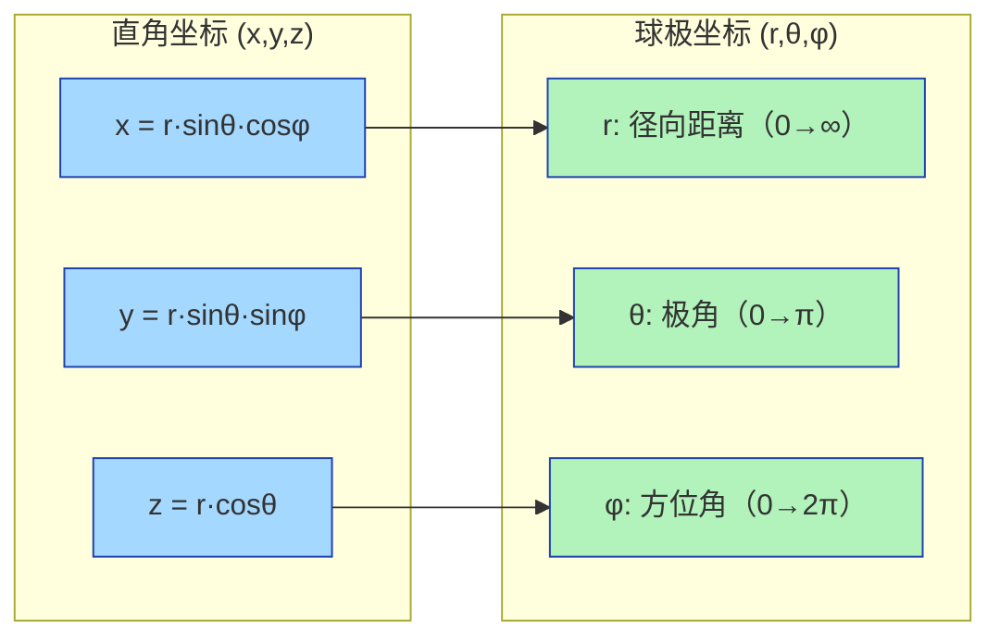
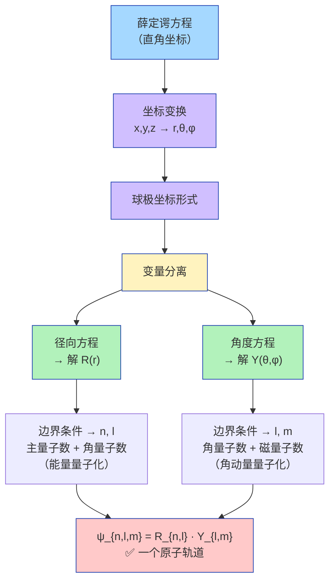

# 薛定谔方程坐标变换：直角坐标 → 球极坐标

## 坐标变换关系

## 薛定谔方程的形式演变

### 直角坐标形式（三维含时）

$$\frac{\partial^2 \psi}{\partial x^2} + \frac{\partial^2 \psi}{\partial y^2} + \frac{\partial^2 \psi}{\partial z^2} + \frac{8\pi^2 m}{h^2}(E - V)\psi = 0$$

其中势能项 $V = -\frac{Ze^2}{4\pi\varepsilon_0 r}$（原子核对电子的库仑吸引）

### 球极坐标形式

$$\left[\frac{1}{r^2}\frac{\partial}{\partial r}\left(r^2\frac{\partial}{\partial r}\right) + \frac{1}{r^2\sin\theta}\frac{\partial}{\partial\theta}\left(\sin\theta\frac{\partial}{\partial\theta}\right) + \frac{1}{r^2\sin^2\theta}\frac{\partial^2}{\partial\varphi^2}\right]\psi + \frac{8\pi^2 m}{h^2}\left(E - \frac{Ze^2}{r}\right)\psi = 0$$

### 变量分离

将 $\psi$ 分解为径向 × 角度两部分：

$$\boxed{\psi_{n,l,m}(r,\theta,\varphi) = R_{n,l}(r) \cdot Y_{l,m}(\theta,\varphi)}$$

## 关键认识

### 量子数不是人为假定的

> 求解Schrödinger方程时，为了使波函数满足**有限、单值、连续**的物理条件，$n,l,m$ 必须取特定整数值。量子数是**边界条件的数学结果**，而非人为假定。

| 量子数 | 来源 | 物理意义 |
|:---|:---|:---|
| $n$（主量子数）| 径向方程 $R_{n,l}$ 的边界条件 | 决定能量大小（$E_n \propto -1/n^2$）|
| $l$（角量子数）| 径向方程中多项式次数限制 | 决定角动量大小（$|L| = \sqrt{l(l+1)}\hbar$）|
| $m_l$（磁量子数）| 角度方程 $Y_{l,m}$ 的周期性条件 | 决定角动量在z轴的分量（$L_z = m_l\hbar$）|

### 为什么 $l$ ≤ $n-1$？

因为径向波函数 $R_{n,l}(r)$ 的多项式中，最高次数为 $(n-l-1)$。若 $l > n-1$，多项式无意义——**这是数学约束，不是人为规定**。
