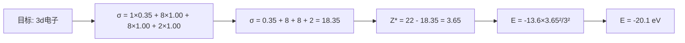

# Slater规则计算流程图

```mermaid
flowchart TD
    A[开始: 确定目标电子] --> B[将电子按 Slater 分组]
    B --> C[1s | 2s2p | 3s3p | 3d | 4s4p | 4d | 4f | ...]
    
    C --> D{被屏蔽电子是 ns/np 还是 nd/nf?}
    
    D -->|ns 或 np| E[右侧各组电子 σ = 0]
    D -->|nd 或 nf| F[右侧各组电子 σ = 0]
    
    E --> G[同组电子: 每个贡献 0.35<br>（1s 组内为 0.30）]
    F --> H[同组电子: 每个贡献 0.35]
    
    G --> I[n-1 层电子: 每个贡献 0.85]
    H --> J[左侧所有电子: 每个贡献 1.00]
    
    I --> K[更内层电子: 每个贡献 1.00]
    
    K --> L[计算 σ = 各项之和]
    J --> L
    
    L --> M[计算 Z* = Z - σ]
    M --> N[计算 E = -13.6 × Z*²/n²]
    N --> O[输出: σ, Z*, E]
    
    style A fill:#a5d8ff,stroke:#1e40af
    style B fill:#d0bfff,stroke:#1e40af
    style C fill:#ffd8a8,stroke:#1e40af
    style D fill:#fff3bf,stroke:#1e40af
    style L fill:#b2f2bb,stroke:#1e40af
    style M fill:#b2f2bb,stroke:#1e40af
    style N fill:#b2f2bb,stroke:#1e40af
    style O fill:#ffc9c9,stroke:#1e40af
```

## Slater规则记忆口诀

> **右不看，同0.35（1s 0.30），
> ns/np：减一层0.85，再内全1.00，
> nd/nf：左边全都1.00，
> 总和σ，Z减σ得Z*，代入公式算能量。**

## 计算示例流程

### Na 原子（Z=11）
分组: (1s)²(2s,2p)⁸(3s)¹


### Ti 原子（Z=22）
分组: (1s)²(2s,2p)⁸(3s,3p)⁸(3d)²(4s)²

**计算3d电子：**


> **结果解读**：Ti的3p（Z*=10.75, E=-174.6eV）与3d（Z*=3.65, E=-20.1eV）同层能量相差近9倍——这是能级分裂和Cotton图中不同轨道能量随Z变化速率差异的定量来源。
