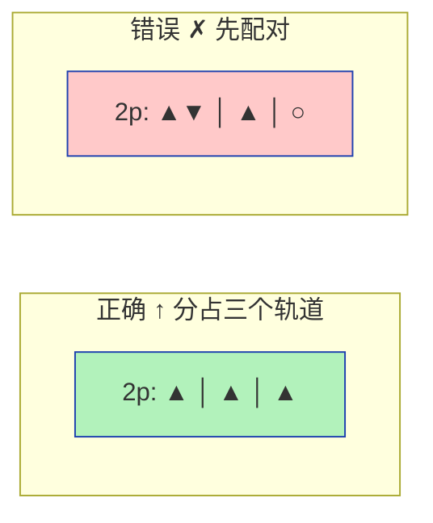
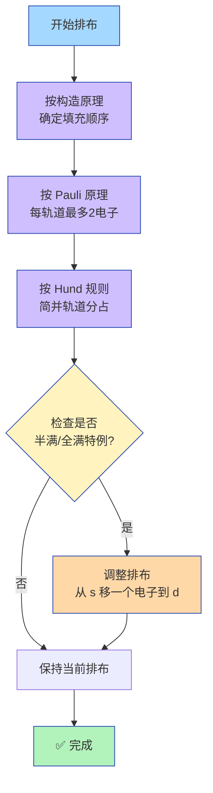

# 电子排布三原则

## 原则一：构造原理（Aufbau Principle）

```mermaid
flowchart LR
    A[1s²] --> B[2s²] --> C[2p⁶] --> D[3s²] --> E[3p⁶]
    E --> F[4s²] --> G[3d¹⁰] --> H[4p⁶]
    H --> I[5s²] --> J[4d¹⁰] --> K[5p⁶]
    K --> L[6s²] --> M[4f¹⁴] --> N[5d¹⁰] --> O[6p⁶]
    O --> P[7s²] --> Q[5f¹⁴] --> R[6d¹⁰] --> S[7p⁶]
    
    style A fill:#b2f2bb,stroke:#1e40af
    style F fill:#ffd8a8,stroke:#1e40af
    style G fill:#ffd8a8,stroke:#1e40af
```

> **口诀**：电子填入先低能，能级组内按顺序。1s→2s→2p→3s→3p→4s→3d→4p→5s→4d→5p→6s→4f→5d→6p→7s→5f→6d→7p

## 原则二：Pauli不相容原理

> **同一原子中，无四个量子数完全相同的两个电子。**

$$\text{每个原子轨道最多容纳 } \boxed{2} \text{ 个自旋相反的电子}$$

## 原则三：Hund规则

> **电子在简并轨道上分占不同轨道，自旋平行。**

### 示例：N原子（Z=7）2p³的填充

### 特例：半满/全满额外稳定

| 构型 | 状态 | 额外稳定 | 代表元素 |
|:---:|:---:|:---:|:---|
| p³, d⁵, f⁷ | **半满** | 交换能最大 | N, Cr, Mo |
| p⁶, d¹⁰, f¹⁴ | **全满** | 闭壳层 | Ne, Zn, Cu, Ag |
| p⁰, d⁰, f⁰ | **全空** | 无电子 | (不在讨论范围) |

### 三原则综合应用

