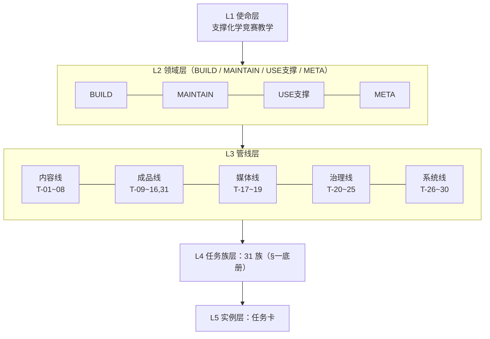
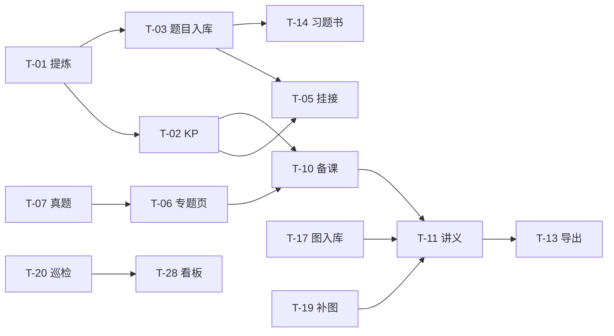

# 知识库任务网络 · 任务族底册与五层骨架

> **用途**：回答"这个库一共有哪几类任务、每类依赖什么信息、产出给谁、任务之间谁供给谁"。是 [[Agent任务分解指南]]（怎么拆）与 [[活跃任务]]（现在有什么活）之间的**分类学层**。
> **读取时机**：接到跨任务族的复合任务需要定位归属时；规划阶段需要判断前置任务与门禁时；出现新任务类型需要入册时。
> **页面边界**：本页只做任务分类与依赖建模。当前活跃状态去 [[活跃任务]]；拆分与批次策略去 [[Agent任务分解指南]]；长期优先级去 [[Agent战略方向]]。

## 〇、设计决策记录（2026-09-01 用户确认）

1. **任务 = 可复用任务族（T-xx）**，一次性实例挂叶（任务卡），实例变化不冲垮结构。
2. **多视图多网络**：同一底册被多套标准切分；底册是唯一锚点，视图间必须对得上。
3. **底册编制** = 五条管线正向归纳 + 历史任务卡反向校验，共 **31 族**。
4. CRUD 本库实际为 **增 / 查 / 改 / 降**——"删"按库规为降级归档（deprecated + superseded_by），物理删除不存在。
5. **角色轴**：主角色 = **成功标准持有者**（谁判不合格即失败），单一主标签 + 次要受益者备注。
6. **信息源 5 类**（外部源 / 库内资产 / 规则模板 / 状态指标 / 用户决策），任务按依赖画像聚 6 型（转录 / 组装 / 核验 / 修复 / 裁决 / 派生）。
7. **依赖边 4 形式**：供给（→数据流）、门禁（→合规闸）、质量耦合（↔同步义务）、触发（事件驱动）；只在任务族间标边；**共享信息源 ≠ 依赖**（都读 KP 的两个任务互不依赖，除非一方的产出改变另一方读到的内容）。
8. **形态**：L1–L5 主骨架 + 属性侧视图，落独立系统页。

## 一、任务底册（31 族）

> **同族判据**：输入类型 × 核心动作 × 验收标准 三者一致才归同族。
> **信息画像记法**：`信息源·任务型·单/多源`。信息源编号：①外部源材料（教材/真题/网课 OCR）②库内内容资产（KP/题目/专题/图）③规则与模板（SOP/规范/validate 规则）④状态与指标（巡检/审计/看板/任务卡）⑤用户决策（轮次边界/优先级/裁决）。

### 内容线（内容资产建设，8 族）

| ID | 任务族 | 操作 | 对象 | 主角色(备注) | 信息画像 |
|---|---|---|---|---|---|
| T-01 | 资料提炼 | 增 | 提炼笔记 | agent(教师抽检) | ①③·转录·多源 |
| T-02 | KP 建设与填充 | 增 | 知识点 | agent(教师验教学正确性) | ①②③·组装·多源 |
| T-03 | 题目入库 | 增 | 题库题目 | agent | ①③·转录·单源 |
| T-04 | 答案与解析补全 | 改 | 题目 | agent | ①④·修复·单源对照 |
| T-05 | 交叉链接挂接 | 改 | KP↔题目↔考纲链接 | agent | ②·组装·多源 |
| T-06 | 专题页建设 | 增 | 专题页 | 教师(agent 执行) | ①②③·组装·多源 |
| T-07 | 真题提炼入库 | 增 | 真题 | agent | ①③·转录·单源 |
| T-08 | 考纲条目维护 | 改 | 考纲条目 | 教师(agent 执行) | ②③·核验组装·多源 |

### 成品线（教学产出与支撑，9 族）

| ID | 任务族 | 操作 | 对象 | 主角色(备注) | 信息画像 |
|---|---|---|---|---|---|
| T-09 | 教学逻辑提炼与洞察沉淀 | 增 | 提炼页/教学洞察 | 教师 | ①⑤·组装裁决·多源 |
| T-10 | 备课大纲生成 | 增 | 备课大纲 | 教师 | ②③⑤·组装·多源 |
| T-11 | 学生讲义生产 | 增 | 讲义 md | 学生 | ②③⑤·组装·多源 |
| T-12 | 讲义校验与迁移 | 改 | 讲义 | 学生(agent 执行) | ③④·核验修复 |
| T-13 | Word/PDF 导出 | 增 | docx/pdf | 学生 | ②③·派生·单源投射 |
| T-14 | 习题书构建 | 增 | 习题书 | 学生(教师版备注) | ②③④·派生组装·多源 |
| T-15 | 检索与组装支撑 | 查 | 服务(无新资产) | agent | ②·检索 |
| T-16 | 学生侧材料组织 | 增 | 学生侧材料 | 学生 | ②③·派生 |
| T-31 | 学生反馈回流 | 改 | 质量标准/任务卡 | 教师 | ⑤·裁决(阻塞：真实学生) |

### 媒体线（图片资产，3 族）

| ID | 任务族 | 操作 | 对象 | 主角色(备注) | 信息画像 |
|---|---|---|---|---|---|
| T-17 | 图片入库与登记 | 增 | 媒体图片/索引 | agent | ①③·转录·单源 |
| T-18 | 图片视觉核验 | 改 | 图片/可信索引 | 学生(教师复核) | ④+人工视觉·核验 |
| T-19 | 配图补缺与自制 | 增 | 图片 | 学生 | ④⑤·修复(外部依赖：ChemDraw) |

### 治理线（库健康，6 族）

| ID | 任务族 | 操作 | 对象 | 主角色(备注) | 信息画像 |
|---|---|---|---|---|---|
| T-20 | 定期巡检 | 查 | 全库状态报告 | 教师(agent 消费) | ③④·核验 |
| T-21 | 断链治理 | 改 | 链接 | agent | ④②·修复 |
| T-22 | Schema/frontmatter 治理 | 改 | 元数据 | agent | ③④·修复 |
| T-23 | 降级与归档处置 | 降 | 任意资产 | 教师 | ④⑤·裁决 |
| T-24 | 内容对账与保真 | 改 | 题目/KP | agent(教师裁决真错) | ①④·核验修复 |
| T-25 | 重复与合并治理 | 改 | 题目/KP | 教师 | ④⑤·裁决修复 |

### 系统线（自举，5 族）

| ID | 任务族 | 操作 | 对象 | 主角色(备注) | 信息画像 |
|---|---|---|---|---|---|
| T-26 | SOP 与模板维护 | 改 | SOP/模板 | agent(下游执行顺畅) | ③⑤·裁决改 |
| T-27 | 脚本与管线开发 | 增 | 脚本工具 | agent | ③·自举开发 |
| T-28 | 索引与看板维护 | 改 | 索引/看板/雷达 | agent(教师决策备注) | ②④·派生 |
| T-29 | 任务卡与日志同步 | 增 | 任务卡/日志 | agent | ④·管理 |
| T-30 | 方向与优先级决策 | 改 | 战略方向 | 教师 | ④⑤·裁决 |

> **扩展形态备注**：PPT / 教具 / 工具卡 / 评分表属于 T-13 的扩展形态，当前 blocked（后续研究项），不单独立族。

## 二、主骨架（L1–L5，抽象从高到低）

| 层 | 名称 | 划分依据 |
|---|---|---|
| L1 | **使命层** | 库存在的唯一目的：**支撑化学竞赛教学**（内容生产 + 课堂传授） |
| L2 | **领域层** | 任务受益领域，对齐既有四分法：**BUILD** 内容建设 / **MAINTAIN** 库治理 / **USE 支撑** 教学产出 / **META** 系统自举 |
| L3 | **管线层** | 信息/资产的流动供给链：内容线、成品线、媒体线、治理线、系统线 |
| L4 | **任务族层** | 最小可复用交付单元（本页 §一 的 31 族）；同族判据=输入×动作×验收一致 |
| L5 | **实例层** | 一次具体执行 = 任务卡（`00-首页/活跃任务/`），建议新卡 frontmatter 带 `task_family: T-xx` 挂叶 |

## 三、属性侧视图

### 3.1 按操作（增查改降）

- **增（14）**：T-01, 02, 03, 06, 07, 09, 10, 11, 13, 14, 16, 17, 19, 27
- **查（2）**：T-15, 20 —— 注：查还**内嵌于一切核验子步骤**（对账、巡检、preflight 本质都是查），独立成族的只有"检索服务"与"定期巡检"
- **改（14）**：T-04, 05, 08, 12, 18, 21, 22, 24, 25, 26, 28, 29, 30, 31
- **降（1）**：T-23（库规：删 = 降级归档，deprecated + superseded_by，永不物理删除）

> 增改常同体（填充类任务既建又改），按**主交付物**归类：新建出独立资产记增，修补既有资产记改。

### 3.2 按操作对象（9 类）

| 对象大类 | 任务族 |
|---|---|
| 题库资产 | T-03, 04, 07, 24, 25 |
| 知识点/考纲 | T-02, 08 |
| 提炼与洞察 | T-01, 09 |
| 专题页 | T-06 |
| 备课/讲义/学生侧 | T-10, 11, 12, 16, 31 |
| 成书与导出 | T-13, 14 |
| 图片媒体 | T-17, 18, 19 |
| 链接/元数据/索引 | T-05, 15, 21, 22, 28 |
| 系统资产 | T-23, 26, 27, 29, 30 |

### 3.3 按主角色（成功标准持有者）

- **agent（15）**：T-01, 02, 03, 04, 05, 07, 15, 17, 21, 22, 24, 26, 27, 28, 29 —— 供给下游任务的结构化资产、工具与元数据
- **教师/所有者（9）**：T-06, 08, 09, 10, 20, 23, 25, 30, 31 —— 教学正确性、方向与处置的裁决方
- **学生（7）**：T-11, 12, 13, 14, 16, 18, 19 —— 直接使用的成品

## 四、依赖边（任务族之间）

### 4.1 供给依赖（A 的产物是 B 的输入，A→B）

- T-01→T-02、T-01→T-03、T-07→T-06：源材料经转录进入资产库
- T-02/T-03→T-05：资产就位才能挂接
- T-02/T-06→T-10→T-11→T-13：备课主干供给链
- T-03→T-14：题库供给成书
- T-17/T-19→T-11：图片供给讲义
- T-20→T-28：巡检数据供给看板
- T-02/T-03/T-06→T-15：全部内容资产供给检索服务（不逐条画）

### 4.2 门禁依赖（A 未通过则 B 被拒绝，A⇢B）

- T-20 ⇢ T-13 / T-14：`validate_kb` 0 error 基线是重建 Word 成品的前置闸
- T-12 ⇢ T-13：讲义 precheck 0 error 才出 docx
- T-22 ⇢ T-14：frontmatter 六字段合规是构建 gather 的输入条件

### 4.3 质量耦合（同源修改须同步，A↔B）

- T-02 ↔ T-21：KP 改名/拆分 → 链接断 → 断链治理跑；治理发现 → 回流命名规范
- T-03/T-04 ↔ T-28：题库字段变更 → 索引/看板/溯源映射重算
- T-06 ↔ T-05：专题页密度升级 ↔ 挂接补齐互为要求
- T-26 ↔ T-12/T-22：规范变更 → 校验口径同步

### 4.4 触发依赖（状态/事件驱动，⤳）

- T-20 报告异常 ⤳ T-21 / T-22 / T-24 / T-25（修复族按异常类型分派）
- T-18 误判/错配 ⤳ T-19（补图触发）
- T-15 检索命中缺口 ⤳ T-02 / T-03（备课时发现缺 KP/题 → 补建）
- T-31 反馈 ⤳ T-10 / T-11 修订 + T-30 方向调整

### 4.5 外部阻塞（不是边，单列）

T-19（ChemDraw/计算化学依赖外部工具）、T-31（等待真实学生）、T-14 实例"题-033"（纸质原书）、⑤类用户决策（轮次边界、试印版保留等）。

## 五、维护规则

1. **立新族条件**：输入×动作×验收三者与现有 31 族都不同，才允许立新族；按所属管线顺延编号，同步更新 §一底册与三张侧视图。
2. **实例挂叶**：新任务卡 frontmatter 建议 `task_family: T-xx`；存量卡不强制回填。
3. **更新触发时机**：管线新增节点 / 出现第 4 种之外的新依赖形式 / L2 领域四分法调整时。
4. **与其他页面分工**：活跃状态→[[活跃任务]]；怎么拆→[[Agent任务分解指南]]；长期优先级→[[Agent战略方向]]；执行状态机→[[知识库日常操作过程建模]]。
