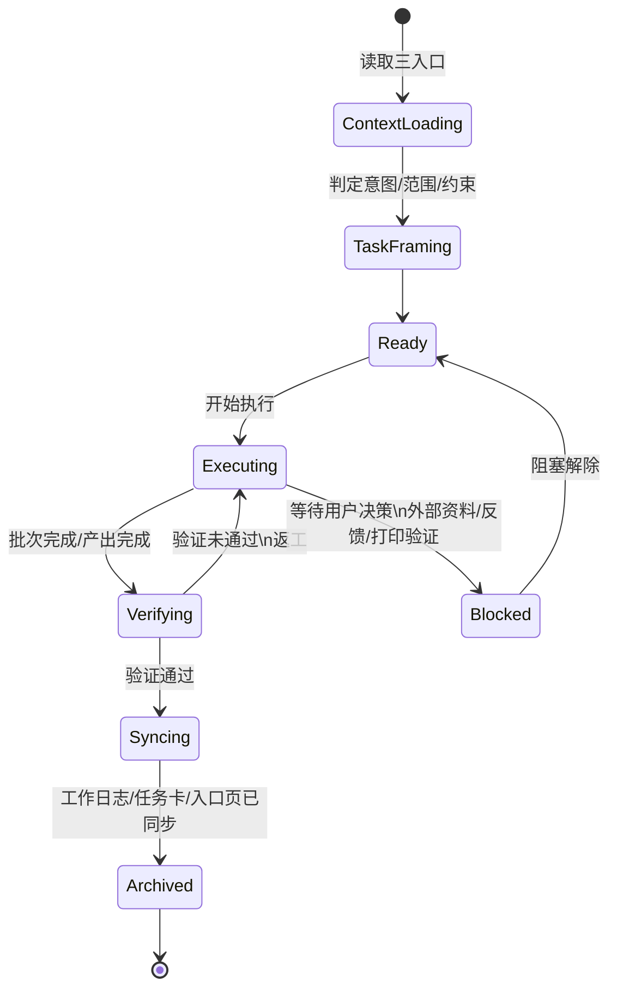
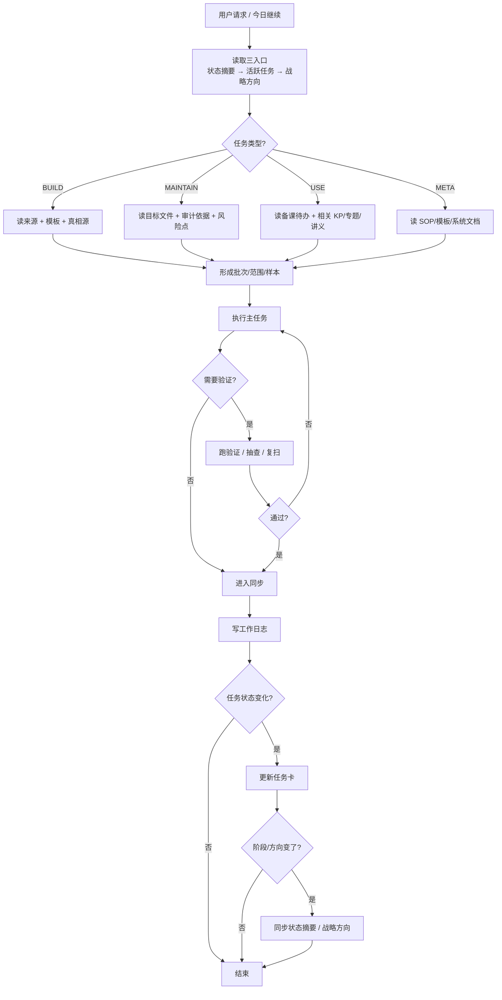

# 知识库日常操作过程建模

> **用途**：把当前 vault 的日常工作方式压成 3 个便于复用的抽象层：
> 1. `状态机图`：描述任务如何从进入到收工
> 2. `简版 SOP 图`：描述一次普通工作日怎么推进
> 3. `任务对象模型`：描述后续自动化最适合消费的结构化对象

> **适用范围**：本页关注“日常默认执行流”，不替代 [[Agent标准作业流程]]、[[Agent最小执行协议]]、[[Agent生命周期与MCP工具层设计]] 等权威规则书。

## 一、建模前提

本页不是发明新流程，而是对以下已有事实做抽象压缩：

- 会话入口固定为 `[[状态摘要]] → [[活跃任务]] → [[Agent战略方向]]`
- 任务执行的真实节奏是：`定向 → 分类 → 分批执行 → 验证 → 回写 → 沉淀`
- 短期真相源在 `00-首页/活跃任务/`
- 过程证据在 `[[工作日志]]`
- 长期方向在 `[[Agent战略方向]]`
- 高频动作成熟后会上升为 `SOP / 模板 / 脚本 / Skill`

---

## 二、状态机图

### 2.1 简化任务状态机



### 2.2 状态说明

| 状态 | 目标 | 真正做的事 | 常见证据 |
|:---|:---|:---|:---|
| `ContextLoading` | 搞清当前上下文 | 读状态摘要、活跃任务、战略方向 | 三入口最新 `updated` |
| `TaskFraming` | 给任务定边界 | 判断 `BUILD / MAINTAIN / USE / META`，识别范围、风险、收工要求 | 任务卡、用户指令、模块关系清单 |
| `Ready` | 形成可执行计划 | 确定批次、样本、目标文件、验证口径 | 计划说明、分批列表 |
| `Executing` | 产生产物或修改 | 批量修复、填充、备课、审计、写文档、调脚本 | 文件改动、批次记录 |
| `Verifying` | 证明做对了 | validate、断链复扫、OCR 交叉验证、题链核实、图片核实、preflight | 验证报告、抽查结果 |
| `Syncing` | 让系统真相源一致 | 写工作日志、更新任务卡、必要时同步状态摘要/战略方向 | 日志条目、任务卡状态 |
| `Blocked` | 显式挂起 | 等待用户决策或外部条件，不假装推进 | blocked 任务卡、阻塞说明 |
| `Archived` | 闭环完成 | 本轮不再继续，进入历史证据层 | 已完成任务卡、日志闭环记录 |

### 2.3 这个简化图和完整状态机的关系

- 本页刻意把完整设计中的 `ASSESSING / PLANNING / EXECUTING / VERIFYING / CLOSING / ARCHIVED / AWAITING / REWORK / ERROR / SUSPENDED` 压成日常更常用的 8 态
- 目的是让人和自动化都先抓主线，不在日常视图里过早暴露全部实现细节
- 若后续做 MCP/编排器落地，仍应以 [[Agent生命周期与MCP工具层设计]] 的完整状态机为准

---

## 三、简版 SOP 图

### 3.1 普通任务主链路



### 3.2 一次普通工作日的最小清单

1. 读三入口，先知道“现在在什么阶段、今天还有什么活”。
2. 给任务归类，不同类型决定读哪些真相源、能改哪些文件、收工回写哪里。
3. 不直接大改，先定批次、定样本、定验证口径。
4. 执行时优先做主干动作，不在次要分支上过度发散。
5. 每个批次完成后立刻验证，不把“改了”当“完成了”。
6. 收工至少写工作日志；若任务状态变了，补任务卡；若全局结论变了，再动状态摘要或战略方向。
7. 如果某动作重复出现三次以上，评估是否应沉淀为模板、SOP、脚本或 Skill。

### 3.3 三种最常见的分支

| 分支 | 触发条件 | 动作 |
|:---|:---|:---|
| `批量治理分支` | 断链、frontmatter、重复文件、状态口径、编码统一 | 先审计摸底，再分批执行，再复扫对账 |
| `内容建设分支` | 提炼回流、KP 填充、题库建设 | 先读来源，再写内容，再做真实性与挂接验证 |
| `备课产出分支` | 备课大纲、学生讲义、速查卡 | 先定轮次边界，再拉来源，再做课堂化转写，再校题链/图片/结构 |

---

## 四、适合自动化的任务对象模型

### 4.1 设计目标

后续自动化最需要的，不是“大段自然语言计划”，而是一个能支持：

- 路由
- 分批
- 验证
- 阻塞
- 回写
- 沉淀

的中间对象。

### 4.2 推荐对象模型（简版）

```yaml
task:
  id: "task-2026-07-27-001"
  title: "化学平衡讲义定稿与回写"
  intent_type: "USE"          # BUILD | MAINTAIN | USE | META
  area: "04-课件/学生讲义"
  priority: "P1"              # P1 | P2 | P3
  status: "ready"             # context_loading | framing | ready | executing | verifying | syncing | blocked | archived
  scope:
    targets:
      - "04-课件/学生讲义/化学平衡-超级充实版（自学完整）.md"
    related_sources:
      - "04-课件/备课大纲/2026-06-02-化学平衡-基础班.md"
      - "07-资料提炼/..."
      - "03-知识点/..."
    exclusions:
      - "不修改 03-知识点 正文"
  execution:
    mode: "single_batch"      # single_batch | multi_batch | audit_then_fix
    batches:
      - id: "B1"
        goal: "正文修订与题链校验"
        files: 1
      - id: "B2"
        goal: "used_in 回填与收工同步"
        files: 3
    checks:
      - "题号真实存在"
      - "image_count 一致"
      - "无教师向信息泄漏到学生正文"
  verification:
    required: true
    methods:
      - "抽查"
      - "脚本验证"
      - "断链复扫"
    pass_criteria:
      - "0 error"
      - "无新增断链"
  sync:
    always:
      - "00-首页/工作日志"
    on_status_change:
      - "00-首页/活跃任务/任务卡-*.md"
    on_global_change:
      - "00-首页/状态摘要.md"
      - "00-首页/Agent战略方向.md"
  blockers:
    type: null                # user_decision | external_source | print_feedback | runtime_bug
    detail: null
  provenance:
    requested_by: "user"
    created_at: "2026-07-27"
    last_updated: "2026-07-27"
  outputs:
    primary:
      - "讲义定稿"
    secondary:
      - "工作日志条目"
      - "任务卡状态更新"
  automation_hints:
    can_parallelize: false
    can_template: true
    can_script_validate: true
    next_best_action: "进入 B1"
```

### 4.3 字段分层

| 层 | 字段 | 用途 |
|:---|:---|:---|
| `识别层` | `id/title/intent_type/area/priority/status` | 让系统知道“这是什么任务” |
| `边界层` | `scope` | 让系统知道“能碰哪里、不能碰哪里” |
| `执行层` | `execution` | 让系统知道“怎么拆、怎么跑、怎么检查” |
| `验证层` | `verification` | 让系统知道“什么算做完” |
| `同步层` | `sync` | 让系统知道“做完回写哪里” |
| `阻塞层` | `blockers` | 让系统知道“何时暂停而不是硬做” |
| `溯源层` | `provenance/outputs` | 让系统知道“任务从哪来、产出了什么” |
| `自动化层` | `automation_hints` | 给编排器或脚本提供下一步建议 |

### 4.4 最适合自动化消费的 3 个派生视图

#### A. 路由视图

只看：

- `intent_type`
- `area`
- `scope.targets`
- `scope.exclusions`

用途：决定读哪些入口、开哪些模板、允许碰哪些目录。

#### B. 执行视图

只看：

- `status`
- `execution.mode`
- `execution.batches`
- `automation_hints.next_best_action`

用途：驱动下一步执行，而不是每次重算计划。

#### C. 收工视图

只看：

- `verification`
- `sync`
- `outputs`

用途：决定是否允许归档，以及收工要回写哪些真相源。

---

## 五、后续自动化建议

### 5.1 最值得先自动化的环节

1. `ContextLoading`
   先读三入口并抽取结构化字段，替代人工重新总结。
2. `TaskFraming`
   根据用户请求自动判定 `intent_type / area / priority / sync targets`。
3. `Verification`
   把常见“是否通过”检查脚本化，减少人工复扫。
4. `Syncing`
   自动生成工作日志骨架、任务卡状态建议、状态摘要候选更新。

### 5.2 暂时不要过早自动化的环节

1. 教学深浅边界判断
2. “这段内容值不值得回流”这类教学判断
3. blocked 是否应解除的外部判断
4. 战略方向改写

这些仍更依赖人类语义判断，不适合先硬编码。

---

## 六、一句话总结

> 这套知识库的日常不是“改文件”，而是**围绕任务对象运行的闭环系统**：先定向、再分型、再批量执行、再验证、再同步、最后把重复动作沉淀成自动化资产。

---

## 关联入口

- [[Agent最小执行协议]]
- [[Agent标准作业流程]]
- [[Agent生命周期与MCP工具层设计]]
- [[活跃任务]]
- [[状态摘要]]
- [[Agent战略方向]]
- [[工作日志]]
