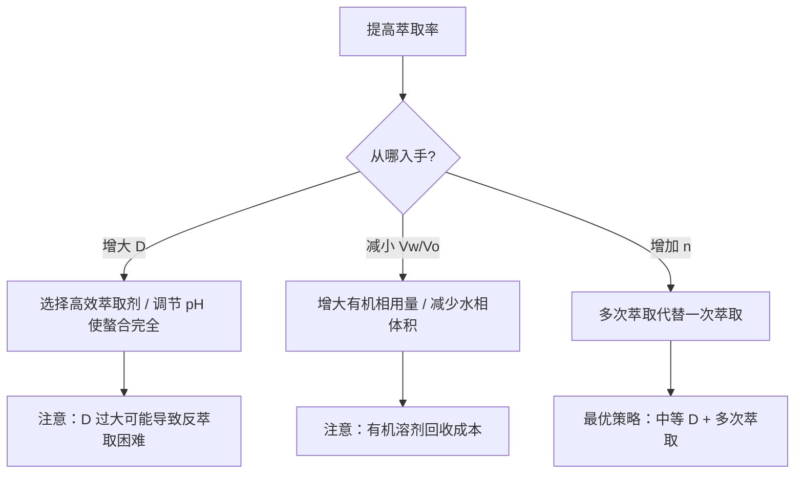

# 萃取

- 总览：[[中国化学奥林匹克基本要求-总览]]
- 所属模块：[[分析化学]]
- 对应考纲条目：[[18-容量分析]]（分离分析基础）

---

## 一、是什么

**溶剂萃取**（solvent extraction）是利用物质在两种互不相溶的溶剂中分配差异，将目标物质从一种溶剂（通常是水相）转移到另一种溶剂（有机相）中的分离技术。

在竞赛分析化学中，萃取通常不作为独立滴定方法出现，但以下场景需要掌握：
- **多次萃取的效率计算**（经典竞赛计算题）
- **螯合物萃取体系**（8-羟基喹啉、双硫腙等与金属离子的萃取）
- **有机合成中的后处理**（酸碱萃取分离有机物）

---

## 二、核心公式速查

| 符号 | 名称 | 定义式 | 说明 |
|:---|:---|:---|:---|
| $K_D$ | 分配系数 | $K_D = \dfrac{[A]_o}{[A]_w}$ | 热力学常数，仅与温度有关；假设溶质 A 在两相中形态相同 |
| $D$ | 分配比 | $D = \dfrac{(c_A)_o}{(c_A)_w}$ | 实际应用中所有形态的总浓度比；$D$ 随 pH、配位剂等变化 |
| $E$ | 萃取率 | $E = \dfrac{D \cdot V_o}{D \cdot V_o + V_w} \times 100\%$ | 一次萃取后进入有机相的百分比 |
| $E_n$ | n 次萃取总萃取率 | $E_n = \left[1 - \left(\dfrac{V_w}{D \cdot V_o + V_w}\right)^n\right] \times 100\%$ | 每次用相同体积 $V_o/n$ 的新鲜有机相萃取 |

> **记忆口诀**：一次萃取看 $D$，多次萃取看 $n$；$D$ 越大 $E$ 越高，体积比 $V_w/V_o$ 越小越好。

---

## 三、核心原理

### 3.1 分配定律（Nernst 分配定律）

在恒温恒压下，若溶质 $A$ 在两相中均以相同分子形态存在，则平衡时：

$$K_D = \frac{[A]_o}{[A]_w} = \text{常数}$$

**条件**：
- 溶质浓度较低（稀溶液，避免分子间作用）
- 溶质在两相中形态相同（不解离、不缔合、不配位）

### 3.2 分配比 $D$ 与分配系数 $K_D$ 的区别

| 场景 | 使用 $K_D$ 还是 $D$ | 原因 |
|:---|:---|:---|
| 理想稀溶液，溶质形态不变 | $K_D$ | 热力学常数，只与 $T$ 有关 |
| 水相中存在解离/缔合/配位 | $D$ | 总浓度比，受 pH、配位剂等影响 |
| 实际萃取计算 | $D$ | 实验可测，直接用于萃取率公式 |

**关键理解**：$D$ 是实验者真正能操控的参数。例如用 8-羟基喹啉萃取 $Al^{3+}$ 时，调节 pH 可改变螯合物的形成程度，从而改变 $D$。

### 3.3 萃取率公式的推导

设水相体积 $V_w$，有机相体积 $V_o$，初始水相中溶质总物质的量为 $n_0$。

平衡时：
- 水相中剩余：$n_w$，浓度 $c_w = n_w / V_w$
- 有机相中：$n_o = n_0 - n_w$，浓度 $c_o = n_o / V_o$

由 $D = c_o / c_w$：

$$D = \frac{n_o/V_o}{n_w/V_w} = \frac{(n_0 - n_w)/V_o}{n_w/V_w}$$

解得：

$$n_w = n_0 \cdot \frac{V_w}{D \cdot V_o + V_w}$$

萃取进入有机相的分数：

$$E = \frac{n_o}{n_0} = \frac{D \cdot V_o}{D \cdot V_o + V_w} = \frac{D}{D + V_w/V_o}$$

### 3.4 多次萃取公式（核心竞赛考点）

**每次用 $V_o$ 体积萃取，共萃取 $n$ 次**（每次萃取后分离有机相，换新鲜有机相）：

第 1 次后水相剩余：
$$m_1 = m_0 \cdot \frac{V_w}{D \cdot V_o + V_w}$$

第 2 次后水相剩余：
$$m_2 = m_1 \cdot \frac{V_w}{D \cdot V_o + V_w} = m_0 \cdot \left(\frac{V_w}{D \cdot V_o + V_w}\right)^2$$

第 $n$ 次后水相剩余：
$$m_n = m_0 \cdot \left(\frac{V_w}{D \cdot V_o + V_w}\right)^n$$

**总萃取率**：

$$E_n = \left[1 - \left(\frac{V_w}{D \cdot V_o + V_w}\right)^n\right] \times 100\%$$

**关键结论**：
- 在有机相总体积相同的情况下，**少量多次**萃取效率远高于**一次大量**萃取。
- 例：$V_w = 100\ \text{mL}$，$V_o(\text{总}) = 100\ \text{mL}$，$D = 10$
  - 一次用 100 mL：$E = \frac{10 \times 100}{10 \times 100 + 100} = 90.9\%$
  - 分 10 次各用 10 mL：$E_{10} = 1 - \left(\frac{100}{10 \times 10 + 100}\right)^{10} = 1 - (0.5)^{10} \approx 99.9\%$

### 3.5 影响萃取率的因素

| 因素 | 对萃取率的影响 | 竞赛应用 |
|:---|:---|:---|
| **温度** | 一般 $T \uparrow \Rightarrow K_D \downarrow$（放热过程） | 通常常温操作 |
| **pH** | 影响弱酸/弱碱/螯合物的解离与形成 | 调节 pH 选择性萃取不同金属离子 |
| **配位剂/掩蔽剂** | 与干扰离子配位，降低其 $D$ | 提高选择性 |
| **盐析效应** | 加入无机盐降低被萃取物在水相的溶解度 | 提高 $D$ |
| **有机溶剂选择** | 遵循"相似相溶"原则 | 常用：CCl₄、CHCl₃、乙醚、苯、MIBK |

### 3.6 螯合物萃取体系

竞赛中常见的螯合物萃取体系：

| 螯合剂 | 被萃取离子 | 有机溶剂 | pH 范围 |
|:---|:---|:---|:---|
| 双硫腙（Dithizone）| $Pb^{2+}$、$Hg^{2+}$、$Cd^{2+}$、$Zn^{2+}$ | CCl₄ 或 CHCl₃ | 弱酸~弱碱 |
| 8-羟基喹啉（Oxine）| $Al^{3+}$、$Fe^{3+}$、$Cu^{2+}$ 等 | CHCl₃ | 弱酸~中性 |
| 乙酰丙酮 | $Fe^{3+}$、$Al^{3+}$、$UO_2^{2+}$ | CCl₄、苯 | 弱酸 |
| 铜试剂（DDTC）| 多种重金属 | CCl₄ 或乙酸乙酯 | 弱碱 |

**原理**：金属离子 $M^{n+}$ 与螯合剂 $HL$ 形成中性螯合物 $ML_n$，该中性分子易溶于有机相。

$$M^{n+} + nHL \rightleftharpoons ML_n + nH^+$$

调节 pH 可控制平衡：
- pH 过低（$[H^+]$ 高）→ 平衡左移 → 萃取率下降
- pH 过高 → 金属离子水解生成氢氧化物沉淀
- 因此每种金属离子存在**最佳萃取 pH 范围**

---

## 四、典型例题

### 例题 1：多次萃取效率比较（⭐⭐）

**题目**：用某有机溶剂从 100 mL 水溶液中萃取溶质 A。已知 $D = 9.0$。比较以下两种方案的萃取率：
- 方案一：一次用 100 mL 有机溶剂萃取；
- 方案二：分两次，每次用 50 mL 有机溶剂萃取。

**分析与解答**：

**方案一（一次萃取）**：

$$E_1 = \frac{D \cdot V_o}{D \cdot V_o + V_w} \times 100\% = \frac{9.0 \times 100}{9.0 \times 100 + 100} \times 100\% = \frac{900}{1000} \times 100\% = 90.0\%$$

**方案二（分两次萃取）**：

每次萃取后水相剩余分数：

$$q = \frac{V_w}{D \cdot V_o + V_w} = \frac{100}{9.0 \times 50 + 100} = \frac{100}{550} = \frac{2}{11}$$

两次后总萃取率：

$$E_2 = \left(1 - q^2\right) \times 100\% = \left(1 - \left(\frac{2}{11}\right)^2\right) \times 100\% = \left(1 - \frac{4}{121}\right) \times 100\% = \frac{117}{121} \times 100\% \approx 96.7\%$$

**结论**：在有机溶剂总体积相同（100 mL）的情况下，分两次萃取（96.7%）明显优于一次萃取（90.0%）。

---

### 例题 2：由萃取率反求分配比（⭐⭐⭐）

**题目**：用 50 mL 有机溶剂萃取 100 mL 含 $I_2$ 的水溶液。已知一次萃取后，水相中剩余 $I_2$ 为原来的 10%。求分配比 $D$。若将 50 mL 有机溶剂分 5 次萃取（每次 10 mL），求最终水相中剩余的 $I_2$ 百分比。

**分析与解答**：

**第一步：求 $D$**

一次萃取后水相剩余 10%，即 $q = 0.10$。

$$q = \frac{V_w}{D \cdot V_o + V_w} = \frac{100}{D \times 50 + 100} = 0.10$$

解得：

$$100 = 0.10 \times (50D + 100) = 5D + 10$$

$$5D = 90 \Rightarrow D = 18$$

**第二步：5 次萃取，每次 10 mL**

每次的剩余分数：

$$q' = \frac{V_w}{D \cdot V_o' + V_w} = \frac{100}{18 \times 10 + 100} = \frac{100}{280} = \frac{5}{14}$$

5 次后总剩余：

$$q_5 = \left(\frac{5}{14}\right)^5 = \frac{3125}{537824} \approx 0.00581$$

即剩余约 **0.58%**，萃取率达到 **99.42%**。

**反思**：$D = 18$ 已较大，一次萃取率即可达 90%。但即便如此，5 次少量萃取仍能将残余降至 0.58%，体现了多次萃取的威力。

---

## 五、常见错误与辨析

| 错误认知 | 正确理解 |
|:---|:---|
| "分配系数 $K_D$ 和分配比 $D$ 是一回事" | $K_D$ 是热力学常数（单一形态），$D$ 是总浓度比（所有形态）。只有当溶质在两相中均不改变形态时，$K_D = D$。 |
| "萃取率只与分配比 $D$ 有关" | 萃取率同时取决于 $D$ 和 **体积比** $V_w/V_o$。$D$ 很大但 $V_w \gg V_o$ 时，萃取率也可能不高。 |
| "有机溶剂用得越多越好" | 过度增大 $V_o$ 会稀释有机相中的被萃取物，不利于后续处理；且溶剂回收成本高。少量多次更优。 |
| "多次萃取公式中 $V_o$ 是总体积" | 注意：公式中 $V_o$ 是**每次萃取使用的有机相体积**，不是总体积。若分 $n$ 次，总体积为 $n \cdot V_o$。 |
| "螯合物萃取 pH 越高越好" | pH 过高会导致金属离子水解沉淀；pH 过低则螯合剂质子化，无法配位。存在最佳 pH 范围。 |

---

## 六、与其他知识点的联系

- **[[化学平衡]]**：萃取平衡本质上是两相间的分配平衡，可用平衡常数处理
- **[[酸碱平衡]]**：螯合物萃取中 pH 控制是关键，涉及弱酸解离平衡
- **[[专题-沉淀溶解平衡]]**：pH 过高时金属离子可能水解沉淀，与萃取竞争
- **[[配位化学]]**：螯合剂与金属离子的配位是萃取的核心机理
- **[[分光光度法]]**：萃取常用于富集痕量金属离子，再用于吸光度测定

---

## 七、竞赛拓展

### 7.1 离子对萃取

对于高价离子（如 $Fe^{3+}$、$Al^{3+}$），单纯螯合可能效率不高。可先用大体积阴离子（如 $ClO_4^-$、$SCN^-$）形成**离子对**，再用有机溶剂萃取。离子对萃取在无机分析中应用广泛。

### 7.2 反萃取（Back Extraction）

萃取后，有时需要将目标物质从有机相反萃回水相。方法是改变条件使 $D$ 大幅降低：
- 改变 pH（使螯合物解离）
- 加入更强的配位剂（与金属离子形成水溶性配合物）
- 改变氧化态（如 $Fe^{3+} \rightarrow Fe^{2+}$）

反萃取是实现**选择性分离**的关键步骤。

---

## 八、记忆锚点

> **「分配看 K_D，实际用 D；一次看体积，多次看 n 次方」**

1. **分配系数** $K_D$ = 理论常数（考试很少直接考）
2. **分配比** $D$ = 实际计算用（考题给出的通常是 $D$）
3. **一次萃取率** $E = \dfrac{D}{D + V_w/V_o}$
4. **多次萃取** = 剩余分数的 $n$ 次方 → 指数级提高萃取率
5. **最佳策略** = 不是追求极大的 $D$，而是合理 $D$ + 多次萃取

---

## 九、教学视角

### 学生常见困惑
1. **混淆 $K_D$ 和 $D$**：学生常认为两者完全相同。教学中应强调：$K_D$ 是理想化的热力学常数，$D$ 是实际测量的总分配比，只有在无副反应时才相等。
2. **多次萃取公式中 $V_o$ 的理解**：容易把 $V_o$ 误认为是总体积。应反复强调：$V_o$ 是每次的体积，分 $n$ 次的总体积是 $nV_o$。
3. **"为什么多次萃取更有效"的直觉建立**：可从数学角度（指数衰减）和物理角度（每次都打破平衡、推动反应正向移动）双重解释。

### 入门级例题设计
**情境**：从碘水中萃取碘，给定 $D$ 和体积，比较一次 vs 两次萃取效率。
**引导提问**：
- "如果 $D = 1$，一次萃取率是多少？"
- "分两次萃取后，剩余分数是多少？"
- "若 $D$ 很大（如 100），多次萃取还有优势吗？优势多大？"

### 与现实/直觉的连接
- 日常泡茶：第一泡最浓，后续逐渐变淡——本质上是多次萃取
- 咖啡萃取：意式浓缩（高压少量水）vs 手冲（多次注水）——不同萃取策略

---

*本 KP 依据 [[模板-知识点]] v1.3.1 创建。*
*教学逻辑来源：[[教学逻辑提炼-周坤无机新课-定量化学分析-第一轮]] M6 资产。*
