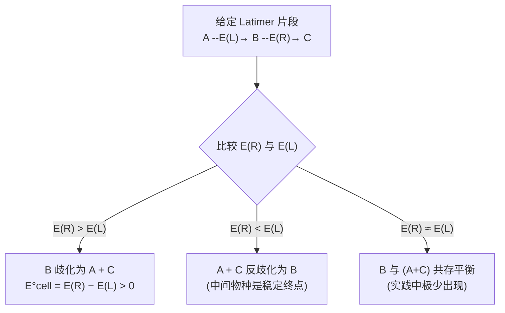

# Latimer图

- 总览：[[中国化学奥林匹克基本要求-总览]]
- 所属模块：[[基础要求-化学原理]]
- 对应考纲条目：[[08-氧化还原与电化学]]、[[决赛10-电化学]]

## 一、定义
- **Latimer图**（Latimer diagram，又称还原电位图）是将某一元素在不同氧化态之间的标准还原电位，按氧化数从高到低依次排列而成的线性图示。
- 图中氧化态写在水平连线的端点，标准电位 $E^{\ominus}$（单位 V）标注在连线上方。

## 二、考纲对应
- 对应考纲条目：[[08-氧化还原与电化学]]、[[决赛10-电化学]]
- 所属模块：[[基础要求-化学原理]]
- 本知识点在考纲中的作用：作为决赛阶段判断氧化态稳定性、歧化趋势、氧化还原反应方向的重要图形工具。

## 三、核心原理

> **来源标注（B2-10）**：以下 Latimer 图计算规则来源于周坤 2020 无机新课课堂笔记（第 14 讲），笔记明确给出了加权计算公式。

### Latimer 图计算规则（笔记整理）

若一个电对由两个相邻电对组合而成，**不能直接相加电位**，而应按 Gibbs 自由能加权：
$$E°(a+b) = \frac{\nu(a)E°(a) + \nu(b)E°(b)}{\nu(a)+\nu(b)}$$
其中 $\nu$ 为各步转移的电子数。

**记忆形式**：$E°_3 = \frac{n_1E°_1 + n_2E°_2}{n_1 + n_2}$

### 3.1 基本构成
- 元素最高氧化态写在最左端，向右依次降低。
- 每条连线代表一个还原半反应，上方标注标准电位 $E^{\ominus}$。
- 氧化数可写在物种下方（或上方）。

**示例：氯在酸性溶液中的 Latimer 图**
$$
\mathrm{ClO}_4^- \xrightarrow[+7]{+1.20} \mathrm{ClO}_3^- \xrightarrow[+5]{+1.18} \mathrm{HClO}_2 \xrightarrow[+3]{+1.67} \mathrm{HClO} \xrightarrow[+1]{+1.63} \mathrm{Cl}_2 \xrightarrow[0]{+1.36} \mathrm{Cl}^-
$$

### 3.2 从 Latimer 图还原半反应
- 图中相邻两物种间的连线即代表一个还原半反应。
- 写半反应时需补全 $H^+$、$H_2O$ 和电子。
- 例如 $HClO \xrightarrow{+1.63} Cl_2$ 对应：
$$2\,HClO(aq) + 2\,H^+(aq) + 2\,e^- \longrightarrow Cl_2(g) + 2\,H_2O(l) \quad E^{\ominus}=+1.63\,\mathrm{V}$$

### 3.3 不相邻物种的电位计算
- 若一个电对由两个相邻电对组合而成，**不能直接相加电位**，而应按 Gibbs 自由能加权：
$$E^{\ominus}(a+b) = \frac{\nu(a)E^{\ominus}(a) + \nu(b)E^{\ominus}(b)}{\nu(a)+\nu(b)}$$
- 其中 $\nu$ 为各步转移的电子数。

**示例**：碱性溶液中 $ClO_2^- / Cl_2$ 的电位
$$E^{\ominus} = \frac{2\times(+0.68\,\mathrm{V}) + 1\times(+0.42\,\mathrm{V})}{3} = +0.59\,\mathrm{V}$$

### 3.4 歧化判据
- 设某物种 $X(N)$ 在 Latimer 图中位于 $X(N+1)$（左）和 $X(N-1)$（右）之间。
- **歧化条件**：$E^{\ominus}(\text{右}) > E^{\ominus}(\text{左})$，即右侧还原电位 > 左侧还原电位。
- 此时 $X(N)$ 不稳定，倾向于同时被氧化和还原为两侧物种。

**示例：$H_2O_2$ 在酸性溶液中的歧化**
$$
O_2 \xrightarrow{+0.70} H_2O_2 \xrightarrow{+1.76} H_2O
$$
右方 $(+1.76\,\mathrm{V}) >$ 左方 $(+0.70\,\mathrm{V})$，故 $H_2O_2$ 歧化：
$$2\,H_2O_2(aq) \longrightarrow 2\,H_2O(l) + O_2(g) \quad E^{\ominus}_{cell}=+1.06\,\mathrm{V}$$

### 3.5 反歧化判据
- 若 $E^{\ominus}(\text{右}) < E^{\ominus}(\text{左})$，则两侧物种倾向于反歧化（归中）生成中间物种。

### 3.6 歧化/反歧化判定流程图

> 给定一段 Latimer 图 `A —E(L)→ B —E(R)→ C`，判断中间物种 B 的命运：

## 四、关键结论
- Latimer 图是**一维**的，只能展示单一元素在不同氧化态间的电位关系。
- 酸碱条件对 Latimer 图影响很大（尤其涉及氧合阴离子时），必须注明 pH 条件（$E_A^{\ominus}$ 指酸性，$E_B^{\ominus}$ 指碱性）。
- 不相邻电对的电位必须通过 Gibbs 自由能加权计算，**不可直接取算术平均**。

## 五、常见分类或情形
- **酸性 Latimer 图**（$E_A^{\ominus}$，pH = 0）：适用于强酸性环境。
- **碱性 Latimer 图**（$E_B^{\ominus}$，pH = 14）：适用于强碱性环境。
- 若半反应不涉及 $H^+$（如 $Cl_2/Cl^-$），则酸碱条件下电位相同。

## 六、适用条件与限制
- 只适用于**热力学判断**，不涉及动力学（反应快慢）。
- 标准电位仅适用于标准态；非标准态需用 Nernst 方程校正。
- 对多元素体系或复杂配位环境，Latimer 图信息不足，需配合 Pourbaix 图使用。

## 七、常见比较与易混点

| 易混点 | 错误认识 | 正确认识 |
|------|---------|---------|
| 电位加权 | 不相邻电位直接相加取平均 | 必须按电子数加权：$E = (\nu_1E_1+\nu_2E_2)/(\nu_1+\nu_2)$ |
| 歧化方向 | 电位高的物种歧化 | 是**中间物种**两侧电位比较：右 > 左则中间歧化 |
| 酸碱图混用 | 同一元素酸碱图电位完全相同 | 涉及 $H^+$ 的半反应电位随 pH 显著变化 |

## 八、与其他知识点的联系
- 前置知识：[[标准电极电势]]、[[氧化态]]、[[氧化还原反应方程式配平]]
- 相关知识：[[Frost图]]（与 Latimer 图信息等价但可视化不同）、[[歧化]]、[[Pourbaix图]]
- 应用知识：[[元素化学]]、[[无机推断题]]

## 九、典型题型
- [[题型-Latimer图分析]]
- [[题型-歧化判断]]

## 十、例题

### 例题 1
**题目**：根据下列酸性溶液中氧的 Latimer 图，判断 $H_2O_2$ 在酸性条件下是否稳定：
$$O_2 \xrightarrow{+0.70} H_2O_2 \xrightarrow{+1.76} H_2O$$

**分析**：比较 $H_2O_2$ 左右两侧的标准电位。右侧电位 > 左侧电位时，中间物种歧化。

**解答**：右侧 $(+1.76\,\mathrm{V}) >$ 左侧 $(+0.70\,\mathrm{V})$，故 $H_2O_2$ 不稳定，发生歧化：
$$2H_2O_2 \longrightarrow 2H_2O + O_2 \quad E^{\ominus}_{cell} = 1.76 - 0.70 = +1.06\,\mathrm{V}$$

**反思**：歧化反应电动势为**右减左**，不要搞反方向。

### 例题 2
**题目**：已知碱性溶液中氯的部分 Latimer 图：
$$ClO_2^- \xrightarrow{+0.68} ClO^- \xrightarrow{+0.42} \frac{1}{2}Cl_2$$
求 $ClO_2^- / Cl_2$ 电对的标准电位。

**分析**：不相邻电对，需按电子数加权。两步分别转移 2e⁻ 和 1e⁻。

**解答**：
$$E^{\ominus} = \frac{2\times0.68 + 1\times0.42}{3} = \frac{1.78}{3} = +0.59\,\mathrm{V}$$

**反思**：若误取算术平均 $(0.68+0.42)/2 = 0.55\,\mathrm{V}$ 则错。

## 十一、易错点
- 歧化判据记反："右 > 左" 是中间物种歧化，不是"左 > 右"。
- 写半反应时漏写 $H^+$ 或 $H_2O$：Latimer 图中省略了这些物种，需根据氧化数变化和溶液酸碱性补全。
- 电子数核对错误：尤其当半反应系数需要乘以 2 时（如 $HClO \to Cl_2$）。

## 十二、🎯 教学视角

### 12.1 学习路径
- **学习本 KP 前，需要先掌握**（最多 3 个，wikilink 必填）：
  - "[[标准电极电势]]"
  - "[[氧化态]]"
  - "[[氧化还原反应方程式配平]]"
- **学完本 KP 后，自然过渡到**（最多 2 个）：
  - "[[Frost图]]"
  - "[[Pourbaix图]]"

### 12.2 学生易踩的认知误区

> **来源标注（B2-11）**：以下歧化判断规则及口诀来源于周坤 2020 无机新课课堂笔记（第 14 讲），笔记以 MnO₄²⁻ 为实例进行了讲解。

| 误区 | 学生为什么会这么想 | 正确认识 | 辨析口诀/方法 |
|---|---|---|---|
| "电位可以直接相加" | 看到两个数就习惯性求和平均 | 电位是强度量，Gibbs自由能才是广度量；加权必须乘电子数 | "加权先乘 ν，再除以总 ν" |
| "左 > 右也歧化" | 混淆了氧化和还原的方向 | 中间物种被氧化需要左方电位低（不易氧化它），被还原需要右方电位高（容易还原它） | "右高左低，中间死掉" |

**歧化判断规则（课堂笔记整理）**：
给定 Latimer 图片段 $\mathrm{A \xrightarrow{E°(左)} B \xrightarrow{E°(右)} C}$，判断中间物种 B 的命运：
- **若 $E°(右) > E°(左)$**：B 歧化为 A + C（中间物种不稳定）
- **若 $E°(右) < E°(左)$**：A + C 反歧化为 B（中间物种稳定）

**MnO₄²⁻ 歧化实例**（课堂笔记）：
碱性溶液中锰的 Latimer 图（部分）：
$$\mathrm{MnO_4^- \xrightarrow{+0.56} MnO_4^{2-} \xrightarrow{+0.60} MnO_2}$$
- $E°(右) = +0.60\ \mathrm{V} > E°(左) = +0.56\ \mathrm{V}$
- 故 MnO₄²⁻ 不稳定，发生歧化：$3\mathrm{MnO_4^{2-} + 2H_2O \longrightarrow 2MnO_4^- + MnO_2 + 4OH^-}$

### 12.3 入门级例题
**题目**：某元素 M 的 Latimer 图为 $M^{3+} \xrightarrow{+1.0} M^{2+} \xrightarrow{-0.4} M^+$，判断 $M^{2+}$ 是否歧化。

**预期解答路径**：
1. 找到中间物种 $M^{2+}$，左方电位 $+1.0\,\mathrm{V}$，右方电位 $-0.4\,\mathrm{V}$
2. 右方 $(-0.4) <$ 左方 $(+1.0)$，不满足歧化条件
3. 结论：$M^{2+}$ 不歧化；相反，$M^{3+}$ 和 $M^+$ 可能反歧化为 $M^{2+}$

**老师可在课堂上引导的提问**：
- 学生若卡在第 2 步：问 "$M^{2+}$ 被氧化成什么？被还原成什么？分别需要哪个半反应？"

### 12.4 与现实/直觉的连接
- 类比：Latimer 图就像元素的"氧化态台阶图"，每级台阶的高度差（电位）决定了是往上爬（氧化）还是往下走（还原）。
- 反例：$H_2O_2$ 在药店可以买到，似乎"稳定"——但那是动力学稳定（分解催化剂被除去），热力学上它极易歧化。

## 十三、竞赛拓展
- Latimer 图与 Frost 图的数学等价性：$\nu E^{\ominus}$ 累加即得 Frost 图纵坐标。
- 利用 Latimer 图计算元素的平均标准氧化自由能。

## 十四、外部资料出处
- [[提炼-普化原理-第10章-氧化还原电化学]]
- [[教学逻辑提炼-周坤无机新课-酸碱理论与电化学-第一轮]]
- [[教学逻辑提炼-Zchem-电化学-第一轮]]
- [[专题-氧化还原与电化学]]
- [[专题-电化学计算]]

## 十五、待完善项
- [ ] 补充更多元素的 Latimer 图实例（Mn、N、S 等）
- [ ] 关联真题中涉及 Latimer 图判断的例题
