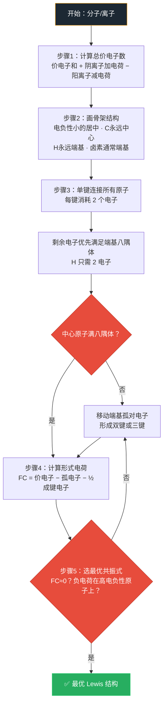

# Lewis结构式

- 总览：[[中国化学奥林匹克基本要求-总览]]
- 所属模块：[[基础要求-化学原理]]
- 对应考纲条目：[[10-分子结构与化学键]]

## 一、定义
**Lewis 结构式**是用点或线表示原子间共价键以及孤电子对的化学结构表达式。它是理解分子结构的最基础工具，也是 [[VSEPR理论]] 和 [[杂化轨道理论]] 的前提。

## 二、考纲对应
- 对应考纲条目：[[10-分子结构与化学键]]（10.5 会书写 Lewis 结构式）
- 所属模块：[[基础要求-化学原理]]
- 本知识点在考纲中的作用：作为 [[VSEPR理论]]、[[杂化轨道理论]] 和 [[共振论]] 的前置表达工具，要求能规范书写常见分子与离子的 Lewis 结构并判断合理性

## 三、核心原理

> **来源：周坤无机新课笔记**（资产 B3-7）
> Lewis 结构书写决策流程，笔记有明确步骤，可信度：高

### Lewis 结构书写决策流程

**步骤 1：计算总价电子数**
- 将分子中所有原子的价电子数相加
- 阴离子：加上负电荷数；阳离子：减去正电荷数

**步骤 2：画出骨架结构**
- 电负性小的原子通常作为**中心原子**
- C 原子总是作为中心原子（有机化合物中）
- H 原子总是作为端基原子（硼烷除外）
- 卤素原子通常为端基
- O 原子一般为端基（有机化合物中可能作为中心原子）

**步骤 3：分配电子**
- 用单键连接所有原子，每键消耗 2 个电子
- 剩余电子优先满足端位原子的八隅体（H 为 2 电子）
- 若中心原子不满足 8 电子，移动端基孤对电子形成双键或三键

**步骤 4：计算形式电荷**
$$\text{形式电荷} = \text{价电子数} - \text{孤电子数} - \frac{\text{成键电子数}}{2}$$

**步骤 5：选择最优共振式**
- 形式电荷尽可能接近 0
- 负电荷在电负性大的原子上
- 同号电荷尽量远离



### 书写步骤（简化版）
1. 确定骨架（通常电负性小的原子居中）
2. 计算总价电子数（含电荷修正）
3. 用单键连接原子，每键用 2 个电子
4. 剩余电子优先满足端位原子的八隅体
5. 若中心原子未满八隅体 → 用孤电子对形成多重键
6. 检查形式电荷，选择最优共振结构

### 形式电荷
$$\text{形式电荷} = \text{价电子数} - \text{孤电子数} - \frac{\text{成键电子数}}{2}$$

**最优 Lewis 结构判据：**
- 形式电荷尽可能接近 0
- 负电荷在电负性大的原子上
- 同号电荷尽量远离

### 八隅体规则与例外
| 类型 | 说明 | 实例 |
|------|------|------|
| 缺电子 | 中心原子价层 < 8 e⁻ | BH₃, BF₃, BeCl₂ |
| 富电子（超价）| 中心原子价层 > 8 e⁻ | PCl₅, SF₆, XeF₄ |
| 奇电子 | 总电子数为奇数 | NO, NO₂, ClO₂ |

## 四、关键结论

### 书写步骤（标准流程）
1. 计算分子或离子的**总价电子数** $n$（含离子电荷数）
2. 画出**骨架结构**：电负性小的原子为中心原子，电负性大的原子为端基原子
   - C 原子总是作为中心原子
   - H 原子总是作为端基原子（硼烷除外）
   - 卤素原子通常为端基
   - O 原子一般为端基（有机化合物中可能作为中心原子）
3. 计算骨架连接所需电子数 $m$，剩余电子 $= n - m$，**优先分配给端基原子**使其满足 8 电子（H 为 2 电子）
4. 检查中心原子：若不满足 8 电子要求，**移动端基孤对电子**形成双键或三键

### 形式电荷判据
$$\text{形式电荷} = \text{价电子数} - \text{孤电子数} - \frac{\text{成键电子数}}{2}$$

最优 Lewis 结构的判据：
- 各原子形式电荷最小（一般在 $+1$ 和 $-1$ 之间）
- 形式负电荷归属于电负性较大的元素
- 形式正电荷归属于电负性较小的元素
- 同号电荷的原子不能相邻接

### 实例：SCN$^-$ 离子的两种合理 Lewis 结构
- 结构(a)：S=C=N$^-$（形式电荷：S = 0, C = 0, N = $-1$）$\to$ N 端配位
- 结构(b)：$^-$S—C$\equiv$N（形式电荷：S = $-1$, C = 0, N = 0）$\to$ S 端配位
- 结合电负性（N > S），结构(a)更合理；但实际根据化学环境两者均可能出现

### 快速推断工具箱（★ 课堂实用）

> **来源：[[07-资料提炼/书籍提炼/提炼-化学竞赛初赛讲义-第3讲-分子结构|化学竞赛初赛讲义第3讲 §3.1]]** — 这套工具箱的独到之处在于：它不是让学生"凭感觉画 Lewis 式"，而是给了一条**可校验、可逆推**的机械路径。对基础班学生尤其重要——他们最缺的不是知识，是"拿到一个陌生分子，第一步往哪走"。

#### 工具一：键数公式

$$n_{成键数} = \frac{1}{2}\left(\sum n_{希望得到的电子数} - \sum n_{价电子数}\right)$$

**逻辑**：每个原子希望达到稀有气体构型需要多少电子，减去实际有多少价电子，差额就是要通过成键补足的电子数，除以 2 = 键数。

- H 希望 2 电子，其他主族原子希望 8 电子
- 含配位键时：受体"多得 2 个电子"、给体不变
- **例**：N₈ 链状分子的键数 — $8 \times (8-5) / 2 = 12$ 根键，秒算

> 适合做课堂"秒算卡"：先算键数，再画骨架，避免"画了又改"的反复。

#### 工具二：形式电荷三规则（口诀化）

| 规则 | 口诀 | 说明 |
|:---|:---|:---|
| **规则 1** | 成键数 = 族数 → FC = 0 | 特征键数 = 族数（如 N 族数 5，特征键数 3） |
| **规则 2** | 多一根键 → FC +1 | 自己的电子被迫分给别人了 |
| **规则 3** | 少一根键 → FC −1 | 从别人那里多得了电子 |
| **校验** | 所有 FC 之和 = 物种净电荷 | 画完必查，避免漏算 |

**原理**：每成一根共价键，原子"多一个电子"的份额；配位键受体多 2 个电子。

#### 工具三：共振式稳定性五条（按重要度排序）

1. **满足稀有气体结构**（八隅体）——最重要，不满足直接排除
2. **形式电荷绝对值 ≤ 1**——FC = ±2 的结构通常可排除
3. **电负性匹配**——电负性高的原子不承受正 FC，电负性低的原子不承受负 FC
4. **键数尽可能多**——键能高 = 更稳定
5. **正负形式电荷相邻**——静电吸引贡献额外稳定化

> 课堂速查卡：按 1→5 逐条筛，第一条不满足直接排除，不必全看完再回头。

#### 工具四：等电子体口诀

> **"通式相同（非 H 原子数和电子总数相等）→ 结构相似"**

- CO₂、N₂O、N₃⁻、OCN⁻ 均为 3 原子 16 电子 → 直线形
- SO₃、CO₃²⁻、NO₃⁻ 均为 4 原子 24 电子 → 平面三角形
- 用途：已知一个分子的结构，直接推断其等电子体的结构

---

## 五、常见分类或情形

### 按是否满足八隅体
| 类型 | 中心原子价电子数 | 实例 |
|------|:---:|------|
| 符合八隅体 | 8 | CH$_4$, NH$_3$, H$_2$O, PCl$_3$, H$_2$S |
| 缺电子（<8） | 4 或 6 | BeF$_2$ (4e), BF$_3$ (6e) |
| 富电子（>8，超价） | 10 或 12 | PCl$_5$ (10e), SF$_6$ (12e) |
| 奇数电子 | 7 | NO, NO$_2$ |

### Lewis 结构的局限性（无法解释的现象）
1. **不能说明共价键的本质**：为何共用电子对能使两个原子牢固结合
2. **八隅体规则例外多**：第三周期及以后元素可形成超价分子
3. **不能解释 O$_2$ 的顺磁性**：Lewis 式 $\ddot{\mathrm{O}}=\ddot{\mathrm{O}}$ 中所有电子配对，但实验测出顺磁性
4. **不能解释键长平均化**：NO$_2$, SO$_2$, SO$_3$, NO$_3^-$, CO$_3^{2-}$ 等分子中键长介于单双键之间且相等

## 六、适用条件与限制

1. **最适用于**：第二周期主族元素（C, N, O, F）的化合物。这些元素严格遵守八隅体规则。
2. **不适用于**：
   - 缺电子化合物（Be, B 的化合物）$\to$ 需用 VB/MO 理论补充
   - 超价化合物（第三周期及以后的 P, S, Cl 等）$\to$ 需引入 d 轨道参与成键概念
   - 含未成对电子的分子 $\to$ 需用 MO 理论解释磁性
   - 离域体系（苯, NO$_3^-$, CO$_3^{2-}$ 等）$\to$ 需借助共振论或 MO 理论
3. **Lewis 八隅体规则的历史地位**：起源于对少数主族元素早期认识（1916 年），能初步解释很多主族元素化合物的成键情况，至今仍是几何结构分析的基础。

## 七、常见比较与易混点

| 对比项 | Lewis 结构式 | 分子轨道理论 |
|------|------|------|
| 电子归属 | 定域在原子或原子对间 | 离域在整个分子 |
| 八隅体 | 核心约束 | 无此约束 |
| O$_2$ 结构 | $\ddot{\mathrm{O}}=\ddot{\mathrm{O}}$（无法解释顺磁性） | $(\pi_{2p_z}^*)^1(\pi_{2p_y}^*)^1$（解释顺磁性） |
| 键级 | 整数 | 可为分数 |
| 超价分子 | 需扩展八隅体 | 自然包含 |

### 形式电荷与氧化数的区别
- **形式电荷**：假设共价键电子均等共享来计算，用于判断 Lewis 结构的合理性
- **氧化数**：假设键电子完全归属于电负性更大的原子，用于氧化还原反应

## 八、与其他知识点的联系
- 前置知识：[[共价键]]
- 相关知识：[[VSEPR理论]]、[[价态-氧化态-形式电荷]]、[[共振论]]
- 应用知识：[[杂化轨道理论]]、[[σ键]]、[[π键]]

## 九、典型题型
- 题型-Lewis结构式书写

## 十、例题

### 例题 1：SCN⁻ 的 Lewis 结构与形式电荷
**题目**：画出 SCN⁻ 离子的三种可能 Lewis 结构，计算各原子形式电荷，判断最稳定的结构。

**分析**：SCN⁻ 总价电子：S(6) + C(4) + N(5) + 1(负电荷) = 16 e⁻。三种连接方式均可满足八隅体。

**解答**：
1. [S—C≡N]⁻：S(FC=6−6−1=−1), C(FC=4−0−4=0), N(FC=5−2−3=0)。负电荷在 S 上
2. [S=C=N]⁻：S(FC=6−4−2=0), C(FC=4−0−4=0), N(FC=5−4−2=−1)。负电荷在 N 上
3. [S≡C—N]²⁻：形式电荷分布差，不稳定

结构(2)通常更优，因为负电荷位于电负性更大的 N 上；实际化学中 SCN⁻ 通过 S 端或 N 端配位（两可配体）。

**反思**：形式电荷 ≠ 真实电荷，是 Lewis 结构合理性判据。FC越接近零越好。

### 例题 2：NO₂⁺ 的 Lewis 结构
**题目**：画出 NO₂⁺ 的 Lewis 结构，判断其几何构型。

**分析**：NO₂⁺ 总价电子：N(5) + 2×O(6) − 1(正电荷) = 16 e⁻。与 CO₂ 等电子。

**解答**：
- 骨架：O—N—O
- 分配电子后：O=N⁺=O（两个 N=O 双键）
- 中心 N 无孤对电子，2 个σ键 → sp 杂化 → **直线形**
- 与 CO₂ 等电子也等结构

**反思**：等电子原理 + Lewis 结构 → 快速推断未知离子的几何构型。

## 十一、易错点
- **❌ 错**："形式电荷就是原子实际带的电荷" → 形式电荷是**计数工具**，假设共价键电子均分。实际电荷分布由电负性决定
- **❌ 错**："八隅体规则永远成立" → 第二周期（C/N/O/F）遵守，第三周期起可超价（PCl₅, SF₆, XeF₄），还有缺电子（BF₃）和奇电子（NO）例外
- **❌ 错**："Lewis结构画出来就是分子的3D形状" → Lewis结构只是**拓扑连接**，几何构型需 VSEPR/杂化理论补充
- **❌ 错**："共振体是独立存在的不同分子" → 真实分子是**共振杂化体**（所有共振体的加权平均），苯的6个C—C键完全相同(139 pm)
- **❌ 错**："形式电荷最小的结构一定最稳定" → 还需看：①负电荷是否在电负性大的原子上 ②同号电荷是否远离

## 十二、🎯 教学视角

### 12.1 学生典型认知误区

| 误区 | 学生为什么会这么想 | 正确认识 | 口诀 |
|:---|:---|:---|:---|
| "形式电荷就是原子实际带的电荷" | "电荷"二字的日常含义 | 形式电荷是Lewis结构中的**计数工具**——假设共价键电子均分后算出的表观电荷。不代表原子实际带电（实际电荷由电负性决定）。形式电荷最接近于零的结构最稳定 | "形式电荷是账本，不是真电荷" |
| "八隅体规则永远成立" | 高中化学的绝对化记忆 | 第二周期C/N/O/F严格遵守八隅体；但第三周期起d轨道可参与→超价分子（PF₅, SF₆, XeF₄）。还有缺电子分子（BF₃, BeCl₂）、奇数电子分子（NO） | "八隅体是经验不是法律，第三周期就破了" |
| "Lewis结构画出来就是分子的真实结构" | 把纸面结构当3D现实 | Lewis结构只是**拓扑连接**，不表示3D几何。H₂O的Lewis结构看起来是直线的，但实际是V形（104.5°）。Lewis结构+VSEPR才构成完整图像 | "Lewis画连接，VSEPR定形状" |
| "共振体是独立存在的不同分子" | "共振"一词的日常含义 | 共振体不是独立分子——真实分子是共振杂化体，是所有共振体的加权平均。苯的六个C–C键完全相同(139pm)，不是三个单键+三个双键交替 | "共振体是纸上的，杂化体是真实的" |

### 12.2 入门级例题

**题目**：画出SCN⁻离子的三种可能Lewis结构，计算每种结构中各原子的形式电荷，判断最稳定的结构。

**预期解答路径**：
1. 结构的三种连接方式：S–C≡N, S=C=N, S≡C–N
2. 计算每种的形式电荷（FC = 价电子 − 孤对电子 − 键数）
3. 优先选择形式电荷绝对值较小、且负电荷位于电负性较大原子上的结构

### 12.3 第一轮讲授建议
- 课堂不要一上来就讲所有例外，先把“总价电子数-骨架-补八隅体-算形式电荷”四步练熟
- 第二层再补三类例外：缺电子、超价、奇电子
- 第三层再把 Lewis 结构接到 VSEPR、杂化和共振，学生会更稳

### 12.4 与现实/直觉的连接
- 可以把 Lewis 结构类比成“分子会计账本”：先数电子总资产，再分配到键和孤对里
- 形式电荷就像账面分摊，不等于真实电荷分布；这能帮助学生避免把 Lewis 图当成真实电子云

## 十三、竞赛拓展
- 对超价分子的现代解释不再简单依赖“d 轨道扩展”，更常结合三中心四电子键与离域描述
- Lewis 结构是定域近似，遇到顺磁性、离域键级和光谱问题时应切换到分子轨道理论
- 复杂阴离子和配合物题常借助形式电荷、等电子体和共振体并用来快速筛结构

## 十四、外部资料出处
- 主要来源：[[提炼-普化原理-第12章-化学键与分子结构]]
- 教学组织参考：[[教学逻辑提炼-周坤无机新课-原子结构与分子结构-第一轮]]
- 课堂归纳参考：[[专题-分子结构基础]]

## 十五、待完善项
- [ ] 后续可补“常见离子 Lewis 结构速查表”
- [ ] 后续可补“Lewis -> VSEPR -> 杂化”桥接图

---

## 相关真题（Dataview）

```dataview
TABLE
  question_type AS 题型,
  difficulty AS 难度,
  teaching_level AS 教学层级,
  source AS 来源
FROM "04-题库"
WHERE type = "题目"
  AND contains(knowledge_points, "Lewis结构式")
SORT difficulty ASC, year DESC
```
