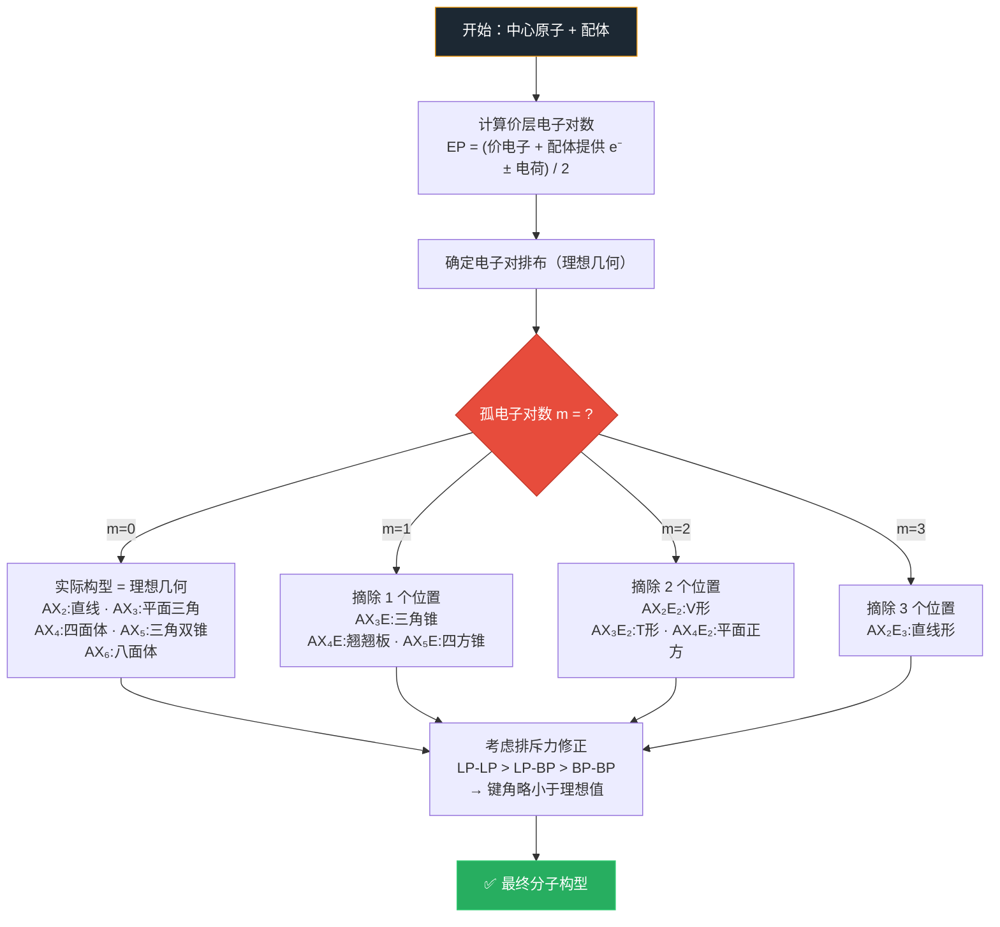

## 十五、待完善项

- [待填充]


---

# VSEPR理论

- 总览：[[中国化学奥林匹克基本要求-总览]]
- 所属模块：[[基础要求-化学原理]]
- 对应考纲条目：[[10-分子结构与化学键]]

## 一、定义
**价层电子对互斥理论**（Valence Shell Electron Pair Repulsion, VSEPR）认为：**中心原子周围的电子对（包括成键电子对和孤电子对）在空间上相互排斥，趋向于尽可能远离，从而使分子采取能量最低的几何构型。**

核心假设：电子对之间的排斥力决定了分子的空间几何形状。

## 二、考纲对应

> **来源：周坤无机新课讲义**（资产 B3-8）
> VSEPR 构型速查表，讲义有完整表格

- 对应考纲条目：[[10-分子结构与化学键]]（10.4 了解价层电子对互斥理论）
- 所属模块：[[基础要求-化学原理]]
- 本知识点在考纲中的作用：
  - 是判断分子/离子空间构型的**最直接工具**
  - 是 [[杂化轨道理论]] 的先行知识
  - 直接影响极性判断、反应性分析、晶体结构理解

### VSEPR 构型速查表（AXₙEₘ → 理想构型 → 实际分子形状）

| 电子对数 | 孤电子对数 | 类型 | 电子对排布 | 分子构型 | 键角 | 实例 |
|:---:|:---:|------|------|------|------|------|
| 2 | 0 | AX₂ | 直线形 | 直线形 | 180° | BeCl₂, CO₂ |
| 3 | 0 | AX₃ | 平面三角形 | 平面三角形 | 120° | BF₃, SO₃ |
| 3 | 1 | AX₂E | 平面三角形 | **V形（弯曲形）** | <120° | SO₂, O₃ |
| 4 | 0 | AX₄ | 四面体 | 四面体 | 109.5° | CH₄, NH₄⁺ |
| 4 | 1 | AX₃E | 四面体 | **三角锥形** | <109.5° | NH₃, PH₃ |
| 4 | 2 | AX₂E₂ | 四面体 | **V形（弯曲形）** | <109.5° | H₂O, H₂S |
| 5 | 0 | AX₅ | 三角双锥 | 三角双锥 | 90°, 120° | PCl₅ |
| 5 | 1 | AX₄E | 三角双锥 | 变形四面体（跷跷板形）| — | SF₄ |
| 5 | 2 | AX₃E₂ | 三角双锥 | T形 | — | ClF₃ |
| 5 | 3 | AX₂E₃ | 三角双锥 | 直线形 | 180° | XeF₂ |
| 6 | 0 | AX₆ | 八面体 | 八面体 | 90° | SF₆ |
| 6 | 1 | AX₅E | 八面体 | 四方锥 | — | BrF₅ |
| 6 | 2 | AX₄E₂ | 八面体 | 平面正方形 | 90° | XeF₄ |

## 三、核心原理

### 1. 电子对分类
- **成键电子对（BP, Bonding Pair）**：参与形成化学键的电子对
- **孤电子对（LP, Lone Pair）**：未参与成键、仅属于中心原子的电子对
- **多重键的处理**：双键和三键各视为一个"电子对区域"（空间占位相同）

### 2. 排斥力大小顺序

**基础三级**（必记）：
$$\text{LP—LP} > \text{LP—BP} > \text{BP—BP}$$

**完整六级**（含多重键，★ 竞赛精度）：
$$\text{LP—LP} > \text{LP—多重键} > \text{LP—单键} > \text{多重键—多重键} > \text{多重键—单键} > \text{单键—单键}$$

- 孤电子对只受一个核的吸引，"更胖"，排斥力最大
- 多重键（双键/三键）的电子云密度高于单键 → 排斥力大于单键
- 孤电子对占据更多空间 → 压缩键角

### 3. 判断步骤
1. 画出 [[Lewis结构式]]，确定中心原子
2. 计算中心原子的**价层电子对数**：
   $$\text{电子对数} = \frac{\text{价电子数} + \text{配位原子提供的电子数} \pm \text{电荷}}{2}$$
3. 根据电子对数确定**电子对排布方式**（理想几何）
4. 根据孤电子对数确定**实际分子构型**



## 四、关键结论

| 电子对数 | 孤电子对数 | 电子对排布 | 分子构型 | 键角 | 实例 |
|:---:|:---:|------|------|------|------|
| 2 | 0 | 直线形 | 直线形 | 180° | BeCl₂, CO₂ |
| 3 | 0 | 平面三角形 | 平面三角形 | 120° | BF₃, SO₃ |
| 3 | 1 | 平面三角形 | **V形（弯曲形）** | <120° | SO₂, O₃ |
| 4 | 0 | 四面体 | 四面体 | 109.5° | CH₄, NH₄⁺ |
| 4 | 1 | 四面体 | **三角锥形** | <109.5° | NH₃, PH₃ |
| 4 | 2 | 四面体 | **V形（弯曲形）** | <109.5° | H₂O, H₂S |
| 5 | 0 | 三角双锥 | 三角双锥 | 90°, 120° | PCl₅ |
| 5 | 1 | 三角双锥 | 变形四面体（跷跷板形） | — | SF₄ |
| 5 | 2 | 三角双锥 | T形 | — | ClF₃ |
| 5 | 3 | 三角双锥 | 直线形 | 180° | XeF₂ |
| 6 | 0 | 八面体 | 八面体 | 90° | SF₆ |
| 6 | 1 | 八面体 | 四方锥 | — | BrF₅ |
| 6 | 2 | 八面体 | 平面正方形 | 90° | XeF₄ |

## 五、常见分类或情形

### 情形一：中心原子有孤电子对
- 孤电子对影响键角：**孤电子对越多，键角越小**
- 实例：CH₄ (109.5°) → NH₃ (107°) → H₂O (104.5°)

### 情形二：配位原子电负性影响
- 配位原子电负性越大 → 成键电子对向配位原子偏移 → 键角**减小**
- 实例：NH₃ (107°) vs NF₃ (102°)

### 情形三：中心原子电负性影响
- 中心原子电负性越大 → 成键电子对向中心收缩 → 键间排斥增大 → 键角**增大**
- 实例：H₂O (104.5°) vs H₂S (92°)

### 情形四：多重键参与
- 双键/三键被视为一个电子对区域
- 但实占空间：三键 > 双键 > 单键
- 实例：COCl₂ 中 C=O 双键使 Cl—C—Cl 键角 < 120°

### 情形五：三角双锥中孤电子对与电负性基团的占位（★ 竞赛精度）

**规则 1 — 孤电子对优先占据赤道位置**：
- 赤道位：与 2 个 90° 邻位 + 2 个 120° 邻位的键相邻
- 轴向位：与 3 个 90° 邻位 + 1 个 180° 邻位的键相邻
- 孤对电子"体积大" → 优先选"邻居少且远"的赤道位（最少 90° 排斥原则）

**规则 2 — 电负性大的原子/基团优先放轴向**：
- 电负性小的原子使成键电子对更像孤对电子（电子云偏向中心）→ 这种"像孤对的键对"应该放赤道面
- 电负性大的原子把成键电子拉向自己 → 键对"变瘦" → 可以放轴向（拥挤位）
- **例**：CH₂SF₄ — F 电负性大 → 两个 F 放轴向，CH₂ 放赤道面

> **来源：[[07-资料提炼/书籍提炼/提炼-化学竞赛初赛讲义-第3讲-分子结构|化学竞赛初赛讲义第3讲 §3.4]]** — 这两条规则是竞赛中三角双锥构型题的解题关键。

## 六、适用条件与限制
- ✅ 适用于主族元素化合物（s 区和 p 区）
- ✅ 适用于简单离子（如 NH₄⁺、SO₄²⁻）
- ⚠️ 不适用于过渡金属配合物（需用 [[晶体场理论]] / 配位场理论）
- ⚠️ 过渡金属 d 电子参与成键时失效
- ⚠️ 不能解释分子磁性等电子性质

## 七、常见比较与易混点
| 对比项 | VSEPR理论 | 杂化轨道理论 |
|------|-----------|------------|
| 出发点 | 电子对排斥（静电） | 原子轨道线性组合（量子） |
| 用途 | 判断几何构型、键角 | 解释成键方式、键的形成 |
| 能否判断构型 | ✅ 直接给出 | ❌ 需结合实验 |
| 适用范围 | 主族元素 | 所有共价体系 |
| 相互关系 | VSEPR 预测构型 → 用杂化理论解释成键 | 杂化方式需与 VSEPR 构型自洽 |

## 八、与其他知识点的联系
- 前置知识：[[Lewis结构式]]、[[共价键]]
- 相关知识：[[杂化轨道理论]]、[[分子极性]]、[[键角]]
- 应用知识：[[有机分子的几何构型]]、[[配合物几何构型]]

## 九、典型题型
- 题型-分子构型判断
- 题型-键角比较

## 十、例题
### 例题 1：分子构型判断
**题目：** 判断 ClF₃ 的分子构型。
**分析：**
- 中心原子 Cl 有 7 个价电子，3 个 F 各提供 1 个电子
- 价层电子对数 = (7 + 3) / 2 = 5
- 5 对电子 → 三角双锥排布
- 孤电子对数 = 5 - 3 = 2
- 2 个孤电子对优先占据赤道位置
**解答：** T形分子。
**反思：** 关键步骤是正确计算电子对数，以及记住三角双锥中孤电子对优先占赤道。

### 例题 2：键角排序
**题目：** 比较 NH₃、PH₃、AsH₃ 的键角大小。
**分析：**
- 都是 4 电子对、1 个孤电子对 → 三角锥形
- 中心原子电负性：N > P > As
- 电负性越大 → 成键电子对越靠近中心 → 键间排斥越大 → 键角越大
**解答：** NH₃ (107°) > PH₃ (93.5°) > AsH₃ (92°)
**反思：** 同一族的氢化物，键角随中心原子电负性减小而减小。

## 十一、易错点
- **❌ 错：** 把双键当做两个电子对 → 应视为一个电子对区域
- **❌ 错：** 忘记离子的电荷修正（阳离子减，阴离子加）
- **❌ 错：** 混淆"电子对排布"和"分子构型"——电子对排布包含孤对，分子构型只看原子位置
- **❌ 错：** 认为键角完全由 LP 数量决定，忽略电负性影响

## 十二、🎯 教学视角

### 12.1 学生典型认知误区

| 误区 | 学生为什么会这么想 | 正确认识 | 口诀 |
|:---|:---|:---|:---|
| "只看配位数就能判断分子形状" | 高中化学"配位数=形状"的简化 | VSEPR看的是**电子对总数**（σ键+孤对），不是只看配体数。H₂O配位数2但电子对数4→V形不是直线形！NH₃配位数3但4对电子→三角锥不是平面三角 | "先数电子对再定形，配体数量不可靠" |
| "双键算两个电子对" | 把双键的两对电子当两个"气球" | 双键（和叁键）的两个（三个）电子对指向同一方向→算作**一个电子对区域**！C₂H₄是3个电子对区域（2C–H+1C=C）→平面三角形 | "多重键算一组，方向相同不重复" |
| "VSEPR只能预测最简单的分子几何" | 只学了CH₄/NH₃/H₂O就下结论 | VSEPR可以处理：三角双锥（SF₄翘翘板、ClF₃ T形）、八面体（XeF₄平面正方、IF₅四方锥）、七配位甚至更高。关键是正确判断孤对位置 | "VSEPR能上天入地，关键看你会数电子" |
| "离子和中性分子的VSEPR算法不同" | 教科书例子以中性分子为主 | 离子的处理：阳离子→价电子−电荷；阴离子→价电子+电荷。NH₄⁺（5+4−1=8e→4对→四面体）和NH₃（5+3=8e→4对→三角锥）对比 | "阳离子减电荷，阴离子加电荷，其余一样算" |

### 12.2 入门级例题

**题目**：用VSEPR理论判断SF₄、I₃⁻、XeF₄的电子对排布和分子构型。

**预期解答路径**：
1. SF₄：S(6e)+4F(各1e)=10e→5对→三角双锥电子排布；1孤对→孤对在赤道位→"翘翘板"形（See-saw）
2. I₃⁻：I(7e)+2I(各1e)+1(负电荷)=10e→5对→三角双锥；3孤对→3个赤道位放孤对→直线形
3. XeF₄：Xe(8e)+4F(各1e)=12e→6对→八面体；2孤对→孤对在对位→平面正方形

**教师引导提问**：为什么SF₄的孤对占据赤道位而不是轴向位？（赤道位有3个120°邻居→排斥较少；轴向位有3个90°邻居+1个180°邻居→90°排斥更严重。VSEPR的"最小排斥原理"→孤对优先占据赤道位）

### 12.3 与现实/直觉的连接

- **气球模型——化学中最经典的直觉类比**：把等量的气球捆在一起——2个→直线、3个→三角形、4个→四面体、5个→三角双锥、6个→八面体。电子对就像互相排斥的气球——VSEPR就是"气球模型"的化学翻译。
- **孤对电子——看不见的"气球"**：孤对电子不连接任何原子（在分子形状中"看不见"），但它占的位置和排斥力比成键电子对还大。就像四个人围坐吃饭，有一个空椅子（孤对）占着位置，其他三个人被迫挤紧。
- **为什么孤对总在赤道位？** 三角双锥中赤道位有120°间隔（宽松），轴向位有90°紧邻（拥挤）。孤对电子体积大→需要宽松位→总选赤道。这是"胖子坐宽椅子"的分子版本。

## 十三、竞赛拓展
- RX₅ 体系的 Berry 假旋转（三角双锥 ↔ 四方锥互变）
- 七配位（五角双锥、面冠八面体等）的 VSEPR 处理
- 立体化学活性的孤电子对（如 XeF₆ 的非刚性构型）

## 十三、外部资料出处
- 北⼤《结构化学基础》
- 《无机化学》各版本分子结构章节
- 《Orbital Interactions in Chemistry》

## 十四、待完善项
- [ ] 补充七配位、八配位的 VSEPR 表格
- [ ] 补充 Berry 假旋转的图示
- [ ] 补充 2-3 道初赛/决赛真题

---

## 相关真题

## 十五、待完善项

- [待填充]


```dataview
TABLE file.name AS "文件名", year AS "年份", type AS "题型", difficulty AS "难度"
FROM "04-题库"
WHERE contains(knowledge_points, "VSEPR理论")
SORT year DESC, difficulty ASC
```
## 相关真题

```dataview
TABLE file.name AS "文件名", year AS "年份", type AS "题型", difficulty AS "难度"
FROM "04-题库"
WHERE contains(knowledge_points, "VSEPR理论")
SORT year DESC, difficulty ASC
```
