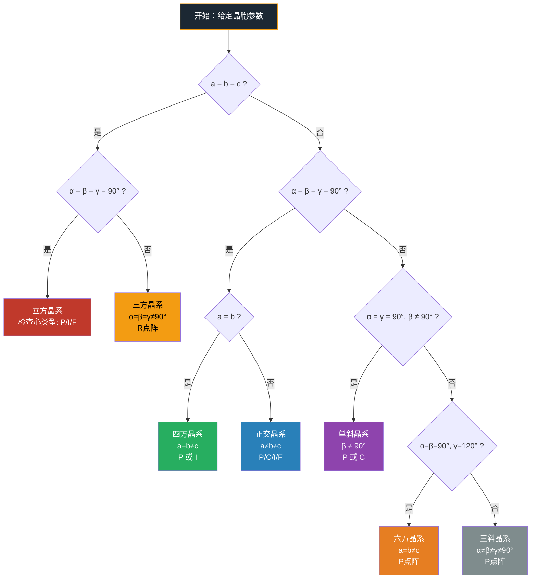

# 七大晶系

- 总览：[[中国化学奥林匹克基本要求-总览]]
- 所属模块：[[基础要求-化学原理]]
- 对应考纲条目：[[24-晶体结构]]

## 一、定义

**七大晶系**是晶体学中根据晶胞的**对称性**和**晶胞参数**（a, b, c, α, β, γ）对晶体结构进行分类的七种基本类型。每个晶系包含若干点阵类型，共计 **14 种 Bravais 点阵**。

分类依据：晶胞的**特征对称元素**（旋转轴、镜面、反轴等），而非晶胞参数的表面关系。对称性从高到低递减：立方 → 四方 → 正交 → 单斜 → 三斜。

```mermaid
graph TD
    A["七大晶系 · 对称性递减"] --> B["立方 Cubic<br/>a=b=c, α=β=γ=90°<br/>4个 C₃ 轴 · 最高对称"]
    A --> C["六方 Hexagonal<br/>a=b≠c, α=β=90°, γ=120°<br/>1个 C₆ 轴"]
    A --> D["三方 Rhombohedral<br/>a=b=c, α=β=γ≠90°<br/>1个 C₃ 轴"]
    A --> E["四方 Tetragonal<br/>a=b≠c, α=β=γ=90°<br/>1个 C₄ 轴"]
    A --> F["正交 Orthorhombic<br/>a≠b≠c, α=β=γ=90°<br/>3个 C₂ 轴"]
    A --> G["单斜 Monoclinic<br/>a≠b≠c, α=γ=90°, β≠90°<br/>1个 C₂ 轴"]
    A --> H["三斜 Triclinic<br/>a≠b≠c, α≠β≠γ≠90°<br/>无特征对称轴"]
    
    B --> B1["P · I · F<br/>3种 Bravais"]
    C --> C1["P<br/>1种 Bravais"]
    D --> D1["R<br/>1种 Bravais"]
    E --> E1["P · I<br/>2种 Bravais"]
    F --> F1["P · C · I · F<br/>4种 Bravais"]
    G --> G1["P · C<br/>2种 Bravais"]
    H --> H1["P<br/>1种 Bravais"]
    
    style A fill:#1C2833,stroke:#F39C12,color:#FFF
    style B fill:#C0392B,stroke:#E74C3C,color:#FFF
    style C fill:#E67E22,stroke:#F39C12,color:#FFF
    style D fill:#F39C12,stroke:#F1C40F,color:#000
    style E fill:#27AE60,stroke:#2ECC71,color:#FFF
    style F fill="#2980B9",stroke="#3498DB",color:#FFF
    style G fill:#8E44AD,stroke:#9B59B6,color:#FFF
    style H fill:#7F8C8D,stroke:#95A5A6,color:#FFF
```

## 二、考纲对应

- 对应考纲条目：[[24-晶体结构]]（了解七大晶系的基本特征和 Bravais 点阵类型）
- 所属模块：[[基础要求-化学原理]]
- 本知识点在考纲中的作用：
  - 是**晶体结构分析**的分类框架，所有晶体先归入晶系再做进一步分析
  - 初赛：识别常见晶体所属晶系（NaCl→立方，石墨→六方）
  - 决赛：从对称操作或衍射数据反推晶系

## 三、核心原理

### 3.1 分类逻辑：对称性决定晶系

晶胞参数（a, b, c, α, β, γ）只是**表象**，背后的**特征对称元素**才是分类的根本依据：

| 晶系 | 特征对称元素 | 晶胞参数约束 | 独立参数数 |
|:---|:---|:---|:---:|
| **立方** | 4 个 C₃ 轴（体对角线方向） | a = b = c, α = β = γ = 90° | 1 |
| **六方** | 1 个 C₆ 轴 | a = b ≠ c, α = β = 90°, γ = 120° | 2 |
| **三方** | 1 个 C₃ 轴 | a = b = c, α = β = γ ≠ 90° | 2 |
| **四方** | 1 个 C₄ 轴 | a = b ≠ c, α = β = γ = 90° | 2 |
| **正交** | 3 个互相垂直的 C₂ 轴 | a ≠ b ≠ c, α = β = γ = 90° | 3 |
| **单斜** | 1 个 C₂ 轴 | a ≠ b ≠ c, α = γ = 90°, β ≠ 90° | 4 |
| **三斜** | 无（仅 C₁ 或 Ci） | a ≠ b ≠ c, α ≠ β ≠ γ ≠ 90° | 6 |

**核心规律**：对称性越高 → 独立晶胞参数越少 → 晶体结构分析越简单。

### 3.2 14 种 Bravais 点阵

从七大晶系出发，考虑**心类型**（P / C / I / F / R），共得 14 种 Bravais 点阵：

| 晶系 | 点阵类型 | 计数 | 心类型说明 |
|:---|:---|:---:|:---|
| 立方 | P（简单）, I（体心）, F（面心） | 3 | C 不存在（与四方重复） |
| 四方 | P（简单）, I（体心） | 2 | C→P, F→I（可约化） |
| 正交 | P, C（底心）, I, F | 4 | 全部四种都存在 |
| 六方 | P | 1 | 六方 P 即包含所有 |
| 三方 | R（菱面体） | 1 | 也可用六方坐标系表示 |
| 单斜 | P, C | 2 | I→C, F→C（可约化） |
| 三斜 | P | 1 | 任何心均可约化为 P |

**记忆口诀**：3-2-4-1-1-2-1 = 14

### 3.3 Bravais 点阵决策树



## 四、关键结论

### 七大晶系总览表

| 晶系 | 晶轴关系 | 轴角关系 | 特征对称 | Bravais数 | 经典实例 |
|:---|:---|:---|:---|:---:|:---|
| **立方** | a = b = c | α = β = γ = 90° | 4 个 C₃ | 3 (P,I,F) | NaCl, CsCl, 金刚石, CaF₂, ZnS |
| **六方** | a = b ≠ c | α = β = 90°, γ = 120° | 1 个 C₆ | 1 (P) | 石墨, ZnO, Mg |
| **三方** | a = b = c | α = β = γ ≠ 90° | 1 个 C₃ | 1 (R) | 方解石 CaCO₃, Al₂O₃ |
| **四方** | a = b ≠ c | α = β = γ = 90° | 1 个 C₄ | 2 (P,I) | TiO₂(金红石), SnO₂ |
| **正交** | a ≠ b ≠ c | α = β = γ = 90° | 3 个 C₂ | 4 (P,C,I,F) | CaCO₃(文石), S₈ |
| **单斜** | a ≠ b ≠ c | α = γ = 90°, β ≠ 90° | 1 个 C₂ | 2 (P,C) | CaSO₄·2H₂O(石膏) |
| **三斜** | a ≠ b ≠ c | α ≠ β ≠ γ ≠ 90° | 无 | 1 (P) | CuSO₄·5H₂O, K₂Cr₂O₇ |

### 对称性→参数自由度关系

| 晶系 | 独立参数 | 对称性等级 |
|:---|---:|:---:|
| 立方 | 1（只需 a） | 最高 |
| 四方、六方、三方 | 2 | 中高 |
| 正交 | 3 | 中等 |
| 单斜 | 4 | 较低 |
| 三斜 | 6（a,b,c,α,β,γ 全部独立） | 最低 |

## 五、常见分类或情形

### 情形一：按特征对称轴判别晶系

| 特征对称元素 | → 晶系 |
|:---|:---|
| 4 个 C₃ 轴（沿体对角线） | 立方 |
| 1 个 C₆ 轴 | 六方 |
| 1 个 C₃ 轴（无更高轴） | 三方 |
| 1 个 C₄ 轴 | 四方 |
| 3 个互相垂直的 C₂ 轴（无更高轴） | 正交 |
| 1 个 C₂ 轴（无更高轴） | 单斜 |
| 无特征旋转轴 | 三斜 |

### 情形二：立方晶系的心类型与衍射消光

| 点阵类型 | 符号 | 阵点位置 | 衍射条件（hkl） |
|:---|:---:|:---|:---|
| 简单立方 | P | 顶点 (0,0,0) | 无限制 |
| 体心立方 | I | 顶点 + 体心 (½,½,½) | h+k+l = 偶数 |
| 面心立方 | F | 顶点 + 面心 (½,½,0)(½,0,½)(0,½,½) | h,k,l 全奇或全偶 |

### 情形三：常见无机物晶系速查

| 物质 | 晶系 | 点阵类型 | 结构类型 |
|:---|:---|:---:|:---|
| NaCl | 立方 | F | NaCl 型 |
| CsCl | 立方 | P | CsCl 型 |
| CaF₂ | 立方 | F | 萤石型 |
| 金刚石 | 立方 | F | 金刚石型 |
| TiO₂ | 四方 | P | 金红石型 |
| 石墨 | 六方 | P | 层状 |
| 方解石 CaCO₃ | 三方 | R | — |
| 石膏 CaSO₄·2H₂O | 单斜 | C | — |

## 六、适用条件与限制

1. **晶体学定义**：晶系的划分基于**理想晶体**的对称性。实际晶体可能存在微小畸变（如立方→四方的 Jahn-Teller 畸变），需根据畸变后的对称性重新归类。
2. **六方 vs 三方**：三方晶系既可用菱面体坐标系（R 点阵）也可用六方坐标系表示（取六方 P 的 ⅓ 体积）。竞赛中注意题面给出的坐标系类型。
3. **晶系≠空间群**：七大晶系是粗分类（7 种）→ 14 种 Bravais 点阵 → 32 种点群 → 230 种空间群，粒度递增。
4. **晶系归属是实验测定结果**：不能仅从化学式推断晶系。NaCl 和 CsCl 都是 AB 型离子化合物，但晶系和配位数不同。

## 七、常见比较与易混点

| 易混点 | 区分 |
|:---|:---|
| **六方 vs 三方** | 六方有 C₆ 轴，三方只有 C₃ 轴。石墨是六方（有 C₆），方解石是三方（仅 C₃） |
| **四方 vs 正交** | 四方 a=b，正交 a≠b≠c。四方有 C₄，正交仅到 C₂ |
| **立方 C 点阵不存在** | 立方底心 C 等价于四方 P 的一个取法→归入四方 |
| **三方 a=b=c 但角非 90°** | a=b=c 不一定是立方！关键看角是否为 90° |
| **正交→单斜→三斜** | 是角度逐渐"松绑"的过程：正交全 90° → 单斜一个≠90° → 三斜全≠90° |

### 晶系 vs 点群 vs 空间群 层级关系

```
七大晶系（7种）
  └── 14 种 Bravais 点阵
        └── 32 种晶体学点群
              └── 230 种空间群
```

| 层级 | 数量 | 划分依据 |
|:---|:---:|:---|
| 晶系 | 7 | 特征对称元素 |
| Bravais 点阵 | 14 | 晶系 + 心类型 |
| 点群 | 32 | 宏观对称操作组合 |
| 空间群 | 230 | 点群 + 微观平移（螺旋轴/滑移面） |

## 八、与其他知识点的联系

- 前置知识：[[点阵与晶胞]]、[[对称操作]]、[[晶胞]]
- 相关知识：[[晶体对称性]]、[[晶面间距与Miller指数]]、[[空间群]]、[[立方晶系]]
- 应用知识：[[X射线衍射]]（衍射消光与心类型相关）、[[晶体场理论]]（配合物晶体归属）、[[离子极化]]（极化导致晶系变化）

## 九、典型题型

- **题型-晶系判断**：给定晶胞参数或对称操作，判断所属晶系
- **题型-Bravais点阵识别**：从晶胞图示或原子坐标推断点阵类型（P/I/F/C）
- **题型-晶胞参数与对称性**：由对称元素反推晶胞参数约束
- **题型-衍射消光规律**：不同心类型对应的衍射条件

## 十、例题

### 例题 1：晶系判断

**题目**：某晶体具有以下特征：a = 5.0 Å, b = 5.0 Å, c = 8.0 Å, α = β = γ = 90°，且 XRD 测定表明存在一个 C₄ 轴平行于 c 方向。判断该晶体所属晶系。

**分析**：a = b ≠ c，α = β = γ = 90° → 可能是四方或正交。C₄ 轴是四方晶系的特征对称元素。

**解答**：**四方晶系**。晶胞参数 a=b≠c 且所有角=90°满足四方条件，C₄ 轴是四方晶系的决定性对称元素。

### 例题 2：Bravais 点阵判断

**题目**：某立方晶系晶体，其 XRD 图谱中 (100) 衍射存在但 (110) 消光，(111) 存在，(200) 存在但 (210) 消光。判断其 Bravais 点阵类型。

**分析**：立方晶系三种点阵的消光规律：
- P（简单）：无系统消光
- I（体心）：h+k+l = 奇数消光
- F（面心）：h,k,l 奇偶混合消光

(110)：1+1+0=2（偶数）→ 如为 I 则应出现 → (110)消光说明不是 I；(100)：1+0+0=1 → 在 F 中 h,k,l 混合消光 → (100)消光。但 (100)存在 → 不是 F。

**解答**：**简单立方（P）**。F 应消光 (100)，I 应不消光 (110)，实测 (100)存在、(110)消光，不匹配 I 或 F 的消光规律 → P 点阵（无系统消光，(110)消光来自结构因子而非点阵消光）。

## 十一、易错点

- **❌ 错**：a=b=c → 一定是立方 → 三方晶系也是 a=b=c，但 α≠90°！
- **❌ 错**：只看晶胞参数判断晶系 → 对称性才是分类依据（如正交 a≈b 时仍为正交，非四方）
- **❌ 错**：三方 = 六方 → 三方有独立晶系地位，菱面体 R 点阵 ≠ 六方 P 点阵
- **❌ 错**：立方 C 点阵存在 → 立方底心 C = 四方 P，不独立计入 14 种 Bravais
- **❌ 错**：所有晶体都有 4 种心类型 → 只有正交晶系 4 种全有，其他晶系均少于 4 种

## 十二、🎯 教学视角

### 12.1 学生典型认知误区

| 误区 | 学生为什么会这么想 | 正确认识 | 口诀 |
|:---|:---|:---|:---|
| "a=b=c就是立方晶系" | 记住立方 a=b=c, α=β=γ=90° 但忘了三方也 a=b=c | 三方晶系 a=b=c 但 α=β=γ≠90°！对称性才是区分关键：立方有 4 个 C₃，三方只有 1 个 C₃ | "a=b=c未必立方，三方角不等于90°" |
| "对称性高低的判断看晶胞参数多少" | 参数少=简单=对称性低的反直觉 | 对称性**越高**→独立参数**越少**（立方只需1个a）。对称操作约束越多→结构越不自由→参数越少 | "对称越高约束多，参数反而变少了" |
| "六方和三方是一回事" | 教科书有时用"六方晶系"包含三方 | 三方是**独立晶系**（R点阵），虽可用六方坐标系但本质不同。石墨（六方，C₆）vs 方解石（三方，C₃） | "六方有C₆三只有C₃，一个六一个三不一样" |
| "14种Bravais点阵数随便分" | 缺乏各晶系心类型的可约化概念 | 有些心类型在高对称晶系中可约化为更低对称晶系的简单点阵。立方 C = 四方 P，四方 F = 四方 I | "心类型不是随便加，高对称里会重复" |

### 12.2 入门级例题

**题目**：某晶体 a=6.0 Å, b=6.0 Å, c=10.0 Å, α=β=γ=90°。回答：(1) 它可能属于哪些晶系？(2) 需要什么额外信息才能确定？

**预期解答路径**：
1. a=b≠c，α=β=γ=90° → 可能为**四方**（有 C₄ 轴）或**正交**（a≈b但无 C₄）
2. 确定需要：**对称性信息**（XRD 或单晶衍射测定特征对称元素）
3. 有 C₄ 轴 → 四方；无 C₄、仅有 C₂ → 正交

**教师引导提问**：为什么不能只靠晶胞参数？（因为实际晶体 a 和 b 的测量值总有误差。a=6.00 和 b=6.01 可能实测为正交。对称元素是客观物理量，不依赖测量精度——有 C₄ 就是四方，没有就是正交）

### 12.3 与现实/直觉的连接

- **晶系=建筑的"结构体系"**：立方晶系像框架结构（各向同性），六方像六角形蜂巢（一个方向特殊），三斜像完全不对称的碎石堆。对称性越高→结构越"规则"→分析越简单
- **Bravais 点阵=棋子在不同棋盘上的摆放方式**：简单(P)只有顶点有棋子，体心(I)在中心多一枚，面心(F)在每个面上多一枚。不同的摆放方式导致不同的"衍射密码"（消光规律）
- **从高对称到低对称=从严格到自由**：立方只有 1 个自由度（一个 a 定一切）→像军规；三斜有 6 个自由度（6 个参数各管各）→像自由诗。XRD 结构解析中，立方最快（参数少）、三斜最难

## 十三、竞赛拓展

- **晶系与对称操作**：立方具有 4 个 C₃ 轴（沿体对角线），四方有 1 个 C₄ 轴，六方有 1 个 C₆ 轴。竞赛中常给对称操作列表要求反推晶系
- **六方与三方区分**：三方可用菱面体（R）或六方坐标系表示。以六方坐标描述三方晶体时，取六方体积的 ⅓
- **衍射消光规律**：不同心类型（P/I/F/C）导致不同的系统消光——这是 XRD 判断 Bravais 点阵的核心方法。立方 I 消光 h+k+l=奇数，立方 F 消光 h,k,l 奇偶混合
- **230 种空间群**：七大晶系是最粗分类，进一步细分至 230 种空间群（含螺旋轴、滑移面等微观对称元素）

## 十四、外部资料出处

- 北⼤《结构化学基础》晶体学基础章节
- 《Inorganic Chemistry》(Shriver & Atkins) Ch.6 — Solid State Chemistry
- 国际晶体学表（International Tables for Crystallography）Vol. A
- 《普通化学原理（第4版）》补充阅读

## 十五、待完善项

- [ ] 补充各晶系典型物质的晶胞投影图（含原子坐标）
- [ ] 补充一道完整 XRD 衍射消光判断 Bravais 点阵的竞赛真题
- [ ] 补充三方晶系菱面体 vs 六方坐标系换算的例题

---

## 相关真题

```dataview
TABLE file.name AS "文件名", year AS "年份", type AS "题型", difficulty AS "难度"
FROM "04-题库"
WHERE contains(knowledge_points, "七大晶系")
SORT year DESC, difficulty ASC
```
