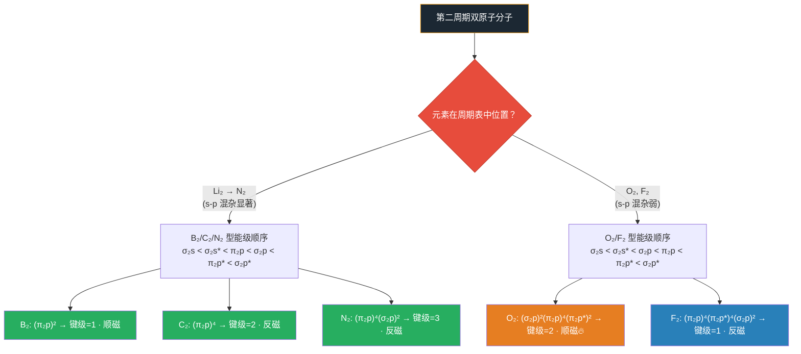

# 分子轨道理论

- 总览：[[中国化学奥林匹克基本要求-总览]]
- 所属模块：[[基础要求-化学原理]]
- 对应考纲条目：[[10-分子结构与化学键]]

## 一、定义
**分子轨道理论（MO Theory）**：原子形成分子时，**原子轨道线性组合（LCAO）**形成**分子轨道**，电子在整个分子的分子轨道中排布。分子轨道遍及整个分子，电子不属于某个特定原子。

核心与 [[杂化轨道理论]] 的区别：杂化是同一原子内轨道的重组，分子轨道是不同原子间轨道的组合。

## 二、考纲对应
- 对应考纲条目：[[10-分子结构与化学键]]（10.5 了解分子轨道的概念和双原子体系的分子轨道各能级排布）
- 所属模块：[[基础要求-化学原理]]
- 本知识点在考纲中的作用：[待填充]

## 三、核心原理

### LCAO 三条件
1. **能量相近**
2. **对称性匹配**（最重要）
3. **最大重叠**

### 成键与反键
- n 个原子轨道 → n 个分子轨道
- **成键轨道**：能量低于原子轨道，电子填入后稳定分子
- **反键轨道**（带 * 号）：能量高于原子轨道，电子填入后削弱化学键
- **非键轨道**：能量与原子轨道相同，不参与成键

### 双原子分子轨道能级图

**B₂, C₂, N₂ 体系（s-p 混合显著）：**
$$\sigma_{2s} < \sigma_{2s}^* < \pi_{2p_x} = \pi_{2p_y} < \sigma_{2p_z} < \pi_{2p_x}^* = \pi_{2p_y}^* < \sigma_{2p_z}^*$$

**O₂, F₂ 体系（s-p 混合弱）：**
$$\sigma_{2s} < \sigma_{2s}^* < \sigma_{2p_z} < \pi_{2p_x} = \pi_{2p_y} < \pi_{2p_x}^* = \pi_{2p_y}^* < \sigma_{2p_z}^*$$



## 四、关键结论

### 键级
$$\text{键级} = \frac{\text{成键电子数} - \text{反键电子数}}{2}$$

### 常见双原子分子的电子排布与键级
| 分子 | 键级 | 未成对电子 | 磁性 |
|:---:|:---:|:---:|:---:|
| H₂⁺ | 0.5 | 1 | 顺磁 |
| H₂ | 1 | 0 | 反磁 |
| N₂ | 3 | 0 | 反磁 |
| O₂ | 2 | 2 | **顺磁** |
| O₂⁺ | 2.5 | 1 | 顺磁 |
| O₂⁻ | 1.5 | 1 | 顺磁 |
| F₂ | 1 | 0 | 反磁 |
| NO | 2.5 | 1 | 顺磁 |
| CO | 3 | 0 | 反磁（与 N₂ 等电子） |

## 五、常见分类或情形

### 双原子分子轨道能级的两种顺序
**B$_2$, C$_2$, N$_2$ 体系（s-p 混合显著，$\Delta E_{2s-2p}$ 小）：**
$$\sigma_{2s} < \sigma_{2s}^* < \pi_{2p_z} = \pi_{2p_y} < \sigma_{2p_x} < \pi_{2p_z}^* = \pi_{2p_y}^* < \sigma_{2p_x}^*$$

**O$_2$, F$_2$ 体系（s-p 混合弱，$\Delta E_{2s-2p}$ 大）：**
$$\sigma_{2s} < \sigma_{2s}^* < \sigma_{2p_x} < \pi_{2p_z} = \pi_{2p_y} < \pi_{2p_z}^* = \pi_{2p_y}^* < \sigma_{2p_x}^*$$

### 第二周期同核双原子分子的电子排布与性质
| 分子 | MO 电子排布（省略内层 KK） | 键级 | 未成对电子 | 磁性 | 键能 (kJ/mol) | 键长 (pm) |
|:---:|------|:---:|:---:|:---:|:---:|:---:|
| Li$_2$ | $(\sigma_{2s})^2$ | 1 | 0 | 反磁 | — | — |
| N$_2$ | $(\pi_{2p})^4(\sigma_{2p_x})^2$ | 3 | 0 | 反磁 | 941 | 110 |
| O$_2$ | $(\sigma_{2p_x})^2(\pi_{2p})^4(\pi_{2p}^*)^2$ | 2 | 2 | **顺磁** | 492 | 121 |
| F$_2$ | $(\pi_{2p})^4(\pi_{2p}^*)^4(\sigma_{2p_x})^2$ | 1 | 0 | 反磁 | 159 | 142 |

### 第二周期双原子分子 MO 能级图与 s-p 混杂（周坤无机新课笔记 · 资产 B4-15 · 可信度：中）

> 来源：[[教学逻辑提炼-周坤无机新课-晶体配合物与气体-第一轮]] · 待核实项 W10 已核实

**B₂/C₂/N₂ 体系（s-p 混杂显著）：**

因 2s 与 2p 轨道能量差较小，$\sigma_{2s}$ 与 $\sigma_{2p}$ 之间发生相互作用，使 $\sigma_{2p_z}$ 能量升高到 $\pi_{2p}$ 之上：

$$\sigma_{2s} < \sigma_{2s}^* < \pi_{2p_x} = \pi_{2p_y} < \sigma_{2p_z} < \pi_{2p_x}^* = \pi_{2p_y}^* < \sigma_{2p_z}^*$$

**O₂/F₂ 体系（s-p 混杂弱）：**

核电荷增大使 2s-2p 能级差增大，s-p 混杂可忽略，恢复"正常"顺序：

$$\sigma_{2s} < \sigma_{2s}^* < \sigma_{2p_z} < \pi_{2p_x} = \pi_{2p_y} < \pi_{2p_x}^* = \pi_{2p_y}^* < \sigma_{2p_z}^*$$

**键级与磁性对比表：**

| 分子 | MO 电子排布（省略 KK） | 键级 | 未成对电子 | 磁性 |
|:---:|------|:---:|:---:|:---:|
| B₂ | $(\pi_{2p})^2$ | 1 | 2 | **顺磁** |
| C₂ | $(\pi_{2p})^4$ | 2 | 0 | 反磁 |
| N₂ | $(\pi_{2p})^4(\sigma_{2p})^2$ | 3 | 0 | 反磁 |
| O₂ | $(\sigma_{2p})^2(\pi_{2p})^4(\pi_{2p}^*)^2$ | 2 | 2 | **顺磁** |
| F₂ | $(\pi_{2p})^4(\pi_{2p}^*)^4(\sigma_{2p})^2$ | 1 | 0 | 反磁 |

**教学要点**：
- B₂ 的顺磁性是 s-p 混杂的直接证据——若按 O₂ 型能级顺序，B₂ 应为反磁性
- C₂ 键级 = 2（无 σ 键！只有 2 个 π 键），这是 s-p 混杂的极端表现
- N₂ 键级 = 3（最强双原子键），但键级构成与直觉不同：1 个 σ + 2 个 π

### 特殊分子/离子
| 物种 | 特点 | 说明 |
|------|------|------|
| H$_2^+$ 离子 | 单电子键，键级 0.5 | Lewis/VB 理论无法解释 |
| He$_2$ | 不能存在（键级 0） | 成键和反键轨道均填满，抵消 |
| O$_2$ | 2 个三电子 $\pi$ 键 | 每个三电子 $\pi$ 键 = (2 成键 - 1 反键)/2 = 0.5 键级 |

## 六、适用条件与限制

1. **适用场景**：特别适合解释 VB 理论无法处理的问题——含未成对电子的分子（磁性）、单电子键/三电子键、离域 $\pi$ 键体系、复杂多原子分子。
2. **三大成键条件**：
   - **对称性匹配原则**（最重要）：原子轨道波函数同号区域叠加为成键轨道，异号区域叠加为反键轨道
   - **能量近似原则**：只有能量相近的原子轨道才能有效组合成分子轨道
   - **最大重叠原则**：重叠越多，成键轨道能量降低越多
3. **方法局限**：不够直观，不易与分子的几何构型直接联系；计算量随分子增大急剧增加。
4. **与 VB 理论的关系**：两者互补而非替代。VB 理论直观（电子定域图像），MO 理论全面（电子离域图像）。至今尚无统一理论可完全取代两者。

## 七、常见比较与易混点

| 对比项 | 价键理论 (VB) | 分子轨道理论 (MO) |
|------|------|------|
| 电子图像 | 定域（两个原子间） | 离域（整个分子） |
| 轨道概念 | 原子轨道重叠成键 | 原子轨道线性组合 $\to$ 分子轨道 |
| 键级 | 整数（共用电子对数） | 可为分数 $(\text{成键} - \text{反键}) / 2$ |
| O$_2$ 顺磁性 | 不能解释 | 自然解释（$\pi^*$ 轨道 2 个未成对电子） |
| H$_2^+$ 存在 | 不能解释 | 单电子键，键级 0.5 |
| 离域体系 | 需共振论辅助 | 直接描述（离域 $\pi$ MO） |
| 直观性 | 与 Lewis 结构、VSEPR 对应 | 数学化，不直观 |

### N$_2$ vs O$_2$ 能级顺序差异的原因
- N（左侧第二周期）：$2s-2p$ 能级差小 $\to$ $2s$ 和 $2p_x$ 相互作用 $\to$ $\sigma_{2p_x}$ 能量升高到 $\pi_{2p}$ 之上
- O（右侧第二周期）：核电荷增大，$2s-2p$ 能级差大 $\to$ 相互作用可忽略 $\to$ $\sigma_{2p_x}$ 在 $\pi_{2p}$ 之下

### 成键轨道 vs 反键轨道 vs 非键轨道
| 类型 | 能量 | 电子云特征 |
|------|------|------|
| 成键轨道（无*号） | 低于原子轨道 | 核间电子云密度增大 |
| 反键轨道（带*号） | 高于原子轨道 | 核间有节面（电子云密度为零） |
| 非键轨道 | 等于原子轨道 | 能量不变，不参与成键 |

## 八、与其他知识点的联系
- 前置知识：[[原子轨道]]、[[杂化轨道理论]]
- 相关知识：[[σ键]]、[[π键]]、[[键级]]、[[等电子体]]
- 应用知识：[[芳香性]]、[[休克尔规则]]、[[有机分子轨道]]、[[配合物]]

## 九、典型题型
- 题型-分子轨道排布
- 题型-键级与磁性判断

## 十、例题

### 例题 1：键级与磁性判断
**题目**：写出 O₂、O₂⁺、O₂⁻ 的 MO 电子排布（价层），计算键级，比较键长、键能和磁性。

**分析**：O₂ 型能级（s-p混杂弱）：σ₂p < π₂p < π₂p* < σ₂p*。O₂ 有 12 个价电子。

**解答**：
1. O₂(12e)：(σ₂p)²(π₂p)⁴(π₂p*)² → 键级=2，2未成对电子→顺磁，键长121 pm
2. O₂⁺(11e)：(σ₂p)²(π₂p)⁴(π₂p*)¹ → 键级=2.5，1未成对→顺磁，键长最短
3. O₂⁻(13e)：(σ₂p)²(π₂p)⁴(π₂p*)³ → 键级=1.5，1未成对→顺磁，键长最长
4. 键长排序：O₂⁺ < O₂ < O₂⁻；键能排序：O₂⁺ > O₂ > O₂⁻

**反思**：π* 每增加1个电子→键级减0.5，键长增加。这是MO理论对"反键电子削弱化学键"的定量描述。

### 例题 2：s-p混杂导致能级反转
**题目**：B₂ 的基态电子排布如何？它是顺磁还是反磁？为什么不能用O₂型能级顺序解释？

**分析**：B(2s²2p¹) → B₂ 共6个价电子。B在周期表左侧，2s-2p能级差小→s-p混杂显著→N₂型顺序。

**解答**：
- B₂ 型能级顺序：σ₂s < σ₂s* < π₂p < σ₂p
- B₂(6e)：(σ₂s)²(σ₂s*)²(π₂p)² → π₂p轨道上2个电子各占一个π轨道（Hund规则）
- 键级 = (4−2)/2 = 1
- **2个未成对电子 → 顺磁性**

**反思**：若按O₂型顺序，σ₂p在π₂p之下→B₂应为反磁。实测B₂是顺磁→这是s-p混杂的直接实验证据。

## 十一、易错点
- **❌ 错**："键级 = 共用电子对数" → MO中键级 = (成键电子−反键电子)/2，可为分数（O₂⁻ 键级1.5）
- **❌ 错**："N₂和O₂的MO能级顺序相同" → B₂/C₂/N₂中σ₂p在π₂p**之上**（s-p混杂），O₂/F₂中σ₂p在π₂p**之下**
- **❌ 错**："反键轨道填了电子键就断了" → 填1-2个反键电子只是削弱键（键级降低），不是断裂。O₂中π*填2个电子→键级仍为2
- **❌ 错**："MO图只需记住电子总数" → 必须确定**正确的能级顺序**。B₂/C₂/N₂和O₂/F₂顺序不同——这是初赛高频考点
- **❌ 错**："成键轨道数 = 原子轨道数" → 对。n个原子轨道→n个分子轨道（成键+反键+非键）

## 十二、🎯 教学视角

### 12.1 学生典型认知误区

| 误区 | 学生为什么会这么想 | 正确认识 | 口诀 |
|:---|:---|:---|:---|
| "MO理论太难，VB就够了" | 被MO能级图吓退 | VB/Lewis无法解释O₂顺磁性、H₂⁺单电子键、He₂⁺三电子键。MO是**唯一**能给这些"异常"以自然解释的理论。竞赛初赛必考O₂磁性 | "遇到磁性问MO，VB解释不了就找我" |
| "键级=共用电子对数" | 从Lewis键级迁移而来 | MO中键级=(成键-反键)/2，**可为分数**：O₂⁻键级1.5、H₂⁺键级0.5。分数键级是MO理论的标志性贡献 | "MO键级可分数，成键减反键除二" |
| "N₂和O₂的MO能级顺序一样" | 以为第二周期统一排序 | 因s-p混杂程度不同：B₂/C₂/N₂中σ(2p)在π(2p)之上，O₂/F₂中σ(2p)在π(2p)之下。**这是初赛高频考点** | "氮前σ在π上，氧后σ在π下" |
| "反键轨道填了电子键就断了" | 把反键当"反物质" | 填1-2个反键电子只是**削弱**键（键级降低），不等于断裂。O₂中π*各有1个电子→键级仍为2→O=O双键仍存在 | "反键电子减键级，不是一键就归零" |

### 12.2 入门级例题

**题目**：写出O₂、O₂⁺、O₂⁻、O₂²⁻的MO电子排布（只写价层），计算键级，比较键长和磁性。

**预期解答路径**：
1. O₂(12价电子)：(σ₂p)²(π₂p)⁴(π₂p*)² → 键级=2，2未成对电子→顺磁
2. O₂⁺(11价电子)：(σ₂p)²(π₂p)⁴(π₂p*)¹ → 键级=2.5，1未成对→顺磁
3. O₂⁻(13价电子)：(σ₂p)²(π₂p)⁴(π₂p*)³ → 键级=1.5，1未成对→顺磁
4. O₂²⁻(14价电子)：(σ₂p)²(π₂p)⁴(π₂p*)⁴ → 键级=1，0未成对→反磁
5. 键长：O₂⁺(最短) < O₂ < O₂⁻ < O₂²⁻(最长)

**教师引导提问**：为什么O₂⁺比O₂更稳定（键级更高）而O₂⁻比O₂更弱？（反键π*轨道每填入1个电子→键级减0.5→键被削弱。O₂⁺少了一个反键电子→键更强；O₂⁻多了一个反键电子→键更弱。这个规律适用于所有双原子分子）

### 12.3 与现实/直觉的连接

- **MO理论=分子世界的"人口普查"**：VB理论只在两个原子间"数人头"（定域），MO理论在整个分子范围内"登记"所有电子（离域）。就像从"每户登记"升级到"全国普查"
- **O₂磁性之谜——MO理论的"成名作"**：液氧能被磁铁吸引——Lewis结构O=O无法解释（所有电子成对→应反磁）。MO揭示真相：π*反键轨道上2个单电子→O₂是双自由基→顺磁性。这是MO理论最漂亮的"实战胜利"
- **成键轨道vs反键轨道=稳定vs不稳定住宅**：成键轨道=低洼地带（能量低，电子喜欢住），反键轨道=山顶（能量高，电子不情愿住）。键级= (低洼居民 - 山顶居民)/2——居民净优势越大，键越强

## 十三、🧰 备课可抽料资产

### 13.1 主干结论（Concept Asset）

- 分子轨道理论把电子看成在整个分子中离域分布，是解释磁性、键级分数和离域键的核心工具。
- 判断双原子分子性质的三件套是：能级顺序、电子填充、键级与未成对电子数。
- O₂ 的顺磁性是 MO 理论最重要的入门证据。

### 13.2 机制 / 推导资产（Mechanism Asset）

- 可直接复用的机制说明：原子轨道满足能量相近、对称性匹配、最大重叠时，线性组合形成成键轨道与反键轨道。
- 可直接复用的核心公式：$\text{键级} = (\text{成键电子数} - \text{反键电子数})/2$。
- 深入点：B₂/C₂/N₂ 与 O₂/F₂ 的能级顺序差异来自 s-p 混杂强弱不同。

### 13.3 误区 / 纠偏资产（Misconception Asset）

- 学生最常见的错法：把键级当共用电子对数、把 N₂/O₂ 的能级顺序混同、以为反键电子一出现键就断。
- 可直接复用的纠偏句：
  - “MO 键级可分数，成键减反键除二。”
  - “氮前 sigma 在 pi 上，氧后 sigma 在 pi 下。”
  - “反键电子减键级，不是一下清零。”

### 13.4 题型 / 例题资产（Problem-chain Asset）

- 建议题链：H₂/H₂⁺ 单电子键 → B₂/C₂/N₂ 排布 → O₂ 顺磁性 → O₂⁺/O₂⁻ 键级变化。
- 适合课堂快练：
  - “为什么 O₂ 是顺磁？”
  - “为什么 O₂⁺ 的键长比 O₂ 更短？”

### 13.5 图景 / 图片资产（Visual Asset）

- 高优先图景：第二周期双原子分子 MO 能级图、O₂ 与 O₂⁺/O₂⁻ 的占据对比图。
- 本页非常依赖图像，建议后续优先补标准 MO 能级图注页。

### 13.6 备课落点建议

- 本页适合作为“价键理论讲不通的现象解释页”，不要一上来就堆所有体系。
- 若课时紧，最小闭环应包括：LCAO 三条件、键级公式、O₂ 顺磁性、N₂/O₂ 顺序差异。

## 十四、竞赛拓展
- [待填充]

## 十五、外部资料出处
- 主要来源：[[提炼-普化原理-第12章-化学键与分子结构]]（《普通化学原理 第4版》第 12 章，12.4 分子轨道理论）
- O$_2$ 分子的 MO 处理：同章节 12.4.2
- 离域 $\pi$ 键的 MO 处理：同章节 12.4，NO$_2$ 和 C$_6$H$_6$ 的例子

## 十六、待完善项
- [ ] 需从骨架填充为完整版
- [ ] 补充异核双原子分子（CO、NO、HF）的 MO 图
- [ ] 补充休克尔分子轨道理论简介
- [ ] 补充决赛真题示例

---

## 相关真题（Dataview）

```dataview
TABLE
  question_type AS 题型,
  difficulty AS 难度,
  teaching_level AS 教学层级,
  source AS 来源
FROM "04-题库"
WHERE type = "题目"
  AND contains(knowledge_points, "分子轨道理论")
SORT difficulty ASC, year DESC
```
