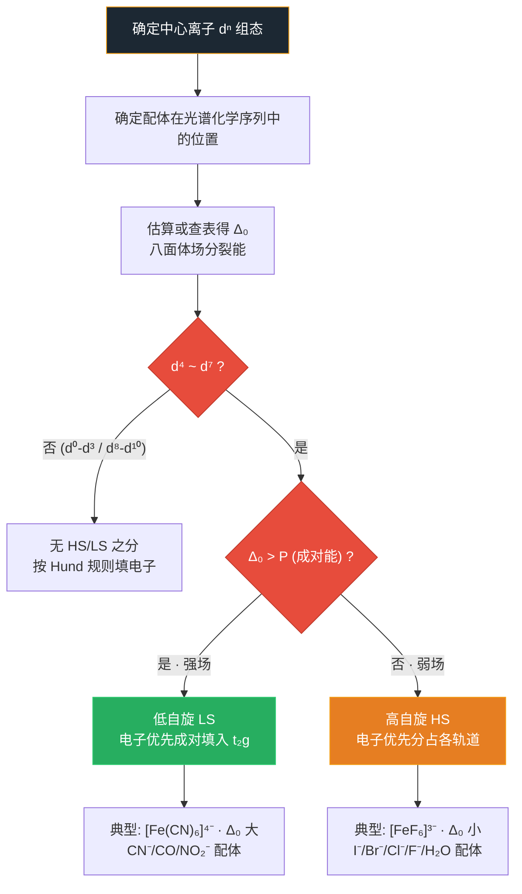

## 配位场理论

**配位场理论（Ligand Field Theory, LFT）** 是晶体场理论（CFT）的扩展，将分子轨道（MO）理论与CFT结合，引入了**共价成键**的概念。

### LFT相对于CFT的扩展

| 理论 | 基础 | 共价性 | 光谱化学序列解释 | 应用 |
|:---|:---|:---|:---|:---|
| **晶体场理论（CFT）** | 纯静电（点电荷） | 不考虑 | 不能解释 | 磁性、颜色、CFSE |
| **配位场理论（LFT）** | CFT + MO理论 | 引入σ/π成键 | 可用σ给体 + π受体解释 | 更全面的成键描述 |

**LFT的核心扩展**：
1. **σ给受体分类**：配体通过σ轨道向金属给电子
2. **π给受体分类**：配体通过π轨道与金属相互作用
   - **π给体**（I⁻, Br⁻, Cl⁻）：有填充的π轨道 → 推高t₂g → 减小Δ₀ → 弱场
   - **π中性**（H₂O, NH₃）：π作用很弱 → 基本不变 → 中间场
   - **π受体**（CO, CN⁻, PR₃）：有空的π\*轨道 → 拉低t₂g → 增大Δ₀ → 强场

### 配体分类（从轨道相互作用角度）

#### 1. 仅σ给体（sigma donor only）
- 典型例子：H₂O, NH₃
- 只提供σ电子对给金属
- 中等分裂能

#### 2. σ给体 + π受体（π酸配体）
- 典型例子：CO, CN⁻, NO, PR₃
- 既提供σ电子，又接受金属d电子进入π\*轨道
- 强分裂能（光谱化学序列中位于高端）

#### 3. 强σ给体 + π给体
- 典型例子：F⁻, Cl⁻, Br⁻, I⁻
- 提供σ电子的同时，也向金属提供π电子
- 弱分裂能（光谱化学序列中位于低端）

**轨道能量比较**：
- Cl的σ轨道能量 > F（因Cl用3p轨道，F用2p轨道）
- 同族卤素从上到下π给体能力增强，分裂能减小

> **竞赛要求**：CFT是基础要求，LFT仅在决赛涉及。当需要解释CO、CN⁻等配体的强场效应时，需用LFT的π受体概念。

---

# 晶体场理论

- 总览：[[中国化学奥林匹克基本要求-总览]]
- 所属模块：[[基础要求-化学原理]]
- 对应考纲条目：[[12-配合物]]

## 一、定义
**晶体场理论（CFT）**：将配体视为**点电荷/点偶极**，中心金属的 **d 轨道在配体静电场作用下发生能级分裂**。这是一种纯静电模型。

## 二、考纲对应
- 对应考纲条目：[[12-配合物]]（12.4 了解晶体场理论的基本思想和d轨道分裂）
- 晶体场理论是解释配合物颜色、磁性和稳定性的核心理论

## 三、核心原理

### 高自旋 vs 低自旋判断流程（周坤无机新课笔记 · 资产 B4-12 · 可信度：高）

> 来源：[[教学逻辑提炼-周坤无机新课-晶体配合物与气体-第一轮]]

**判断逻辑链**：


```mermaid
graph TD
    A["确定中心离子 dⁿ 组态"] --> B["确定配体在光谱化学序列中的位置"]
    B --> C["估算或查表得 Δ₀<br/>八面体场分裂能"]
    C --> D{"d⁴ ~ d⁷ ?"}
    D -->|"否 (d⁰-d³ / d⁸-d¹⁰)"| E["无 HS/LS 之分<br/>按 Hund 规则填电子"]
    D -->|"是"| F{"Δ₀ > P (成对能) ?"}
    F -->|"是 · 强场"| G["低自旋 LS<br/>电子优先成对填入 t₂g"]
    F -->|"否 · 弱场"| H["高自旋 HS<br/>电子优先分占各轨道"]
    
    G --> G1["典型: [Fe(CN)₆]⁴⁻ · Δ₀ 大<br/>CN⁻/CO/NO₂⁻ 配体"]
    H --> H1["典型: [FeF₆]³⁻ · Δ₀ 小<br/>I⁻/Br⁻/Cl⁻/F⁻/H₂O 配体"]
    
    style A fill:#1C2833,stroke:#F39C12,color:#FFF
    style D fill:#E74C3C,stroke:#C0392B,color:#FFF
    style F fill:#E74C3C,stroke:#C0392B,color:#FFF
    style G fill:#27AE60,stroke:#2ECC71,color:#FFF
    style H fill:#E67E22,stroke:#F39C12,color:#FFF
```

**弱场配体 vs 强场配体分类**：

| 类型 | 配体 | Δ₀ 特征 | 自旋态 | 典型实例 |
|:---|:---|:---:|:---|:---|
| **弱场** | I⁻, Br⁻, Cl⁻, F⁻, H₂O | Δ₀ 较小 | 高自旋 | [FeF₆]³⁻, [Fe(H₂O)₆]²⁺ |
| **中等场** | NH₃, en | Δ₀ 中等 | 取决于金属 | [Co(NH₃)₆]³⁺ (LS), [Ni(NH₃)₆]²⁺ (HS) |
| **强场** | CN⁻, CO, NO₂⁻ | Δ₀ 较大 | 低自旋 | [Fe(CN)₆]⁴⁻, [Co(CN)₆]³⁻ |

**教学要点**：
- 3d 金属：配体场强决定 HS/LS
- 4d/5d 金属：几乎总是 LS（Δ₀ 足够大）
- d⁰-d³ 和 d⁸-d¹⁰：无 HS/LS 之分（电子数不足以产生选择）
- d⁴-d⁷：HS/LS 选择的关键区间

### 八面体场（Oh）中的 d 轨道分裂

![[media/zgxg-octahedral-cft-splitting.jpg]]


- **$e_g$ 轨道**（$d_{x^2-y^2}, d_{z^2}$）：指向配体 → 能量升高
- **$t_{2g}$ 轨道**（$d_{xy}, d_{xz}, d_{yz}$）：指向配体之间 → 能量降低
- **分裂能** $\Delta_o = E(e_g) - E(t_{2g})$，也称 $10Dq$

**具体数值实例**（《普通化学原理》第 14 章）：
- $\mathrm{FeF_6^{3-}}$（弱场）：$\Delta_o = 13700\,\mathrm{cm^{-1}}$，$P = 30000\,\mathrm{cm^{-1}}$，$\Delta_o < P$ → 高自旋
- $\mathrm{Fe(CN)_6^{3-}}$（强场）：$\Delta_o = 34250\,\mathrm{cm^{-1}}$，$\Delta_o > P$ → 低自旋
- $\mathrm{Ti(H_2O)_6^{3+}}$：$\Delta_o = 20400\,\mathrm{cm^{-1}}$（对应吸收波长约 $500\,\mathrm{nm}$）

### 四面体场（Td）
- 分裂能 $\Delta_t \approx \frac{4}{9}\Delta_o$

![[media/zgxg-tetrahedral-cft-splitting.jpg]]


- 总是**高自旋**（$\Delta_t$ 较小，无法克服配对能）

### 平面正方形场
- 从八面体去掉 z 轴配体推导

### 定性推出 d 轨道裂分型式的方法（★ 竞赛思维）

> **来源：[[07-资料提炼/书籍提炼/提炼-化学竞赛初赛讲义-第4讲-配合物|化学竞赛初赛讲义第4讲 例4.29]]** — 不靠死记，从配体位置直接推理裂分型式。

**三步法**：

**第一步：设坐标系，定位配体**
- 平面正方形：4 配体在 ±x, ±y
- 四方锥：4 底面配体在 ±x, ±y，1 顶配体在 +z
- 三角双锥：2 轴向在 ±z，3 赤道在 xOy 面 120° 分布

**第二步：判断每个 d 轨道受配体影响的程度**

| d 轨道 | 瓣的指向 | 受影响程度 |
|:---|:---|:---|
| d_(x²−y²) | 瓣指向 x, y 轴正负方向 | 配体在 x, y 轴时受影响**最大** |
| d_(z²) | 沿 z 轴的瓣 + xOy 面的"甜甜圈" | z 轴有配体时大，仅 xOy 面时较小 |
| d_(xy) | 瓣在 x, y 轴之间的 45° 方向 | 受影响**次之** |
| d_(xz), d_(yz) | 瓣在 xz/yz 面 | 通常受影响**最小**且**等价** |

**第三步：按受影响程度排序，得裂分型式**
- **平面正方形**：d_(x²−y²) ≫ d_(xy) > d_(z²) > d_(xz)=d_(yz) → 裂分型式 "2111"
- **四方锥**：同平面正方形，但 d_(z²) 受影响更大 → 仍为 "2111"
- **三角双锥**：d_(z²) ≫ d_(x²−y²)=d_(xy) > d_(xz)=d_(yz) → 裂分型式 "221"

> **教学价值**：这个方法训练的不是"背诵"，而是"空间想象力 + 静电推理"。学生学会之后，遇到任何陌生配位构型（如三棱柱、加冠多面体）都能自己推。课堂上可以先让学生不看答案，自己在纸上画配体位置→画 d 轨道→推断能级顺序。

## 四、关键结论

### 光谱化学序列（配体场强）
$$\mathrm{I}^- < \mathrm{Br}^- < \mathrm{Cl}^- < \mathrm{F}^- < \mathrm{OH}^- < \mathrm{C_2O_4^{2-}} < \mathrm{H_2O} < \mathrm{SCN}^- < \mathrm{NH_3} < \mathrm{en} < \mathrm{SO_3^{2-}} < o\text{-phen} < \mathrm{NO_2^-} < \mathrm{CN}^-, \mathrm{CO}$$

（资料来源：《普通化学原理 第4版》14.5.1 节）

- 弱场配体（$\mathrm{I^-}$ 到 $\mathrm{F^-}$）：$\Delta_o$ 小 → 高自旋
- 中等强场（$\mathrm{H_2O}$、$\mathrm{NH_3}$ 等）：$\Delta_o$ 中等
- 强场配体（$\mathrm{NO_2^-}$、$\mathrm{CN}^-$、CO）：$\Delta_o$ 大 → 低自旋
- 大体以水和 $\mathrm{NH_3}$ 为分界。对不同的中心离子，顺序略有差异。

**分裂能的变化规律**：
- 同一过渡系列：中心离子电荷越高、半径越大 → $\Delta$ 越大
- 周期趋势：第二过渡系列比第一过渡系列 $\Delta$ 大 $40\%\!\sim\!50\%$，第三过渡系列又比第二过渡系列大 $20\%\!\sim\!25\%$

### 光谱化学序的本质：σ/π 配位场解释（★ 理解→不靠死记）

> **来源：[[07-资料提炼/书籍提炼/提炼-化学竞赛初赛讲义-第4讲-配合物|化学竞赛初赛讲义第4讲 §4.4]]** — 用 MO 语言把光谱化学序从"死记表"变成"可理解可预测的分类"。

**核心逻辑（三层）：**

**第一层：只考虑 σ 成键的 MO 图**（为什么 Δ₀ 会出现）

- 6 个配体的 σ 群轨道对称性：A₁g + T₁u + Eg
- 金属 4s → A₁g；4p → T₁u；3d → Eg + T₂g
- 相同对称性轨道组合：成键 MO（主要配体特征）+ 反键 MO（主要金属特征）
- **关键**：T₂g 对应的 dxy, dxz, dyz 没有相同对称性的配体 σ 群轨道可匹配 → **非键**
- 分裂能 Δ₀ = E(eg*) − E(t₂g) 自然出现

**第二层：π 给体 → 弱场**

- π 给体配体（I⁻, Br⁻, Cl⁻）有**填充的** π 对称性轨道
- 这些配体 π 轨道具有 T₂g 对称性 → 与金属 t₂g 非键轨道作用
- 成键 π MO（能量更低）+ 反键 π\* MO → t₂g 的能量被**推高**
- 结果：Δ₀ **减小** → **弱场**

**第三层：π 受体 → 强场**

- π 受体配体（CO, CN⁻, PR₃）有**空的** π\* 轨道
- 同样具有 T₂g 对称性 → 与金属 t₂g 轨道作用
- 金属 t₂g 电子部分"反馈"到配体 π\*（= 反馈 π 键）→ t₂g 能量**降低**
- 结果：Δ₀ **增大** → **强场**

**分类口诀**：

| 配体类型 | 配体实例 | π 行为 | 对 t₂g 的影响 | 对 Δ₀ 的影响 | 场强分类 |
|:---|:---|:---|:---|:---|:---|
| π 给体 | I⁻, Br⁻, Cl⁻ | 有孤对 → 给 π | **推高** t₂g | **减小** | 弱场 |
| π 中性 | H₂O, NH₃ | π 作用很弱 | 基本不动 | 基本不变 | 中间场 |
| π 受体 | CN⁻, CO, PR₃ | 有空 π\* → 接 π | **拉低** t₂g | **增大** | 强场 |

> **教学价值**：教学生这个逻辑之后，遇到陌生配体时可以自己判断——"这个配体有没有可用的 π 轨道？是给电子还是接电子？"——而不是死记顺序表。竞赛中偶尔会出现光谱化学序中没有的配体（如膦、亚硝酰等），这个框架可以直接用。

### 光谱化学序列与软硬酸碱理论的联系（★ 竞赛桥梁知识）

> 光谱化学序列和 HSAB 理论看似独立，实则共享一个底层逻辑：**配体与金属之间的轨道匹配程度**。

| 维度 | 光谱化学序列 | HSAB 理论 |
|:---|:---|:---|
| **核心问题** | 配体场强（Δ₀ 大小） | 配体-金属亲和力（稳定常数大小） |
| **底层机制** | σ/π 轨道相互作用 → Δ₀ | σ/π 轨道相互作用 + 极化率 → 稳定性 |
| **硬配体** | F⁻, H₂O（弱-中场） | F⁻, H₂O, OH⁻ → 倾向与硬酸（Al³⁺, Fe³⁺）结合 |
| **软配体** | CN⁻, CO, PR₃（强场） | CN⁻, CO, PR₃, I⁻ → 倾向与软酸（Ag⁺, Pt²⁺）结合 |
| **中间配体** | NH₃, en（中场） | NH₃, en → 与中间酸碱均可配位 |

**竞赛应用**：
- 解释配合物稳定性选择性：如 Ag⁺（软酸）优先与 I⁻（软碱）而非 F⁻（硬碱）配位
- 解释分析化学掩蔽策略：用 CN⁻（软碱）选择性掩蔽软金属离子
- **注意差异**：光谱化学序中 F⁻ 场强 > I⁻（静电模型），但 HSAB 中 I⁻ 对软酸的亲和力 > F⁻ —— 两者不矛盾，因为光谱化学序衡量的是分裂能，HSAB 衡量的是热力学稳定性

### 高自旋 vs 低自旋
- $\Delta_o > P$（配对能）→ 低自旋（LS）
- $\Delta_o < P$ → 高自旋（HS）
- 3d 金属：配体决定；4d/5d 金属：几乎总是低自旋（$\Delta_o$ 更大）

### CFSE（晶体场稳定化能）
- $t_{2g}$ 每电子稳定 $-0.4\Delta_o$
- $e_g$ 每电子不稳定 $+0.6\Delta_o$
- 实例：[Fe(H₂O)₆]²⁺ (HS d⁶) CFSE = −0.4Δo，[Fe(CN)₆]⁴⁻ (LS d⁶) CFSE = −2.4Δo

## 五、常见分类或情形

### 各 dⁿ 电子组态的 CFSE
| dⁿ | HS 构型 ($t_{2g}^x e_g^y$) | HS CFSE | LS 构型 | LS CFSE |
|:---:|------|:---:|------|:---:|
| d¹ | $t_{2g}^1$ | −0.4Δo | — | — |
| d² | $t_{2g}^2$ | −0.8Δo | — | — |
| d³ | $t_{2g}^3$ | −1.2Δo | — | — |
| d⁴ | $t_{2g}^3 e_g^1$ | −0.6Δo | $t_{2g}^4$ | −1.6Δo + P |
| d⁵ | $t_{2g}^3 e_g^2$ | 0 | $t_{2g}^5$ | −2.0Δo + 2P |
| d⁶ | $t_{2g}^4 e_g^2$ | −0.4Δo | $t_{2g}^6$ | −2.4Δo + 2P |
| d⁷ | $t_{2g}^5 e_g^2$ | −0.8Δo | $t_{2g}^6 e_g^1$ | −1.8Δo + P |
| d⁸ | $t_{2g}^6 e_g^2$ | −1.2Δo | — | — |
| d⁹ | $t_{2g}^6 e_g^3$ | −0.6Δo | — | — |
| d¹⁰ | $t_{2g}^6 e_g^4$ | 0 | — | — |


### 影响 Δo 的因素
| 因素 | 趋势 | 说明 |
|------|------|------|
| 配体性质 | I⁻<Br⁻<Cl⁻<F⁻<OH⁻<H₂O<NH₃<en<NO₂⁻<CN⁻<CO | 光谱化学序列 |
| 金属氧化态 | 氧化态越高，Δo 越大 | M³⁺ > M²⁺ |
| 金属所在周期 | 3d < 4d < 5d | Δo(5d) ≈ 1.5× Δo(3d) |
| 配位数 | Oh > Td | Δt ≈ 4/9Δo |
| 几何构型 | 平面正方形 > Oh | 分裂模式不同 |

### 配位光谱的最小课堂链

一旦课堂开始讨论"为什么某配合物有颜色、颜色深浅为什么不同"，就不能只停在"有分裂所以有颜色"，而要把链条补完整：

`d电子数与构型 -> 分裂能大小 -> 跃迁类型 -> 允许/禁阻 -> 吸收位置与强度 -> 显色`

| 关心的问题 | 最低判断动作 | 课堂高频结论 |
|------|------|------|
| 有没有 d-d 跃迁？ | 先看 d 电子数与构型 | d0 / d10 通常无 d-d 跃迁 |
| 为什么有的颜色很浅？ | 看选律 | 八面体中心对称体系的 d-d 跃迁常受 Laporte 禁阻，颜色往往偏浅 |
| 为什么四面体常更鲜艳？ | 看对称性 | Td 无反演中心，d-d 跃迁禁阻较弱，吸收强度常更大 |
| 为什么有的带特别强？ | 区分 d-d 与 CT | 电荷转移带通常比 d-d 带强得多 |
| 什么时候要升级到 TS 图？ | 看是否进入多电子定量归属 | 需要从多条吸收带反推 $\Delta_o$、B 或归属跃迁时，转去 [[Tanabe-Sugano图]] |

这里最值得学生先建立的不是复杂图，而是两个判断：
- **颜色位置主要看 $\Delta$**
- **颜色深浅主要看跃迁是否允许**

### 配位光谱里的三种高频吸收

| 吸收类型 | 课堂来源 | 强度特征 | 课堂判断口径 |
|------|------|------|------|
| d-d 跃迁 | 分裂后的 d 轨道之间跃迁 | 常较弱 | 先看 d 电子数、构型与选律 |
| LMCT | 配体到金属的电荷转移 | 常很强 | 高氧化态金属、易给电子配体常高频 |
| MLCT | 金属到配体的电荷转移 | 常很强 | 低价金属配强受体配体时常见 |

### Jahn-Teller 效应
- 电子在简并轨道中不对称占据 → 几何畸变消除简并
- **强 J-T**：$e_g$ 轨道不对称占据（如 d⁴ HS, d⁹, d⁷ LS）
- **弱 J-T**：$t_{2g}$ 轨道不对称占据
- 典型：Cu²⁺ (d⁹) 配合物——z 轴拉长的八面体（4 短 2 长）

### 反位效应（trans effect）

> **来源：[[07-资料提炼/书籍提炼/提炼-化学竞赛初赛讲义-第4讲-配合物|化学竞赛初赛讲义第4讲 §4.3.3]]** — 初赛配合物合成推断题的核心工具。

**定义**：在平面正方形或八面体配合物中，某些配体能使其对位（trans）的配体变得更容易被取代。这种**动力学**效应称为反位效应。

**完整顺序**（从弱到强）：

$$
\begin{aligned}
&\mathrm{F^-,\;H_2O,\;OH^-} < \mathrm{NH_3} < \mathrm{py} < \mathrm{Cl^-} < \mathrm{Br^-} \\
&\quad < \mathrm{I^-,\;SCN^-,\;NO_2^-,\;SC(NH_2)_2,\;Ph^-} < \mathrm{SO_3^{2-}} \\
&\quad < \mathrm{PR_3,\;AsR_3,\;SR_2,\;CH_3^-} < \mathrm{H^-,\;NO,\;CO,\;CN^-,\;C_2H_4}
\end{aligned}
$$

**两个规律**：
- 强反位效应的配体要么具有**强 π 受体性质**（CO, CN⁻, C₂H₄）——能从金属 d 轨道接受电子进入 π\*
- 要么**体积特别小**（H⁻）——便于在过渡态中靠近金属

**顺铂合成的反位效应逻辑**（最经典的竞赛考点）：

$$\ce{PtCl4^{2-} ->[1\;eq\;NH3][Cl^- > NH3] ->[2\;eq\;NH3][对位 Cl 被活化] \text{顺式 }PtCl2(NH3)2}$$

1. 从 $\ce{PtCl4^{2-}}$ 开始：$\ce{Cl-}$ 的反位效应 $\gg \ce{NH3}$
2. 第一当量 $\ce{NH3}$ 取代一个 $\ce{Cl-}$ → 其对位的 $\ce{Cl-}$ 被**活化**（反位效应使它更容易离去）
3. 第二当量 $\ce{NH3}$ **选择性**取代这个被活化的 $\ce{Cl-}$ → 得到**顺式** $\ce{PtCl2(NH3)2}$
4. 如果反过来从 $\ce{Pt(NH3)4^{2+}}$ 开始加 $\ce{Cl-}$，$\ce{NH3}$ 的反位效应弱 → 不会得到顺铂

> **学生理解口诀**："反位效应 = 对位被'怂恿'离开"；"强 π 受体配体 = 吸走金属电子密度 → 削弱对位 M-L 键 → 对位配体容易走"。

**课堂引入建议**：先问学生"如果你要合成顺铂，应该从 $\ce{PtCl4^{2-}}$ 开始加 $\ce{NH3}$，还是从 $\ce{Pt(NH3)4^{2+}}$ 开始加 $\ce{Cl-}$？为什么？"——用这个问题自然引出反位效应。

## 六、适用条件与限制
- ✅ 解释配合物颜色（d-d 跃迁吸收可见光）
- ✅ 解释配合物磁性（高/低自旋判断）
- ✅ 解释配合物几何构型（Oh, Td, 平面正方形）
- ⚠️ **不能解释**：CO, CN⁻ 等配体为何位于序列右端（需分子轨道理论/反馈 π 键）
- ⚠️ **不能解释**：光谱化学序列本身的来源（纯静电模型无法解释中性配体的强场效应）
- ⚠️ **不能处理**：共价性强的配合物（如有机金属化合物）
- ⚠️ 定量计算 Δo 需借助光谱数据（$\lambda_{\max}$ 对应 Δo）

## 七、常见比较与易混点
| 对比项 | 晶体场理论 (CFT) | 配位场理论 (LFT) |
|------|------|------|
| 基础 | 纯静电（点电荷） | CFT + MO 理论 |
| 共价性 | 不考虑 | 引入 σ/π 成键 |
| 光谱化学序列 | 不能解释 | 可用 σ 给体 + π 受体解释 |
| 应用 | 磁性、颜色、CFSE | 更全面的成键描述 |
| 竞赛 | 基础要求 | 仅在决赛涉及 |

| 易混点 | 区分 |
|------|------|
| Δo vs 10 Dq | 同一概念的不同符号，Δo = 10 Dq |
| CFSE 计算含 P | LS 的 CFSE 公式要加上 mP（m 为成对数增加值） |
| 四面体总是高自旋 | Δt 太小（~4/9 Δo），且 Td 中 d 轨道分裂不再是 $e_g$/$t_{2g}$（记作 e/t₂） |
| d⁴-d⁷ 开放 | 这些组态有 HS/LS 之分，d¹-d³ 和 d⁸-d¹⁰ 无此选择 |

## 八、与其他知识点的联系
- 前置知识：[[配合物]]、[[配位键]]、原子结构（d 轨道形状）、[[电子排布]]
- 相关知识：[[高自旋与低自旋]]、[[配合物几何构型]]、[[配合物异构]]、[[配合物杂化轨道理论]]
- 应用知识：过渡元素化学、[[Jahn-Teller效应]]、配合物颜色判断、磁性判断

## 九、典型题型
- 题型-晶体场分裂能比较
- 题型-高/低自旋判断
- 题型-CFSE计算
- 题型-配合物颜色推断

## 十、例题
### 例题 1：高/低自旋判断
**题目：** [Fe(H₂O)₆]²⁺ 和 [Fe(CN)₆]⁴⁻ 哪个是高自旋？哪个是低自旋？简要说明理由。

**分析：** Fe²⁺ 为 d⁶。H₂O 是弱场配体（光谱化学序列左侧），CN⁻ 是强场配体（序列右侧）。

**解答：**
- [Fe(H₂O)₆]²⁺：H₂O 弱场 → Δo 小 < P → **高自旋**（$t_{2g}^4 e_g^2$），4 个未成对电子
- [Fe(CN)₆]⁴⁻：CN⁻ 强场 → Δo 大 > P → **低自旋**（$t_{2g}^6$），0 个未成对电子

**反思：** 判断 HS/LS 的两个核心要素：配体在光谱化学序列中的位置 + 金属离子 dⁿ 组态。

### 例题 2：CFSE 计算
**题目：** 计算 [CoF₆]³⁻（高自旋）和 [Co(NH₃)₆]³⁺（低自旋）的 CFSE（以 Δo 为单位）。

**分析：** Co³⁺ 为 d⁶。F⁻ 弱场 → HS；NH₃ 中强场 → LS。

**解答：**
- HS d⁶ ($t_{2g}^4 e_g^2$)：CFSE = 4×(−0.4Δo) + 2×(+0.6Δo) = −1.6 + 1.2 = **−0.4Δo**
- LS d⁶ ($t_{2g}^6$)：CFSE = 6×(−0.4Δo) = **−2.4Δo**（注意：LS 还需加 2P，但题目按 Δo 为单位）

**反思：** LS 配合物的稳定性远高于 HS（CFSE 差 2.0Δo），这解释了为什么强场配体形成的配合物更稳定。

### 例题 3：颜色推断
**题目：** [Ti(H₂O)₆]³⁺ 呈紫色（λ_max ≈ 500 nm）。1）判断其 d 电子组态 2）估算 Δo（kJ/mol）。h = 6.626×10⁻³⁴ J·s, c = 3.0×10⁸ m/s, NA = 6.02×10²³。

**分析：** Ti³⁺ 为 d¹。唯一的吸收峰对应 $t_{2g} \to e_g$ 跃迁。Δo = hc/λ_max。

**解答：**
1）Ti³⁺：[Ar]3d¹ → $t_{2g}^1$ 构型，八面体场中一个 d 电子在 $t_{2g}$ 轨道
2）$$E = \frac{hc}{\lambda} = \frac{6.626\times10^{-34} \times 3.0\times10^8}{500\times10^{-9}} = 3.98\times10^{-19} \text{ J}$$
$$\Delta_o = E \times N_A = 3.98\times10^{-19} \times 6.02\times10^{23} = 239 \text{ kJ/mol}$$

**反思：** 竞赛中常通过 λ_max 计算 Δo，再用 Δo 大小解释配体场强弱和自旋态。

## 十一、易错点
- **❌ 错：** 混淆 CFSE 公式的正负号 → $t_{2g}$: −0.4Δo, $e_g$: +0.6Δo（记住：$t_{2g}$ 降低能量，$e_g$ 升高能量）
- **❌ 错：** LS 的 CFSE 忘记加配对能项 → LS 比 HS 多出的配对电子对需要额外能量
- **❌ 错：** 将四面体场的 d 轨道符号写成 $e_g$/$t_{2g}$ → Td 中无对称中心，记作 e 和 t₂
- **❌ 错：** 认为所有 d⁴-d⁷ 都有 HS/LS 之分 → 4d 和 5d 金属几乎总是 LS（Δo 足够大）
- **❌ 错：** Δo = 10 Dq 中的 Dq 不是 Δo 的 1/10 → Dq 是配体场分裂参数，Oh 中 Δo = 10 Dq

## 十二、竞赛拓展

### 12.1 电荷转移（CT）跃迁与配合物颜色（39届初赛重点）

**CT 跃迁 vs d-d 跃迁的区别：**

| 性质 | d-d 跃迁 | CT 跃迁 |
|:---|:---|:---|
| 本质 | 电子在金属 d 轨道之间跃迁 | 电子从金属→配体（MLCT）或配体→金属（LMCT） |
| 对称性 | Laporte 禁阻（g→g 在 Oh 中禁阻） | **对称性允许** |
| 吸收强度 | 弱（ε ~ 1-100） | **强**（ε ~ 10³-10⁵） |
| 吸收带 | 窄带 | **宽带**（电子-声子耦合显著） |

**普鲁士蓝的颜色来源（39届初赛 2.1.2）：**

普鲁士蓝 $\mathrm{KFe^{III}Fe^{II}(CN)_6}$ 的深蓝色来自**金属-金属电荷转移（MMCT）**：

$$\mathrm{Fe^{II}} \rightarrow \mathrm{C\!\equiv\!N} \rightarrow \mathrm{Fe^{III}}$$

- $\mathrm{Fe^{II}}$（$t_{2g}^6$）：良好电子给体
- $\mathrm{Fe^{III}}$（$t_{2g}^3 e_g^2$）：良好电子受体
- $\mathrm{CN^-}$ 的共轭 π 系统 → 强轨道耦合 → 高效 CT 通道
- 红光区（~700 nm）宽带强吸收 → 透射蓝光 → **深蓝色**

还原为普鲁士白 $\mathrm{K_2Fe_2^{II}(CN)_6}$ 后：全部 $\mathrm{Fe^{II}}$，CT 通道破坏 → 不再吸收可见光 → **白色**。

**竞赛真题链接：** [[题-016-普鲁士蓝电极反应与比容量]]（39届初赛 2.1）

### 12.2 其他拓展
- **反馈 π 键（π-backbonding）**：CO/CN⁻ 等配体从金属 d 轨道接受电子进入 π\* 轨道 → 解释了它们在光谱化学序列右端的强场效应
- **磁矩公式**：$\mu = \sqrt{n(n+2)}$ μB（纯自旋公式）；$\mu = \sqrt{4S(S+1) + L(L+1)}$ μB（含轨道贡献）
- **ESR/EPR 入门**：d⁹ 配合物的 ESR 信号来自未配对电子在不同 d 轨道间的 g 因子各向异性
- **Tanabe-Sugano 图**：以 E/B vs Δo/B 为坐标，显示各谱项能量随场强的变化——竞赛决赛可能涉及简读

## 十三、外部资料出处
- 主要来源：[[提炼-普化原理-第14章-配位化合物]]（《普通化学原理 第4版》第 14 章 14.5 节-晶体场理论）
- 北⼤《结构化学基础》配位场理论章节
- 麦松威《高等无机化学》
- 《Inorganic Chemistry》(Shriver & Atkins, 5th ed.) Ch.20

## 十四、Jahn-Teller 效应的具体实例

> 以下实例直接关联 [[Jahn-Teller效应]] KP，为晶体场理论的竞赛应用提供具体案例。

### 14.1 Jahn-Teller 效应的判断标准

在 Oh 对称性的配合物中，若 $e_g$ 轨道**不对称填充**（即 $e_g^1$ 或 $e_g^3$），则会产生显著的 Jahn-Teller 畸变（轴向拉长或压缩）。

| d 电子构型 | $e_g$ 填充 | J-T 畸变程度 | 典型离子 |
|:---:|:---:|:---:|:---|
| $d^4$ (HS) | $e_g^1$ | **显著** | $\mathrm{Cr^{2+}}$ |
| $d^6$ (LS) | $e_g^0$ | 无 | $\mathrm{Co^{3+}}$ |
| $d^7$ (LS) | $e_g^1$ | **显著** | $\mathrm{Co^{2+}}$（强场） |
| $d^9$ | $e_g^3$ | **最显著** | $\mathrm{Cu^{2+}}$ |
| $d^8$ | $e_g^2$（对称满填） | 微弱 | $\mathrm{Ni^{2+}}$ |

### 14.2 Cu²⁺ 配合物——最经典的 J-T 实例

$\mathrm{Cu^{2+}}$（$d^9$）的八面体配合物**总是**表现出 Jahn-Teller 畸变：

- **$\mathrm{[Cu(H_2O)_6]^{2+}}$**：6 个配位水分子中，4 个 equatorial Cu—O 键长 1.97 Å，2 个 axial Cu—O 键长 2.28 Å（轴向拉长约 16%）
- **$\mathrm{CuSO_4 \cdot 5H_2O}$**：蓝色晶体中 $\mathrm{Cu^{2+}}$ 呈拉长八面体，第 5 个 $\mathrm{H_2O}$ 在轴向远端，第 6 个配位位置被 $\mathrm{SO_4^{2-}}$ 的 O 占据
- **颜色**：Cu²⁺ 配合物的蓝色来自 $d$-$d$ 跃迁，J-T 畸变使 $e_g$ 进一步分裂 → 吸收带变宽（宽峰而非尖峰）

### 14.3 Cr²⁺ 的 J-T 效应

$\mathrm{Cr^{2+}}$（$d^4$ HS，$t_{2g}^3 e_g^1$）也有显著 J-T 畸变：
- $\mathrm{[Cr(H_2O)_6]^{2+}}$ 蓝紫色，轴向拉长
- $\mathrm{Cr^{2+}}$ 溶液不稳定，易被空气氧化为 $\mathrm{Cr^{3+}}$（$d^3$，无 J-T，动力学惰性）

### 14.4 竞赛应用

- **结构推断**：已知配合物为 Cu²⁺ 八面体 → 必定畸变 → 4 短 2 长（或 4 长 2 短）
- **颜色解释**：Cu²⁺ 配合物的宽吸收带 ← J-T 畸变使简并消除
- **热力学影响**：J-T 畸变释放部分 CFSE → 额外稳定化 → 影响配位场稳定化能的定量计算

## 十五、待完善项
- [x] 补充 Jahn-Teller 效应的具体实例——已补充 §十四
- [x] 补充决赛真题 2 道——见下方 §15.1

### §15.1 决赛晶体场理论真题

**真题 1（第35届决赛）：CFSE 与热力学稳定性**

已知八面体场中 $\Delta_o$ (cm⁻¹)：$\ce{[Cr(H2O)6]^{3+}}$ = 17400，$\ce{[Cr(NH3)6]^{3+}}$ = 21500，$\ce{[Cr(CN)6]^{3-}}$ = 26600。

(1) 计算三个配合物的 CFSE（以 $Dq$ 为单位）。
(2) 比较三者的热力学稳定性并解释原因。

**解**：
- $\ce{Cr^{3+}}$ ($d^3$)：$t_{2g}^3 e_g^0$，$\mathrm{CFSE} = 3 \times (-4Dq) + 0 \times (+6Dq) = -12Dq$
- 三者 CFSE 均为 $-12Dq$（$d^3$ 构型不随配体改变）
- 但 $Dq$ 值不同：$\ce{CN-}$ > $\ce{NH3}$ > $\ce{H2O}$（光谱化学序列）
- 因此 CFSE 的**绝对值** $\ce{[Cr(CN)6]^{3-}}$ > $\ce{[Cr(NH3)6]^{3+}}$ > $\ce{[Cr(H2O)6]^{3+}}$
- 稳定性还受 σ 配位键强度影响，$\ce{CN-}$ 同时有 σ 给予和 π 接受能力

**真题 2（第33届决赛）：配合物异构体与颜色**

$\ce{[Co(NH3)4Cl2]+}$ 存在两种异构体，一个呈紫色，一个呈绿色。

(1) 指出两种异构体的几何构型。
(2) 用晶体场理论解释颜色差异。

**解**：
- (1) 八面体 $\ce{[Co(NH3)4Cl2]+}$ 有 **cis**（紫色）和 **trans**（绿色）两种几何异构体
- (2) $\ce{Co^{3+}}$ ($d^6$)，$\ce{Cl-}$ 是比 $\ce{NH3}$ 更弱的配体（光谱化学序列）
- **trans** 异构体：2 个 $\ce{Cl-}$ 在对位 → 平均配体场更弱 → $\Delta_o$ 更小 → 吸收波长更长（红光）→ 呈现互补色（绿色）
- **cis** 异构体：2 个 $\ce{Cl-}$ 在邻位 → $\ce{NH3}$ 占据更多轴向位置 → 平均配体场更强 → $\Delta_o$ 更大 → 吸收波长更短（黄绿光）→ 呈现互补色（紫色）

---

## 相关真题（Dataview）

```dataview
TABLE
  question_type AS 题型,
  difficulty AS 难度,
  teaching_level AS 教学层级,
  source AS 来源
FROM "04-题库"
WHERE type = "题目"
  AND contains(knowledge_points, "晶体场理论")
SORT difficulty ASC, year DESC
```

---

## 深化补充（决赛要求）

> 以下内容整合自原决赛要求深化版，面向决赛阶段对晶体场理论的系统深入要求。


## 一、定义

晶体场理论（Crystal Field Theory, CFT）是1928年由Bethe提出、1953年后得到广泛应用的一种配合物成键理论。该理论将配体视为点电荷或偶极子，认为中心金属离子与配体之间的相互作用纯粹是静电作用（类似于离子晶体中正负离子间的静电作用）。配体产生的静电场使中心金属离子的d轨道发生能量分裂，从而解释配合物的颜色、磁性、几何构型等性质。晶体场理论是理解过渡金属配合物电子结构的核心工具。

## 二、考纲对应

**中国化学奥林匹克决赛考纲要求：**

| 考纲条目 | 具体要求 |
|---------|---------|
| 决赛03-配合物深化 | 理解晶体场理论的基本假设 |
| 决赛03-配合物深化 | 掌握八面体场、四面体场、正方形场中d轨道的分裂模式 |
| 决赛03-配合物深化 | 掌握分裂能Δ₀与Δₜ的定量关系 |
| 决赛03-配合物深化 | 理解光谱化学序列 |
| 决赛03-配合物深化 | 掌握CFSE的计算方法 |

## 三、核心原理

### 3.1 晶体场理论基本假设

1. **配体视为点电荷或偶极子的负端**：不考虑配体轨道的具体性质
2. **中心离子与配体间为纯静电作用**：无共价成分
3. **d轨道在配体场中发生能量分裂**：不同d轨道因空间取向不同，受配体排斥不同
4. **电子在分裂后的d轨道上重新排布**：遵循能量最低原理和Hund规则

### 3.2 八面体场（Oₕ）中的d轨道分裂

在正八面体配合物中，6个配体沿±x、±y、±z方向接近中心离子。

**d轨道的空间取向与配体的相对位置：**

| d轨道 | 电子云极大值方向 | 与配体的关系 | 能量变化 |
|-------|----------------|------------|---------|
| dₓ²₋ᵧ² | x轴和y轴方向 | 迎头相碰 | 升高 |
| dᵤ² | z轴方向 | 迎头相碰 | 升高 |
| dₓᵧ | x轴与y轴之间 | 错开 | 降低 |
| dₓᵤ | x轴与z轴之间 | 错开 | 降低 |
| dᵤᵤ | y轴与z轴之间 | 错开 | 降低 |

**分裂结果：**

$$
\Delta_o = E(e_g) - E(t_{2g})
$$

- **e_g轨道**（高能级）：dₓ²₋ᵧ²、dᵤ²，能量升高 +3/5 Δ₀
- **t₂g轨道**（低能级）：dₓᵧ、dₓᵤ、dᵤᵤ，能量降低 -2/5 Δ₀

**能量零点**：以球形场中d轨道的能量为基准（重心不变原理）。

**重心不变原理**：

$$
2 \times (+\frac{3}{5}\Delta_o) + 3 \times (-\frac{2}{5}\Delta_o) = 0
$$

### 3.3 四面体场（Tᵈ）中的d轨道分裂

在正四面体配合物中，4个配体位于立方体4个相间的顶点。

**分裂特点：**

- 四面体场可看作从八面体场中去掉4个配体（相间位置）
- 分裂模式与八面体场**相反**：t₂ > e
- dₓᵧ、dₓᵤ、dᵤᵤ（t₂）能量升高，dₓ²₋ᵧ²、dᵤ²（e）能量降低

**分裂能关系：**

$$
\Delta_t = \frac{4}{9}\Delta_o \approx 0.44\Delta_o
$$

原因：
1. 四面体配位数少（4 vs 6），配体场强弱
2. 四面体中d轨道与配体方向错开，排斥较小

**能量分布：**

- t₂轨道：能量升高 +2/5 Δₜ
- e轨道：能量降低 -3/5 Δₜ

### 3.4 正方形场（D₄ₕ）中的d轨道分裂

正方形场可看作八面体场沿z轴拉长（去掉两个轴向配体）的极限情况。

**分裂顺序：**

$$
d_{x^2-y^2} > d_{xy} > d_{z^2} > d_{xz} = d_{yz}
$$

**分裂特点：**

| 轨道 | 能量变化 | 原因 |
|-----|---------|------|
| dₓ²₋ᵧ² | 最高 | 4个配体在xy平面内迎头相碰 |
| dₓᵤ | 次高 | 1个配体在z轴方向 |
| dᵤ² | 中等 | 电子环在xy平面 |
| dₓᵤ, dᵤᵤ | 最低 | 与配体方向错开 |

**分裂能：**

$$
\Delta_{sp} = E(d_{x^2-y^2}) - E(d_{xz}, d_{yz}) \approx 1.74\Delta_o
$$

### 3.5 光谱化学序列

不同配体产生的晶体场强度不同，导致分裂能大小不同。按分裂能从弱到强排列：

$$
I^- < Br^- < S^{2-} < SCN^- < Cl^- < NO_3^- < F^- < OH^- < C_2O_4^{2-} < H_2O < NCS^- < NH_3 < en < SO_3^{2-} < o	ext{-}phen < NO_2^- < CN^- < CO
$$

**分类：**

| 类型 | 配体 | 特征 | 典型配合物 |
|-----|------|------|-----------|
| 弱场配体 | I⁻, Br⁻, Cl⁻, F⁻, H₂O | Δ小 | [FeF₆]³⁻ |
| 中等场配体 | NH₃, en | Δ中等 | [Co(NH₃)₆]³⁺ |
| 强场配体 | CN⁻, CO, NO₂⁻ | Δ大 | [Fe(CN)₆]³⁻ |

**影响分裂能的因素：**

1. **配体性质**：光谱化学序列
2. **中心离子电荷**：电荷越高，Δ越大（如[Fe(H₂O)₆]²⁺ vs [Fe(H₂O)₆]³⁺）
3. **中心离子半径**：半径越大，Δ越大
4. **周期数**：第二过渡系 > 第一过渡系（约40-50%），第三过渡系 > 第二过渡系（约20-25%）

### 3.6 晶体场稳定化能（CFSE）

CFSE是指d电子在晶体场中排布后，相对于球形场中能量降低的值。

**八面体场CFSE计算公式：**

$$
CFSE = (-0.4 \times n_{t_{2g}} + 0.6 \times n_{e_g})\Delta_o + mP
$$

其中：
- $n_{t_{2g}}$：t₂g轨道上的电子数
- $n_{e_g}$：e_g轨道上的电子数
- $m$：电子成对数相对于自由离子的变化（成对能修正）
- $P$：电子成对能

**注意**：当电子成对数增加时，需消耗成对能，CFSE需减去 $mP$；当电子成对数减少时，CFSE需加上 $mP$。

**常见电子构型的CFSE（八面体场，不考虑成对能）：**

| dⁿ | 高自旋CFSE | 低自旋CFSE |
|-----|-----------|-----------|
| d⁰ | 0 | 0 |
| d¹ | -0.4Δ₀ | -0.4Δ₀ |
| d² | -0.8Δ₀ | -0.8Δ₀ |
| d³ | -1.2Δ₀ | -1.2Δ₀ |
| d⁴ | -0.6Δ₀ | -1.6Δ₀ + P |
| d⁵ | 0 | -2.0Δ₀ + 2P |
| d⁶ | -0.4Δ₀ | -2.4Δ₀ + 2P |
| d⁷ | -0.8Δ₀ | -1.8Δ₀ + P |
| d⁸ | -1.2Δ₀ | -1.2Δ₀ |
| d⁹ | -0.6Δ₀ | -0.6Δ₀ |
| d¹⁰ | 0 | 0 |

## 四、关键结论

1. **八面体场分裂模式**：e_g（高能，2个轨道）↑，t₂g（低能，3个轨道）↓，Δ₀ = E(e_g) - E(t₂g)
2. **四面体场分裂模式**：与八面体相反，t₂ ↑，e ↓，Δₜ ≈ 4/9 Δ₀
3. **正方形场分裂模式**：dₓ²₋ᵧ² > dₓᵤ > dᵤ² > dₓᵤ = dᵤᵤ
4. **CFSE最大化原则**：d电子倾向于使CFSE最大的排布方式
5. **强场配体导致大分裂**：CN⁻、CO等强场配体使Δ₀ > P，导致低自旋

## 五、常见分类

### 5.1 按配位场几何构型分类

| 构型   | 点群  | 分裂模式                         | 分裂能          | 典型配合物        |
| ---- | --- | ---------------------------- | ------------ | ------------ |
| 八面体  | Oₕ  | e_g ↑, t₂g ↓                 | Δ₀           | [Co(NH₃)₆]³⁺ |
| 四面体  | Tᵈ  | t₂ ↑, e ↓                    | Δₜ = 4/9 Δ₀  | [CoCl₄]²⁻    |
| 正方形  | D₄ₕ | dₓ²₋ᵧ² > dₓᵤ > dᵤ² > dₓᵤ,dᵤᵤ | Δₛₚ ≈ 1.74Δ₀ | [Ni(CN)₄]²⁻  |
| 三角双锥 | D₃ₕ | 复杂                           | -            | [Fe(CO)₅]    |
| 四方锥  | C₄ᵥ | 复杂                           | -            | [Ni(CN)₅]³⁻  |

### 5.2 按配体场强分类

| 场强类型 | 配体 | 电子排布特征 | 磁性 |
|---------|------|------------|------|
| 弱场 | I⁻, Br⁻, Cl⁻, F⁻, H₂O | 高自旋 | 顺磁 |
| 中等场 | NH₃, en | 取决于金属离子 | 可变 |
| 强场 | CN⁻, CO, NO₂⁻ | 低自旋 | 弱顺磁或反磁 |

### 5.3 各配位几何构型的 d 轨道 Dq 能量参数（完整版）

> **来源：** 赵鑫光《高中化学竞赛基本理论学习笔记》Ch5 §5.3 — 以球形场能量为零点，各 d 轨道在不同配位几何中的能量（单位：Dq）。

| 配位数 | 几何构型 | $d_{xy}$ | $d_{xz}$ | $d_{yz}$ | $d_{z^2}$ | $d_{x^2-y^2}$ | 备注 |
|:---:|:---|:---:|:---:|:---:|:---:|:---:|:---|
| 1 | 直线 | −3.14 | 0.57 | 0.57 | 5.14 | −3.14 | |
| 2 | 直线 | −6.28 | 1.14 | 1.14 | 10.28 | −6.28 | 键沿 z 轴 |
| 3 | 正三角形 | 5.46 | −3.86 | −3.86 | −3.21 | 5.46 | 键在 xy 平面 |
| 4 | 正四面体 | 1.78 | 1.78 | 1.78 | −2.67 | −2.67 | $\Delta_t = 4.45\,Dq$ |
| 4 | 正方形 | 2.28 | −5.14 | −5.14 | −4.28 | 12.28 | 键在 xy 平面 |
| 5 | 三角双锥 | −0.82 | −2.72 | −2.72 | 7.07 | −0.82 | 锥底在 xy 平面 |
| 5 | 四方锥 | −0.86 | −4.57 | −4.57 | 0.86 | 9.14 | 锥底在 xy 平面 |
| 6 | 正八面体 | −4.00 | −4.00 | −4.00 | 6.00 | 6.00 | $\Delta_o = 10\,Dq$ |
| 6 | 三棱柱 | −5.84 | 5.36 | 5.36 | 0.96 | −5.84 | |
| 7 | 五角双锥 | 2.82 | −5.28 | −5.28 | 4.93 | 2.82 | 锥底在 xy 平面 |
| 8 | 立方体 | 3.56 | 3.56 | 3.56 | −5.34 | −5.34 | |
| 8 | 四方反棱柱 | −0.89 | 3.56 | 3.56 | −5.34 | −0.89 | |
| 9 | ReH₉ 结构 | −0.38 | 1.51 | 1.51 | −2.25 | −0.38 | |
| 12 | 正十二面体 | 0.00 | 0.00 | 0.00 | 0.00 | 0.00 | 无分裂 |

**使用说明**：
- 能量零点取球形场中 d 轨道的平均能量（重心不变原理）
- 同一构型中 5 个 d 轨道的能量之和为零（如八面体：$3\times(-4)+2\times6=0$）
- 分裂能 $\Delta$ = 最高轨道能量 − 最低轨道能量（如正八面体：$6-(-4)=10\,Dq$）
- 正方形场分裂能最大（$17.42\,Dq$），远超八面体（$10\,Dq$），因此 d⁸ 强场配合物倾向于正方形构型

## 六、适用条件

1. **过渡金属配合物**：特别是d区元素的配合物
2. **静电作用为主**：不考虑显著的共价成分
3. **配体场理论（LFT）的扩展**：当需要考虑共价成分时，需用配体场理论（MO理论与CFT的结合）
4. **g区、df区元素**：可推广到f轨道体系

## 七、常见比较

### 7.1 八面体场 vs 四面体场

| 特征    | 八面体场 (Oₕ)                | 四面体场 (Tᵈ)               |
| ----- | ------------------------ | ----------------------- |
| 配位数   | 6                        | 4                       |
| 分裂模式  | e_g ↑, t₂g ↓             | t₂ ↑, e ↓               |
| 分裂能   | Δ₀                       | Δₜ = 4/9 Δ₀             |
| 轨道能量  | e_g: +0.6Δ₀; t₂g: -0.4Δ₀ | t₂g: +0.4Δₜ; eg: -0.6Δₜ |
| 高/低自旋 | 均可出现                     | 一般只有高自旋（Δₜ较小）           |
| CFSE  | 较大                       | 较小                      |

### 7.2 不同d电子构型的CFSE比较

| dⁿ | 八面体高自旋CFSE | 八面体低自旋CFSE | 四面体CFSE |
|-----|-----------------|-----------------|----------|
| d⁰ | 0 | 0 | 0 |
| d¹ | -0.4Δ₀ | -0.4Δ₀ | -0.6Δₜ |
| d² | -0.8Δ₀ | -0.8Δ₀ | -1.2Δₜ |
| d³ | -1.2Δ₀ | -1.2Δ₀ | -0.8Δₜ |
| d⁴ | -0.6Δ₀ | -1.6Δ₀ + P | -0.4Δₜ |
| d⁵ | 0 | -2.0Δ₀ + 2P | 0 |
| d⁶ | -0.4Δ₀ | -2.4Δ₀ + 2P | -0.6Δₜ |
| d⁷ | -0.8Δ₀ | -1.8Δ₀ + P | -1.2Δₜ |
| d⁸ | -1.2Δ₀ | -1.2Δ₀ | -0.8Δₜ |
| d⁹ | -0.6Δ₀ | -0.6Δ₀ | -0.4Δₜ |
| d¹⁰ | 0 | 0 | 0 |

### 7.3 晶体场理论 vs 价键理论

| 比较项 | 晶体场理论 | 价键理论 |
|-------|-----------|---------|
| 成键本质 | 纯静电作用 | 共价配键 |
| d轨道处理 | 考虑d轨道分裂 | 考虑d电子是否参与杂化 |
| 高/低自旋 | Δ vs P的竞争 | 内轨型 vs 外轨型 |
| 颜色解释 | d-d跃迁 | 无法解释 |
| 光谱解释 | 能定量解释 | 无法解释 |
| 磁性解释 | 通过未成对电子数 | 通过未成对电子数 |

## 八、与其他知识点的联系

```
晶体场理论
├── 前置基础
│   ├── [[d轨道分裂]]（空间形状和取向）
│   ├── [[分子对称性初步]]（Oₕ, Tᵈ, D₄ₕ点群）
│   └── [[配合物]]（配位数、几何构型）
├── 核心理论
│   ├── d轨道分裂 → [[配合物]]（d-d跃迁）
│   ├── CFSE → [[配合物稳定性]]
│   └── Δ vs P → [[高自旋与低自旋]]
├── 下游应用
│   ├── [[Jahn-Teller效应]]（简并基态的畸变）
│   ├── [[配合物]]（未成对电子数）
│   └── [[晶体场理论]]（CFT + MO理论）
└── 竞赛拓展
    ├── [[Tanabe-Sugano图]]（多电子体系能级图）
    └── Orgel图（弱场近似能级图）
```

## 九、典型题型

1. **d轨道分裂图绘制**：画出八面体场、四面体场的d轨道分裂图
2. **CFSE计算**：给定电子构型和场强，计算CFSE
3. **高/低自旋判断**：根据配体和金属离子判断自旋态
4. **颜色解释**：解释配合物颜色的来源（d-d跃迁）
5. **配合物稳定性比较**：利用CFSE比较不同配合物的稳定性
6. **几何构型预测**：根据CFSE预测配合物的优先构型

## 十、例题

### 例题1

**题目**：画出八面体场中d轨道的分裂图，计算d⁶电子构型在强场和弱场下的CFSE（忽略成对能）。

**解答：**

**八面体场d轨道分裂图：**

```
能量 ↑
      ____ ____  e_g  (+0.6Δ₀)
      |  | |  |
      dₓ²₋ᵧ² dᵤ²
      
      Δ₀
      
      ____ ____ ____  t₂g  (-0.4Δ₀)
      |  | |  | |  |
      dₓᵤ  dₓᵤ  dᵤᵤ
```

**d⁶弱场（高自旋）：**

电子排布：t₂g⁴e_g²

$$
CFSE = 4 \times (-0.4\Delta_o) + 2 \times (+0.6\Delta_o) = -1.6\Delta_o + 1.2\Delta_o = -0.4\Delta_o
$$

**d⁶强场（低自旋）：**

电子排布：t₂g⁶e_g⁰

$$
CFSE = 6 \times (-0.4\Delta_o) + 0 \times (+0.6\Delta_o) = -2.4\Delta_o
$$

**结论**：强场下CFSE更负（更稳定），低自旋配合物更稳定（当Δ₀ > P时）。

### 例题2

**题目**：[Fe(H₂O)₆]²⁺和[Fe(CN)₆]⁴⁻的磁矩分别为5.3 BM和0 BM。解释这一现象，并计算两种配合物的CFSE。

**解答：**

**[Fe(H₂O)₆]²⁺：**

- Fe²⁺为d⁶构型
- H₂O为弱场配体，Δ₀较小
- Δ₀ < P，高自旋
- 电子排布：t₂g⁴e_g²
- 未成对电子数n = 4
- 理论磁矩：μ = √[4(4+2)] = √24 = 4.90 BM（实验值5.3 BM，有轨道贡献）

$$
CFSE = 4 \times (-0.4\Delta_o) + 2 \times (+0.6\Delta_o) = -0.4\Delta_o
$$

**[Fe(CN)₆]⁴⁻：**

- Fe²⁺为d⁶构型
- CN⁻为强场配体，Δ₀很大
- Δ₀ > P，低自旋
- 电子排布：t₂g⁶e_g⁰
- 未成对电子数n = 0
- 磁矩：μ = 0 BM（反磁性）

$$
CFSE = 6 \times (-0.4\Delta_o) + 0 = -2.4\Delta_o
$$

**结论**：CN⁻强场导致低自旋，所有电子配对，表现为反磁性；H₂O弱场导致高自旋，有4个未成对电子，表现为顺磁性。

### 例题3

**题目**：解释为什么[Ni(CN)₄]²⁻是平面正方形而[NiCl₄]²⁻是四面体形。

**解答：**

**[Ni(CN)₄]²⁻：**

- Ni²⁺为d⁸构型
- CN⁻为强场配体
- 考虑正方形场 vs 四面体场的CFSE：

**正方形场（d⁸）：**

电子排布：dₓ²₋ᵧ²² dₓᵤ² dᵤ²² dₓᵤ² dᵤᵤ²

$$
CFSE_{sq} = 2 \times (+1.23\Delta_o) + 2 \times (+0.23\Delta_o) + 2 \times (-0.43\Delta_o) + 4 \times (-0.86\Delta_o) \approx -1.45\Delta_o
$$

（注：正方形场精确能量系数为：dₓ²₋ᵧ²: +12.28Dq, dₓᵤ: +2.28Dq, dᵤ²: -4.28Dq, dₓᵤ/dᵤᵤ: -5.14Dq，其中Dq = Δ₀/10）

**四面体场（d⁸）：**

电子排布：e⁴t₂⁴

$$
CFSE_{tet} = 4 \times (-0.6\Delta_t) + 4 \times (+0.4\Delta_t) = -0.4\Delta_t = -0.4 \times \frac{4}{9}\Delta_o = -0.18\Delta_o
$$

**比较：**

$$
CFSE_{sq} \approx -1.45\Delta_o \ll CFSE_{tet} = -0.18\Delta_o
$$

正方形场的CFSE远大于四面体场，因此d⁸构型在强场下倾向于形成平面正方形配合物以获得更大的CFSE。

**[NiCl₄]²⁻：**

- Ni²⁺为d⁸构型
- Cl⁻为弱场配体，Δ较小
- CFSE差异不足以补偿正方形构型带来的配体间排斥能增加
- 四面体构型更稳定

## 十一、易错点

1. **分裂方向混淆**：八面体场e_g高能、t₂g低能；四面体场相反
2. **能量系数记错**：八面体t₂g为-0.4Δ₀（不是-0.6），e_g为+0.6Δ₀（不是+0.4）
3. **成对能P的符号**：CFSE计算中，成对数增加时CFSE要减去mP
4. **四面体分裂能关系**：Δₜ = 4/9 Δ₀，不是4/9的倒数
5. **正方形场能量顺序**：dₓ²₋ᵧ²最高，dₓᵤ,dᵤᵤ最低
6. **高自旋与低自旋的判断**：不仅看配体，还要看金属离子的氧化态和周期
7. **CFSE与配合物稳定性的关系**：CFSE只是影响因素之一，还需考虑配体场稳定化能以外的因素

## 十二、🎯 教学视角
### 12.1 学习路径

```
第一步：复习d轨道的空间形状（5个d轨道的方向）
    ↓
第二步：理解八面体场中配体与d轨道的相对位置
    ↓
第三步：掌握d轨道分裂模式（e_g和t₂g）
    ↓
第四步：学习四面体场和正方形场的分裂
    ↓
第五步：理解光谱化学序列和分裂能的影响因素
    ↓
第六步：掌握CFSE的计算和应用
```

### 12.2 认知误区

**误区1："晶体场理论认为配体与金属之间没有共价成分"**
- 纠正：这是CFT的简化假设。实际上配体场理论（LFT）已考虑共价成分，但CFT在解释很多现象时已足够

**误区2："所有四面体配合物都是高自旋"**
- 纠正：虽然Δₜ较小，但某些强场配体与第二、三过渡系金属形成的四面体配合物也可能是低自旋

**误区3："CFSE越大配合物越稳定"**
- 纠正：CFSE是重要因素，但还需考虑成对能、配体间排斥、溶剂化能等

**误区4："d¹⁰构型的CFSE总是零"**
- 纠正：d¹⁰在球形场和任何配体场中CFSE都为零，因为所有轨道全充满

**误区5："强场不是电荷更大"**
- 纠正：关键是让 d 轨道分裂得更大，而不是配体电荷更大

**误区6："四面体场不是八面体场简单缩小版"**
- 纠正：分裂顺序也反过来

**误区7："不是所有 d 电子构型都要谈高低自旋"**
- 纠正：课堂高频主要在 $d^4$-$d^7$

**误区8："CFSE 不是只看低能轨道占了几个"**
- 纠正：还要注意成对能

**误区9："颜色深不一定因为 $\Delta$ 大，也可能只是 CT 带更强"**
- 纠正：颜色深浅主要看跃迁是否允许，CT带通常比d-d带强得多

### 12.3 入门例题

**入门题**：在八面体场中，d³构型的电子如何排布？计算其CFSE。

**解答：**

d³构型只有3个d电子，无论强场还是弱场，电子都优先填入能量较低的t₂g轨道，且自旋平行（Hund规则）。

电子排布：t₂g³e_g⁰

$$
CFSE = 3 \times (-0.4\Delta_o) + 0 \times (+0.6\Delta_o) = -1.2\Delta_o
$$

d³构型没有高自旋和低自旋之分（电子数不足以在e_g轨道上配对）。

### 12.4 教学策略

- 第一轮不必做成长篇决赛推导，重点是把"分裂 -> 排布 -> 性质"链条讲稳
- 最有效的课堂抓手是：八面体分裂图、强弱场配体、高低自旋、Cu2+ 畸变
- 最适合和 `Fe / Co / Ni / Cu` 单元素页联动使用
- 讲到颜色时，先补"d-d vs CT、允许 vs 禁阻"两层判断，不要立刻把学生推去背 TS 图
- 真正进入 [[Tanabe-Sugano图]] 的时机，是"多电子体系吸收带归属与参数反推"，不是"只要提到颜色就上 TS 图"

## 十三、🧰 备课可抽料资产

### 13.1 主干结论
- d 轨道分裂是过渡金属配合物磁性和颜色的核心来源
- 分裂能与成对能的比较决定高低自旋
- 高低自旋再进一步决定磁矩和稳定性差异

### 13.2 机制 / 推导资产
- 可直接复用的课堂链：构型 -> 分裂 -> 排布 -> 未成对电子数 -> 磁性/颜色
- 可直接复用的桥句："先分裂，再排布，最后看性质"
- 可直接复用的配位光谱链：`d电子数 -> d-d/CT -> 允许性 -> 颜色深浅 -> 是否升级到 TS 图`

### 13.3 误区 / 纠偏资产
- "强场不是电荷强，而是分裂强"
- "四面体几乎总高自旋"
- "先定构型，再谈电子排布"
- "颜色深不一定因为 $\Delta$ 大，也可能只是 CT 带更强"

### 13.4 题型 / 例题资产
- 建议题链：八面体 d5 -> d6 -> 四面体高自旋 -> d8 平面正方形
- 建议桥题：Mn2+ 为什么颜色极浅 -> Co2+ 四面体为什么常更鲜艳 -> Cr3+ 为什么适合上 TS 图

### 13.5 课堂高频例子
- [FeF₆]³⁻：弱场，高自旋
- [Fe(CN)₆]³⁻：强场，低自旋
- [Ni(CN)₄]²⁻：d8 强场，常见平面正方形
- Cu2+：d9，高频出现 Jahn-Teller 畸变

## 十三、竞赛拓展

1. **配体场理论（LFT）**：将MO理论与CFT结合，考虑配体与金属轨道的重叠
2. **Tanabe-Sugano图**：多电子体系在八面体场中的能级图，用于解释配合物光谱
3. **Orgel图**：弱场近似下的能级相关图


4. **姜-泰勒效应（Jahn-Teller效应）**：简并电子态导致的配合物几何畸变
5. **自旋-轨道耦合**：重元素中自旋角动量与轨道角动量的耦合

## 十四、外部资料出处

> **参考来源**：[[提炼-普化原理-第14章-配位化合物]]（华彤文等，《普通化学原理》第4版，第14.5节）

## 十五、待完善项

- 补充高自旋到低自旋交叉压力的竞赛真题
- [x] 光谱化学序列与软硬酸碱理论的联系 — 已在 §四 光谱化学序列下方新增桥梁知识小节

---

## 修订记录

| 日期 | 版本 | 修订内容 | 修订人 |
|-----|------|---------|-------|
| 2026-05-01 | v1.0 | 初始骨架创建 | 系统 |
| 2026-05-11 | v1.1 | 按模板v1.1填充完整内容，补充八面体/四面体/正方形场的详细分裂模式、光谱化学序列、CFSE计算方法、配合物颜色解释等决赛级内容 | AI助手 |


```dataview
TABLE file.name AS "文件名", year AS "年份", type AS "题型", difficulty AS "难度"
FROM "04-题库"
WHERE contains(knowledge_points, "")
SORT year DESC, difficulty ASC
```

```dataview
TABLE file.name AS "文件名", year AS "年份", type AS "题型", difficulty AS "难度"
FROM "04-题库"
WHERE contains(knowledge_points, "晶体场理论")
SORT year DESC, difficulty ASC
```

---

## 附：并入自原无机和结构化学版（2026-07-23 批次2合并）

> 来源：原 `03-知识点/无机和结构化学/晶体场理论.md`（已删除）

### 与现实世界的联系

1. **宝石颜色**：红宝石、蓝宝石的颜色源于过渡金属离子在晶体场中的d-d跃迁
2. **生物体系**：血红蛋白、叶绿素的颜色和功能与金属离子的晶体场环境密切相关
3. **材料科学**：晶体场理论用于设计新型磁性材料和发光材料

### 入门数值例题

**题目**：计算[Co(NH₃)₆]³⁺的CFSE（Δo = 22900 cm⁻¹，P = 21000 cm⁻¹）。

**解答**：Co³⁺为d⁶低自旋构型（Δo > P），电子排布为t₂g⁶e_g⁰。CFSE = 6×(−0.4Δo) = −2.4×22900 = −54960 cm⁻¹。

### 相关题目索引

- [[题-003-晶体场CFSE计算]]
- [[题-028-6-4-2-八面体场电子排布]]
- [[题-39决理-2-Co的配合物]]
