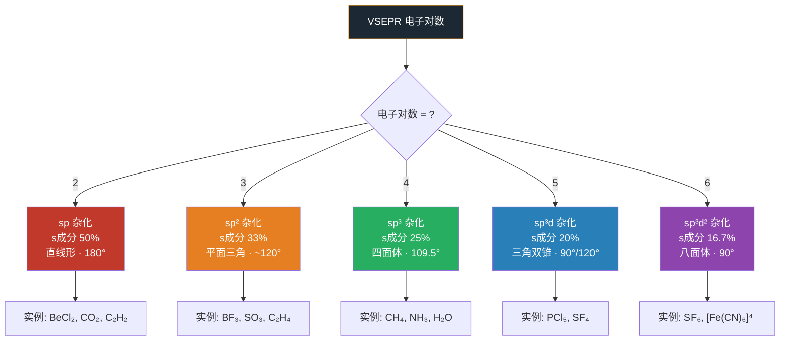

# 杂化轨道理论

- 总览：[[中国化学奥林匹克基本要求-总览]]
- 所属模块：[[基础要求-化学原理]]
- 对应考纲条目：[[10-分子结构与化学键]]

## 一、定义
**杂化轨道理论**：原子在形成分子时，**同一原子中能量相近的不同类型原子轨道**可以"混合"重组，形成一组**能量和形状完全相同**的新轨道——**杂化轨道**，再与其他原子的轨道重叠成键。

核心思想：**原子轨道的线性组合**（在同一原子内部进行）。

## 二、考纲对应

> **来源：周坤无机新课笔记与讲义**（资产 B3-9）
> 杂化类型与构型对照表，笔记与讲义一致

- 对应考纲条目：
  - [[10-分子结构与化学键]]（10.4 了解杂化轨道理论）
  - [[21-杂化轨道理论与成键]]（有机化学中的深化应用）
- 所属模块：[[基础要求-化学原理]]
- 本知识点在考纲中的作用：
  - 解释共价键的方向性和分子的空间构型
  - 连接原子轨道和分子结构
  - 是整个有机化学空间结构的基础

### 杂化类型与构型对照表

| 杂化类型 | 参与轨道 | 杂化轨道数 | s 成分 | 空间构型 | 键角 | 实例 |
|------|------|:---:|:---:|------|:---:|------|
| sp | 1s + 1p | 2 | 50% | 直线形 | 180° | BeCl₂, CO₂, C₂H₂ |
| sp² | 1s + 2p | 3 | 33.3% | 平面三角形 | ~120° | BF₃, SO₃, C₂H₄ |
| sp³ | 1s + 3p | 4 | 25% | 正四面体 | 109.5° | CH₄, NH₃, H₂O |
| sp³d | 1s + 3p + 1d | 5 | 20% | 三角双锥 | 90°, 120° | PCl₅ |
| sp³d² | 1s + 3p + 2d | 6 | 16.7% | 八面体 | 90° | SF₆, [Fe(CN)₆]⁴⁻ |
| dsp² | 1d + 1s + 2p | 4 | 25% | 平面正方形 | 90° | [PtCl₄]²⁻, [Ni(CN)₄]²⁻ |

**杂化轨道数公式**：杂化轨道数 = σ 键数 + 孤电子对数 = VSEPR 电子对数



## 三、核心原理

### 1. 杂化的三个条件
1. **能量相近**：参与杂化的原子轨道能量必须相近（如 2s 与 2p）
2. **同一原子**：杂化发生在同一个原子的不同轨道之间
3. **重新分配**：杂化后轨道数守恒（n 个原子轨道 → n 个杂化轨道）

### 2. 杂化轨道数 = 参与杂化的原子轨道数
$$\text{杂化轨道数} = \sigma \text{键数} + \text{孤电子对数}$$

## 四、关键结论

### sp³ 杂化
| 属性 | 说明 |
|------|------|
| 参与轨道 | 1 个 s + 3 个 p |
| 杂化轨道数 | 4 |
| s 成分 | 25%（1/4） |
| 空间构型 | 正四面体 |
| 键角 | 109.5° |
| 实例 | CH₄, NH₃, H₂O, NH₄⁺ |
| 在有机中 | 烷烃碳、醇的氧、胺的氮 |

### sp² 杂化
| 属性 | 说明 |
|------|------|
| 参与轨道 | 1 个 s + 2 个 p |
| 杂化轨道数 | 3 |
| s 成分 | 33.3%（1/3） |
| 空间构型 | 平面三角形 |
| 键角 | ~120° |
| 实例 | BF₃, SO₃, C₂H₄ |
| 在有机中 | 烯烃碳、芳环碳、羰基碳 |
| 剩余 p 轨道 | 形成 π 键 |

### sp 杂化
| 属性 | 说明 |
|------|------|
| 参与轨道 | 1 个 s + 1 个 p |
| 杂化轨道数 | 2 |
| s 成分 | 50%（1/2） |
| 空间构型 | 直线形 |
| 键角 | 180° |
| 实例 | BeCl₂, CO₂, C₂H₂ |
| 在有机中 | 炔烃碳、累积双键的中心碳 |
| 剩余 p 轨道 | 2 个，可形成 2 个 π 键或 1 组累积双键 |

### 含 d 轨道的杂化（竞赛重点）
| 杂化类型 | 轨道组成 | 构型 | 实例 |
|------|------|------|------|
| sp³d | s + 3p + 1d | 三角双锥 | PCl₅ |
| sp³d² | s + 3p + 2d | 八面体 | SF₆, [Fe(CN)₆]⁴⁻ |
| dsp² | d + s + 2p | 平面正方形 | [PtCl₄]²⁻, [Ni(CN)₄]²⁻ |

## 五、常见分类或情形

### 等性杂化 vs 不等性杂化
- **等性杂化**：所有杂化轨道等价（CH₄ 中 sp³ 全用于成键）
- **不等性杂化**：杂化轨道因孤电子对存在而不等价（NH₃、H₂O）
  - 含孤电子对的杂化轨道 s 成分更多，能量更低
  - 含孤对越多，键角越小

### Bent 规则
> **电负性较大的配位原子倾向于与 p 成分较多的杂化轨道成键。**
- 实例：PF₃ 中 P—F 键用了更多 p 成分 → F—P—F 键角 < 109.5°
- 实例：CH₃F 中 C—F 键的 C 用更多 p → H—C—H 键角 > 109.5°

### 杂化与键角关系
s 成分越大，键角越大：sp (180°) > sp² (120°) > sp³ (109.5°)
- 环丙烷：C—C—C 键角 60°，实际接近 sp⁴~sp⁵（弯键 / 香蕉键）

## 六、适用条件与限制
- ✅ 适用于共价分子（主族 + 过渡金属）
- ✅ 与 VSEPR 配合使用效果最好
- ⚠️ 杂化是数学描述，不是物理过程——原子不会"先激发再杂化"
- ⚠️ 不能直接预测分子磁性（需分子轨道理论）
- ⚠️ 对离域 π 体系（苯、丁二烯）描述不如分子轨道理论全面

## 七、常见比较与易混点
| 易混点 | 区分 |
|------|------|
| 杂化发生在**同一原子**上 | 分子轨道涉及**不同原子**轨道组合 |
| VSEPR 给出构型 | 杂化解释为什么是这样成键 |
| sp³d 和 dsp³ | sp³d 用外层 d，dsp³ 用内层 d（如 PCl₅ vs PF₅ 的争议） |
| 不等性杂化 vs 等性杂化 | 关键看是否所有杂化轨道等价 |

## 八、与其他知识点的联系
- 前置知识：[[原子轨道]]、[[VSEPR理论]]、[[共价键]]
- 相关知识：[[分子轨道理论]]、[[σ键]]、[[π键]]、[[键角]]
- 应用知识：[[有机分子的几何构型]]、[[芳香性]]、[[配合物几何构型]]

## 九、典型题型
- 题型-杂化类型判断
- 题型-分子构型判断
- 题型-键角比较

## 十、例题
### 例题 1：杂化类型判断
**题目：** 判断 XeF₄ 中 Xe 的杂化类型。
**分析：**
- VSEPR：Xe 有 8 个价电子，4 个 F 各提供 1 个 → (8+4)/2 = 6 个电子对
- 孤电子对 = 6 - 4 = 2（在八面体对位）
- 6 个杂化轨道 → sp³d²
**解答：** Xe 采取 sp³d² 杂化。
**反思：** 稀有气体化合物可用 VSEPR + 杂化理论处理。

### 例题 2：Bent 规则应用
**题目：** 解释为什么 CH₃F 中 H—C—H 键角 > 109.5°，而 F—C—F 键角 < 109.5°（在 CH₂F₂ 中）。
**分析：**
- F 电负性大 → C—F 键中 C 用更多 p 成分
- 剩余 C—H 键中 C 的 s 成分相对增大
- s 成分大 → 键角大
**解答：** Bent 规则使电负性大的 F 占据 p 成分多的轨道，H 占据 s 成分相对多的轨道，导致 H—C—H 角大于四面体角。
**反思：** Bent 规则是解释卤代甲烷键角变化的标准工具。

## 十一、易错点
- **❌ 错：** 认为杂化类型只能通过分子式直接判断 → 必须先用 VSEPR 确定电子对数
- **❌ 错：** 把 sp³d 和 dsp³ 混为一谈 → 涉及的外层/内层 d 轨道不同
- **❌ 错：** 忘记配位键中配位原子也参与杂化（如 CO 中 C 是 sp，O 也是 sp）
- **❌ 错：** 认为杂化轨道的 s/p 比严格等于名义值 → 实际会因 Bent 规则偏移

## 十二、🎯 教学视角

### 12.1 学生典型认知误区

| 误区 | 学生为什么会这么想 | 正确认识 | 口诀 |
|:---|:---|:---|:---|
| "杂化就是原子轨道混一混" | 受"杂化"一词字面意思误导 | 杂化是**同一原子内**不同轨道线性组合形成新轨道，不是不同原子的轨道混合。杂化轨道仍是**一个原子**的轨道 | "杂化是自己混，不是和别人混" |
| "看分子式就能直接判断杂化类型" | 跳过 VSEPR 直接套公式 | 必须先通过 VSEPR 确定**电子对数（σ键+孤对）**，再反推杂化。H₂O 不是 sp 而是 sp³（2σ+2孤对=4对）| "先数电子对，再定杂化型" |
| "sp³d 和 dsp³ 是一回事" | 符号看起来差不多就当一样 | sp³d → 外层 d 轨道参与（如 PCl₅）；dsp³ → 内层 d 轨道参与（如 [Ni(CN)₅]³⁻）。对应不同的几何构型和稳定性 | "sp³d 外层d，dsp³ 内层d" |
| "所有杂化都是等性的" | 教科书常用 CH₄ 等性 sp³ 作范例 | 含孤对电子的杂化是**不等性**的——孤对轨道 s 成分更高（如 NH₃ 中 N–H 键 s 成分≈23%，不是 25%）。Bent 规则定量描述这种偏离 | "孤对多吃s，成键多吃p" |

### 12.2 入门级例题

**题目**：判断下列分子/离子的中心原子杂化类型：(1) CH₄；(2) BF₃；(3) BeCl₂；(4) SF₆；(5) H₂O。

**预期解答路径**：
1. CH₄：4σ键 + 0孤对 = 4对 → sp³（正四面体）
2. BF₃：3σ键 + 0孤对 = 3对 → sp²（平面三角形）
3. BeCl₂：2σ键 + 0孤对 = 2对 → sp（直线形）
4. SF₆：6σ键 + 0孤对 = 6对 → sp³d²（正八面体）
5. H₂O：2σ键 + 2孤对 = 4对 → sp³（V形，不等性）

**教师引导提问**：CH₄ 和 H₂O 都是 sp³ 杂化，为什么 CH₄ 键角 109.5° 而 H₂O 只有 104.5°？（H₂O 有两对孤对电子→不等性 sp³→孤对占据更多 s 成分→成键轨道 p 成分增加→键角被压缩。Bent 规则的经典体现）

### 12.3 与现实/直觉的连接

- **四只手拿东西**：sp³ 杂化就像一个人伸出四只手均匀地拿四个相同的东西（等性杂化，109.5°）；如果有一只手拿着很重的东西（孤对电子），其他三只手就会被挤到一起——这就是不等性杂化的直观类比。
- **杂交水稻的隐喻**：杂化轨道就像杂交水稻——取不同轨道的优点（s 的各向同性 + p 的方向性），产生比原来都"好用"的成键轨道。Pauling 当初用"hybridization"这个词，本身就有生物学杂交的隐喻。
- **sp³d 还是 dsp³？内轨外轨之争**：过渡金属配合物中，用外层 d（sp³d²，外轨型，高自旋）还是内层 d（d²sp³，内轨型，低自旋）——看似只是字母顺序，实则决定了配合物的磁性、颜色和稳定性。

## 十三、🧰 备课可抽料资产

### 13.1 主干结论（Concept Asset）

- 杂化轨道理论用“同一原子内轨道重组”解释成键方向性与分子空间构型。
- 判断杂化类型最稳的入口是：先数电子对数，再定杂化类型。
- 杂化类型、s 成分和键角大小规律之间存在稳定对应关系。

### 13.2 机制 / 推导资产（Mechanism Asset）

- 可直接复用的机制说明：杂化的本质是同一原子内能量相近轨道的线性组合，形成方向性更强、等价或近等价的新轨道。
- 可直接复用的半推导：杂化轨道数 = $\sigma$ 键数 + 孤电子对数，对应 VSEPR 电子对数。
- 深入点：Bent 规则解释了为什么实际键角常偏离“理想杂化角”。

### 13.3 误区 / 纠偏资产（Misconception Asset）

- 学生最常见的错法：不经 VSEPR 直接猜杂化、把杂化与分子轨道混淆、把 sp³d 和 dsp³ 混同。
- 可直接复用的纠偏句：
  - “先数电子对，再定杂化型。”
  - “杂化是自己混，不是和别人混。”
  - “理想角是起点，不是终点。”

### 13.4 题型 / 例题资产（Problem-chain Asset）

- 建议题链：VSEPR 电子对数判断 → 杂化类型判断 → 键角比较 → Bent 规则修正。
- 适合课堂快练：
  - “CH₄、NH₃、H₂O 为什么都属 sp³，却键角不同？”
  - “BF₃、SO₃、C₂H₄ 为什么都属 sp²？”

### 13.5 图景 / 图片资产（Visual Asset）

- 高优先图景：杂化类型-构型对照表、sp/sp²/sp³ 轨道方向图、三角双锥与八面体示意。
- 本页非常适合保留图，因为很多学生对纯文字的空间感很弱。

### 13.6 备课落点建议

- 本页最适合作为“结构化学的构型解释页”，和 [[VSEPR理论]] 形成前后配套。
- 若课时紧，至少保留：电子对数、sp/sp²/sp³、孤对压缩键角。

## 十四、外部资料出处
- 主要来源：[[提炼-普化原理-第12章-化学键与分子结构]]
- 教学组织参考：[[教学逻辑提炼-周坤无机新课-原子结构与分子结构-第一轮]]
- 课堂归纳参考：[[专题-分子结构基础]]

## 十五、待完善项
- [ ] 后续可补“常见中心原子杂化速查图”
- [ ] 后续可补“杂化与分子轨道理论适用边界对照”

---

## 相关真题（Dataview）

```dataview
TABLE
  question_type AS 题型,
  difficulty AS 难度,
  teaching_level AS 教学层级,
  source AS 来源
FROM "04-题库"
WHERE type = "题目"
  AND contains(knowledge_points, "杂化轨道理论")
SORT difficulty ASC, year DESC
```
