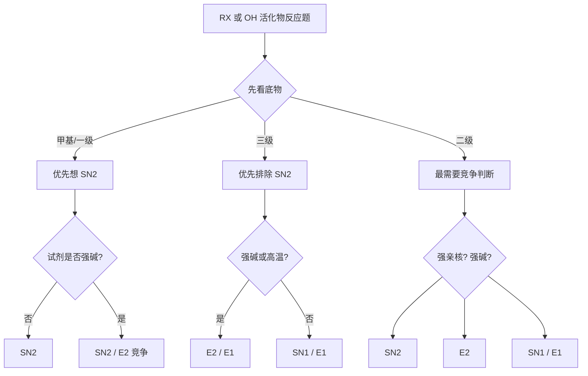

# 专题：亲核取代与消除反应

> 2026-06-19 复核说明：本专题对应的专题页、备课大纲、课堂执行页、教学洞察均已成套落地，原状态属于系统回写滞后，现统一升为 `已审校`。

> 本专题对应考纲条目：[[36-取代反应]]、[[38-消除反应]]、[[44-脂肪族亲核取代反应]]
> 核心知识点：[[SN1反应]]、[[SN2反应]]、[[E1反应]]、[[E2反应]]、[[反式共平面]]、[[邻基参与]]

---

## 一、核心结论汇总 {#core-conclusions}

**必须记住：**
- 第三轮不再把 `SN1 / SN2 / E1 / E2` 当四张散卡，而要统一成“**底物 + 试剂 + 溶剂 + 温度 + 几何要求**”的竞争系统。
- 亲核取代与消除题最常见的失误，不是不会机理，而是**只看一个因素就抢答**。
- 第三轮判断优先级通常是：
  1. **先看底物结构**
  2. **再看试剂是亲核主导还是碱性主导**
  3. **最后看溶剂、温度与几何限制**
- 本专题与 [[专题-活性中间体与反应机理基础]]、[[专题-立体化学与区域选择性]]、[[专题-加成反应]] 强关联：
  - 专题3提供碳正离子、过渡态与重排语言；
  - 专题2负责 Walden 翻转、反式共平面等立体后果；
  - 专题5里很多加成题的后半段也会回到 SN/E 竞争。

**第三轮看到取代/消除题先走这条分叉：**



## 一点五、课堂投影速查卡 {#classroom-quick-card}

**本页课堂入口：** 把所有题先压成一句话判断: “这个底物在这组条件下，更愿意取代还是消除？”

**先问四个问题：**

1. 底物是一/二/三级，是否有烯丙位、苄位或环系构象限制？
2. 试剂更像强亲核弱碱、强碱弱亲核，还是两者兼具？
3. 溶剂是极性质子型还是非质子型，会偏向离子化还是背面进攻？
4. 题目最终要的是主产物、立体结果，还是解释为什么另一条路不主导？

**一屏判断卡：**

- 三级底物优先想 `SN1/E1/E2` 竞争，一/甲基底物优先想 `SN2`。
- 看到强碱和可反式共平面构象，先警惕 `E2` 抢跑。
- `SN2` 题最后必须收口到构型翻转；`E2` 题最后必须收口到反式消除要求。
- 竞争题不要死背表格，要把“底物-试剂-溶剂-温度”四因素同时落地。

**讲后立刻练：**

- 先做一道二级卤代烃在不同试剂下 `SN2/E2` 转向题。
- 再做一道环己烷构象控制 `E2` 的题，把“反式共平面”真正讲透。

---

## 二、对比表格 {#comparison-table}

| 路径 | 机理特征 | 底物偏好 | 试剂/条件偏好 | 立体/结构后果 | 第三轮常见坑 |
|:---|:---|:---|:---|:---|:---|
| SN2 | 一步协同 | 甲基、一级 > 二级 | 强亲核、极性非质子 | Walden 翻转 | 只记“快”，忘记背面进攻 |
| SN1 | 分步，碳正离子中间体 | 三级、苄基、烯丙基 | 弱亲核、极性质子 | 外消旋偏翻转，可能重排 | 忽略离子对效应与重排 |
| E2 | 一步协同消除 | 二级、三级 | 强碱、常高温 | **反式共平面**，Zaitsev/Hofmann 分流 | 不转构象就下结论 |
| E1 | 分步，碳正离子中间体 | 三级、稳定正离子体系 | 弱碱、加热 | 常 Zaitsev，可能重排 | 把所有三级底物都判成 SN1 |
| 邻基参与型取代 | 分子内先协助离去 | 含可参与邻基 | 特殊底物 | 表观构型保持/环化 | 误当作普通 SN1 |

## 三、第三轮高频判断清单 {#decision-checklist}

### 3.1 一眼识别模板

- `CH3-X`、`1°-RX` + 强亲核弱碱：优先想 [[SN2反应]]
- `3°-RX` + 极性质子溶剂：优先想 [[SN1反应]] / [[E1反应]]
- `2°-RX` + 强碱：优先想 [[E2反应]]
- `环己烷衍生物`：必须检查 [[反式共平面]]
- `可形成稳定碳正离子`：防重排、防 SN1/E1
- `邻位有 S/O/N/卤素可参与`：防 [[邻基参与]]

### 3.2 消除反应四种机理对比（Zchem）

> 来源：[[资料提炼-Zchem基础有机化学-批次Z-A到Z-E-结构与反应体系]] §8.3

| 特征 | E1 | E2 | E1cb | Ei |
|:---|:---|:---|:---|:---|
| **底物** | 三级 > 二级 | 各级（需β-H） | 需强吸电子基+弱离去基 | 需特殊结构（如黄原酸酯） |
| **碱** | 弱碱/无碱 | 强碱 | 强碱 | 加热即可 |
| **步骤** | 两步（碳正离子中间体） | 一步协同 | 两步（碳负离子中间体） | 一步协同（环状过渡态） |
| **立体化学** | 无严格要求 | **反式共平面** | 无严格要求 | 顺式消除 |
| **区域选择性** | 扎伊采夫（热力学） | 碱位阻决定 | 霍夫曼（动力学） | — |
| **竞争反应** | SN1 | SN2 | — | — |

**E2反式共平面规则**：
- 离去基团与β-H必须处于反式共平面才能发生E2
- 环己烷体系中：离去基在a键时，相邻a键上的H可被消除
- 若无可满足反式共平面的β-H，E2被抑制

### 3.3 碱的位阻与区域选择性（Zchem）

| 碱类型 | 典型试剂 | 消除位点 | 产物 | 原因 |
|:---|:---|:---|:---|:---|
| **小位阻强碱** | NaOH, EtONa, NaNH₂ | 位阻大的β-H（取代多） | **扎伊采夫产物** | 热力学控制 |
| **大位阻强碱** | t-BuOK, LDA | 位阻小的β-H（取代少） | **霍夫曼产物** | 动力学控制 |

**教学要点**：同一个底物，换碱就能换主产物——这是竞赛常考的"条件控制选择性"经典案例。

### 3.4 四句口令

1. **先看底物级数，不先看产物。**
2. **先分亲核性和碱性，不把试剂混成一个词。**
3. **先看几何要求，再谈 E2。**
4. **先防重排与邻基参与，再收尾。**

## 四、解题套路 / 决策流程 {#problem-solving-routine}

### Step 1：先判断“这题在考竞争还是单一路径”
- **操作**：若底物是二级或三级，默认进入竞争视角；甲基和一级多半更干净。
- **检查点**：☐ 是否需要竞争判断 ☐ 是否已排除明显不可能路径

### Step 2：底物结构先行
- **操作**：先看甲基/一/二/三级、苄基/烯丙基、环状体系、桥头位、是否可重排。
- **依据 KP**：[[SN1反应]]、[[SN2反应]]
- **检查点**：☐ 底物级数明确 ☐ 特殊稳定化已识别

### Step 3：试剂分成“亲核性”和“碱性”两件事
- **操作**：
  - 强亲核弱碱 → 偏 SN2
  - 强碱弱亲核 → 偏 E2
  - 弱亲核弱碱 → 偏 SN1/E1
- **检查点**：☐ 没把 `HO- / RO- / t-BuO- / N3- / RS-` 混成一类

### Step 4：再看溶剂与温度
- **操作**：
  - 极性质子 → 有利 SN1/E1
  - 极性非质子 → 有利 SN2/E2
  - 高温 → 往消除侧推
- **检查点**：☐ 溶剂效应已纳入 ☐ 温度效应已纳入

### Step 5：最后加几何和特殊效应修正
- **操作**：
  - E2 必看 anti-periplanar
  - SN1/E1 必防重排
  - 邻基参与必防“表观保持”
- **检查点**：☐ 构象检查完成 ☐ 特殊机理已排查

## 五、机理分析抓手 {#mechanism-analysis}

### 5.1 SN2：取代不是“换个基团”而是“背面进攻”

- 核心语言：**一步协同、五配位过渡态、Walden 翻转**。
- 第三轮真正要会的是：
  - 为什么三级底物几乎不走 SN2；
  - 为什么极性非质子溶剂能放大亲核体威力；
  - 为什么手性中心常直接翻转。

### 5.2 SN1 / E1：共同的核心是碳正离子

- 一旦判到 SN1/E1，立刻同步想到：
  - **重排**
  - **外消旋不完全**
  - **取代/消除共存**
- 第三轮里，SN1 和 E1 最好总是成对出现，不要分开死记。

### 5.3 E2：消除题先看构象，不先背 Zaitsev

- E2 的真正底层要求是 [[反式共平面]]。
- 环己烷体系中最常见的训练点：
  - 离去基与 β-H 是否都能轴向；
  - 哪个椅式构象能真正消除；
  - 产物是否受大位阻碱转向 Hofmann。

### 5.4 邻基参与：第三轮的“伪例外识别器”

- 看到异常快反应、异常构型保持、分子内环化时，要想到 [[邻基参与]]。
- 这是第三轮很适合训练的“别把所有分步都写成普通 SN1”的能力点。

## 六、典型例题串讲 {#typical-examples}

### 例题 1：1-溴丙烷与 NaN3 在 DMSO 中反应主走哪条路
**分析**：一级底物，亲核体强而碱性弱，极性非质子溶剂。  
**解答**：SN2 为主。  
**反思**：一级底物 + 强亲核弱碱是第三轮最稳定的 SN2 模板。

### 例题 2：2-溴丁烷与 t-BuOK 加热反应主走哪条路
**分析**：二级底物，强碱且位阻大，高温。  
**解答**：E2 为主，偏 Hofmann 或至少明显往消除侧。  
**反思**：大位阻碱不只是“强”，更是“难以做亲核体”。

### 例题 3：叔丁基溴在乙醇中反应为何要同时想到取代和消除
**分析**：三级底物，SN2 排除；极性质子溶剂中可形成碳正离子。  
**解答**：SN1/E1 竞争。  
**反思**：三级底物最忌“只写一个路径”。

### 例题 4：环己基卤代物 E2 题为什么必须先翻椅式
**分析**：E2 需要 anti-periplanar，环己烷里对应 trans-diaxial。  
**解答**：先找能满足轴向 H / 轴向 LG 的构象，再判主产物。  
**反思**：E2 题里不做构象分析，往往不是“粗糙”，而是“错题”。

## 七、课堂组织建议 {#teaching-organization}

- **第一层**：先把四条路径压成“协同 vs 分步”“取代 vs 消除”两个坐标轴。
- **第二层**：再把二级底物作为竞争主战场重点展开。
- **第三层**：最后加上构象、重排、邻基参与做第三轮提升。
- **第三轮可直接展开的内容**：
  - SN1/SN2/E1/E2 的统一竞争判断；
  - E2 构象分析；
  - 邻基参与的识别级应用。

## 八、关联知识点 {#related-kp}

- [[SN1反应]]
- [[SN2反应]]
- [[E1反应]]
- [[E2反应]]
- [[反式共平面]]
- [[邻基参与]]

## 九、关联题型 {#related-problem-types}

- [[题型-SN1/SN2/E1/E2竞争判断]]
- [[题型-立体化学产物预测]]
- [[题型-碳正离子重排预测]]
- [[题型-消除产物预测]]

## 十、相关真题 {#related-exam-questions}

```dataview
TABLE file.name AS "文件名", year AS "年份", type AS "题型", difficulty AS "难度"
FROM "05-真题库"
WHERE contains(knowledge_points, "SN1反应")
   OR contains(knowledge_points, "SN2反应")
   OR contains(knowledge_points, "E1反应")
   OR contains(knowledge_points, "E2反应")
SORT year DESC, difficulty ASC
```

### 真题入口使用建议

- SN/E 的真题极少单独考”这是 SN1 还是 SN2”——通常嵌在有机推断题或机理推导题中。训练重点不是”背表格”，而是”从条件判断路径”。
- **基础班**：先用两三道”底物+试剂+溶剂 → 判断 SN1/SN2/E1/E2”的选择题，建立条件→路径反射。
- **提高班**：加入二级底物的竞争判断——这是竞赛最常考、学生最常错的主战场。
- **冲刺班**：SN/E 的判断应该训练成”30 秒内报出主导路径”的速度，因为真题中这只是机理推导的第一步，不应该是耗时瓶颈。

### 推荐真题 {#recommended-exam-questions}

| 真题 | 核心考点 | 难度 |
|:---|:---|:---:|
| [[真题-有机-SN1反应-001]] | SN1 机理：叔丁基溴溶剂解、碳正离子中间体稳定性与重排风险 | ⭐⭐⭐ |
| [[真题-有机-SN2立体化学-001]] | SN2 机理：Walden 翻转、手性中心构型反转的立体化学证据 | ⭐⭐⭐ |
| [[真题-有机-E2消除-001]] | E2 机理：Zaitsev 规则、消除反应的区域选择性 | ⭐⭐⭐ |
| [[真题-有机-SN2vsE2-001]] | SN2/E2 竞争判断：1-溴丙烷在不同试剂/溶剂/温度条件下产物切换 | ⭐⭐⭐⭐ |

### 真题链与讲评顺序 {#exam-sequence}

- `第 1 题`：**单一路径确认题**（明确的一级底物+强Nu → SN2；三级底物+极性质子溶剂 → SN1）。课堂用途：热启动，建立”条件→路径”的基础映射。
- `第 2 题`：**竞争判断题**（二级底物 + 中等条件 → 同时存在 SN/E 可能）。课堂用途：主讲题，训练五步筛法（底物→试剂→溶剂→温度→构象）。
- `第 3 题`：**嵌入推断/合成题中的 SN/E 选择**。课堂用途：收束题，验证学生能否在综合上下文中不丢失 SN/E 判断。
- 课堂顺序建议：`单一路径 → 竞争判断 → 综合嵌入`。

*本专题依据 [[模板-专题]] v1.7 生成。*
*第三轮定位：作为”反应路径竞争层”，承上连接活性中间体，向下支撑加成、重排与合成判断。*

> 📎 相关提炼：[[07-资料提炼/书籍提炼/提炼-ABOC-第4章-取代与消除]]
