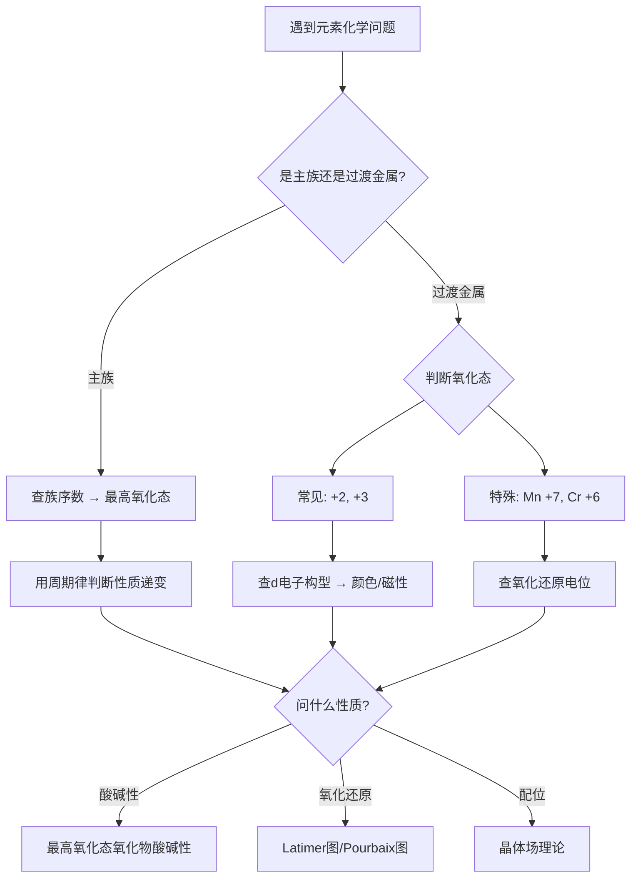
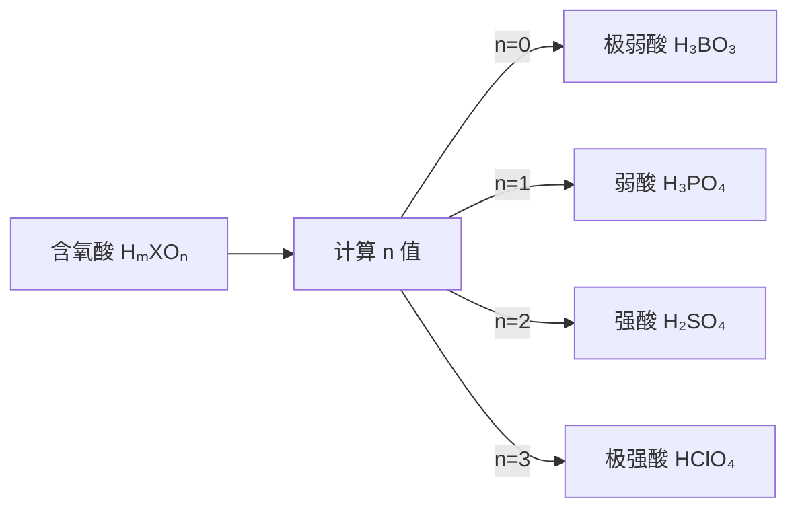

# 元素化学通论

> **定位**：元素化学是无机化学的核心，涵盖主族元素和过渡金属的性质、反应与规律。本专题为"讲义抽料台"，可直接复制各板块到学生讲义。

---

## 一、核心结论

### 1.1 主族元素性质递变

**同族从上到下：**
- 原子半径增大，电离能减小，电负性减小
- 金属性增强（左下角最强），非金属性减弱（右上角最强）
- 最高氧化态 = 族序数（ⅤA族以后例外增多）

**同周期从左到右：**
- 原子半径减小，电离能增大，电负性增大
- 最高氧化态从 +1 递增到 +7（ⅦA族）
- 非金属性增强

**对角线规则**（来源：主族元素性质总览）：
- Li-Mg：都能直接与 N₂ 反应生成氮化物
- Be-Al：氧化物/氢氧化物都是两性，都能与有机金属试剂反应
- B-Si：都能形成玻璃态氧化物，含氧酸都是弱酸

### 1.2 过渡金属通性

- **可变氧化态**：从 +2 到与族数相同的最高氧化态（Ⅷ族除外）
- **离子颜色**：d-d 跃迁产生颜色（d⁰ 和 d¹⁰ 无色）
- **催化性能**：Fe、Ni、Pd、Pt 等常用作催化剂
- **磁性**：未成对电子产生顺磁性
- **配合物形成能力强**：空 d 轨道可接受配体电子对

---

## 二、决策路径



**含氧酸酸性判断流程：**


---

## 三、对比表格

### 表1：主族元素最高氧化态氧化物的酸碱性（来源：元素化学KP §四）

| 族 | 氧化态 | 氧化物 | 酸碱性 | 示例 |
|:---:|:---:|:---:|:---:|:---|
| ⅠA | +1 | M₂O | 强碱 | Na₂O + H₂O → 2NaOH |
| ⅡA | +2 | MO | 强碱 | CaO + H₂O → Ca(OH)₂ |
| ⅢA | +3 | M₂O₃ | 两性 | Al₂O₃ + 6HCl → 2AlCl₃ + 3H₂O |
| ⅣA | +4 | MO₂ | 弱酸性/两性 | SnO₂ 两性偏酸 |
| ⅤA | +5 | M₂O₅ | 酸性 | P₂O₅ + 3H₂O → 2H₃PO₄ |
| ⅥA | +6 | MO₃ | 强酸性 | CrO₃ + H₂O → H₂CrO₄ |
| ⅦA | +7 | M₂O₇ | 强酸性 | Cl₂O₇ + H₂O → 2HClO₄ |

**规律**：同族从上到下，最高氧化态氧化物的酸性减弱，碱性增强。

### 表2：过渡金属离子颜色（来源：元素化学反应规律KP §八）

| 离子 | d电子数 | 颜色 | 配体 |
|:---|:---:|:---:|:---|
| Ti³⁺ | d¹ | 紫色 | H₂O |
| Cu²⁺ | d⁹ | 蓝色 | H₂O |
| Fe²⁺ | d⁶ | 浅绿色 | H₂O |
| Fe³⁺ | d⁵ | 黄色 | H₂O |
| Co²⁺ | d⁷ | 粉红色 | H₂O |
| Ni²⁺ | d⁸ | 绿色 | H₂O |
| MnO₄⁻ | d⁰ | 紫色 | O²⁻（电荷转移） |
| CrO₄²⁻ | d⁰ | 黄色 | O²⁻（电荷转移） |
| Cr₂O₇²⁻ | d⁰ | 橙色 | O²⁻（电荷转移） |

**规律**：d⁰ 和 d¹⁰ 离子本身无色，但含氧酸根可因电荷转移显色。

### 表3：主族元素氢化物性质对比（来源：主族元素性质总览）

| 氢化物 | 键型 | 沸点 | 热稳定性 | 还原性 |
|:---|:---:|:---:|:---:|:---:|
| CH₄ | 共价 | -161°C | 很稳定 | 很弱 |
| NH₃ | 共价+氢键 | -33°C | 稳定 | 弱 |
| H₂O | 共价+氢键 | 100°C | 很稳定 | 很弱 |
| HF | 共价+氢键 | 19.5°C | 稳定 | 弱 |
| HCl | 共价 | -85°C | 较稳定 | 中等 |
| H₂S | 共价 | -60°C | 不稳定 | 较强 |
| PH₃ | 共价 | -87°C | 不稳定 | 强 |

### 表4：同族氢化物沸点规律（来源：主族元素性质总览）

**ⅣA族**（无氢键）：CH₄ < SiH₄ < GeH₄ < SnH₄（单调递增）

**ⅤA~ⅦA族**（有氢键）：NH₃、H₂O、HF 沸点异常偏高

---

## 四、典型例题

### 例1：元素性质递变（来源：元素化学KP §二）

下列元素性质变化规律正确的是（  ）

A. 原子半径：Na > Mg > Al  
B. 电负性：F > Cl > Br > I  
C. 第一电离能：B < Be < C  
D. 金属性：Be > Mg > Ca

**解答**：
- A：同周期从左到右原子半径减小，Na > Mg > Al ✓
- B：同族从上到下电负性减小，F > Cl > Br > I ✓
- C：Be 的 2s 全满较稳定，第一电离能 Be > B，正确顺序为 B < C < Be ✓（C也正确）
- D：同族从上到下金属性增强，正确顺序为 Be < Mg < Ca ✗

**答案**：ABC

### 例2：过渡金属离子颜色（来源：元素化学反应规律KP §八）

Ti(H₂O)₆³⁺ 呈紫色，Ti(H₂O)₆²⁺ 呈蓝色，解释原因。

**解答**：
- Ti³⁺（d¹）：d-d 跃迁吸收黄绿光，透过紫光 → 紫色
- Ti²⁺（d²）：d-d 跃迁吸收红光，透过蓝光 → 蓝色
- 两者 d 电子数不同，分裂能 Δ 不同，吸收波长不同，故颜色不同

### 例3：含氧酸酸性比较（来源：题库 09-10）

比较 HClO₄、H₂SO₄、H₃PO₄ 的酸性强弱，并解释原因。

**解答**：
- 酸性：HClO₄ > H₂SO₄ > H₃PO₄
- 中心原子氧化态：Cl(+7) > S(+6) > P(+5)
- 氧化态越高，对 O-H 键电子云吸引越强，H⁺越易解离
- Pauling 规则：含氧酸可写为 (HO)_m XO_n，n 越大酸性越强

### 例4：惰性电子对效应（来源：元素化学KP §三）

解释为什么 Pb(NO₃)₂ 比 Pb(NO₃)₄ 稳定得多。

**解答**：
- Pb 位于第ⅣA族第六周期，价电子构型 6s²6p²
- 由于**惰性电子对效应**，6s² 电子受到镧系收缩导致的强核电荷束缚，难以参与成键
- Pb(IV)→Pb(II) 的还原电位很高（Eθ≈+1.46V），Pb(IV) 是强氧化剂
- 因此 Pb²⁺（保留惰性 6s²）远比 Pb⁴⁺（需激发 6s 电子）稳定

---

## 五、易错点预警

### 易错1：混淆"最高氧化态"和"常见氧化态"
- Fe 最高氧化态为 +6（高铁酸盐），但常见氧化态为 +2、+3
- Cu 最高氧化态为 +3，但几乎只以 +1、+2 存在
- **陷阱**：题目问"最高氧化态"≠"常见氧化态"

### 易错2：对角线规则的适用范围
- Li-Mg：都能直接与 N₂ 反应生成氮化物
- Be-Al：氧化物/氢氧化物都是两性，都能与有机金属试剂反应
- B-Si：都能形成玻璃态氧化物，含氧酸都是弱酸
- **注意**：对角线相似是近似规律，不是严格等价

### 易错3：氢化物沸点规律的例外
- 第ⅣA族氢化物无氢键，沸点随分子量增大而升高（正常）
- 第ⅤA~ⅦA族，NH₃、H₂O、HF 因氢键沸点异常偏高
- **陷阱**：H₂O 沸点（100°C）远高于 H₂S（-60°C），但 HF 沸点（19.5°C）只比 HCl（-85°C）高约 100°C

### 易错4：d⁰ 和 d¹⁰ 离子的颜色
- d⁰ 离子（如 Ti⁴⁺、Sc³⁺）本身无色，但含氧酸根（MnO₄⁻、CrO₄²⁻）因电荷转移显色
- d¹⁰ 离子（如 Zn²⁺、Cu⁺）本身无色
- **陷阱**：不要因为 KMnO₄ 紫色就认为 Mn⁷⁺ 有 d-d 跃迁（实际是电荷转移）

### 易错5：金属性 vs 电负性的关系
- 金属性强 = 容易失去电子 = 电负性小
- 但 Al 的电负性（1.61）比 Ga（1.81）小，金属性却 Al > Ga
- **原因**：Ga 有 3d¹⁰ 屏蔽效应差，有效核电荷大

### 易错6：镧系收缩的影响
- La 到 Lu 原子半径收缩约 15 pm，导致 Hf 与 Zr 半径几乎相同
- 后果：Zr 和 Hf 化学性质极其相似，难以分离
- **延伸**：Nb-Ta、Mo-W 也因镧系收缩而性质相似

### 易错7：过渡金属氧化态的判断
- Mn 最高 +7（MnO₄⁻），Cr 最高 +6（CrO₄²⁻），Fe 最高 +6（FeO₄²⁻）
- **规律**：最高氧化态通常出现在含氧酸根或氟化物中
- **陷阱**：Fe 在水溶液中几乎不可能达到 +6，但在碱性条件下可以

---

## 六、竞赛深化

### 6.1 惰性对效应的相对论解释（来源：元素化学KP §三）

重 p 区元素（Tl、Pb、Bi）的低氧化态比轻元素更稳定：
- Tl⁺ 比 Al⁺ 稳定得多
- Pb²⁺ 比 C²⁺ 稳定得多
- Bi³⁺ 比 N³⁺ 更常见（Bi⁵⁺ 是强氧化剂）

**原因**：6s² 电子的相对论性稳定化效应（惰性对效应）

### 6.2 稀土元素的特殊性（来源：过渡金属通性KP §三）

- 4f 电子被外层 5s²5p⁶ 屏蔽，化学性质非常相似
- 常见氧化态：+3（全部），Ce 还有 +4，Eu 还有 +2
- 分离方法：离子交换法、溶剂萃取法
- 应用：永磁体（NdFeB）、荧光粉（Eu³⁺）、催化剂（CeO₂）

### 6.3 生物无机化学（来源：元素化学反应规律KP §十）

- Fe：血红蛋白（O₂ 运输）、细胞色素（电子传递）
- Cu：血蓝蛋白（O₂ 运输）、超氧化物歧化酶
- Zn：碳酸酐酶、DNA 聚合酶
- Mo：固氮酶、黄嘌呤氧化酶
- Co：维生素 B₁₂（唯一含金属的维生素）

---

## 七、知识链接

**前置知识**
- [[原子结构]] → 电子构型决定元素性质
- [[化学键]] → 键型决定化合物性质

**后续知识**
- [[晶体结构]] → 元素单质的晶体构型
- [[配位化学]] → 过渡金属配合物

**相关专题**
- [[专题-晶体与配合物深化]]（晶体场理论、配合物颜色）
- [[专题-过渡金属元素化学]]（各过渡金属详解）
- [[专题-原子结构与周期律]]（周期律深化）

---

## 八、题库索引

```dataview
TABLE difficulty AS "难度", tags AS "标签"
FROM "04-题库/化学原理/Ch09-元素化学"
SORT file.name ASC
```
