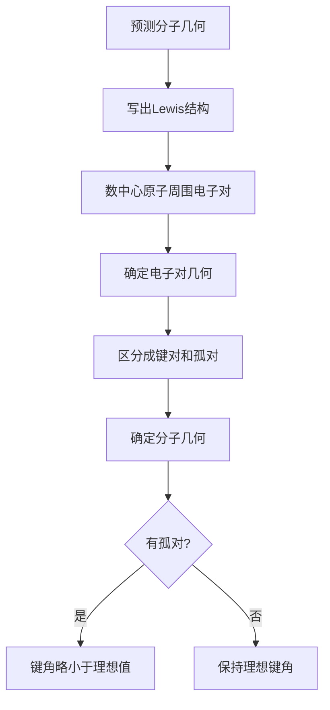
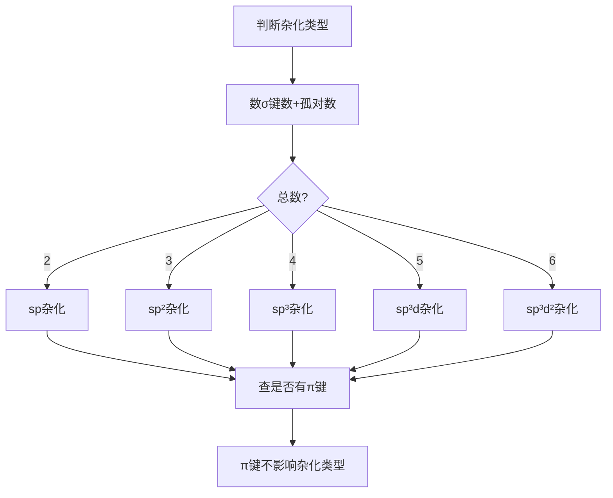

# 分子结构与杂化

> **定位**：分子结构是化学键理论的核心内容，涵盖VSEPR、杂化轨道、分子极性。本专题为"讲义抽料台"，可直接复制各板块到学生讲义。

---

## 一、核心结论

### 1.1 VSEPR理论（来源：VSEPR理论与分子几何KP §二）

**价层电子对互斥理论**：中心原子周围的电子对（成键对+孤对）尽可能远离，使排斥力最小。

**电子对几何**：
| 电子对数 | 电子对几何 | 键角 |
|:---:|:---|:---:|
| 2 | 直线形 | 180° |
| 3 | 平面三角形 | 120° |
| 4 | 正四面体 | 109.5° |
| 5 | 三角双锥 | 90°/120° |
| 6 | 正八面体 | 90° |

### 1.2 杂化轨道理论（来源：杂化轨道理论KP §二）

| 杂化类型 | 轨道组成 | 几何构型 | 键角 | 示例 |
|:---:|:---|:---|:---:|:---|
| sp | s + p | 直线形 | 180° | CO₂, BeCl₂ |
| sp² | s + 2p | 平面三角形 | 120° | BF₃, C₂H₄ |
| sp³ | s + 3p | 正四面体 | 109.5° | CH₄, NH₃ |
| sp³d | s + 3p + d | 三角双锥 | 90°/120° | PCl₅ |
| sp³d² | s + 3p + 2d | 正八面体 | 90° | SF₆ |

### 1.3 分子极性（来源：分子极性与偶极矩KP §二）

- **偶极矩** μ = q × d（电荷×距离）
- **非极性分子**：μ = 0（正负电荷中心重合）
- **极性分子**：μ ≠ 0（正负电荷中心不重合）
- **判断方法**：键极性 + 分子对称性

### 1.4 等电子体原理（来源：分子结构KP §八）

- 等电子体（原子数相同、价电子数相同）具有**相似的几何构型**
- 示例：CO₂ = N₂O = NO₂⁺（直线形）
- 示例：SO₃ = NO₃⁻ = CO₃²⁻（平面三角形）

---

## 二、决策路径

### VSEPR预测分子几何



### 杂化类型判断



---

## 三、对比表格

### 表1：VSEPR预测结果汇总（来源：VSEPR理论与分子几何KP §三）

| 分子 | 电子对数 | 孤对数 | 分子几何 | 键角 | 极性 |
|:---|:---:|:---:|:---|:---:|:---:|
| CO₂ | 2 | 0 | 直线形 | 180° | 非极性 |
| BF₃ | 3 | 0 | 平面三角形 | 120° | 非极性 |
| SO₂ | 3 | 1 | V形 | <120° | 极性 |
| CH₄ | 4 | 0 | 正四面体 | 109.5° | 非极性 |
| NH₃ | 4 | 1 | 三角锥形 | <109.5° | 极性 |
| H₂O | 4 | 2 | V形 | <109.5° | 极性 |
| PCl₅ | 5 | 0 | 三角双锥 | 90°/120° | 非极性 |
| SF₄ | 5 | 1 | 变形四面体 | <90°/120° | 极性 |
| SF₆ | 6 | 0 | 正八面体 | 90° | 非极性 |

### 表2：杂化类型与分子几何对应

| 杂化 | 孤对=0 | 孤对=1 | 孤对=2 |
|:---:|:---|:---|:---|
| sp | 直线形 | - | - |
| sp² | 平面三角形 | V形 | - |
| sp³ | 正四面体 | 三角锥形 | V形 |
| sp³d | 三角双锥 | 变形四面体 | 直线形 |
| sp³d² | 正八面体 | 四方锥形 | 平面正方形 |

### 表3：分子极性判断

| 分子 | 键极性 | 对称性 | 极性 |
|:---|:---:|:---:|:---:|
| CO₂ | 极性键 | 对称（直线形） | 非极性 |
| H₂O | 极性键 | 不对称（V形） | 极性 |
| CCl₄ | 极性键 | 对称（正四面体） | 非极性 |
| CHCl₃ | 极性键 | 不对称 | 极性 |
| BF₃ | 极性键 | 对称（平面三角形） | 非极性 |

### 表4：常见分子的杂化与几何

| 分子 | 中心原子 | σ键 | 孤对 | 杂化 | 几何 |
|:---|:---|:---:|:---:|:---:|:---|
| BeCl₂ | Be | 2 | 0 | sp | 直线形 |
| BF₃ | B | 3 | 0 | sp² | 平面三角形 |
| CH₄ | C | 4 | 0 | sp³ | 正四面体 |
| NH₃ | N | 3 | 1 | sp³ | 三角锥形 |
| H₂O | O | 2 | 2 | sp³ | V形 |
| PCl₅ | P | 5 | 0 | sp³d | 三角双锥 |
| SF₆ | S | 6 | 0 | sp³d² | 正八面体 |

---

## 四、典型例题

### 例1：VSEPR预测（来源：VSEPR理论与分子几何KP §五 典型例题1）

预测 ClF₃ 的分子几何构型。

**解答**：
- Cl 有7个价电子，3个与F成键，剩余4个（2对孤对）
- 电子对数 = 3 + 2 = 5，电子对几何 = 三角双锥
- 孤对占据赤道位置（排斥力最小）
- **分子几何 = T形**，键角略小于90°

### 例2：杂化类型判断（来源：题库 12-01）

判断 H₂O 中 O 的杂化类型。

**解答**：
- O 有6个价电子，2个与H成键，剩余4个（2对孤对）
- σ键数 + 孤对数 = 2 + 2 = 4
- **杂化类型 = sp³**
- 分子几何 = V形（因有2对孤对）

### 例3：分子极性判断（来源：分子结构KP §七 典型例题）

判断 CCl₄ 和 CHCl₃ 的极性。

**解答**：
- CCl₄：4个C-Cl键都是极性键，但分子对称（正四面体），偶极矩相互抵消 → **非极性**
- CHCl₃：3个C-Cl键和1个C-H键，分子不对称 → **极性**

### 例4：等电子体（来源：题库 12-10）

CO₂、N₂O、NO₂⁺ 具有相同的几何构型，解释原因。

**解答**：
- 三者都是16电子体系（等电子体）
- 价电子数：CO₂(16) = N₂O(16) = NO₂⁺(16)
- 根据等电子体原理，具有**相似的直线形几何构型**

---

## 五、易错点预警

### 易错1：孤对-成键对排斥力大小顺序（来源：VSEPR理论与分子几何KP §五）

- 孤对-孤对 > 孤对-成键对 > 成键对-成键对
- 因此孤对会**压缩键角**
- **陷阱**：NH₃键角(107°) < CH₄键角(109.5°)，因为NH₃有1对孤对

### 易错2：杂化类型与π键无关（来源：杂化轨道理论KP §四）

- 杂化类型只由**σ键数+孤对数**决定
- π键不参与杂化
- **陷阱**：CO₂中C是sp杂化（2个σ键），不是sp²（虽然有2个π键）

### 易错3：等电子体不一定构型完全相同（来源：分子结构KP §九）

- 等电子体**几何构型相似**，但键长、键能可能不同
- **陷阱**：CO和N₂是等电子体，但键性质不完全相同

### 易错4：d轨道参与杂化的条件

- 第二周期元素（C、N、O、F）**不能**用d轨道杂化
- 只有第三周期及以后的元素才能利用d轨道
- **陷阱**：不能说N形成sp³d杂化（N在第二周期）

### 易错5：分子几何 ≠ 电子对几何

- 电子对几何包括孤对，分子几何只看原子位置
- **陷阱**：H₂O的电子对几何是四面体，但分子几何是V形

### 易错6：偶极矩的加和性

- 分子偶极矩是各键偶极矩的**矢量和**
- 对称分子即使有极性键，偶极矩也可能为零
- **陷阱**：不能因为有极性键就认为分子是极性的

### 易错7：VSEPR的局限性

- VSEPR基于**电子对排斥**，不考虑电子离域
- 对于含π键、大π键的分子，预测可能不准确
- **陷阱**：VSEPR是定性工具，精确结构需要量子化学计算

---

## 六、竞赛深化

### 6.1 Walsh图（来源：分子结构KP §十）

- 解释AH₂型分子从直线形到V形的转变
- 当中心原子价电子数≤4时为直线形，≥5时为V形
- **应用**：预测BHa型分子的几何

### 6.2 Bent规则（来源：分子结构KP §十一）

- 孤对优先占据**s成分较多**的杂化轨道
- 成键对优先占据**p成分较多**的杂化轨道
- **后果**：孤对占据的轨道s成分 > 25%（sp³杂化时）

### 6.3 二茂铁等有机金属化合物

- Fe(C₅H₅)₂：Fe²⁺与两个环戊二烯基通过π键结合
- 不符合VSEPR（d电子参与成键）
- **应用**：催化、材料科学

---

## 七、知识链接

**前置知识**
- [[原子结构]] → 电子构型
- [[化学键]] → 共价键理论

**后续知识**
- [[分子轨道理论]] → 更精确的分子结构描述
- [[晶体结构]] → 分子如何堆积成晶体

**相关专题**
- [[专题-分子结构基础]]（分子结构入门）
- [[专题-配合物化学]]（晶体场理论）
- [[专题-晶体结构与晶格能]]（分子间作用力）

---

## 八、题库索引

```dataview
TABLE difficulty AS "难度", tags AS "标签"
FROM "04-题库/化学原理/Ch12-分子结构"
SORT file.name ASC
```
