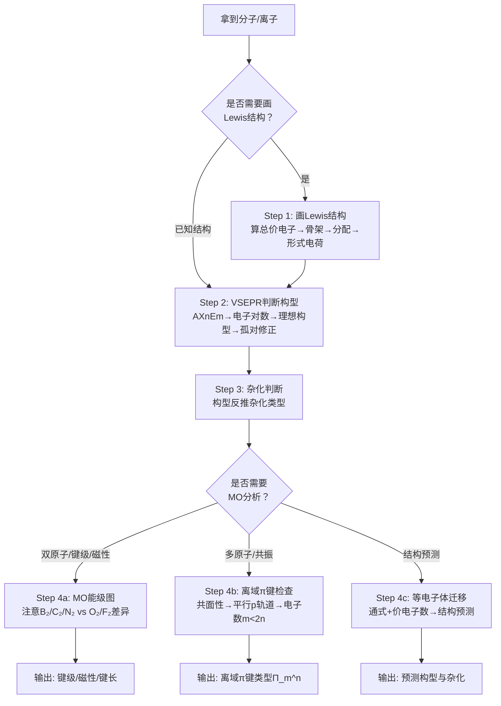

# 专题：分子结构基础

> 本专题对应考纲条目：[[09]]、[[10]]、[[11]]
> 核心知识点：[[Lewis结构式]]、[[VSEPR理论]]、[[杂化轨道理论]]、[[分子轨道理论]]、[[离域π键]]、[[等电子体]]、[[分子间力]]、[[氢键]]

---

## 零点五、进阶导航 {#advance-navigation}

- 前置页：[[专题-原子结构与元素周期律]]（原子轨道、量子数、周期律）
- 后续页：[[专题-化学键与分子间作用力]]、[[专题-晶体结构计算]]
- 深化页：[[专题-配位化学]]（晶体场/配位场中的 MO）、[[专题-有机结构基础与电子效应]]（杂化与共振的有机视角）
- 真题入口：本页 §八 已列出高频真题

## 零点六、课堂投影速查卡 {#classroom-quick-card}

**本课课堂入口：** 不要从"Lewis 结构四步法"开始。先投影 CO₂ 和 SO₂——"都是三原子分子，为什么一个直线一个 V 形？"——从学生直觉引出"结构不是数原子就能决定的"。

**先问三个问题：**

1. Lewis 结构画对了吗？— 形式电荷最小化了吗？八隅体例外识别了吗？
2. VSEPR 判断时，孤对电子算进去了吗？— AXmEn 的 n 对不对？
3. 这道题需要升级到 MO 语言吗？— 只有双原子分子的键级/磁性才需要 MO；多原子分子优先用离域 π 键 + 等电子体

**一屏判断卡：**

```
分子结构题 → 工具链不可颠倒
    │
    ├─ Step 1: Lewis 结构
    │   ├─ 算总价电子（阴离子加、阳离子减）
    │   ├─ 端基优先满足八隅体
    │   └─ 形式电荷最小化 → 选最优共振式
    │
    ├─ Step 2: VSEPR 构型 → AXmEn
    │   ├─ m+n=2→直线 / 3→平面三角 / 4→四面体 / 5→三角双锥 / 6→八面体
    │   ├─ 孤对优先占赤道向！（三角双锥体系的核心）
    │   └─ 排斥力：LP–LP > LP–BP > BP–BP
    │
    ├─ Step 3: 杂化 ← 构型反推
    │   ├─ 直线→sp / 平面三角→sp² / 四面体→sp³ / 三角双锥→sp³d / 八面体→sp³d²
    │   └─ 含 d 轨道杂化仅适用于第三周期及以后
    │
    └─ Step 4: 需要 MO/离域π/等电子体？
        ├─ 双原子分子 → MO 能级图 → 键级 + 磁性
        │   └─ ⚠️ B₂C₂N₂: π2p<σ2p；O₂F₂: σ2p<π2p
        ├─ 多原子分子 → 等电子体迁移（最快！）
        └─ 共面+p轨道 → 离域π键 Π_m^n（m<2n）
```

**八隅体例外四类速查：**

| 类型 | 特征 | 实例 |
|:---|:---|:---|
| 正常八隅体 | 8 电子 | CH₄, NH₃, H₂O |
| 缺电子 | <8 电子 | BF₃, BeCl₂（可接受配体） |
| 扩展八隅体 | >8 电子（第三周期+） | PCl₅(10e), SF₆(12e) |
| 奇电子 | 奇数电子 → 顺磁性 | NO, NO₂, ClO₂ |

**MO 能级两类（第二周期双原子）：**

| s-p 混杂 | 能级顺序 | 代表 | 记忆 |
|:---|:---|:---|:---|
| 显著（能级差小） | π2p < σ2p | B₂, C₂, N₂ | "硼碳氮，π在前" |
| 弱（能级差大） | σ2p < π2p | O₂, F₂ | "氧氟，σ在前" |

**VSEPR 高频陷阱（三角双锥体系）：**

| 分子 | AXmEn | 孤对位置 | 实际构型 |
|:---|:---|:---|:---|
| PCl₅ | AX₅ | 无 | 三角双锥 |
| SF₄ | AX₄E | 1 对占赤道 | 跷跷板形 |
| ClF₃ | AX₃E₂ | 2 对占赤道 | T 形 |
| XeF₂ | AX₂E₃ | 3 对占赤道 | 直线形 |

**课堂三问：** ① Lewis 画对了吗？② 孤对电子算进去了吗？③ 需要 MO 还是等电子体就够了？

## 一、核心结论汇总 {#core-conclusions}

**必须记住：**

1. **分子结构判断的"工具链"顺序不可颠倒**：Lewis 结构式 → VSEPR 构型 → 杂化类型 → 分子轨道（MO）性质。每一步都是下一步的前提，跳过任何一步都会导致错误。

2. **等电子体原理是结构预测的最快路径**：相同通式（$\mathrm{AX_m}$）+ 相同价电子总数 → 相同结构。$\mathrm{CO_2}$、$\mathrm{N_2O}$、$\mathrm{N_3^-}$、$\mathrm{OCN^-}$ 均为 16 价电子直线形；$\mathrm{SO_4^{2-}}$、$\mathrm{PO_4^{3-}}$、$\mathrm{ClO_4^-}$ 均为 32 价电子正四面体。

3. **离域 $\pi$ 键的形成必须同时满足三条件**：(a) 参与原子共平面；(b) 各有垂直于平面的平行 p 轨道；(c) 电子数 $m < 2n$（$n$ 为参与原子数）。$\mathrm{NO_3^-}$、$\mathrm{CO_3^{2-}}$、$\mathrm{BF_3}$ 均为 $\Pi_4^6$。

4. **分子间力决定物性，氢键是最强的分子间力**：沸点、熔点、溶解度的异常（如 $\mathrm{H_2O}$ 沸点远高于 $\mathrm{H_2S}$）首先检查氢键，其次比较色散力（同系物主因），最后看取向力/诱导力。

5. **第二周期双原子分子的 MO 能级顺序分两类**：$\mathrm{B_2}$、$\mathrm{C_2}$、$\mathrm{N_2}$ 因 s-p 混杂显著，$\pi_{2p} < \sigma_{2p}$；$\mathrm{O_2}$、$\mathrm{F_2}$ 因 s-p 混杂弱，$\sigma_{2p} < \pi_{2p}$。这直接决定键级和磁性。

**最高频决策路径：**



---

## 二、对比表格 {#comparison-table}

## 二点五、第二张教学图：分子结构判断流程图 {#teaching-figure-2}

**建议用途：** 用来把 VSEPR、杂化、分子极性、键角偏差这些碎判断压成一个统一流程，适合第一轮结构课和桥梁复习课。

| 步骤 | 先问什么 | 输出什么 |
|:---|:---|:---|
| 1 | 中心原子周围几组电子对 | 电子对构型 |
| 2 | 孤对电子有几对 | 分子实际构型 |
| 3 | 是否需要杂化语言 | `sp / sp2 / sp3 / dsp2 / d2sp3` |
| 4 | 键是否对称、偶极能否抵消 | 分子极性 |

**板书跟讲顺序：**
- 先给电子对构型，不直接报分子形状。
- 再单独处理孤对电子影响。
- 最后才谈极性和性质，不要把几件事一步说完。

### 表 1：Lewis 结构式的八隅体规则适用性

| 触发条件（题目关键词） | 类型 | 中心原子价层电子数 | 典型实例 | 书写要点 | 常见陷阱 |
|:---|:---|:---:|:---|:---|:---|
| "画出 Lewis 结构"、"电子式"、"形式电荷" | **正常八隅体** | 8 | $\mathrm{CH_4}$、$\mathrm{NH_3}$、$\mathrm{H_2O}$、$\mathrm{CO_2}$ | 先满足端基原子八隅体，再检查中心原子 | 忘记离子电荷修正 |
| "缺电子化合物"、"$\mathrm{BF_3}$"、"$\mathrm{BeCl_2}$" | **缺电子** | < 8 | $\mathrm{BH_3}$、$\mathrm{BF_3}$、$\mathrm{BeCl_2}$ | B/Be 只有 6 电子，可接受配体形成配位键 | 强行给 B 画双键；忽略 $\mathrm{BF_3}$ 的路易斯酸性 |
| "超价分子"、"$\mathrm{PCl_5}$"、"$\mathrm{SF_6}$"、"稀有气体化合物" | **扩展八隅体** | > 8 | $\mathrm{PCl_5}$（10 e⁻）、$\mathrm{SF_6}$（12 e⁻）、$\mathrm{XeF_4}$（12 e⁻） | 第三周期及以后元素可利用 d 轨道 | 误以为所有原子都必须满足 8 电子；忽略 d 轨道参与 |
| "奇电子分子"、"NO"、"$\mathrm{NO_2}$"、"$\mathrm{ClO_2}$" | **奇电子** | 奇数 | $\mathrm{NO}$（11 e⁻）、$\mathrm{NO_2}$（17 e⁻）、$\mathrm{ClO_2}$（19 e⁻） | 必有单电子，顺磁性，常存在共振 | 试图让奇电子分子满足八隅体；忽略顺磁性 |

### 表 2：VSEPR 构型速查（$\mathrm{AX_nE_m}$ → 构型 → 键角）

| 触发条件（题目关键词） | 类型 | 电子对总数 | 孤电子对数 | 理想电子对排布 | 实际分子构型 | 键角 | 典型实例 |
|:---|:---|:---:|:---:|:---|:---|:---:|:---|
| "直线形分子"、"$\mathrm{CO_2}$"、"$\mathrm{BeCl_2}$" | $\mathrm{AX_2}$ | 2 | 0 | 直线形 | **直线形** | 180° | $\mathrm{BeCl_2}$、$\mathrm{CO_2}$、$\mathrm{XeF_2}$（$\mathrm{AX_2E_3}$） |
| "平面三角形"、"$\mathrm{BF_3}$"、"$\mathrm{SO_3}$" | $\mathrm{AX_3}$ | 3 | 0 | 平面三角形 | **平面三角形** | 120° | $\mathrm{BF_3}$、$\mathrm{SO_3}$、$\mathrm{NO_3^-}$ |
| "V形"、"弯曲形"、"$\mathrm{SO_2}$"、"$\mathrm{O_3}$" | $\mathrm{AX_2E}$ | 3 | 1 | 平面三角形 | **V形（弯曲形）** | < 120° | $\mathrm{SO_2}$、$\mathrm{O_3}$、$\mathrm{NO_2^-}$ |
| "正四面体"、"$\mathrm{CH_4}$"、"$\mathrm{NH_4^+}$" | $\mathrm{AX_4}$ | 4 | 0 | 四面体 | **四面体** | 109.5° | $\mathrm{CH_4}$、$\mathrm{NH_4^+}$、$\mathrm{SO_4^{2-}}$ |
| "三角锥形"、"$\mathrm{NH_3}$"、"$\mathrm{PCl_3}$" | $\mathrm{AX_3E}$ | 4 | 1 | 四面体 | **三角锥形** | < 109.5° | $\mathrm{NH_3}$（107°）、$\mathrm{PH_3}$（93.5°） |
| "V形"、"水分子"、"$\mathrm{H_2O}$" | $\mathrm{AX_2E_2}$ | 4 | 2 | 四面体 | **V形（弯曲形）** | < 109.5° | $\mathrm{H_2O}$（104.5°）、$\mathrm{H_2S}$（92°） |
| "三角双锥"、"$\mathrm{PCl_5}$" | $\mathrm{AX_5}$ | 5 | 0 | 三角双锥 | **三角双锥** | 90°、120° | $\mathrm{PCl_5}$、$\mathrm{PF_5}$ |
| "跷跷板形"、"$\mathrm{SF_4}$" | $\mathrm{AX_4E}$ | 5 | 1 | 三角双锥 | **变形四面体（跷跷板形）** | — | $\mathrm{SF_4}$ |
| "T形"、"$\mathrm{ClF_3}$" | $\mathrm{AX_3E_2}$ | 5 | 2 | 三角双锥 | **T形** | — | $\mathrm{ClF_3}$ |
| "八面体"、"$\mathrm{SF_6}$" | $\mathrm{AX_6}$ | 6 | 0 | 八面体 | **八面体** | 90° | $\mathrm{SF_6}$、$\mathrm{[Fe(CN)_6]^{4-}}$ |
| "平面正方形"、"$\mathrm{XeF_4}$" | $\mathrm{AX_4E_2}$ | 6 | 2 | 八面体 | **平面正方形** | 90° | $\mathrm{XeF_4}$ |

### 表 3：杂化类型与构型对照

| 触发条件（题目关键词） | 杂化类型 | 参与轨道 | 杂化轨道数 | s 成分 | 空间构型 | 键角 | 典型实例 |
|:---|:---|:---|:---:|:---:|:---|:---:|:---|
| "直线形"、"180°键角"、"炔烃碳" | $\mathrm{sp}$ | $\mathrm{1s + 1p}$ | 2 | 50% | 直线形 | 180° | $\mathrm{BeCl_2}$、$\mathrm{CO_2}$、$\mathrm{C_2H_2}$ |
| "平面三角形"、"120°键角"、"烯烃碳" | $\mathrm{sp^2}$ | $\mathrm{1s + 2p}$ | 3 | 33.3% | 平面三角形 | ~120° | $\mathrm{BF_3}$、$\mathrm{SO_3}$、$\mathrm{C_2H_4}$ |
| "四面体"、"109.5°"、"烷烃碳" | $\mathrm{sp^3}$ | $\mathrm{1s + 3p}$ | 4 | 25% | 正四面体 | 109.5° | $\mathrm{CH_4}$、$\mathrm{NH_3}$、$\mathrm{H_2O}$ |
| "三角双锥"、"$\mathrm{PCl_5}$"、"五配位" | $\mathrm{sp^3d}$ | $\mathrm{1s + 3p + 1d}$ | 5 | 20% | 三角双锥 | 90°、120° | $\mathrm{PCl_5}$、$\mathrm{PF_5}$ |
| "八面体"、"$\mathrm{SF_6}$"、"六配位" | $\mathrm{sp^3d^2}$ | $\mathrm{1s + 3p + 2d}$ | 6 | 16.7% | 八面体 | 90° | $\mathrm{SF_6}$、$\mathrm{[SiF_6]^{2-}}$ |
| "平面正方形"、"$\mathrm{[PtCl_4]^{2-}}$" | $\mathrm{dsp^2}$ | $\mathrm{1d + 1s + 2p}$ | 4 | 25% | 平面正方形 | 90° | $\mathrm{[PtCl_4]^{2-}}$、$\mathrm{[Ni(CN)_4]^{2-}}$ |

> **核心公式**：杂化轨道数 = $\sigma$ 键数 + 孤电子对数 = VSEPR 电子对数。由构型反推杂化是最可靠的方法。

### 表 4：分子间力类型对比

| 触发条件（题目关键词） | 作用力类型 | 本质 | 存在范围 | 相对强弱 | 温度影响 | 典型实例 |
|:---|:---|:---|:---|:---|:---|:---|
| "沸点比较"、"非极性分子"、"稀有气体"、"同系物递变" | **色散力（London）** | 瞬时偶极–诱导偶极 | **所有分子** | 随分子量增大而增强，通常占主导 | 不大 | $\mathrm{Ar}$、$\mathrm{I_2}$、烷烃系列 |
| "极性分子"、"偶极矩"、"取向力" | **取向力（Keesom）** | 永久偶极–永久偶极 | 极性分子之间 | 中等，$\propto \mu^2/T$ | 温度升高 → 减弱 | $\mathrm{HCl}$、$\mathrm{H_2O}$（部分） |
| "极性-非极性混合"、"诱导力" | **诱导力（Debye）** | 永久偶极–诱导偶极 | 极性–非极性、极性–极性 | 较弱 | 不大 | $\mathrm{HCl}$–$\mathrm{Ar}$ |
| "氢键"、"沸点异常高"、"冰的密度"、"$\mathrm{HF}$/$\mathrm{H_2O}$/$\mathrm{NH_3}$" | **氢键** | $\mathrm{X–H\cdots Y}$ 静电吸引 | 含 N/O/F 的分子 | **最强分子间力**（5–40 kJ/mol） | 破坏氢键需额外能量 | $\mathrm{H_2O}$、$\mathrm{HF}$、$\mathrm{NH_3}$、DNA 双螺旋 |

> **关键规律**：非极性分子只有色散力；极性分子中色散力通常仍占主导（除 $\mathrm{H_2O}$、$\mathrm{HF}$ 等强氢键体系外）。同系物沸点递变的主因是色散力随分子量增大。

---

## 三、解题套路 / 决策流程 {#problem-solving-routine}

| 步骤 | 核心操作 | 依据 KP | 检查清单 |
|:---|:---|:---|:---|
| **Step 1** | **画 Lewis 结构**：计算总价电子数（含离子电荷修正）→ 确定骨架（电负性小的居中）→ 单键连接 → 剩余电子优先满足端基八隅体 → 移动端基孤对形成多重键 → 计算形式电荷 → 选择最优共振式 | [[Lewis结构式]] | ☐ 总价电子数计算正确（阴离子加、阳离子减）<br/>☐ 骨架合理（C 居中、H/卤素端基）<br/>☐ 形式电荷最小化，负电荷在电负性大原子上<br/>☐ 八隅体例外已识别（缺电子/扩展/奇电子） |
| **Step 2** | **VSEPR 判断构型**：确定中心原子 → 计算价层电子对数 = (价电子数 + 配位原子提供电子数 ± 电荷)/2 → 查表得 $\mathrm{AX_nE_m}$ → 确定理想构型 → 用孤电子对修正实际形状 | [[VSEPR理论]] | ☐ 多重键视为一个电子对区域<br/>☐ 孤电子对数计算正确<br/>☐ 实际构型与理想构型区分清楚<br/>☐ 键角趋势：LP–LP > LP–BP > BP–BP 排斥 |
| **Step 3** | **杂化判断**：由实际构型反推杂化类型（直线→sp，平面三角→sp²，四面体→sp³，三角双锥→sp³d，八面体→sp³d²） | [[杂化轨道理论]] | ☐ 杂化轨道数 = $\sigma$ 键数 + 孤电子对数<br/>☐ 含 d 轨道的杂化只适用于第三周期及以后<br/>☐ 配合物中注意内轨/外轨区别（深化内容） |
| **Step 4a** | **MO 分析（双原子分子）**：确定原子序数 → 判断 s-p 混杂程度（B/C/N  vs O/F）→ 画 MO 能级图 → 填充电子 → 计算键级 = (成键 – 反键)/2 → 判断磁性 | [[分子轨道理论]] | ☐ B₂/C₂/N₂：$\pi_{2p} < \sigma_{2p}$；O₂/F₂：$\sigma_{2p} < \pi_{2p}$<br/>☐ 键级 > 0 才能稳定存在<br/>☐ 未成对电子数 → 顺磁/反磁 |
| **Step 4b** | **离域 π 键检查**：检查共面性 → 检查平行 p 轨道 → 数电子数 $m$ → 验证 $m < 2n$ → 写出 $\Pi_m^n$ | [[离域π键]] | ☐ 参与原子必须共平面（或接近共平面）<br/>☐ 每个原子有垂直于平面的 p 轨道<br/>☐ 电子数 $m < 2n$（$n$ 为原子数）<br/>☐ 常见稳定型：$\Pi_3^4$、$\Pi_4^6$、$\Pi_6^6$ |
| **Step 4c** | **等电子体迁移**：写出通式 $\mathrm{AX_m}$ → 计算价电子总数 → 查等电子体表匹配已知结构 → 预测未知物种构型 | [[等电子体]] | ☐ 通式相同（原子数相同）<br/>☐ 价电子总数相同<br/>☐ 注意：总电子数等电子 ≠ 结构相同（如 Ne vs HF vs H₂O） |
| **Step 5** | **分子间力与物性分析**：判断分子极性 → 识别氢键可能性（N/O/F 与 H 相连）→ 比较分子间力类型与强弱 → 解释沸点/熔点/溶解度 | [[分子间力]]、[[氢键]] | ☐ 氢键 > 色散力 > 取向力/诱导力（一般情况）<br/>☐ 分子间氢键 → 沸点升高；分子内氢键 → 沸点降低<br/>☐ 同系物比较先看分子量（色散力） |

---

## 四、反应机理拆解（含检查表）{#mechanism-analysis}

> 分子几何构型的本质是价层电子对间的排斥最小化。以下以**VSEPR 理论的电子对排斥推导**为例，演示"排斥流"拆解。

#### 步骤 1：确定中心原子的价层电子对总数
- **操作**：计算 $\sigma$ 键数 + 孤电子对数 = 电子对总数
- **检查表**：
  - ☐ 多重键视为一个"超电子对"
  - ☐ 离子电荷已正确计入

#### 步骤 2：确定理想几何构型
- **操作**：按电子对总数选择理想构型（2→直线，3→平面三角，4→四面体，5→三角双锥，6→八面体）
- **检查表**：
  - ☐ 理想构型只取决于电子对总数，与成键/孤对无关

#### 步骤 3：用孤电子对修正实际构型
- **操作**：孤电子对优先占据排斥最小的位置（赤道向 > 轴向）
- **检查表**：
  - ☐ 排斥力顺序：LP–LP > LP–BP > BP–BP
  - ☐ 实际构型名称与理想构型不同（如四面体→三角锥）

---

## 五、典型例题串讲 {#typical-examples}

### 例题 1：$\mathrm{PCl_5}$、$\mathrm{SF_4}$、$\mathrm{ClF_3}$ 的构型预测与杂化判断

**题目：**
预测下列分子的空间构型，并判断中心原子的杂化类型：
(1) $\mathrm{PCl_5}$　(2) $\mathrm{SF_4}$　(3) $\mathrm{ClF_3}$

**分析：**
这三个分子均涉及第三周期及以后元素的**扩展八隅体**，是 VSEPR 理论中 5 电子对体系（三角双锥电子对排布）的经典案例。关键在于：
- 三角双锥中有两种不等价位置（轴向 vs 赤道向）
- 孤电子对优先占据赤道向位置（赤道向夹角 120°，轴向夹角 90°，孤电子对排斥更大时优先占空间更大的位置）

**解答：**

**(1) $\mathrm{PCl_5}$**
- 总价电子数：$5 + 5 \times 7 = 40$
- Lewis 结构：P 为中心，5 个 Cl 端基，P 形成 5 个单键，无孤电子对
- VSEPR：$\mathrm{AX_5}$，5 对电子，理想排布为**三角双锥**
- 实际构型：**三角双锥**
- 杂化类型：**$\mathrm{sp^3d}$**
- 键角：轴向–赤道向 90°，赤道向之间 120°

**(2) $\mathrm{SF_4}$**
- 总价电子数：$6 + 4 \times 7 = 34$
- Lewis 结构：S 为中心，4 个 F 端基，S 形成 4 个单键，剩余 1 对孤电子
- VSEPR：$\mathrm{AX_4E}$，5 对电子（4 成键 + 1 孤对），理想排布为三角双锥
- 孤电子对占据赤道向位置 → 实际构型：**变形四面体（跷跷板形）**
- 杂化类型：**$\mathrm{sp^3d}$**

**(3) $\mathrm{ClF_3}$**
- 总价电子数：$7 + 3 \times 7 = 28$
- Lewis 结构：Cl 为中心，3 个 F 端基，Cl 形成 3 个单键，剩余 2 对孤电子
- VSEPR：$\mathrm{AX_3E_2}$，5 对电子（3 成键 + 2 孤对），理想排布为三角双锥
- 2 对孤电子对均占据赤道向位置 → 3 个 F 原子占据 2 轴向 + 1 赤道向 → 实际构型：**T形**
- 杂化类型：**$\mathrm{sp^3d}$**

**反思：**
- **三角双锥中孤电子对的位置选择是核心考点**：孤电子对优先占赤道向（排斥最小），这是判断 $\mathrm{SF_4}$、$\mathrm{ClF_3}$、$\mathrm{XeF_2}$（$\mathrm{AX_2E_3}$，直线形）构型的关键。
- 第三周期及以后元素可利用 d 轨道形成超价分子，这是与第二周期元素（如 N、O）的根本区别。
- 键角不能死记，要从排斥力大小推导：LP–LP > LP–BP > BP–BP。

---

### 例题 2：$\mathrm{NO_3^-}$、$\mathrm{CO_3^{2-}}$ 的离域 π 键分析与等电子体迁移

**题目：**
(1) 分析 $\mathrm{NO_3^-}$ 中的离域 $\pi$ 键类型，画出其共振结构。
(2) 利用等电子体原理，预测 $\mathrm{CO_3^{2-}}$ 的结构，并说明其与 $\mathrm{NO_3^-}$ 的关系。
(3) $\mathrm{BF_3}$ 是否与 $\mathrm{NO_3^-}$ 等电子？其结构如何？

**分析：**
本题综合考查 Lewis 结构、离域 $\pi$ 键和等电子体三个知识点。$\mathrm{NO_3^-}$ 是 $\Pi_4^6$ 的经典实例，也是等电子体迁移的绝佳范例。

**解答：**

**(1) $\mathrm{NO_3^-}$ 的离域 $\pi$ 键**
- 总价电子数：$5 + 3 \times 6 + 1 = 24$
- Lewis 结构：N 为中心，3 个 O 端基。N 形成 3 个 $\sigma$ 键（1 个双键 + 2 个单键，共振），形式电荷最小化
- N 采取 $\mathrm{sp^2}$ 杂化，3 个 $\mathrm{sp^2}$ 杂化轨道与 3 个 O 形成 $\sigma$ 键
- N 剩余 1 个垂直于分子平面的 p 轨道，含 1 个电子
- 3 个 O 各贡献 1 个垂直于平面的 p 轨道（双键 O 的 p 轨道含 1 个电子，单键 O 的 p 轨道含 2 个电子）
- 总电子数：$1 + 2 + 2 + 1 = 6$（或从价电子角度：N 的 1 个 + 3 个 O 各 1 个 + 负电荷 1 个 = 6？需仔细计数）
- 更准确的计数：N 的 p 轨道 1 e⁻，双键 O 的 p 轨道 1 e⁻，两个单键 O 的 p 轨道各 2 e⁻（含孤对），共 $1 + 1 + 2 + 2 = 6$ e⁻ 在 4 个原子上离域
- **离域 $\pi$ 键类型：$\Pi_4^6$**
- 共振结构：3 种等价共振式，每种中 N=O 双键位置不同，实际为 3 个等价的 N–O 键，键级 = $1 + \frac{1}{3} = 1\frac{1}{3}$

**(2) $\mathrm{CO_3^{2-}}$ 的等电子体预测**
- $\mathrm{CO_3^{2-}}$：C 有 4 个价电子，3 个 O 各 6 个，加 2 个负电荷 = $4 + 18 + 2 = 24$ 价电子
- $\mathrm{NO_3^-}$：N 有 5 个价电子，3 个 O 各 6 个，加 1 个负电荷 = $5 + 18 + 1 = 24$ 价电子
- 两者均为 $\mathrm{AX_3}$ 型，24 价电子 → **等电子体**
- 预测结构：**平面三角形**，C 采取 $\mathrm{sp^2}$ 杂化，存在 $\Pi_4^6$ 离域 $\pi$ 键
- 3 个 C–O 键等价，键级 = $1\frac{1}{3}$

**(3) $\mathrm{BF_3}$ 的分析**
- $\mathrm{BF_3}$：B 有 3 个价电子，3 个 F 各 7 个 = $3 + 21 = 24$ 价电子
- 与 $\mathrm{NO_3^-}$、$\mathrm{CO_3^{2-}}$ 均为 24 价电子、$\mathrm{AX_3}$ 型 → **等电子体**
- 结构：**平面三角形**，B 采取 $\mathrm{sp^2}$ 杂化
- 但 B 是缺电子原子（只有 6 个价层电子），存在空的 p 轨道
- $\mathrm{BF_3}$ 中 F 的孤对电子可向 B 的空 p 轨道反馈，形成部分 $\Pi_4^6$ 特征（尽管 B 的 p 轨道是空的，但 F→B 的 p–p $\pi$ 反馈使 B–F 键具有部分双键性质）
- 实际 B–F 键长（130 pm）短于单键预测值（约 152 pm），证实了部分双键特征

**反思：**
- **等电子体迁移是结构预测的"快捷键"**：一旦确认等电子关系，构型、杂化、离域 $\pi$ 键类型均可直接迁移。
- $\mathrm{NO_3^-}$、$\mathrm{CO_3^{2-}}$、$\mathrm{BF_3}$、$\mathrm{SO_3}$ 均为 24 价电子 $\mathrm{AX_3}$ 型，均为平面三角形 + $\mathrm{sp^2}$ 杂化 + 某种 $\pi$ 键特征。
- 注意 $\mathrm{BF_3}$ 的"缺电子"特性使其具有路易斯酸性，可与 $\mathrm{NH_3}$ 等形成加合物 $\mathrm{F_3B–NH_3}$，此时 B 变为 $\mathrm{sp^3}$ 杂化、四面体构型。
- 离域 $\pi$ 键电子计数是易错点：要清楚每个原子贡献的 p 电子数，以及电荷的影响。

---

### 例题 3：$\mathrm{O_2}$、$\mathrm{N_2}$ 的 MO 能级图与键级/磁性判断

**题目：**
(1) 分别画出 $\mathrm{N_2}$ 和 $\mathrm{O_2}$ 的分子轨道能级图，并写出电子排布式。
(2) 计算两者的键级，判断磁性。
(3) 解释为什么 $\mathrm{O_2}$ 是顺磁性的，而 $\mathrm{N_2}$ 是反磁性的。
(4) 比较 $\mathrm{O_2}$、$\mathrm{O_2^+}$、$\mathrm{O_2^-}$ 的键级和键长顺序。

**分析：**
第二周期双原子分子的 MO 理论是竞赛高频考点，核心在于区分 **s-p 混杂显著**（B、C、N）和 **s-p 混杂弱**（O、F）两种能级顺序。$\mathrm{O_2}$ 的顺磁性是 MO 理论最成功的预言之一。

**解答：**

**(1) MO 能级图与电子排布**

**$\mathrm{N_2}$（14 个价电子，s-p 混杂显著）：**
能级顺序：$\sigma_{2s} < \sigma_{2s}^* < \pi_{2p_x} = \pi_{2p_y} < \sigma_{2p_z} < \pi_{2p_x}^* = \pi_{2p_y}^* < \sigma_{2p_z}^*$

电子排布（省略内层 KK）：
$$(\sigma_{2s})^2 (\sigma_{2s}^*)^2 (\pi_{2p})^4 (\sigma_{2p_z})^2$$

**$\mathrm{O_2}$（12 个价电子，s-p 混杂弱）：**
能级顺序：$\sigma_{2s} < \sigma_{2s}^* < \sigma_{2p_z} < \pi_{2p_x} = \pi_{2p_y} < \pi_{2p_x}^* = \pi_{2p_y}^* < \sigma_{2p_z}^*$

电子排布（省略内层 KK）：
$$(\sigma_{2s})^2 (\sigma_{2s}^*)^2 (\sigma_{2p_z})^2 (\pi_{2p})^4 (\pi_{2p}^*)^2$$

**(2) 键级与磁性**

| 分子 | 成键电子数 | 反键电子数 | 键级 = (成键 – 反键)/2 | 未成对电子 | 磁性 |
|:---|:---:|:---:|:---:|:---:|:---:|
| $\mathrm{N_2}$ | 8 | 2 | **3** | 0 | **反磁性** |
| $\mathrm{O_2}$ | 8 | 4 | **2** | **2** | **顺磁性** |

**(3) 磁性解释**
- $\mathrm{N_2}$：所有电子均成对（$\pi_{2p}$ 和 $\sigma_{2p_z}$ 均填满），无未成对电子 → **反磁性**
- $\mathrm{O_2}$：$\pi_{2p}^*$ 反键轨道上有 2 个电子。根据洪特规则，这两个电子分占两个简并的 $\pi_{2p}^*$ 轨道且自旋平行 → **2 个未成对电子** → **顺磁性**
- $\mathrm{O_2}$ 的顺磁性是分子轨道理论最经典的成功验证，也是 VBT（价键理论）无法解释的现象。

**(4) $\mathrm{O_2}$、$\mathrm{O_2^+}$、$\mathrm{O_2^-}$ 的比较**

| 物种 | 价电子数 | 电子排布变化 | 键级 | 键长趋势 |
|:---|:---:|:---|:---:|:---|
| $\mathrm{O_2^+}$ | 11 | 从 $\pi_{2p}^*$ 失去 1 个电子 | 2.5 | 最短 |
| $\mathrm{O_2}$ | 12 | 标准排布 | 2 | 中等 |
| $\mathrm{O_2^-}$ | 13 | 向 $\pi_{2p}^*$ 增加 1 个电子 | 1.5 | 最长 |

**键级顺序**：$\mathrm{O_2^+}$（2.5）> $\mathrm{O_2}$（2）> $\mathrm{O_2^-}$（1.5）
**键长顺序**：$\mathrm{O_2^+}$ < $\mathrm{O_2}$ < $\mathrm{O_2^-}$（键级越大，键长越短）

**反思：**
- **s-p 混杂是第二周期双原子分子 MO 的核心区分点**：B、C、N 的 2s–2p 能级差小，混杂显著，$\pi_{2p} < \sigma_{2p}$；O、F 的能级差大，混杂弱，$\sigma_{2p} < \pi_{2p}$。记混了能级顺序，所有后续判断都会错。
- 键级公式必须熟练：键级 = (成键电子 – 反键电子)/2。键级越大，键越强、键长越短。
- 顺磁性判断看未成对电子数，不是看总电子数奇偶。$\mathrm{O_2}$ 有 12 个价电子（偶数）却是顺磁性的，这是 MO 理论的标志性结论。
- $\mathrm{O_2^+}$、$\mathrm{O_2^-}$、$\mathrm{O_2^{2-}}$ 的键级变化规律（2.5 → 2 → 1.5 → 1）是常考递变题。

---

### 例题 4：VSEPR 构型系统预测（周坤无机，⭐⭐⭐）

**题目：**
用 VSEPR 预言以下分子/离子的几何形状：PCl₃、PCl₅、SF₂、SF₄、SF₆、ClF₃、IF₄⁻、ICl₂⁺、PH₄⁺、CO₃²⁻、OF₂、XeF₄。

**分析：**
AXmEn 模型应用：m+n 决定理想构型；孤对电子影响实际形状；三角双锥中孤对电子优先占赤道位置。

**解答（要点）：**

| 物种 | 价电子对数 | 孤对电子数 | 理想构型 | 实际形状 |
|:---|:---:|:---:|:---|:---|
| PCl₃ | 4 | 1 | 四面体 | **三角锥** |
| PCl₅ | 5 | 0 | 三角双锥 | **三角双锥** |
| SF₂ | 4 | 2 | 四面体 | **V形** |
| SF₄ | 5 | 1 | 三角双锥 | **变形四面体（跷跷板）** |
| SF₆ | 6 | 0 | 八面体 | **八面体** |
| ClF₃ | 5 | 2 | 三角双锥 | **T形** |
| IF₄⁻ | 6 | 2 | 八面体 | **平面正方形** |
| ICl₂⁺ | 4 | 2 | 四面体 | **V形** |
| PH₄⁺ | 4 | 0 | 四面体 | **四面体** |
| CO₃²⁻ | 3 | 0 | 平面三角 | **平面三角形** |
| OF₂ | 4 | 2 | 四面体 | **V形** |
| XeF₄ | 6 | 2 | 八面体 | **平面正方形** |

**反思：**
- 三角双锥体系（SF₄、ClF₃）是高频考点，孤对电子优先占据赤道向位置（排斥最小）
- 含 d 轨道的扩展八隅体（PCl₅、SF₆）与第二周期限制（NCl₅ 不存在）形成鲜明对比
- 负电荷增加价电子数（IF₄⁻ 比 SF₄ 多 2e⁻），阳电荷减少价电子数（ICl₂⁺ 比 ICl₂ 少 1e⁻）

---

## 六、关联知识点 {#related-kp}

- [[Lewis结构式]] — 分子结构的起点，所有后续分析的基础
- [[VSEPR理论]] — 判断分子空间构型的最直接工具
- [[杂化轨道理论]] — 解释构型和键角的方向性基础
- [[分子轨道理论]] — 双原子分子键级、磁性的定量工具
- [[离域π键]] — 多原子分子中 π 电子离域的分析方法
- [[等电子体]] — 结构预测的快捷路径
- [[分子间力]] — 物性解释的基础
- [[氢键]] — 最强分子间力，物性异常的首要原因
- [[键级]] — MO 理论的核心定量输出
- [[键角]] — 构型与杂化的实验验证
- [[分子极性]] — 分子间力类型判断的前提
- [[8电子规则]] — Lewis 结构的八隅体基础
- [[形式电荷]] — Lewis 结构最优化的判据

---

## 七、关联题型 {#related-problem-types}

- [[题型-分子结构判断]] — 综合 Lewis + VSEPR + 杂化的构型判断
- [[题型-等电子体推断]] — 利用等电子原理预测未知物种结构
- [[题型-分子构型判断]] — VSEPR 单独考查
- [[题型-杂化类型判断]] — 由构型反推杂化
- [[题型-键级与磁性判断]] — MO 理论核心应用
- [[题型-沸点比较]] — 分子间力与氢键的综合比较
- [[题型-溶解度判断]] — 氢键与"相似相溶"原理
- [[题型-离域π键判断]] — 大 π 键的形成条件与类型
- [[题型-Lewis结构式书写]] — 电子式与形式电荷

---

## 八、相关真题 {#related-exam-questions}

```dataview
TABLE file.name AS "文件名", year AS "年份", type AS "题型", difficulty AS "难度"
FROM "05-真题库"
WHERE contains(knowledge_points, "分子结构") OR contains(knowledge_points, "VSEPR") OR contains(knowledge_points, "杂化") OR contains(knowledge_points, "Lewis结构") OR contains(knowledge_points, "分子轨道") OR contains(knowledge_points, "离域π键") OR contains(knowledge_points, "等电子体") OR contains(knowledge_points, "氢键")
SORT year DESC, difficulty ASC
```

### 真题入口使用建议

- 分子结构真题通常分两路：**基础判断**（Lewis/VSEPR/杂化）和**深化判断**（MO/离域π键/等电子体）。课前先判断今天练的是哪一路。
- **基础班**：优先练"VSEPR 判构型 + 杂化方式 + 极性判断"三联题，训练学生看到分子式→画 Lewis → 数电子对→报构型的完整链。
- **提高班/冲刺班**：加入 MO 填充与键级计算、离域π键的电子计数、等电子体替换推理。这三个是竞赛区分度所在。
- 分子结构真题常和晶体结构、配合物结构联合出现——讲评时要注意跨专题的衔接语言。

### 推荐真题 {#recommended-exam-questions}

> ⚠️ 当前题库暂无直接匹配的真题。推荐讲评方向：(1) 从有机-SN2/E2 立体化学真题中剥离"底物构型→VSEPR→杂化"子任务用作分子结构训练；(2) 用无机-配合物异构体计数真题训练"空间构型枚举与对称性分析"能力；(3) 补充 Lewis 结构式书写、形式电荷判断与离域 π 键电子计数的专项小练。

### 真题链与讲评顺序 {#exam-sequence}

- `第 1 题`：**VSEPR + 杂化 + 极性判断**。课堂用途：热启动，确认基础工具链通畅。
- `第 2 题`：**离域π键电子计数 + 等电子体推理**。课堂用途：主讲题，从"只看中心原子"升级到"看整个分子骨架的电子共用"。
- `第 3 题`：**MO 填充 + 键级 + 磁性判断**。课堂用途：收束题，把分子结构理解从 Lewis 的"配对"升级到轨道的"填充"。
- 课堂顺序建议：`VSEPR → 离域π/等电子体 → MO`，先稳住空间直觉，再换电子语言。

--- {#related-lessons}

| 类型 | 文件 | 班型 | 日期 | 说明 |
|:---|:---|:---:|:---|:---|
| 备课大纲 | [[04-课件/备课大纲/2026-06-02-分子结构基础-基础班]] | 基础班 | 2026-06-02 | 涵盖 VSEPR、杂化、极性判断与课堂节奏安排 |
| 新授课讲义 | [[04-课件/新授课/2026-06-02-分子结构基础-基础班]] | 基础班 | 2026-06-02 | 学生课堂材料，聚焦构型判断与分子结构入门 |
| 学生讲义 | [[04-课件/学生讲义/2026-06-23-共价键理论]] | 基础班 | 2026-06-23 | SHHS Vol 1·四提炼：Lewis/VSEPR/杂化轨道/MO 系统整合 |
| 学生讲义 | [[04-课件/学生讲义/2026-06-23-分子结构和性质]] | 基础班 | 2026-06-23 | SHHS Vol 1·五提炼：分子极性/磁性与结构的关系 |

---

*本专题依据 [[模板-专题]] v1.6 生成，状态：可用。*

> 📎 相关提炼：[[07-资料提炼/书籍提炼/提炼-普化原理-第12章-化学键与分子结构]] · [[07-资料提炼/书籍提炼/提炼-化学竞赛初赛讲义-第3讲-分子结构]]
