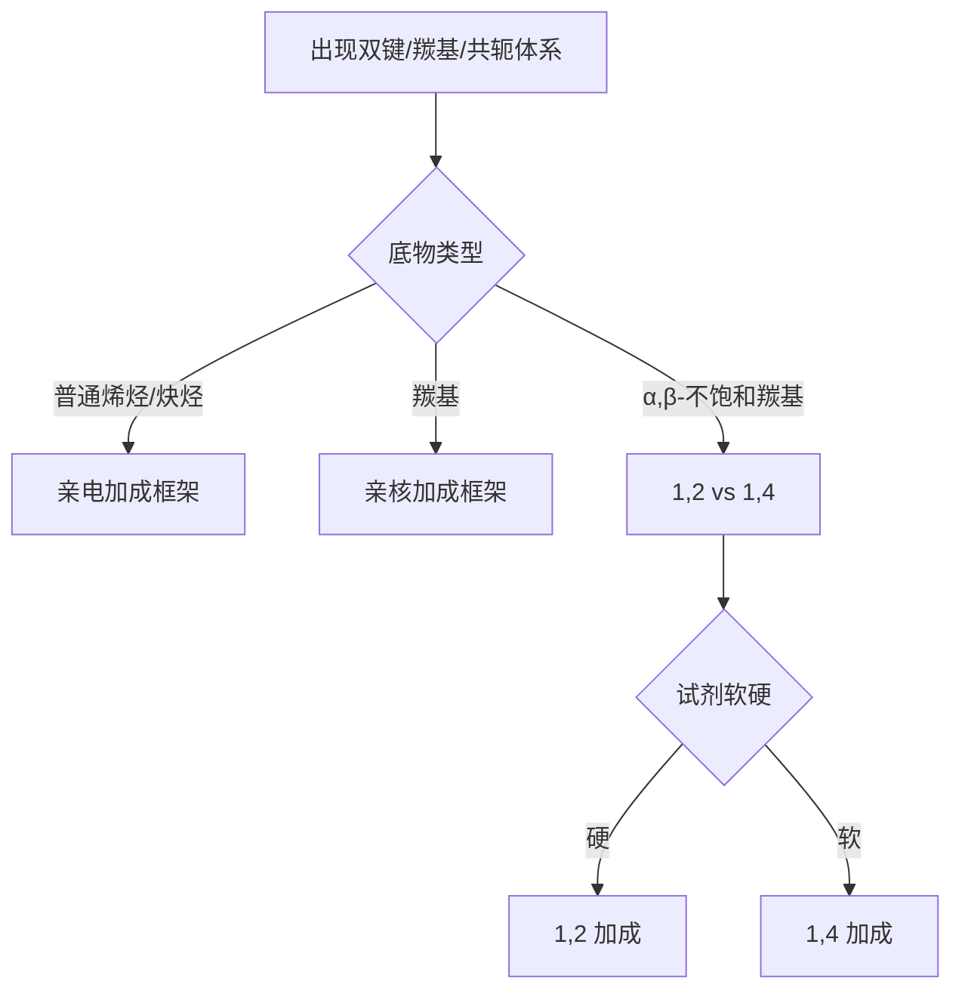

# 专题：加成反应

> 2026-06-19 复核说明：本专题对应的专题页、备课大纲、课堂执行页、教学洞察均已成套落地，原状态属于系统回写滞后，现统一升为 `已审校`。

> 本专题对应考纲条目：[[37-加成反应]]、[[43-不饱和化合物]]、[[45-亲核加成反应]]
> 核心知识点：[[亲电加成]]、[[亲核加成]]、[[硼氢化反应]]、[[直接加成与共轭加成]]、[[羰基亲核加成]]

---

## 一、核心结论汇总 {#core-conclusions}

**必须记住：**
- 第三轮“加成反应”不是按底物背杂项，而是按“谁在攻击谁”统一成亲电加成、亲核加成、共轭加成三大语言。
- 先判断底物是普通烯烃、共轭体系、羰基，还是 α,β-不饱和羰基，再判断试剂是硬还是软、经桥连还是碳正离子。
- 区域与立体必须同步判断，尤其是 HBr、Br₂、硼氢化、1,2/1,4-加成。

**最高频决策路径：**



## 一点五、课堂投影速查卡 {#classroom-quick-card}

**本页课堂入口：** 让学生先停止背“马氏/反马氏”口号，改问“加成是怎么起步的”。

**先问四个问题：**

1. 不饱和键是哪一类：普通烯烃、炔烃、共轭体系，还是羰基 `C=O`？
2. 反应起步是亲电进攻、自由基链式，还是亲核对羰基进攻？
3. 主产物要判的是区域选择性、立体选择性，还是多步连续加成停在哪？
4. 有没有 `ROOR / Hg(OAc)2 / BH3 / Lindlar / NaNH3` 这类会直接改写赛道的条件？

**一屏判断卡：**

- 先分“烯烃/炔烃加成”和“羰基加成”两大语言，不要混成一张表。
- 亲电加成先看更稳定中间体；自由基加成先看链增长方向；羰基加成先看羰基碳亲电性。
- 看到硼氢化、氧汞化还原、过氧化物效应，马上提醒学生旧规则失效。
- 结果判断最后要补一句：区域是谁控制，立体是谁控制。

**讲后立刻练：**

- 先做一组 `HX` / `HBr, ROOR` / `BH3·THF` 对同一烯烃的对比题。
- 再接一道炔烃部分还原或羰基亲核加成题，拉开赛道。

---

## 二、对比表格 {#comparison-table}

| 触发条件（题目关键词） | 比较维度 | A | B | 常见陷阱 |
|----------------------|---------|---|---|---------|
| `HBr`、`HX` | 机理 | 碳正离子加成 | 自由基反马氏（有 ROOR） | 不看是否有过氧化物 |
| `Br2`、`X2` | 立体 | 卤鎓离子反式加成 | 非碳正离子重排 | 把反式结果说成马氏规律 |
| `BH3/H2O2` | 结果 | 反马氏 + syn | 非 anti | 忘记立体专一性 |
| `RMgX` vs `R2CuLi` | 加成位置 | 1,2 硬加成 | 1,4 软加成 | 只看“都是有机金属” |
| `低温/高温` | 共轭二烯加成 | 1,2 动力学 | 1,4 热力学 | 把所有温度效应机械化 |
| `炔烃 + 1 eq HX` | 加成深度 | 先得烯基卤 | 非一步就停在烷烃 | 忘记炔烃可继续二次加成 |
| `NaBH4/LiAlH4` | 羰基亲核加成结果 | 还原成醇 | 非烯烃加成 | 把“加氢”都归为一种语境 |

### 2.1 加成反应类型化速查表（Zchem）

> 来源：[[资料提炼-Zchem基础有机化学-批次Z-A到Z-E-结构与反应体系]] §8.3

| 试剂 | 加成类型 | 区域选择性 | 立体选择性 | 备注 |
|:---|:---:|:---:|:---:|:---|
| H₂/Pd-C | 催化加氢 | — | **顺式** | 均加氢 |
| H₂/Lindlar | 部分还原炔 | — | **顺式**烯烃 | 毒化催化剂 |
| Na/NH₃(l) | 部分还原炔 | — | **反式**烯烃 | 溶解金属还原 |
| HX | 亲电加成 | **马氏规则** | 无特殊 | H加在含H多的碳 |
| HBr/ROOR | 自由基加成 | **反马氏** | 无特殊 | 过氧化物效应 |
| X₂ | 亲电加成 | — | **反式** | 经由溴鎓离子 |
| X₂/H₂O | 卤代醇 | **马氏** | **反式** | OH加在取代多碳 |
| H₂O/H⁺ | 酸催化水合 | **马氏** | 无特殊 | 经由碳正离子 |
| BH₃/THF | 硼氢化 | **反马氏** | **顺式** | 协同机理 |
| Hg(OAc)₂/H₂O | 羟汞化 | **马氏** | **反式** | 无重排 |
| NaBH₄ | 还原汞化产物 | — | — | 脱汞得醇 |

**课堂速记**：
- 需要**顺式烯烃** → H₂/Lindlar 或 BH₃/H₂O₂
- 需要**反式烯烃** → Na/NH₃(l)
- 需要**反式加成** → X₂, X₂/H₂O
- 需要**顺式加成** → BH₃, 催化氢化
- 需要**马氏产物** → HX, H₂O/H⁺, X₂/H₂O
- 需要**反马氏** → HBr/ROOR, BH₃/H₂O₂

### 2.2 加成题一眼分层

| 层级 | 先问的问题 | 典型分支 |
|:---|:---|:---|
| 底物层 | 是 π 键、羰基还是共轭体系？ | 烯烃 / 炔烃 / 羰基 / 烯酮 |
| 试剂层 | 是亲电、亲核、自由基还是硼试剂？ | HX / X2 / RMgX / R2CuLi / BH3 |
| 结果层 | 主要争议是区域、立体还是加成深度？ | 马氏/反马氏、syn/anti、1,2/1,4 |

## 三、解题套路 / 决策流程 {#problem-solving-routine}

### Step 1：先给底物归类
- **操作**：判断是烯烃/炔烃、羰基、共轭二烯还是 α,β-不饱和羰基。
- **依据 KP**：[[亲电加成]]、[[羰基亲核加成]]、[[直接加成与共轭加成]]
- **检查点**：☐ 底物类型明确 ☐ 已识别共轭特征

### Step 2：再给试剂归类
- **操作**：判断是亲电试剂、亲核试剂、自由基条件还是硼氢化体系。
- **依据 KP**：[[亲核体与亲电体]]、[[硬软亲核试剂]]
- **检查点**：☐ 试剂角色明确 ☐ 是否伴随氧化/后处理已考虑

### Step 3：同步输出区域和立体结论
- **操作**：给出主产物位置与构型，并说明来自何种中间体或过渡态。
- **依据 KP**：[[区域选择性]]、[[立体选择性]]
- **检查点**：☐ 区域已定 ☐ 立体已定 ☐ 理由能回到机理

### Step 4：检查是否会继续发生第二次加成或后处理转化
- **操作**：对炔烃、环氧化、臭氧化和硼氢化体系检查后续步骤。
- **依据 KP**：[[炔烃]]、[[环氧化反应]]、[[臭氧化反应]]
- **检查点**：☐ 是否只写了中间态 ☐ 是否考虑了氧化/水解/还原后处理

## 四、反应机理拆解（含检查表）（可选，机理类专题启用） {#mechanism-analysis}

#### 步骤 1：确定第一步活化方式
- **攻击位点**：双键 π 电子或羰基碳
- **形成键**：与亲电体或亲核体形成新 σ 键
- **断裂键**：X-X、B-H 或 π 键极化
- **学生任务（接力点）**：下一位同学需要判断的是区域还是立体
- **检查表**：
  - ☐ 是否存在桥连中间体
  - ☐ 是否存在碳正离子重排可能
  - ☐ 是否需要区分 1,2 / 1,4 路径

#### 步骤 2：输出区域与立体结果
- **攻击位点**：马氏位、反马氏位、羰基碳、β 位
- **形成键**：最终加成位点对应的新 σ 键
- **断裂键**：桥连中间体开环或共轭体系重排
- **学生任务（接力点）**：下一位同学需要判断的是是否会继续加成或后处理
- **速控/非速控**：共轭体系中常需结合动力学/热力学控制再判断
- **检查表**：
  - ☐ 主产物位点是否说明清楚
  - ☐ 构型来源是否对应正确机理
  - ☐ 是否误把“区域”与“立体”混为一个结论

### 4.1 第三轮高频判断清单

- 看到 `ROOR + HBr`，先问是不是自由基反马氏加成
- 看到 `Br2`，先问是不是桥连中间体导致反式
- 看到 `BH3/H2O2`，先问是不是反马氏且 syn
- 看到 `α,β-不饱和羰基 + 有机金属`，先问试剂是硬还是软
- 看到共轭二烯加成，先问题目在考动力学还是热力学控制

## 五、典型例题串讲 {#typical-examples}

### 例题 1
**题目：** 比较 MeLi 和 Gilman 试剂对环己烯酮的加成位置。  
**分析：** 核心是硬软亲核试剂差异。  
**解答：** MeLi 倾向 1,2-加成，Gilman 试剂倾向 1,4-加成。  
**反思：** 第三轮里最重要的是先把“底物与试剂归类”，再谈产物。  

### 例题 2
**题目：** 1-甲基环己烯与 HBr、`ROOR` 体系反应时，为什么不能直接照搬普通 HBr 加成结论？  
**分析：** 过氧化物把体系切到自由基链反应语言中。  
**解答：** 体系优先走反马氏自由基加成，而非碳正离子马氏加成。  
**反思：** 第三轮里，条件词往往就是机理切换开关。  

### 例题 3
**题目：** 为什么 `Br2` 对烯烃的加成常给出反式产物？  
**分析：** 先形成桥连卤鎓离子，后续只能背面开环。  
**解答：** 因此表现出反式加成，而不是自由旋转后的任意立体结果。  
**反思：** 立体化学不是附加条件，而是机理本身的投影。  

### 例题 4
**题目：** 共轭二烯与 HBr 在低温和高温下产物不同，判断逻辑应该先抓什么？  
**分析：** 题眼不是“HBr”，而是“共轭二烯 + 动力学/热力学控制”。  
**解答：** 低温偏 1,2-加成，高温偏 1,4-加成。  
**反思：** 第三轮里要学会把“试剂信息”和“控制模式信息”分层读取。  

## 六、关联知识点 {#related-kp}

- [[亲电加成]]
- [[亲核加成]]
- [[硼氢化反应]]
- [[直接加成与共轭加成]]
- [[羰基亲核加成]]

## 七、关联题型 {#related-problem-types}

- [[题型-加成产物预测]]
- [[题型-1,2与1,4加成判断]]
- [[题型-区域选择性判断]]
- [[题型-加成立体化学推断]]

## 八、相关真题 {#related-exam-questions}

```dataview
TABLE file.name AS "文件名", year AS "年份", type AS "题型", difficulty AS "难度"
FROM "05-真题库"
WHERE contains(knowledge_points, "亲电加成")
   OR contains(knowledge_points, "亲核加成")
   OR contains(knowledge_points, "硼氢化反应")
SORT year DESC, difficulty ASC
```

### 真题入口使用建议

- 加成反应真题分两大路：**烯烃/炔烃的亲电加成**（Markovnikov、硼氢化-氧化、臭氧化）和**羰基的亲核加成**（Grignard、缩醛、Wittig）。课前先确认今天练的是哪一路。
- **基础班**：优先练”Markovnikov 规则判断 + 硼氢化-氧化的反马产物”，建立”加成方向=中间体稳定性”的直觉。
- **提高班**：加入羰基加成的选择性（1,2- vs 1,4-加成）、缩醛保护基策略、Wittig 反应的 E/Z 选择性。
- 加成反应的真题经常和消除、重排联合——讲评时注意”加成产物可能是下一步的底物”。

### 推荐真题 {#recommended-exam-questions}

| 真题 | 核心考点 | 难度 |
|:---|:---|:---:|
| [[真题-有机-亲电加成-001]] | 亲电加成：丙烯 + HBr、马氏规则判断与碳正离子中间体 | ⭐⭐ |
| [[真题-有机-硼氢化-001]] | 硼氢化-氧化：反马氏水合、syn 立体选择性 | ⭐⭐⭐ |
| [[真题-有机-碳正重排-001]] | 亲电加成中的碳正离子重排：Wagner-Meerwein 重排与条件选择 | ⭐⭐⭐ |

### 真题链与讲评顺序 {#exam-sequence}

- `第 1 题`：**烯烃亲电加成 + Markovnikov 判断**。课堂用途：热启动，确认加成方向判断无误。
- `第 2 题`：**硼氢化-氧化 + 臭氧化切断**。课堂用途：主讲题，训练反马加成和氧化切断→反推烯烃结构。
- `第 3 题`：**羰基亲核加成 + 1,2/1,4 选择**。课堂用途：收束题，把加成从”C=C”扩展到”C=O”，训练软硬酸碱控制选择性。
- 课堂顺序建议：`烯烃加成 → 硼氢化/氧化切断 → 羰基加成`。

*本专题依据 [[模板-专题]] v1.7 生成。*
*第三轮定位：从双键到羰基的统一”加成语言层”，后续与羰基专题强联动。*

> 📎 相关提炼：[[07-资料提炼/书籍提炼/提炼-ABOC-第3章-烯烃加成]]
