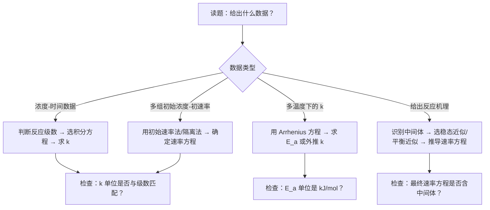
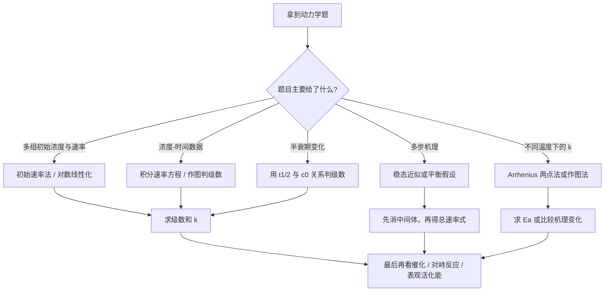

# 专题：化学动力学初步

> 本专题对应考纲条目：[[06]]、[[07-化学平衡]]、[[决赛07-化学动力学]]
> 核心知识点：[[反应速率]]、[[速率方程]]、[[反应级数]]、[[活化能]]、[[Arrhenius方程]]、[[半衰期]]、[[反应机理与近似]]

---

## 零点五、进阶导航 {#advance-navigation}

- 本页定位：第三轮深化基础页
- 第四轮综合冲刺页：[[专题-物化综合计算]]

## 零点五点五、网课桥梁回流接口 {#source-bridge}

- 默认调用顺序：
  1. [[07-资料提炼/教学逻辑提炼/Zchem 物理化学 下/教学逻辑提炼-Zchem-化学动力学-第一轮]]
  2. [[07-资料提炼/教学逻辑提炼/Zchem 物理化学 上/教学逻辑提炼-Zchem-热力学-第一三轮]]
  3. [[专题-物化综合计算]]

## 零点六、课堂投影速查卡 {#classroom-quick-card}

**本页课堂入口：** 先认题型，再选工具，不先代公式。

**先问四个问题：**

1. 题目给的是初始速率、多组浓度时间数据，还是机理与温度信息？
2. 这题该用积分式、半衰期、稳态近似，还是 Arrhenius？
3. 现在是要求判级数，还是要从机理推出总速率式？
4. 最后答案是落到 `k`、`Ea`、级数，还是进一步落到机理解释？

**一屏判断卡：**

- 先认题型，再选工具。
- 级数来自实验，不来自反应式系数。
- 稳态近似最怕不会先找中间体。
- 动力学题很多不是不会算，而是工具拿错。

## 一点五、Zchem 二次抽料：动力学工具选错率最高的四类场景

| 场景 | 最容易错拿什么 | 正确起手 | 对应提醒 |
|:---|:---|:---|:---|
| 初始速率题 | 上来套积分式 | 先用初速法或隔离法判级数 | 看到多组初速先别急着积分 |
| 浓度-时间题 | 把作图题硬算成一步代数 | 先判线性关系，再定级数 | 数据长得像曲线时更该先画工具图 |
| 多步机理题 | 直接把总反应写成速率式 | 先找中间体，再选稳态或平衡近似 | 速率式里不能留中间体 |
| 变温题 | 只背“升温变快”不算 `E_a` | 先看给的是两点还是整组 `k-T` 数据 | Arrhenius 是专用桥，不要混到平衡公式里 |

## 一、核心结论汇总 {#core-conclusions}

**必须记住：**

1. **速率方程由实验确定**，非基元反应的级数不等于化学方程式的计量系数；只有基元反应才可直接按计量系数写出速率方程（质量作用定律）。
2. **反应级数决定积分形式与半衰期规律**：一级反应 $t_{1/2}$ 与浓度无关，二级反应 $t_{1/2}$ 与初始浓度成反比；作图判据是最可靠的级数判定方法。
3. **Arrhenius 方程定量关联温度与速率**：$\ln(k_2/k_1) = (E_a/R)(1/T_1 - 1/T_2)$；催化剂通过降低 $E_a$ 加速反应，不改变 $\Delta H$ 和平衡常数 $K$。

**最高频决策路径：**



---

## 二、对比表格 {#comparison-table}

| 触发条件（题目关键词） | 比较维度 | A | B | 常见陷阱 |
|:---|:---|:---|:---|:---|
| "求反应级数""作图判断" | 级数判定法 | **积分法**：尝试各级数积分式，看哪种线性关系最好 | **微分法**：$\ln v = \ln k + m\ln[A]$，多组数据拟合 | 只用两组数据判断，误差大；混淆 $\ln$ 与 $\lg$ 导致斜率系数错 |
| "半衰期与浓度无关""放射性衰变" | 一级 vs 二级 $t_{1/2}$ | **一级**：$t_{1/2} = 0.693/k$，与 $[A]_0$ 无关 | **二级**：$t_{1/2} = 1/(k[A]_0)$，与 $[A]_0$ 成反比 | 把一级 $t_{1/2}$ 公式套到二级反应；忘记 $^{14}$C 测年是一级应用 |
| "给出多步机理""推导速率方程" | 近似方法选择 | **稳态近似（SSA）**：活泼中间体 $d[I]/dt \approx 0$，解代数方程 | **平衡近似（PEA）**：速控步前有快平衡，$[I]$ 由平衡常数决定 | 稳态近似用于中间体活泼但无明确快平衡的情况；平衡近似要求 $k_{-1} \gg k_2$ |
| "温度升高10 K速率加倍""求活化能" | Arrhenius 计算方式 | **作图法**：$\ln k$ 对 $1/T$ 作图，斜率 $= -E_a/R$ | **两点法**：$\ln(k_2/k_1) = (E_a/R)(T_2-T_1)/(T_1T_2)$ | $R$ 单位用错（必须用 $8.314\ \mathrm{J\cdot mol^{-1}\cdot K^{-1}}$，$E_a$ 才得 J/mol）；忘记换算为 kJ/mol |
| "催化剂""酶催化" | 催化本质 | **均相催化**：催化剂与反应物同相（如 $I_2$ 催化乙醛分解） | **非均相催化**：催化剂与反应物不同相（如 Au 催化 $N_2O$ 分解） | 催化剂改变 $E_a$ 但不改变 $\Delta H$ 和 $K$；正逆反应同等加速 |

---

## 二点五、教学图二：动力学工具选用图 {#teaching-figure-2}

> 课堂用途：现有图负责“做题流程”，这张图负责“看到不同数据类型时该拿哪把工具”。



## 三、解题套路 / 决策流程 {#problem-solving-routine}

### Step 1：审题定位 —— 判断题目给出的核心信息类型
- **操作**：快速扫描题目，识别关键词："浓度-时间""初速率""多温度""反应机理""半衰期"
- **依据 KP**：[[反应速率]]、[[化学动力学]]
- **检查点**：☐ 已识别题目类型 ☐ 已知数据列全 ☐ 单位统一

### Step 2：选择工具 —— 匹配对应的动力学方程或近似方法
- **操作**：
  - 浓度-时间数据 → 用积分法或半衰期法判断级数（[[反应级数]]）
  - 多组初始浓度与初速率 → 用初始速率法确定 $m, n$（[[速率方程]]）
  - 多温度 $k$ 值 → 用 Arrhenius 方程求 $E_a$ 或外推 $k$（[[Arrhenius方程]]、[[活化能]]）
  - 给出多步机理 → 识别中间体，选择稳态近似或平衡近似（[[反应机理与近似]]）
- **依据 KP**：[[速率方程]]、[[Arrhenius方程]]、[[反应机理与近似]]
- **检查点**：☐ 所选方法与题目条件匹配 ☐ 确认是否为基元反应（决定能否直接用计量系数）

### Step 3：列式计算 —— 代入数据，注意单位与量纲
- **操作**：写出完整公式 → 代入数据（带单位）→ 计算并保留有效数字
- **依据 KP**：[[反应级数]]、[[半衰期]]、[[活化能]]
- **检查点**：☐ $k$ 的单位与反应级数一致（零级：$\mathrm{mol\cdot dm^{-3}\cdot s^{-1}}$；一级：$\mathrm{s^{-1}}$；二级：$\mathrm{dm^3\cdot mol^{-1}\cdot s^{-1}}$） ☐ 温度用开尔文（K） ☐ $R = 8.314\ \mathrm{J\cdot mol^{-1}\cdot K^{-1}}$

### Step 4：验证结果 —— 利用独立条件或数量级检验
- **操作**：用另一组数据回代验证；检查 $E_a$ 数量级是否合理（通常 $40 \sim 250\ \mathrm{kJ\cdot mol^{-1}}$）；检查半衰期规律是否符合所定级数
- **依据 KP**：[[化学动力学]]、[[反应级数]]
- **检查点**：☐ 回代验证通过 ☐ 结果数量级合理 ☐ 无中间体残留在最终速率方程中（机理推导题）

### Step 5：作答规范 —— 写出结论并注明条件
- **操作**：明确写出速率方程（含 $k$ 值与单位）、级数、$E_a$ 或机理推导结论；注明适用温度或假设条件
- **依据 KP**：[[速率方程]]、[[反应机理与近似]]
- **检查点**：☐ 结论完整 ☐ 单位正确 ☐ 假设条件已声明

| 步骤 | 核心操作 | 依据 KP | 检查清单 |
|:---|:---|:---|:---|
| 1 | 审题定位，识别关键词与数据类型 | [[反应速率]] | ☐ 题目类型已识别 ☐ 数据列全 ☐ 单位统一 |
| 2 | 选择积分方程 / 初始速率法 / Arrhenius 方程 / 稳态或平衡近似 | [[速率方程]]、[[Arrhenius方程]]、[[反应机理与近似]] | ☐ 方法与条件匹配 ☐ 确认基元/非基元 |
| 3 | 列式计算，代入数据 | [[反应级数]]、[[半衰期]]、[[活化能]] | ☐ $k$ 单位正确 ☐ 温度用 K ☐ $R$ 单位正确 |
| 4 | 回代验证，数量级检验 | [[化学动力学]]、[[反应级数]] | ☐ 回代通过 ☐ $E_a$ 合理 ☐ 无残留中间体 |
| 5 | 规范作答，写明结论与条件 | [[速率方程]]、[[反应机理与近似]] | ☐ 结论完整 ☐ 单位正确 ☐ 假设已声明 |

---

## 四、反应机理拆解（含检查表）{#mechanism-analysis}

> 化学动力学的核心是从微分速率方程建立浓度–时间的定量关系。以下以**一级反应积分速率方程的推导**为例，演示"数学流"拆解。

#### 步骤 1：建立微分速率方程
- **操作**：对一级反应 $\mathrm{A \to 产物}$，$v = -\dfrac{d[\mathrm{A}]}{dt} = k[\mathrm{A}]$
- **检查表**：
  - ☐ 负号表示反应物浓度随时间减少
  - ☐ 一级反应特征：速率与浓度的一次方成正比

#### 步骤 2：分离变量并积分
- **操作**：$\dfrac{d[\mathrm{A}]}{[\mathrm{A}]} = -k\,dt$，两边定积分：$\int_{[\mathrm{A}]_0}^{[\mathrm{A}]} \dfrac{d[\mathrm{A}]}{[\mathrm{A}]} = -k\int_0^t dt$
- **检查表**：
  - ☐ 积分下限：$t=0$ 时 $[\mathrm{A}]=[\mathrm{A}]_0$
  - ☐ 积分上限：$t=t$ 时 $[\mathrm{A}]=[\mathrm{A}]_t$

#### 步骤 3：得到积分形式与半衰期
- **操作**：$\ln[\mathrm{A}]_t = \ln[\mathrm{A}]_0 - kt$ 或 $[\mathrm{A}]_t = [\mathrm{A}]_0 e^{-kt}$
- **检查表**：
  - ☐ 半衰期 $t_{1/2} = \ln 2/k$，与 $[\mathrm{A}]_0$ 无关
  - ☐ 作图判据：$\ln[\mathrm{A}]$ 对 $t$ 呈直线，斜率 $= -k$

---

## 五、典型例题串讲 {#typical-examples}

### 例题 1 —— 由实验数据确定速率方程与反应级数

**题目：**
反应 $2\mathrm{HgCl_2} + \mathrm{C_2O_4^{2-}} \longrightarrow 2\mathrm{Cl^-} + 2\mathrm{CO_2} + \mathrm{Hg_2Cl_2(s)}$ 在 298 K 的实验数据如下：

| $(\mathrm{HgCl_2})$ / $\mathrm{mol\cdot dm^{-3}}$ | $(\mathrm{C_2O_4^{2-}})$ / $\mathrm{mol\cdot dm^{-3}}$ | $v$ / $\mathrm{mol\cdot dm^{-3}\cdot s^{-1}}$ |
|:---:|:---:|:---:|
| 0.105 | 0.15 | $1.8 \times 10^{-5}$ |
| 0.105 | 0.30 | $7.1 \times 10^{-5}$ |
| 0.052 | 0.30 | $3.5 \times 10^{-5}$ |
| 0.052 | 0.15 | $8.9 \times 10^{-6}$ |

试确定：(1) 速率方程；(2) 反应总级数；(3) 速率常数 $k$（带单位）。

**分析：**
本题属于典型的"初始速率法"确定速率方程。核心思路是**固定一个反应物浓度，观察另一个反应物浓度变化对速率的影响**，从而分别确定分级数 $m$ 和 $n$。

- 比较实验 1 和 2：$\mathrm{HgCl_2}$ 浓度不变，$\mathrm{C_2O_4^{2-}}$ 从 0.15 增至 0.30（加倍），速率从 $1.8 \times 10^{-5}$ 增至 $7.1 \times 10^{-5}$（约 4 倍）→ 对 $\mathrm{C_2O_4^{2-}}$ 为 2 级。
- 比较实验 2 和 3：$\mathrm{C_2O_4^{2-}}$ 浓度不变，$\mathrm{HgCl_2}$ 从 0.105 减至 0.052（约减半），速率从 $7.1 \times 10^{-5}$ 减至 $3.5 \times 10^{-5}$（约减半）→ 对 $\mathrm{HgCl_2}$ 为 1 级。

**解答：**

(1) 速率方程为：
$$v = k(\mathrm{HgCl_2})(\mathrm{C_2O_4^{2-}})^2$$

(2) 反应总级数 $= 1 + 2 = 3$（三级反应）。

(3) 代入实验 1 数据求 $k$：
$$k = \frac{v}{(\mathrm{HgCl_2})(\mathrm{C_2O_4^{2-}})^2} = \frac{1.8 \times 10^{-5}}{0.105 \times (0.15)^2} = \frac{1.8 \times 10^{-5}}{2.36 \times 10^{-3}} \approx 7.6 \times 10^{-3}\ \mathrm{dm^6\cdot mol^{-2}\cdot s^{-1}}$$

用实验 3 验证：$k = \frac{3.5 \times 10^{-5}}{0.052 \times (0.30)^2} = \frac{3.5 \times 10^{-5}}{4.68 \times 10^{-3}} \approx 7.5 \times 10^{-3}\ \mathrm{dm^6\cdot mol^{-2}\cdot s^{-1}}$，与实验 1 结果一致。

**反思：**
- 本题总反应计量系数为 $2:1$，但速率方程为 $1:2$，再次验证**非基元反应的级数不等于计量系数**。
- 初始速率法的优势在于避免产物干扰和逆反应影响，是竞赛中最常用的级数确定方法。
- 三级反应的 $k$ 单位为 $\mathrm{dm^6\cdot mol^{-2}\cdot s^{-1}}$，计算时务必检查量纲。

---

### 例题 2 —— 稳态近似推导复杂反应速率方程

**题目：**
臭氧分解反应 $2\mathrm{O_3} \longrightarrow 3\mathrm{O_2}$ 的机理为：

$$\text{(1)} \quad \mathrm{O_3} \underset{k_{-1}}{\stackrel{k_1}{\rightleftharpoons}} \mathrm{O_2} + \mathrm{O} \quad \text{(快)}$$
$$\text{(2)} \quad \mathrm{O} + \mathrm{O_3} \xrightarrow{k_2} 2\mathrm{O_2} \quad \text{(慢)}$$

(1) 用稳态近似推导 $\mathrm{O_3}$ 的消耗速率方程。
(2) 若 $k_{-1}[\mathrm{O_2}] \gg k_2[\mathrm{O_3}]$，简化速率方程并说明其物理意义。

**分析：**
本题是决赛难度的机理推导题。关键步骤：
1. 识别中间体：氧原子 $\mathrm{O}$ 是活泼中间体，适用稳态近似。
2. 对中间体列稳态方程：$d[\mathrm{O}]/dt = 0$。
3. 解出 $[\mathrm{O}]$ 代入总速率表达式。
4. 在限定条件下简化，讨论机理意义。

**解答：**

(1) 对中间体 $\mathrm{O}$ 应用稳态近似：

$$\frac{d[\mathrm{O}]}{dt} = k_1[\mathrm{O_3}] - k_{-1}[\mathrm{O_2}][\mathrm{O}] - k_2[\mathrm{O}][\mathrm{O_3}] = 0$$

解得：

$$[\mathrm{O}] = \frac{k_1[\mathrm{O_3}]}{k_{-1}[\mathrm{O_2}] + k_2[\mathrm{O_3}]}$$

$\mathrm{O_3}$ 的消耗速率：

$$-\frac{d[\mathrm{O_3}]}{dt} = k_1[\mathrm{O_3}] - k_{-1}[\mathrm{O_2}][\mathrm{O}] + k_2[\mathrm{O}][\mathrm{O_3}]$$

利用稳态条件简化（$k_1[\mathrm{O_3}] - k_{-1}[\mathrm{O_2}][\mathrm{O}] = k_2[\mathrm{O}][\mathrm{O_3}]$）：

$$-\frac{d[\mathrm{O_3}]}{dt} = 2k_2[\mathrm{O}][\mathrm{O_3}] = \frac{2k_1k_2[\mathrm{O_3}]^2}{k_{-1}[\mathrm{O_2}] + k_2[\mathrm{O_3}]}$$

(2) 当 $k_{-1}[\mathrm{O_2}] \gg k_2[\mathrm{O_3}]$ 时：

$$-\frac{d[\mathrm{O_3}]}{dt} \approx \frac{2k_1k_2}{k_{-1}} \cdot \frac{[\mathrm{O_3}]^2}{[\mathrm{O_2}]} = k_{\text{表观}} \frac{[\mathrm{O_3}]^2}{[\mathrm{O_2}]}$$

**物理意义**：产物 $\mathrm{O_2}$ 对反应有抑制作用（出现在分母），这与实验观测一致。此时步骤 (1) 的快平衡主导了中间体 $\mathrm{O}$ 的浓度，步骤 (2) 为速控步。

**反思：**
- 稳态近似的核心不是 $[\mathrm{O}] = 0$，而是 $d[\mathrm{O}]/dt = 0$（生成速率 = 消耗速率）。
- 推导完成后必须检查：最终速率方程中**不能含有中间体浓度**（$[\mathrm{O}]$ 已被消去）。
- 若题目给出"快平衡"而非"活泼中间体"，可优先尝试平衡近似，数学上更简便。
- 本题速率方程对 $\mathrm{O_3}$ 不是简单级数，说明并非所有反应都有整数级数。

---

### 例题 3 —— Arrhenius 方程求活化能（基础班核心计算，⭐⭐）

**题目：**
某一级反应在 300 K 时的速率常数 $k_1 = 2.5 \times 10^{-3}\ \mathrm{s^{-1}}$，在 320 K 时 $k_2 = 2.0 \times 10^{-2}\ \mathrm{s^{-1}}$。计算该反应的活化能 $E_a$。

**分析：**
本题是 Arrhenius 方程**两点法**的典型应用。只需记住一个公式：
$$\ln\frac{k_2}{k_1} = \frac{E_a}{R}\left(\frac{1}{T_1} - \frac{1}{T_2}\right)$$
注意：温度必须用开尔文（K），$R = 8.314\ \mathrm{J\cdot mol^{-1}\cdot K^{-1}}$。

**解答：**

$$\ln\frac{k_2}{k_1} = \ln\frac{2.0 \times 10^{-2}}{2.5 \times 10^{-3}} = \ln 8 = 2.079$$

$$\frac{1}{T_1} - \frac{1}{T_2} = \frac{1}{300} - \frac{1}{320} = 2.083 \times 10^{-4}\ \mathrm{K^{-1}}$$

$$E_a = \frac{R \cdot \ln(k_2/k_1)}{1/T_1 - 1/T_2} = \frac{8.314 \times 2.079}{2.083 \times 10^{-4}} = 8.30 \times 10^{4}\ \mathrm{J\cdot mol^{-1}}$$

$$E_a \approx \mathbf{83\ \mathrm{kJ\cdot mol^{-1}}}$$

**反思：**
- **数量级检验**：$E_a$ 通常在 $40 \sim 250\ \mathrm{kJ\cdot mol^{-1}}$ 之间，83 kJ/mol 完全合理。
- **温度升高 20 K，速率常数增大 8 倍**——说明反应对温度相当敏感，符合中等活化能的特征。
- 常见错误：$R$ 的单位用错（误用 $0.0821$），或温度未换算为开尔文。

---

### 例题 4 —— 一级反应的半衰期与浓度-时间关系（改编自 Atkins，⭐⭐⭐）

**题目：**
$\mathrm{N_2O_5}$ 在 $\mathrm{CCl_4}$ 中的分解反应为一级反应：$2\mathrm{N_2O_5} \longrightarrow 4\mathrm{NO_2} + \mathrm{O_2}$。在某温度下 $k = 3.4 \times 10^{-5}\ \mathrm{s^{-1}}$。
(1) 计算该反应的半衰期 $t_{1/2}$；
(2) 若初始浓度 $[\mathrm{N_2O_5}]_0 = 0.50\ \mathrm{mol\cdot L^{-1}}$，求反应进行 10 分钟后的剩余浓度。

**分析：**
一级反应的核心特征是 $t_{1/2}$ 与初始浓度无关。积分速率方程为：
$$\ln[A] = \ln[A]_0 - kt \quad \text{或} \quad [A] = [A]_0 e^{-kt}$$
注意：虽然计量方程式中 $2\mathrm{N_2O_5}$ 的系数为 2，但**速率方程的级数由实验确定**，本题已告知为一级，直接用一级公式即可。

**解答：**

**(1) 半衰期**
$$t_{1/2} = \frac{\ln 2}{k} = \frac{0.693}{3.4 \times 10^{-5}} = 2.04 \times 10^{4}\ \mathrm{s} \approx \mathbf{5.7\ \mathrm{h}}$$

**(2) 10 分钟后的浓度**
$$t = 10\ \mathrm{min} = 600\ \mathrm{s}$$
$$\ln[\mathrm{N_2O_5}] = \ln(0.50) - 3.4 \times 10^{-5} \times 600 = -0.693 - 0.0204 = -0.713$$
$$[\mathrm{N_2O_5}] = e^{-0.713} = \mathbf{0.49\ \mathrm{mol\cdot L^{-1}}}$$

**反思：**
- 10 分钟仅约 $0.3\%$ 的 $t_{1/2}$，所以浓度下降很少（从 0.50 到 0.49），这与计算结果一致。
- 若题目给出的是**总压**随时间变化的数据，则需通过化学计量关系将总压转化为反应物分压，再用一级方程处理（参见 Atkins 主题 17A）。
- 一级反应的 $t_{1/2}$ 与浓度无关——这是放射性衰变、药物代谢等领域广泛应用的原因。

---

### 例题 5 —— 积分法判断反应级数（Atkins 主题 17B，⭐⭐⭐）

**题目：**
某反应 $\mathrm{A} \longrightarrow$ 产物，实验测得不同时刻 A 的浓度如下：

| $t$ / s | 0 | 100 | 200 | 300 | 400 |
|:---:|:---:|:---:|:---:|:---:|:---:|
| $[\mathrm{A}]$ / $\mathrm{mol\cdot L^{-1}}$ | 1.00 | 0.80 | 0.67 | 0.57 | 0.50 |

试判断该反应的级数，并求速率常数 $k$（带单位）。

**分析：**
积分法判断级数的核心思路是**假设某级数，检验浓度-时间数据是否符合该级数的积分形式**：
- 零级：$[A]$ 对 $t$ 作图为直线，斜率 $= -k$
- 一级：$\ln[A]$ 对 $t$ 作图为直线，斜率 $= -k$
- 二级：$1/[A]$ 对 $t$ 作图为直线，斜率 $= k$

**解答：**

计算辅助数据：

| $t$ / s | 0 | 100 | 200 | 300 | 400 |
|:---:|:---:|:---:|:---:|:---:|:---:|
| $[\mathrm{A}]$ | 1.00 | 0.80 | 0.67 | 0.57 | 0.50 |
| $\ln[\mathrm{A}]$ | 0 | $-0.223$ | $-0.400$ | $-0.562$ | $-0.693$ |
| $1/[\mathrm{A}]$ | 1.00 | 1.25 | 1.49 | 1.75 | 2.00 |

**检验线性度**：
- $[A]$ vs $t$：从 1.00 到 0.50，下降速度逐渐变慢，非线性
- $\ln[A]$ vs $t$：各点间隔不等（$-0.223 \to -0.400 \to -0.562 \to -0.693$），非线性
- $1/[A]$ vs $t$：$1.00 \to 1.25 \to 1.49 \to 1.75 \to 2.00$，近似线性增长

判定为**二级反应**。

求速率常数：
$$k = \frac{1/[\mathrm{A}] - 1/[\mathrm{A}]_0}{t} = \frac{2.00 - 1.00}{400} = 2.5 \times 10^{-3}\ \mathrm{L\cdot mol^{-1}\cdot s^{-1}}$$

用 $t=200$ s 验证：$k = (1.49 - 1.00)/200 = 2.45 \times 10^{-3}$，与 400 s 数据一致。

**反思：**
- **积分法是最可靠的级数判定方法**之一，尤其当数据点较多时。竞赛中常以表格形式给出数据，要求判断级数。
- 二级反应的 $k$ 单位为 $\mathrm{L\cdot mol^{-1}\cdot s^{-1}}$，务必与一级（$\mathrm{s^{-1}}$）和零级（$\mathrm{mol\cdot L^{-1}\cdot s^{-1}}$）区分。
- 若只有两组数据，无法可靠判断级数——至少需要三组以上才能检验线性度。

---

## 六、关联知识点 {#related-kp}

- [[反应速率]]
- [[速率方程]]
- [[反应级数]]
- [[活化能]]
- [[Arrhenius方程]]
- [[半衰期]]
- [[反应机理与近似]]
- [[速率控制步骤]]
- [[温度对速率的影响]]
- [[化学动力学]]

## 七、关联题型 {#related-problem-types}

- [[题型-速率方程推导]]
- [[题型-反应级数确定]]
- [[题型-动力学计算]]
- [[题型-活化能计算]]

---

## 八、相关真题 {#related-exam-questions}

### 真题入口使用建议

- 开场先用“作图判级数 / 半衰期变化”题，把学生拉回“先认题型再选工具”的主线。
- 稳态近似推导题适合放在中段，不宜作为第一题，否则学生会直接被代数步骤拖住。
- Arrhenius 两点法与表观活化能题更适合放在收束段，用来统一“机理改变为何改写 Ea”。
- 习题课排题建议顺序：级数判断 → 积分式计算 → 稳态近似 → 对峙反应 / Arrhenius。

### 真题链与讲评顺序 {#exam-sequence}

- `第 1 题`：先讲级数判断题，稳住“先看图像/半衰期”的入口。
- `第 2 题`：再讲稳态近似题，把“先找中间体再消元”讲透。
- `第 3 题`：最后讲 Arrhenius / 对峙反应题，把动力学和更大框架接上。
- 课堂顺序建议：`级数题 → 机理题 → 温度/综合题`，先拿工具再进长链。

### 图后立刻练 / 讲后 1 题 / 课后 2 题

- 图后立刻练：给一题短题，只要求学生先判“该拿哪把工具”。
- 讲后 1 题：选一题浓度-时间或半衰期真题，完整判级数并求 `k`。
- 课后 2 题：一题稳态近似题，一题 Arrhenius/对峙反应题，训练两条主线。

```dataview
TABLE file.name AS "文件名", year AS "年份", type AS "题型", difficulty AS "难度"
FROM "05-真题库"
WHERE contains(knowledge_points, "反应速率") OR contains(knowledge_points, "速率方程") OR contains(knowledge_points, "反应级数") OR contains(knowledge_points, "活化能") OR contains(knowledge_points, "Arrhenius方程") OR contains(knowledge_points, "半衰期") OR contains(knowledge_points, "反应机理与近似")
SORT year DESC, difficulty ASC
```

### 🥇 推荐真题（硬链接）

| 真题 | 核心考点 | 难度 |
|:---|:---|:---:|
| [[真题-化学动力学-001]] | 反应级数 + 速率方程积分 | ⭐⭐⭐ |
| [[真题-物化-动力学-002]] | 半衰期 + 浓度-时间关系 | ⭐⭐⭐ |
| [[真题-物化-动力学-003]] | 稳态近似 + 链反应机理推导 | ⭐⭐⭐⭐ |

> 查询覆盖本专题涉及的全部核心知识点：反应速率、速率方程、反应级数、活化能、Arrhenius方程、半衰期、反应机理与近似。

---

## 九、相关课件与讲义 {#related-lessons}

| 类型 | 文件 | 班型 | 日期 | 说明 |
|:---|:---|:---:|:---|:---|
| 备课大纲 | [[04-课件/备课大纲/2026-06-02-化学动力学初步-基础班]] | 基础班 | 2026-06-02 | 认知台阶、速率概念引入与基础班深度边界 |
| 新授课讲义 | [[04-课件/新授课/2026-06-02-化学动力学初步-基础班]] | 基础班 | 2026-06-02 | 学生课堂材料，覆盖速率、活化能与 Arrhenius 方程入门 |
| 学生讲义 | [[04-课件/学生讲义/2026-06-23-化学动力学基础]] | 基础班 | 2026-06-23 | SHHS Vol 2·五提炼：速率方程/反应级数/Arrhenius/机理推导 |

---

*本专题依据 [[模板-专题]] v1.6 生成，状态：可用。*
*新授课教学设计请参考独立的备课大纲文件，本页为纯粹的知识模块与解题引擎。*

> 📎 相关提炼：[[07-资料提炼/书籍提炼/提炼-普化原理-第7章-化学反应速率]] · [[07-资料提炼/习题提炼/习题-普化原理-第7章-化学反应速率]] · [[07-资料提炼/书籍提炼/提炼-Atkins物理化学-主题17-19-动力学与表面过程]]
