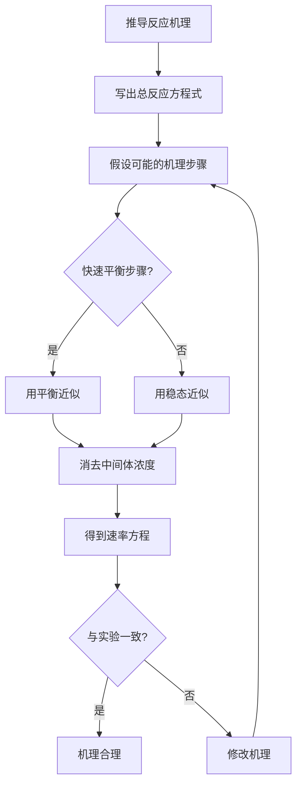

# 化学动力学进阶

> **定位**：化学动力学研究反应速率和机理，是物理化学的核心内容。本专题为"讲义抽料台"，可直接复制各板块到学生讲义。

---

## 一、核心结论

### 1.1 反应级数判断（来源：化学动力学(解题策略)§一）

| 方法 | 原理 | 适用场景 |
|:---|:---|:---|
| 积分法 | 尝试不同级数的积分式拟合 | 简单反应 |
| 微分法 | ln(dC/dt) vs lnC 作图 | 初始速率法 |
| 半衰期法 | 半衰期与初始浓度的关系 | 快速判断 |
| 初始速率法 | 改变初始浓度测速率 | 多组分反应 |

**特征判据**：
- 零级：t₁/₂ ∝ C₀，线性衰减
- 一级：t₁/₂ = 0.693/k（与浓度无关），ln(C₀/C) = kt
- 二级：t₁/₂ ∝ 1/C₀，1/C − 1/C₀ = kt

### 1.2 稳态近似与平衡近似（来源：反应机理推导KP §三）

**稳态近似（SSA）**：
$$\frac{d[\text{中间体}]}{dt} \approx 0$$

**适用条件**：中间体的生成速率 = 消耗速率（快速平衡或连续反应）

**平衡近似（Preequilibrium）**：
$$K_{eq} = \frac{[\text{中间体}]}{[\text{反应物}]}$$

**区别**：平衡近似假设快速平衡始终成立，SSA不要求平衡。

### 1.3 链反应三步骤（来源：化学动力学KP §十二）

| 步骤 | 特征 | 示例 |
|:---|:---|:---|
| 链引发 | 产生自由基 | Br₂ → 2Br· |
| 链传递 | 自由基循环再生 | Br· + H₂ → HBr + H· |
| 链终止 | 自由基结合消失 | 2Br· → Br₂ |

---

## 二、决策路径

### 反应机理推导流程



### Michaelis-Menten动力学

```mermaid
graph TD
    A[酶催化反应] --> B[E + S ⇌ ES → E + P]
    B --> C{底物浓度?}
    C -->|>> Km| D[v ≈ Vmax, 零级动力学]
    C -->|<< Km| E[v = Vmax/Km · S, 一级动力学]
    C -->|≈ Km| F[v = Vmax/2]
    D --> G[Lineweaver-Burk图: 1/v vs 1/[S]]
    E --> G
    F --> G
    G --> H[截距 = 1/Vmax, 斜率 = Km/Vmax]
```

---

## 三、对比表格

### 表1：零级、一级、二级反应对比（来源：反应速率方程KP §三）

| 特征 | 零级 | 一级 | 二级 |
|:---|:---|:---|:---|
| 速率方程 | v = k | v = k[A] | v = k[A]² |
| 积分式 | [A] = [A]₀ - kt | ln[A] = ln[A]₀ - kt | 1/[A] = 1/[A]₀ + kt |
| 半衰期 | [A]₀/(2k) | 0.693/k | 1/(k[A]₀) |
| 线性图 | [A] vs t | ln[A] vs t | 1/[A] vs t |
| k单位 | mol·L⁻¹·s⁻¹ | s⁻¹ | L·mol⁻¹·s⁻¹ |

### 表2：稳态近似 vs 平衡近似（来源：反应机理推导KP §四）

| 特征 | 稳态近似 | 平衡近似 |
|:---|:---|:---|
| 假设 | d[中间体]/dt ≈ 0 | 快速平衡始终成立 |
| 适用条件 | 高活性中间体 | 快速平衡步骤 >> 慢步骤 |
| 通用性 | 更通用 | 是SSA的特例 |
| 数学处理 | 需解方程 | 直接用Keq |

### 表3：链反应速率方程特征（来源：化学动力学KP §十二）

| 反应 | 速率方程 | 级数特征 |
|:---|:---|:---|
| H₂ + Br₂ → 2HBr | k[H₂][Br₂]^½/(1 + k'[HBr]/[Br₂]) | Br₂为1/2级，HBr自抑制 |
| H₂ + I₂ → 2HI | k[H₂][I₂] | 二级（无链反应特征） |
| H₂ + Cl₂ → 2HCl | k[H₂][Cl₂]^½ | Cl₂为1/2级 |

### 表4：酶动力学参数

| 参数 | 物理意义 | 测定方法 |
|:---|:---|:---|
| Vmax | 最大反应速率 | Lineweaver-Burk图截距 |
| Km | 米氏常数 | v = Vmax/2时的[S] |
| kcat | 转换数 | Vmax/[E]₀ |
| kcat/Km | 催化效率 | 酶的"完美度"指标 |

---

## 四、典型例题

### 例1：稳态近似推导（来源：化学动力学KP §九 典型例题）

对于反应 A → P，假设机理为：A ⇌ I（快速平衡，K），I → P（慢，k₂）。用平衡近似推导速率方程。

**解答**：
- 快速平衡：K = [I]/[A] → [I] = K[A]
- 慢步骤决定速率：v = k₂[I] = k₂K[A]
- **结果**：v = k_obs[A]，k_obs = k₂K（一级反应）

### 例2：Michaelis-Menten方程（来源：题库 无对应题库）

某酶催化反应的Vmax = 10 μmol/(L·min)，Km = 0.5 mmol/L。计算[S] = 2.5 mmol/L时的反应速率。

**解答**：
- v = Vmax[S]/(Km + [S])
- v = 10 × 2.5 / (0.5 + 2.5) = 25/3 ≈ **8.3 μmol/(L·min)**
- [S]/Km = 5 >> 1，反应接近零级（v ≈ Vmax）

### 例3：链反应速率方程（来源：化学动力学KP §十二 典型例题）

推导 H₂ + Br₂ → 2HBr 反应的速率方程。

**解答**：
- 链引发：Br₂ → 2Br·（速率 = k₁[Br₂]）
- 链传递：
  - Br· + H₂ → HBr + H·（慢，k₂）
  - H· + Br₂ → HBr + Br·（快，k₃）
- 链终止：2Br· → Br₂（速率 = k₄[Br·]²）
- 稳态近似：d[Br·]/dt = 0，d[H·]/dt = 0
- 解得：d[HBr]/dt = k[H₂][Br₂]^½/(1 + k'[HBr]/[Br₂])

### 例4：半衰期判断级数（来源：题库 无对应题库）

某反应初始浓度为0.1 mol/L时半衰期为100s，初始浓度为0.2 mol/L时半衰期为50s。判断反应级数。

**解答**：
- t₁/₂ × C₀ = 100 × 0.1 = 10 = 50 × 0.2（常数）
- **结论**：二级反应（t₁/₂ ∝ 1/C₀）
- k = 1/(t₁/₂ × C₀) = 1/(100 × 0.1) = 0.1 L/(mol·s)

---

## 五、易错点预警

### 易错1：稳态近似 ≠ 平衡近似（来源：反应机理推导KP §五）

- SSA更通用，平衡近似是其特例
- 平衡近似要求快速平衡**始终成立**，SSA只要求**净生成速率为零**
- **陷阱**：不能将两者混用

### 易错2：链反应速率方程常含分数级数（来源：化学动力学KP §十三）

- H₂ + Br₂反应中Br₂为1/2级（来自链引发步骤的平方根）
- **陷阱**：分数级数是链反应的特征，不要试图用整数级数解释

### 易错3：HBr的自催化/自抑制

- HBr既是产物又参与链传递的竞争
- 速率方程分母中的HBr项反映了**竞争抑制**
- **陷阱**：产物抑制是链反应的常见特征

### 易错4：Michaelis-Menten不适用于变构酶

- Michaelis-Menten方程基于**单底物、单活性位**假设
- 变构酶有协同效应，需用Hill方程等修正
- **陷阱**：不要将M-M方程用于所有酶催化反应

### 易错5：Arrhenius方程的温度范围

- Arrhenius方程假设活化能Ea与温度无关
- 在很宽的温度范围内，Ea可能随温度变化
- **陷阱**：外推温度范围太大会导致误差

### 易错6：反应级数与反应分子数

- 反应级数由**实验确定**，可以是分数或零
- 反应分子数是**基元反应中同时参与反应的分子数**（1、2或3）
- **陷阱**：非基元反应的级数≠分子数

### 易错7：速率常数k的单位

- k的单位取决于总反应级数
- 零级：mol·L⁻¹·s⁻¹；一级：s⁻¹；二级：L·mol⁻¹·s⁻¹
- **陷阱**：k的单位是判断反应级数的重要线索

---

## 六、竞赛深化

### 6.1 过渡态理论（来源：化学动力学KP §十）

- 反应物 → 过渡态（活化络合物）→ 产物
- 活化熵 ΔS‡ 影响指前因子 A
- **Eyring方程**：k = (k_B T/h) × exp(-ΔG‡/RT)

### 6.2 催化反应机理

- 均相催化：催化剂与反应物在同一相
- 多相催化：催化剂在不同相（如固体表面）
- 酶催化：Michaelis-Menten动力学

### 6.3 光化学反应

- 光化学第一定律：只有被吸收的光才能引起化学反应
- 光化学第二定律：每个被吸收的光子只激活一个分子
- **量子产率** Φ = 反应分子数/吸收光子数

---

## 七、知识链接

**前置知识**
- [[化学热力学]] → 反应自发性
- [[化学平衡]] → 平衡常数

**后续知识**
- [[电化学]] → 电极反应动力学
- [[表面化学]] → 多相催化

**相关专题**
- [[专题-化学动力学初步]]（动力学基础概念）
- [[专题-物化综合计算]]（动力学综合计算）

---

## 八、题库索引

```dataview
TABLE difficulty AS "难度", tags AS "标签"
FROM "04-题库/化学原理"
WHERE contains(file.name, "动力学") OR contains(file.name, "速率")
SORT file.name ASC
```
