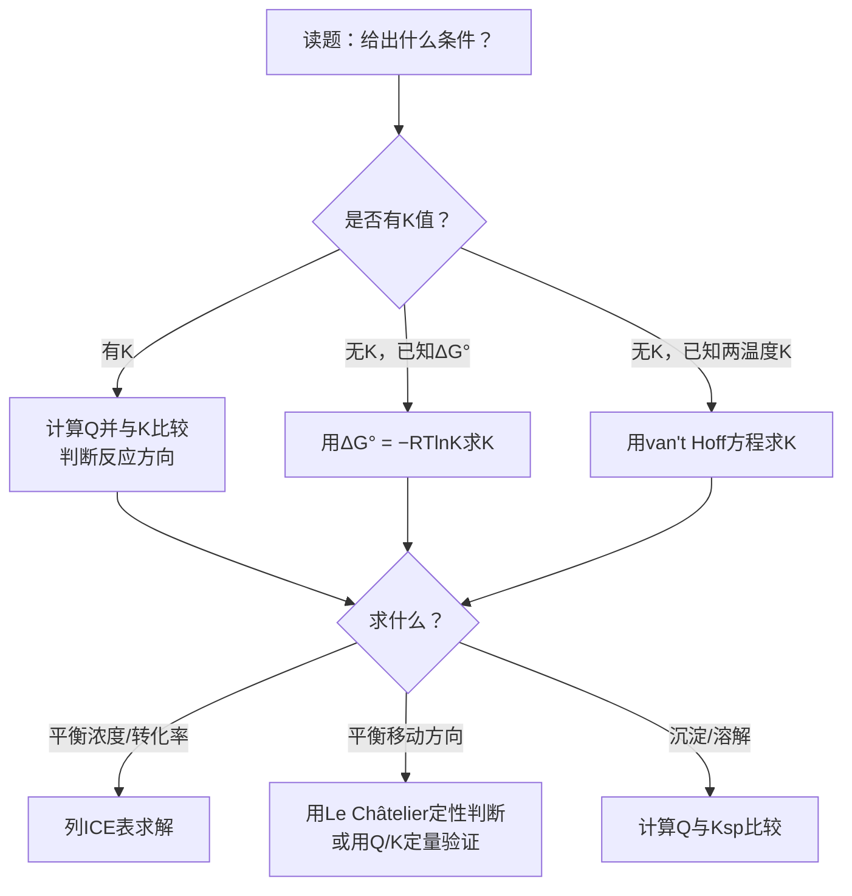
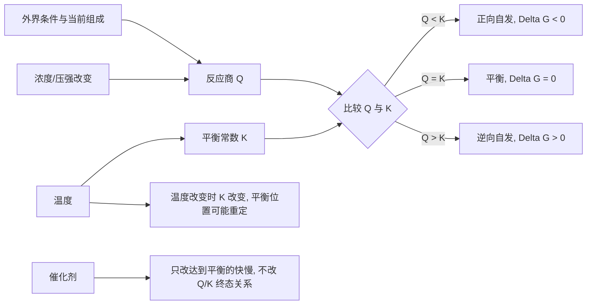

# 专题：化学平衡

> 本专题对应考纲条目：[[07]]
> 核心知识点：[[化学平衡]]、[[平衡常数]]、[[反应商]]、[[Le Châtelier原理]]、[[溶度积]]、[[稳定常数]]

---

## 零点五、进阶导航 {#advance-navigation}

- 本页定位：第三轮深化基础页
- 第四轮综合冲刺页：[[专题-物化综合计算]]

## 零点五点五、网课桥梁回流接口 {#source-bridge}

- 默认调用顺序：
  1. [[07-资料提炼/教学逻辑提炼/Zchem 物理化学 上/教学逻辑提炼-Zchem-化学平衡-第一三轮]]
  2. [[07-资料提炼/教学逻辑提炼/Zchem 物理化学 上/教学逻辑提炼-Zchem-热力学-第一三轮]]
  3. [[专题-物化综合计算]]

## 零点六、课堂投影速查卡 {#classroom-quick-card}

**本页课堂入口：** 先分清“现在是在判 `Q`、判 `K`，还是判扰动后怎么变”。

**先问四个问题：**

1. 这题是在判方向、列平衡表达式，还是在算平衡组成？
2. 当前最关键的是比较 `Q` 和 `K`，还是先看温度/压强/浓度扰动？
3. 现在需要先做状态判断，还是先列 ICE 表？
4. 最后答案是落到平衡位置、平衡常数，还是转化率与浓度分布？

**一屏判断卡：**

- 平衡题先判 `Q` 和 `K` 的关系。
- 温度改 `K`，浓度/压强先改 `Q`。
- 勒夏特列要和 `Q/K` 联动讲，不只背口号。
- ICE 表是求组成的工具，不是所有题的第一步。

## 一点五、Zchem 二次抽料：平衡题四个判断按钮

| 按钮 | 课堂先问什么 | 高频场景 | 对应动作 |
|:---|:---|:---|:---|
| 方向按钮 | 现在最该比较的是 `Q` 和 `K` 吗 | 初始状态、扰动后瞬间、沉淀溶解 | 先判方向，再决定要不要列式 |
| 温度按钮 | 题目在改 `K` 还是只改组成 | 升温降温、吸放热比较 | 把热效应和 `K` 的变化绑在一起讲 |
| 组成按钮 | 需要定性移动还是定量求平衡组成 | ICE 表、转化率、分压分布 | 只在必要时列 ICE，避免一上来重算 |
| 多重平衡按钮 | 体系里是不是有多个平衡同时耦合 | 配位、沉淀、酸碱、气液平衡 | 先拆层次，再决定总平衡如何合并 |

## 一、核心结论汇总 {#core-conclusions}

### 必须记住的5条核心结论

1. **反应方向判据（Q-K 法则）**：$Q < K$ 正向自发，$Q = K$ 达平衡，$Q > K$ 逆向自发。这是判断一切平衡问题的第一性原理。

2. **Le Châtelier 原理**：改变条件（浓度/压强/温度）→ 系统向减弱改变的方向移动 → 建立新平衡。注意：催化剂不移动平衡。

3. **K 只与温度有关，Q 与任意时刻有关**：浓度、压强改变只改变 $Q$，不改变 $K$；温度改变才改变 $K$。这是区分"平衡移动"与"平衡常数变化"的关键。

4. **多重平衡规则**：若总反应 = 反应① + 反应②，则 $K_{\text{总}} = K_1 \times K_2$；若总反应 = 反应① − 反应②，则 $K_{\text{总}} = K_1 / K_2$。

5. **溶度积规则**：$Q > K_{sp}$ 生成沉淀，$Q = K_{sp}$ 饱和平衡，$Q < K_{sp}$ 沉淀溶解。沉淀转化方向总是 $K_{sp}$ 大 → $K_{sp}$ 小。

### 最高频决策路径

拿到化学平衡题目时，按以下顺序判断：



---

## 二、对比表格 {#comparison-table}

### 表1：$K_p$ vs $K_c$ —— 气相反应的平衡常数

| 触发条件（题目关键词） | 比较维度 | $K_p$（分压平衡常数） | $K_c$（浓度平衡常数） | 常见陷阱 |
|:---|:---|:---|:---|:---|
| 题目给分压/总压，求平衡分压 | 表达式 | $K_p = \prod (p_i/p^{\ominus})^{\nu_i}$ | $K_c = \prod (c_i/c^{\ominus})^{\nu_i}$ | 忘记除以标准态 |
| 题目给浓度，求平衡浓度 | 适用场景 | 气相反应（分压数据） | 溶液反应或气相反应（浓度数据） | 气相反应混用 $K_p$ 和 $K_c$ 不换算 |
| 涉及温度变化，比较K变化 | 与温度关系 | 同为温度的函数 | 同为温度的函数 | 认为 $K_p$ 和 $K_c$ 随温度变化不同 |
| 涉及 $\Delta n \neq 0$ 的气相反应 | 换算关系 | $K_p = K_c(RT)^{\Delta n}$ | $K_c = K_p(RT)^{-\Delta n}$ | $\Delta n$ 符号搞反（生成物−反应物） |
| 题目问"是否有单位" | 单位 | 经验 $K_p$ 有单位；标准 $K_p^{\ominus}$ 无量纲 | 经验 $K_c$ 有单位；标准 $K_c^{\ominus}$ 无量纲 | 竞赛中通常默认用标准平衡常数（无量纲） |

> **记忆口诀**：$\Delta n > 0$（气体增多），$K_p > K_c$（因为 $RT > 1$）；$\Delta n < 0$（气体减少），$K_p < K_c$。

### 表2：平衡移动的影响因素——什么变了？K变了吗？

| 触发条件（题目关键词） | 改变条件 | 平衡移动方向 | $K$ 是否改变 | $Q$ 如何变化 | 对转化率的影响 |
|:---|:---|:---|:---:|:---|:---|
| "加入反应物""移走产物" | 增大反应物浓度 | 正向移动 | 不变 | $Q$ 减小（$<K$） | 该反应物转化率降低，另一反应物转化率升高 |
| "加入产物""移走反应物" | 增大生成物浓度 | 逆向移动 | 不变 | $Q$ 增大（$>K$） | 逆向进行 |
| "增大压强""压缩体积" | 增大总压 | 向气体分子数减少方向 | 不变 | $Q$ 变化（仅$\Delta n \neq 0$） | 分子数减少方向的产物转化率升高 |
| "减小压强""扩大体积" | 减小总压 | 向气体分子数增多方向 | 不变 | $Q$ 变化（仅$\Delta n \neq 0$） | 分子数增多方向的产物转化率升高 |
| "升温""加热" | 升高温度 | 向吸热方向（$\Delta H > 0$ 为正） | **改变**（吸热反应 $K$ 增大） | 不变 | 吸热方向产物转化率升高 |
| "降温""冷却" | 降低温度 | 向放热方向 | **改变**（放热反应 $K$ 增大） | 不变 | 放热方向产物转化率升高 |
| "加入催化剂" | 加催化剂 | **不移动** | 不变 | 不变 | 不变（只缩短达到平衡的时间） |
| "恒容充入惰性气体" | 加入惰性气体（$V$ 恒定） | **不移动** | 不变 | 不变（各组分分压不变） | 不变 |
| "恒压充入惰性气体" | 加入惰性气体（$p$ 恒定） | 向气体分子数增多方向 | 不变 | $Q$ 变化（等效于减压） | 分子数增多方向的产物转化率升高 |

> **核心区分**：浓度/压强/催化剂 → 只改变 $Q$，不改变 $K$；温度 → 改变 $K$ 本身。

### 表3：$Q$ vs $K$ 的比较——反应方向判断

| 触发条件（题目关键词） | 关系 | 反应方向 | $\Delta G$ 符号 | 体系状态 | 图示含义 |
|:---|:---|:---|:---:|:---|:---|
| "判断是否达平衡""求反应方向" | $Q < K$ | 正向自发进行 | $\Delta G < 0$ | 反应物过剩，产物不足 | 位于平衡点的左侧，需向右移动 |
| "恰好平衡""平衡状态" | $Q = K$ | 平衡（净反应 = 0） | $\Delta G = 0$ | 动态平衡 | 位于平衡点 |
| "产物过多""逆向进行" | $Q > K$ | 逆向自发进行 | $\Delta G > 0$ | 产物过剩，反应物不足 | 位于平衡点的右侧，需向左移动 |
| "从标准态开始" | $Q = 1$ | 若 $K > 1$ 则正向；若 $K < 1$ 则逆向 | 由 $K$ 决定 | 标准态 | $Q=1$ 为参照点 |

> **公式关联**：$\Delta G = 2.30RT\lg\dfrac{Q}{K}$。$Q/K$ 比值直接决定反应方向和自发程度。

### 表4：各类平衡常数速查

| 触发条件（题目关键词） | 符号 | 表达式 | 适用场景 | 与 $\Delta G^{\ominus}$ 关系 |
|:---|:---|:---|:---|:---|
| "化学平衡""气相/溶液反应" | $K_c$, $K_p$, $K^{\ominus}$ | $\prod a_i^{\nu_i}$ | 一般化学反应 | $\Delta G^{\ominus} = -RT\ln K^{\ominus}$ |
| "弱酸解离""pH计算" | $K_a$, $K_b$ | $K_a = \dfrac{[\mathrm{H^+}][\mathrm{A^-}]}{[\mathrm{HA}]}$ | 酸碱平衡 | 同上 |
| "难溶盐""沉淀生成/溶解" | $K_{sp}$ | $K_{sp} = [\mathrm{A^{n+}}]^m[\mathrm{B^{m-}}]^n$ | 沉淀溶解平衡 | 同上 |
| "配合物形成""配位平衡" | $K_{\text{稳}}$（$\beta_n$） | $\beta_n = \dfrac{[\mathrm{ML_n}]}{[\mathrm{M}][\mathrm{L}]^n}$ | 配位平衡 | 同上 |
| "水的电离""pH + pOH = 14" | $K_w$ | $K_w = [\mathrm{H^+}][\mathrm{OH^-}] = 10^{-14}$ (25°C) | 水溶液体系 | 同上 |
| "氧化还原平衡""电极电势" | $K$（由 $E^{\ominus}$ 求） | $\lg K = \dfrac{nFE^{\ominus}}{2.30RT}$ | 氧化还原平衡 | $\Delta G^{\ominus} = -nFE^{\ominus}$ |

> **统一规律**：所有平衡常数都是温度的函数，都可通过 $\Delta G^{\ominus} = -RT\ln K^{\ominus}$ 与热力学关联。

---

## 二点五、教学图二：平衡判断关系图 {#teaching-figure-2}

> 课堂用途：现有图偏“拿到题怎么做”，这张图负责把 `Q / K / ΔG / 条件改变` 的关系讲成一张概念图。



## 三、解题套路 / 决策流程 {#problem-solving-routine}

### 通用套路：化学平衡计算五步闭环

#### Step 1：识别平衡类型，写出正确的平衡表达式
- **操作**：判断是气相反应（用 $K_p$）还是溶液反应（用 $K_c$），写出对应的平衡常数表达式。多相反应中纯固体/纯液体不写入表达式。
- **依据 KP**：[[平衡常数]]、[[化学平衡]]
- **检查清单**：
  - ☐ 化学方程式配平正确
  - ☐ 平衡表达式中产物在分子、反应物在分母
  - ☐ 纯固体/纯液体已排除在表达式外
  - ☐ 稀溶液中溶剂（如 $\mathrm{H_2O}$）已排除
  - ☐ 指数与化学计量数一致

#### Step 2：计算反应商 $Q$ 并与 $K$ 比较，判断反应方向
- **操作**：用起始状态（任意状态）的浓度或分压代入平衡表达式，计算 $Q$。比较 $Q$ 与 $K$ 的大小关系。
- **依据 KP**：[[反应商]]、[[化学平衡]]
- **检查清单**：
  - ☐ 使用的是起始浓度/分压，不是平衡浓度
  - ☐ 各浓度/分压单位统一
  - ☐ 气相反应中分压已换算为同一单位（bar 或 atm）
  - ☐ 已正确判断 $Q < K$ / $Q = K$ / $Q > K$
  - ☐ 反应方向判断与 $Q-K$ 关系一致

#### Step 3：列 ICE 表（Initial / Change / Equilibrium）
- **操作**：设未知数（如转化率 $\alpha$ 或变化量 $x$），按化学计量比列出初始量、变化量、平衡量。
- **依据 KP**：[[化学平衡]]、[[平衡常数]]
- **检查清单**：
  - ☐ 初始量数据已正确录入
  - ☐ 变化量符号正确（反应物减少为负，产物增加为正）
  - ☐ 变化量按化学计量比分配（如 $1:3:2$）
  - ☐ 平衡量 = 初始量 + 变化量（注意正负）
  - ☐ 设未知数时标注物理意义（$x$ = 消耗的 $\mathrm{A}$ 的浓度）

#### Step 4：代入平衡表达式，求解未知数
- **操作**：将 ICE 表中的平衡量代入 $K$ 表达式，建立方程并求解。
- **依据 KP**：[[平衡常数]]、[[化学平衡]]
- **检查清单**：
  - ☐ 代入的是平衡量，不是初始量或变化量
  - ☐ 方程建立正确（注意平方、立方等指数）
  - ☐ 数学求解无计算错误（建议验算）
  - ☐ 舍去不合理的根（如浓度为负、转化率 > 100%）
  - ☐ 近似处理（如 $c - x \approx c$）时已验证 $x \ll c$（通常 $x < 5\%c$）

#### Step 5：验证与作答
- **操作**：将求得的平衡量回代验证 $Q = K$，检查单位，给出最终答案。
- **依据 KP**：[[反应商]]、[[化学平衡]]
- **检查清单**：
  - ☐ 将平衡浓度回代计算 $Q$，验证 $Q = K$（允许舍入误差）
  - ☐ 最终答案单位正确
  - ☐ 有效数字与题目数据一致
  - ☐ 回答了题目所问（转化率？平衡浓度？分压？）
  - ☐ 结果在合理范围内（如转化率 0~100%，浓度为正）

### 快速决策表

| 题目问法 | 第一步操作 | 关键公式 | 常见陷阱 |
|:---|:---|:---|:---|
| 判断反应方向 | 计算 $Q$，比较 $Q$ 与 $K$ | $\Delta G = 2.30RT\lg(Q/K)$ | 用平衡浓度算 $Q$ |
| 求平衡浓度/转化率 | 列 ICE 表，代入 $K$ 求解 | $K = \prod [\text{产物}]^{\nu} / \prod [\text{反应物}]^{\nu}$ | 化学计量比搞错 |
| 温度变化后求新 $K$ | van't Hoff 方程 | $\ln(K_2/K_1) = -\Delta H^{\ominus}/R \cdot (1/T_2 - 1/T_1)$ | $\Delta H$ 符号 |
| 恒压/恒容充惰性气体 | 判断各组分分压/浓度是否变化 | $p_i = x_i \cdot p_{\text{总}}$ | 恒容 vs 恒压混淆 |
| 沉淀是否生成 | 计算 $Q_{sp}$，与 $K_{sp}$ 比较 | $Q_{sp} = [\mathrm{A^{n+}}]^m[\mathrm{B^{m-}}]^n$ | 离子浓度未考虑稀释 |
| 多重平衡求总 $K$ | 分析反应关系，$K_{\text{总}} = K_1^{\pm} \times K_2^{\pm}$ | $\Delta G_3^{\ominus} = \Delta G_1^{\ominus} \pm \Delta G_2^{\ominus}$ | 反应方向搞反 |

---

## 四、反应机理拆解（含检查表）{#mechanism-analysis}

> 化学平衡的微观本质是正逆反应速率相等。以下以**Le Châtelier 原理的微观动力学解释**为例，演示平衡移动的"速率流"拆解。

#### 步骤 1：建立正逆反应的速率表达式
- **操作**：对基元反应，写出 $v_正 = k_正[\text{反应物}]$ 和 $v_逆 = k_逆[\text{产物}]$
- **检查表**：
  - ☐ 正逆反应速率常数不同（$k_正 \neq k_逆$）
  - ☐ 温度只改变 $k$，不改变计量关系

#### 步骤 2：平衡状态的微观图像
- **操作**：平衡时 $v_正 = v_逆$，宏观上各物种浓度不变
- **检查表**：
  - ☐ 动态平衡：正逆反应仍在进行，只是速率相等
  - ☐ $K = k_正/k_逆$（对基元反应）

#### 步骤 3：外界扰动对速率的影响
- **操作**：改变浓度/压强 → 瞬间改变 $v_正$ 或 $v_逆$ → 打破平衡 → 向恢复 $v_正 = v_逆$ 的方向移动
- **检查表**：
  - ☐ 温度改变影响 $k$（Arrhenius），从而改变 $K$
  - ☐ 催化剂同等加速 $v_正$ 和 $v_逆$，不改变 $K$

---

## 五、典型例题串讲 {#typical-examples}

### 例题 1：ICE 表求平衡浓度和转化率

**题目：** 在 700 K 时，反应 $\mathrm{H_2(g) + I_2(g) \rightleftharpoons 2HI(g)}$ 的平衡常数 $K_c = 50.3$。将 $1.00\ \mathrm{mol}$ 的 $\mathrm{H_2}$ 和 $1.00\ \mathrm{mol}$ 的 $\mathrm{I_2}$ 充入 $1.00\ \mathrm{dm^3}$ 的密闭容器中，求：
(1) 平衡时各物质的浓度；
(2) $\mathrm{H_2}$ 的平衡转化率。

**分析：**
本题是典型的 ICE 表应用题。反应前后气体分子数不变（$\Delta n = 0$），因此压强变化不影响平衡位置。已知 $K_c$ 和初始浓度，通过 ICE 表建立方程求解。

**解答：**

(1) 设平衡时 $\mathrm{H_2}$ 消耗了 $x\ \mathrm{mol \cdot dm^{-3}}$：

| | $\mathrm{H_2}$ | $\mathrm{I_2}$ | $\mathrm{HI}$ |
|:---|:---|:---|:---|
| I（初始） | $1.00$ | $1.00$ | $0$ |
| C（变化） | $-x$ | $-x$ | $+2x$ |
| E（平衡） | $1.00 - x$ | $1.00 - x$ | $2x$ |

代入平衡常数表达式：

$$K_c = \frac{[\mathrm{HI}]^2}{[\mathrm{H_2}][\mathrm{I_2}]} = \frac{(2x)^2}{(1.00-x)(1.00-x)} = 50.3$$

$$\frac{2x}{1.00-x} = \sqrt{50.3} = 7.09$$

$$2x = 7.09 - 7.09x$$

$$9.09x = 7.09$$

$$x = 0.780\ \mathrm{mol \cdot dm^{-3}}$$

平衡浓度：
- $[\mathrm{H_2}] = [\mathrm{I_2}] = 1.00 - 0.780 = 0.22\ \mathrm{mol \cdot dm^{-3}}$
- $[\mathrm{HI}] = 2 \times 0.780 = 1.56\ \mathrm{mol \cdot dm^{-3}}$

(2) $\mathrm{H_2}$ 的平衡转化率：

$$\alpha = \frac{x}{1.00} \times 100\% = \frac{0.780}{1.00} \times 100\% = 78.0\%$$

**验证：**
回代验证：$Q = \dfrac{(1.56)^2}{(0.22)(0.22)} = \dfrac{2.43}{0.0484} = 50.2 \approx K_c$（舍入误差允许）。

**反思：**
- 本题因 $\Delta n = 0$，若用分压计算结果相同。对于 $\Delta n \neq 0$ 的反应，需注意 $K_p$ 与 $K_c$ 的区别。
- 转化率 $\alpha$ 与初始浓度有关：若起始 $[\mathrm{H_2}] = 2.00$、$[\mathrm{I_2}] = 1.00$，则 $\mathrm{H_2}$ 的转化率会降低（约 67%），但 $K$ 不变。
- ICE 表是规范解题的利器，建议每道平衡计算题都先列表再代数。

---

### 例题 2：恒压/恒容条件下充惰性气体对平衡的影响辨析

**题目：** 反应 $\mathrm{N_2O_4(g) \rightleftharpoons 2NO_2(g)}$ 在 325 K 下达平衡。判断下列操作对平衡的影响（正向/逆向/不移动），并说明原因：
(1) 恒温恒容下充入 $\mathrm{Ar}$ 气；
(2) 恒温恒压下充入 $\mathrm{Ar}$ 气；
(3) 恒温下将容器体积压缩为原来的一半；
(4) 恒温恒容下再充入等量的 $\mathrm{N_2O_4}$。

**分析：**
本题考查 Le Châtelier 原理的精细应用，尤其是"恒容 vs 恒压充惰性气体"这一高频易错点。关键是判断各组分的分压（或浓度）是否改变，从而判断 $Q$ 是否改变。

**解答：**

(1) **恒温恒容充入 $\mathrm{Ar}$ 气：平衡不移动**
- 原因：恒容条件下，$\mathrm{Ar}$ 的加入使总压增大，但各反应组分的分压 $p_i = n_iRT/V$ 不变（$n_i$、$V$、$T$ 均未变）。
- $Q = p_{\mathrm{NO_2}}^2 / p_{\mathrm{N_2O_4}}$ 不变，仍等于 $K$，平衡不移动。

(2) **恒温恒压充入 $\mathrm{Ar}$ 气：平衡逆向移动（向 $\mathrm{N_2O_4}$ 方向）**
- 原因：恒压条件下，充入 $\mathrm{Ar}$ 使总体积 $V$ 增大。各组分的分压 $p_i = x_i \cdot p_{\text{总}}$ 降低（摩尔分数 $x_i$ 减小）。
- 等效于"减压"，平衡向气体分子数增多的方向移动（$1 \to 2$，正向）。
- 等等——重新分析：$\mathrm{N_2O_4} \rightleftharpoons 2\mathrm{NO_2}$，气体分子数增多方向是正向（$1 \to 2$）。减压应向分子数增多方向移动，即**正向移动**。

(3) **恒温下体积压缩为一半：平衡逆向移动（向 $\mathrm{N_2O_4}$ 方向）**
- 原因：体积减半 → 各组分分压加倍。$Q = (2p_{\mathrm{NO_2}})^2 / (2p_{\mathrm{N_2O_4}}) = 2 \times (p_{\mathrm{NO_2}}^2 / p_{\mathrm{N_2O_4}}) = 2K > K$。
- 或者从 Le Châtelier 原理：加压 → 向气体分子数减少方向移动（$2 \to 1$，逆向）。

(4) **恒温恒容下再充入等量 $\mathrm{N_2O_4}$：平衡正向移动**
- 原因：$\mathrm{N_2O_4}$ 浓度增大，$Q = [\mathrm{NO_2}]^2 / [\mathrm{N_2O_4}]$ 减小（分母增大），$Q < K$，正向移动。
- 注意：虽然正向移动，但 $\mathrm{N_2O_4}$ 的转化率反而降低（新增的部分不能完全转化）。

**反思：**
- **恒容充惰性气体**：各组分分压不变，$Q$ 不变，平衡**不移动**。这是最常见的错误点。
- **恒压充惰性气体**：总体积膨胀，各组分分压降低，等效于减压，平衡向分子数增多方向移动。
- **记忆口诀**："恒容充惰气，压增分压平；恒压充惰气，体积分压轻。"
- 本题若用 $K_c$ 分析：恒容时各组分浓度不变；恒压时体积增大，各组分浓度降低，等效于稀释。

---

### 例题 3：$K_{sp}$ 相关沉淀判断和溶解度计算

**题目：** 已知 25°C 时，$K_{sp}(\mathrm{AgCl}) = 1.77 \times 10^{-10}$，$K_{sp}(\mathrm{Ag_2CrO_4}) = 1.12 \times 10^{-12}$。
(1) 将 $50\ \mathrm{cm^3}$ 的 $0.010\ \mathrm{mol \cdot dm^{-3}}$ $\mathrm{AgNO_3}$ 溶液与 $50\ \mathrm{cm^3}$ 的 $0.010\ \mathrm{mol \cdot dm^{-3}}$ $\mathrm{NaCl}$ 溶液混合，是否有 $\mathrm{AgCl}$ 沉淀生成？
(2) 若将上述混合溶液与等体积的 $0.010\ \mathrm{mol \cdot dm^{-3}}$ $\mathrm{Na_2CrO_4}$ 溶液混合，是否有 $\mathrm{Ag_2CrO_4}$ 沉淀生成？
(3) 比较 $\mathrm{AgCl}$ 和 $\mathrm{Ag_2CrO_4}$ 在纯水中的溶解度 $s$（单位：$\mathrm{mol \cdot dm^{-3}}$）。

**分析：**
本题综合考查溶度积规则的应用、沉淀判断和溶解度换算。注意混合后体积变化导致浓度稀释，以及不同类型难溶盐（AB 型 vs $A_2B$ 型）的 $K_{sp}$ 与 $s$ 换算关系不同。

**解答：**

(1) **判断 $\mathrm{AgCl}$ 是否沉淀：**

混合后总体积 = $100\ \mathrm{cm^3}$，各离子浓度稀释为原来的一半：
- $[\mathrm{Ag^+}] = 0.010 \times \dfrac{50}{100} = 5.0 \times 10^{-3}\ \mathrm{mol \cdot dm^{-3}}$
- $[\mathrm{Cl^-}] = 0.010 \times \dfrac{50}{100} = 5.0 \times 10^{-3}\ \mathrm{mol \cdot dm^{-3}}$

计算离子积：
$$Q_{sp} = [\mathrm{Ag^+}][\mathrm{Cl^-}] = (5.0 \times 10^{-3})(5.0 \times 10^{-3}) = 2.5 \times 10^{-5}$$

比较：$Q_{sp} = 2.5 \times 10^{-5} > K_{sp}(\mathrm{AgCl}) = 1.77 \times 10^{-10}$

**结论：有 $\mathrm{AgCl}$ 沉淀生成。**

(2) **判断 $\mathrm{Ag_2CrO_4}$ 是否沉淀：**

注意：此时溶液中已有 $\mathrm{AgCl}$ 沉淀生成，$\mathrm{Ag^+}$ 浓度受 $\mathrm{AgCl}$ 溶解平衡控制。

先求沉淀 $\mathrm{AgCl}$ 后溶液中剩余的 $[\mathrm{Ag^+}]$：
$$[\mathrm{Ag^+}] = \frac{K_{sp}(\mathrm{AgCl})}{[\mathrm{Cl^-}]} = \frac{1.77 \times 10^{-10}}{5.0 \times 10^{-3}} = 3.54 \times 10^{-8}\ \mathrm{mol \cdot dm^{-3}}$$

再加入等体积 $0.010\ \mathrm{mol \cdot dm^{-3}}$ $\mathrm{Na_2CrO_4}$ 后，各浓度再稀释一半：
- $[\mathrm{Ag^+}] = 3.54 \times 10^{-8} \times \dfrac{100}{150} = 2.36 \times 10^{-8}\ \mathrm{mol \cdot dm^{-3}}$
- $[\mathrm{CrO_4^{2-}}] = 0.010 \times \dfrac{50}{150} = 3.33 \times 10^{-3}\ \mathrm{mol \cdot dm^{-3}}$

计算离子积：
$$Q_{sp} = [\mathrm{Ag^+}]^2[\mathrm{CrO_4^{2-}}] = (2.36 \times 10^{-8})^2 \times (3.33 \times 10^{-3}) = 1.85 \times 10^{-18}$$

比较：$Q_{sp} = 1.85 \times 10^{-18} < K_{sp}(\mathrm{Ag_2CrO_4}) = 1.12 \times 10^{-12}$

**结论：无 $\mathrm{Ag_2CrO_4}$ 沉淀生成。**

(3) **比较纯水中的溶解度：**

对于 $\mathrm{AgCl}$（AB 型）：
$$s(\mathrm{AgCl}) = \sqrt{K_{sp}} = \sqrt{1.77 \times 10^{-10}} = 1.33 \times 10^{-5}\ \mathrm{mol \cdot dm^{-3}}$$

对于 $\mathrm{Ag_2CrO_4}$（$A_2B$ 型）：
$$\mathrm{Ag_2CrO_4(s) \rightleftharpoons 2Ag^+(aq) + CrO_4^{2-}(aq)}$$

设溶解度为 $s$，则 $[\mathrm{Ag^+}] = 2s$，$[\mathrm{CrO_4^{2-}}] = s$：
$$K_{sp} = (2s)^2 \cdot s = 4s^3 = 1.12 \times 10^{-12}$$
$$s = \sqrt[3]{\frac{1.12 \times 10^{-12}}{4}} = \sqrt[3]{2.8 \times 10^{-13}} = 6.54 \times 10^{-5}\ \mathrm{mol \cdot dm^{-3}}$$

**结论：** $s(\mathrm{Ag_2CrO_4}) = 6.54 \times 10^{-5} > s(\mathrm{AgCl}) = 1.33 \times 10^{-5}$。

虽然 $K_{sp}(\mathrm{Ag_2CrO_4}) < K_{sp}(\mathrm{AgCl})$，但 $\mathrm{Ag_2CrO_4}$ 的溶解度反而更大！

**反思：**
- **混合稀释是高频陷阱**：两溶液等体积混合，浓度均减半。若忽略此步，$Q_{sp}$ 会算错 4 倍。
- **同类型才能直接比较 $K_{sp}$**：AB 型与 $A_2B$ 型不能直接用 $K_{sp}$ 比较溶解度，必须换算为 $s$。
- **分步沉淀的顺序**：本题中 $\mathrm{AgCl}$ 先沉淀（所需 $[\mathrm{Ag^+}]$ 更低），$\mathrm{Ag_2CrO_4}$ 后沉淀。这正是莫尔法（$\mathrm{K_2CrO_4}$ 作指示剂）滴定 $\mathrm{Cl^-}$ 的原理。
- **沉淀后离子浓度**：当一种沉淀已经生成时，溶液中该离子的浓度由 $K_{sp}$ 控制，不能随意假设。

---

### 例题 4：NO₂/N₂O₄ 转化率计算（质心 L4，⭐⭐⭐）

**题目：**
2NO₂(g) ⇌ N₂O₄(g)，1 bar 时 K° = 3.06，求 NO₂ 的平衡转化率 x。

**分析：**
ICE 表写法 + 分压表达式 + 代入 K° 求解。关键是：分母总摩尔数 = 1 − 0.5x（注意计量系数对生成物量的影响）。

**解答：**
设初始 1 mol NO₂，转化率为 x：

| | NO₂ | N₂O₄ |
|:---|:---|:---|
| I | 1 | 0 |
| C | −x | +x/2 |
| E | 1−x | x/2 |

总摩尔数 = 1 − x + x/2 = 1 − 0.5x

$$K° = \frac{p_{\mathrm{N_2O_4}}/p°}{(p_{\mathrm{NO_2}}/p°)^2} = \frac{x/2}{(1-0.5x)(1-x)^2} \times (1-0.5x) = 3.06$$

解得 x ≈ **0.74**（74%）。

**反思：**
- 计量系数在分压表达式中的处理是核心陷阱：生成物 N₂O₄ 的摩尔数增加 x/2，总摩尔数减少 0.5x
- 转化率与初始压强有关：压强增大（或体积减小），平衡向分子数减少方向移动，转化率升高

---

### 例题 5：PCl₅ 解离平衡条件辨析（质心 L4，⭐⭐⭐）

**题目：**
PCl₅(g) ⇌ PCl₃(g) + Cl₂(g)，分析以下条件下解离度 α 的变化：降压、恒压充 N₂、恒容充 N₂、恒压充 Cl₂、恒容充 Cl₂。

**分析：**
恒容充惰性气体 → 各组分分压不变 → α 不变；恒压充惰性气体 → 总压不变但体积增大 → 等效于稀释 → α 增大。充产物则无论恒压恒容 α 都减小。

**解答：**

| 操作 | 对 α 的影响 | 原因 |
|:---|:---:|:---|
| 降压 | **增大** | 向气体分子数增多方向移动（1→2） |
| 恒压充 N₂ | **增大** | 体积膨胀，等效于稀释/减压 |
| 恒容充 N₂ | **不变** | 各组分分压 pᵢ = nᵢRT/V 不变 |
| 恒压充 Cl₂ | **减小** | 产物浓度增大，平衡逆向移动 |
| 恒容充 Cl₂ | **减小** | 产物分压增大，平衡逆向移动 |

**反思：**
- 纠正 "充气体就移动" 的口诀滥用，必须区分是惰性气体还是反应气体
- 恒容 vs 恒压是高频考点，建立 "先看分压/浓度是否变" 的分析习惯
- 本题可与例题 2（N₂O₄/NO₂ 惰性气体辨析）形成题组

---

### 例题 6：2016 国初 N₂O₄ 分解综合题（质心 L4，⭐⭐⭐⭐）

**题目（节选）：**
N₂O₄ ⇌ 2NO₂，已知 295 K 时 Kp° = 0.100，315 K 时 Kp° = 0.400。
求：(1)(2) 各温度下分压；(3) 恒容升温后物质的量之比；(4) 极限温度下的分压。

**分析：**
多温度、多条件下的综合平衡计算。第三问关键：利用氮原子守恒建立方程组；第四问关键：温度无限升高时极限行为分析。

**解答（要点）：**
- (1)(2) 设总压 P，N₂O₄ 摩尔分数为 y，用 Kp° = 4(1−y)²/y × P 求解
- (3) 恒容升温：总压增大，利用氮原子守恒 n(N₂O₄) + n(NO₂) = 常数
- (4) T → ∞ 时极限：Kp° → ∞，完全分解，p(N₂O₄) → 0，p(NO₂) → P_total

**反思：**
- 综合训练，区分度题。第一轮可简化，第二轮完整训练
- 极限分析（T→∞ 或 T→0）是竞赛中的高阶思维，需刻意训练

---

## 六、关联知识点 {#related-kp}

- [[化学平衡]] —— 平衡的定义、特征、动力学与热力学判据
- [[平衡常数]] —— $K_c$、$K_p$、$K^{\ominus}$ 的定义与换算，多重平衡规则
- [[反应商]] —— $Q$ 的定义、$Q/K$ 判据、van't Hoff 等温式
- [[Le Châtelier原理]] —— 平衡移动的定性判断
- [[溶度积]] —— 沉淀溶解平衡、$K_{sp}$ 规则、同离子效应、分步沉淀
- [[稳定常数]] —— 配位平衡、逐级稳定常数与累积稳定常数
- [[Gibbs自由能]] —— $\Delta G^{\ominus} = -RT\ln K^{\ominus}$ 的关联
- [[van't Hoff方程]] —— 温度对平衡常数的影响
- [[酸碱平衡]] —— $K_a$、$K_b$、$K_w$ 与化学平衡的统一框架
- [[Nernst方程]] —— 电化学平衡与平衡常数的联系

---

## 七、关联题型 {#related-problem-types}

- [[题型-平衡常数与转化率]] —— ICE 表计算、转化率与 $K$ 的关系
- [[题型-多重平衡联动]] —— 多重平衡规则、耦合反应计算
- [[题型-沉淀溶解平衡计算]] —— $K_{sp}$ 计算、沉淀判断、溶解度换算
- [[题型-弱酸弱碱pH计算]] —— 酸碱平衡常数的应用
- [[题型-缓冲溶液pH计算]] ——  Henderson-Hasselbalch 方程（平衡常数应用）

---

## 八、相关真题 {#related-exam-questions}

### 真题入口使用建议

- 开场先用 `Q` 与 `K` 比较题，不要先做复杂代数题，先把“体系当前在哪一侧”判断稳住。
- 勒夏特列类题建议和 `ΔG`、微观图像一起讲，避免学生只会背“平衡向某侧移动”。
- 综合题适合放在后段，把平衡常数、温度变化和速率变化拆开对照，防止热力学/动力学混写。
- 习题课排题建议顺序：Q-K-ΔG 判向 → 平衡表达式与图像 → 温度/压力扰动 → 综合对照题。

### 真题链与讲评顺序 {#exam-sequence}

- `第 1 题`：先讲 `Q-K-ΔG` 判向题，稳住“体系当前在哪一侧”。
- `第 2 题`：再讲平衡表达式 / ICE 表题，把组成求解和判断题分开。
- `第 3 题`：最后讲扰动和综合对照题，把温度、压强、速率变化拆清。
- 课堂顺序建议：`判向题 → 组成题 → 扰动/综合题`，先抓判断，再做运算。

### 图后立刻练 / 讲后 1 题 / 课后 2 题

- 图后立刻练：给一题短题，只要求学生先说 `Q`、`K` 谁大。
- 讲后 1 题：选一题标准平衡计算真题，完整练表达式、ICE 表和求解。
- 课后 2 题：一题扰动题，一题热力学/动力学综合对照题，训练边界不混。

```dataview
TABLE file.name AS "文件名", year AS "年份", type AS "题型", difficulty AS "难度"
FROM "05-真题库"
WHERE contains(knowledge_points, "化学平衡") OR contains(knowledge_points, "平衡常数") OR contains(knowledge_points, "溶度积")
SORT year DESC, difficulty ASC
```

### 推荐真题 {#recommended-exam-questions}

| 真题 | 核心考点 | 难度 |
|:---|:---|:---:|
| [[真题-物化-平衡-001]] | PCl₅ 分解平衡：Kp 与转化率互算、Le Chatelier 原理综合应用 | ⭐⭐⭐ |

---

## 九、相关课件与讲义 {#related-lessons}

| 类型 | 文件 | 班型 | 日期 | 说明 |
|:---|:---|:---:|:---|:---|
| 备课大纲 | [[04-课件/备课大纲/2026-06-02-化学平衡-基础班]] | 基础班 | 2026-06-02 | 涵盖平衡常数、反应商、移动方向判断与教学边界 |
| 新授课讲义 | [[04-课件/新授课/2026-06-02-化学平衡-基础班]] | 基础班 | 2026-06-02 | 学生课堂材料，聚焦判据应用与典型平衡计算 |
| 学生讲义 | [[04-课件/学生讲义/2026-06-23-化学平衡]] | 基础班 | 2026-06-23 | SHHS Vol 2·四提炼：平衡常数/Kc-Kp-Kθ关系/等温方程式/平衡移动完整系统 |
| 学生讲义 | [[04-课件/学生讲义/2026-06-23-水中的几种平衡#四、化学平衡]] | 基础班 | 2026-06-23 | SHHS Vol 2·七提炼：平衡常数/Kp-Kc关系/多重平衡 |
| 学生讲义 | [[04-课件/学生讲义/2026-06-23-滴定分析#三、误差与数据分析基础]] | 基础班 | 2026-06-23 | 滴定分析中的平衡应用与有效数字工具 |

---

*本专题依据 [[模板-专题]] v1.6 生成，状态：可用。*

> 📎 相关提炼：[[07-资料提炼/书籍提炼/提炼-普化原理-第6章-化学平衡]] · [[07-资料提炼/习题提炼/习题-普化原理-第6章-化学平衡]] · [[07-资料提炼/书籍提炼/提炼-Atkins物理化学-主题6-化学平衡]]
