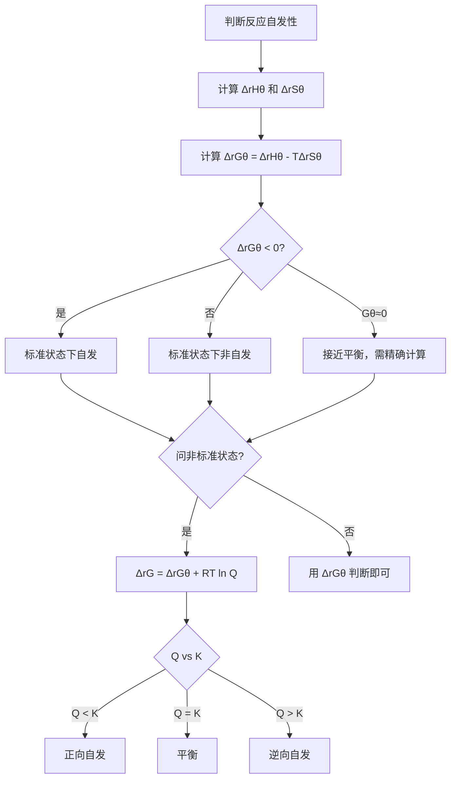
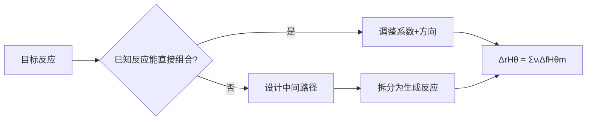

# 化学热力学

> **定位**：化学热力学研究反应的能量变化规律，是物理化学的基础。本专题为"讲义抽料台"，可直接复制各板块到学生讲义。

---

## 一、核心结论

### 1.1 三大状态函数

| 状态函数 | 符号 | 物理意义 | 单位 | 判据条件 |
|:---:|:---:|:---|:---:|:---|
| 焓 | H | 恒压热效应 | kJ/mol | ΔH < 0 放热 |
| 熵 | S | 微观混乱度 | J/(mol·K) | ΔS > 0 混乱度增加 |
| Gibbs自由能 | G | 自发性判据 | kJ/mol | ΔG < 0 自发 |

### 1.2 Gibbs 自由能判据（来源：Gibbs自由能KP §二）

$$\Delta G = \Delta H - T\Delta S$$

| ΔH | ΔS | ΔG | 自发性 |
|:---:|:---:|:---:|:---|
| < 0 | > 0 | < 0 | **任何温度自发** |
| < 0 | < 0 | 取决于T | 低温自发 |
| > 0 | > 0 | 取决于T | 高温自发 |
| > 0 | < 0 | > 0 | **任何温度非自发** |

### 1.3 状态函数的性质（来源：化学热力学(核心结论)§一）

- **状态函数变化只取决于始态和终态**，与途径无关
- **循环过程**：状态函数变化为零（∮dU = 0）
- **全微分**：dU 是全微分，∂U/∂T 等偏导数有意义
- **热和功不是状态函数**：q、w 与途径有关

### 1.4 热化学方程式书写规则（来源：热化学方程式书写KP §二）

- 必须注明物质状态：(g)、(l)、(s)、(aq)
- ΔH 与方程式计量数成正比
- 逆反应 ΔH 符号相反
- 同素异形体须注明：C(石墨) vs C(金刚石)

---

## 二、决策路径

### 判断反应自发性三步法



### Hess定律计算路径



---

## 三、对比表格

### 表1：焓变计算方法对比（来源：化学热力学KP §五）

| 方法 | 公式 | 适用条件 | 示例 |
|:---|:---|:---|:---|
| 标准生成焓法 | ΔrHθ = ΣνᵢΔfHθm(产物) - ΣνᵢΔfHθm(反应物) | 已知生成焓数据 | CH₄燃烧热计算 |
| Hess定律 | ΔrHθ = ΣΔHᵢ（各步焓变之和） | 已知相关反应焓变 | C→CO→CO₂间接计算 |
| 键能法 | ΔrHθ ≈ ΣD(反应物) - ΣD(产物) | 气相反应估算 | 估算反应活化能 |
| 热容积分 | ΔH = ∫CₚdT | 温度变化范围大 | 从298K升至1000K |

### 表2：状态函数 vs 非状态函数（来源：化学热力学(核心结论)§一）

| 特征 | 状态函数 | 非状态函数 |
|:---|:---|:---|
| 符号 | U, H, S, G, T, P, V | q, w |
| 变化量 | 只取决于始末态 | 取决于途径 |
| 循环积分 | ∮dU = 0 | ∮δq ≠ 0 |
| 全微分 | 存在 | 不存在 |
| 数学性质 | 恰当微分 | 路径积分 |

### 表3：自发过程的驱动力（来源：化学热力学KP §六）

| 驱动力 | 表达式 | 倾向 | 示例 |
|:---|:---|:---|:---|
| 焓驱动 | ΔH < 0 | 放热有利 | 燃烧反应 |
| 熵驱动 | ΔS > 0 | 混乱度增加有利 | 冰融化 |
| 自由能 | ΔG = ΔH - TΔS | 综合判据 | 所有自发过程 |

### 表4：常见热效应数值

| 反应类型 | ΔH 范围 | 示例 |
|:---|:---:|:---|
| 燃烧热 | -200 ~ -6000 kJ/mol | CH₄: -890 kJ/mol |
| 中和热 | -55 ~ -58 kJ/mol | 强酸强碱: -57.3 kJ/mol |
| 键能 | 150 ~ 1000 kJ/mol | C-C: 347 kJ/mol |
| 汽化热 | 5 ~ 40 kJ/mol | H₂O: 40.7 kJ/mol |

---

## 四、典型例题

### 例1：Hess定律计算（来源：化学热力学KP §五 典型例题）

已知以下热化学方程式：
- C(s) + O₂(g) → CO₂(g)，ΔH₁ = -393.5 kJ/mol
- CO(g) + ½O₂(g) → CO₂(g)，ΔH₂ = -283.0 kJ/mol

求反应 C(s) + ½O₂(g) → CO(g) 的 ΔH。

**解答**：
- 目标反应 = 反应① - 反应②
- ΔH = ΔH₁ - ΔH₂ = -393.5 - (-283.0) = **-110.5 kJ/mol**

### 例2：Gibbs自由能判断（来源：题库 05-01）

某反应 ΔHθ = -92.2 kJ/mol，ΔSθ = -198.7 J/(mol·K)。该反应在标准状态下 298 K 时是否自发？

**解答**：
- ΔGθ = -92200 - 298 × (-198.7) = -92200 + 59213 = **-32987 J/mol < 0**
- 反应在 298 K 时自发
- 但由于 ΔH < 0 且 ΔS < 0，升温会使 TΔS 项绝对值增大
- 当 T > 464 K 时 ΔG > 0，反应变为非自发

### 例3：标准生成焓计算（来源：题库 05-04）

利用标准生成焓数据计算反应 CH₄(g) + 2O₂(g) → CO₂(g) + 2H₂O(l) 的 ΔrHθ。

已知：ΔfHθm[CH₄(g)] = -74.8 kJ/mol，ΔfHθm[CO₂(g)] = -393.5 kJ/mol，ΔfHθm[H₂O(l)] = -285.8 kJ/mol

**解答**：
- ΔrHθ = [ΔfHθ(CO₂) + 2×ΔfHθ(H₂O)] - [ΔfHθ(CH₄) + 2×ΔfHθ(O₂)]
- = [-393.5 + 2×(-285.8)] - [-74.8 + 0]
- = -965.1 + 74.8 = **-890.3 kJ/mol**

### 例4：熵变估算（来源：题库 05-13）

判断以下反应 ΔS 的符号：
- (a) N₂(g) + 3H₂(g) → 2NH₃(g)
- (b) CaCO₃(s) → CaO(s) + CO₂(g)
- (c) H₂O(l) → H₂O(g)

**解答**：
- (a) ΔS < 0：气体分子数减少（4→2），混乱度降低
- (b) ΔS > 0：固体分解产生气体，混乱度增加
- (c) ΔS > 0：液体变气体，混乱度增加

---

## 五、易错点预警

### 易错1：ΔGθ vs ΔG 的混淆（来源：化学热力学(易混淆点)§一）

- **ΔGθ**：标准状态下的值（各物质分压 1 bar 或浓度 1 mol/L）
- **ΔG**：任意状态下的值，ΔG = ΔGθ + RT ln Q
- **陷阱**：ΔGθ < 0 只说明标准状态下自发，非标准状态下可能不自发

### 易错2：单位不统一（来源：Gibbs自由能计算KP §三）

- ΔS 常给出的单位是 J/(mol·K)，而 ΔH 单位是 kJ/mol
- 计算 ΔG 时**必须统一单位**
- **正确做法**：将 ΔS 转化为 kJ/(mol·K) 再计算

### 易错3：Hess定律方向搞反

- 将某个已知反应逆转后 ΔH 要**变号**
- 乘以系数时 ΔH 也要**同比例变化**
- **常见错误**：忘记变号导致结果符号相反

### 易错4：标准摩尔生成焓的定义（来源：热化学方程式书写KP §四）

- 由**最稳定单质**生成 1 mol 化合物时的焓变
- 最稳定单质的 ΔfHθ = 0（定义值）
- **陷阱**：C(石墨) ΔfHθ = 0，但 C(金刚石) ΔfHθ = +1.9 kJ/mol

### 易错5：热化学方程式配平

- 热化学方程式的系数可以是**分数**
- 系数加倍，ΔH 也要加倍
- **陷阱**：题目给的方程式系数可能不是最简整数比

### 易错6：相变焓的符号

- 蒸发、升华、熔化：ΔH > 0（吸热）
- 凝结、沉积、凝固：ΔH < 0（放热）
- **陷阱**：冰融化吸热，水结冰放热，数值相等符号相反

### 易错7：Gibbs-Helmholtz方程的适用条件

$$\left(\frac{\partial(\Delta G/T)}{\partial T}\right)_P = -\frac{\Delta H}{T^2}$$

- 仅适用于**恒压条件**
- 若 ΔH 近似与温度无关，可积分得：ΔG₂/T₂ - ΔG₁/T₁ = -ΔH(1/T₂ - 1/T₁)
- **陷阱**：不能用于恒容过程

---

## 六、竞赛深化

### 6.1 Kirchhoff方程（来源：化学热力学KP §九）

反应焓变随温度变化：

$$\Delta_rHθ(T_2) = \Delta_rHθ(T_1) + \int_{T_1}^{T_2} \Delta C_p \, dT$$

其中 ΔCp = ΣνᵢCp(产物) - ΣνᵢCp(反应物)

**应用**：已知 298 K 的反应焓变，计算其他温度下的值

### 6.2 热力学函数间的Maxwell关系（来源：化学热力学(核心结论)§五）

从四个热力学基本方程可导出 Maxwell 关系：

| 基本方程 | Maxwell 关系 |
|:---|:---|
| dU = TdS - PdV | (∂T/∂V)ₛ = -(∂P/∂S)ᵥ |
| dH = TdS + VdP | (∂T/∂P)ₛ = (∂V/∂S)ₚ |
| dF = -SdT - PdV | (∂S/∂V)ₜ = (∂P/∂T)ᵥ |
| dG = -SdT + VdP | (∂S/∂P)ₜ = -(∂V/∂T)ₚ |

### 6.3 逸度与活度（来源：Gibbs自由能KP §四）

- 实际气体用**逸度** f 代替压力 P：μ = μθ + RT ln(f/Pθ)
- 实际溶液用**活度** a 代替浓度：μ = μθ + RT ln a
- 逸度系数 γ = f/P，活度系数 γ = a/c

---

## 七、知识链接

**前置知识**
- [[物质的量与气体计算]] → 气体状态方程基础
- [[化学计量与气体]] → 化学计量关系

**后续知识**
- [[化学平衡]] → ΔGθ 与平衡常数 K 的关系
- [[化学动力学初步]] → 热力学 vs 动力学控制

**相关专题**
- [[专题-化学平衡]]（ΔGθ = -RT ln K）
- [[专题-物化综合计算]]（热力学综合计算）
- [[专题-热力学初步]]（热力学基础概念）

---

## 八、题库索引

```dataview
TABLE difficulty AS "难度", tags AS "标签"
FROM "04-题库/化学原理/Ch05-化学热力学"
SORT file.name ASC
```
