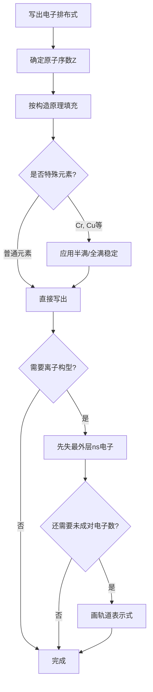
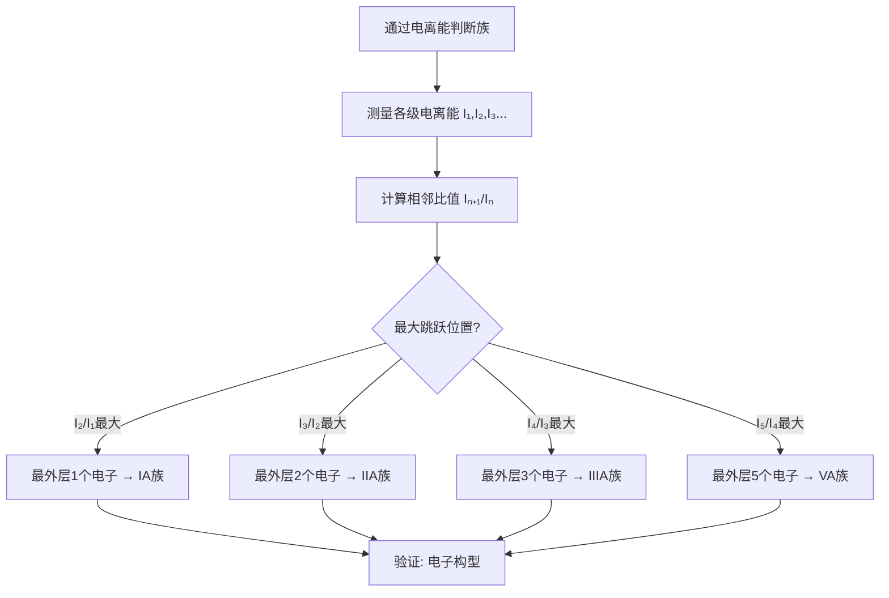

# 原子结构与周期律

> **定位**：原子结构是化学的基础，周期律是元素化学的核心框架。本专题为"讲义抽料台"，可直接复制各板块到学生讲义。

---

## 一、核心结论

### 1.1 核外电子排布三原则（来源：原子结构核心结论§二）

| 原则 | 内容 | 示例 |
|:---|:---|:---|
| 构造原理 | 按能量从低到高填充轨道 | 1s→2s→2p→3s→3p→4s→3d→4p |
| Pauli不相容原理 | 每轨道最多2个自旋相反电子 | 2p轨道最多6个电子 |
| Hund规则 | 简并轨道中电子优先单占 | N的2p³为↑↑↑ |

### 1.2 原子轨道量子数（来源：电子排布与能级KP §二）

| 量子数 | 符号 | 取值范围 | 物理意义 |
|:---:|:---:|:---|:---|
| 主量子数 | n | 1,2,3,... | 能级大小、电子层 |
| 角量子数 | l | 0,1,2,...,n-1 | 轨道形状(s,p,d,f) |
| 磁量子数 | m | -l,...,0,...,+l | 轨道取向 |
| 自旋量子数 | ms | +½ 或 -½ | 电子自旋方向 |

### 1.3 元素周期律（来源：元素周期律KP §三）

**同周期从左到右：**
- 原子半径减小，电离能增大，电负性增大
- 金属性减弱，非金属性增强

**同族从上到下：**
- 原子半径增大，电离能减小，电负性减小
- 金属性增强，非金属性减弱

### 1.4 特殊电子构型（来源：电子排布与能级KP §三）

| 元素 | 预期构型 | 实际构型 | 原因 |
|:---|:---|:---|:---|
| Cr(24) | [Ar]3d⁴4s² | [Ar]3d⁵4s¹ | 半满稳定 |
| Cu(29) | [Ar]3d⁹4s² | [Ar]3d¹⁰4s¹ | 全满稳定 |
| Mo(42) | [Kr]4d⁴5s² | [Kr]4d⁵5s¹ | 半满稳定 |
| Ag(47) | [Kr]4d⁹5s² | [Kr]4d¹⁰5s¹ | 全满稳定 |

---

## 二、决策路径

### 电子排布书写流程



### 电离能判断族



---

## 三、对比表格

### 表1：电离能反常现象（来源：电离能与电负性KP §二）

| 元素 | 预期I₁趋势 | 实际I₁ | 原因 |
|:---|:---:|:---:|:---|
| Be(2s²) | < B(2s²2p¹) | Be > B | 全满稳定 |
| N(2p³) | < O(2p⁴) | N > O | 半满稳定 |
| Mg(3s²) | < Al(3s²3p¹) | Mg > Al | 全满稳定 |
| P(3p³) | < S(3p⁴) | P > S | 半满稳定 |

**规律**：IIA族(ns²全满)和VA族(np³半满)的I₁反常高于相邻元素。

### 表2：电负性与键型判断（来源：元素周期律KP §五）

| 电负性差值Δχ | 键型 | 示例 |
|:---:|:---|:---|
| 0 | 非极性共价键 | H-H, Cl-Cl |
| 0~0.4 | 弱极性共价键 | C-H |
| 0.4~1.7 | 极性共价键 | H-O, H-Cl |
| >1.7 | 离子键 | NaCl, KBr |

### 表3：周期表分区与价电子构型（来源：元素周期律KP §四）

| 分区 | 价电子构型 | 元素范围 | 特征 |
|:---|:---|:---|:---|
| s区 | ns¹⁻² | ⅠA, ⅡA, He | 活泼金属 |
| p区 | ns²np¹⁻⁶ | ⅢA~ⅦA, 0族 | 金属→非金属→稀有气体 |
| d区 | (n-1)d¹⁻⁹ns¹⁻² | ⅢB~ⅦB, Ⅷ | 过渡金属 |
| ds区 | (n-1)d¹⁰ns¹⁻² | ⅠB, ⅡB | 铜族、锌族 |
| f区 | (n-2)f⁰⁻¹⁴(n-1)d⁰⁻¹ns² | 镧系、锕系 | 稀土元素 |

### 表4：原子半径变化规律

| 区域 | 变化趋势 | 主要原因 |
|:---|:---|:---|
| 同周期左→右 | 减小 | 核电荷增大，电子层不变 |
| 同族上→下 | 增大 | 电子层增多 |
| 阳离子<原子<阴离子 | - | 失电子→半径减小，得电子→半径增大 |
| 等电子体 | 核电荷越大，半径越小 | 如 O²⁻ > F⁻ > Na⁺ > Mg²⁺ |

---

## 四、典型例题

### 例1：电子排布与磁性（来源：原子结构KP §六 典型例题）

写出 Fe²⁺（原子序数26）的电子排布式，并判断其磁性。

**解答**：
- Fe 基态：[Ar] 3d⁶4s²
- Fe²⁺ 失去 4s 轨道 2 个电子：**[Ar] 3d⁶**
- 3d⁶ 有 4 个未成对电子（5 个 d 轨道中 4 个单占、1 个成对）
- 故 Fe²⁺ 为**顺磁性**，磁矩 μ = √(4×6) ≈ 4.90 B.M.

### 例2：电离能判断元素（来源：题库 11-10）

某元素的各级电离能(kJ/mol)：I₁=578, I₂=1817, I₃=2745, I₄=11578。判断该元素所在族。

**解答**：
- I₄/I₃ = 11578/2745 ≈ 4.22（最大跳跃）
- 说明该元素最外层有3个电子
- **结论**：ⅢA族元素（如Al）

### 例3：电离能反常（来源：题库 11-15）

比较 N 和 O 的第一电离能大小，并解释原因。

**解答**：
- N 的 I₁ > O 的 I₁
- N 的电子构型为 1s²2s²2p³，2p 轨道恰好**半满**，稳定性较高，难失电子
- O 的电子构型为 1s²2s²2p⁴，有一个 p 轨道成对，电子间排斥使其中一个电子较易失去
- 因此出现 VA 族元素 I₁ 反常高于 VIA 族的现象

### 例4：等电子体比较（来源：题库 11-06）

比较以下等电子体的键长和键能：CO, N₂, CN⁻

**解答**：
- 三者均为10电子体系（等电子体）
- 键级：N₂(3) = CO(3) = CN⁻(3)
- 键长：N₂(1.10Å) < CO(1.13Å) < CN⁻(1.14Å)
- 键能：N₂(945) > CO(1072) > CN⁻(891)
- **注意**：CO键能反常高是因为C端孤对电子的反馈π键

---

## 五、易错点预警

### 易错1：先失4s再失3d（来源：电子排布与能级KP §五）

- 过渡金属失去电子时，**先失去最外层 ns 电子**，再失去 (n-1)d 电子
- 例如 Fe 失去 2 个电子变成 Fe²⁺ 时失去的是 4s² 而非 3d²
- **陷阱**：填写离子电子排布时务必注意顺序

### 易错2：混淆轨道能量顺序与填充顺序（来源：原子结构KP §八）

- 构造原理给出的是**填充顺序**（4s 先于 3d 填充）
- 但对于已填充的原子，**能量顺序 3d < 4s**（即电离时 4s 先失去）
- **陷阱**：不能简单认为"4s 能量低于 3d"

### 易错3：电离能突变与族的关系判断出错

- 相邻两级电离能出现巨大跳跃时，说明从该级开始移除内层电子
- 如某元素 I₂/I₁ 比值远大于 I₃/I₂，说明该元素最外层只有 1 个电子，属于 IA 族
- **陷阱**：比值计算要用除法，不是差值

### 易错4：Hund规则的例外

- Cr 和 Cu 的电子构型不符合构造原理的预期
- Cr: [Ar]3d⁵4s¹（不是3d⁴4s²）
- Cu: [Ar]3d¹⁰4s¹（不是3d⁹4s²）
- **原因**：半满(d⁵)和全满(d¹⁰)轨道特别稳定

### 易错5：电负性的单位

- Pauling电负性是**无量纲**的相对值
- F的电负性为4.0（最大），Cs为0.7（最小）
- **陷阱**：不要误以为电负性有单位

### 易错6：原子半径的定义

- 共价半径：共价键键长的一半
- 范德华半径：分子间接触距离的一半
- 金属半径：金属晶体中相邻原子核间距的一半
- **陷阱**：不同定义的半径数值不同，不能混用

### 易错7：镧系收缩的后果

- La到Lu原子半径收缩约15pm，导致Hf与Zr半径几乎相同
- 后果：Zr和Hf化学性质极其相似，难以分离
- **延伸**：Nb-Ta、Mo-W也因镧系收缩而性质相似

---

## 六、竞赛深化

### 6.1 多电子原子能级（来源：电子排布与能级KP §四）

- **能级交错**：4s < 3d < 4p（n+l规则）
- **屏蔽效应**：内层电子对外层电子的排斥，降低有效核电荷
- **钻穿效应**：外层电子渗透到内层的概率，影响能量

### 6.2 元素性质的对角线关系

- Li-Mg：都能直接与N₂反应生成氮化物
- Be-Al：氧化物/氢氧化物都是两性
- B-Si：都能形成玻璃态氧化物

### 6.3 相对论效应对重元素的影响

- 6s²电子的相对论性稳定化（惰性对效应）
- 导致Tl(I)、Pb(II)、Bi(III)比轻元素类似物更稳定
- Au的颜色（相对论性收缩导致d-d跃迁能量变化）

---

## 七、知识链接

**前置知识**
- [[物质的量与气体计算]] → 基础化学计算

**后续知识**
- [[化学键]] → 原子如何形成分子
- [[分子结构]] → VSEPR和杂化轨道

**相关专题**
- [[专题-分子结构与杂化]]（从原子到分子的逻辑链）
- [[专题-元素化学通论]]（周期律的应用）
- [[专题-晶体结构与晶格能]]（原子性质影响晶体类型）

---

## 八、题库索引

```dataview
TABLE difficulty AS "难度", tags AS "标签"
FROM "04-题库/化学原理/Ch11-原子结构"
SORT file.name ASC
```
