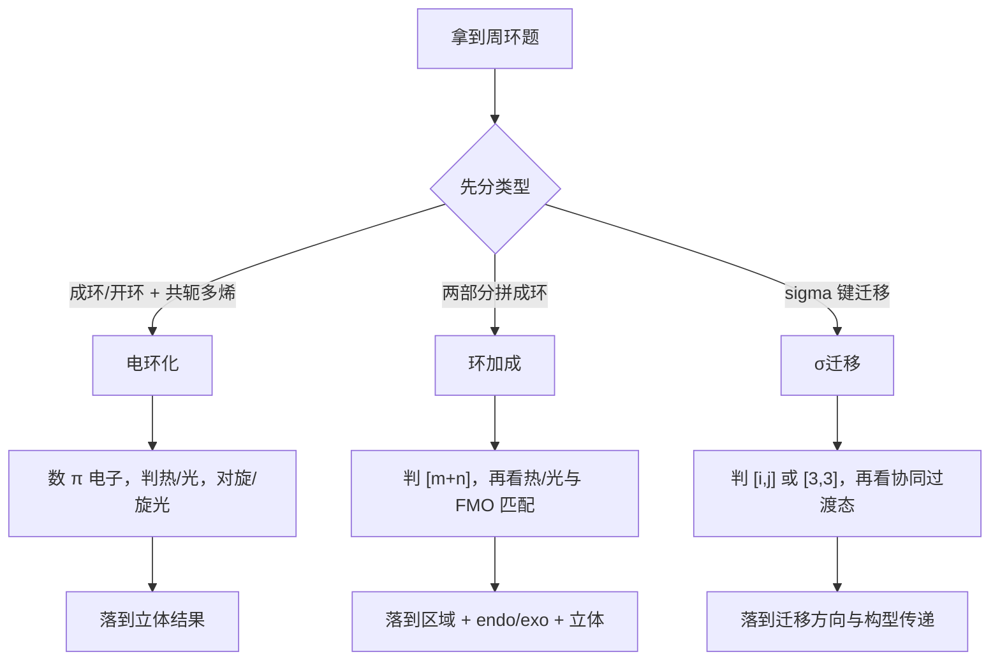

# 专题：周环反应

> 本专题对应考纲条目：[[49-周环反应]]
> 核心知识点：[[周环反应]]、[[电环化反应]]、[[Diels-Alder反应]]、[[2+2环加成]]、[[Claisen重排]]、[[Cope重排]]、[[前线轨道理论]]

---

## 零点五、网课桥梁回流接口 {#source-bridge}

- 默认调用顺序：
  1. [[07-资料提炼/教学逻辑提炼/Zchem 有机反应合成与机理/教学逻辑提炼-Zchem-周环反应与活性中间体-第三轮]]
  2. [[07-资料提炼/书籍提炼/提炼-Clayden-第34章-环加成反应]] + [[07-资料提炼/书籍提炼/提炼-Clayden-第35章-σ重排和电环化反应]]
  3. [[07-资料提炼/教学逻辑提炼/Zchem 有机反应合成与机理/教学逻辑提炼-Zchem-物理有机与机理判断-第四轮]]

## 一、专题定位：第三轮“无中间体协同机理”总入口 {#positioning}

- 如果说 [[专题-活性中间体与反应机理基础]] 解决的是“有中间体时怎么判断”，那本专题解决的就是“**没有独立中间体**时怎么判断”。
- 周环反应的核心不是再背一套人名反应，而是统一到“**轨道相位匹配 + 热/光条件 + 协同立体结果**”。
- 对照 [[第三轮总体备课框架]]，这里是有机主干里从离子/自由基语言过渡到协同机理语言的关键台阶。

**第三轮总判断句：**

```text
先分周环类型，
再数参与电子，
再判热/光允许性，
最后落到区域和立体结果。
```

**与前后专题的衔接：**

| 关联专题 | 本专题提供什么补充语言 |
|:---|:---|
| [[专题-有机结构基础与电子效应]] | 把 HOMO/LUMO 从局部反应升级到整体协同轨道匹配 |
| [[专题-立体化学与区域选择性]] | 解释为什么周环反应常直接决定立体结果 |
| [[专题-活性中间体与反应机理基础]] | 强调“周环反应通常没有可分离中间体” |
| [[专题-重排反应]] | 区分 Claisen/Cope 这类协同 [3,3]-σ 迁移与离子型重排 |

---

## 二、核心结论汇总 {#core-conclusions}

**必须记住：**

1. 周环反应通常是**协同单步**过程，不要硬找碳正离子、自由基之类中间体。
2. 判断起点不是“像哪个人名反应”，而是先分为 **电环化 / 环加成 / σ 迁移**。
3. Woodward-Hoffmann 规则的课堂可用版，本质上是在问：**轨道相位能不能连续同向重叠**。
4. 立体结果往往是机理直接给出的，不是反应后再额外修正。
5. Diels-Alder 的区域选择性、endo 规则、电环化的对旋/旋光、Claisen/Cope 的椅式过渡态，都是同一套协同轨道语言的不同表现。

---

## 二点五、课堂投影速查卡 {#classroom-quick-card}

**本页课堂入口：** 先提醒学生这不是“找中间体”的题，而是“看协同轨道怎么一起动”的题。

**先问四个问题：**

1. 这是电环化、环加成，还是 `σ` 迁移？
2. 一共有多少参与协同的 `π` 电子，条件是热还是光？
3. 要落的结果是允许/禁阻、endo/exo、对旋/旋光，还是迁移后的骨架？
4. 题目中的立体信息是底物先给定，还是由周环机理直接生成？

**一屏判断卡：**

- 先分类，再数电子，最后才套热/光规则。
- 周环题最怕把协同过程拆成离子或自由基分步机理。
- 立体化学不是附属结论，而是周环规则的直接输出。
- `Claisen/Cope` 要和普通重排分开讲，突出 `[3,3]` 协同迁移本质。

**讲后立刻练：**

- 先做一道电环化热/光对旋-旋光转换题。
- 再做一道 Diels-Alder 的区域与 endo 选择题，把轨道语言落到产物上。

---

## 二点七、Zchem 二次抽料：三类周环题的最短入口

| 题型 | 起手先问什么 | 高频落点 | 最容易错的地方 |
|:---|:---|:---|:---|
| 电环化 | 共轭链长度是多少，热还是光 | 对旋/旋光、开环/闭环立体结果 | 没先数电子，直接背结论 |
| 环加成 | 是 `[4+2]`、`[2+2]` 还是更广义 `[m+n]` | 允许性、区域选择性、endo/exo | 把 Diels-Alder 只当人名反应 |
| `σ` 迁移 | 是 `[3,3]` 主线还是边界型迁移 | 骨架重排、构型传递、椅式过渡态 | 把协同重排讲成离子重排 |
| 边界题 | 是否真的属于周环赛道 | 与自由基、离子、光化学串联题分流 | 赛道判错，后面全错 |

## 三、第三轮总流程 {#overall-route}



**课堂固定口令：**

1. 这是哪一类周环反应？
2. 一共在动多少电子？
3. 热条件还是光条件？
4. 最终的区域和立体结果是什么？

---

## 四、三大类周环反应对比表 {#comparison-table}

| 类型 | 识别信号 | 核心判断 | 高频考法 | 常见误判 |
|:---|:---|:---|:---|:---|
| 电环化 | 共轭多烯开/关环 | `4n` / `4n+2` 与热/光下对旋/旋光 | 立体化学预测 | 把旋转方向背反 |
| 环加成 | 两个 π 系统拼环 | `[m+n]` 是否允许，FMO 是否匹配 | Diels-Alder 区域与 endo | 只背 D-A，不会类推 |
| σ迁移 | σ 键在共轭体系内迁移 | 协同迁移、六元过渡态 | Claisen / Cope / [1,5]-H | 和离子型重排混淆 |

### 4.1 热/光与结果速记

| 场景 | 课堂可用判断句 |
|:---|:---|
| 电环化 | `4n` 热旋光、光对旋；`4n+2` 热对旋、光旋光 |
| Diels-Alder | 热 `[4+2]` 允许，常由 FMO 决定区域与 endo 倾向 |
| `[2+2]` 环加成 | 热同面-同面禁阻，光化学常允许 |
| `[3,3]-σ` 迁移 | 热条件下常允许，走六元协同过渡态 |

---

## 五、第三轮解题套路 / 决策流程 {#problem-solving-routine}

### Step 1：先给题目分型

- 看是多烯开关环、两部分成环，还是 σ 键迁移。
- 这一步比背人名更重要，因为它决定后续判断语言。

### Step 2：数电子并判热/光

- 电环化先数参与反应的 `π` 电子数。
- 环加成先识别 `[m+n]`，再看热/光允许性。
- σ 迁移先识别是否为 `[3,3]` 这类高频允许路径。

### Step 3：转到轨道 / 过渡态语言

- Diels-Alder：看 [[前线轨道理论]]，比较二烯 HOMO 与亲双烯体 LUMO。
- 电环化：看末端 p 轨道怎样连续闭合。
- Claisen / Cope：看六元椅式过渡态能否建立。

### Step 4：最后落到区域与立体结果

- 电环化：输出对旋/旋光带来的产物构型。
- Diels-Alder：输出区域选择性、endo/exo 倾向与立体保持关系。
- σ 迁移：输出迁移结果与构型传递，不要写成“先断后连”的多步机理。

**第三轮快筛清单：**

| 题目关键词 | 第一反应 | 第二反应 |
|:---|:---|:---|
| `热关环`、`光开环` | 先想电环化 | 再判 `4n / 4n+2` |
| `Diels-Alder`、`双烯合成` | 先想 `[4+2]` 环加成 | 再判区域/endo |
| `Claisen`、`Cope` | 先想 `[3,3]-σ` 迁移 | 再判椅式过渡态 |
| `2+2` | 先问热还是光 | 再判断是否允许 |

---

## 六、主干内容：第三轮最常考的四条线 {#main-branches}

### 6.1 电环化：立体化学最集中

- 电环化题的核心任务不是报名字，而是预测 **对旋 / 旋光**。
- 关键操作是：数电子、判热/光、再把末端取代基沿同向或反向转动。
- 这类题常直接连接 [[专题-立体化学与区域选择性]]。

### 6.2 Diels-Alder：区域和立体一题双考

- 热 `[4+2]` 是第三轮最重要的环加成模板。
- 先用 [[前线轨道理论]] 判断哪一端更匹配，再看 endo 规则和构型传递。
- 它是“电子效应 + FMO + 协同立体化学”三者合一的标准题型。

### 6.3 `[2+2]` 环加成：最适合对比热禁阻与光允许

- 第三轮里 `[2+2]` 更像一个规则校验器。
- 它最适合帮助学生把“热/光条件改变轨道占据”这件事建立直觉。
- 不需要过度展开复杂光化学，只需要会判断常见允许性。

### 6.4 Claisen / Cope：把“重排”纠正回协同迁移

- 这两类题容易被误认为是离子型重排，但本质上是协同 `[3,3]-σ` 迁移。
- 课堂要刻意对比 [[专题-重排反应]]，强调：
  - 离子型重排常谈中间体稳定性；
  - Claisen / Cope 更应谈六元过渡态与构型传递。

---

## 七、机制视角：周环反应和前面机理专题有什么不同 {#mechanism-analysis}

| 问题 | 离子/自由基专题口径 | 周环专题口径 |
|:---|:---|:---|
| 有没有独立中间体 | 常有，且很关键 | 通常没有，强调协同单步 |
| 主要判断对象 | 中间体稳定性、速控步 | 轨道相位匹配、热/光允许性 |
| 结果来源 | 中间体命运 + 条件竞争 | 过渡态几何 + 协同轨道重叠 |
| 典型错误 | 机理赛道选错 | 把协同过程硬写成多步箭头 |

**一句话概括：**

```text
周环反应题最常见的失误，
不是不会背规则，
而是还在用“中间体思维”做“协同反应题”。
```

---

## 八、典型例题串讲 {#typical-examples}

### 例题 1：电环化立体结果

**题目：** 预测一个 `6π` 共轭三烯在热关环条件下的立体结果。  
**思路：** 先判为电环化，再判断 `4n+2` 热条件下为对旋。  
**结论：** 由对旋决定末端取代基相对构型。  
**教学抓手：** 把“数电子 → 判热/光 → 判对旋/旋光”练成机械动作。

### 例题 2：Diels-Alder 区域选择性

**题目：** 富电子二烯与吸电子烯烃反应，哪个连接方式更优？  
**思路：** 比较二烯 HOMO 与亲双烯体 LUMO 的端位系数匹配。  
**结论：** 给出主区域异构体，并进一步讨论 endo 倾向。  
**教学抓手：** 让学生真正把 FMO 从专题 1 迁移到周环题。

### 例题 3：`[2+2]` 热/光允许性

**题目：** 判断某烯烃 `[2+2]` 反应在热条件下是否允许。  
**思路：** 先识别为 `[2+2]` 环加成，再回到 Woodward-Hoffmann 规则。  
**结论：** 常见同面-同面热禁阻，光条件下可允许。  
**教学抓手：** 用最少理论建立“热/光会翻转规则”的直觉。

### 例题 4：Claisen 与离子重排区分

**题目：** 为什么 Claisen 重排不该画成先断键后形成烯丙基碳正离子？  
**思路：** 它是协同 `[3,3]-σ` 迁移，核心在六元过渡态。  
**结论：** 应画协同电子推动，而不是离子型多步机理。  
**教学抓手：** 把专题 7 和专题 9 的边界讲清。

---

## 九、常见误区与纠偏 {#pitfalls}

1. 把周环反应硬套进“有中间体”的机理框架。
2. 电环化只背顺口溜，不会真的数 `π` 电子。
3. Diels-Alder 只背 endo，不会判断区域选择性来源。
4. 把 Claisen / Cope 当成普通离子型重排。
5. 把 `[2+2]` 的热禁阻、光允许记反。

---

## 十、与第三轮备课框架的直接对应 {#framework-link}

| [[第三轮总体备课框架]] 提示项 | 本专题落实方式 |
|:---|:---|
| Woodward-Hoffmann 规则 | 作为总规则贯穿三大类周环反应 |
| 电环化反应 | 用 `4n / 4n+2` 与热/光讲清对旋/旋光 |
| `[4+2]` Diels-Alder | 作为区域 + 立体 + FMO 的核心样板 |
| `[2+2]` 环加成 | 用来讲热禁阻/光允许 |
| σ 迁移 | 用 Claisen / Cope 区分协同迁移与离子重排 |

---

## 十一、关联知识点 {#related-kp}

- [[周环反应]]
- [[电环化反应]]
- [[Diels-Alder反应]]
- [[2+2环加成]]
- [[Claisen重排]]
- [[Cope重排]]
- [[前线轨道理论]]

## 十二、关联题型 {#related-problem-types}

- [[题型-机理推断]]
- [[题型-区域选择性判断]]
- [[题型-立体化学判断]]
- [[题型-重排路径判断]]

## 十三、相关真题 {#related-exam-questions}

```dataview
TABLE file.name AS "文件名", year AS "年份", type AS "题型", difficulty AS "难度"
FROM "05-真题库"
WHERE contains(knowledge_points, "周环反应")
   OR contains(knowledge_points, "Diels-Alder反应")
   OR contains(knowledge_points, "电环化反应")
SORT year DESC, difficulty ASC
```

### 真题使用建议

- 周环反应真题最常见的失分不是不会背规则，而是"还在用中间体思维做协同反应题"——课堂讲评必须对比 [[专题-重排反应]] 的离子型重排，强调 Claisen/Cope 是协同 [3,3]-σ 迁移而非离子机理。
- 先用 [[真题-有机-DielsAlder-001]] 讲 [4+2] 环加成的区域选择性、endo 规则和构型传递——这是第三轮周环反应最高频的单一模板，也是 FMO 理论最直接的落脚点。
- 电环化题暂缺独立真题，当前可配合本页 §八 例题 1 和例题 3 做热/光对旋-旋光转换训练，重点练"数 π 电子 → 判 4n/4n+2 → 套对旋/旋光"的机械动作。
- [2+2] 环加成题最适合作为"规则校验器"——让学生判断热条件下是否允许，建立"热/光条件改变轨道占据"的直觉。

### 推荐真题

| 真题 | 核心考点 | 难度 |
|:---|:---|:---:|
| [[真题-有机-DielsAlder-001]] | Diels-Alder [4+2] 环加成——1,3-丁二烯与乙烯的立体选择性与协同机理 | ⭐⭐⭐ |

### 真题链与讲评顺序

- `第 1 题`：[[真题-有机-DielsAlder-001]]——Diels-Alder 反应模板识别与区域选择性。课堂用途：热启动，用最经典的 [4+2] 模板建立周环反应的第一语言——"先分类型，再数电子，再看热/光"。
- `第 2 题`：电环化热/光对旋-旋光转换题（6π 三烯关环或 4π 二烯开环）。课堂用途：主讲题，训练"数 π 电子 → 判 4n/4n+2 → 套对旋/旋光 → 落立体结果"的完整机械动作——这是周环反应中立体化学最集中的题型。
- `第 3 题`：[2+2] 环加成或 Claisen/Cope σ 迁移综合辨析题。课堂用途：收束题，验证学生能否区分"协同 [2+2]（热禁阻/光允许）"与"离子型重排"——把周环反应的边界讲清。
- 课堂顺序建议：`Diels-Alder（模板建立）→ 电环化（立体化学深化）→ [2+2]/σ迁移（边界辨析）`，先建核心模板，再用立体化学加深，最后用边界题收口。

> 💡 **与备课大纲/速查卡的衔接**：这些真题已映射到对应备课大纲 §2.6 的认知台阶和速查卡 §十 的配套练习——周环反应的讲评重点是"先分类型不要先找中间体"，教师可在三处交叉参考排题。

---

> 📎 相关提炼：[[07-资料提炼/书籍提炼/提炼-ABOC-第7章-周环反应]] · [[07-资料提炼/书籍提炼/提炼-Clayden-第34章-环加成反应]]
