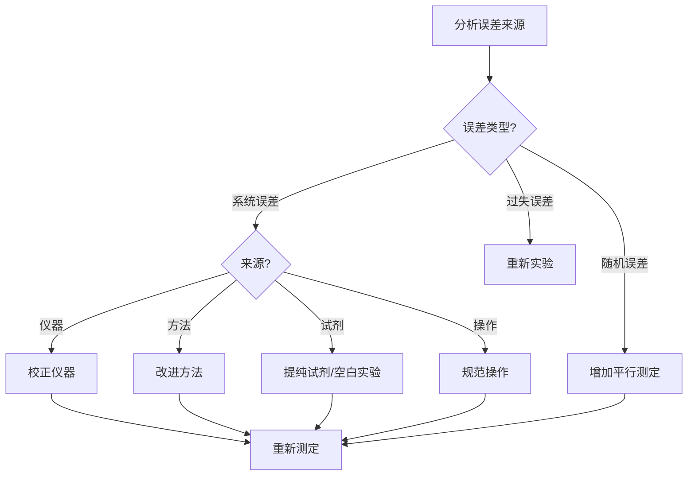
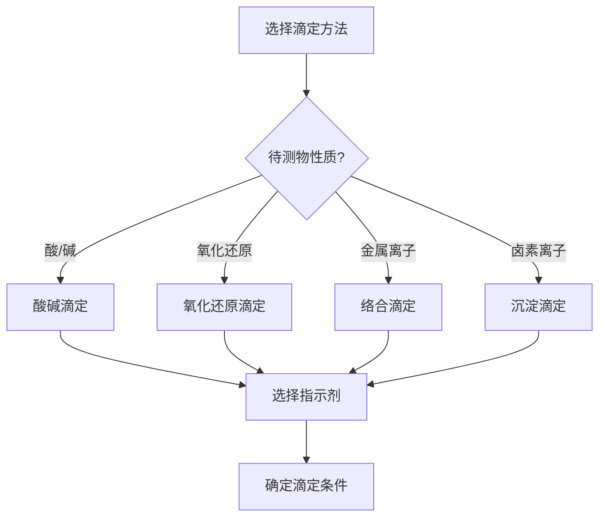

# 定量分析基础

> **定位**：定量分析是分析化学的核心内容，涵盖误差、数据处理、滴定、重量分析。本专题为"讲义抽料台"，可直接复制各板块到学生讲义。

---

## 一、核心结论

### 1.1 误差分类（来源：误差分析与数据处理KP §二）

| 误差类型 | 定义 | 特征 | 消除方法 |
|:---|:---|:---|:---|
| 系统误差 | 可测定误差，有规律 | 重复性、单向性 | 校正、对照、空白 |
| 随机误差 | 不可测定误差，无规律 | 波动性、对称性 | 增加平行测定次数 |
| 过失误差 | 错误操作引起 | 无规律 | 重新实验 |

### 1.2 数据处理（来源：定量分析(核心结论)§二）

**平均值**：x̄ = Σxᵢ/n

**标准偏差**：s = √[Σ(xᵢ - x̄)²/(n-1)]

**相对标准偏差**：RSD = s/x̄ × 100%

**置信区间**：μ = x̄ ± t·s/√n

### 1.3 滴定分析原理（来源：滴定分析原理KP §二）

**滴定终点判断**：
- 指示剂变色
- 仪器检测（电位、光度）

**滴定误差**：TE = (V终 - V当量)/V当量 × 100%

### 1.4 重量分析基础（来源：重量分析基础KP §二）

**沉淀形式**：待测组分转化为沉淀

**称量形式**：沉淀经过滤、洗涤、烘干/灼烧后称量

**换算因数**：F = 待测组分摩尔质量/称量形式摩尔质量

---

## 二、决策路径

### 误差判断流程



### 滴定分析选择



---

## 三、对比表格

### 表1：滴定分析方法对比（来源：滴定分析原理KP §三）

| 方法 | 原理 | 指示剂 | 应用 |
|:---|:---|:---|:---|
| 酸碱滴定 | H⁺ + OH⁻ → H₂O | 酚酞/甲基橙 | 酸/碱含量 |
| 氧化还原滴定 | 电子转移 | 自身/外指示剂 | 氧化剂/还原剂 |
| 络合滴定 | 配位反应 | 金属指示剂 | 金属离子 |
| 沉淀滴定 | 生成沉淀 | 吸附指示剂 | 卤素离子 |

### 表2：常见指示剂变色范围

| 指示剂 | 变色范围 | 颜色变化 | 应用 |
|:---|:---:|:---|:---|
| 甲基橙 | 3.1~4.4 | 红→黄 | 强酸强碱 |
| 甲基红 | 4.4~6.2 | 红→黄 | 弱酸强碱 |
| 酚酞 | 8.0~10.0 | 无色→红 | 强碱滴定酸 |

### 表3：误差传递公式

| 运算 | 相对误差传递 |
|:---|:---|
| 加减法 | Δ(x+y) = √(Δx² + Δy²) |
| 乘除法 | Δ(x×y)/xy = √[(Δx/x)² + (Δy/y)²] |
| 指数 | Δ(xⁿ)/xⁿ = n·Δx/x |
| 对数 | Δ(ln x) = Δx/x |

### 表4：有效数字运算规则

| 运算 | 规则 | 示例 |
|:---|:---|:---|
| 乘除法 | 结果位数与位数最少者相同 | 0.0234 × 4.56 = 0.107 |
| 加减法 | 结果位数与小数位数最少者相同 | 12.34 + 0.1 = 12.4 |
| 对数 | 小数部分位数与真数有效数字位数相同 | lg(2.0×10⁻⁵) = -4.70 |

---

## 四、典型例题

### 例1：误差计算（来源：误差分析与数据处理KP §五 典型例题1）

某样品5次测定结果：20.01%, 20.04%, 20.02%, 20.05%, 20.03%。计算平均值、标准偏差和相对标准偏差。

**解答**：
- 平均值：x̄ = (20.01+20.04+20.02+20.05+20.03)/5 = **20.03%**
- 标准偏差：s = √[(0.02²+0.01²+0.01²+0.02²+0.00²)/4] = **0.016%**
- 相对标准偏差：RSD = 0.016/20.03 × 100% = **0.080%**

### 例2：滴定误差（来源：题库 无对应题库）

用0.1000 mol/L NaOH滴定20.00 mL 0.1000 mol/L HCl，计算滴定误差。

**解答**：
- 当量点：V终 = 20.00 mL
- 若多加0.02 mL（1滴）：TE = 0.02/20.00 × 100% = **0.10%**
- 结果偏高0.10%

### 例3：置信区间（来源：误差分析与数据处理KP §五 典型例题3）

某样品3次测定：98.5%, 98.7%, 98.6%。计算95%置信度下的置信区间。

**解答**：
- 平均值：x̄ = 98.6%
- 标准偏差：s = 0.1%
- t值（n=3, 95%）= 4.303
- 置信区间：μ = 98.6 ± 4.303 × 0.1/√3 = **98.6 ± 0.25%**

### 例4：重量分析计算（来源：题库 无对应题库）

用BaSO₄重量法测定钡，称取样品0.5000 g，得BaSO₄沉淀0.4620 g。计算钡的含量。

**解答**：
- BaSO₄摩尔质量 = 233.4 g/mol，Ba摩尔质量 = 137.3 g/mol
- 换算因数：F = 137.3/233.4 = 0.5882
- 钡含量 = 0.4620 × 0.5882 / 0.5000 × 100% = **54.31%**

---

## 五、易错点预警

### 易错1：有效数字位数判断（来源：误差分析与数据处理KP §四）

- 有效数字从第一个非零数字开始算起
- 0.00234有3位有效数字，0.0234有3位，2.34×10⁻³有3位
- **陷阱**：小数点后的零不是有效数字（如0.10有2位）

### 易错2：标准偏差的自由度

- 标准偏差公式中分母是n-1（自由度），不是n
- **陷阱**：n次测定只能得到n-1个独立偏差

### 易错3：指示剂选择原则

- 指示剂变色范围必须**全部落在**滴定突跃范围内
- **陷阱**：不能因为指示剂在变色范围内就认为合适

### 易错4：空白实验的意义

- 空白实验可以消除**试剂和器皿**引入的系统误差
- 不能消除**操作误差**
- **陷阱**：空白值需要从测定值中扣除

### 易错5：滴定度的概念

- 滴定度T = m/V（单位质量待测物所需滴定剂体积）
- 或T = c × M/1000（mol/L × g/mol）
- **陷阱**：滴定度有不同定义，要看清题目要求

### 易错6：重量分析的沉淀损失

- 沉淀不完全是主要误差来源
- 需要检查沉淀是否完全（加沉淀剂后静置，再加沉淀剂检查）
- **陷阱**：不能假设沉淀100%完全

### 易错7：相对误差与绝对误差

- 绝对误差 = 测量值 - 真值
- 相对误差 = 绝对误差/真值 × 100%
- **陷阱**：比较不同量级的测量精度时必须用相对误差

---

## 六、竞赛深化

### 6.1 最小二乘法（来源：误差分析与数据处理KP §六）

- 线性回归：y = a + bx
- 斜率b = Σ[(xᵢ-x̄)(yᵢ-ȳ)] / Σ[(xᵢ-x̄)²]
- 相关系数r = Σ[(xᵢ-x̄)(yᵢ-ȳ)] / √[Σ(xᵢ-x̄)²·Σ(yᵢ-ȳ)²]

### 6.2 标准加入法

- 用于消除基体效应
- 向样品中加入已知量标准，测定信号变化
- **应用**：原子吸收光谱、电化学分析

### 6.3 质量控制图

- 以测定值为纵坐标，测定次序为横坐标
- 中心线：平均值
- 警告限：±2s
- 控制限：±3s
- **应用**：监控分析过程的稳定性

---

## 七、知识链接

**前置知识**
- [[物质的量与气体计算]] → 浓度计算
- [[化学计量]] → 反应比例

**后续知识**
- [[酸碱滴定]] → 酸碱滴定详解
- [[络合滴定]] → EDTA滴定
- [[氧化还原滴定]] → 氧化还原滴定详解

**相关专题**
- [[专题-容量分析基础与酸碱滴定]]（滴定分析详解）
- [[专题-络合滴定与重量分析]]（络合滴定与重量分析详解）
- [[专题-氧化还原滴定与沉淀滴定]]（氧化还原滴定详解）

---

## 八、题库索引

```dataview
TABLE difficulty AS "难度", tags AS "标签"
FROM "04-题库/分析化学"
SORT file.name ASC
```
