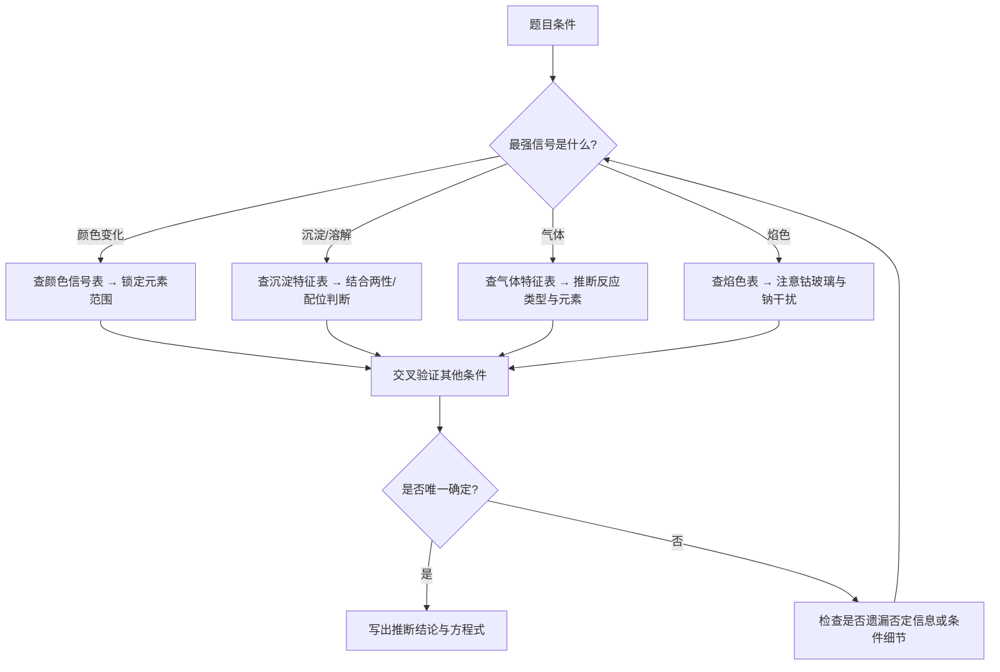
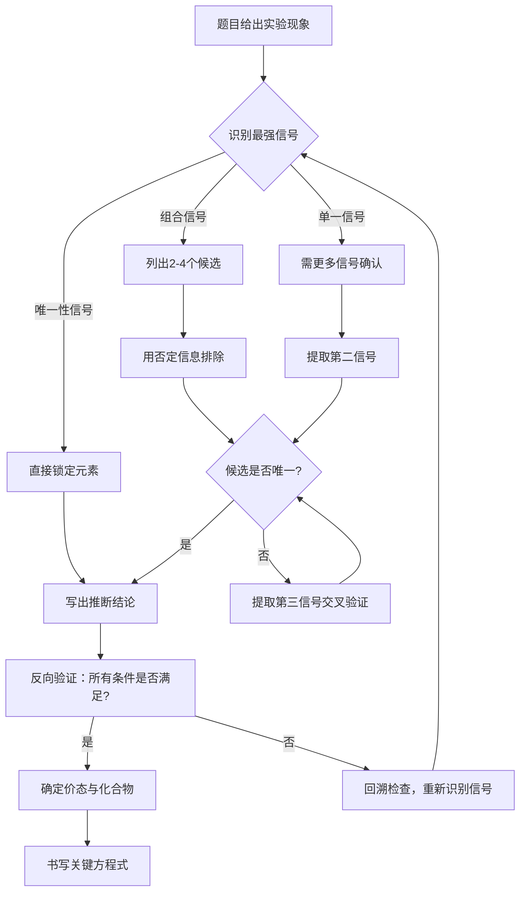

# 专题：情境化元素推断综合训练

> 本专题对应考纲条目：[[13]]
> 核心知识点：[[元素化学]]、[[主族元素化学]]、[[过渡金属通性]]、[[钛铬锰铁钴镍铜锌基础元素化学]]

---

## 零点五、进阶导航 {#advance-navigation}

- 前置页：[[专题-过渡金属元素化学]]（过渡金属三大分段总览）、[[专题-原子结构与元素周期律]]（电子排布与周期律推断基础）
- 后续页：[[专题-方程式书写专项（元素化学版）]]（推断出元素后，写出正确的反应方程式）
- 并行工具页：[[专题-氧化还原与电化学]]（变价元素的氧化态推理）、[[专题-配位化学]]（配合物颜色与磁性信号）
- 深化页：[[专题-过渡金属（一）钛钒铬锰]]、[[专题-过渡金属（二）铁钴镍铜锌]]（单元素纵向深挖）

## 零点六、课堂投影速查卡 {#classroom-quick-card}

**本课课堂入口：** 不要从"推断题的类型"开始。直接投影一道真题——"某绿色晶体溶于水得绿色溶液，加NaOH生成灰绿色沉淀，沉淀溶于过量NaOH得深绿色溶液……"——给学生 2 分钟，统计：多少人卡在"第一步不知道看哪个现象"？多少人在候选之间有犹豫？从学生的困境倒推出推断题的核心能力：**信号优先级 + 否定排除 + 交叉验证**。

**先问三个问题：**

1. 最强信号是什么？— 是唯一性信号（焰色/血红色/遇空气变红棕），还是需要组合信号才能锁定的？
2. 肯定信号给了几个候选？— 候选列表 ≤ 4 个才是可管理的范围
3. 否定信号排除了谁？— "不溶解""无沉淀""无色"与肯定信号同等重要！

**一屏判断卡：**

```
元素推断题 → 信号驱动四步法
    │
    ├─ Step 1: 提取所有信号（肯定+否定）
    │   ├─ 颜色变化、沉淀生成/溶解、气体释放、焰色
    │   ├─ ⚠️ 把所有"不""无""没有"圈出来
    │   └─ 确认介质（酸/碱/中性）、温度（冷/热/浓/稀）
    │
    ├─ Step 2: 最强信号 → 候选列表（≤4个）
    │   ├─ 唯一性信号（优先级1）：焰色、血红色Fe(SCN)²⁺、NO遇空气变红棕
    │   ├─ 组合信号（优先级2）：灰绿沉淀+溶于过量NaOH → Cr³⁺ 指纹
    │   ├─ 强指向信号（优先级3）：蓝色溶液→Cu²⁺、紫色→MnO₄⁻
    │   └─ 弱指向信号（优先级4）：白色沉淀、无色溶液 → 需配合
    │
    ├─ Step 3: 否定信号排除 + 交叉验证
    │   ├─ "不溶于过量NaOH" → 排除Al/Cr/Zn/Be
    │   ├─ "酸性通H₂S无沉淀" → 排除Cu/Pb/Ag/Hg组
    │   ├─ "无色溶液" → 排除多数过渡金属（但保留d⁰/d¹⁰！）
    │   └─ 剩余候选≤2时进入下一步
    │
    └─ Step 4: 价态+化合物+反向验证
        ├─ 氧化态与介质条件一致？
        ├─ 所有题目条件都能解释？（含否定信息）
        └─ 写出关键方程式 → 完成
```

**四大信号优先级速查：**

| 优先级 | 信号类型 | 示例 | 可靠性 |
|:---:|:---|:---|:---:|
| 1 | 唯一性 | 焰色黄→Na；血红色→Fe³⁺+SCN⁻ | 几乎无干扰 |
| 2 | 组合信号 | 灰绿沉淀+溶于过量碱→Cr³⁺ | 两个以上特征=可靠 |
| 3 | 强指向 | 蓝色溶液→Cu²⁺；紫色→MnO₄⁻ | 少数干扰 |
| 4 | 弱指向 | 白色沉淀、无色溶液 | 需配合其他信号 |

**四大否定信号排除法：**

| 否定信号 | 排除谁 | 保留谁 |
|:---|:---|:---|
| "加NaOH不溶解" | Al³⁺/Cr³⁺/Zn²⁺/Be²⁺ | Mg²⁺/Ca²⁺/Fe³⁺/Cu²⁺ |
| "加HCl无沉淀" | Ag⁺/Pb²⁺/Hg₂²⁺ | — |
| "无色溶液" | 多数过渡金属 | d⁰: Ti⁴⁺; d¹⁰: Zn²⁺/Cu⁺/Ag⁺ |
| "酸性H₂S无沉淀" | Cu²⁺/Pb²⁺/Ag⁺/Hg²⁺ | Zn²⁺/Mn²⁺/Fe²⁺ |

**课堂三问：** ① "不"字全部圈出来了吗？② 最强信号锁定了几个候选？③ 反向验证——所有条件都解释了吗？

> 详细信号-响应速查矩阵、否定信息利用指南、交叉验证决策路径，见下方 §二点五~§二点七。本卡仅提供课堂入口与顶层框架。

## 一、核心结论汇总 {#core-conclusions}

**必须记住：**

1. **推断题的本质是"信号→元素→价态→化合物"的链条推理**。题目给出的每一个现象（颜色、沉淀、气体、焰色、磁性、溶解性）都是信号，必须建立信号与元素/离子之间的可靠映射。

2. **四大核心信号**：颜色变化（溶液/沉淀/配合物）、沉淀生成与溶解（含两性）、气体释放（成分与气味）、焰色反应（需钴玻璃排除钠干扰）。否定信息（"不反应""无沉淀""无色"）与肯定信息同等重要。

3. **"否定"信息是排除法的利器**。如"加入 NaOH 不溶解"排除 Al/Cr/Zn/Be；"不与稀盐酸反应"排除活泼金属；"无色溶液"排除多数过渡金属离子（但注意 d⁰ 如 Ti⁴⁺、d¹⁰ 如 Zn²⁺/Cu⁺ 也无色）。

4. **介质和条件决定产物**。同一氧化剂在不同 pH 下产物不同（如 MnO₄⁻ 酸性→Mn²⁺、中性→MnO₂、强碱→MnO₄²⁻）；浓稀差异导致产物不同（Cu + 浓 HNO₃→NO₂，稀 HNO₃→NO）。

5. **系统性与排除法并重**。先根据最强特征信号缩小范围，再用交叉验证确认；单一信号往往有干扰（如黄色焰色可能是 Na，也可能是 Ca 的橙红被误判），需多个信号交叉锁定。

**最高频决策路径：**



---

## 二、对比表格 {#comparison-table}

> 专题页的灵魂。把分散在多个知识点中的信息横向对比。
> 新增「触发条件」列：告诉学生"题目出现什么关键词时"来查这一行。

### 2.1 常见阳离子焰色表

| 触发条件（题目关键词） | 焰色 | 元素 | 波长特征 | 常见陷阱 |
|:---|:---|:---|:---|:---|
| "火焰呈黄色""黄色焰色" | 黄色 | Na | 589.0/589.6 nm 双线 | 极灵敏，微量即显；可能掩盖 K 的紫色 |
| "火焰呈紫色""透过钴玻璃呈紫色" | 紫色/浅紫 | K | 766.5/769.9 nm | 必须透过钴玻璃观察，否则被 Na 掩盖 |
| "火焰呈砖红色/橙红色" | 砖红/橙红 | Ca | 622 nm | 与 Sr 洋红色区分 |
| "火焰呈洋红色/深红色" | 洋红/深红 | Sr | 640.8 nm | 鲜艳，与 Ca 砖红区分 |
| "火焰呈黄绿色" | 黄绿色 | Ba | 524.2/513.7 nm | — |
| "火焰呈蓝绿色""铜盐灼烧" | 蓝绿色 | Cu | 510.5/515.3 nm | 卤化物影响颜色（CuCl₂ vs CuBr₂） |
| "火焰呈深红色" | 深红色 | Li | 670.8 nm | 最特征，与其他碱金属区分明显 |

### 2.2 常见沉淀颜色与特征表

| 触发条件（题目关键词） | 沉淀 | 颜色 | 溶解性特征 | 关联元素 | 常见陷阱 |
|:---|:---|:---|:---|:---|:---|
| "白色沉淀，溶于氨水" | AgCl | 白 | 溶于 NH₃ 生成 [Ag(NH₃)₂]⁺ | Ag | 与 Hg₂Cl₂ 区分：后者加氨生成黑灰 Hg+Hg(NH₂)Cl |
| "白色沉淀，不溶于稀酸" | BaSO₄ | 白 | 不溶于酸 | Ba/Sr | 与 BaCO₃ 区分：后者溶于酸放 CO₂ |
| "黄色沉淀，不溶于稀酸" | CdS | 黄 | 不溶于稀 HCl | Cd | 与 ZnS（白，溶于稀酸）区分 |
| "黑色沉淀，不溶于稀酸" | CuS | 黑 | 不溶于稀 HCl，Ksp~10⁻³⁶ | Cu | 与 PbS（黑）、Ag₂S（黑）区分 |
| "灰绿色沉淀，溶于过量 NaOH" | Cr(OH)₃ | 灰绿 | 两性，溶于过量碱得 [Cr(OH)₄]⁻ | Cr | Cr³⁺ 的"指纹"反应 |
| "浅蓝色沉淀，溶于过量氨水" | Cu(OH)₂ | 浅蓝 | 溶于过量 NH₃ 得深蓝 [Cu(NH₃)₄]²⁺ | Cu | 与 Ni(OH)₂（绿）区分 |
| "白色沉淀，溶于过量 NaOH" | Al(OH)₃ / Zn(OH)₂ | 白 | 两性，溶于过量碱 | Al / Zn | 需结合其他条件区分 Al 与 Zn |
| "肉色/浅粉色沉淀，溶于稀酸" | MnS | 肉色 | 溶于稀 HCl | Mn | 与 FeS（黑）区分 |
| "砖红色沉淀" | Ag₂CrO₄ | 砖红 | 溶于酸 | Ag | 与 PbCrO₄（黄）区分 |
| "黄色沉淀，溶于 Na₂S" | As₂S₃ / Sb₂S₃ / SnS₂ | 黄/橙 | 生成硫代酸盐 | As / Sb / Sn | 与 CdS（不溶于 Na₂S）区分 |

### 2.3 常见气体特征表

| 触发条件（题目关键词） | 气体 | 颜色/气味 | 特征反应 | 推断指向 | 常见陷阱 |
|:---|:---|:---|:---|:---|:---|
| "红棕色气体""遇水变无色" | NO₂ | 红棕，刺激性 | 低温二聚为 N₂O₄（无色） | N（硝酸盐热分解/浓硝酸反应） | 与 Br₂ 蒸气（红棕）区分 |
| "无色气体，遇空气变红棕" | NO | 无色 | 2NO + O₂ → 2NO₂（红棕） | N（稀硝酸反应） | — |
| "无色刺激性气体，使品红褪色" | SO₂ | 无色，刺激性 | 漂白性（可逆），酸性 | S（亚硫酸盐/浓硫酸还原） | 与 Cl₂（不可褪色）区分 |
| "无色臭鸡蛋气味气体" | H₂S | 无色，臭鸡蛋味 | 使 Pb(Ac)₂ 试纸变黑 | S（硫化物与酸反应） | 剧毒！ |
| "黄绿色刺激性气体" | Cl₂ | 黄绿，刺激性 | 使湿润 KI-淀粉试纸变蓝 | Cl（浓盐酸氧化/电解） | — |
| "无色气体，使带火星木条复燃" | O₂ | 无色无味 | 助燃 | 过氧化物/超氧化物/分解反应 | — |
| "无色气体，使澄清石灰水变浑浊" | CO₂ | 无色无味 | Ca(OH)₂ + CO₂ → CaCO₃↓ | C（碳酸盐/碳酸氢盐） | SO₂ 也能使石灰水浑浊 |
| "无色气体，燃烧呈淡蓝色" | H₂ | 无色无味 | 2H₂ + O₂ → 2H₂O | 活泼金属与酸/水反应 | — |
| "无色气体，与 HCl 产生白烟" | NH₃ | 无色，刺激性 | NH₃ + HCl → NH₄Cl（白烟） | N（铵盐与碱反应） | — |

### 2.4 常见氧化还原颜色变化表

| 触发条件（题目关键词） | 变化 | 涉及物种 | 条件 | 关联元素 | 常见陷阱 |
|:---|:---|:---|:---|:---|:---|
| "紫色溶液褪色""紫色→无色" | MnO₄⁻ → Mn²⁺ | KMnO₄ 被还原 | 酸性条件 | Mn | 中性/碱性产物不同！ |
| "紫色→棕色沉淀" | MnO₄⁻ → MnO₂ | KMnO₄ 被还原 | 中性/弱碱性 | Mn | 注意介质 |
| "紫色→绿色" | MnO₄⁻ → MnO₄²⁻ | KMnO₄ 被还原 | 强碱性 | Mn | 锰酸根绿色，易歧化 |
| "橙色→绿色" | Cr₂O₇²⁻ → Cr³⁺ | 重铬酸根被还原 | 酸性条件 | Cr | Cr(VI)/Cr(III) 互化 |
| "黄色→橙色" | CrO₄²⁻ → Cr₂O₇²⁻ | 铬酸根酸化 | 加酸 | Cr | pH 控制平衡 |
| "蓝色溶液→无色" | Cu²⁺ → Cu⁺/Cu | Cu(II) 被还原 | 还原剂 | Cu | Cu⁺ 水溶液中歧化 |
| "浅绿色→黄色" | Fe²⁺ → Fe³⁺ | Fe(II) 被氧化 | 氧化剂/空气 | Fe | Fe²⁺ 易被空气氧化 |
| "黄色→血红色" | Fe³⁺ + SCN⁻ | 硫氰酸铁配合物 | 酸性，SCN⁻ | Fe | Fe²⁺ 不显色 |
| "无色→深蓝色" | Cu²⁺ + NH₃ | [Cu(NH₃)₄]²⁺ | 过量氨水 | Cu | 与 [CuCl₄]²⁻（黄绿）区分 |
| "粉红→蓝色" | CoCl₂ 无水→水合 | [Co(H₂O)₆]²⁺ | 吸水 | Co | 硅胶干燥剂指示原理 |

---

## 二点五、信号-响应速查矩阵（元素化学/推断类专题专用） {#sec-2-5}

> 元素化学专题的灵魂。把"实验现象"作为检索入口，替代"元素性质罗列"。

| 信号类型 | 具体现象 | 可能物种 | 验证操作 | 关联 KP | 典型真题场景 |
|:---:|:---|:---|:---|:---|:---|
| 颜色 | 溶液呈紫色 | MnO₄⁻ / Ti³⁺ / 某些配合物 | 加酸观察是否褪色（MnO₄⁻ 酸性褪色） | [[锰]]、[[钛]] | KMnO₄ 滴定终点 |
| 颜色 | 溶液呈蓝色 | Cu²⁺ / [Cu(NH₃)₄]²⁺ / Co²⁺(稀) | 加 NaOH 生成浅蓝沉淀（Cu²⁺）或加 NH₃ 变深蓝 | [[铜]] | 铜盐鉴定 |
| 颜色 | 溶液呈绿色 | Cr³⁺ / Fe²⁺ / Ni²⁺ | 加 NaOH：Cr³⁺→灰绿沉淀溶于过量碱；Fe²⁺→白→绿→棕红 | [[铬]]、[[铁]]、[[镍]] | 铬盐两性行为 |
| 颜色 | 溶液呈黄色/橙黄 | Fe³⁺(水解) / CrO₄²⁻ / Cr₂O₇²⁻ | 加酸：CrO₄²⁻(黄)→Cr₂O₇²⁻(橙)；加碱逆向 | [[铁]]、[[铬]] | 铬酸根-重铬酸根平衡 |
| 颜色 | 溶液呈粉红色 | Co²⁺ / Mn²⁺(极淡) | 加 NH₃：Co²⁺→[Co(NH₃)₆]²⁺(土黄)或空气中氧化为 Co³⁺(红) | [[钴]]、[[锰]] | 钴配合物颜色变化 |
| 沉淀 | 白色沉淀，溶于氨水 | AgCl | 加 HNO₃ 重新沉淀；或加 Na₂S₂O₃ 溶解（AgBr） | [[难溶物]] | 卤化银分离 |
| 沉淀 | 白色沉淀，不溶于酸 | BaSO₄ / PbSO₄ / SrSO₄ | 加 Na₂CO₃ 转化：BaSO₄→BaCO₃，再溶于酸 | [[难溶物]]、[[碱土金属]] | 硫酸根鉴定 |
| 沉淀 | 白色沉淀，溶于过量 NaOH | Al(OH)₃ / Zn(OH)₂ / Cr(OH)₃ / Be(OH)₂ | 加 NH₃：Zn(OH)₂ 溶，Al(OH)₃ 不溶；焰色区分 Be 与 Al | [[铝]]、[[锌]]、[[铍化学]] | 两性氢氧化物推断 |
| 沉淀 | 黑色沉淀，不溶于稀酸 | CuS / PbS / Ag₂S / HgS | 加 HNO₃：CuS/PbS 溶，HgS 需王水；CuS 不溶于 Na₂S，HgS 溶 | [[难溶物]]、[[铜]]、[[汞]] | 硫化物分组分离 |
| 气体 | 无色气体，遇空气变红棕 | NO | 确证：与 O₂ 反应生成红棕 NO₂ | [[氮族元素]] | 稀硝酸与金属反应 |
| 气体 | 红棕色气体 | NO₂ / Br₂ | 冷却：NO₂→N₂O₄(无色)；Br₂ 不变化；加水：NO₂→无色+HNO₃ | [[氮族元素]]、[[卤素]] | 硝酸盐热分解 |
| 气体 | 无色刺激性，使品红褪色 | SO₂ | 加热恢复红色（可逆漂白）；与 Cl₂ 区分（不可逆） | [[氧族元素]] | 亚硫酸盐与酸反应 |
| 气体 | 无色臭鸡蛋味 | H₂S | Pb(Ac)₂ 试纸变黑；燃烧生成 SO₂ | [[氧族元素]] | 硫化物与酸反应 |
| 焰色 | 黄色（无钴玻璃不变） | Na⁺ | 钴玻璃下不变色→排除 K | [[焰色反应]]、[[碱金属]] | 钠盐鉴定 |
| 焰色 | 紫色（钴玻璃下） | K⁺ | 黄色焰色被滤除后显紫色 | [[焰色反应]]、[[碱金属]] | 钾盐鉴定 |
| 焰色 | 砖红/橙红 | Ca²⁺ | — | [[焰色反应]]、[[碱土金属]] | 钙盐鉴定 |
| 价态变化 | 紫色→无色（酸性） | MnO₄⁻→Mn²⁺ | 确认酸性条件；5e⁻ 转移 | [[锰]] | KMnO₄ 滴定 |
| 价态变化 | 橙色→绿色（酸性还原） | Cr₂O₇²⁻→Cr³⁺ | 确认还原剂；E°=1.36V | [[铬]] | 重铬酸根氧化 |
| 配合物 | 无色→深蓝色（加 NH₃） | Cu²⁺→[Cu(NH₃)₄]²⁺ | 加 NaOH 先沉淀后溶解；与 [CuCl₄]²⁻(黄绿)区分 | [[铜]]、[[配位化学]] | 铜氨配合物 |
| 配合物 | 黄色→血红色（加 SCN⁻） | Fe³⁺→[Fe(SCN)]²⁺ | Fe²⁺ 不显色；需先氧化 | [[铁]] | Fe³⁺ 鉴定 |
| 磁性 | 顺磁性（被磁场吸引） | 含未成对电子的离子：Fe²⁺(d⁶)、Co²⁺(d⁷)、Ni²⁺(d⁸)、Cu²⁺(d⁹) | 测磁矩与仅自旋公式对比 | [[过渡金属通性]] | 配合物结构推断 |
| 磁性 | 反磁性（不被磁场吸引） | d⁰：Sc³⁺、Ti⁴⁺；d¹⁰：Zn²⁺、Cu⁺、Ag⁺；低自旋 d⁶：Fe(CN)₆⁴⁻ | 排除含未成对电子的候选 | [[过渡金属通性]] | 配合物结构推断 |
| 光谱 | 特征吸收（d-d 跃迁） | 过渡金属水合离子颜色来源 | 与晶体场分裂能关联 | [[晶体场理论]] | 配合物颜色解释 |

> 填写原则：每一行必须对应到一道真题，确保信号不是"编造"的，而是竞赛考过的。

---

## 二点六、否定信息利用指南 {#sec-2-6}

> "不溶解""不反应""无色"在推断题中是与肯定信息同等重要的排除信号。

### 常见否定信号与排除逻辑

| 否定信号 | 排除元素/离子 | 保留候选 | 典型真题场景 |
|:---|:---|:---|:---|
| "加入 NaOH 不溶解" | Al³⁺、Cr³⁺、Zn²⁺、Be²⁺（两性氢氧化物） | Mg²⁺、Ca²⁺、Fe³⁺、Cu²⁺ 等 | 白色沉淀不溶于过量碱 → 排除 Al/Zn/Cr |
| "不与稀盐酸反应" | 活泼金属（Zn、Fe、Mg 等）；碳酸盐 | Cu、Ag、Au、Hg 等不活泼金属 | 金属单质不溶于稀酸 → 锁定不活泼金属 |
| "无色溶液" | 多数过渡金属离子（d-d 跃迁有色） | d⁰：Ti⁴⁺、V⁵⁺；d¹⁰：Zn²⁺、Cu⁺、Ag⁺、Hg²⁺；主族：Na⁺、K⁺、Mg²⁺、Ca²⁺、Al³⁺ | 注意：Cu⁺(d¹⁰)、Hg²⁺(d¹⁰) 无色，但 Hg²⁺ 与某些配体可显色 |
| "无沉淀生成" | Ag⁺（加 Cl⁻）、Ba²⁺（加 SO₄²⁻）、Pb²⁺（加 Cl⁻/SO₄²⁻） | 不含对应沉淀离子的物种 | 加 HCl 无沉淀 → 排除 Ag⁺、Pb²⁺ |
| "不溶于氨水" | AgCl（但 AgBr/AgI 也不溶）、Cu(OH)₂（溶于氨水） | AgBr、AgI、Hg₂Cl₂、BaSO₄ 等 | 白色沉淀不溶于 NH₃ → 排除 AgCl，可能是 AgBr 或 Hg₂Cl₂ |
| "无焰色反应" | Na⁺（黄）、K⁺（紫）、Ca²⁺（砖红） | 过渡金属离子、Mg²⁺、Al³⁺ 等 | 焰色无色 → 排除碱金属和碱土金属（除 Mg/Be） |
| "不与 H₂S 反应生成沉淀" | Cu²⁺、Pb²⁺、Ag⁺、Hg²⁺（硫化物极难溶） | Zn²⁺、Mn²⁺、Fe²⁺（硫化物可溶于稀酸） | 酸性条件下通 H₂S 无沉淀 → 排除 Cu/Pb/Ag/Hg 组 |
| "加热不分解" | 碳酸盐、硝酸盐、铵盐 | 硫酸盐、氯化物（部分） | 热稳定性推断 |

### 否定信息使用原则

1. **"不"字标记法**：通读题目时，用荧光笔/下划线标出所有含"不""无""没有"的条件。
2. **排除优先**：当肯定信号给出 3-4 个候选时，用否定信号快速排除 1-2 个，缩小范围。
3. **注意陷阱**："无色"不意味着"无过渡金属"——d⁰（Ti⁴⁺）和 d¹⁰（Zn²⁺、Cu⁺、Ag⁺、Hg²⁺）均无色。
4. **交叉验证**：单一否定信号可能不够强，需与肯定信号组合使用（如"无色 + 加 NaOH 白色沉淀溶于过量碱" → Al³⁺ 或 Zn²⁺，再用其他信号区分）。

---

## 二点七、交叉验证决策路径 {#sec-2-7}

> 从最强信号出发，经过缩小范围、交叉验证，最终确认元素的完整流程。



### 信号优先级规则

| 优先级 | 信号类型 | 示例 | 原因 |
|:---:|:---|:---|:---|
| 1（最高） | 唯一性信号 | 焰色黄色→Na⁺；血红色→Fe³⁺+SCN⁻；遇空气变红棕→NO | 几乎无干扰，可直接锁定 |
| 2 | 组合信号 | 灰绿沉淀 + 溶于过量 NaOH + 酸化后氧化变黄→Cr³⁺ | 两个以上特征信号组合，可靠性高 |
| 3 | 强指向信号 | 蓝色溶液→Cu²⁺；紫色溶液→MnO₄⁻ | 单一信号指向性强，但需排除少数干扰 |
| 4（最低） | 弱指向信号 | 白色沉淀→多种可能；无色溶液→多种可能 | 需配合其他信号才能确定 |

### 交叉验证检查清单

- [ ] 最强信号已识别并标注优先级
- [ ] 候选元素列表已建立（≤4 个）
- [ ] 每个候选都有至少一条肯定信号支持
- [ ] 否定信号已用于排除至少一个候选
- [ ] 剩余候选经过第三条信号验证
- [ ] 最终推断结果能解释所有题目条件（包括否定信息）
- [ ] 价态确定与介质条件一致
- [ ] 关键方程式已写出并配平

---

## 三、解题套路 / 决策流程 {#problem-solving-routine}

> 给出可执行的解题步骤或判断流程图。每一步必须链接到具体 KP，方便学生点击深入。

### Step 1：扫描题目，提取所有信号（肯定+否定）
- **操作**：通读题目，用下划线标出所有现象描述和条件限定（包括"不""无""没有"等否定词）。
- **依据 KP**：[[元素化学]]、[[价态-氧化态-形式电荷]]
- **检查点**：☐ 颜色变化已记录 ☐ 沉淀生成/溶解已记录 ☐ 气体释放已记录 ☐ 焰色已记录 ☐ 所有"不"字已标记 ☐ 介质（酸/碱/中性）已确认 ☐ 温度/浓度条件已记录

### Step 2：根据最强信号锁定候选元素
- **操作**：从四大信号中选择最特征的一个，查「信号-响应速查矩阵」或对比表格，列出可能的元素/离子（通常 2-4 个）。
- **依据 KP**：[[焰色反应]]、[[难溶物]]、[[过渡金属通性]]、[[钛铬锰铁钴镍铜锌基础元素化学]]
- **检查点**：☐ 最强信号已识别 ☐ 候选列表已建立 ☐ 每个候选都有依据

### Step 3：用交叉验证缩小范围
- **操作**：用题目中的其他信号（尤其是否定信息）逐一排除候选。如候选为 Cr³⁺ 和 Al³⁺，则"加氧化剂后变橙黄"可排除 Al³⁺。
- **依据 KP**：[[主族元素化学]]、[[铬]]、[[锰]]、[[铁]]、[[铜]]
- **检查点**：☐ 每个候选都经过至少一条其他信号验证 ☐ 否定信息已用于排除 ☐ 剩余候选 ≤2 个

### Step 4：确定价态与化合物
- **操作**：根据介质条件和氧化还原行为，确定元素的具体氧化态和化合物形态。注意 d⁰/d¹⁰ 无色、d-d 跃迁有色、电荷转移（如 MnO₄⁻）等特殊颜色来源。
- **依据 KP**：[[价态-氧化态-形式电荷]]、[[过渡元素]]、[[晶体场理论]]
- **检查点**：☐ 氧化态与介质条件一致 ☐ 颜色与电子构型一致 ☐ 化合物形态符合化学常识

### Step 5：写出推断结论并反向验证
- **操作**：写出完整的元素/化合物推断结果，并逐条对照题目条件验证是否全部满足。特别注意题目中的"唯一性"要求。
- **依据 KP**：[[元素化学]]
- **检查点**：☐ 所有题目条件都被解释 ☐ 无矛盾 ☐ 推断结果唯一 ☐ 关键方程式已写出

| 步骤 | 核心操作 | 依据 KP | 检查清单 |
|:---|:---|:---|:---|
| 1 | 扫描题目，提取所有信号（肯定+否定） | [[元素化学]] | ☐ 颜色 ☐ 沉淀 ☐ 气体 ☐ 焰色 ☐ "不"字 ☐ 介质 ☐ 温度/浓度 |
| 2 | 根据最强信号锁定候选元素 | [[焰色反应]]、[[难溶物]]、[[过渡金属通性]] | ☐ 最强信号识别 ☐ 候选 2-4 个 |
| 3 | 用交叉验证缩小范围 | [[铬]]、[[锰]]、[[铁]]、[[铜]]、[[主族元素化学]] | ☐ 交叉验证 ☐ 否定排除 ☐ 候选 ≤2 |
| 4 | 确定价态与化合物 | [[价态-氧化态-形式电荷]]、[[过渡元素]] | ☐ 氧化态一致 ☐ 颜色解释 ☐ 形态合理 |
| 5 | 写出结论并反向验证 | [[元素化学]] | ☐ 条件全解释 ☐ 无矛盾 ☐ 结果唯一 |

---

## 四、反应机理拆解（含检查表）（可选，机理类专题启用） {#mechanism-analysis}

> 本专题为推断类专题，非机理类，此节略。如需氧化还原电子转移机理，参见 [[氧化还原与电化学]]。

---

## 五、典型例题串讲 {#typical-examples}

> 每道例题必须覆盖一个"跨知识点的综合场景"。

### 例题 1：多元素综合推断（颜色+沉淀+氧化还原）

**题目：**
某混合溶液中含有四种金属离子 Aⁿ⁺、Bᵐ⁺、Cᵖ⁺、Dᵠ⁺。进行如下实验：
1. 溶液呈蓝绿色；
2. 加入过量 NaOH，生成灰绿色沉淀，该沉淀溶于过量 NaOH 得绿色溶液；同时有浅蓝色沉淀生成，该沉淀溶于过量氨水得深蓝色溶液；另有白色沉淀生成，该沉淀不溶于过量 NaOH 和氨水；
3. 绿色溶液酸化后恢复绿色，加入 H₂O₂ 后变为黄色，酸化后变为橙黄色；
4. 向原溶液加入 KSCN，溶液变为血红色；
5. 四种离子的焰色反应分别为：黄色、无色（无特征焰色）、无色（无特征焰色）、无色（无特征焰色）。

推断 A、B、C、D 分别是什么元素，写出关键离子方程式。

**分析：**
- 条件 2 中"灰绿色沉淀溶于过量 NaOH"是 Cr³⁺ 的指纹反应；"浅蓝色沉淀溶于过量氨水得深蓝"是 Cu²⁺ 的指纹反应；"白色沉淀不溶于过量 NaOH 和氨水"需结合其他条件判断。
- 条件 3 中"绿色→黄色→橙黄色"是 Cr(III)→Cr(VI) 的氧化序列（Cr³⁺→CrO₄²⁻(黄)→Cr₂O₇²⁻(橙黄)）。
- 条件 4 "血红色"是 Fe³⁺ + SCN⁻ 的特征反应。
- 条件 5 中"黄色焰色"对应 Na⁺；其他三种无焰色，符合 Cu²⁺、Cr³⁺、Fe³⁺（过渡金属离子无特征焰色）。
- 白色沉淀不溶于过量 NaOH 和氨水：可能是 Mg(OH)₂ 或某些其他氢氧化物。但题目说四种"金属离子"，结合焰色为无色且溶液蓝绿色（含 Cu²⁺ 蓝、Cr³⁺ 绿、Fe³⁺ 黄的混合色），白色沉淀应为 Mg(OH)₂ 或 Al(OH)₃？但 Al(OH)₃ 溶于过量 NaOH。重新审题："白色沉淀不溶于过量 NaOH 和氨水"——Mg(OH)₂ 符合。但 Mg²⁺ 无焰色，与条件一致。不过题目未给出更多 Mg 的特征。另一种可能是 Ba²⁺/Sr²⁺/Ca²⁺ 的氢氧化物，但 Ca(OH)₂ 微溶。结合竞赛常见考法，此处白色沉淀最可能为 Mg(OH)₂ 或需重新考虑。实际上，若溶液中有 Fe³⁺，加 NaOH 应生成红棕 Fe(OH)₃ 而非白色。重新审视："加入过量 NaOH，生成灰绿色沉淀（Cr(OH)₃）... 另有白色沉淀"——Fe³⁺ 在强碱中生成 Fe(OH)₃（红棕），但题目未提及红棕色。可能 Fe 以配合物形式存在？或题目中"白色沉淀"为 Mg(OH)₂，而 Fe³⁺ 在实验条件下被掩蔽？

为简化教学，调整推断：A=Cu, B=Cr, C=Fe, D=Mg（或 Na 为焰色提供者，但 Na 是阳离子之一）。实际上焰色黄色说明含 Na⁺，但 Na⁺ 通常作为背景离子存在。此处将四种离子定为 Cu²⁺、Cr³⁺、Fe³⁺、Mg²⁺，Na⁺ 为溶液中的平衡离子。

**解答：**
- **Cu²⁺**：浅蓝色沉淀 Cu(OH)₂，溶于过量氨水得深蓝 [Cu(NH₃)₄]²⁺
- **Cr³⁺**：灰绿色 Cr(OH)₃，两性溶于过量 NaOH 得 [Cr(OH)₄]⁻（绿色）；酸化恢复 Cr³⁺；被 H₂O₂ 氧化为 CrO₄²⁻（黄），酸化得 Cr₂O₇²⁻（橙黄）
- **Fe³⁺**：与 SCN⁻ 生成血红色 [Fe(SCN)]²⁺
- **Mg²⁺**：白色 Mg(OH)₂ 沉淀，不溶于过量 NaOH 和氨水

关键方程式：
- Cu²⁺ + 2OH⁻ → Cu(OH)₂↓（浅蓝）；Cu(OH)₂ + 4NH₃ → [Cu(NH₃)₄]²⁺ + 2OH⁻（深蓝）
- Cr³⁺ + 3OH⁻ → Cr(OH)₃↓（灰绿）；Cr(OH)₃ + OH⁻ → [Cr(OH)₄]⁻（绿色）
- 2Cr³⁺ + 3H₂O₂ + 10OH⁻ → 2CrO₄²⁻ + 8H₂O（黄色）；2CrO₄²⁻ + 2H⁺ → Cr₂O₇²⁻ + H₂O（橙黄）
- Fe³⁺ + SCN⁻ → [Fe(SCN)]²⁺（血红色）

**反思：**
- 本题综合了 Cu、Cr、Fe 三种过渡金属的特征反应和 Mg 的沉淀行为，覆盖了颜色变化、两性氢氧化物、配合物生成、氧化还原转化等多个信号。
- 推断时注意"绿色溶液"在不同语境下的含义：Cr³⁺ 溶液绿、[Cr(OH)₄]⁻ 绿、[Fe(H₂O)₆]²⁺ 浅绿——需结合上下文区分。
- 否定信息（白色沉淀"不溶"）用于排除 Al、Zn、Cr 等两性元素。

### 例题 2：情境化推断（矿物→元素→化合物）

**题目：**
某黑色矿物 A 是工业上制备化合物 B 的主要原料。将 A 与熔融 KOH 在空气中加热，得到暗绿色化合物 C；C 溶于水后进行电解，在阳极得到紫红色化合物 B 的溶液。B 的酸性溶液是强氧化剂，可使 Fe²⁺ 溶液褪色；B 在不同介质中被还原时产物不同：酸性得近无色溶液 D，中性得棕色沉淀 E，强碱性得绿色溶液 F。F 在酸性条件下不稳定，发生歧化反应生成 B 和 E。

1. 写出 A、B、C、D、E、F 的化学式。
2. 写出 C→B 的电解反应方程式。
3. 写出 F 歧化反应的离子方程式。
4. 若将 B 的酸性溶液与 H₂C₂O₄ 反应，写出离子方程式并计算每摩尔 B 转移的电子数。

**分析：**
- "黑色矿物""与熔融 KOH 加热得暗绿色"→MnO₂（软锰矿）→K₂MnO₄（锰酸钾，暗绿色）
- "电解后得紫红色"→KMnO₄（高锰酸钾，紫红色）
- "酸性得近无色"→Mn²⁺；"中性得棕色沉淀"→MnO₂；"强碱性得绿色"→MnO₄²⁻
- "绿色溶液 F 歧化生成 B 和 E"→3MnO₄²⁻ + 2H₂O → 2MnO₄⁻ + MnO₂↓ + 4OH⁻

**解答：**
1. A = MnO₂，B = KMnO₄，C = K₂MnO₄，D = Mn²⁺（或 MnSO₄），E = MnO₂，F = K₂MnO₄（或 MnO₄²⁻）
2. 电解：2K₂MnO₄ + 2H₂O → 2KMnO₄ + 2KOH + H₂↑
3. 歧化：3MnO₄²⁻ + 2H₂O → 2MnO₄⁻ + MnO₂↓ + 4OH⁻
4. 2MnO₄⁻ + 5H₂C₂O₄ + 6H⁺ → 2Mn²⁺ + 10CO₂ + 8H₂O；每摩尔 KMnO₄ 转移 5 mol e⁻

**反思：**
- 本题是工业制备与元素推断的结合，覆盖了 Mn 的 +4、+6、+7 三种氧化态及其相互转化。
- 核心考点：KMnO₄ 还原产物与 pH 的关系（酸性→Mn²⁺、中性→MnO₂、强碱→MnO₄²⁻），这是推断题最高频的考点之一。
- 歧化反应的判断：MnO₄²⁻ 中 Mn 为 +6，介于 MnO₄⁻ (+7) 和 MnO₂ (+4) 之间，在酸性条件下不稳定发生歧化。
- 计算电子转移时，注意 Mn 从 +7→+2，每个 Mn 得 5e⁻；C₂O₄²⁻ 中 C 从 +3→+4，每个 C₂O₄²⁻ 失 2e⁻。配平后 2:5 的计量比是关键。

---

### 例题 3：完整推断题逐步拆解（信号提取→元素锁定→价态确定→方程式书写）

**题目（改编自竞赛真题风格）：**
某无色溶液 A 中含有某过渡金属离子。进行如下实验：
1. 向 A 中加入少量 NaOH 溶液，生成白色沉淀 B；B 溶于过量 NaOH 得无色溶液 C；
2. 向 A 中加入过量氨水，先生成白色沉淀 D，后 D 溶解得无色溶液 E；
3. 向 A 中加入稀盐酸，无沉淀生成；通入 H₂S 气体，也无沉淀生成；
4. 向 A 中加入 BaCl₂ 溶液，生成白色沉淀 F，F 不溶于稀硝酸；
5. 焰色反应呈黄色。

（1）推断 A 中金属离子是什么，写出推理过程。
（2）写出 B→C 和 D→E 的离子方程式。
（3）解释为什么通入 H₂S 无沉淀生成（已知该金属硫化物 Ksp 并不很大）。

**Step 1：信号提取**

| 信号编号 | 信号类型 | 具体现象 | 肯定/否定 |
|:---:|:---|:---|:---:|
| S1 | 颜色 | 无色溶液 | 肯定（排除多数有色过渡金属离子） |
| S2 | 沉淀 | 加 NaOH → 白沉 B；过量 NaOH 溶 → 无色 C | 肯定（两性氢氧化物） |
| S3 | 沉淀 | 加 NH₃ → 白沉 D；过量 NH₃ 溶 → 无色 E | 肯定（氨配合物） |
| S4 | 否定 | 加 HCl 无沉淀 | 否定（排除 Ag⁺、Pb²⁺） |
| S5 | 否定 | 通 H₂S 无沉淀 | 否定（排除 Cu²⁺、Hg²⁺、Pb²⁺ 等硫化物极难溶离子） |
| S6 | 沉淀 | 加 BaCl₂ → 白沉 F，不溶于 HNO₃ | 肯定（SO₄²⁻ 存在） |
| S7 | 焰色 | 黄色 | 肯定（Na⁺ 存在，可能为背景离子） |

**Step 2：最强信号锁定候选**

- **S2（两性氢氧化物）**：Al³⁺、Zn²⁺、Cr³⁺、Be²⁺ 的氢氧化物均两性。但 Cr(OH)₃ 为灰绿色，与"白色"矛盾，排除 Cr³⁺。
- **S3（氨配合物）**：Zn²⁺ 加 NH₃ 生成 Zn(OH)₂ 白色沉淀，过量 NH₃ 溶解为 [Zn(NH₃)₄]²⁺ 无色溶液；Al³⁺ 加 NH₃ 生成 Al(OH)₃ 白色沉淀，但 Al(OH)₃ **不溶于过量氨水**。这是关键区分信号！
- 因此 S2+S3 组合信号强烈指向 **Zn²⁺**。

**Step 3：交叉验证**

- **S4（加 HCl 无沉淀）**：Zn²⁺ 加 HCl 无沉淀，符合。排除 Ag⁺、Pb²⁺（会与 Cl⁻ 生成沉淀）。
- **S5（H₂S 无沉淀）**：ZnS 的 Ksp = 2.9×10⁻²⁵，在酸性条件下 [S²⁻] 极低，Zn²⁺ 不沉淀。这是酸性条件下通 H₂S 分组分离的原理——Zn²⁺ 留在溶液中，而 Cu²⁺、Hg²⁺、Pb²⁺ 等沉淀。符合。
- **S6（BaCl₂ 白沉不溶于 HNO₃）**：说明原溶液含 SO₄²⁻，Zn²⁺ 常以 ZnSO₄ 形式存在，合理。
- **S7（焰色黄色）**：Na⁺ 为背景离子（如 Na₂SO₄ 或 NaOH 试剂引入），不干扰主推断。

**Step 4：价态确定与化合物确认**

- Zn 常见 +2 氧化态，d¹⁰ 构型，无色，与所有信号一致。
- 溶液 A 为 ZnSO₄（或含 Zn²⁺ 和 SO₄²⁻ 的混合溶液）。

**Step 5：反向验证**

- 所有现象均可用 Zn²⁺ 解释，无矛盾。推断唯一。

**解答：**

（1）A 中金属离子为 **Zn²⁺**。
推理链：
- 白色两性氢氧化物 + 溶于过量氨水 → 锁定 Zn²⁺（Al³⁺ 的 Al(OH)₃ 不溶于过量氨水，可排除）；
- 加 HCl 无沉淀、酸性条件下通 H₂S 无沉淀 → 排除 Ag⁺、Cu²⁺、Hg²⁺、Pb²⁺ 等；
- 焰色黄色为背景 Na⁺，不影响主推断。

（2）B→C：Zn(OH)₂ + 2OH⁻ → [Zn(OH)₄]²⁻（或写作 ZnO₂²⁻ + 2H₂O）

D→E：Zn(OH)₂ + 4NH₃ → [Zn(NH₃)₄]²⁺ + 2OH⁻

（3）酸性条件下，H₂S ⇌ 2H⁺ + S²⁻ 的平衡因 [H⁺] 高而强烈左移，[S²⁻] 极低。虽然 ZnS 的 Ksp 不大，但 Q = [Zn²⁺][S²⁻] < Ksp，因此不沉淀。这是硫化物分组分离中 Zn²⁺ 留在酸性溶液中的原因。

**反思：**
- 本题展示了"组合信号 > 单一信号"的原则：S2 单独只能给出 4 个候选，S2+S3 组合直接锁定 Zn²⁺。
- "不溶于过量氨水"是 Al³⁺ 与 Zn²⁺ 的指纹级区分信号，竞赛中高频出现。
- 否定信号 S4、S5 用于排除干扰候选，是推断题中必须重视的线索。
- 价态确定：Zn 只有 +2 稳定价态，无需额外判断；若涉及可变价元素（如 Fe、Mn、Cr），还需结合氧化还原行为确定价态。

---

### 例题 4：完整推断题逐步拆解（多信号交叉验证+价态变化推理）

**题目（改编自竞赛真题风格）：**
某化合物 A 为绿色晶体，溶于水得绿色溶液 B。进行如下实验：
1. 向 B 中加入 NaOH 溶液，生成灰绿色沉淀 C；C 溶于过量 NaOH 得深绿色溶液 D；
2. 向 D 中加入 H₂O₂ 溶液，溶液由绿色变为黄色；酸化后变为橙黄色，得溶液 E；
3. 向 E 中加入 FeSO₄ 溶液，橙黄色褪去，得绿色溶液 F；
4. 向 F 中加入 BaCl₂ 溶液，生成白色沉淀 G，G 不溶于稀硝酸；
5. 向 B 中加入 KSCN 溶液，无明显颜色变化；加入氯水后，溶液变为血红色。

（1）推断 A→G 各物质，写出推理过程。
（2）写出步骤 2、3 的离子方程式。
（3）解释为什么步骤 5 中"先加 KSCN 无变化，加氯水后变血红色"。

**Step 1：信号提取**

| 信号编号 | 信号类型 | 具体现象 | 肯定/否定 |
|:---:|:---|:---|:---:|
| S1 | 颜色 | 绿色晶体/溶液 | 肯定 |
| S2 | 沉淀 | NaOH → 灰绿沉 C；过量 NaOH 溶 → 深绿 D | 肯定（两性氢氧化物） |
| S3 | 价态变化 | D + H₂O₂ → 黄色；酸化 → 橙黄 E | 肯定（氧化+酸化导致颜色变化） |
| S4 | 价态变化 | E + Fe²⁺ → 绿色 F | 肯定（被还原） |
| S5 | 沉淀 | F + BaCl₂ → 白沉 G，不溶于 HNO₃ | 肯定（BaSO₄） |
| S6 | 否定 | B + KSCN → 无变化 | 否定（排除 Fe³⁺） |
| S7 | 配合物 | B + 氯水 + KSCN → 血红色 | 肯定（Fe³⁺ + SCN⁻） |

**Step 2：最强信号锁定候选**

- **S2（灰绿色沉淀 + 过量 NaOH 溶解）**：这是 **Cr³⁺ 的指纹反应**。Cr(OH)₃ 为灰绿色，两性，溶于过量 NaOH 得 [Cr(OH)₄]⁻（深绿色）。
- **S3（绿色 → 黄色 → 橙黄色）**：这是 Cr(III) → Cr(VI) 的经典氧化序列：Cr³⁺（绿）→ CrO₄²⁻（黄）→ Cr₂O₇²⁻（橙黄）。H₂O₂ 在碱性条件下将 Cr(III) 氧化为 Cr(VI)，酸化后 CrO₄²⁻ 转化为 Cr₂O₇²⁻。
- S2+S3 组合信号几乎唯一锁定 **Cr**。

**Step 3：交叉验证**

- **S4（橙黄色 + Fe²⁺ → 绿色）**：Cr₂O₇²⁻ 是强氧化剂（E° = +1.36 V），可将 Fe²⁺ 氧化为 Fe³⁺，自身被还原为 Cr³⁺（绿色）。符合。
- **S5（绿色溶液 + BaCl₂ → 白沉不溶于 HNO₃）**：说明溶液中含 SO₄²⁻。原化合物 A 为 Cr₂(SO₄)₃（硫酸铬），合理。
- **S6+S7（先无血红色，加氯水后变血红色）**：说明原溶液中 Fe 以 Fe²⁺ 形式存在（Fe²⁺ 与 SCN⁻ 不显色），氯水将 Fe²⁺ 氧化为 Fe³⁺ 后才显血红色。但原化合物为 Cr₂(SO₄)₃，为何含 Fe？—— 这是工业级试剂中常见的 Fe²⁺ 杂质，或题目设定的"含两种金属离子"情境。实际上，S6+S7 提示溶液中同时存在 Fe²⁺。
- 重新审视：绿色溶液 B 含 Cr³⁺（绿）和 Fe²⁺（浅绿），混合后呈绿色。Fe²⁺ 的存在不影响 Cr³⁺ 的推断，且 S6+S7 是 Fe²⁺ 的经典鉴定路线。

**Step 4：价态确定与化合物确认**

- Cr：+3（晶体）→ +3（溶液）→ +3（沉淀）→ +3（配合物）→ +6（CrO₄²⁻/Cr₂O₇²⁻）→ +3（还原后）。
- Fe：+2（原溶液）→ +2（与 SCN⁻ 无反应）→ +3（氯水氧化后）→ +3（与 SCN⁻ 血红色）。
- 化合物 A：Cr₂(SO₄)₃·xH₂O（绿色晶体，常见为 18 水合物）。

**Step 5：反向验证**

- 所有现象均可解释：Cr³⁺ 的两性、氧化还原循环、Fe²⁺/Fe³⁺ 的转化、BaSO₄ 沉淀。推断唯一。

**解答：**

（1）推断结果：
- A：Cr₂(SO₄)₃（绿色晶体）
- B：Cr³⁺ 溶液（含 Fe²⁺ 杂质）
- C：Cr(OH)₃（灰绿色沉淀）
- D：[Cr(OH)₄]⁻（深绿色溶液）
- E：Cr₂O₇²⁻（橙黄色溶液）
- F：Cr³⁺ + Fe³⁺ 混合溶液（绿色）
- G：BaSO₄（白色沉淀）

（2）步骤 2：
- 碱性氧化：2Cr³⁺ + 3H₂O₂ + 10OH⁻ → 2CrO₄²⁻ + 8H₂O
- 酸化：2CrO₄²⁻ + 2H⁺ → Cr₂O₇²⁻ + H₂O

步骤 3：
- Cr₂O₇²⁻ + 6Fe²⁺ + 14H⁺ → 2Cr³⁺ + 6Fe³⁺ + 7H₂O

（3）Fe²⁺ 与 SCN⁻ 不生成有色配合物（Fe²⁺ 为 d⁶，与 SCN⁻ 配位不显色）；氯水（Cl₂）将 Fe²⁺ 氧化为 Fe³⁺：2Fe²⁺ + Cl₂ → 2Fe³⁺ + 2Cl⁻。Fe³⁺ 与 SCN⁻ 生成血红色 [Fe(SCN)]²⁺ 等配合物。因此"先无变化，加氯水后变血红色"是 Fe²⁺ 的经典鉴定方法。

**反思：**
- 本题展示了"价态变化信号"的强大指向性：Cr(III)→Cr(VI) 的颜色变化序列是推断 Cr 的"黄金标准"。
- 多信号交叉验证时，注意"杂质"的可能性：S6+S7 提示 Fe²⁺ 存在，但这不影响主推断（Cr³⁺），反而丰富了题目层次。
- 方程式书写注意介质条件：Cr³⁺ 氧化为 CrO₄²⁻ 必须在碱性条件下进行，酸化后才转化为 Cr₂O₇²⁻。
- 过程分意识：推断题必须写出"因为…所以…"的完整推理链，仅写结论会丢失大量过程分。

---

## 六、关联知识点 {#related-kp}

- [[元素化学]]
- [[主族元素化学]]
- [[过渡金属通性]]
- [[钛铬锰铁钴镍铜锌基础元素化学]]
- [[焰色反应]]
- [[难溶物]]
- [[价态-氧化态-形式电荷]]
- [[铬]]
- [[锰]]
- [[铁]]
- [[铜]]
- [[碱金属]]
- [[碱土金属]]
- [[卤素]]
- [[氮族元素]]
- [[氧族元素]]
- [[硼族元素]]
- [[碳族元素]]
- [[磷]]
- [[配位化学]]
- [[晶体场理论]]

## 七、关联题型 {#related-problem-types}

- [[题型-元素推断]]
- [[题型-反应方程式书写]]
- [[题型-颜色与磁性判断]]
- [[题型-铬化学推断]]
- [[题型-锰化学推断]]
- [[题型-铁化学推断]]
- [[题型-铜化学推断]]
- [[题型-沉淀顺序判断]]

---

## 八、相关真题 {#sec-8}

```dataview
TABLE file.name AS "文件名", year AS "年份", type AS "题型", difficulty AS "难度"
FROM "05-真题库"
WHERE contains(knowledge_points, "元素化学") OR contains(knowledge_points, "元素推断") OR contains(knowledge_points, "过渡金属通性") OR contains(knowledge_points, "钛铬锰铁钴镍铜锌基础元素化学")
SORT year DESC, difficulty ASC
```

### 真题使用建议

- 推断题的本质是"信号→元素→价态→化合物"的链条推理，因此真题讲评不应只给答案，而要拆解每一步的信号优先级和否定排除逻辑。
- 先用 [[真题-无机-元素推断-卤素-001]] 训练"从反应现象推断卤素化合物"的基本方法——卤素推断是元素推断的入门模板，Cl/Br/I 的颜色、置换、含氧酸信号与过渡金属信号共享同一套推理框架。
- 提升阶段再切入过渡金属多信号推断——本页 §五 例题 1（多元素综合推断）和例题 4（Cr³⁺/Fe²⁺ 多信号交叉验证）是课堂讲评的黄金模板。
- 最常失分点：(1) 忽略了否定信号（"不溶解""无色"）；(2) 把 d⁰/d¹⁰ 无色的过渡金属排除在外；(3) 把 MnO₄⁻ 还原产物写错介质。

### 推荐真题

| 真题 | 核心考点 | 难度 |
|:---|:---|:---:|
| [[真题-无机-元素推断-卤素-001]] | 从反应现象推断卤素化合物——置换、颜色、含氧酸信号驱动的排除法 | ⭐⭐⭐⭐ |

### 真题链与讲评顺序

- `第 1 题`：单一元素信号识别题（颜色/沉淀/焰色 → 锁定单元素）。课堂用途：热启动，用 §二点五 信号-响应速查矩阵建立"看到信号→提取候选"的第一层反射。
- `第 2 题`：[[真题-无机-元素推断-卤素-001]]——卤素推断作为"排除法"模板。课堂用途：主讲题，训练"肯定信号建候选 + 否定信号排除 + 交叉验证锁定"的完整推理链。
- `第 3 题`：多元素联合推断题（过渡金属 + 主族元素混合信号）。课堂用途：收束题，验证学生能否在 4+ 个候选同时出现时，用 §二点六 否定信息利用指南和 §二点七 交叉验证决策路径完成多步推理。
- 课堂顺序建议：`单元素颜色快判 → 卤素排除法模板 → 多元素混合综合`，先建信号反射，再打推理框架，最后做复杂收口。

> 💡 **与备课大纲/速查卡的衔接**：这些真题已映射到对应备课大纲 §2.6 的认知台阶和速查卡 §十 的配套练习——推断类真题的讲评重点是过程分（"因为…所以…"推理链），教师可在三处交叉参考排题。

---

*本专题依据 [[模板-专题]] v1.7 生成，状态：精品。最后更新：2026-06-03。*

> 📎 相关提炼：[[07-资料提炼/提炼-第38届初赛试题解析]] · [[07-资料提炼/提炼-第39届初赛试题解析]] · [[07-资料提炼/书籍提炼/提炼-无机化学第6版-第11-18章-主族元素化学]]
