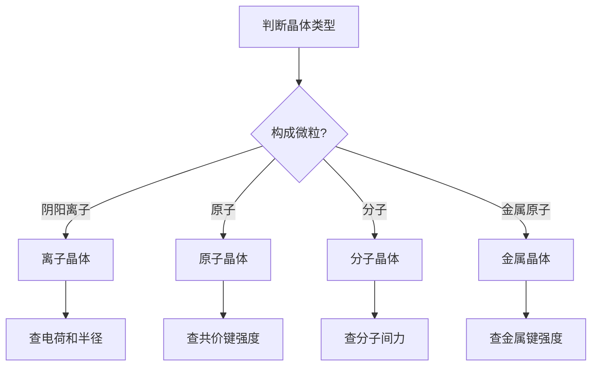
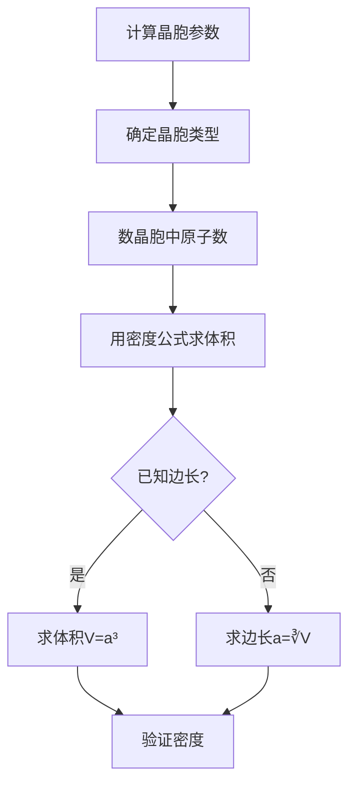

# 晶体结构与晶格能

> **定位**：晶体结构是物质结构的重要内容，涵盖晶体类型、晶格能、晶胞计算。本专题为"讲义抽料台"，可直接复制各板块到学生讲义。

---

## 一、核心结论

### 1.1 晶体类型（来源：晶体类型与性质KP §二）

| 晶体类型 | 构成微粒 | 微粒间作用力 | 熔点 | 硬度 | 导电性 | 示例 |
|:---:|:---|:---|:---:|:---:|:---:|:---|
| 离子晶体 | 阴阳离子 | 离子键 | 高 | 高 | 熔融导电 | NaCl, MgO |
| 原子晶体 | 原子 | 共价键 | 很高 | 很高 | 不导电 | 金刚石, SiO₂ |
| 分子晶体 | 分子 | 分子间力 | 低 | 低 | 不导电 | 干冰, 冰 |
| 金属晶体 | 金属原子 | 金属键 | 较高 | 较高 | 良导电 | Cu, Fe |

### 1.2 晶格能（来源：晶格能计算与应用KP §二）

**定义**：气态阴、阳离子结合成1mol离子晶体时释放的能量

**影响因素**：
- 电荷↑，晶格能↑（MgO > NaCl）
- 半径↓，晶格能↑（NaF > NaCl > NaBr > NaI）

**Born-Lande方程**：
$$U = -\frac{N_A A z^+ z^- e^2}{4\pi\varepsilon_0 r_0}\left(1-\frac{1}{n}\right)$$

### 1.3 晶胞计算（来源：晶胞参数与密度KP §二）

**密度公式**：
$$\rho = \frac{Z \times M}{N_A \times V}$$

- Z：晶胞中分子数
- M：摩尔质量
- V：晶胞体积

### 1.4 典型晶体结构（来源：晶体结构KP §三）

| 结构类型 | 配位数 | 晶胞特征 | 示例 |
|:---:|:---:|:---|:---|
| NaCl型 | 6:6 | 面心立方 | NaCl, KBr |
| CsCl型 | 8:8 | 体心立方 | CsCl, CsBr |
| ZnS型 | 4:4 | 面心立方 | ZnS, CuCl |
| CaF₂型 | 8:4 | 面心立方 | CaF₂, BaF₂ |

---

## 二、决策路径

### 晶体类型判断



### 晶胞参数计算



---

## 三、对比表格

### 表1：晶格能比较

| 化合物 | 电荷 | 离子半径和/Å | 晶格能/kJ·mol⁻¹ |
|:---|:---:|:---:|:---:|
| NaF | ±1 | 2.31 | 923 |
| NaCl | ±1 | 2.79 | 786 |
| NaBr | ±1 | 2.98 | 747 |
| NaI | ±1 | 3.23 | 704 |
| MgO | ±2 | 2.10 | 3850 |
| CaO | ±2 | 2.40 | 3461 |
| Al₂O₃ | ±3 | 2.17 | ~15000 |

### 表2：晶体类型与物理性质

| 性质 | 离子晶体 | 原子晶体 | 分子晶体 | 金属晶体 |
|:---|:---:|:---:|:---:|:---:|
| 熔点 | 高 | 很高 | 低 | 较高 |
| 硬度 | 高 | 很高 | 低 | 较高 |
| 导电性 | 熔融导电 | 不导电 | 不导电 | 良导电 |
| 溶解性 | 溶于极性溶剂 | 不溶 | 溶于非极性 | 不溶 |

### 表3：常见晶体结构参数

| 结构 | 配位数 | 空间利用率 | 晶胞原子数 | 示例 |
|:---:|:---:|:---:|:---:|:---|
| 简单立方 | 6 | 52% | 1 | Po |
| 体心立方 | 8 | 68% | 2 | Fe, Na |
| 面心立方 | 12 | 74% | 4 | Cu, Ag |
| 六方密堆积 | 12 | 74% | 2 | Mg, Zn |
| 金刚石 | 4 | 34% | 8 | C, Si |

### 表4：晶格能应用

| 应用 | 公式 | 示例 |
|:---|:---|:---|
| 溶解度预测 | 晶格能↓，溶解度↑ | AgF > AgCl > AgBr > AgI |
| 热稳定性 | 晶格能↑，热稳定性↑ | MgO > CaO > BaO |
| 熔点比较 | 晶格能↑，熔点↑ | NaF > NaCl > NaBr > NaI |
| 硬度比较 | 晶格能↑，硬度↑ | MgO > NaCl |

---

## 四、典型例题

### 例1：晶体类型判断（来源：晶体类型与性质KP §五 典型例题1）

判断以下物质的晶体类型：NaCl、金刚石、干冰、Cu。

**解答**：
- NaCl：阴阳离子构成→**离子晶体**
- 金刚石：碳原子构成→**原子晶体**
- 干冰：CO₂分子构成→**分子晶体**
- Cu：金属原子构成→**金属晶体**

### 例2：晶格能比较（来源：题库 13-01）

比较NaCl和MgO的晶格能大小。

**解答**：
- NaCl：±1电荷，离子半径和2.79Å
- MgO：±2电荷，离子半径和2.10Å
- 电荷因素：MgO电荷更高（±2 vs ±1）
- 半径因素：MgO半径更小
- **结论**：MgO晶格能远大于NaCl（3850 vs 786 kJ/mol）

### 例3：晶胞密度计算（来源：题库 13-03）

已知NaCl晶胞边长a=564pm，计算NaCl的密度。

**解答**：
- NaCl晶胞含4个NaCl单元（Z=4）
- M(NaCl)=58.5 g/mol
- V=a³=(564×10⁻¹⁰cm)³=1.79×10⁻²²cm³
- ρ = Z×M/(N_A×V) = 4×58.5/(6.02×10²³×1.79×10⁻²²)
- ρ = 234/107.8 = **2.17 g/cm³**

### 例4：空间利用率计算（来源：题库 13-07）

计算面心立方堆积的空间利用率。

**解答**：
- 面心立方晶胞含4个原子
- 原子半径r，边长a=2√2 r
- 晶胞体积V=a³=(2√2 r)³=16√2 r³
- 原子体积=4×(4/3)πr³=16πr³/3
- 空间利用率=(16πr³/3)/(16√2 r³)=π/(3√2)≈**74%**

---

## 五、易错点预警

### 易错1：晶格能与离子键能（来源：晶格能计算与应用KP §四）

- 晶格能是**1mol晶体**的总能量，不是单个离子对的能量
- 离子键能是**单个离子对**的相互作用能
- **陷阱**：不能将晶格能等同于离子键能

### 易错2：晶胞中原子数的计算（来源：晶胞参数与密度KP §四）

- 顶点原子贡献1/8
- 棱上原子贡献1/4
- 面上原子贡献1/2
- 体心原子贡献1
- **陷阱**：忘记乘以贡献比例会导致原子数计算错误

### 易错3：空间利用率的含义

- 空间利用率=原子体积/晶胞体积
- 金属晶体中，面心立方和六方密堆积的空间利用率最高（74%）
- **陷阱**：不能认为原子晶体的空间利用率高

### 易错4：晶体类型的判断依据

- 判断依据是**构成微粒和微粒间作用力**
- 不能仅凭熔点高低判断
- **陷阱**：SiO₂熔点很高，但是原子晶体（不是离子晶体）

### 易错5：Born-Lande方程的适用范围

- 适用于**离子晶体**
- 不适用于原子晶体、分子晶体
- **陷阱**：不能用Born-Lande方程计算NaCl的晶格能（应为计算晶格能）

### 易错6：晶格能与溶解度的关系

- 晶格能小→溶解度大（如AgF > AgCl）
- 但还需考虑水合能
- **陷阱**：不能仅用晶格能判断溶解度

### 易错7：金属晶体的密堆积

- 面心立方（fcc）和六方密堆积（hcp）的空间利用率相同（74%）
- 但配位数不同（fcc=12, hcp=12）
- **陷阱**：不能认为fcc和hcp是同一种结构

---

## 六、竞赛深化

### 6.1 Pauling规则（来源：晶体结构KP §六）

- **规则1**：在稳定结构中，配位多面体间的连接方式使负离子多面体共用棱、面的趋势减小
- **规则2**：电中性原则
- **规则3**：高电价小半径阳离子倾向于与配位数小的阴离子结合

### 6.2 缺陷晶体

- **点缺陷**：肖特基缺陷、弗伦克尔缺陷
- **线缺陷**：位错
- **面缺陷**：晶界、堆垛层错

### 6.3 非化学计量化合物

- Fe₁₋ₓO、TiO₁₊ₓ
- 晶体中存在空位或间隙原子
- **应用**：半导体材料、催化剂

---

## 七、知识链接

**前置知识**
- [[原子结构]] → 电子构型
- [[化学键]] → 离子键、共价键

**后续知识**
- [[配位化学]] → 配位化合物晶体
- [[材料化学]] → 晶体材料应用

**相关专题**
- [[专题-晶体结构计算]]（晶胞计算详解）
- [[专题-晶体与配合物深化]]（晶体场理论）
- [[专题-元素化学通论]]（元素单质的晶体构型）

---

## 八、题库索引

```dataview
TABLE difficulty AS "难度", tags AS "标签"
FROM "04-题库/化学原理/Ch13-晶体与晶体结构"
SORT file.name ASC
```
