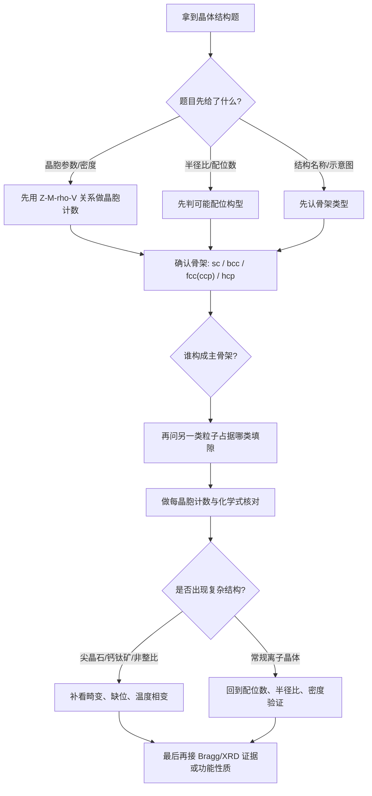

# 专题：晶体结构计算

> 本专题对应考纲条目：[[15-晶体结构]]、[[16-晶体基本概念]]、[[17-常见晶体结构]]
> 核心知识点：[[晶胞]]、[[等径球堆积]]、[[晶格能]]、[[常见晶体结构]]

---

## 零点五、进阶导航 {#advance-navigation}

- 本页定位：第三轮前置/深化基础页
- 冲刺上游页：[[专题-晶体与配合物深化]]
- 并行综合页：[[专题-物化综合计算]]

## 零点六、课堂投影速查卡 {#classroom-quick-card}

**本页课堂入口：** 先定“骨架是谁、填隙是谁”，再谈密度、半径比和结构名。

**先问四个问题：**

1. 题目先给的是晶胞参数、密度、半径比，还是直接给了结构示意？
2. 现在最该先认的是骨架类型，还是先做计数？
3. 这题是常规离子晶体，还是已经在往尖晶石/钙钛矿那类复杂结构过渡？
4. 最后要求落到配位数、化学式、密度，还是再往 XRD/结构畸变走？

**一屏判断卡：**

- 先骨架，后填隙，再计数。
- 半径比是辅助筛选，不是代替结构分析。
- 晶体题最怕一上来就算，没先认结构层次。
- 画晶胞图几乎永远不亏。

## 一、核心公式汇总

### 1.1 晶胞参数与原子坐标

- 晶胞中原子数计算（均摊法）
- 原子坐标表示（分数坐标）
- 晶胞密度计算：

$$
\rho = \frac{Z \cdot M}{N_A \cdot V}
$$

其中 $Z$ 为晶胞中化学式单位数，$M$ 为摩尔质量，$V$ 为晶胞体积。

### 1.2 配位数与空隙

| 堆积方式 | 配位数 | 四面体空隙 | 八面体空隙 |
|---------|--------|-----------|-----------|
| 简单立方 | 6 | - | - |
| 体心立方 (bcc) | 8 | - | - |
| 面心立方 (fcc/ccp) | 12 | 2N | N |
| 六方密堆 (hcp) | 12 | 2N | N |

*注：N 为原子数*

### 1.3 离子半径与晶胞参数关系

- NaCl 型：$a = 2(r_+ + r_-)$
- CsCl 型：$a = \frac{2(r_+ + r_-)}{
\sqrt{3}}$
- ZnS（闪锌矿）型：$a = \frac{4(r_+ + r_-)}{
\sqrt{3}}$

## 二、常见晶体结构特征

### 2.1 NaCl 型

- 结构：面心立方，Na⁺ 和 Cl⁻ 交替排列
- 配位数：6:6
- 晶胞中原子数：4 NaCl
- 典型化合物：NaCl, KCl, MgO, CaO

### 2.2 CsCl 型

- 结构：简单立方衍生，Cs⁺ 在体心
- 配位数：8:8
- 晶胞中原子数：1 CsCl
- 典型化合物：CsCl, CsBr, CsI

### 2.3 闪锌矿 (ZnS) 型

- 结构：面心立方，S²⁻ fcc，Zn²⁺ 占据一半四面体空隙
- 配位数：4:4
- 典型化合物：ZnS, ZnSe, CuCl, GaAs

### 2.4 纤锌矿 (ZnS) 型

- 结构：六方晶系
- 配位数：4:4
- 典型化合物：ZnS, ZnO, BeO

### 2.5 CaF₂（萤石）型

- 结构：面心立方，Ca²⁺ fcc，F⁻ 占据全部四面体空隙
- 配位数：8:4
- 典型化合物：CaF₂, UO₂, ThO₂

### 2.6 金红石 (TiO₂) 型

- 结构：四方晶系
- 配位数：6:3
- 典型化合物：TiO₂, SnO₂, MnO₂

## 三、计算题型分类

### 3.1 已知晶胞参数求密度

**步骤**：
1. 确定晶胞类型和 $Z$ 值
2. 计算晶胞体积 $V$
3. 代入密度公式

### 3.2 已知密度求晶胞参数

**步骤**：
1. 由密度公式反推 $V$
2. 由晶胞类型确定 $a$ 与 $V$ 的关系
3. 计算 $a$

### 3.3 已知离子半径判断结构类型

**半径比规则**：

| 半径比 $r_+/r_-$ | 配位数 | 理想构型 |
|-----------------|--------|---------|
| 0.155 - 0.225 | 3 | 平面三角形 |
| 0.225 - 0.414 | 4 | 四面体 |
| 0.414 - 0.732 | 6 | 八面体 |
| 0.732 - 1.000 | 8 | 立方体 |

*注：半径比规则仅适用于离子晶体，且为经验规则*

### 3.4 原子坐标与键长计算

- 由分数坐标计算原子间距离
- 公式：$d = \sqrt{(x_2-x_1)^2a^2 + (y_2-y_1)^2b^2 + (z_2-z_1)^2c^2}$（正交晶系）

## 三点五、教学图二：晶体结构判定总图 {#teaching-figure-2}

> 课堂用途：把“半径比 / 骨架 / 填隙 / 计数”四步压成一张投影图，讲复杂结构题时先指这张再做题。



## 四、竞赛解题技巧

1. **画晶胞图**：无论题目是否要求，先画出晶胞示意图
2. **均摊法数原子**：顶点 1/8，棱心 1/4，面心 1/2，体心 1
3. **注意化学式**：晶胞中原子数之比必须等于化学式中原子数之比
4. **单位换算**：晶胞参数常以 pm 给出，需换算为 cm 计算密度

## 五、典型例题（真题策展）

> 以下真题覆盖晶体结构计算的**核心考查维度**，备课时建议按「由易到难」顺序选用。

### 必讲 1：晶胞化学组成判断（⭐⭐）
- [[题-038-5-1-1-FeCr合金晶胞组成]]（38届初赛）
- **考查点**：体心立方 → 置换 → 晶胞化学式 + 点阵型式
- **备课提示**：先让学生独立画晶胞，再讨论"置换后点阵类型是否改变"（经典陷阱）

### 必讲 2：钙钛矿结构识别（⭐⭐⭐）
- [[题-036-2-1-高压碳酸盐钙钛矿结构]]（36届初赛）
- **考查点**：钙钛矿 ABX₃ 的离子对应 + "反钙钛矿"变式
- **备课提示**：强调"BX₆ 八面体共顶点"是钙钛矿的结构指纹，先识别骨架再填离子

### 必讲 3：晶胞密度计算（⭐⭐⭐）
- [[题-036-7-3-氢密度计算]]（36届初赛）
- **考查点**：ρ = ZM/(NₐV) 的完整应用 + 单位换算
- **备课提示**：学生常忘把 pm³ 换为 cm³，建议课前单独练一次单位换算

### 拔高 4：原子坐标参数（⭐⭐⭐⭐⭐）
- [[题-037-6-2-3-碳原子坐标]]（37届初赛）
- **考查点**：密堆积中的八面体空隙位置 + 晶胞原点选择对坐标的影响
- **备课提示**：这是近年初赛最难的结构题之一，建议先讲"层堆积顺序 → 空隙位置 → 坐标推导"三步法

### 综合 5：层状结构 + 键长计算（⭐⭐⭐⭐）
- [[题-038-5-2-2-SrSbCu键长计算]]（38届初赛）
- **考查点**：分数坐标 → 原子间距公式 + 层状结构几何
- **备课提示**：与「原子坐标」题形成题组，巩固"坐标→距离"的计算链

---

## 六、备课时间线建议（45 min 专题课）

| 时间段 | 内容 | 选用例题 |
|:---:|:---|:---|
| 0-5 min | 核心公式速览 + 易错点提问 | — |
| 5-15 min | 晶胞组成判断 + 点阵型式 | 必讲 1 |
| 15-28 min | 钙钛矿/常见结构类型 | 必讲 2 |
| 28-38 min | 密度计算 + 单位换算强化 | 必讲 3 |
| 38-45 min | 原子坐标 / 键长计算（选讲） | 拔高 4 或 综合 5 |

> **分层策略**：基础班必讲 1-3，提高班全讲，竞赛班以 4-5 为主、1-3 快速过。

## 七、相关链接

- 知识点：[[晶胞]]、[[等径球堆积]]、[[晶格能]]、[[配位数]]
- 题型：题型-晶体结构分析

---

## 八、相关真题 {#related-exam-questions}

### 真题入口使用建议

- 先用“单晶胞计数 / 密度 / 配位数”题热身，确认学生还保留第一轮骨架。
- 再切到“尖晶石 / 钙钛矿 / 非化学计量”题，把第三轮深化内容拉出来，不要一上来就做最复杂结构。
- Bragg 方程题适合放在后半段，作为“实验信号怎么回到结构判断”的收束，而不是开场计算题。
- 如果是习题课投影，建议按“骨架识别 → 填隙计数 → 结构畸变/相变 → XRD”顺序排题。

### 真题链与讲评顺序 {#exam-sequence}

- `第 1 题`：先讲单晶胞计数 / 密度题，稳住“骨架 + Z 值”。
- `第 2 题`：再讲半径比 / 配位数 / 结构类型筛选题，把结构直觉和计算接起来。
- `第 3 题`：最后讲复杂结构或 Bragg/XRD 题，作为从基础页往冲刺页过渡的收口。
- 课堂顺序建议：`基础计数题 → 结构筛选题 → 复杂/实验题`，不要一上来就讲最复杂投影或缺陷题。

### 图后立刻练 / 讲后 1 题 / 课后 2 题

- 图后立刻练：给 1 道短题，只要求先说“骨架是谁、填隙是谁”。
- 讲后 1 题：选一题典型密度/晶胞参数真题，完整练 `结构 → Z → 体积 → 密度`。
- 课后 2 题：一题半径比判断题，一题 Bragg/XRD 或复杂结构题，训练基础和过渡两端。

```dataview
TABLE file.name AS "文件名", year AS "年份", type AS "题型", difficulty AS "难度"
FROM "05-真题库"
WHERE contains(knowledge_points, "晶胞") OR contains(knowledge_points, "等径球堆积") OR contains(knowledge_points, "晶格能") OR contains(knowledge_points, "常见晶体结构")
SORT year DESC, difficulty ASC
```

### 🥇 推荐真题（硬链接）

| 真题 | 核心考点 | 难度 |
|:---|:---|:---:|
| [[真题-晶体结构-001]] | Bragg 方程 + 晶胞参数计算 | ⭐⭐⭐ |
| [[真题-结构-Bragg方程-002]] | XRD 指标化 + 晶面间距 | ⭐⭐⭐⭐ |
| [[真题-结构-晶胞计算-密度-001]] | 晶胞密度 + Z 值计算 | ⭐⭐⭐ |
| [[真题-结构-钙钛矿-001]] | 钙钛矿结构 + 填隙判断 | ⭐⭐⭐⭐ |

---

### 必讲 6：A3 型（HCP）密堆积晶胞参数推导（周坤无机，⭐⭐⭐）

**题目：**
A3 型（ABAB）密堆积中，求简单六方晶胞参数 a 和 c 的关系，并证明 c/a = 2√6/3 ≈ 1.633。

**分析：**
六方晶胞底面为菱形（边长 a = 2R），c 轴方向包含两层密置层（AB）。利用正四面体高与边长的几何关系推导。

**解答：**
- 底面：菱形边长 a = 2R（球相切）
- 层间距：两层球心连线构成正四面体，正四面体高 h = √6/3 × 棱长 = √6/3 × a
- c 轴包含两层间距：c = 2h = 2√6/3 × a ≈ **1.633a**

**反思：**
- c/a = 1.633 是 HCP 的理论值，实际金属因电子因素略有偏离（如 Zn: 1.856，Cd: 1.886）
- 该几何推导是晶体结构计算的基本功，连接"球堆积"与"晶胞参数"

---

### 必讲 7：C₆₀ 面心立方晶体与 K₃C₆₀ 密度比（周坤无机，⭐⭐⭐⭐）

**题目：**
C₆₀ 晶体为面心立方，a = 1420 pm。(1) 求 C₆₀ 分子最近距离；(2) 判断空隙类型与数量；(3) 若 K 原子填入所有八面体和四面体空隙形成 K₃C₆₀，密度比 C₆₀ 增大多少？

**分析：**
面心立方中：最近邻分子距 = a/√2；4 个八面体空隙 + 8 个四面体空隙 / 晶胞。K₃C₆₀ 意味着 12 个 K 填入 12 个空隙（4 八面体 + 8 四面体）。

**解答（要点）：**
- (1) 最近距离 d = a/√2 = 1420/1.414 = **1004 pm**
- (2) 空隙：4 个八面体空隙（体心 + 棱心）+ 8 个四面体空隙
- (3) C₆₀ 密度：ρ₁ = 4M(C₆₀)/(Nₐa³)
  K₃C₆₀ 密度：ρ₂ = 4[M(C₆₀)+3M(K)]/(Nₐa³)
  密度比：ρ₂/ρ₁ = [720+3×39]/720 = 837/720 ≈ **1.16**

**反思：**
- 分子晶体（C₆₀）→ 离子晶体（K₃C₆₀）的填充模型转换
- 空隙计数必须熟练：fcc 中球数:四面体空隙:八面体空隙 = 4:8:4 = 1:2:1

---

*本专题依据 [[模板-专题]] v1.6 生成，状态：可用。*
*2026-06-18 压测备注：本页当前同时承接“第一轮晶体结构基础”和“第三轮/第四轮结构深化”的共用专题入口，因此补入别名 `专题-晶体结构`、`专题-晶体结构基础` 以统一备课大纲、讲义与教学洞察的链接口径。*
*2026-06-19 复核说明：本页已具备课堂投影速查卡、真题链、上游/下游导航以及多轮次共用入口能力；当前已不再只是”可用”，统一升为 `已审校`。*

## 九、相关课件与讲义

| 类型 | 文件 | 班型 | 日期 | 说明 |
|:---|:---|:---:|:---|:---|
| 备课大纲 | [[04-课件/备课大纲/2026-06-02-晶体结构基础-基础班]] | 基础班 | 2026-06-02 | 点阵/晶胞/密堆积/离子晶体结构与半径比规则 |
| 新授课讲义 | [[04-课件/新授课/2026-06-02-晶体结构基础-基础班]] | 基础班 | 2026-06-02 | 学生课堂材料，聚焦晶体结构基础与直观认知 |
| 学生讲义 | [[04-课件/学生讲义/2026-06-23-离子键与离子晶体]] | 基础班 | 2026-06-23 | SHHS Vol 1·八提炼：离子键/离子极化/晶格能/半径比规则/Born-Haber循环 |
| 学生讲义 | [[04-课件/学生讲义/2026-06-23-晶体学基础]] | 基础班 | 2026-06-23 | SHHS Vol 1·六提炼：7大晶系→14 Bravais点阵 |
| 学生讲义 | [[04-课件/学生讲义/2026-06-23-金属键与金属晶体]] | 基础班 | 2026-06-23 | SHHS Vol 1·七提炼：能带理论+金属堆积+A-B合金 |
| 学生讲义 | [[04-课件/学生讲义/2026-06-23-其他类型晶体]] | 基础班 | 2026-06-23 | SHHS Vol 1·九提炼：层状/混合型晶体/分子筛/准晶 |

> 📎 相关提炼：[[07-资料提炼/书籍提炼/提炼-普化原理-第13章-晶体与晶体结构]] · [[07-资料提炼/书籍提炼/提炼-化学竞赛初赛讲义-第7讲-晶体结构]] · [[07-资料提炼/书籍提炼/提炼-Atkins物理化学-主题15-固体]]
