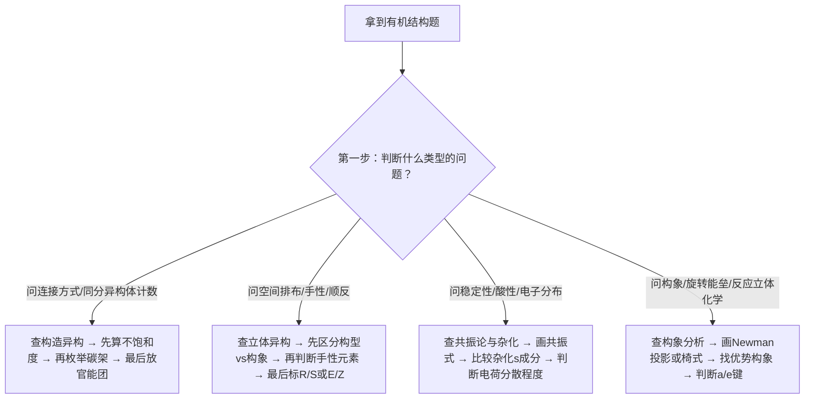

# 专题：有机分子结构初探

> 本专题对应考纲条目：[[21-杂化轨道理论与成键]]、[[23-有机物结构的表达]]、[[24-有机物的异构现象]]、[[27-有机物的手性]]
> 核心知识点：[[杂化轨道理论]]、[[Lewis式]]、[[构造异构]]、[[立体化学]]、[[构象异构]]、[[共振论]]

---

## 零点五、进阶导航 {#advance-navigation}

- 前置页：[[专题-原子结构与元素周期律]]（原子轨道→杂化轨道的底层逻辑）
- 后续页：[[专题-有机结构基础与电子效应]]（第三轮有机的总入口，从结构→电子效应→反应性）
- 深化页：[[专题-立体化学与区域选择性]]（手性、对映体、R/S 判断深挖）
- 真题入口：本页 §八 已列出高频真题

## 零点六、课堂投影速查卡 {#classroom-quick-card}

**本课课堂入口：** 不要从"sp³的键角是109.5°"开始。投影 C₄H₁₀ 的两种结构（正丁烷 vs 异丁烷）和 C₂H₆O 的两种结构（乙醇 vs 二甲醚）——"分子式一模一样，但沸点差了几十度，为什么？"——从真实分子引出"连接方式不同=构造异构=性质不同"的核心概念。

**先问三个问题：**

1. 这是构造异构还是立体异构？— 需要断键才能互变 = 构造异构；不需要断键 = 构象；需要断键但关系是镜像 = 对映体
2. 杂化类型是什么？— σ键数+孤对数 → sp/sp²/sp³ → 键角 + 几何
3. 有没有手性中心？— 四个不同基团连在同一碳上？分子有对称面/对称中心吗？（meso 陷阱！）

**一屏判断卡：**

```
有机结构题 → 先算不饱和度 Ω = (2C+2+N−H−X)/2
    │
    ├─ 画 Lewis 结构
    │   ├─ 算总价电子 → 骨架 → 分配 → 形式电荷
    │   └─ 八隅律：B/Al 6电子，第三周期+可超价
    │
    ├─ 判杂化 → 几何构型
    │   ├─ σ键数+孤对数 = 杂化轨道数
    │   ├─ sp³→109.5° / sp²→120° / sp→180°
    │   └─ s成分↑ → 键更短更强 → 酸性更强
    │
    ├─ 判异构类型
    │   ├─ 连接方式不同 → 构造异构
    │   │   └─ 枚举：碳架→官能团位置→官能团类型
    │   └─ 连接相同，空间不同 → 立体异构
    │       ├─ σ键旋转可互变 → 构象（不可分离）
    │       └─ 需断键才互变 → 构型
    │           ├─ 双键/环限制 → 顺反(E/Z)
    │           └─ 手性中心 → 对映体(R/S)、非对映体
    │
    └─ 构象分析（链状/环状）
        ├─ Newman投影：交叉式(对位交叉) > 邻位交叉 > 重叠式
        ├─ 环己烷椅式：大基团优先 e 键（A值越大越"锁定"）
        └─ E2消除必须 a,a-双直立（反式共平面）
```

**sp/sp²/sp³ 三对比：**

| | sp³ | sp² | sp |
|:---|:---:|:---:|:---:|
| s 成分 | 25% | 33% | 50% |
| 键角 | ~109.5° | ~120° | 180° |
| C–H 键长 | ~1.09 Å | ~1.08 Å | ~1.06 Å |
| C–H pKa | ~50 | ~44 | **~25** |
| 代表 | 烷烃 | 烯烃/苯/羰基 | 炔烃/腈 |

**异构体计数三步：**
1. 算不饱和度 Ω → 判可能的官能团/环
2. 枚举碳架 → 放官能团 → 去重
3. 每个构造异构体单独检查：手性中心？顺反？= 立体异构翻倍

**手性快判——meso 陷阱：** 有手性中心 ≠ 有手性！分子内有对称面/对称中心 → meso → 无光学活性。如酒石酸的 (R,S)-异构体是 meso 体。

**课堂三问：** ① 不饱和度算了吗？② 构造还是立体？③ 手性中心≠手性——对称面检查了吗？

## 一、核心结论汇总 {#core-conclusions}

**必须记住：**
1. **结构决定性质，性质反映结构**——有机化学的核心逻辑。分子的几何构型（杂化类型）直接决定键角、键长、键能及反应活性。
2. **异构现象分两层**：构造异构（连接方式不同）→ 立体异构（连接方式相同，空间排布不同）→ 立体异构又分为构象异构（单键旋转）和构型异构（顺反/对映，需断键才能互变）。
3. **杂化类型是判断分子几何的"第一性原理"**：sp³→四面体/109.5°、sp²→平面三角/120°、sp→直线/180°；s 成分越高，C–H 键越短、键能越大、酸性越强。

**最高频决策路径：**



---

## 二、对比表格 {#comparison-table}

### 表1：构造异构 vs 立体异构（异构现象总览）

| 触发条件（题目关键词） | 比较维度 | 构造异构 | 立体异构 | 常见陷阱 |
|:---|:---|:---|:---|:---|
| "分子式相同，结构不同" / "同分异构体数目" | **本质区别** | 原子连接顺序（connectivity）不同 | 连接顺序相同，空间排布不同 | 把对映体当成构造异构体 |
| "分子式相同，能否重叠" | **是否需断键互变** | 需要断键重排 | 构象：不需断键；构型：需断键 | 构象异构可快速互变，常被误认为"同一化合物" |
| "沸点/熔点差异大" | **物理性质** | 通常差异显著 | 对映体：除旋光外全同；非对映体：不同 | 对映体在非手性环境中性质相同 |
| "能否用常规方法分离" | **分离难度** | 较易（蒸馏、色谱）| 对映体：需手性环境；非对映体：较易 | 外消旋体拆分必须用手段 |

### 表2：构象 vs 构型（立体异构的两大子类）

| 触发条件（题目关键词） | 比较维度 | 构象（Conformation） | 构型（Configuration） | 常见陷阱 |
|:---|:---|:---|:---|:---|
| "单键旋转" / "Newman投影" / "椅式/船式" | **产生原因** | σ 键旋转 | 手性中心或双键限制旋转 | 把构象异构当构型异构 |
| "能否分离" / "室温下存在形式" | **可分离性** | **不可分离**，快速互变（玻尔兹曼分布）| **可分离**为不同化合物 | 认为构象异构体可以分离 |
| "转化能垒" / "旋转能垒" | **能量壁垒** | 通常 < 20 kJ/mol（乙烷~12 kJ/mol）| 通常 > 80 kJ/mol（需断键）| 忽略酰胺C–N的部分双键性（能垒~20 kcal/mol，构象可分离）|
| "E2消除的立体要求" / "反式共平面" | **对反应性的影响** | 决定E2消除能否发生（需a,a-双直立）| 决定产物的顺反或R/S关系 | 环翻转后a/e互换，但顺反关系不变 |

### 表3：sp / sp² / sp³ 杂化对比（有机分子几何的"第一性原理"）

| 触发条件（题目关键词） | 比较维度 | sp³ | sp² | sp |
|:---|:---|:---|:---|:---|
| "饱和碳" / "烷烃" / "四面体" | **杂化轨道组成** | s + pₓ + pᵧ + p₂ | s + pₓ + pᵧ | s + pₓ |
| "双键/三键碳的杂化" / "平面结构" | **几何构型** | 正四面体 | 平面三角形 | 直线形 |
| "键角比较" / "为什么不是109.5°" | **键角** | 109.5°（理想）| ~120° | 180° |
| "C–H酸性排序" / "末端炔烃的酸性" | **s成分与电负性** | 25% s | 33% s | 50% s |
| "C–H键长排序" / "键能比较" | **C–H键长/键能** | ~1.09 Å / 413 kJ/mol | ~1.08 Å / 460 kJ/mol | ~1.06 Å / 506 kJ/mol |
| "能否形成π键" / "共轭体系" | **未杂化p轨道** | 0个（只能σ）| 1个（可1个π）| 2个（可2个π）|
| "典型实例" | **代表化合物** | CH₄、烷烃 | C₂H₄、苯、羰基 | C₂H₂、腈类、丙二烯中心碳 |

---

## 三、解题套路 / 决策流程 {#problem-solving-routine}

> 有机分子结构问题的通用解题框架：从"画对结构"到"判断关系"到"解释性质"的闭环。

### Step 1：画出准确的Lewis结构式
- **操作**：确定分子式 → 计算不饱和度 Ω = (2C + 2 + N − H − X)/2 → 画出骨架 → 标出形式电荷和孤对电子（有机Lewis式标电荷、不标孤对）
- **依据 KP**：[[Lewis式]]、[[构造异构]]
- **检查点**：☐ 八隅律满足（注意B/Al为6电子、第三周期可超价）☐ 形式电荷计算正确 ☐ 总电荷守恒

### Step 2：判断中心原子杂化类型与分子几何
- **操作**：数σ键数 + 孤对数 = 杂化轨道数 → 确定sp/sp²/sp³ → 预测键角和构型
- **依据 KP**：[[杂化轨道理论]]、[[sp3杂化]]、[[sp2杂化]]、[[sp杂化]]、[[有机分子的几何构型]]
- **检查点**：☐ 多重键按一个"超电子对"处理 ☐ 孤对电子压缩键角（NH₃ 107°、H₂O 104.5°）☐ 环张力导致杂化偏离（环丙烷~sp⁴~sp⁵）

### Step 3：分析异构现象的类型与数目
- **操作**：先判断是否为构造异构（连接性不同）→ 再判断立体异构类型（构象/构型）→ 计算异构体数目（n个不同手性中心最多2ⁿ个，注意meso体减少数目）
- **依据 KP**：[[构造异构]]、[[立体化学]]、[[手性中心]]、[[对映异构]]、[[顺反异构]]、[[构象异构]]
- **检查点**：☐ 不饱和度相同是构造异构的必要条件 ☐ 手性判断先看对称面/对称中心（不要只数手性中心）☐ meso体有手性中心但无手性 ☐ 环己烷顺反需结合a/e键分析

### Step 4：用共振论解释电子分布与稳定性
- **操作**：画出所有重要共振式 → 判断等价/不等价 → 评估电荷分散程度 → 解释稳定性/酸性/反应位点
- **依据 KP**：[[共振论]]、[[共轭效应]]、[[超共轭效应]]
- **检查点**：☐ 只移动电子，不移动原子核 ☐ 共价键数越多越稳定 ☐ 负电荷在电负性大的原子上更稳定 ☐ 电荷分离越小越稳定

### Step 5：构象分析（针对含单键旋转或环己烷的问题）
- **操作**：画Newman投影式（链状）或椅式构象（环状）→ 找优势构象（交叉式>重叠式；大基团优先e键）→ 判断反应立体化学（E2需反式共平面）
- **依据 KP**：[[构象分析]]、[[构象异构]]、[[Newman投影式]]
- **检查点**：☐ 交叉式稳定的核心原因是超共轭（给体-受体相互作用），不只是位阻 ☐ 环翻转后a/e互换，但相对构型（上/下）不变 ☐ 1,3-双直立相互作用是判断多取代环己烷稳定性的关键

| 步骤 | 核心操作 | 依据 KP | 检查清单 |
|:---|:---|:---|:---|
| 1 | 画Lewis结构式，标形式电荷 | [[Lewis式]] | ☐ 八隅律 ☐ 形式电荷 ☐ 总电荷守恒 |
| 2 | 判断杂化类型，预测几何构型 | [[杂化轨道理论]]、[[sp3杂化]]、[[sp2杂化]]、[[sp杂化]] | ☐ σ键+孤对=杂化轨道数 ☐ 键角预测 ☐ 环张力修正 |
| 3 | 分析异构类型，计算异构体数 | [[构造异构]]、[[立体化学]]、[[手性中心]] | ☐ 连接性是否相同 ☐ 对称元素检查 ☐ meso体识别 |
| 4 | 画共振式，解释稳定性/酸性 | [[共振论]] | ☐ 不移动原子核 ☐ 电荷分布合理 ☐ 电荷分离最小 |
| 5 | 构象分析，找优势构象 | [[构象分析]]、[[构象异构]] | ☐ 交叉式>重叠式 ☐ 大基团优先e键 ☐ E2反式共平面 |

---

## 四、反应机理拆解（含检查表）{#mechanism-analysis}

> 本专题虽非机理专题，但"结构决定性质"的思路需要通过电子推动来体现。以下以"共振论解释羧酸酸性"为例演示结构→性质的推理链条。

#### 步骤 1：写出共轭碱的共振结构
- **攻击位点**：无（静态结构分析）
- **电子流**：羧酸根中负电荷在两个氧之间离域
- **学生任务（接力点）**：下一位同学需要判断的是——这两个共振结构是否等价？负电荷分散程度如何？
- **检查表**：
  - ☐ 只移动电子（π键/孤对），不移动原子核
  - ☐ 所有共振结构的总电荷相同
  - ☐ 每个原子满足八隅体（或合理的缺电子/超价例外）

#### 步骤 2：比较共轭碱稳定性，推导酸性
- **操作**：RCOO⁻有两个等价共振结构，负电荷均分在两个O上；RO⁻负电荷集中在单一O上
- **结论**：RCOO⁻更稳定 → RCOOH酸性 >> ROH（pKa ~5 vs ~16）
- **检查表**：
  - ☐ 共振结构数不是唯一标准——等价低能结构 > 不等价高能结构
  - ☐ 确认比较的是共轭碱的稳定性，不是酸的稳定性

---

## 五、典型例题串讲 {#typical-examples}

### 例题 1：综合异构体计数（构造异构 + 立体异构）

**题目**：分子式为 C₄H₈O 的化合物，考虑构造异构和立体异构，最多有多少个异构体？

**分析**：
1. 计算不饱和度：Ω = (2×4 + 2 − 8)/2 = **1**（含一个双键或一个环）
2. 按构造异构分类枚举：
   - **醛类**：丁醛（CH₃CH₂CH₂CHO）、2-甲基丙醛（(CH₃)₂CHCHO）——2个
   - **酮类**：2-丁酮（CH₃COCH₂CH₃）——1个（无顺反，羰基碳连两个不同基团但无双键顺反）
   - **烯醇类**：烯丙醇（CH₂=CHCH₂OH，稳定）、2-丁烯-1-醇等——需注意烯醇通常不稳定，但烯丙醇是稳定烯醇代表
   - **环醇类**：环丁醇、环丙基甲醇——2个
   - **环醚类**：四氢呋喃、1,2-环氧丁烷（有顺反）、1,3-环氧丙烷（甲基取代）等
3. 考虑立体异构：
   - 2-甲基丙醛：无手性中心
   - 2-丁酮：无顺反（羰基不是C=C）
   - 含手性中心的构造异构体需翻倍（对映体）
   - 含C=C的需考虑E/Z（如2-丁烯醇）

**解答**：
稳定可分离的构造异构体主要包括：
| 类型 | 结构 | 立体异构 |
|:---|:---|:---|
| 醛 | 丁醛 | 无 |
| 醛 | 2-甲基丙醛 | 无 |
| 酮 | 2-丁酮 | 无 |
| 烯醇 | 烯丙醇 | 无 |
| 环醇 | 环丁醇 | 无 |
| 环醇 | 环丙基甲醇 | **有手性中心** → 2个对映体 |
| 环醚 | 四氢呋喃 | 无 |
| 环醚 | 1,2-环氧丁烷 | **有手性中心** → 2个对映体 |
| 环醚 | 2-甲基氧杂环丙烷 | 无（需具体分析）|

**反思**：
- 构造异构体计数的关键是"先碳架、后官能团、再检查重复"
- 不要遗漏官能团异构（醛vs酮vs烯醇vs环醚vs环醇）
- 每个构造异构体都要单独检查是否有手性中心或顺反异构

---

### 例题 2：环己烷构象与反应立体化学

**题目**：反-1-溴-4-叔丁基环己烷在强碱作用下发生E2消除，产物是什么？解释构象控制。

**分析**：
1. **识别关键基团**：t-Bu（叔丁基）和Br（离去基团）
2. **t-Bu的构象锁定作用**：t-Bu的A值 > 20 kJ/mol，**必须处于平伏键（e键）**
3. **确定环的锁定构象**：t-Bu向下e键 → 环被锁定在一个特定椅式构象
4. **Br的位置**：反-1,4-取代 → Br与t-Bu处于反式 → Br必须处于**直立键（a键，向上）**
5. **E2消除的立体要求**：H和LG（Br）必须**反式共平面**（a,a-双直立）
6. **寻找符合条件的H**：与Br同碳的相邻碳（C2和C6）上的H必须处于直立（与Br反式）

**解答**：
- t-Bu向下e键 → Br向上a键
- E2要求Br（向上a）与H（向下a）反式共平面
- 由于构象被t-Bu锁定，只有特定位置的H满足条件
- **产物为单一烯烃**（立体专一性消除），而非混合物

**反思**：
- 大基团（t-Bu）的构象偏好"锁定"了环，使E2消除具有高度立体选择性
- 这是"结构决定性质"的经典案例：构象（结构）→ 反应立体化学（性质）
- 若将t-Bu换成甲基（A值~7.5 kJ/mol），构象锁定不完全，可能得到混合物

---

### 例题 3：杂化状态判断与 C–H 酸性比较（Zchem 结构基础，⭐⭐⭐）

**题目：**
比较乙烷 $\mathrm{C_2H_6}$、乙烯 $\mathrm{C_2H_4}$、乙炔 $\mathrm{C_2H_2}$ 中 C–H 键的键长、键能和酸性，并用杂化理论解释其递变规律。

**分析：**
三种分子中碳的杂化类型不同：
- 乙烷：$\mathrm{sp^3}$ 杂化，s 成分 25%
- 乙烯：$\mathrm{sp^2}$ 杂化，s 成分 33%
- 乙炔：$\mathrm{sp}$ 杂化，s 成分 50%

s 成分越高，成键电子云越靠近碳核，C–H 键越短越强；同时碳的电负性越大，共轭碱越容易稳定负电荷。

**解答：**

| 性质 | 乙烷 ($\mathrm{sp^3}$) | 乙烯 ($\mathrm{sp^2}$) | 乙炔 ($\mathrm{sp}$) |
|:---|:---:|:---:|:---:|
| C–H 键长 | ~1.09 Å | ~1.08 Å | ~1.06 Å |
| C–H 键能 | ~413 kJ/mol | ~460 kJ/mol | ~506 kJ/mol |
| p$K_a$ | ~50 | ~44 | ~25 |
| 递变规律 | 最长 / 最弱 / 最弱酸 | 中等 | **最短 / 最强 / 最强酸** |

**解释：**
- **键长/键能**：s 轨道比 p 轨道更靠近原子核，s 成分越高，成键电子被碳核束缚越紧 → 键长缩短、键能增大。
- **酸性**：C–H 异裂后生成碳负离子。$\mathrm{sp}$ 碳负离子的孤对电子处于 s 成分更高的轨道中，更靠近核，能量更低，更稳定 → 乙炔的酸性显著强于乙烷和乙烯。

**反思：**
- **s 成分是连接结构（杂化）与性质（键长/键能/酸性）的核心桥梁**。竞赛中常见问法："为什么末端炔烃的氢能被金属钠置换？"——答案就是 sp 碳的高 s 成分。
- p$K_a$ 从 50 → 44 → 25 的跨越说明：杂化效应可使酸性增强约 $10^{25}$ 倍，是有机化学中最显著的结构-性质关联之一。

---

### 例题 4：沸点比较与分子间作用力（Zchem 烷烃构象，⭐⭐⭐）

**题目：**
比较下列化合物的沸点高低，并说明原因：
(1) 正戊烷、异戊烷（2-甲基丁烷）、新戊烷（2,2-二甲基丙烷）
(2) 丙酸 $\mathrm{CH_3CH_2COOH}$、丙醇 $\mathrm{CH_3CH_2CH_2OH}$、丙醛 $\mathrm{CH_3CH_2CHO}$

**分析：**
(1) 三者均为非极性烷烃，分子间仅有色散力。色散力与分子的可极化性和接触面积有关。
(2) 三者分子式相近（$\mathrm{C_3H_6O_2}$、$\mathrm{C_3H_8O}$、$\mathrm{C_3H_6O}$），但分子间作用力类型不同：丙酸可形成双分子氢键二聚体，丙醇可形成单分子氢键，丙醛无氢键。

**解答：**

**(1) 烷烃沸点**
$$\text{正戊烷 (36.1°C)} > \text{异戊烷 (27.7°C)} > \text{新戊烷 (9.5°C)}$$

- 三者均为非极性分子，分子间力只有**色散力（London 力）**。
- 色散力随分子的**接触面积**增大而增强。
- 支链越多，分子越接近球形，表面积越小，分子间接触越不充分 → 色散力减弱 → 沸点降低。

**(2) 含氧有机物沸点**
$$\text{丙酸 (141°C)} > \text{丙醇 (97°C)} > \text{丙醛 (49°C)}$$

- **丙酸**：羧基可形成异常稳定的**双分子氢键二聚体**，相当于分子量翻倍，且需要额外能量破坏两个氢键。
- **丙醇**：羟基可形成分子间氢键（一维链状），但无羧酸那样的环状二聚体，氢键数量较少。
- **丙醛**：羰基有偶极矩，存在**偶极-偶极作用**，但无 O–H 键，**不能形成氢键**。

**反思：**
- **氢键 > 偶极-偶极 > 色散力**（对于相近分子量的化合物）。沸点异常首先检查氢键。
- 烷烃系列中，同分异构体的沸点差异是"支链效应"的经典体现，也是色散力依赖接触面积的直接证据。
- 丙酸沸点比丙醇高 44°C，这个巨大的差距几乎全部来自双分子氢键二聚体的额外稳定化能。

---

### 例题 5：共振论解释羧酸与醇的酸性差异（Zchem 上3，⭐⭐⭐）

**题目：**
乙酸的 p$K_a$ ≈ 4.8，乙醇的 p$K_a$ ≈ 16。两者均为含 O–H 的有机物，酸性却相差约 $10^{11}$ 倍。用共振论解释这一巨大差异。

**分析：**
酸性强弱的本质是**共轭碱的稳定性**：共轭碱越稳定，对应的酸越强。需要分别画出乙酸根和乙氧基负离子的结构，比较负电荷的分散程度。

**解答：**

**乙酸的电离**：
$$\mathrm{CH_3COOH \rightleftharpoons CH_3COO^- + H^+}$$

乙酸根 $\mathrm{CH_3COO^-}$ 的共振结构：
```
    :O:⁻              :O:
    ‖                 |
H₃C—C    ⟷    H₃C—C
    |                 ‖
    :O:              :O:⁻
```

- 两个共振结构**完全等价**
- 负电荷均匀分散到**两个氧原子**上
- 每个 C–O 键的键级为 1.5，两个键等长
- 共振稳定化能显著降低了共轭碱的能量

**乙醇的电离**：
$$\mathrm{CH_3CH_2OH \rightleftharpoons CH_3CH_2O^- + H^+}$$

乙氧基负离子 $\mathrm{CH_3CH_2O^-}$：
- 负电荷**完全集中在单一氧原子**上
- 无共振结构可画（相邻碳为饱和碳，无可用于离域的 π 体系）
- 共轭碱能量高，不稳定

**结论**：
乙酸根通过共振使负电荷离域，能量大幅降低 → 乙酸酸性强；乙氧基无共振稳定化 → 乙醇酸性弱。p$K_a$ 相差 11 个单位，对应酸性相差 $10^{11}$ 倍。

**反思：**
- **比较酸性的通用策略：永远比较共轭碱，不是比较酸本身。**
- 共振稳定化的前提是：共轭碱中负电荷必须与 π 体系相邻。若将乙酸根的 $\alpha$-H 全部换成饱和烷基（如特戊酸），共振稳定化仍然存在，但诱导效应会略有改变。
- 苯酚（p$K_a$ ≈ 10）的酸性介于羧酸和醇之间，因为苯氧基的负电荷可离域到苯环，但离域程度不如羧酸根的两个等价氧。

---

## 六、关联知识点 {#related-kp}

- [[杂化轨道理论]]——三种杂化的系统对比
- [[sp3杂化]]——四面体构型、σ键旋转、构象基础
- [[sp2杂化]]——平面结构、π键、共轭基础
- [[sp杂化]]——直线形、三键、高s成分效应
- [[Lewis式]]——结构表达的"字母表"
- [[共振论]]——电子离域的定性描述工具
- [[构造异构]]——连接性不同的异构
- [[立体化学]]——立体异构的系统分析框架
- [[手性中心]]——手性的最常见来源
- [[对映异构]]——镜像关系的立体异构
- [[顺反异构]]——双键/环限制旋转导致的异构
- [[构象异构]]——单键旋转导致的异构
- [[构象分析]]——构象能量与反应性的关系
- [[键能]]——键强度与杂化的关系
- [[键长]]——键距离与杂化的关系
- [[有机分子的几何构型]]——VSEPR与杂化的综合应用

## 七、关联题型 {#related-problem-types}

- [[题型-杂化类型判断]]
- [[题型-分子构型判断]]
- [[题型-Lewis结构式书写]]
- [[题型-异构体计数]]
- [[题型-手性判断]]
- [[题型-R/S构型判断]]
- [[题型-构象分析]]
- [[题型-环己烷优势构象判断]]
- [[题型-共振结构画法]]
- [[题型-键角比较]]

---

## 八、相关真题 {#related-exam-questions}

```dataview
TABLE file.name AS "文件名", year AS "年份", type AS "题型", difficulty AS "难度"
FROM "05-真题库"
WHERE contains(knowledge_points, "杂化轨道理论") OR contains(knowledge_points, "立体化学") OR contains(knowledge_points, "构造异构") OR contains(knowledge_points, "共振论") OR contains(knowledge_points, "构象异构") OR contains(knowledge_points, "Lewis式")
SORT year DESC, difficulty ASC
```

### 真题使用建议 {#exam-usage-tips}

- 有机结构初探的真题极少独立成题——通常嵌在有机推断/合成题的"前置结构分析"环节。训练重点是让学生在 3 分钟内完成"不饱和度→碳架→官能团→异构体数"的快判链。
- 基础班先用 C₄~C₆ 的简单分子式练异构体计数，建立"先算不饱和度"的条件反射和系统性枚举能力（碳架→官能团位置→官能团类型→立体翻倍）。
- 提高班加入环己烷构象分析——这是竞赛中从"静态结构"过渡到"反应性"的关键桥梁，E2 消除的立体要求必须回溯到构象层面的 a/e 键判断。

### 推荐真题 {#recommended-exam-questions}

> ⚠️ 当前题库暂无直接以"有机分子结构初探"为独立知识点的真题。推荐讲评方向：(1) 从有机-SN2/E2 真题中提取"底物结构→反应路径"推断步骤作为结构分析训练；(2) 将 [[真题-有机-芳香取代-001]] 中的定位基判断追溯到"杂化类型与电子效应"的结构根源；(3) 自编 C₅H₁₀O 等中等复杂度异构体枚举题用于限时训练，覆盖醛/酮/烯醇/环醇/环醚五类官能团异构。

### 真题链与讲评顺序 {#exam-sequence}

- `第 1 题`：不饱和度 + 官能团识别（自编小练，C₄~C₆ 分子式快判）。课堂用途：warm-up，3 min 内完成"分子式→不饱和度→可能官能团/环"的快判，确认基础工具链畅通。
- `第 2 题`：C₅H₁₀O 异构体系统枚举（构造 + 立体）。课堂用途：main，训练"碳架枚举→官能团放置→立体翻倍→去重检查"的完整链条，暴露学生常见的遗漏类型（环醚、烯醇等）。
- `第 3 题`：环己烷构象 + E2 反应立体要求联判（可接 [[真题-有机-E2消除-001]] 的结构分析部分）。课堂用途：synthesis，从"静态结构"过渡到"结构决定反应性"，建立构象→反应立体化学的因果关系。
- 课堂顺序建议：`不饱和度快判 → 异构体系统枚举 → 构象→反应性桥接`。先建立结构分析的系统性，再把结构嵌入反应语境。

---

## 九、相关课件与讲义 {#related-lessons}

| 类型 | 文件 | 班型 | 日期 | 说明 |
|:---|:---|:---:|:---|:---|
| 备课大纲 | [[04-课件/备课大纲/2026-06-02-有机分子结构初探-基础班]] | 基础班 | 2026-06-02 | 有机结构入门、官能团识别与基础班深度控制 |
| 新授课讲义 | [[04-课件/新授课/2026-06-02-有机分子结构初探-基础班]] | 基础班 | 2026-06-02 | 学生课堂材料，帮助建立有机分子观察框架 |

---

*本专题依据 [[模板-专题]] v1.7 生成，状态：可用。*
*新授课教学设计请参考独立的备课大纲文件，本页为纯粹的知识模块与解题引擎。*

> 📎 相关提炼：[[07-资料提炼/书籍提炼/提炼-化学竞赛初赛讲义-第10讲-有机化学基本原理]] · [[07-资料提炼/书籍提炼/提炼-ABOC-第1章-绪论]]
