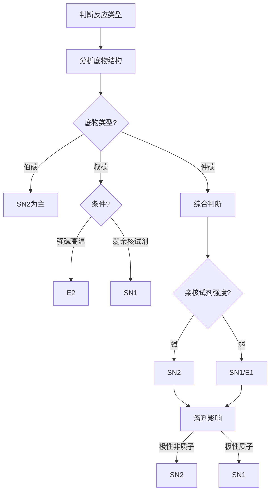
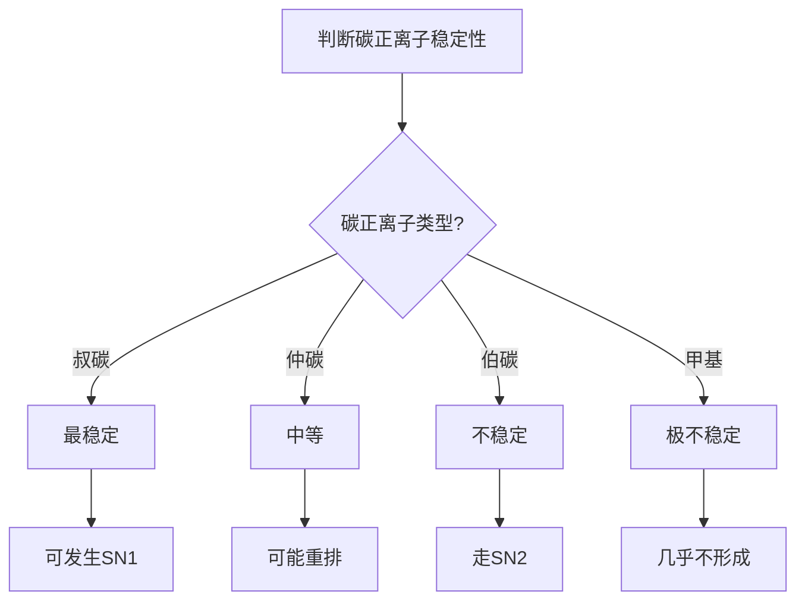

# 有机反应机理总览

> **定位**：有机反应机理是有机化学的核心理论，涵盖亲核取代、消除反应、碳正离子。本专题为"讲义抽料台"，可直接复制各板块到学生讲义。

---

## 一、核心结论

### 1.1 亲核取代反应（来源：SN1与SN2反应机理KP §二）

**SN2机理**：
- 一步协同过程，亲核试剂从离去基团背面进攻
- 形成过渡态（五配位碳），构型翻转（Walden反转）
- 速率 = k[底物][亲核试剂]，二级动力学
- 有利于伯碳底物、强亲核试剂、极性非质子溶剂

**SN1机理**：
- 两步过程，先离去基团解离形成碳正离子（慢步骤）
- 亲核试剂进攻碳正离子（快步骤）
- 速率 = k[底物]，一级动力学
- 有利于叔碳底物、弱亲核试剂、极性质子溶剂

### 1.2 消除反应（来源：E1与E2消除反应机理KP §二）

**E2机理**：
- 一步协同，碱夺取β-H，同时离去基团离开
- 反式共平面消除
- 速率 = k[底物][碱]

**E1机理**：
- 先形成碳正离子，再失去β-H
- 与SN1共享碳正离子中间体

### 1.3 反应选择性（来源：有机反应机理(解题策略)§二）

| 底物 | 主要反应 | 条件 |
|:---|:---|:---|
| 伯碳 | SN2 | 强亲核试剂，极性非质子溶剂 |
| 仲碳 | SN1/SN2/E2竞争 | 取决于具体条件 |
| 叔碳 | E2/SN1 | 强碱高温→E2，弱亲核试剂→SN1 |

### 1.4 反应坐标图（来源：有机反应机理(核心结论)§四）

- 过渡态位于能量最高点
- 中间体位于能量谷底
- 活化能Ea决定反应速率

---

## 二、决策路径

### SN1/SN2/E1/E2判断



### 碳正离子稳定性判断



---

## 三、对比表格

### 表1：SN1 vs SN2对比

| 特征 | SN1 | SN2 |
|:---|:---|:---|
| 动力学 | 一级 | 二级 |
| 立体化学 | 外消旋化 | 构型翻转 |
| 底物 | 叔碳 > 仲碳 | 伯碳 > 仲碳 |
| 亲核试剂 | 弱亲核试剂 | 强亲核试剂 |
| 溶剂 | 极性质子溶剂 | 极性非质子溶剂 |
| 重排 | 可能发生 | 不发生 |

### 表2：E1 vs E2对比

| 特征 | E1 | E2 |
|:---|:---|:---|
| 动力学 | 一级 | 二级 |
| 立体化学 | 无立体选择性 | 反式共平面消除 |
| 底物 | 叔碳 > 仲碳 | 伯碳~叔碳 |
| 碱 | 弱碱 | 强碱 |
| 溶剂 | 极性质子溶剂 | 极性非质子溶剂 |
| 重排 | 可能发生 | 不发生 |

### 表3：常见离去基团

| 离去基团 | 离去能力 | 底物 |
|:---|:---:|:---|
| I⁻ | 强 | RI |
| Br⁻ | 强 | RBr |
| Cl⁻ | 中等 | RCl |
| TsO⁻ | 强 | ROTs |
| H₂O | 弱（需质子化） | ROH₂⁺ |
| OH⁻ | 极弱（不能直接离去） | - |

### 表4：亲核试剂强度

| 亲核试剂 | 强度 | 适用反应 |
|:---|:---:|:---|
| CN⁻ | 强 | SN2 |
| I⁻ | 强 | SN2 |
| RS⁻ | 强 | SN2 |
| OH⁻ | 中等 | SN2/E2 |
| H₂O | 弱 | SN1 |
| ROH | 弱 | SN1 |

---

## 四、典型例题

### 例1：反应机理判断（来源：有机反应机理KP §五 典型例题1）

(R)-2-溴丁烷与NaOH在水溶液中反应，产物的立体化学如何？

**解答**：
- 仲碳底物 + OH⁻（中等强度亲核试剂）+ 质子溶剂
- SN1和SN2竞争
- SN2导致完全构型翻转得到(S)-2-丁醇
- SN1经碳正离子中间体（平面结构，两面等概率进攻）得到外消旋体
- 实际产物为**部分翻转+部分外消旋化的混合物**

### 例2：反应速率比较（来源：题库 无对应题库）

比较以下底物在SN2条件下的反应速率：CH₃Br、(CH₃)₂CHBr、(CH₃)₃CBr。

**解答**：
- SN2反应速率受空间位阻影响显著
- 亲核试剂需从背面进攻碳原子，位阻越大越难接近
- 速率顺序：**CH₃Br > (CH₃)₂CHBr >> (CH₃)₃CBr**
- CH₃Br（伯碳）：位阻最小，反应最快
- (CH₃)₃CBr（叔碳）：位阻极大，SN2几乎不发生

### 例3：碳正离子重排（来源：题库 无对应题库）

解释新戊基溴水解时产物不是预期的伯醇。

**解答**：
- 新戊基溴(CH₃)₃CCH₂Br水解时，先形成伯碳正离子(CH₃)₃CCH₂⁺
- 伯碳正离子不稳定，发生1,2-甲基迁移
- 重排为更稳定的叔碳正离子(CH₃)₂C⁺CH₂CH₃
- 最终产物为叔醇，而非预期的伯醇

### 例4：溶剂效应（来源：题库 无对应题库）

解释为什么SN2反应在极性非质子溶剂中速率更快。

**解答**：
- 极性非质子溶剂（如DMF、DMSO）不能形成氢键
- 不会溶剂化亲核试剂，使其保持较强的亲核性
- 极性质子溶剂会通过氢键溶剂化亲核试剂，降低其亲核性
- **结论**：极性非质子溶剂有利于SN2反应

---

## 五、易错点预警

### 易错1：混淆SN1/SN2/E1/E2适用条件（来源：有机反应机理(解题策略)§三）

- 不能仅凭底物类型判断
- 必须综合考虑亲核试剂强度、碱性、溶剂极性和温度
- **陷阱**：叔碳底物+强碱/高浓度→E2；叔碳底物+弱亲核试剂/质子溶剂→SN1

### 易错2：忽视碳正离子重排（来源：SN1与SN2反应机理KP §四）

- SN1和E1中形成的碳正离子可能发生1,2-氢迁移或1,2-甲基迁移
- 生成更稳定的碳正离子（三级>二级>一级）
- **陷阱**：新戊基溴水解时，碳正离子重排导致产物并非预期的伯醇

### 易错3：认为SN2中构型一定翻转就得到单一产物（来源：有机反应机理KP §五）

- 翻转指的是背面进攻导致的手性翻转（R→S或S→R）
- 但如果底物本身不是手性碳（如CH₃Br），则不存在构型翻转的问题
- **陷阱**：构型翻转只在手性碳中心发生

### 易错4：E2消除的立体化学要求

- E2要求**反式共平面**消除（H和离去基团在相反侧）
- 顺式消除的速率远慢于反式消除
- **陷阱**：不能假设E2消除没有立体化学要求

### 易错5：SN1反应的外消旋化

- SN1反应经过平面碳正离子中间体
- 亲核试剂从两面等概率进攻，得到外消旋体
- **陷阱**：SN1反应不是100%外消旋化，可能有部分构型翻转

### 易错6：离去基团的选择

- OH⁻是极差的离去基团（不能直接离去）
- 需要先质子化（形成H₂O）或转化为更好的离去基团（如OTs）
- **陷阱**：不能用OH⁻作为离去基团

### 易错7：反应条件的选择

- 高温有利于消除（熵驱动）
- 低温有利于取代（焓驱动）
- **陷阱**：不能忽略温度对反应选择性的影响

---

## 六、竞赛深化

### 6.1 邻基参与效应（来源：有机反应机理KP §七）

- 邻近基团通过分子内亲核取代帮助离去基团离开
- 导致**构型保持**（两次翻转=保持）
- **示例**：2-溴丙酸在碱性条件下水解

### 6.2 相转移催化

- 使用相转移催化剂（如季铵盐）将水相中的亲核试剂转移到有机相
- 提高SN2反应速率
- **应用**：Williamson醚合成

### 6.3 超酸介质中的碳正离子

- 超酸（如FSO₃H-SbF₅）可稳定极不稳定的碳正离子
- **应用**：研究甲基碳正离子等极活泼中间体

---

## 七、知识链接

**前置知识**
- [[原子结构]] → 电负性影响
- [[化学键]] → 共价键断裂

**后续知识**
- [[立体化学]] → 反应的立体化学结果
- [[有机合成]] → 机理指导合成设计

**相关专题**
- [[专题-立体化学]]（反应的立体化学结果）
- [[专题-SN1与SN2比较]]（SN1/SN2详解）
- [[专题-亲核取代与消除反应]]（取代与消除详解）

---

## 八、题库索引

```dataview
TABLE difficulty AS "难度", tags AS "标签"
FROM "04-题库/有机化学"
WHERE contains(file.name, "机理") OR contains(file.name, "取代") OR contains(file.name, "消除")
SORT file.name ASC
```
