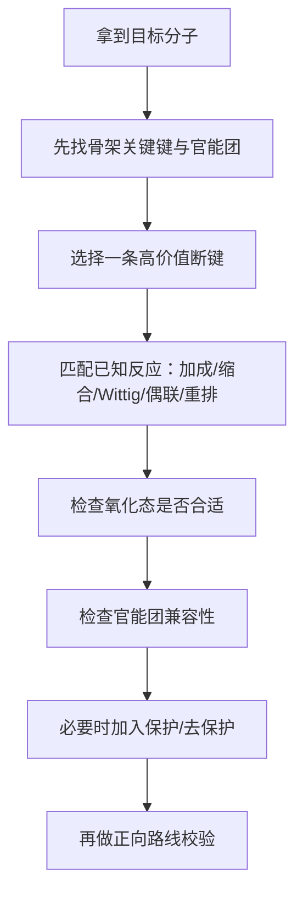

# 专题：有机合成与金属有机

> 本专题对应考纲条目：[[50-有机合成]]、[[51-金属有机]]
> 核心知识点：[[逆合成分析]]、[[Grignard试剂]]、[[有机锂试剂]]、[[Wittig反应]]、[[保护基化学]]、[[保护基策略]]

---

## 零点五、网课桥梁回流接口 {#source-bridge}

- 默认调用顺序：
  1. [[07-资料提炼/教学逻辑提炼/学而思 有机化学基础/教学逻辑提炼-学而思有机化学基础-批次C-芳香性与醇转化网络]] + [[07-资料提炼/教学逻辑提炼/学而思 有机化学基础/教学逻辑提炼-学而思有机化学基础-批次D-羰基亲核加成与转化网络]] + [[07-资料提炼/教学逻辑提炼/学而思 有机化学基础/教学逻辑提炼-学而思有机化学基础-批次E-酰基取代与活泼亚甲基工具箱]]
  2. [[07-资料提炼/教学逻辑提炼/Zchem 有机反应合成与机理/教学逻辑提炼-Zchem-选择性与全合成-第三四轮]]
  3. [[07-资料提炼/教学逻辑提炼/Zchem 有机反应合成与机理/教学逻辑提炼-Zchem-周环反应与活性中间体-第三轮]]

## 一、专题定位：第三轮有机主干的“收束层” {#positioning}

- 前面专题解决的是“单个反应怎么判断”，本专题解决的是“**多步路线怎么组织**”。
- 第三轮到这里，学生不该再只会看一步，而要开始会做：
  - 断键
  - 选试剂
  - 调氧化态
  - 判断是否要保护
  - 比较不同 organometallic 的反应边界
- 金属有机部分在本轮不是为了做完整现代催化，而是为了把 `Grignard / 有机锂 / Gilman / 常见偶联名字与模式` 收束成合成工具箱。

**第三轮总判断句：**

```text
先从产物倒推断键，
再确定等价试剂，
再检查官能团兼容性，
最后用保护基和氧化态调整把路线接通。
```

**与前面专题的衔接：**

| 关联专题 | 本专题怎么调用前面的内容 |
|:---|:---|
| [[专题-加成反应]] | 用羰基加成、1,2 / 1,4 选择性去设计 C-C 键构建 |
| [[专题-羰基化学与缩合反应]] | 用 Aldol / Claisen / Mannich / 烯醇负离子做片段拼接 |
| [[专题-自由基反应]] | 识别某些单电子路线是否适合构建骨架 |
| [[专题-周环反应]] | 把 Diels-Alder / Claisen 视作合成断键工具 |

---

## 二、核心结论汇总 {#core-conclusions}

**必须记住：**

1. 逆合成不是“倒着写反应式”，而是先找最有信息量的断键点。
2. 好的断键要导向熟悉且高收率的正向反应，而不是只求“能断开”。
3. `Grignard / RLi / Gilman` 的差异，第三轮最重要的是**亲核性强弱、底物边界、1,2/1,4 倾向与官能团兼容性**。
4. 保护基不是“额外知识”，而是多官能团路线题能否走通的关键。
5. 讲有机合成时，新授课不能只停留在定义，必须给学生一页页能直接套用的工具表。

---

## 二点五、课堂投影速查卡 {#classroom-quick-card}

**本页课堂入口：** 先别急着顺推，先看目标分子最值得“倒拆”的那根键在哪里。

**先问四个问题：**

1. 目标分子的关键新键是 `C-C`、`C-X`，还是官能团互变？
2. 这一步更适合用极性两电子方法，还是需要金属有机/偶联/单电子策略？
3. 前体里哪些官能团会和强碱、强亲核或金属试剂冲突？
4. 题目是要一条最短合成线，还是在考为什么某条看似直观的路线不可行？

**一屏判断卡：**

- 先做逆合成切键，再回填正向试剂；不要一上来盲目顺推。
- 金属有机题先问“谁是亲核片段、谁是亲电片段”，再看保护与兼容性。
- 任何偶联/格氏/有机锂题都要补查含水、酸性氢和官能团耐受性。
- 课堂上要把“为什么不用另一条路”讲出来，学生才会形成路线筛选能力。

**讲后立刻练：**

- 先做一道目标分子逆合成切键题。
- 再做一道格氏或偶联路线筛选题，把兼容性和顺序安排讲实。

---

## 二点七、Zchem 二次抽料：路线题四步筛法

| 步骤 | 起手先问什么 | 高频卡点 | 对应动作 |
|:---|:---|:---|:---|
| 第一步 | 目标分子最值得切哪根键 | 新建 `C-C` 键、官能团密集位 | 先做逆合成，再顺推 |
| 第二步 | 这根键对应哪类成熟正向反应 | 羰基加成、缩合、Wittig、偶联、周环 | 选能直接调用的工具族 |
| 第三步 | 官能团会不会和试剂打架 | 酸性氢、水、羰基、卤代烃 | 判断是否要换顺序或加保护基 |
| 第四步 | 有没有更短或更稳的替代路线 | 条件苛刻、收率差、选择性差 | 把“为什么不用另一条路”讲成课堂判断按钮 |

## 三、第三轮总流程 {#overall-route}



**课堂固定口令：**

1. 最值得切哪根键？
2. 这根键的正向构建手段是什么？
3. 现有官能团会不会打架？
4. 要不要保护，还是换断键更好？

---

## 四、教学顺序：网课资料 + 教材提炼合并版 {#teaching-sequence}

### 4.1 先从“制醇网络”入手

- 学而思批次 C、D 已经把 `烯烃水合 / 羰基还原 / Grignard 加成` 组织成“如何得到目标醇”的低门槛网络。
- 这条线最适合把前面分散的反应重新汇总，帮学生从“单反应”过渡到“路线设计”。

### 4.2 再转入逆合成分析

- 用 [[逆合成分析]] 的断键逻辑，把目标分子拆成更熟悉的片段。
- 课堂先讲最常见的：
  - 羰基断键
  - C=C 断键（Wittig）
  - 1,4-二官能团断键（Michael / Robinson / D-A 等联想）

### 4.3 合成路线逆推框架（Zchem）

> 来源：[[资料提炼-Zchem基础有机化学-批次Z-G-综合复习与例题]] §5.3

```
目标分子
    ↓
识别目标分子中的官能团和取代模式
    ↓
判断取代基引入顺序（利用定位效应）
    ↓
是否需要占位基/保护基/氧化还原切换？
    ↓
检查傅克烷基化是否会发生重排
    ↓
若会重排 → 改用傅克酰基化 + 还原
    ↓
写出正向合成路线
```

**多取代苯合成四策略**：
1. **定位效应先后顺序**：先引入邻对位定位基 → 再引入新基团到邻/对位
2. **占位基**：引入 -SO₃H 或叔丁基占据位置 → 反应后去除
3. **保护基**：-NH₂ 乙酰化为 -NHCOCH₃（仍为邻对位定位）
4. **氧化/还原切换**：烷基氧化为羧基改变定位方向

### 4.3 然后讲 organometallic 工具箱

- `Grignard → RLi → Gilman` 按反应性递进讲。
- 重点不是历史，而是：
  - 谁更硬
  - 谁更碱
  - 谁更容易 1,2
  - 谁更适合 1,4
  - 谁更容易和活泼氢打架

### 4.4 最后补保护基与偶联/现代名字识别

- 保护基部分用多官能团路线题来讲才有意义。
- 偶联部分本轮只保留“名字 + 反应模式 + 识别场景”，不深入完整催化循环。

---

## 五、核心对比表 {#comparison-table}

| 工具 | 课堂主问题 | 典型用途 | 常见误判 |
|:---|:---|:---|:---|
| [[逆合成分析]] | 先切哪根键 | 路线总规划 | 只会倒写，不会选断键 |
| [[Grignard试剂]] | 强亲核 C 片段如何加到羰基 | 制醇、羧化、开环 | 忘记活泼氢禁忌 |
| [[有机锂试剂]] | 更强碱/更强亲核时怎么选 | 卤素-锂交换、强碱性构建 | 和 Grignard 完全混同 |
| Gilman / 铜锂口径 | 怎样偏向 1,4 或软亲核路径 | 共轭加成、软亲核替代 | 还按 Grignard 那样想 1,2 |
| [[Wittig反应]] | 怎样把羰基变成双键 | 烯化、逆合成断 C=C | 只记 Z/E，不会做断键 |
| [[保护基化学]] | 多官能团如何避免互相打架 | 保护-反应-脱保护 | 什么都保护，路线变笨 |

### 5.1 `Grignard / RLi / Gilman` 第三轮对照

| 试剂 | 反应性 | 常见特点 | 第三轮最常用口径 |
|:---|:---|:---|:---|
| `RMgX` | 强亲核、强碱 | 制备相对方便，怕活泼氢 | 对羰基做 1,2，加成制醇 |
| `RLi` | 更强 | 更碱、更活泼、可卤锂交换 | 适合更强碱场景与特殊底物 |
| `R2CuLi` | 较软 | 更温和，常偏 1,4 | 与 α,β-不饱和羰基对照最重要 |

### 5.2 保护基判断快筛

| 场景 | 第一反应 |
|:---|:---|
| 强碱/Grignard 遇到 `OH / NH / COOH` | 先问要不要保护 |
| 羰基会被其他步骤误伤 | 先想缩醛/缩酮保护 |
| 多个官能团都可能反应 | 先问是不是该换路线，而不是一上来乱保护 |

---

## 六、第三轮解题套路 / 决策流程 {#problem-solving-routine}

### Step 1：先从产物角度做结构拆解

- 看主骨架哪里最像某个熟悉反应的产物。
- 先找“最像是由某步一把搭出来”的部分。

### Step 2：匹配正向反应模板

- 醇：Grignard / 还原 / 水合
- 双键：Wittig / 消除
- β-羟基羰基、α,β-不饱和羰基：Aldol / Claisen / Michael

### Step 3：检查 organometallic 边界

- 是否有活泼氢？
- 是该做 1,2 还是 1,4？
- 该用 `RMgX`、`RLi` 还是软一些的铜锂口径？

### Step 4：最后补保护基与顺序调整

- 保护基只在“确实会打架”时用。
- 如果保护太多，说明断键方案可能不够优。

**第三轮快筛清单：**

| 题目关键词 | 第一反应 | 第二反应 |
|:---|:---|:---|
| `合成目标醇` | 先想羰基加成 / 还原 / 水合 | 再比碳数变化 |
| `目标双键` | 先想 Wittig 断键 | 再看 Z/E 需求 |
| `α,β-不饱和羰基` | 先问 1,2 还是 1,4 | 再选 organometallic |
| `多官能团` | 先查兼容性 | 再决定是否保护 |
| `逆合成` | 先找高价值断键 | 再校验正向路线 |

---

## 七、主干内容：第三轮最常考的五条线 {#main-branches}

### 7.1 逆合成分析：课程主骨架

- 这是本专题的第一主线，不是附属技能。
- 课堂要练学生从产物倒推，而不是一直从原料顺推。

### 7.2 制醇网络：最好的低门槛合成入口

- 把学而思批次 C/D 里的制醇网络直接升格为第三轮工具表。
- 非常适合学生形成“目标官能团 → 常用得到方法”的检索能力。

### 7.3 `Grignard / RLi / Gilman`：最核心金属有机工具箱

- 这部分是第三轮真正要能做题的金属有机，不需要一开始讲完整过渡金属催化。
- 尤其要把 `1,2 vs 1,4` 和官能团兼容性讲透。

### 7.4 Wittig 与双键构建：最常见断键模板

- 它在新授课里不能只讲定义和机理。
- 更重要的是：学生要会从目标烯烃倒推“哪一半来自羰基，哪一半来自叶立德”。

### 7.5 保护基与路线管理：多步合成的必要层

- 保护基不能讲成表格背诵。
- 必须放进“为什么这条路线不保护就走不通”的具体情境里。

---

## 八、机制视角：本专题和前面反应专题有什么不同 {#mechanism-analysis}

| 问题 | 前面反应专题口径 | 本专题口径 |
|:---|:---|:---|
| 关注点 | 单步反应为什么这样走 | 多步路线怎样串起来 |
| 核心能力 | 机理与选择性判断 | 断键、选试剂、控兼容性 |
| 典型错误 | 单步机理说错 | 路线能做但不经济，或官能团打架 |
| 高分关键 | 解释一步 | 组织整条路线 |

**一句话概括：**

```text
本专题最常见的失误，
不是不会某一步反应，
而是不会把会做的那些“单步”真正组织成一条路线。
```

---

## 九、典型例题串讲 {#typical-examples}

### 例题 1：目标醇的合成

**题目：** 给定一个二级醇，倒推两种可能路线。  
**思路：** 一条走羰基 + `RMgX`，一条走烯烃水合 / 还原。  
**结论：** 比较碳数变化与原料易得性，选更优路线。  
**教学抓手：** 先把“制醇网络”练熟。

### 例题 2：α,β-不饱和羰基加成

**题目：** 比较 `RMgX` 与 Gilman 试剂对同一底物的结果。  
**思路：** 先问 1,2 / 1,4，再回到硬软亲核与反应性。  
**结论：** 给出不同主产物并解释。  
**教学抓手：** organometallic 对照必须进入学生答题口径。

### 例题 3：目标烯烃逆合成

**题目：** 给定一个特定取代烯烃，倒推 Wittig 方案。  
**思路：** 断成羰基片段 + 叶立德片段，再补 Z/E 需求。  
**结论：** 给出合理的羰基与膦叶立德来源。  
**教学抓手：** 让 Wittig 真正进入逆合成。

### 例题 4：多官能团路线管理

**题目：** 某底物既有醇又有羰基，且需要做强碱 / Grignard 步骤，如何设计顺序？  
**思路：** 先判断谁会被误伤，再决定是否缩醛或硅醚保护。  
**结论：** 给出保护-反应-脱保护的合理顺序。  
**教学抓手：** 把保护基从“附录知识”变成路线题的一部分。

---

## 十、常见误区与纠偏 {#pitfalls}

1. 逆合成只会“倒着写”，不会选择高价值断键。
2. 把 `Grignard`、`RLi`、Gilman 都当成“差不多的碳亲核试剂”。
3. 见多官能团就下意识乱加保护基。
4. 只记 `Wittig` 生成烯烃，不会把它用于断键。
5. 忘记活泼氢与 organometallic 的根本冲突。

---

## 十一、与第三轮备课框架的直接对应 {#framework-link}

| [[第三轮总体备课框架]] 提示项 | 本专题落实方式 |
|:---|:---|
| 逆合成分析 | 作为全课总骨架 |
| Grignard 试剂 | 作为最核心 organometallic 工具入口 |
| 有机锂 | 作为更强反应性对照层 |
| Gilman / 1,4 加成口径 | 作为 `1,2 vs 1,4` 的关键对照 |
| 保护基策略 | 作为多步路线的兼容性管理 |
| 偶联反应名字识别 | 只保留课堂可用的模式识别层 |

---

## 十二、关联知识点 {#related-kp}

- [[逆合成分析]]
- [[Grignard试剂]]
- [[有机锂试剂]]
- [[Wittig反应]]
- [[保护基化学]]
- [[保护基策略]]

## 十三、关联题型 {#related-problem-types}

- [[题型-逆合成分析]]
- [[题型-机理推断]]
- [[题型-区域选择性判断]]
- [[题型-合成路线设计]]

## 十四、相关真题 {#related-exam-questions}

```dataview
TABLE file.name AS "文件名", year AS "年份", type AS "题型", difficulty AS "难度"
FROM "05-真题库"
WHERE contains(knowledge_points, "逆合成分析")
   OR contains(knowledge_points, "Grignard试剂")
   OR contains(knowledge_points, "有机合成")
SORT year DESC, difficulty ASC
```

### 真题使用建议

- Grignard真题是本专题最核心的入口——先用它训练"从产物倒推亲核/亲电片段"，再扩展到其他金属有机试剂
- 缩醛保护真题不要孤立讲，必须嵌进合成路线题的情境："如果不保护，Grignard试剂会先和哪个官能团打架？"
- 当前题库缺少Wittig和偶联类真题，建议用机理类真题做合成接口训练：给定目标烯烃→倒推Wittig断键思路

### 推荐真题

| 真题 | 核心考点 | 难度 |
|:---|:---|:---:|
| [[真题-有机-Grignard-001]] | 格氏试剂制苯甲酸——亲核碳片段+亲电羰基的合成逻辑与活泼氢禁忌 | ⭐⭐⭐ |
| [[真题-有机-缩醛保护-001]] | 缩酮保护/脱保护——多步路线中的官能团兼容性管理 | ⭐⭐ |
| [[真题-有机-烯醇烷基化-001]] | 烯醇负离子区域选择性烷基化——"制醇网络"外的C-C键构建工具 | ⭐⭐⭐⭐ |

### 真题链与讲评顺序

- `第 1 题`：[[真题-有机-Grignard-001]]，以最经典的格氏反应建立"亲核片段→亲电羰基→产物"的正向与逆向双向思维。课堂用途：warm-up
- `第 2 题`：[[真题-有机-缩醛保护-001]]，引入"多官能团路线必须先查兼容性"的意识，把保护基从附录知识变成路线设计决策。课堂用途：main
- `第 3 题`：[[真题-有机-烯醇烷基化-001]]，从Grignard的"硬亲核"扩展到烯醇负离子的"软亲核/可控"，丰富C-C键构建工具箱。课堂用途：main
- 课堂顺序建议：Grignard(warm-up) → 缩醛保护(main) → 烯醇烷基化(main)

> 💡 **与备课大纲/速查卡的衔接**：这些真题已映射到对应备课大纲 §2.6 的认知台阶和速查卡 §十 的配套练习——教师可在三处交叉参考排题。

*本专题依据 [[模板-专题]] v1.7 生成。*
*第三轮定位：把前面反应主干正式收束到“路线设计与试剂选择”层。*

> 📎 相关提炼：[[07-资料提炼/书籍提炼/提炼-Clayden-第40章-金属有机化学]] · [[07-资料提炼/书籍提炼/提炼-Clayden-第41章-不对称合成]] · [[07-资料提炼/书籍提炼/提炼-无机化学第6版-第22章-d区金属有机化学]]
