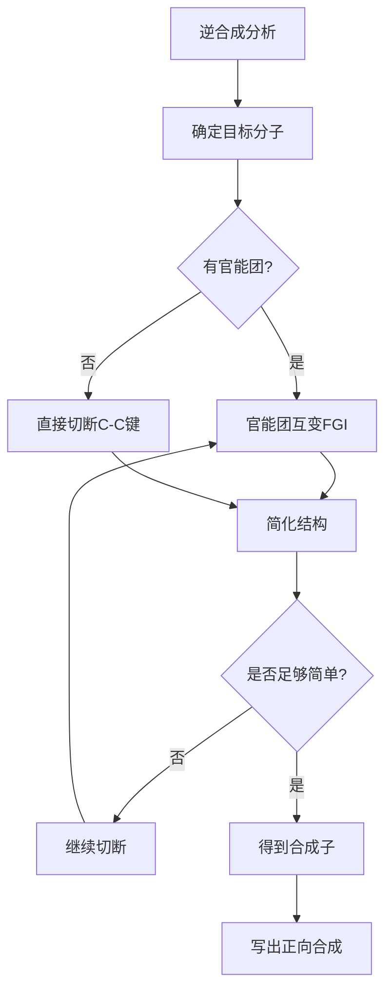
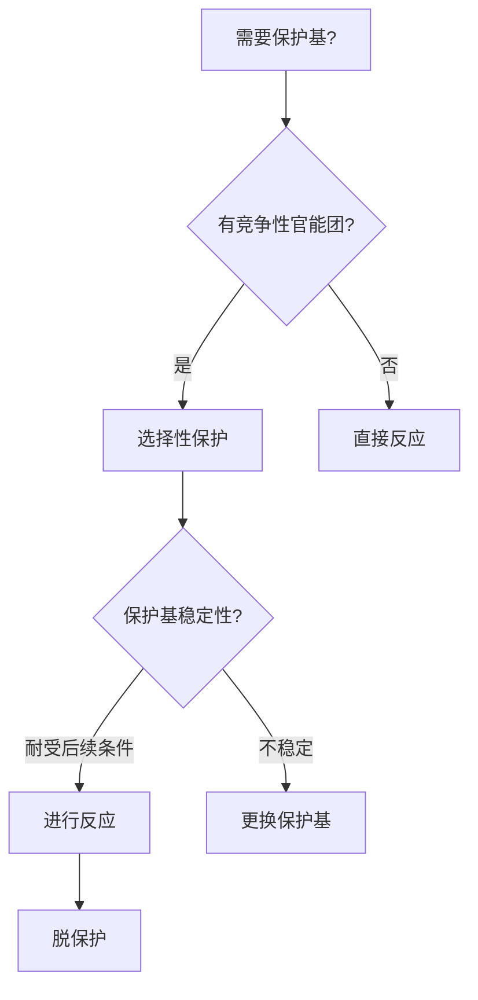

# 有机合成设计

> **定位**：有机合成设计是有机化学的核心应用，涵盖逆合成分析、保护基策略、官能团转化。本专题为"讲义抽料台"，可直接复制各板块到学生讲义。

---

## 一、核心结论

### 1.1 逆合成分析（来源：逆合成分析方法KP §二）

**核心思想**：从目标分子出发，通过**切断**（disconnection）将其分解为更简单的前体。

**切断原则**：
- 优先切断C-C键（简化碳骨架）
- 优先切断杂原子旁边的C-X键
- 利用**官能团互变**（FGI）简化结构

### 1.2 保护基策略（来源：保护基与官能团转化KP §二）

**常用保护基**：

| 官能团 | 保护基 | 保护条件 | 脱保护条件 |
|:---|:---|:---|:---|
| -OH | TBS（叔丁基二甲基硅基） | TBSCl, Imidazole | TBAF |
| -NH₂ | Boc（叔丁氧羰基） | Boc₂O, Et₃N | TFA或HCl/MeOH |
| -COOH | 甲酯 | CH₂N₂或MeOH/H⁺ | LiOH/H₂O |
| C=O | 1,3-二硫烷 | HSCH₂CH₂SH, BF₃ | Hg(ClO₄)₂ |

### 1.3 官能团转化（来源：有机合成(核心结论)§三）

**醇→卤代烃**：SOCl₂（构型翻转）、PBr₃（构型翻转）、HX（可能重排）

**醇→醛/酮**：PCC（温和氧化）、Swern氧化、Dess-Martin氧化

**醛/酮→醇**：NaBH₄（温和还原）、LiAlH₄（强还原）

### 1.4 合成策略（来源：有机合成(解题策略)§二）

**碳链增长方法**：
- Grignard反应：R-MgX + CO₂ → R-COOH
- Wittig反应：R₂C=O + Ph₃P=CHR' → R₂C=CHR'
- Aldol缩合：RCHO + R'CH₂CHO → β-羟基醛

---

## 二、决策路径

### 逆合成分析流程



### 保护基选择策略



---

## 三、对比表格

### 表1：Grignard反应类型

| 底物 | 产物 | 应用 |
|:---|:---|:---|
| R-MgX + HCHO | R-CH₂OH | 增加一个碳的伯醇 |
| R-MgX + R'CHO | R-CH(OH)R' | 仲醇 |
| R-MgX + R'COR'' | R-C(OH)(R')R'' | 叔醇 |
| R-MgX + CO₂ | R-COOH | 羧酸 |
| R-MgX + R'CN | R-COR' | 酮 |

### 表2：氧化剂选择

| 氧化剂 | 底物 | 产物 | 特点 |
|:---|:---|:---|:---|
| PCC | 伯醇 | 醛 | 温和，不继续氧化 |
| PDC | 伯醇 | 醛/酸 | 可控 |
| Jones试剂 | 伯醇 | 羧酸 | 强氧化 |
| Swern | 伯醇 | 醛 | 温和，条件温和 |
| Dess-Martin | 伯醇 | 醛 | 温和，选择性好 |

### 表3：还原剂选择

| 还原剂 | 底物 | 产物 | 特点 |
|:---|:---|:---|:---|
| NaBH₄ | 醛/酮 | 醇 | 温和，选择性好 |
| LiAlH₄ | 醛/酮/酯/酸 | 醇 | 强还原 |
| DIBAL-H | 酯 | 醛 | 可控 |
| H₂/Pd | 烯烃 | 烷烃 | 催化氢化 |
| Li/NH₃ | 炔烃 | 反式烯烃 | 还原 |

### 表4：碳链增长方法

| 方法 | 反应 | 产物 | 碳数变化 |
|:---|:---|:---|:---:|
| Grignard+CO₂ | R-MgX+CO₂ | R-COOH | +1 |
| Wittig | R₂C=O+Ph₃P=CHR' | R₂C=CHR' | +R' |
| Aldol | RCHO+R'CH₂CHO | β-羟基醛 | +R' |
| Claisen | RCOOR'+R'CH₂COOR'' | β-酮酯 | +R' |
| Michael | R₂C=CR'+R''CH₂COR''' | 1,5-二酮 | +R'' |

---

## 四、典型例题

### 例1：逆合成分析（来源：逆合成分析方法KP §五 典型例题1）

设计合成2-甲基环己酮的路线。

**解答**：
- **切断**：2-甲基环己酮 ← 环己酮 + CH₃I
- **正向合成**：
  1. 环己酮 + LDA → 烯醇锂
  2. 烯醇锂 + CH₃I → 2-甲基环己酮
- **备选**：环己酮 + CH₃MgBr → 1-甲基环己醇 → 氧化

### 例2：保护基应用（来源：题库 无对应题库）

设计合成4-羟基丁醛的路线。

**解答**：
- **问题**：-OH和-CHO都会与Grignard试剂反应
- **保护**：
  1. 4-羟基丁醛 + DHP/PPTS → THP保护的醇
  2. THP-O-(CH₂)₃-CHO + NaBH₄ → THP-O-(CH₂)₃-CH₂OH
  3. 脱保护：THP-O-(CH₂)₃-CH₂OH + HCl/MeOH → HO-(CH₂)₃-CH₂OH

### 例3：Grignard合成（来源：题库 无对应题库）

设计从溴苯合成二苯甲醇的路线。

**解答**：
- **切断**：二苯甲醇 ← PhMgBr + PhCHO
- **正向合成**：
  1. PhBr + Mg/Et₂O → PhMgBr
  2. PhMgBr + PhCHO → Ph₂CHOH
  3. 后处理：稀酸淬灭
- **验证**：二苯甲醇结构正确

### 例4：立体选择性合成（来源：题库 无对应题库）

设计合成(R)-2-丁醇的路线。

**解答**：
- **方法1**：不对称还原
  - 2-丁酮 + CBS催化剂 + BH₃ → (R)-2-丁醇
- **方法2**：酶拆分
  - 外消旋2-丁醇 + 脂肪酶 → (R)-2-丁醇（保留）+ (S)-乙酸丁酯（水解）
- **方法3**：手性辅基
  - 2-丁酮 + 手性噁唑烷酮 → 不对称烷基化 → 脱辅基

---

## 五、易错点预警

### 易错1：Grignard试剂的兼容性（来源：有机合成KP §四）

- Grignard试剂不能与含活泼氢的基团共存（-OH, -NH₂, -COOH）
- 需要先保护这些基团
- **陷阱**：直接用含-OH的底物制备Grignard试剂会失败

### 易错2：Wittig反应的立体选择性（来源：有机合成(解题策略)§三）

- 稳定叶立德（R为吸电子基）→ E-烯烃为主
- 不稳定叶立德（R为给电子基）→ Z-烯烃为主
- **陷阱**：不能假设Wittig反应只生成一种立体异构体

### 易错3：氧化剂的选择性（来源：有机合成(核心结论)§三）

- PCC氧化伯醇到醛（不继续氧化到酸）
- Jones试剂氧化伯醇直接到羧酸
- **陷阱**：选择错误的氧化剂会导致过度氧化

### 易错4：逆合成切断的位置

- 应优先切断能简化结构的键
- 避免切断会引入复杂性的键
- **陷阱**：不是所有C-C键都适合切断

### 易错5：保护基的正交性

- 不同保护基可以在不同条件下脱除
- **正交保护**：一个保护基的脱除条件不影响另一个
- **陷阱**：同时使用多个保护基时需要考虑正交性

### 易错6：Aldol缩合的区域选择性

- 不对称酮的Aldol反应可能在两个α-位发生
- 需要控制条件（动力学控制 vs 热力学控制）
- **陷阱**：不能假设Aldol缩合只在特定位置发生

### 易错7：合成路线的收敛性

- 线性合成：A→B→C→D（总产率=各步产率乘积）
- 收敛合成：A→B, C→D, B+D→E（总产率更高）
- **陷阱**：长路线的线性合成总产率极低

---

## 六、竞赛深化

### 6.1 不对称催化（来源：有机合成KP §六）

- **Sharpless环氧化**：烯丙醇→手性环氧醇
- **Sharpless双羟化**：烯烃→手性邻二醇
- **不对称氢化**：手性Rh/Ru催化剂

### 6.2 多步合成设计

- **汇聚式合成**：从两个片段分别合成，最后偶联
- **战略键分析**：识别分子中的"战略键"优先切断
- **官能团兼容性**：确保各步反应条件不破坏已有官能团

### 6.3 天然产物全合成

- **Woodward全合成**：维生素B₁₂
- **Corey全合成**：前列腺素
- **Kishi全合成**：海葵毒素

---

## 七、知识链接

**前置知识**
- [[有机反应机理]] → 反应类型基础
- [[官能团]] → 官能团性质

**后续知识**
- [[有机合成]] → 具体合成方法
- [[天然产物化学]] → 天然产物合成

**相关专题**
- [[专题-有机合成逆合成分析]]（逆合成分析详解）
- [[专题-有机合成与金属有机]]（金属有机合成）
- [[专题-人名反应系统归类]]（人名反应汇总）

---

## 八、题库索引

```dataview
TABLE difficulty AS "难度", tags AS "标签"
FROM "04-题库/有机化学"
WHERE contains(file.name, "合成") OR contains(file.name, "逆合成")
SORT file.name ASC
```
