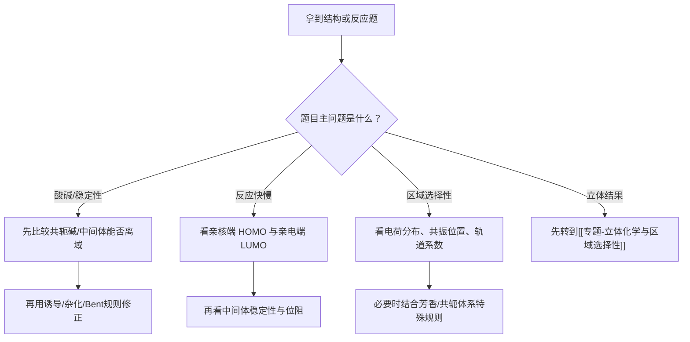

# 专题：有机结构基础与电子效应

> 2026-06-19 复核说明：本专题现已补齐教学洞察层，并与备课大纲、课堂执行页形成完整四层链路，状态由 `可用` 统一升为 `已审校`。

> 本专题对应考纲条目：[[21-共价键和共价分子]]、[[24-有机立体化学基础]]、[[35-有机酸碱概念]]
> 核心知识点：[[杂化轨道理论]]、[[Bent规则]]、[[共振论]]、[[Brønsted酸碱观点]]、[[前线轨道理论]]、[[诱导效应]]、[[共轭效应]]、[[超共轭效应]]

---

---

## 零点五、进阶导航 {#advance-navigation}

- 前置页：[[专题-有机分子结构初探]]
- 后续第三轮页：[[专题-立体化学与区域选择性]]、[[专题-活性中间体与反应机理基础]]、[[专题-加成反应]]、[[专题-亲核取代与消除反应]]、[[专题-芳香反应]]
- 并行工具页：[[专题-SN1与SN2比较]]、[[专题-取代与消除竞争]]
- 真题/收口页：[[专题-真题模拟拆解]]

## 零点六、课堂投影速查卡 {#classroom-quick-card}

**本页课堂入口：** 不要从"诱导效应的定义"开始讲。先让学生做一道 pKa 比较题，再反问"你为什么觉得这个更酸？"——从学生的直觉中引出电子效应语言。

**先问三个问题：**

1. 这道题在比什么？酸性/稳定性/反应快慢/区域选择性？
2. 主导稳定化来自哪里？共振离域 > 强吸电子诱导 > 超共轭 > 杂化修正
3. 需要升级到轨道语言吗？— 亲核/亲电/周环题 → 必须转 HOMO/LUMO

**一屏判断卡：**

```
有机结构题 → 先分题型
    ├─ 酸碱/稳定性 → 比共轭碱/中间体 → 找离域 → 补诱导/杂化修正
    ├─ 反应活性   → 定 HOMO(亲核) / LUMO(亲电) → 看轨道系数
    ├─ 区域选择   → 看电荷分布 + 共振位置 → 必要时补芳香规则
    └─ 立体结果   → 这不是本专题主战场 → 转到 [[专题-立体化学与区域选择性]]
```

**课堂固定口令：** ① 这是在比什么？② 主导稳定化来自哪里？③ 哪些因素只是修正项？

**五工具快查：**

| 看到… | 先用… | 口诀 |
|:---|:---|:---|
| pKa、酸性强弱 | 比共轭碱稳定性 → 找离域 | "酸强碱稳" |
| 碳正离子稳定性 | 先看共振 → 再数超共轭（烷基数） | "三级 ≠ 三倍 +I" |
| 亲核/亲电判断 | 定 HOMO/LUMO 归属 | "谁供谁受" |
| 定位效应 | 看共振给/吸 → 再看诱导修正 | "邻对位=共振说了算" |
| 芳环钝化但邻对位 | 卤素：+M 给电子共轭 + −I 吸电子诱导 | "推拉同时，推赢了方向" |

**本页最怕：** 把所有稳定化都说成"共振"；把烷基稳定碳正离子一律说成 +I；在需要轨道语言的题里仍停留在"谁带负电谁就进攻"。

## 一、专题定位：第三轮有机的语言层总入口 {#positioning}

- 这一专题不等于“把电子效应名词再背一遍”，而是把后续第三轮有机的判断语言先统一。
- 后续专题里常见的稳定性、酸碱性、活性、区域选择性与部分立体结果，几乎都要回到这一层来解释。
- 对照 [[第三轮总体备课框架]]，本专题是专题 1，后续专题 2-8 都会反复调用这里的语言。

**第三轮总判断句：**

```text
先分题型，
再找主导稳定化，
必要时转入 HOMO / LUMO 语言。
```

**后续调用关系：**

| 后续专题 | 本专题提供什么语言 |
|:---|:---|
| [[专题-立体化学与区域选择性]] | 先判断局部电荷分布，再决定“考位置还是考面” |
| [[专题-活性中间体与反应机理基础]] | 碳正离子 / 碳负离子 / 自由基稳定性比较 |
| [[专题-加成反应]] | 亲核端与亲电端的 HOMO/LUMO 匹配 |
| [[专题-亲核取代与消除反应]] | 离去倾向、碱性/亲核性、E2 立体电子要求 |
| [[专题-芳香反应]] | 芳环定位、活化/钝化、SNAr 位点选择 |

---

## 二、核心结论汇总 {#core-conclusions}

**必须记住：**

1. 诱导、共轭、超共轭不是平行名词表，而是三种不同的电子重新分配方式。
2. 稳定性判断先看“负电荷/正电荷/缺电子中心能否被分散”，再看吸拉或给电子修正。
3. 酸性比较的本质是比较共轭碱稳定性，而不是比较“谁更像酸”。
4. 反应活性和区域选择性，很多时候要进一步转成 [[前线轨道理论]] 的 HOMO / LUMO 语言。
5. [[共振论]] 是书写与比较语言，[[共轭效应]] / [[超共轭效应]] 是更接近成因的稳定化语言。

**第三轮最高频的五个工具：**

| 工具 | 主要回答什么问题 | 一句话抓手 |
|:---|:---|:---|
| [[诱导效应]] | 电性沿 σ 键如何传递 | 看近端吸拉、看距离衰减 |
| [[共轭效应]] | p 轨道离域如何改变化学性质 | 看共平面、看电荷能否铺开 |
| [[超共轭效应]] | 邻位 σ 轨道是否能参与离域 | 看相邻、看几何、看空轨道/π* |
| [[Brønsted酸碱观点]] | 酸碱与反应方向 | 看共轭酸碱对、看 pKa |
| [[前线轨道理论]] | 谁进攻谁、攻哪里 | 看 HOMO、LUMO 与系数 |

---

## 三、从题目到语言的总流程 {#overall-route}



**课堂固定口令：**

1. 这是在比什么？
2. 主导稳定化来自哪里？
3. 哪些因素只是修正项？

---

## 四、核心工具对比表 {#comparison-table}

| 语言工具 | 本质 | 典型触发题型 | 最常见例子 | 常见误判 |
|:---|:---|:---|:---|:---|
| 诱导效应 | σ 键极化传递 | 取代乙酸 pKa、吸电子强弱 | `CH3COOH / ClCH2COOH / CCl3COOH` | 忘记距离衰减 |
| 共轭效应 | 连续 p 轨道离域 | 苯酚酸性、芳环定位、共轭加成 | 苯酚 vs 环己醇 | 把“能画共振式”当成全部解释 |
| 超共轭效应 | σ 轨道向空轨道或 π* 离域 | 碳正离子、烯烃稳定性、E2 | 三级 > 二级 > 一级碳正离子 | 把烷基稳定化全说成 +I |
| 杂化 / Bent 规则 | s 成分影响电负性与成键 | 末端炔酸性、环丙烷酸性 | sp > sp2 > sp3 酸性 | 只背顺序不说原因 |
| HOMO / LUMO | 前线轨道匹配 | Diels-Alder、羰基加成、Michael 加成 | 谁是亲核端、谁是亲电端 | 只看电荷不看轨道 |

### 4.1 pKa 比较的统一框架（Zchem 六大因素）

> 来源：[[资料提炼-Zchem基础有机化学-批次Z-A到Z-E-结构与反应体系]] §8.1

当题目要求比较两种酸的强弱时，按以下优先级逐项检查：

| 优先级 | 因素 | 作用机制 | 典型示例 |
|:---:|:---|:---|:---|
| 1 | **电负性** | 与H直接相连原子的电负性越大，酸性越强 | H–OH (pKa~15) > H–NH₂ (pKa~38) |
| 2 | **诱导效应** | 吸电子基通过σ键传递稳定负离子；给电子基 destabilize | ClCH₂COOH (pKa~2.9) > CH₃COOH (pKa~4.8) |
| 3 | **杂化效应** | s成分越多，负离子越稳定（电子更靠近核） | 端炔 (pKa~25) > 烯烃 (pKa~44) > 烷烃 (pKa~50) |
| 4 | **电荷效应** | 正电荷增强酸性；负电荷减弱酸性 | H₃O⁺ (pKa~-1.7) > H₂O (pKa~15.7) |
| 5 | **离域/共振效应** | 负离子可通过共轭/共振分散 | 羧酸 (pKa~5) > 醇 (pKa~16) |
| 6 | **原子半径效应** | 大原子可更好分散负电荷 | H₂S (pKa~7) > H₂O (pKa~15.7) |

**课堂速记口诀**："电负诱导杂化电，离域半径共六条"

**使用顺序**：先比直接相连原子的电负性 → 再看诱导效应 → 再比杂化 → 再看电荷/离域/半径。多数竞赛题在前三项就能分出胜负。

---

## 五、第三轮解题套路 / 决策流程 {#problem-solving-routine}

### Step 1：先给问题分型

- **酸碱/稳定性题**：先比较去质子化后或形成中间体后的稳定化方式。
- **反应活性题**：先判断谁供电子、谁受电子。
- **区域选择题**：先判断哪个位点更能稳定过渡态或中间体。
- **立体题**：先承认这不是本专题主战场，再转到对应专题继续判断。

### Step 2：找主导稳定化机制

- 负电荷常优先看：**共振离域 > 强吸电子诱导修正 > 杂化修正**
- 正电荷常优先看：**共振离域 > 超共轭稳定 > 诱导修正**
- 中性分子活性常优先看：**共轭改变电子云分布 + FMO 匹配**

### Step 3：必要时升级为轨道语言

- 比较亲核体：谁的 HOMO 更高、更容易给电子
- 比较亲电体：谁的 LUMO 更低、更容易受电子
- 比较进攻位点：看哪个位置的 LUMO 系数更大，或进攻后形成的中间体更稳

### Step 4：最后再补修正项

- 位阻
- 芳香性得失
- 构象 / 共平面要求
- 反应条件导致的动力学 / 热力学分流

**第三轮快筛清单：**

| 题目关键词 | 第一反应 | 第二反应 |
|:---|:---|:---|
| `pKa`、酸性强弱 | 先看共轭碱稳不稳 | 再看诱导与杂化 |
| `稳定性顺序` | 先找离域 | 再分诱导/超共轭谁主导 |
| `亲核/亲电` | 先定 HOMO/LUMO | 再看位阻与溶剂 |
| `定位效应` | 先看共振给/吸电子 | 再看诱导修正 |
| `碳正/碳负/自由基` | 先看共振 | 再看超共轭 |

---

## 六、专题主干：五组高频判断 {#main-branches}

### 6.1 酸碱性：第三轮最稳的入口

- 酸性大小比较，本质上是在比其 **共轭碱稳定性**。
- `CH3COOH / ClCH2COOH / CCl3COOH` 中，卤素的 `-I` 使羧酸根更稳定，因此酸性增强。
- `苯酚 > 环己醇` 的关键不是“苯环高级”，而是苯氧负离子可共振离域，而环己氧负离子基本局域。
- `对硝基苯酚 > 苯酚`，是因为硝基提供额外的 `-M` 与 `-I` 稳定。

### 6.2 活性中间体稳定性：后续机理题的底盘

- **碳正离子**：优先看共振与超共轭，所以苄基/烯丙基通常优于单纯三级烷基。
- **自由基**：与碳正离子相似，也常受共振与超共轭稳定。
- **碳负离子**：与碳正离子判断方向相反，更偏爱吸电子诱导、共振离域与高 s 成分杂化。

### 6.3 芳环与共轭体系：区域选择性的先导层

- 给电子共轭基团常使邻对位电子云更富，吸电子共轭基团常使间位成为相对更可行路径。
- 卤素是典型“邻对位定位但整体钝化”，要用 `+M` 与 `-I` 同时解释，不能只用一句“特殊”带过。
- `α,β-不饱和羰基` 同时存在共轭与极化，所以既能发生 1,2 加成，也能发生 1,4 加成。

### 6.4 轨道语言：从“谁富电子”升级到“哪一轨道在相互作用”

- 亲核体常可视作 HOMO 提供者。
- 亲电体常可视作 LUMO 接受者。
- Diels-Alder、羰基加成、Michael 加成都能用这层语言统一。
- 当学生已经能用“电子富/贫”做粗判断时，第三轮要继续推进到“哪一端系数大、哪一侧更容易对接”。

### 6.5 杂化与 Bent 规则：小但关键的修正层

- `sp > sp2 > sp3` 酸性增强，是因为 s 成分高时电子更靠近原子核，负电荷更稳定。
- [[Bent规则]] 可以作为“为什么某些键表现出反常酸性/极化”的补充语言。
- 这部分不需要展开成独立大章，但在讲酸碱性、环张力与局部极化时很有价值。

---

## 七、机制视角：这套语言怎么进入反应题 {#mechanism-analysis}

| 反应场景 | 先看什么 | 主导语言 | 与后续专题衔接 |
|:---|:---|:---|:---|
| 羰基亲核加成 | C=O 哪端最缺电子 | `-I` + `π` 极化 + LUMO | [[专题-加成反应]] |
| SN1 / E1 | 中间体能否稳定 | 共振 / 超共轭 | [[专题-亲核取代与消除反应]] |
| E2 | 哪个 β-H 更容易被拿走 | 酸碱性 + 立体电子要求 | [[专题-亲核取代与消除反应]] |
| 芳香取代 | σ 复合物能否被稳定 | 共振 + 诱导 | [[专题-芳香反应]] |
| 共轭加成 | 进攻 1,2 还是 1,4 | 共轭 + FMO + 动热控制 | [[专题-加成反应]] |

**一句话概括：**

```text
第三轮反应题常见失误，
不是不会背机理，
而是不会把机理中的“哪一步最缺电子、哪一步最稳定”
翻译成电子效应语言。
```

---

## 八、典型例题串讲 {#typical-examples}

### 例题 1：取代乙酸酸性比较

**题目：** 比较 `CH3COOH / ClCH2COOH / CCl3COOH` 的酸性强弱。  
**思路：** 先比较去质子化后羧酸根稳定性，再看卤素 `-I` 强弱。  
**结论：** `CCl3COOH > ClCH2COOH > CH3COOH`。  
**教学抓手：** 诱导效应是“局部吸拉修正”，非常适合第三轮起手建立量感。

### 例题 2：苯酚、环己醇、对硝基苯酚酸性

**题目：** 比较三者酸性大小。  
**思路：** 先看阴离子是否共振离域，再看硝基的 `-M / -I` 加成稳定。  
**结论：** `对硝基苯酚 > 苯酚 > 环己醇`。  
**教学抓手：** 同时区分“有无共轭”与“共轭后是否继续被吸电子基稳定”。

### 例题 3：碳正离子稳定性比较

**题目：** 比较一级、二级、三级、苄基碳正离子稳定性。  
**思路：** 先找能否共振，再看超共轭供给数。  
**结论：** 一般是苄基/烯丙基优于单纯三级，三级优于二级优于一级。  
**教学抓手：** 把“烷基稳定化”从笼统的 `+I` 改讲成超共轭主导。

### 例题 4：Diels-Alder 中谁是亲电子一方

**题目：** 一个带给电子基的二烯与一个带吸电子基的烯烃反应，谁供 HOMO，谁供 LUMO？  
**思路：** 给电子基抬高二烯 HOMO，吸电子基降低烯烃 LUMO。  
**结论：** 常用正常电子需求模型：二烯供 HOMO，烯烃供 LUMO。  
**教学抓手：** 让学生第一次把“电子富/贫”翻译成轨道能级。

---

## 九、常见误区与纠偏 {#pitfalls}

1. 把所有稳定化都说成“共振”。
2. 把烷基稳定碳正离子的原因一律说成 `+I`。
3. 看到酸性题只看中心原子电负性，不比较共轭碱。
4. 用“邻对位/间位”直接报答案，不解释 σ 复合物稳定性差异。
5. 在需要轨道语言的题里，仍停留在“谁带负电谁就进攻”。

---

## 十、与第三轮备课框架的直接对应 {#framework-link}

| [[第三轮总体备课框架]] 提示项 | 本专题落实方式 |
|:---|:---|
| 有机分子轨道回顾：σ / π / 孤对，HOMO / LUMO | 作为第五工具，直接进入加成与周环判断 |
| 诱导效应 | 以取代乙酸 pKa 为最稳的教学入口 |
| 共轭效应 | 以苯酚酸性、芳环定位、共轭加成为主线 |
| 超共轭效应 | 以碳正离子稳定、E2 立体电子要求作桥接 |
| 共振论 | 作为书写语言与稳定性比较工具 |
| 有机酸碱理论 | 作为整专题最优先的题型入口 |

---

## 十一、关联知识点 {#related-kp}

- [[诱导效应]]
- [[共轭效应]]
- [[超共轭效应]]
- [[共振论]]
- [[Brønsted酸碱观点]]
- [[前线轨道理论]]
- [[杂化轨道理论]]
- [[Bent规则]]

## 十二、关联题型 {#related-problem-types}

- [[题型-稳定性比较]]
- [[题型-酸碱性判断]]
- [[题型-区域选择性判断]]
- [[题型-机理推断]]

## 十三、相关真题 {#related-exam-questions}

```dataview
TABLE file.name AS "文件名", year AS "年份", type AS "题型", difficulty AS "难度"
FROM "05-真题库"
WHERE contains(knowledge_points, "诱导效应")
   OR contains(knowledge_points, "共轭效应")
   OR contains(knowledge_points, "超共轭效应")
   OR contains(knowledge_points, "前线轨道理论")
SORT year DESC, difficulty ASC
```

### 真题使用建议

- 定位效应类真题（芳香取代、F-C）优先用，训练"共振给/吸→σ-复合物稳定→邻对位/间位"的完整判断链
- 碳正稳定性真题要从"超共轭 vs 共振谁主导"的角度讲，避免学生笼统归因于"+I"
- 电子效应语言需要在三处反复强化：pKa比较（酸强碱稳）、碳正稳定性（先找离域）、芳环定位（共振说了算）

### 推荐真题

| 真题 | 核心考点 | 难度 |
|:---|:---|:---:|
| [[真题-有机-芳香取代-001]] | 甲苯硝化的定位效应——共振供电子决定邻对位 | ⭐⭐ |
| [[真题-有机-碳正重排-001]] | 碳正离子重排方向——超共轭与共振的稳定化比较 | ⭐⭐⭐ |
| [[真题-有机-FriedelCrafts-001]] | F-C烷基化中的碳正重排——电子效应决定中间体命运 | ⭐⭐⭐ |
| [[真题-有机-亲电加成-001]] | 马氏规则——碳正稳定性作为电子效应的入门级应用 | ⭐⭐ |

### 真题链与讲评顺序

- `第 1 题`：[[真题-有机-亲电加成-001]]，马氏规则背后的碳正稳定性逻辑。课堂用途：warm-up
- `第 2 题`：[[真题-有机-芳香取代-001]]，从单分子稳定性升级到σ-复合物稳定性的共振语言。课堂用途：main
- `第 3 题`：[[真题-有机-碳正重排-001]]，综合超共轭与共振的稳定化比较，引入"主导稳定化来源"的判断。课堂用途：main
- `第 4 题`：[[真题-有机-FriedelCrafts-001]]，把碳正重排与芳环定位效应串联，训练电子效应语言在两套场景间的迁移。课堂用途：synthesis
- 课堂顺序建议：亲电加成(warm-up) → 芳香取代(main) → 碳正重排(main) → F-C综合(synthesis)

> 💡 **与备课大纲/速查卡的衔接**：这些真题已映射到对应备课大纲 §2.6 的认知台阶和速查卡 §十 的配套练习——教师可在三处交叉参考排题。

*本专题依据 [[模板-专题]] v1.7 生成。*
*第三轮定位：有机主干总入口，后续专题页和备课大纲应反复回链本页的“先分题型—找主导稳定化—必要时转轨道语言”三步法。*

> 📎 相关提炼：[[07-资料提炼/书籍提炼/提炼-ABOC-第2章-基本反应]] · [[07-资料提炼/书籍提炼/提炼-ABOC-第1章-绪论]]
