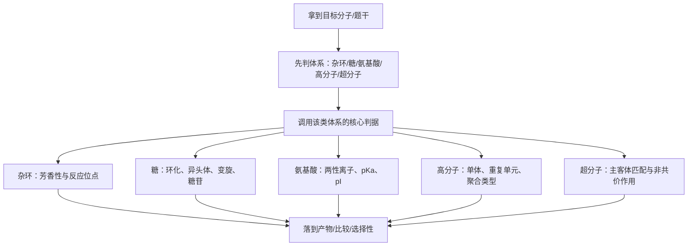

# 专题：杂原子与生物高分子

> 2026-06-19 复核说明：本专题现已补齐教学洞察层，并与备课大纲、课堂执行页形成完整四层链路，状态由 `可用` 统一升为 `已审校`。

> 本专题对应考纲条目：[[48-含氧有机物]]、[[52-杂环化合物]]、[[53-糖类]]、[[54-氨基酸]]、[[55-高分子]]、[[56-超分子]]
> 核心知识点：[[膦化合物]]、[[杂环化合物]]、[[杂环芳香性]]、[[糖类]]、[[氨基酸与等电点]]、[[高分子化学]]、[[超分子识别]]

---

## 零点五、进阶导航 {#advance-navigation}

- 前置页：[[专题-羰基化学与缩合反应]]、[[专题-芳香反应]]、[[专题-有机合成与金属有机]]
- 并行冲刺页：[[专题-高等有机机理与立体化学]]、[[专题-人名反应系统归类]]
- 真题/收口页：[[专题-真题模拟拆解]]

## 零点六、课堂投影速查卡 {#classroom-quick-card}

**本页课堂入口：** 先把“官能团识别层”和“生物大分子理解层”分开，不要讲成材料堆积。

**先问四个问题：**

1. 这题是在考官能团反应性、杂环电子结构，还是生物分子的识别与推断？
2. 关键信号来自局部官能团、杂原子参与共振，还是整体骨架特征？
3. 这道题更需要先认“像哪类分子”，还是先认“哪类位点最活泼”？
4. 最后答案是落到结构辨认、反应方向，还是生物功能推断？

**一屏判断卡：**

- 先分“小分子官能团题”和“大分子识别题”。
- 含杂原子题先看电子效应与共振，不先背特殊结论。
- 生物高分子题先抓单体连接方式，再谈性质和功能。
- 本页最怕讲成描述化学，必须回到“结构决定反应性/功能”。

## 一、专题定位：第三轮有机主干的“识别层与外延层” {#positioning}

- 如果说 [[专题-有机合成与金属有机]] 解决的是“路线怎么组织”，那么本专题解决的是“特殊骨架和生物分子怎样快速识别、比较、判断”。
- 这不是零散描述化学的拼盘，而是把第三轮常见的几类特殊体系统一收束：
  - 杂环为什么和苯不一样
  - 糖为什么总围着半缩醛、变旋、异头体打转
  - 氨基酸为什么总围着两性离子和等电点
  - 高分子为什么总是“单体反推 + 聚合类型判断”
  - 超分子为什么考“识别而不是成键”

**第三轮总判断句：**

```text
先辨认体系属于哪一类特殊骨架，
再调用对应的核心判据，
最后落到位置、构型、酸碱性、聚合类型或分子识别结果。
```

**与前面专题的衔接：**

| 关联专题 | 本专题怎么调用前面的内容 |
|:---|:---|
| [[专题-有机结构基础与电子效应]] | 用电子效应解释吡咯/吡啶、糖异头体和两性离子稳定性 |
| [[专题-芳香反应]] | 把苯环 SEAr 口径推广到五元/六元芳杂环 |
| [[专题-加成反应]] | 用半缩醛/缩醛语言理解糖环化与糖苷 |
| [[专题-有机合成与金属有机]] | 用膦化学、Wittig 来源与杂环合成的模块化视角衔接 |

---

## 二、核心结论汇总 {#core-conclusions}

1. 五元富电子芳杂环和六元缺电子芳杂环，反应逻辑几乎是两套系统。
2. 糖类第三轮最重要的不是背名字，而是抓住“开链-环状平衡、异头碳、变旋、糖苷键”。
3. 氨基酸部分最重要的不是结构记忆，而是“两性离子、等电点、酸碱位次判断”。
4. 高分子题最常考的是“从聚合物反推单体”和“区分加聚/缩聚/开环聚合”。
5. 超分子题核心不在形成共价键，而在主客体大小匹配、氢键、离子-偶极和疏水识别。

---

## 三、第三轮总流程 {#overall-route}



---

## 四、教学顺序：第三轮框架合并版 {#teaching-sequence}

### 4.1 先讲膦与杂环：从“电子结构差异”起步

- 膦是一头连着 [[Wittig反应]]、一头连着金属有机与配体语言的过渡站。
- 杂环则是本专题前半最核心的主干：用 `吡咯 / 呋喃 / 噻吩 / 吡啶` 建立五元富电子、六元缺电子的基本图景。

### 4.2 再讲糖类与氨基酸：从“生物分子识别”切入

- 糖的重点不是铺开所有天然产物，而是抓住：
  - 环化
  - 异头碳
  - 变旋
  - 糖苷键
- 氨基酸部分则抓：
  - 两性离子
  - `pKa`
  - 等电点
  - 肽键刚性与蛋白质的结构入口

### 4.3 糖类、氨基酸与聚合物核心工具（Zchem）

> 来源：[[资料提炼-Zchem基础有机化学-批次Z-G-综合复习与例题]] §3.3-3.5

**糖类判断三要素**：
- 开链Fischer投影 → 环状Haworth式 → α/β异构体判断
- **α/β规则**：半缩醛羟基与C6-CH₂OH在同侧为β，异侧为α（D-糖）
- **变旋光**：α/β异构体在水溶液中通过开链形式互变，达到旋光平衡

**氨基酸等电点**：
- pI = (pKa₁ + pKa₂)/2（中性氨基酸）
- pH > pI → 负离子 → 向阳极移动
- pH < pI → 正离子 → 向阴极移动

**聚合物合成类型判断**：

| 聚合类型 | 引发方式 | 典型单体 | 特征 |
|:---|:---|:---|:---|
| 自由基加聚 | 过氧化物/AIBN | 乙烯、苯乙烯、丙烯腈 | 链引发→增长→终止 |
| 阳离子加聚 | Lewis酸 | 异丁烯 | 碳正离子中间体 |
| 阴离子加聚 | 有机锂 | 苯乙烯、丁二烯 | 活性聚合 |
| 缩聚 | 加热+催化剂 | 尼龙66、涤纶 | 有小分子副产物 |

### 4.4 最后讲高分子与超分子：从”结构与识别”收束

- 高分子题常比学生想象得更“有机”：本质还是官能团、单体和反应类型判断。
- 超分子则是第三轮有机的外延层，用来让学生理解“非共价作用也能形成高度选择性”。

---

## 五、核心对比表 {#comparison-table}

| 模块 | 核心问题 | 第三轮常见考法 | 最易误判 |
|:---|:---|:---|:---|
| [[膦化合物]] | P 的亲核/碱性、与 Wittig 的关系 | 试剂来源、功能识别 | 把膦和胺完全等同 |
| [[杂环化合物]] | 五元/六元芳杂环反应性差异 | 芳香性、取代位点、碱性比较 | 直接照搬苯环口径 |
| [[糖类]] | 开链-环状平衡和异头体 | 变旋、还原性、糖苷键判断 | 只背 Fischer/Haworth 不会判断 |
| [[氨基酸与等电点]] | 两性离子与等电点 | `pI` 计算、酸碱比较 | 把 `pI` 当全部 `pKa` 平均 |
| [[高分子化学]] | 重复单元与聚合类型 | 单体反推、加聚/缩聚 | 看到长链就不会拆 |
| [[超分子识别]] | 主客体与非共价作用 | 冠醚/环糊精识别 | 还在找共价键变化 |

### 5.1 杂环快速对照

| 杂环 | 电子性质 | 亲电取代 | 亲核取代 | 第三轮抓手 |
|:---|:---|:---|:---|:---|
| 吡咯 | 富电子 | 易，常在 `C2` | 难 | N 孤对参与芳香性 |
| 呋喃 | 富电子 | 易，常在 `C2` | 难 | 芳香性较弱，可作 D-A 双烯 |
| 噻吩 | 富电子 | 易，常在 `C2` | 难 | 稳定性高于呋喃 |
| 吡啶 | 缺电子 | 较难 | 较易 | N 孤对不参与芳香性，可显碱性 |

### 5.2 糖类快速对照

| 判断对象 | 先看什么 | 常见结论 |
|:---|:---|:---|
| 是否有变旋 | 是否存在游离半缩醛/半缩酮 | 有游离异头羟基才会变旋 |
| 是否为还原糖 | 是否能开链露出羰基 | 游离异头碳常对应还原性 |
| 环化形式 | 五元还是六元 | 呋喃糖/吡喃糖并存需看稳定性 |
| 糖苷 | 异头羟基是否被“锁死”成缩醛 | 糖苷一般不再变旋 |

### 5.3 氨基酸与高分子快速对照

| 场景 | 第一步判断 | 高频结论 |
|:---|:---|:---|
| 氨基酸 `pI` | 找净电荷为 0 的两侧 `pKa` | 取那两个 `pKa` 平均 |
| 肽键性质 | 看酰胺共振 | 平面、刚性、转动受限 |
| 聚合物反推单体 | 先找重复单元断点 | 加聚断 `C-C`，缩聚断酯/酰胺等键 |
| 材料性质 | 看链间作用力与交联 | 氢键、芳环堆积、交联决定性能 |

### 5.4 竞赛加厚：本专题真正会把难度拉开的 5 条桥

| 桥梁 | 普通课常停在哪里 | 竞赛要继续走到哪里 | 本页课堂口径 |
|:---|:---|:---|:---|
| 杂环 | 只停在芳香性和位点选择 | 进一步连到合成入口与生物碱骨架识别 | 杂环既是“反应位点题”，也是“骨架来源题” |
| 糖类 | 只会 `Fischer/Haworth` 转换 | 补到异头效应、变旋平衡、糖苷锁定与材料性质 | 自由异头碳决定还原性和变旋，糖苷键决定“锁死” |
| 氨基酸 | 只会中性氨基酸 `pI` | 补到酸性/碱性侧链、缓冲区、电泳方向 | 先写净电荷变化，再选夹住 0 电荷的两个 `pKa` |
| 高分子 | 只会“单体反推” | 补到共价交联 vs 可逆超分子交联、链间作用力与性能 | 性能题先分“化学键骨架”还是“非共价网络” |
| 超分子 | 只背冠醚/环糊精名字 | 补到预组织、空腔匹配、模板效应、主客体热力学 | 不问“成没成键”，先问“认不认得住、为什么选这个客体” |

### 5.5 真题链与讲评顺序

| 课堂位置 | 推荐题 | 使用方式 | 主要目的 |
|:---|:---|:---|:---|
| 图后立刻练 | [[题-有机-杂原子-氨基酸等电点计算]] | 只要求先写净电荷变化，不急着算数 | 稳住 `pI` 的判断模板 |
| 讲后 1 题 | [[题-033-8-3-2-Fischer投影式|题-033-8-3-2]] | 先只做投影与构型识别，再追问环化后的异头体 | 把糖题从“画图题”接到立体化学 |
| 讲后 1 题 | [[题-038-4-2-胶束电荷pH范围|题-038-4-2]] | 只抓等电点、净电荷与聚集行为之间的联系 | 把生物分子题接到物化/自组装 |
| 压轴收口 | [[题-034-1-3-1-可循环聚合物结构式|题-034-1-3-1]] + [[题-034-1-3-2-氢键与热加工性能|题-034-1-3-2]] | 前题讲结构，后题讲四重氢键与材料性能 | 把“高分子 + 超分子”压成一条竞赛主线 |

---

## 六、第三轮解题套路 / 决策流程 {#problem-solving-routine}

1. 先判类：杂环、糖、氨基酸、高分子还是超分子。
2. 再调用该类体系的一号判据。
3. 再落到题目真正问的结果层：位点、构型、酸碱性、聚合类型或识别选择性。
4. 最后反查易错点：有没有误套普通苯环、普通醇、普通酸碱或普通合成口径。

---

## 七、主干内容：第三轮最常考的五条线 {#main-branches}

### 7.1 膦化学：从 Wittig 入口识别 P 有机

- 第三轮不深入膦配体电子参数，只讲清 `R3P` 的亲核/碱性、膦盐与叶立德、`PPh3` 的常见功能角色。

### 7.2 杂环化学：本专题前半主骨架

- 五元杂环抓“富电子、`α` 位活泼”。
- 六元氮杂环抓“缺电子、可作碱、亲核取代相对更重要”。

### 7.3 糖类：本专题中段最重要的结构识别

- 抓开链/环状平衡、异头碳、变旋、糖苷。

### 7.4 氨基酸与蛋白质：酸碱与结构入口

- 等电点是第三轮最可操作的算题点。
- 肽键刚性是蛋白质结构的最简入口。

### 7.5 高分子与超分子：第三轮外延收束

- 高分子强调“单体反推”和“聚合类型”。
- 超分子强调“识别而非成键”。

### 7.6 再往竞赛需求推进时，本专题最容易补薄的地方

- **杂环不应只讲“性质”，还要讲“从哪里长出来”**：
  - `Fischer吲哚 / Pictet-Spengler / Paal-Knorr / Larock` 这类名字不用全展开，但学生要知道杂环在竞赛里常是“合成结果”，不是独立孤岛。
- **糖题不应只停在命名和投影**：
  - 变旋、异头效应、糖苷锁定、`α-1,4` 与 `β-1,4` 对材料性质和酶识别的影响，才是真正把题拉开的一层。
- **高分子题不应只看重复单元**：
  - 竞赛越来越爱把 `动态共价/可逆氢键/主客体识别/自组装` 压进材料题，因此“键怎么连”之外，还得问“网络能不能重构”。

---

## 八、机制视角：为什么这一专题不能讲成描述化学 {#mechanism-analysis}

| 问题 | 如果按描述化学讲 | 第三轮更好的讲法 |
|:---|:---|:---|
| 杂环 | 背名字和人名反应 | 先讲电子结构和反应位点 |
| 糖类 | 背 D/L、α/β、各种投影 | 先讲半缩醛与异头碳 |
| 氨基酸 | 背 20 种天然氨基酸 | 先讲两性离子与 `pI` |
| 高分子 | 背材料用途 | 先讲重复单元和聚合机理 |
| 超分子 | 背冠醚和环糊精名字 | 先讲主客体匹配 |

---

## 九、典型例题串讲 {#typical-examples}

### 例题 1：吡咯 vs 吡啶

**题目：** 比较吡咯与吡啶的碱性和芳香取代倾向。  
**思路：** 看 N 孤对是否参与芳香性。  
**结论：** 吡啶更碱；吡咯更富电子，更易 SEAr。  

### 例题 2：葡萄糖是否变旋

**题目：** 比较葡萄糖、甲基葡萄糖苷的变旋能力。  
**思路：** 看异头羟基是否仍为半缩醛。  
**结论：** 游离半缩醛可变旋；糖苷被锁定后不变旋。  

### 例题 3：氨基酸等电点

**题目：** 已知某氨基酸三个 `pKa`，求 `pI`。  
**思路：** 先写不同 `pH` 下净电荷，锁定净电荷为 0 的区间。  
**结论：** 取夹住两性离子的两个 `pKa` 平均。  

### 例题 4：聚合物反推单体

**题目：** 给出重复单元，判断来自加聚还是缩聚并反推单体。  
**思路：** 看主链是否保留了酯/酰胺/醚等官能团。  
**结论：** 保留缩合官能团多为逐步聚合；纯碳链常是加聚。

---

## 六、关联知识点 {#related-kp}

- [[杂环化学]]——吡咯/呋喃/噻吩/吡啶的结构、芳香性与反应
- [[糖的构型与变旋]]——Fischer投影式、Haworth式、异头效应、变旋光
- [[氨基酸与等电点]]——20种常见氨基酸分类、pI计算、茚三酮反应
- [[蛋白质结构]]——一至四级结构、盐析/变性、Edman降解
- [[聚合物分类与合成]]——加聚/缩聚、热塑性/热固性、Ziegler-Natta催化剂
- [[超分子识别]]——冠醚/穴醚与碱金属阳离子的主客体匹配

## 七、关联题型 {#related-problem-types}

| 题型 | 核心能力 | 对应例题 |
|:---|:---|:---|
| 杂环酸碱性比较 | 判断N孤对是否参与芳香体系 | 例题1 |
| 糖类构型判断 | Fischer ↔ Haworth 转换、变旋判断 | 例题2 |
| 等电点计算 | 多级电离平衡下的净电荷分析 | 例题3 |
| 聚合物反推单体 | 加聚/缩聚识别、官能团保留分析 | 例题4 |
| 生物分子综合推断 | 多步反应序列中识别生物分子转化 | — |

## 七点五、真题链与讲评顺序 {#exam-sequence}

- `第 1 题`：先讲官能团/杂环识别题，稳住“电子效应决定反应位点”的主线。
- `第 2 题`：再讲糖类/氨基酸/核酸识别题，把“单体—连接—性质”框架立起来。
- `第 3 题`：最后讲综合题，把杂原子官能团和生物分子放进同一条结构推断链。
- 课堂顺序建议：`局部位点题 → 生物骨架题 → 综合识别题`，先给学生抓手，再进外延内容。

### 图后立刻练 / 讲后 1 题 / 课后 2 题

- 图后立刻练：给一题短题，只要求学生先判“这是官能团位点题还是生物骨架题”。
- 讲后 1 题：选一题包含杂原子共振或杂环电子结构的真题，完整说出位点判断依据。
- 课后 2 题：一题糖/氨基酸/核酸识别题，一题综合结构推断题，训练两条支线都能回看。

## 八、相关真题 {#related-exam-questions}

| 年份 | 题号 | 考点 | 难度 |
|:---|:---|:---|:---:|
| 2017 初赛 | — | 糖类变旋光与构型判断 | ⭐⭐⭐ |
| 2019 初赛 | — | 氨基酸等电点与电泳方向 | ⭐⭐ |
| 2020 初赛 | — | 杂环芳香性与亲电取代定位 | ⭐⭐⭐ |
| 2022 初赛 | — | 聚合物合成机理（加聚/缩聚判断） | ⭐⭐ |

*本专题依据 [[模板-专题]] v1.7 生成，状态：已审校。*  

> 📎 相关提炼：[[07-资料提炼/书籍提炼/提炼-Clayden-第30章-芳杂环合成]] · [[07-资料提炼/书籍提炼/提炼-Clayden-第42章-生命中的有机化学]]
