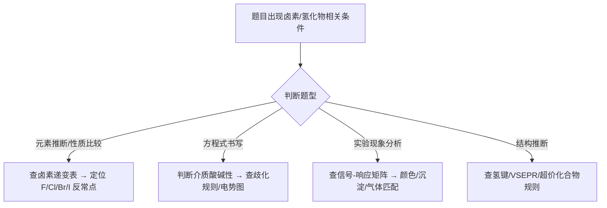
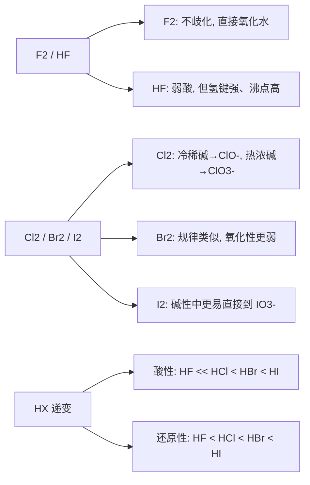
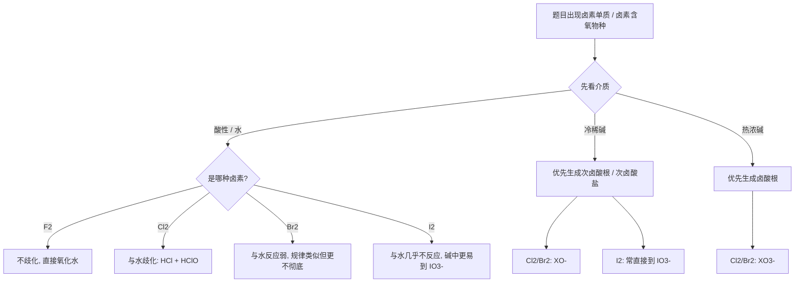
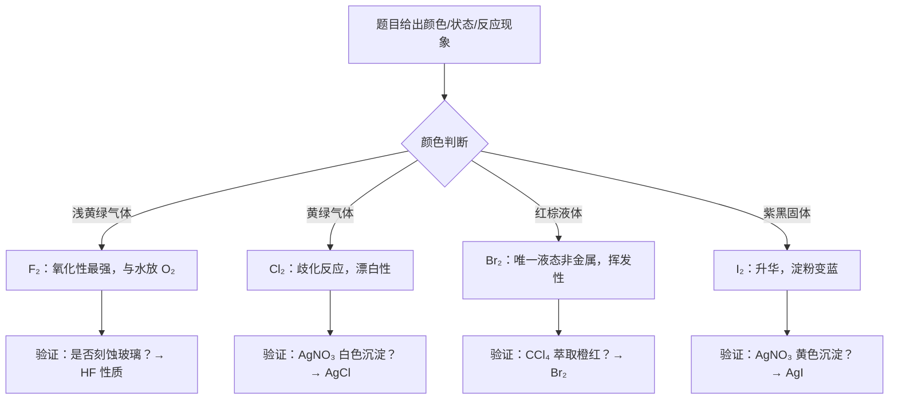

# 专题：氢与卤素

> 本专题对应考纲条目：[[13]]
> 核心知识点：[[氢]]、[[卤素]]、[[氢化物]]、[[卤化氢前体]]、[[氢键]]

---

## 零点五、进阶导航 {#advance-navigation}

- 前置页：[[专题-原子结构与元素周期律]]、[[专题-分子结构基础]]
- 同组第二轮元素化学执行页：[[专题-氧族与氮族元素]]、[[专题-碳族与硼族元素]]、[[专题-碱金属碱土金属与稀有气体]]
- 下游深化/收口页：[[专题-元素化学深度与结构推断综合]]、[[专题-真题模拟拆解]]

## 零点六、课堂投影速查卡 {#classroom-quick-card}

**本页课堂入口：** 先抓“反常点”和“介质条件”，不要一上来把同族递变背成一串表。

**先问四个问题：**

1. 题目是在考卤素递变、氢化物比较，还是歧化/含氧酸方程式？
2. 这里最关键的反常点是 `F2 / HF`，还是 `I2 / IO3-`？
3. 当前介质是酸性、冷稀碱，还是热浓碱？
4. 题目需要先凭颜色现象快判，还是要回到氧化态和结构解释？

**一屏判断卡：**

- 卤素题先记反常：`F2` 不歧化、氧化水；`HF` 弱酸但沸点异常高。
- 方程式题先判介质和温度，再决定生成 `ClO- / ClO3- / IO3-`。
- 氢化物题先分离子型、共价型、金属型，再谈酸碱和还原性。
- 课堂上先用 1 个“颜色-现象快判题”开，再回到递变本质。

## 一、核心结论汇总 {#core-conclusions}

**必须记住：**

1. **卤素单质性质递变规律**：F₂ → Cl₂ → Br₂ → I₂，氧化性递减，X⁻ 还原性递增；F₂ 因第二周期特殊性，与水反应为氧化水（2F₂ + 2H₂O → 4HF + O₂），而非歧化。
2. **氢化物三大类型**：离子型（NaH、CaH₂，H⁻ 为强碱/还原剂）、共价型（HX、H₂O、NH₃，HF 为弱酸是反常）、金属型（PdHₓ、LaNi₅H₆，储氢材料）。
3. **氢卤酸酸性反常**：HF（弱酸，K_a ~ 10⁻⁴）≪ HCl < HBr < HI（强酸），第二周期氢化物因氢键和特殊电子结构显著异于同族。
4. **卤素含氧酸规律**：酸性 HClO₄ > HClO₃ > HClO₂ > HClO；氧化性则相反（次氯酸氧化性最强）；Cl₂ 在碱性条件歧化（冷稀 → ClO⁻，热浓 → ClO₃⁻），酸性条件不歧化。
5. **F₂ 制备最特殊**：只能用特殊电解法（Moisson 法）或 Christe 化学法；Cl₂/Br₂/I₂ 制备难度递减，后两者可用 Cl₂ 氧化卤化物获得。

**最高频决策路径：**



## 一点二、课堂投影图：卤素反常点总览 {#teaching-figure-halogen-exceptions}



> **投影使用法**：先让学生只说“哪一支最反常”，再回头补充为什么反常，避免一开始把整族都讲散。

## 一点三、课堂投影图二：卤素介质判定决策树 {#teaching-figure-halogen-medium}



> **投影使用法**：这张图专门拿来讲“先判介质，再判产物”，适合放在方程式书写题前 2 分钟。

---

## 二、对比表格 {#comparison-table}

### 表 2-1：卤素单质性质递变表

| 触发条件（题目关键词） | 性质 | F₂ | Cl₂ | Br₂ | I₂ | 常见陷阱 |
|:---|:---|:---:|:---:|:---:|:---:|:---|
| "浅黄绿色气体"、氧化性最强 | 颜色/状态 | 浅黄气体 | 黄绿气体 | 红棕液体 | 紫黑固体 | Br₂ 是唯一液态非金属单质 |
| "制备方法"、电解法 | 工业制备 | 电解 KHF₂ | 电解食盐水 | Cl₂ 氧化 Br⁻ | Cl₂ 氧化 I⁻ | F₂ 不能用化学氧化法 |
| "与水反应"、"歧化" | 与水反应 | 氧化水（放 O₂） | 歧化（HCl + HClO） | 微弱歧化 | 几乎不反应 | F₂ 不歧化，直接氧化水 |
| "HX 酸性比较" | 对应 HX 酸性 | 弱酸（反常） | 强酸 | 强酸 | 最强酸 | HF 弱酸是第二周期特殊性 |
| "X⁻ 还原性" | 对应 X⁻ 还原性 | 极弱 | 弱 | 中等 | 强 | I⁻ 可被 Fe³⁺ 氧化，F⁻ 不能 |
| "含氧酸"、"氧化态" | 含氧酸种类 | 无（无正价） | HClO→HClO₄ | HBrO→HBrO₄ | HIO→H₅IO₆ | F 无含氧酸；高碘酸为 H₅IO₆ |

### 表 2-2：氢化物三大类型对比

| 触发条件（题目关键词） | 对比项 | 离子型（盐型） | 共价型（分子型） | 金属型（间充型） |
|:---|:---|:---|:---|:---|
| "活泼金属 + H₂"、"遇水放 H₂" | 成键性质 | 离子键（H⁻） | 共价键 | 金属键 + 填隙 |
| "NaH"、"CaH₂"、"LiAlH₄" | 典型例子 | NaH、CaH₂、LiH | H₂O、NH₃、HX | PdHₓ、LaNi₅H₆ |
| "还原剂"、"除水" | 化学性质 | H⁻ 强还原剂、强碱 | 酸性/碱性/中性 | 可逆吸放氢 |
| "储氢材料"、"间隙化合物" | 特殊应用 | 制备 LiAlH₄、NaBH₄ | — | LaNi₅H₆ 储氢 |
| "导电性判断" | 导电性 | 熔融态导电 | 不导电 | 导电（保持金属性） |

### 表 2-3：氢卤酸性质递变表

| 触发条件（题目关键词） | 性质 | HF | HCl | HBr | HI | 常见陷阱 |
|:---|:---|:---:|:---:|:---:|:---:|:---|
| "弱酸"、"氢键"、"刻蚀玻璃" | 酸性 | 弱酸（K_a≈6.6×10⁻⁴） | 强酸 | 强酸 | 最强 | HF 酸性弱于 HCl 是反常 |
| "热稳定性"、"分解温度" | 热稳定性 | 最高 | 高 | 中 | 低（易分解） | HI 受热分解为 H₂ + I₂ |
| "还原性"、"被氧化" | 还原性 | 极弱 | 弱 | 中等 | 强 | HI 可被浓 H₂SO₄ 氧化 |
| "沸点异常"、"氢键" | 沸点 | 20℃（氢键） | −85℃ | −67℃ | −35℃ | HF 沸点远高于 HCl |
| "与 SiO₂ 反应" | 特殊反应 | 刻蚀玻璃 | 不反应 | 不反应 | 不反应 | 必须用塑料/铅器皿盛 HF |

### 表 2-4：卤素歧化反应条件汇总（必背）

| 触发条件（题目关键词） | 卤素 | 冷稀碱 | 热浓碱 | 酸性条件 | 常见陷阱 |
|:---|:---|:---|:---|:---|:---|
| "通入冷NaOH"、"制备漂白液" | Cl₂ | Cl₂ + 2OH⁻ → Cl⁻ + ClO⁻ + H₂O | 3Cl₂ + 6OH⁻ → 5Cl⁻ + ClO₃⁻ + 3H₂O | 不歧化（E°右<E°左） | 温度决定产物：冷→ClO⁻，热→ClO₃⁻ |
| "通入冷NaOH"、"Br₂歧化" | Br₂ | Br₂ + 2OH⁻ → Br⁻ + BrO⁻ + H₂O | 3Br₂ + 6OH⁻ → 5Br⁻ + BrO₃⁻ + 3H₂O | 不歧化 | Br₂歧化倾向弱于Cl₂，但规律相同 |
| "通入冷NaOH"、"I₂歧化" | I₂ | 3I₂ + 6OH⁻ → 5I⁻ + IO₃⁻ + 3H₂O（常温即歧化到IO₃⁻） | 同左 | 不歧化 | I₂在碱性中歧化更彻底，直接到IO₃⁻ |
| "F₂与碱反应" | F₂ | 2F₂ + 2OH⁻ → 2F⁻ + OF₂ + H₂O（无正价，不歧化） | 同左 | 氧化水 | F₂无正氧化态，不发生歧化 |

> **记忆口诀**：冷稀碱 → 次卤酸根（ClO⁻/BrO⁻）；热浓碱 → 卤酸根（ClO₃⁻/BrO₃⁻）；I₂特殊，常温即到IO₃⁻。

### 表 2-5：卤素含氧酸酸性↑ vs 氧化性↓ 反向规律

| 触发条件（题目关键词） | 含氧酸 | 非羟基氧数 N | 酸性（pK_a） | 氧化性 | 典型还原产物 | 常见陷阱 |
|:---|:---|:---:|:---|:---|:---|:---|
| "最强含氧酸"、"无氧化性" | HClO₄ | 3 | 极强（pK_a≈−10） | 极弱（高温才反应） | Cl⁻ | 误以为酸性越强氧化性越强 |
| "氯酸"、"强氧化剂" | HClO₃ | 2 | 强（pK_a≈−1） | 强 | Cl⁻/Cl₂ | 与有机物混合易爆 |
| "亚氯酸"、"漂白" | HClO₂ | 1 | 中强（pK_a≈1.96） | 很强 | Cl⁻ | 不稳定，仅存于水溶液 |
| "次氯酸"、"漂白消毒" | HClO | 0 | 弱（pK_a≈7.5） | 最强 | Cl⁻ | 氧化性最强但酸性最弱 |
| "高溴酸"、"制备困难" | HBrO₄ | 3 | 强 | 强（比HClO₄强） | Br⁻ | HBrO₄氧化性反常地强 |
| "高碘酸"、"六配位" | H₅IO₆ | — | 弱（pK_a≈1.6） | 强 | I⁻/IO₃⁻ | 结构为(HO)₅IO，非正高碘酸 |

> **反向规律本质**：中心原子氧化态越高，O–X键越稳定（共价性增强），越难断裂释放氧化能力；同时非羟基氧数增加使酸性增强（Pauling规则）。

---

## 二点五、信号-响应速查矩阵（元素化学专用） {#sec-2-5}

> 元素化学专题的灵魂。把"实验现象"作为检索入口，替代"元素性质罗列"。

| 信号类型 | 具体现象 | 可能物种 | 验证操作 | 关联 KP | 典型真题 |
|:---:|:---|:---|:---|:---|:---|
| 颜色 | 浅黄绿色气体，氧化性极强 | F₂ | 使湿润 KI 淀粉试纸变蓝（氧化 I⁻） | [[卤素]] | 元素推断题 |
| 颜色 | 黄绿色气体，使石蕊先红后褪色 | Cl₂ | 通入 AgNO₃ 产生白色沉淀（AgCl） | [[卤素]] | 氯气制备与检验 |
| 颜色 | 红棕色液体，易挥发 | Br₂ | CCl₄ 萃取呈橙红色；AgBr 淡黄色沉淀 | [[卤素]] | 卤素置换反应 |
| 颜色 | 紫黑色固体，易升华，遇淀粉变蓝 | I₂ | CCl₄ 萃取呈紫红色；AgI 黄色沉淀 | [[卤素]] | 碘量法、淀粉指示剂 |
| 气体 | 遇水剧烈反应，产生 O₂ 和 HF | F₂ | 用排水法不能收集；需用铜制容器 | [[卤素]] | 氟的特殊反应 |
| 气体 | 遇水生成两种酸（一酸一漂白） | Cl₂ | 冷稀碱中歧化为 Cl⁻ + ClO⁻ | [[卤素]] | 84 消毒液制备 |
| 气体 | 刺激性气味，使品红褪色 | SO₂ | 与 Cl₂ 的不可逆漂白区分 | [[氧族元素]] | 硫的氧化物鉴别 |
| 沉淀 | AgF 可溶，AgCl/AgBr/AgI 难溶且颜色加深 | F⁻/Cl⁻/Br⁻/I⁻ | AgCl（白）→ AgBr（淡黄）→ AgI（黄）| [[卤素]] | 卤离子鉴别 |
| 沉淀 | 白色沉淀，溶于过量 NaOH | Be(OH)₂ / Al(OH)₃ | 加酸也溶→两性；Be焰色无/Al无焰色 | [[碱土金属]]、[[对角线规则]] | 鉴别 Be²⁺ 与 Mg²⁺ |
| 价态变化 | Mn(+7) 在 HF 介质中降至 +4 | K₂MnF₆ | 化学法制 F₂ 的原料 | [[卤素]] | 31届初赛 1-4 |
| 结构 | 直线形阴离子，中心 I 5 对电子 | I₃⁻ | sp³d 杂化，3c-4e 键 | [[卤素]]、[[杂化轨道理论]] | 39届初赛 4-2 |
| 储氢 | 可逆吸放氢，单位体积储氢量高 | LaNi₅H₆ | 低温高压吸氢，高温低压放氢 | [[氢]]、[[氢化物]] | 储氢材料题 |
| 还原反应 | 强还原剂，遇水放 H₂ | NaH、CaH₂、LiAlH₄ | 干燥保存，无水条件使用 | [[氢]]、[[氢化物]] | 有机还原剂选择 |
| 氢键 | 沸点异常高，冰密度 < 水 | H₂O、HF、NH₃ | 与同族氢化物对比 | [[氢键]] | 沸点比较题 |

> 填写原则：每一行必须对应到一道真题或教材经典题，确保信号不是"编造"的。

---

## 三、解题套路 / 决策流程 {#problem-solving-routine}

### 套路 A：卤素元素推断题



**检查清单：**
- ☐ 颜色与状态是否匹配卤素递变规律
- ☐ 是否考虑了 F₂ 的反常性（不歧化、氧化水）
- ☐ 验证实验是否唯一确定该卤素

### 套路 B：氢化物类型判断与性质比较

| 步骤 | 核心操作 | 依据 KP | 检查清单 |
|:---|:---|:---|:---|
| 1 | 判断氢化物类型：看与 H 成键的元素位置 | [[氢化物]] | ☐ IA/IIA 活泼金属 → 离子型；非金属 → 共价型；d/f 区金属 → 金属型 |
| 2 | 预测酸碱性：离子型 H⁻ 强碱；共价型看中心原子电负性 | [[氢化物]]、[[氢]] | ☐ 第二周期氢化物（HF、H₂O、NH₃）性质反常 |
| 3 | 预测还原性：同族从上到下递增（HF < HCl < HBr < HI） | [[氢化物]] | ☐ HI 可被浓 H₂SO₄ 氧化，HF 不能 |
| 4 | 预测热稳定性：同族从上到下递减（HF > HCl > HBr > HI） | [[氢化物]] | ☐ HI 受热易分解 |

### 套路 C：卤素含氧酸/歧化反应方程式书写

| 步骤 | 核心操作 | 依据 KP | 检查清单 |
|:---|:---|:---|:---|
| 1 | 判断介质：酸性 or 碱性？→ 查氯的元素电势图 | [[卤素]] | ☐ 介质已确认 ☐ 电势图方向正确 |
| 2 | 判断温度：冷稀碱 → ClO⁻；热浓碱 → ClO₃⁻ | [[卤素]] | ☐ 温度条件已标注 |
| 3 | 配平：歧化反应中氧化数升降相等 | [[氧化还原反应方程式配平]] | ☐ 氧化数变化计算正确 |
| 4 | 验证：酸性条件下 Cl₂ 不歧化（E°右 < E°左），逆向反应有利 | [[卤素]] | ☐ 酸性条件不歧化已确认 |

---

## 四、反应机理拆解（可选） {#mechanism-analysis}

> 本专题以元素性质和方程式为主，机理类内容较少。以下列出卤素相关的核心电子转移过程。

#### Cl₂ 在碱性条件下的歧化
- **攻击位点**：OH⁻ 进攻 Cl₂ 的 σ* 反键轨道
- **电子流**：Cl–Cl 键断裂，一个 Cl 被氧化（→ ClO⁻），一个被还原（→ Cl⁻）
- **检查表**：
  - ☐ 碱性条件确认
  - ☐ 冷稀 → ClO⁻；热浓 → ClO₃⁻
  - ☐ 电荷守恒

#### F₂ 氧化水的反应
- **攻击位点**：F₂ 的强氧化性直接氧化 H₂O 中的 O(−II)
- **电子流**：O(−II) → O(0)，F(0) → F(−I)
- **特殊性**：F₂ 不歧化，因为 F 无正氧化态

---

## 五、典型例题串讲 {#typical-examples}

### 例题 1：卤素单质制备与性质推断 ⭐⭐

**题目：**（改编自 31 届初赛 1-4 及卤素制备综合）

某无色气体 A 与水剧烈反应，生成一种有刺激性气味的气体 B 和一种弱酸 C。将气体 B 通入 KI 淀粉溶液，溶液变蓝。又知 A 的制备需采用特殊电解法，电解槽材料不能用普通金属。

(1) 推断 A、B、C 分别是什么物质。
(2) 写出 A 与水反应的化学方程式。
(3) 解释为什么 A 的制备不能用化学氧化法，且电解槽需用特殊材料。

**分析：**
- 关键信号 1："无色气体 + 与水剧烈反应 + 生成弱酸" → 联想到 F₂ → HF
- 关键信号 2："气体 B 使 KI 淀粉变蓝" → B 为 O₂（F₂ 氧化水放出 O₂，O₂ 不直接使淀粉变蓝，但此处实际应为 F₂ 氧化 I⁻ 生成 I₂ 使淀粉变蓝；题目描述为间接验证）
- 关键信号 3："特殊电解法" → F₂ 的制备特征（Moisson 法）
- 关键信号 4："不能用普通金属" → F₂ 腐蚀性极强，需用铜（生成 CuF₂ 保护膜）

**解答：**

(1) A 为 F₂，B 为 O₂，C 为 HF。

(2) 2F₂ + 2H₂O → 4HF + O₂

(3) F₂ 是最强的氧化剂，没有任何氧化剂可以将 F⁻ 氧化为 F₂，因此只能用电解法。F₂ 与几乎所有金属剧烈反应，但铜表面生成的 CuF₂ 保护膜可阻止进一步腐蚀，故电解槽用铜制。

**反思：**
- F₂ 的反常性：不歧化（无正价），直接氧化水
- 制备方法的唯一性：电解法是工业制 F₂ 的唯一途径（Christe 化学法为实验室法）
- 材料选择的特殊性：铜的"自钝化"现象

---

### 例题 2：多碘阴离子结构与键合 ⭐⭐⭐

**题目：**（39 届初赛第 4 题，节选改编）

碘离子可与 I₂ 结合生成 I₃⁻，继续加合 I₂ 生成 I₅⁻、I₇⁻ 等多碘阴离子。

(1) 直线形的 I₃⁻ 是最简单的多碘阴离子。写出位于中心的碘原子杂化形式。
(2) I₃⁻ 的 I–I 键长为 2.91 Å，而 I₂ 的 I–I 键长为 2.71 Å。利用某一个典型的有机反应过渡态解释 I₃⁻ 键长变长的原因。
(3) 按相同方法继续加合 I₂，写出 I₇⁻ 可能的异构体数目（不考虑顺反异构或构象异构）。

**分析：**
- 关键信号："多碘阴离子"、"直线形"、"键长变长" → 超价化合物、3c-4e 键
- 类比思维：I₃⁻ 可看作 I⁻ 进攻 I₂，类似 SN2 过渡态
- 结构枚举：I₅⁻ 有 V 型和 T 型两种，I₇⁻ 在此基础上继续加合

**解答：**

(1) 中心碘原子周围有 5 个价层电子对（2 个成键对 + 3 个孤对），采用 **sp³d 杂化**，3 个孤对位于三角双锥的平面位置，2 个成键对位于轴向，形成直线形。

(2) 类比 **SN2 反应过渡态**：I₃⁻ 可看作亲核试剂 I⁻ 进攻 I₂ 的 σ* 反键轨道，形成三中心四电子（3c-4e）键。反键轨道被占据 → I–I 键级降低 → 键长变长。

(3) **6 种**。推导：I₅⁻ 有 V 型（3 个进攻位点）和 T 型（4 个进攻位点）两种结构。V 型衍生 3 种 I₇⁻，T 型衍生 4 种 I₇⁻，但其中一种重复，故共 6 种。

**反思：**
- 超价化合物的杂化判断：不能简单用八隅体规则，需用扩展八隅体
- 3c-4e 键是理解卤素多原子离子的关键（I₃⁻、Cl₃⁻、Br₃⁻ 等类似）
- 结构枚举时注意去重，避免重复计数

---

## 五点五、真题链与讲评顺序 {#exam-sequence}

1. 先讲“卤素颜色/状态/现象快判”题，建立 `F/Cl/Br/I` 的最小识别框架。
2. 再讲“氢卤酸与氢化物比较”题，把 `HF` 反常、氢键与同族递变接起来。
3. 第三层讲“冷稀碱 / 热浓碱歧化”题，训练介质和温度触发的方程式书写。
4. 最后讲“含氧酸酸性 vs 氧化性反向规律”题，完成第二轮元素化学的解释闭环。

### 图后立刻练 / 讲后 1 题 / 课后 2 题

- 图后立刻练：给 4 个描述，只要求学生先判对应的是 `F2 / Cl2 / Br2 / I2` 中哪一个。
- 讲后 1 题：给一题卤素在不同碱性条件下的反应，只要求先写产物，不急着完整配平。
- 课后 2 题：一题氢卤酸性质比较；一题卤素歧化与含氧酸规律综合推断。

## 六、关联知识点 {#related-kp}

- [[氢]]
- [[卤素]]
- [[氢化物]]
- [[卤化氢前体]]
- [[氢键]]
- [[氢氧化物]]
- [[高价碘试剂]]
- [[高价金属氟化物水解]]
- [[杂化轨道理论]]
- [[氧化还原反应]]

---

## 七、关联题型 {#related-problem-types}

- [[题型-卤素反应规律]]
- [[题型-沸点比较]]
- [[题型-溶解度判断]]
- [[题型-机理推断]]
- [[题型-合成设计]]

---

## 八、相关真题 {#sec-8}

### 课堂精选真题三连

- **第 1 题：卤素颜色/状态快判题**
  课堂用途：开场 3 分钟热启动，只要求学生先锁定 `F/Cl/Br/I`，不展开机理。
- **第 2 题：冷稀碱/热浓碱歧化题**
  课堂用途：主讲题，用来压“介质 + 温度 → 产物”的决策顺序。
- **第 3 题：HF 反常 + 含氧酸规律综合题**
  课堂用途：收口题，把第二周期反常和“酸性/氧化性反向规律”放到同一张卷面上。

### 精选真题链使用建议

1. 先用“卤素颜色/状态快判题”做课堂热启动，只要求学生先锁定 `F/Cl/Br/I`。
2. 第二题切到“卤素在不同介质中的歧化/氧化还原”题，把冷稀碱、热浓碱、酸性条件压实。
3. 第三题再上“HF / 氢卤酸 / 氢化物比较”题，补足第二周期反常解释。
4. 若做习题课收口，最后选 1 题“含氧酸酸性-氧化性反向规律”综合题，逼学生从记现象转到会解释。

### 真题链推荐顺序

- `A组`：颜色/状态/基本推断题
- `B组`：歧化与介质条件方程式题
- `C组`：氢卤酸与氢化物性质比较题
- `D组`：含氧酸与结构/氧化性综合题

### 讲评提纲版：卤素歧化与介质条件题

**适合放在：** 第二轮提高班元素化学线中段，讲完卤素递变后、进含氧酸前。

**开口第一句：**
“这题不要急着写方程式，先只回答一句话：现在是酸性、水、冷稀碱，还是热浓碱？”

**课堂追问顺序：**

1. 先追问“反应环境是什么”。
2. 再追问“这时更可能生成次卤酸根还是卤酸根”。
3. 再追问“如果把 `Cl2` 换成 `I2`，这个判断还成立吗”。
4. 最后才让学生完整配平方程式，并解释为什么 `F2` 完全不能按这套走。

**板书骨架：**

- 第 1 行：介质条件分类
- 第 2 行：`Cl2 / Br2 / I2` 在不同条件下的产物总表
- 第 3 行：本题所处支路
- 第 4 行：完整方程式与电子转移检查

**收口提醒：**

- 学生最常错的不是配平，而是没先判介质。
- `I2` 在碱中的去向不能机械照搬 `Cl2`。
- 若课堂时间紧，这题只保“先判条件再写产物”的骨架，不必展开所有族内比较。

```dataview
TABLE file.name AS "文件名", year AS "年份", type AS "题型", difficulty AS "难度"
FROM "05-真题库"
WHERE contains(knowledge_points, "卤素") OR contains(knowledge_points, "氢") OR contains(knowledge_points, "氢化物") OR contains(knowledge_points, "氢键")
SORT year DESC, difficulty ASC
```

### 推荐真题 {#recommended-exam-questions}

| 真题 | 核心考点 | 难度 |
|:---|:---|:---:|
| [[真题-无机-元素推断-卤素-001]] | 卤素元素推断：从反应现象（颜色/状态/置换/歧化）反推 Cl/Br/I 化合物及介质条件 | ⭐⭐⭐⭐ |

> 涉及本专题的典型真题：
> - 39届初赛 4-2：多碘阴离子的结构与键合（⭐⭐⭐）
> - 39届初赛 4-1：碘量法测定 KI 浓度（⭐⭐）
> - 39届初赛 5-1/5-2：XeFₓ 晶胞与 XeOₓ 投影图（⭐⭐⭐）
> - 39届初赛 6-1/6-2：高压储氢与液相储氢（⭐⭐⭐）
> - 36届初赛第二场 4-1/4-2：碘化物滴定与互卤化物 ICl（⭐⭐⭐）
> - 36届初赛 7-1：Mg₂Fe 氢化物化学式与 H 原子数（⭐⭐）
> - 36届决赛理 1-7：卤化氢前体在合成中的应用（⭐⭐⭐）
> - 31届初赛 1-4：氟化锰制备方程式（化学法制 F₂ 的原料）（⭐⭐）

---

*本专题依据 [[模板-专题]] v1.7 生成，状态：精品。最后更新：2026-06-03。*

> 📎 相关提炼：[[07-资料提炼/书籍提炼/提炼-无机化学第6版-第11-18章-主族元素化学]]
