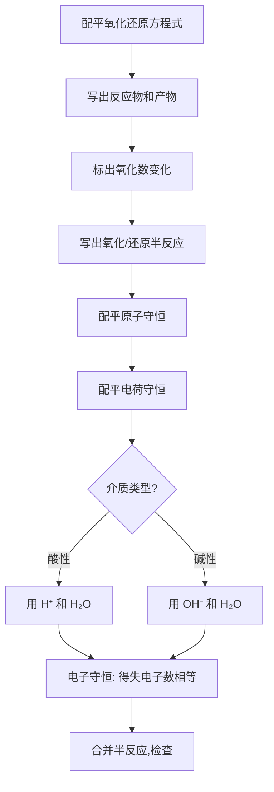
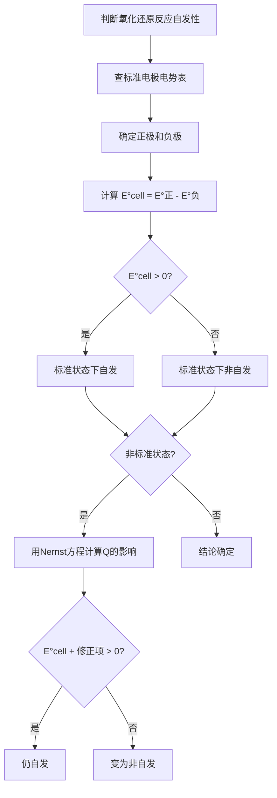

# 氧化还原与电化学

> **定位**：氧化还原与电化学是化学原理的核心内容，涵盖电极电势、Nernst方程、原电池与电解。本专题为"讲义抽料台"，可直接复制各板块到学生讲义。

---

## 一、核心结论

### 1.1 氧化数法配平三原则（来源：氧化还原反应方程式配平KP §三）

1. **电子守恒**：氧化剂得电子总数 = 还原剂失电子总数
2. **电荷守恒**：反应前后总电荷相等
3. **原子守恒**：各元素原子个数相等

### 1.2 标准电极电势的含义（来源：电极电势KP §二）

- **E° 越大**：氧化型越容易被还原（氧化性越强）
- **E° 越小**：还原型越容易被氧化（还原性越强）
- **标准电池电动势**：E°cell = E°(正极) - E°(负极) > 0 时反应自发
- **电极电势是强度性质**：不随方程式计量数变化

### 1.3 Nernst方程（来源：Nernst方程KP §二）

$$E = E° - \frac{RT}{nF}\ln Q = E° - \frac{0.0592}{n}\lg Q \quad (25°C)$$

- n：转移电子数
- Q：反应商（产物活度幂之积/反应物活度幂之积）

### 1.4 Latimer图判断歧化（来源：Latimer图KP §二）

- 若某氧化态**右侧 E° > 左侧 E°**，则该氧化态可发生歧化
- 歧化产物：左侧电对的还原型 + 右侧电对的氧化型

---

## 二、决策路径

### 氧化还原方程式配平流程



### 判断反应自发性



---

## 三、对比表格

### 表1：常见电极电势（25°C, 酸性介质）（来源：电极电势KP §三）

| 电极 | E°/V | 氧化型氧化性 | 还原型还原性 |
|:---|:---:|:---:|:---:|
| F₂/F⁻ | +2.87 | 极强 | 极弱 |
| MnO₄⁻/Mn²⁺ | +1.51 | 很强 | 很弱 |
| Cl₂/Cl⁻ | +1.36 | 强 | 弱 |
| Cr₂O₇²⁻/Cr³⁺ | +1.33 | 强 | 弱 |
| O₂/H₂O | +1.23 | 中等 | 中等 |
| Fe³⁺/Fe²⁺ | +0.77 | 中等 | 中等 |
| Cu²⁺/Cu | +0.34 | 弱 | 中等 |
| H⁺/H₂ | 0.00 | 基准 | 基准 |
| Pb²⁺/Pb | -0.13 | 弱 | 强 |
| Fe²⁺/Fe | -0.44 | 很弱 | 很强 |
| Zn²⁺/Zn | -0.76 | 极弱 | 强 |
| Na⁺/Na | -2.71 | 极弱 | 极强 |

### 表2：电极电势的影响因素（来源：Nernst方程KP §四）

| 因素 | 影响 | 示例 |
|:---|:---|:---|
| 氧化型浓度↑ | E↑ | 增加[Cu²⁺]，Cu²⁺/Cu电势升高 |
| 还原型浓度↑ | E↓ | 增加[Fe²⁺]，Fe³⁺/Fe²⁺电势降低 |
| 酸度↑ | 含氧酸根E↑ | KMnO₄在酸性中氧化性更强 |
| 沉淀形成 | E↓ | AgCl/Ag电势低于Ag⁺/Ag |
| 配合物形成 | 取决于配体 | EDTA使Fe³⁺/Fe²⁺电势降低 |

### 表3：原电池 vs 电解池（来源：氧化还原反应方程式配平KP §五）

| 特征 | 原电池 | 电解池 |
|:---|:---|:---|
| 能量转化 | 化学能→电能 | 电能→化学能 |
| 反应自发性 | 自发反应 | 非自发反应 |
| 负极/阴极 | 负极：氧化反应 | 阴极：还原反应 |
| 正极/阳极 | 正极：还原反应 | 阳极：氧化反应 |
| 电子流向 | 负极→正极 | 电源负极→阴极 |
| 应用 | 电池、燃料电池 | 电镀、冶炼、电解水 |

### 表4：配平方法对比

| 方法 | 适用范围 | 优点 | 缺点 |
|:---|:---|:---|:---|
| 氧化数法 | 所有氧化还原反应 | 通用 | 步骤较多 |
| 半反应法 | 离子反应 | 直观 | 需区分酸碱介质 |
| 离子-电子法 | 溶液反应 | 便于检查 | 仅限离子方程式 |

---

## 四、典型例题

### 例1：酸性介质配平（来源：氧化还原反应方程式配平KP §五 典型例题1）

配平以下酸性介质中的氧化还原反应：MnO₄⁻ + Fe²⁺ → Mn²⁺ + Fe³⁺

**解答**：
- 还原半反应：MnO₄⁻ + 8H⁺ + 5e⁻ → Mn²⁺ + 4H₂O（Mn：+7→+2，得5e⁻）
- 氧化半反应：Fe²⁺ → Fe³⁺ + e⁻（Fe：+2→+3，失1e⁻）
- 电子守恒：氧化半反应 ×5
- 总反应：**MnO₄⁻ + 5Fe²⁺ + 8H⁺ → Mn²⁺ + 5Fe³⁺ + 4H₂O**

### 例2：Nernst方程计算（来源：题库 07-14）

已知 E°(Cu²⁺/Cu) = +0.34 V，E°(Zn²⁺/Zn) = -0.76 V。计算 [Cu²⁺] = 0.01 mol/L、[Zn²⁺] = 1.0 mol/L 时 Daniell 电池的电动势。

**解答**：
- E°cell = 0.34 - (-0.76) = **1.10 V**
- Nernst方程：E = 1.10 - (0.0592/2) lg([Zn²⁺]/[Cu²⁺])
- E = 1.10 - 0.0296 × lg(1.0/0.01) = 1.10 - 0.0296 × 2 = **1.04 V**

### 例3：碱性介质配平（来源：题库 07-02）

配平碱性介质中的反应：MnO₄⁻ + ClO₂⁻ → MnO₂ + ClO₃⁻

**解答**：
- 还原半反应：MnO₄⁻ + 2H₂O + 3e⁻ → MnO₂ + 4OH⁻
- 氧化半反应：ClO₂⁻ + 2OH⁻ → ClO₃⁻ + H₂O + 2e⁻
- 电子守恒：还原×2，氧化×3
- 总反应：**2MnO₄⁻ + 3ClO₂⁻ + H₂O → 2MnO₂ + 3ClO₃⁻ + 2OH⁻**

### 例4：歧化反应判断（来源：题库 07-23）

根据 Latimer 图判断 Cu⁺ 在酸性水溶液中能否稳定存在。

```
Cu²⁺ +0.153V Cu⁺ +0.521V Cu
```

**解答**：
- Cu⁺ 右侧 E°(Cu⁺/Cu) = +0.521 V
- Cu⁺ 左侧 E°(Cu²⁺/Cu⁺) = +0.153 V
- 因为 0.521 > 0.153，所以 Cu⁺ **可发生歧化**：2Cu⁺ → Cu²⁺ + Cu
- 结论：Cu⁺ 在酸性水溶液中**不能稳定存在**

---

## 五、易错点预警

### 易错1：电极电势与计量数无关（来源：电极电势KP §五）

- 电极电势是**强度性质**
- 将半反应乘以系数（如 2Cu²⁺ + 4e⁻ → 2Cu），E° **不变**
- 但计算电池电动势时，n 必须与实际转移的电子数一致

### 易错2：Latimer图判断歧化方向出错（来源：Latimer图KP §五）

- 歧化反应中，某元素既被氧化又被还原
- 判断准则是看该氧化态**右侧的电对 E° 是否大于左侧**
- **陷阱**：不能简单比较两个 E° 的绝对值大小

### 易错3：酸碱介质搞混配平（来源：氧化还原反应方程式配平KP §六）

- 酸性介质用 H⁺ 和 H₂O 配平
- 碱性介质用 OH⁻ 和 H₂O
- **陷阱**：若产物在碱性条件下不能稳定存在（如 Fe³⁺ 在碱性中生成沉淀），需改用其他方法

### 易错4：E°值的温度依赖性

- 标准电极电势表通常给出 25°C 的值
- 温度变化会改变 E° 值
- **陷阱**：非25°C时不能直接用标准电极电势表

### 易错5：浓差电池的电动势

- 浓差电池两极材料相同，只是浓度不同
- E°cell = 0，但 E ≠ 0（因为 Q ≠ 1）
- **陷阱**：不能因为 E°cell = 0 就认为无电流

### 易错6：电极电势与平衡常数的关系

- ΔG° = -nFE° = -RT ln K
- K = 10^(nE°/0.0592)（25°C）
- **陷阱**：n 是配平后总反应的电子转移数，不是半反应的

### 易错7：电解池的反电动势

- 电解时外加电压必须大于反电动势才能发生电解
- 反电动势 = E°(阳极) - E°(阴极)（注意与原电池相反）
- **陷阱**：电解水时理论最小电压1.23V，实际需1.5~2V（超电势）

---

## 六、竞赛深化

### 6.1 Pourbaix图（E-pH图）（来源：氧化还原反应方程式配平KP §八）

- 横轴：pH，纵轴：E
- 区域：氧化型稳定区、还原型稳定区、水稳定区
- 线：平衡线（斜率与H⁺参与的电子数有关）
- **应用**：预测腐蚀倾向、选择电解条件

### 6.2 超电势与实际电解

- 理论分解电压 ≠ 实际分解电压
- 超电势来源：电极极化、浓差极化、电阻极化
- **影响**：电解水时，O₂ 在阳极的超电势约0.4~0.6V

### 6.3 电化学热力学与动力学

- E°cell > 0 只说明反应**热力学可行**
- 实际反应速率取决于**动力学因素**（活化能、电极材料等）
- **示例**：H₂ + O₂ → H₂O 的 E°cell = 1.23V，但无催化剂时反应极慢

---

## 七、知识链接

**前置知识**
- [[化学热力学]] → ΔG 与自发性
- [[化学平衡]] → 平衡常数概念

**后续知识**
- [[化学动力学初步]] → 反应速率与机理
- [[配位化学]] → 配位对电极电势的影响

**相关专题**
- [[专题-化学热力学]]（ΔG° = -nFE°）
- [[专题-配合物化学]]（配位对电极电势的影响）
- [[专题-物化综合计算]]（电化学综合计算）

---

## 八、题库索引

```dataview
TABLE difficulty AS "难度", tags AS "标签"
FROM "04-题库/化学原理/Ch07-电化学"
SORT file.name ASC
```
