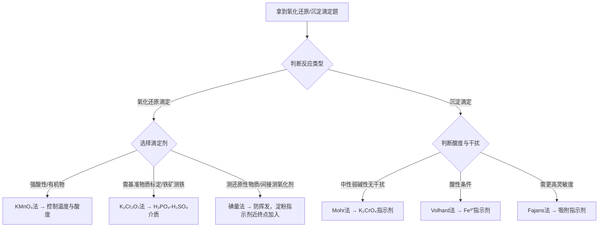

# 专题：氧化还原滴定与沉淀滴定

> 本专题对应考纲条目：[[18]]
> 核心知识点：[[ ]]、[[ ]]

---

## 零点五、进阶导航 {#advance-navigation}

- 前置页：[[专题-氧化还原与电化学]]、[[专题-定量化学分析]]
- 同组分析化学执行页：[[专题-容量分析基础与酸碱滴定]]、[[专题-络合滴定与重量分析]]、[[专题-误差处理与分光光度法]]
- 下游收口：[[专题-真题模拟拆解]]

## 零点六、课堂投影速查卡 {#classroom-quick-card}

**本页课堂入口：** 先判“方法为什么能用、介质为什么要控”，不要一上来就写总反应式。

**先问四个问题：**

1. 这是氧化还原滴定还是沉淀滴定，核心平衡是哪一个？
2. 当前介质是强酸、中性还是弱酸，能不能直接决定方法选择？
3. 题目更像“方法辨认题”、计量计算题，还是条件控制题？
4. 终点判断靠自身颜色、外加指示剂，还是返滴定差量？

**一屏判断卡：**

- 氧化还原先判电对和介质，沉淀滴定先判酸度和干扰。
- 间接法、返滴定题先写“谁是过量、谁来回滴”。
- `KMnO4`、碘量法、Mohr、Volhard 的酸碱窗口必须先卡死。
- 最后一眼检查“计量比 / 指示剂时机 / 特殊操作”。

## 一、核心结论汇总 {#core-conclusions}

> 用 1-3 句话概括本专题的"最大公约数"。
> 再加 1 条「最高频决策路径」。

**必须记住：**
氧化还原滴定的核心工具是条件电势 $\varphi' = \varphi° + \frac{RT}{zF}\ln\frac{\gamma_{Ox}\alpha_{Red}}{\gamma_{Red}\alpha_{Ox}}$，它将标准电势修正为实际介质中的有效电势。三种主要方法各有适用场景：KMnO₄法（强氧化剂，自身指示剂，需控制酸度）、K₂Cr₂O₇法（基准物质，稳定，需外加指示剂）、碘量法（间接测定还原性/氧化性物质，需防I₂挥发）。沉淀滴定中Mohr法（中性弱碱性，K₂CrO₄指示剂）、Volhard法（酸性，Fe³⁺指示剂）、Fajans法（吸附指示剂）的选择取决于溶液酸度和干扰离子。

**最高频决策路径：**



## 二、对比表格

> 专题页的灵魂。把分散在多个知识点中的信息横向对比。
> 新增「触发条件」列：告诉学生"题目出现什么关键词时"来查这一行。

| 触发条件（题目关键词） | 比较维度 | A | B | 常见陷阱 |
|:---|:---|:---|:---|:---|
| "条件电势""pH影响""介质影响" | 标准电势 vs 条件电势 | φ°：标准状态（a=1，特定介质）下的电势，可查表 | φ'：实际介质（考虑活度系数和副反应）中的有效电势 | 同一电对在不同pH下φ'可差1V以上（如H₃AsO₄/H₃AsO₃在pH=8时φ'=-0.12V，从+0.56V变来） |
| "KMnO₄法""高锰酸钾""COD""有机物氧化" | KMnO₄法特点与应用 | 强氧化剂，φ°=1.51V（酸性）；自身指示剂（粉红色）；可测Fe²⁺、H₂O₂、草酸盐、有机物 | 需控制酸度（0.5-1M H⁺）和温度（70-80℃）；不同pH还原产物不同 | 强碱中还原为MnO₄²⁻（0.56V），中性为MnO₂（0.59V）；Mn²⁺自催化；需用Na₂C₂O₄标定 |
| "K₂Cr₂O₇法""重铬酸钾""铁矿""测铁" | K₂Cr₂O₇法特点与应用 | 基准物质，可直接配制标准溶液；稳定；φ°=1.33V；常用二苯胺磺酸钠指示剂 | 需预还原Fe³⁺→Fe²⁺（SnCl₂）；加H₃PO₄与Fe³⁺配位降低φ(Fe³⁺/Fe²⁺)使突跃增大 | 含汞法（HgCl₂除过量Sn²⁺）有污染；无汞法（钨酸钠预还原）更环保；H₃PO₄作用常被忽视 |
| "碘量法""硫代硫酸钠""间接碘量""直接碘量" | 直接碘量法 vs 间接碘量法 | 直接法：I₂直接滴定强还原剂（φ°<0.54V），淀粉指示剂 | 间接法：氧化剂与I⁻反应生成I₂，再用Na₂S₂O₃滴定；应用更广 | I₂易挥发，需低温；淀粉近终点加入；Na₂S₂O₃需标定；注意计量关系（I₂:2S₂O₃²⁻=1:2） |
| "沉淀滴定""银量法""Mohr""Volhard""Fajans" | 三种银量法对比 | Mohr法：中性弱碱性，K₂CrO₄指示剂，直接滴定Cl⁻/Br⁻ | Volhard法：酸性（HNO₃），Fe³⁺指示剂，返滴定；Fajans法：吸附指示剂，pH与指示剂pKa相关 | Mohr法不能测I⁻/SCN⁻（沉淀吸附严重）；Volhard法可测I⁻/SCN⁻但需加硝基苯；Fajans法需控制pH使指示剂离子化 |
| "突跃范围""滴定曲线""对称电对" | 对称 vs 不对称电对滴定曲线 | 对称电对（如Fe³⁺/Fe²⁺，Ce⁴⁺/Ce³⁺）：SP电势=两条件电势平均值 | 不对称电对（如MnO₄⁻/Mn²⁺，Cr₂O₇²⁻/Cr³⁺）：SP电势与浓度有关，公式含系数 | 对称电对突跃范围：φ'₁+0.059×3/z₁ 到 φ'₂-0.059×3/z₂；不对称电对SP电势公式更复杂 |
| "条件溶度积""酸效应""硫化物溶解度" | Ksp vs K'sp | Ksp：理想状态溶度积 | K'sp = Ksp·αM·αA：考虑副反应后的条件溶度积 | 弱酸盐（如硫化物、草酸盐）在酸性介质中溶解度剧增；Ag₂S在pH=7时溶解度比Ksp计算大3个数量级 |

### 表2：碘量法 vs KMnO₄法 vs 莫尔法 vs Volhard法 四法对比

| 触发条件（题目关键词） | 比较维度 | 碘量法 | KMnO₄法 | 莫尔法（Mohr） | Volhard法 |
|:---|:---|:---|:---|:---|:---|
| "方法选择""滴定剂" | 滴定剂 | I₂（直接法）/ Na₂S₂O₃（间接法） | KMnO₄（自身氧化剂） | AgNO₃ | NH₄SCN（返滴定） |
| "指示剂""终点判断" | 指示剂原理 | 淀粉（与I₂形成蓝色包合物） | 自身指示剂（MnO₄⁻紫色→Mn²⁺无色） | K₂CrO₄（分步沉淀：AgCl白→Ag₂CrO₄砖红） | Fe³⁺（Fe³⁺ + SCN⁻ → FeSCN²⁺红色） |
| "酸碱性""pH控制" | 酸度条件 | 弱酸性或中性（防止S₂O₃²⁻分解） | 强酸性（0.5-1M H⁺，H₂SO₄介质） | 中性或弱碱性（pH 6.5-10.5） | 酸性（HNO₃介质，防止Fe³⁺水解） |
| "适用对象""测什么" | 测定对象 | 还原性物质（直接）/ 氧化性物质（间接） | Fe²⁺、H₂C₂O₄、H₂O₂、有机物 | Cl⁻、Br⁻（直接滴定） | Cl⁻、Br⁻、I⁻、SCN⁻（返滴定） |
| "计量关系""计算" | 核心计量比 | 间接法：氧化剂 ~ I₂ ~ 2S₂O₃²⁻ | MnO₄⁻ ~ 5Fe²⁺ / 2MnO₄⁻ ~ 5H₂C₂O₄ | Ag⁺ : Cl⁻ = 1 : 1 | Ag⁺(过量) - SCN⁻(返滴) = 与X⁻反应的Ag⁺ |
| "特殊操作""注意事项" | 关键操作 | 淀粉近终点加入；低温防I₂挥发；避光 | 70-80℃滴定H₂C₂O₄；Mn²⁺自催化 | 不能测I⁻/SCN⁻（吸附严重）；剧烈摇防AgCl吸附 | 返滴定逻辑：先加过量Ag⁺，再用SCN⁻滴剩余；测Cl⁻需加硝基苯 |

> **记忆口诀**：碘量看淀粉，高锰看颜色，莫尔看砖红，Volhard看血红；碘量中性弱酸，高锰必须强酸，莫尔中性弱碱，Volhard必须酸性。

### 表3：条件控制（酸碱性）速查表

| 触发条件（题目关键词） | 方法 | 必须酸/碱性 | 具体条件 | 原因/后果 | 违反后果 |
|:---|:---|:---:|:---|:---|:---|
| "KMnO₄滴定""酸性条件" | KMnO₄法 | 强酸性 | 0.5-1 mol/L H⁺（H₂SO₄） | 酸性下MnO₄⁻ → Mn²⁺（无色，唯一产物）；E°=1.51V | 中性/碱性生成MnO₂棕色沉淀或MnO₄²⁻绿色，产物不唯一，无法定量 |
| "碘量法""S₂O₃²⁻分解" | 碘量法 | 弱酸性或中性 | pH < 8（防止S₂O₃²⁻分解） | 酸性过强：S₂O₃²⁻ + 2H⁺ → S↓ + SO₂↑ + H₂O | 强酸性下S₂O₃²⁻分解，计量关系破坏；强碱性下I₂歧化：3I₂ + 6OH⁻ → 5I⁻ + IO₃⁻ + 3H₂O |
| "莫尔法""CrO₄²⁻" | 莫尔法 | 中性或弱碱性 | pH 6.5-10.5 | 酸性中CrO₄²⁻ → Cr₂O₇²⁻（指示剂失效）；碱性中Ag⁺ → Ag₂O↓ | pH<6.5：CrO₄²⁻质子化，终点延迟；pH>10.5：Ag₂O沉淀，结果偏高 |
| "Volhard法""Fe³⁺水解" | Volhard法 | 酸性 | 0.1-1 mol/L HNO₃ | 防止Fe³⁺水解：Fe³⁺ + 3H₂O ⇌ Fe(OH)₃↓ + 3H⁺ | 中性/碱性生成Fe(OH)₃红棕沉淀，指示剂失效，无法判断终点 |
| "K₂Cr₂O₇法""H₃PO₄" | K₂Cr₂O₇法 | 酸性（H₂SO₄-H₃PO₄混合酸） | H₂SO₄提供H⁺；H₃PO₄与Fe³⁺配位 | H₃PO₄降低φ(Fe³⁺/Fe²⁺)，增大突跃范围，使二苯胺磺酸钠变色点落入突跃 | 无H₃PO₄时突跃窄，指示剂变色在突跃外，终点误差大 |

### 表4：沉淀滴定分步沉淀/返滴定决策路径

| 触发条件（题目关键词） | 被测离子 | 方法选择 | 决策依据 | 操作要点 |
|:---|:---|:---|:---|:---|
| "Cl⁻/Br⁻""中性""直接滴定" | Cl⁻、Br⁻ | 莫尔法（直接滴定） | Ksp(AgCl)=1.77×10⁻¹⁰ < Ksp(Ag₂CrO₄)=1.12×10⁻¹²（注意：Ag₂CrO₄溶度积更小，但沉淀类型不同，实际AgCl先沉淀） | 用AgNO₃直接滴定，K₂CrO₄作指示剂；终点砖红色Ag₂CrO₄出现 |
| "I⁻/SCN⁻""吸附严重" | I⁻、SCN⁻ | Volhard法（返滴定） | AgI/AgSCN吸附I⁻/SCN⁻严重，莫尔法终点提前；Volhard法在酸性条件下避免吸附 | 先加过量AgNO₃，再用NH₄SCN返滴定剩余Ag⁺；Fe³⁺作指示剂 |
| "Cl⁻""返滴定" | Cl⁻（返滴定） | Volhard法（返滴定+硝基苯） | AgSCN溶度积(Ksp=1.07×10⁻¹²) < AgCl(Ksp=1.77×10⁻¹⁰)，SCN⁻会置换AgCl中的Cl⁻ | 必须加硝基苯包裹AgCl沉淀，防止SCN⁻与AgCl发生置换反应 |
| "混合卤素""分别测定" | Cl⁻+Br⁻混合 | 分步沉淀（莫尔法+控制条件）或电位滴定 | AgBr(Ksp=5.35×10⁻¹³) < AgCl(Ksp=1.77×10⁻¹⁰)，Br⁻先沉淀 | 竞赛中通常不考混合卤素分步滴定，了解原理即可；可用电位滴定分别判断两个终点 |
| "多种方法可选""方法比较" | 任意卤素离子 | 根据酸度和干扰选择 | 无干扰+中性→莫尔法；酸性条件→Volhard法；需更高灵敏度→Fajans法 | Fajans法需控制pH使指示剂离子化，吸附在沉淀表面变色；竞赛中较少涉及 |

> **决策路径**：判断被测离子 → 判断溶液酸度 → 判断是否有干扰 → 选择方法（莫尔直接/ Volhard返滴定）→ 确认特殊操作（硝基苯/加热/摇荡）。

---

## 二点五、信号-响应速查矩阵（元素化学/推断类专题专用，可选）

> 元素化学专题的灵魂。把"实验现象"作为检索入口，替代"元素性质罗列"。
> 非元素化学专题可直接删除本段。

> 本专题为分析化学定量计算专题，不涉及元素推断，此段不适用。

---

## 三、解题套路 / 决策流程

> 给出可执行的解题步骤或判断流程图。每一步必须链接到具体 KP，方便学生点击深入。
> 解题不是罗列公式，而是「条件判断 → 选择路径 → 执行操作 → 检查验证」的闭环。

### Step 1：判断氧化还原反应方向与完全程度
- **操作**：
  - 写出两个电对的半反应，确定氧化剂和还原剂
  - 查条件电势（或标准电势，若介质未指定），计算电池电动势 E = φ(+) - φ(-)
  - E > 0 反应正向进行；计算平衡常数 lgK = zE°/0.059（25℃）
  - 判断反应完全度：lgK ≥ 6（即K ≥ 10⁶）视为定量完成
- **依据 KP**：[[03-知识点/分析化学/氧化还原滴定]]
- **检查点**：☐ 半反应配平（电子守恒） ☐ 电势查表正确 ☐ E > 0确认反应方向

### Step 2：选择滴定方法并确定实验条件
- **操作**：
  - 根据被测物性质选择滴定剂：强还原剂→KMnO₄或Ce⁴⁺；需预还原的氧化剂→K₂Cr₂O₇法；间接测氧化剂→碘量法
  - 确定酸度：KMnO₄法需强酸性（0.5-1M H⁺）；K₂Cr₂O₇法常用H₂SO₄-H₃PO₄混合酸；碘量法弱酸性或中性
  - 确定指示剂：KMnO₄自身指示剂；K₂Cr₂O₇用二苯胺磺酸钠；碘量法用淀粉（近终点加入）
- **依据 KP**：[[03-知识点/分析化学/氧化还原滴定]]、[[03-知识点/分析化学/碘量法]]
- **检查点**：☐ 滴定剂选择匹配被测物 ☐ 酸度条件满足反应要求 ☐ 指示剂加入时机正确

### Step 3：建立计量关系并计算结果
- **操作**：
  - 写出配平的总反应方程式，确定计量比
  - 间接碘量法特别注意：氧化剂 ~ I₂ ~ 2S₂O₃²⁻ 的计量链
  - 返滴定法：先加过量标准溶液，再用另一标准溶液返滴定
  - 计算含量：考虑稀释倍数、取样量、空白校正
- **依据 KP**：[[03-知识点/分析化学/氧化还原滴定]]、[[03-知识点/分析化学/碘量法]]
- **检查点**：☐ 反应方程式配平正确 ☐ 计量比无误 ☐ 稀释倍数考虑周全

| 步骤 | 核心操作 | 依据 KP | 检查清单 |
|:---|:---|:---|:---|
| 1 | 判断反应方向与完全程度 | [[03-知识点/分析化学/氧化还原滴定]] | ☐ 半反应配平 ☐ 电势正确 ☐ E>0 |
| 2 | 选择方法并确定条件 | [[03-知识点/分析化学/氧化还原滴定]]、[[03-知识点/分析化学/碘量法]] | ☐ 滴定剂匹配 ☐ 酸度合适 ☐ 指示剂正确 |
| 3 | 建立计量关系并计算 | [[03-知识点/分析化学/氧化还原滴定]] | ☐ 方程式配平 ☐ 计量比正确 ☐ 稀释倍数 |

---

## 四、反应机理拆解（含检查表）（可选，机理类专题启用）

> 适用于有机反应、氧化还原电子转移、配合物晶体场等需要"箭头推动"或"分步推导"的专题。
> 非机理类专题可直接删除本段。

> 本专题为分析化学定量计算专题，不涉及反应机理推导，此段不适用。

---

## 五、典型例题串讲

> 每道例题必须覆盖一个"跨知识点的综合场景"。

### 例题 1：铜合金中铜的测定（间接碘量法）
**题目：**
称取铜合金样品0.5000 g，溶于酸后加入过量KI，析出的I₂用0.1000 mol/L Na₂S₂O₃滴定，消耗25.00 mL。计算样品中铜的质量分数。[数值据教材补全]

**分析：**
1. 反应原理：2Cu²⁺ + 4I⁻ = 2CuI↓ + I₂，再用Na₂S₂O₃滴定I₂
2. 计量关系：2Cu²⁺ ~ I₂ ~ 2S₂O₃²⁻，即Cu²⁺ : S₂O₃²⁻ = 1 : 1
3. 加入NH₄SCN使CuI转化为CuSCN，减少I₂的吸附

**解答：**
反应方程式：
$$2Cu^{2+} + 4I^- = 2CuI\downarrow + I_2$$
$$I_2 + 2S_2O_3^{2-} = 2I^- + S_4O_6^{2-}$$

计量关系：n(Cu²⁺) = n(S₂O₃²⁻)

$$n(Na_2S_2O_3) = 0.1000 \times 25.00 \times 10^{-3} = 2.500 \times 10^{-3} \text{ mol}$$

$$m(Cu) = 2.500 \times 10^{-3} \times 63.55 = 0.1589 \text{ g}$$

$$w(Cu) = \frac{0.1589}{0.5000} \times 100\% = 31.78\%$$

**反思：**
- 网课L4 27:16以此为例讲解间接碘量法，是竞赛经典题型。
- 关键操作：加入NH₄SCN使CuI→CuSCN，减少I₂吸附造成的负误差。
- 注意计量关系：虽然方程式中2Cu²⁺生成1I₂，但1I₂消耗2S₂O₃²⁻，最终Cu²⁺与S₂O₃²⁻为1:1。
- 常见错误：误认为Cu²⁺:S₂O₃²⁻=2:1或1:2；忽略CuI吸附I₂导致的系统误差。
- 若题目给出"加入NH₄SCN后滴定"，说明已考虑吸附校正。

### 例题 2：甲醛含量的测定（间接碘量法）
**题目：**
测定某甲醛溶液含量。取10.00 mL样品，加入过量I₂标准溶液（0.05000 mol/L，25.00 mL）和NaOH溶液，反应完全后酸化，用0.1000 mol/L Na₂S₂O₃滴定剩余I₂，消耗20.00 mL。计算甲醛浓度（g/L）。[数值据教材补全]

**分析：**
1. 反应原理：HCHO + I₂ + 3OH⁻ = HCOO⁻ + 2I⁻ + 2H₂O（碱性条件下）
2. 注意计量关系：HCHO : I₂ = 1 : 1（不是生成CO₃²⁻的1:2）
3. 加入的I₂总量 - 剩余的I₂ = 与HCHO反应的I₂

**解答：**
反应方程式：
$$HCHO + I_2 + 3OH^- = HCOO^- + 2I^- + 2H_2O$$

加入I₂总量：
$$n(I_2)_{总} = 0.05000 \times 25.00 \times 10^{-3} = 1.250 \times 10^{-3} \text{ mol}$$

剩余I₂（由Na₂S₂O₃滴定）：
$$n(I_2)_{剩余} = \frac{1}{2} \times 0.1000 \times 20.00 \times 10^{-3} = 1.000 \times 10^{-3} \text{ mol}$$

与HCHO反应的I₂：
$$n(I_2)_{反应} = 1.250 \times 10^{-3} - 1.000 \times 10^{-3} = 2.500 \times 10^{-4} \text{ mol}$$

$$n(HCHO) = 2.500 \times 10^{-4} \text{ mol}$$

$$m(HCHO) = 2.500 \times 10^{-4} \times 30.03 = 7.508 \times 10^{-3} \text{ g}$$

$$c(HCHO) = \frac{7.508 \times 10^{-3} \text{ g}}{10.00 \times 10^{-3} \text{ L}} = 0.7508 \text{ g/L}$$

**反思：**
- 网课L4 38:29以此例讲解有机物测定，特别强调"注意1:1计量（非生成CO₃²⁻）"。
- 常见错误：误认为甲醛被氧化为CO₃²⁻（需更强碱性且过量I₂），此时计量比为1:2。本题条件下产物为甲酸根HCOO⁻，计量比为1:1。
- 返滴定法的通用思路：加入过量标准溶液A，反应后用标准溶液B滴定剩余A。关键是准确建立A与B的计量关系。
- 若题目未明确产物，需根据反应条件判断。碱性较弱时生成甲酸根，强碱性且I₂过量时可能进一步氧化。

---

### 例题 4：间接碘量法测铜合金中的 Cu（周坤，⭐⭐⭐⭐）

**题目：**
用间接碘量法测定铜合金中 Cu 的含量。试样溶解后，在弱酸性介质中加入过量 KI：
$$\ce{2Cu^{2+} + 4I^- -> 2CuI v + I2}$$
生成的 I₂ 用 Na₂S₂O₃ 标准溶液滴定。为什么要在近终点时加入 KSCN？写出相关反应，并说明不加入 KSCN 会导致什么误差。

**分析：**
- Cu²⁺ 氧化 I⁻ 生成 I₂，但生成的 CuI 沉淀会吸附 I₂，导致终点提前、结果偏低。
- KSCN 的作用：将 CuI 转化为溶解度更小的 CuSCN，释放被吸附的 I₂。
- 注意：KSCN 必须在近终点时加入，否则 SCN⁻ 可能直接还原 Cu²⁺。

**解答：**
- **加入 KSCN 的反应**：
  $$\ce{CuI + SCN^- -> CuSCN v + I^-}$$
  CuSCN 的 K_sp 比 CuI 更小，转化反应定量向右进行。
- **作用机制**：
  1. CuI 沉淀对 I₂ 的吸附是主要的误差来源，导致 Na₂S₂O₃ 消耗减少，Cu 含量测定结果偏低。
  2. 加入 KSCN 后，CuI → CuSCN，沉淀表面结构改变，被吸附的 I₂ 释放出来，继续与 Na₂S₂O₃ 反应。
  3. 转化反应还减少了 CuI 对 I⁻ 的吸附，进一步降低误差。
- **加入时机**：必须在大部分 I₂ 被 Na₂S₂O₃ 滴定至近终点（溶液呈淡黄色）时加入。过早加入，SCN⁻ 可能还原 Cu²⁺；过晚加入，吸附损失已造成。

**反思：**
- 本题是竞赛高频考点，操作细节（近终点加 KSCN）决定准确度。
- 核心矛盾：CuI 吸附 I₂ → 误差；KSCN 转化 CuI → 消除吸附 → 准确。
- 类似思路：沉淀对指示剂或产物的吸附是滴定分析中常见的误差来源，需通过转化沉淀、加入保护胶体等方式消除。

---

### 例题 5：K₂Cr₂O₇ 法测定铁矿石中的全铁（周坤，⭐⭐⭐⭐）

**题目：**
用 K₂Cr₂O₇ 法测定铁矿石中全铁含量。试样经酸溶解后，先用 SnCl₂ 将 Fe³⁺ 还原为 Fe²⁺，过量 SnCl₂ 用 HgCl₂ 除去。然后在 H₃PO₄-H₂SO₄ 混合酸介质中，以二苯胺磺酸钠为指示剂，用 K₂Cr₂O₇ 标准溶液滴定 Fe²⁺。
(1) 写出滴定反应的离子方程式。
(2) 解释为何要在 H₃PO₄-H₂SO₄ 介质中滴定，H₃PO₄ 起什么作用？
(3) 若不加 H₃PO₄，对测定结果有何影响？

**分析：**
- K₂Cr₂O₇ 是基准物质，可直接配制标准溶液；在酸性介质中氧化 Fe²⁺。
- H₃PO₄ 的作用：与 Fe³⁺ 形成无色稳定的 [Fe(HPO₄)]⁺ 等配合物，降低 Fe³⁺/Fe²⁺ 电对的电极电势，使滴定突跃范围增大，指示剂变色点落在突跃范围内。
- 同时，Fe³⁺ 被掩蔽后呈无色，消除了 Fe³⁺ 黄色的干扰，便于观察终点。

**解答：**
(1) 滴定反应：
$$\ce{Cr2O7^{2-} + 6Fe^{2+} + 14H+ -> 2Cr^{3+} + 6Fe^{3+} + 7H2O}$$

(2) **H₃PO₄ 的双重作用**：
- **降低 Fe³⁺/Fe²⁺ 电对电势**：H₃PO₄ 与 Fe³⁺ 形成稳定配合物，使游离 Fe³⁺ 浓度降低。根据 Nernst 方程，E(Fe³⁺/Fe²⁺) 下降，滴定突跃范围增大。
- **消除 Fe³⁺ 颜色干扰**：Fe³⁺ 水合离子呈黄棕色，滴定终点时大量 Fe³⁺ 生成，颜色深，难以观察指示剂变色。H₃PO₄ 掩蔽 Fe³⁺ 后溶液近无色，便于判断终点。

(3) **不加 H₃PO₄ 的影响**：
- 突跃范围变小，二苯胺磺酸钠的变色点（E ≈ 0.85 V）可能落在突跃范围之外或边缘，导致终点提前，结果偏低。
- Fe³⁺ 的黄色干扰终点观察，增加判断误差。

**反思：**
- H₃PO₄ 在 K₂Cr₂O₇ 法测铁中的作用是典型的"配位掩蔽 + 电势调控"双重应用。
- 预还原步骤（SnCl₂ 还原 Fe³⁺）也是竞赛中可能涉及的氧化还原滴定前置操作。
- 注意：SnCl₂ 过量后必须用 HgCl₂ 除去（生成 Hg₂Cl₂ 白色丝状沉淀），否则 Sn²⁺ 也会消耗 K₂Cr₂O₇。

---

## 五点五、真题链与讲评顺序 {#exam-sequence}

1. 先讲“方法识别题”，让学生根据介质、被测对象和指示剂快速判 `KMnO4 / K2Cr2O7 / 碘量法 / Mohr / Volhard`。
2. 再讲“单一计量链题”，训练半反应配平、计量比和条件控制。
3. 第三层讲“间接碘量 / 返滴定”题，把“过量 - 剩余 = 反应量”的思路讲透。
4. 最后讲“特殊操作与误差来源”题，如淀粉加入时机、硝基苯包裹、CuI 吸附 I2。

### 图后立刻练 / 讲后 1 题 / 课后 2 题

- 图后立刻练：给 5 个实验场景，只要求学生先选方法并说出必须控制的酸碱条件。
- 讲后 1 题：给一题间接碘量法，只要求先写出完整计量链，不急着算最终含量。
- 课后 2 题：一题返滴定测卤离子；一题 `KMnO4 / K2Cr2O7` 条件比较与数据计算综合。

## 六、关联知识点

- [[03-知识点/分析化学/氧化还原滴定]]
- [[03-知识点/分析化学/碘量法]]
- [[03-知识点/分析化学/沉淀滴定]]
- [[03-知识点/分析化学/指示剂]]
- [[03-知识点/分析化学/误差]]
- [[03-知识点/分析化学/标准溶液]]
- [[03-知识点/分析化学/基准物质]]

## 七、关联题型

- [[题型-氧化还原滴定计算]]
- [[题型-沉淀滴定计算]]

---

## 八、相关真题 {#related-exam-questions}

```dataview
TABLE file.name AS "文件名", year AS "年份", type AS "题型", difficulty AS "难度"
FROM "05-真题库"
WHERE contains(knowledge_points, "氧化还原滴定") OR contains(knowledge_points, "碘量法") OR contains(knowledge_points, "沉淀滴定") OR contains(knowledge_points, "KMnO₄法")
SORT year DESC, difficulty ASC
```

---

*本专题依据 [[模板-专题]] v1.7 生成，状态：精品。*

---

## 九、相关课件与讲义

- [[07-资料提炼/教学逻辑提炼/分析化学/教学逻辑提炼-分析化学网课-配位氧化还原重量与光度法]]（本专题核心内容来源）

> 📎 相关提炼：[[07-资料提炼/书籍提炼/提炼-分析化学第六版-第7-10章-氧化还原沉淀重量与光度法]]
