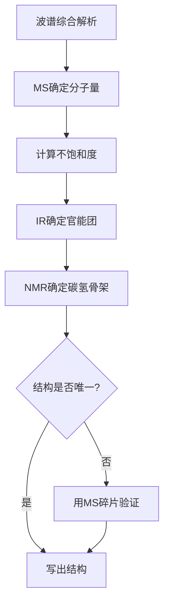
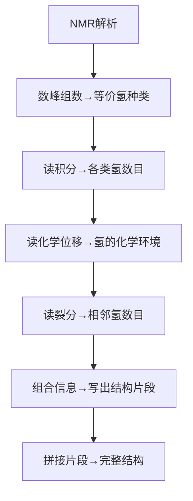

# 波谱分析综合

> **定位**：波谱分析是有机结构鉴定的核心方法，涵盖NMR、IR、MS。本专题为"讲义抽料台"，可直接复制各板块到学生讲义。

---

## 一、核心结论

### 1.1 ¹H NMR核心参数（来源：NMR谱学解析KP §二）

| 参数 | 意义 | 典型值 |
|:---|:---|:---|
| 化学位移δ | 氢的化学环境 | 0~14 ppm（TMS为0） |
| 积分面积 | 等价氢的数目比 | 直接读取 |
| 耦合常数J | 相邻氢的相互作用 | 6~8 Hz（自由旋转） |
| 裂分多重度 | n+1规律 | s, d, t, q, m |

**常见化学位移**：
- R-CH₃ (0.9) | R-CH₂-R (1.3) | C=C-H (5~6)
- Ar-H (6.5~8) | R-CHO (9~10) | R-COOH (10~12)

### 1.2 ¹³C NMR与DEPT（来源：NMR谱学解析KP §三）

- **宽带去偶¹³C NMR**：每个碳一条线，无法区分碳级数
- **DEPT-135**：CH和CH₃向上，CH₂向下，季碳消失
- **DEPT-90**：仅CH出现（向上）
- 化学位移范围宽（0~220 ppm）

### 1.3 IR红外光谱特征吸收（来源：红外光谱与质谱KP §二）

| 官能团 | 波数/cm⁻¹ | 特征 |
|:---|:---|:---|
| O-H（游离） | 3600~3650 | 尖峰 |
| O-H（缔合） | 3200~3550 | 宽峰 |
| N-H | 3300~3500 | 中等宽度 |
| C=O | 1650~1750 | 强峰，位置取决于类型 |
| C-O | 1000~1300 | 强峰 |
| C=C | 1600~1680 | 中等强度 |

**C=O细分**：酰氯~1800 | 酸酐~1760+1820 | 酯~1735 | 醛~1725 | 酮~1715 | 酸~1710 | 酰胺~1650

### 1.4 MS质谱关键信息（来源：红外光谱与质谱KP §三）

- **分子离子峰M⁺**：确定分子量（偶数N规则）
- **M+1峰**：¹³C贡献，可推算碳数（每碳约1.1%）
- **M+2峰**：含Cl(3:1)、Br(1:1)、S(4.5%)、Si(3.4%)时显著
- **碎片丢失规律**：M−15(CH₃) | M−18(H₂O) | M−29(CHO) | M−31(OCH₃) | M−44(CO₂)

---

## 二、决策路径

### 波谱综合解析流程



### NMR解析流程



---

## 三、对比表格

### 表1：¹H NMR化学位移速查

| 化学位移δ | 氢类型 | 典型化合物 |
|:---:|:---|:---|
| 0.9 | R-CH₃ | 烷烃 |
| 1.3 | R-CH₂-R | 烷烃 |
| 2.0~2.5 | R-CO-CH₃ | 酮/酯 |
| 3.3~3.9 | R-O-CH₃ | 醚/酯 |
| 4.5~6.5 | C=C-H | 烯烃 |
| 6.5~8.0 | Ar-H | 芳香族 |
| 9.0~10.0 | R-CHO | 醛 |
| 10.0~12.0 | R-COOH | 羧酸 |

### 表2：IR特征吸收速查

| 波数/cm⁻¹ | 官能团 | 特征 |
|:---|:---|:---|
| 3200~3600 | O-H, N-H | 宽/中等峰 |
| 3000~3100 | =C-H | 烯烃/芳香 |
| 2850~2960 | C-H | 烷烃 |
| 2100~2260 | C≡C, C≡N | 三键 |
| 1650~1750 | C=O | 强峰 |
| 1600~1680 | C=C | 中等强度 |

### 表3：MS碎片丢失规律

| 丢失碎片 | 质量损失 | 可能结构 |
|:---|:---:|:---|
| CH₃ | 15 | 甲基 |
| H₂O | 18 | 醇 |
| CHO | 29 | 醛 |
| OCH₃ | 31 | 甲酯 |
| CO₂ | 44 | 羧酸/酯 |
| C₂H₅ | 29 | 乙基 |

### 表4：不饱和度计算

| 公式 | 应用 |
|:---|:---|
| Ω = (2C+2+N-H)/2 | 含C、H、N、O的分子 |
| Ω = 1 | 一个双键或环 |
| Ω = 4 | 一个苯环 |
| Ω = 2 | 一个三键或两个双键 |

---

## 四、典型例题

### 例1：综合波谱解析（来源：综合波谱解析方法KP §五 典型例题1）

某化合物分子式C₄H₈O，IR在1720 cm⁻¹有强吸收，¹H NMR：δ 1.05 (3H, t), δ 2.45 (2H, q), δ 9.78 (1H, t)。推断结构。

**解答**：
1. **不饱和度**：Ω = (2×4+2−8)/2 = 1，有一个双键或环
2. **IR**：1720 cm⁻¹强吸收→C=O（醛或酮）
3. **NMR分析**：
   - δ 9.78 (1H, t)→醛基氢（−CHO），被相邻CH₂裂分为三重峰
   - δ 2.45 (2H, q)→α位CH₂，被CH₃裂分为四重峰
   - δ 1.05 (3H, t)→CH₃，被CH₂裂分为三重峰
4. **结论**：结构为**CH₃CH₂CHO（丙醛）**

### 例2：分子式确定（来源：题库 无对应题库）

某化合物的质谱：M⁺ = 72，IR在1715 cm⁻¹有强吸收，¹H NMR：δ 2.13 (3H, s), δ 2.45 (2H, t), δ 2.68 (2H, t)。推断结构。

**解答**：
1. **分子量**：72，偶数→不含N或含偶数N
2. **IR**：1715 cm⁻¹→C=O（酮）
3. **NMR分析**：
   - δ 2.13 (3H, s)→CH₃-CO-（甲基酮）
   - δ 2.45 (2H, t)和δ 2.68 (2H, t)→两个CH₂相邻
4. **结论**：CH₃COCH₂CH₂CH₃（2-戊酮）

### 例3：官能团鉴定（来源：题库 无对应题库）

某化合物的IR：3300 cm⁻¹（宽峰），1710 cm⁻¹（强峰）。判断可能的官能团。

**解答**：
- 3300 cm⁻¹宽峰→O-H（羧酸或醇）
- 1710 cm⁻¹强峰→C=O（羧酸或酮）
- 同时有O-H和C=O→**羧酸**（−COOH）
- 验证：羧酸的O-H在2500~3300 cm⁻¹有宽峰

### 例4：¹³C NMR解析（来源：题库 无对应题库）

某化合物分子式C₅H₁₀O，¹³C NMR有3条峰：δ 30, 210, 220。推断结构。

**解答**：
1. **不饱和度**：Ω = (2×5+2−10)/2 = 1
2. **¹³C NMR**：3条峰→分子有对称性
3. **化学位移**：
   - δ 210, 220→两个羰基碳
   - δ 30→烷基碳
4. **结论**：CH₃COCH₂COCH₃（2,4-戊二酮）

---

## 五、易错点预警

### 易错1：M⁺峰有时很弱或消失（来源：波谱分析KP §四）

- 醇、胺类分子离子峰可能看不到
- 需用CI或ESI软电离技术
- **陷阱**：不能因为看不到M⁺就认为分子量不确定

### 易错2：不要混淆溶剂峰和样品峰（来源：NMR谱学解析KP §五）

- CDCl₃在δ 7.26有残留CHCl₃峰
- D₂O在δ 4.79有HDO峰
- **陷阱**：溶剂峰可能被误认为样品峰

### 易错3：积分比是面积比不是峰高比（来源：波谱分析KP §五）

- 宽峰和尖峰的面积可能差别很大
- 积分曲线的高度比才是氢数目比
- **陷阱**：不能用峰高比代替积分比

### 易错4：IR的C=O位置不能单独定论（来源：红外光谱与质谱KP §四）

- C=O位置受共轭、氢键等因素影响
- 需要结合其他谱图综合判断
- **陷阱**：不能仅凭C=O位置确定化合物类型

### 易错5：n+1规律的例外

- 当耦合常数J很小时，裂分可能不明显
- 等价氢之间不产生裂分
- **陷阱**：不能机械套用n+1规律

### 易错6：DEPT谱的解读

- DEPT-135中季碳消失
- 不能将DEPT-135的"无峰"误认为"无碳"
- **陷阱**：需要结合宽带去偶¹³C NMR判断季碳

### 易错7：质谱中同位素峰的意义

- M+1峰主要来自¹³C
- M+2峰可能来自³⁷Cl、⁸¹Br、³⁴S
- **陷阱**：不能忽略同位素峰的信息

---

## 六、竞赛深化

### 6.1 2D NMR技术（来源：NMR谱学解析KP §七）

- **COSY**：¹H-¹H相关，显示耦合关系
- **HSQC**：¹H-¹³C直接相关
- **HMBC**：¹H-¹³C远程相关（2~3键）
- **应用**：复杂天然产物结构鉴定

### 6.2 高分辨质谱

- 精确测定分子量，确定分子式
- 分辨率 > 10000
- **应用**：区分分子量相近的化合物

### 6.3 圆二色谱（CD）

- 测定手性化合物的绝对构型
- **应用**：天然产物立体化学研究

---

## 七、知识链接

**前置知识**
- [[有机结构基础]] → 官能团、碳骨架
- [[分子结构]] → 化学键、空间结构

**后续知识**
- [[有机合成]] → 结构鉴定指导合成
- [[天然产物化学]] → 天然产物结构鉴定

**相关专题**
- [[专题-有机结构基础与电子效应]]（有机结构基础）
- [[专题-高等有机机理与立体化学]]（立体化学深化）

---

## 八、题库索引

```dataview
TABLE difficulty AS "难度", tags AS "标签"
FROM "04-题库/有机化学"
WHERE contains(file.name, "波谱") OR contains(file.name, "NMR") OR contains(file.name, "光谱")
SORT file.name ASC
```
