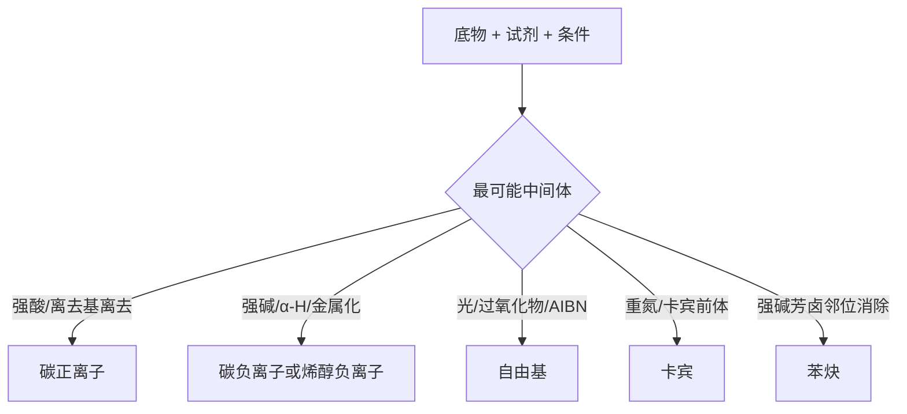

# 专题：活性中间体与反应机理基础

> 本专题对应考纲条目：[[31-自由基反应]]、[[32-有机反应中间体]]、[[33-重排反应基础]]、[[34-有机反应机理]]
> 核心知识点：[[碳正离子]]、[[碳负离子]]、[[自由基]]、[[卡宾]]、[[苯炔]]、[[过渡态]]

---

## 零点五、网课桥梁回流接口 {#source-bridge}

- 默认调用顺序：
  1. [[07-资料提炼/教学逻辑提炼/学而思 有机化学基础/教学逻辑提炼-学而思有机化学基础-批次B-SN与E及加成系统]]
  2. [[07-资料提炼/教学逻辑提炼/Zchem 有机反应合成与机理/教学逻辑提炼-Zchem-周环反应与活性中间体-第三轮]]
  3. [[07-资料提炼/教学逻辑提炼/Zchem 有机反应合成与机理/教学逻辑提炼-Zchem-物理有机与机理判断-第四轮]]

## 一、核心结论汇总 {#core-conclusions}

**必须记住：**
- 第三轮机理题的第一步，不是写箭头，而是先判断“当前体系最可能生成哪类中间体”。
- 碳正离子、碳负离子、自由基、卡宾、苯炔分别对应完全不同的选择性语言。
- 速控步、中间体稳定性、动力学/热力学控制要一起判断，不能拆开背。

**最高频决策路径：**



## 一点五、课堂投影速查卡 {#classroom-quick-card}

**本页课堂入口：** 先把“题目到底在逼你认哪个中间体”问清，再谈机理细节。

**先问四个问题：**

1. 条件更像强酸/强亲电、强碱、光/过氧化物，还是金属参与？
2. 关键步是断键先发生，还是进攻先发生，能否推出碳正离子/负离子/自由基/卡宾？
3. 中间体一旦确定，后续更可能走重排、消除、加成，还是偶联/插入？
4. 题目是在考“中间体是什么”，还是在考“为什么不是另一路”？

**一屏判断卡：**

- 先认赛道，再写箭头；不要在没有机理语言前直接猜产物。
- 中间体判断优先看生成条件，其次看稳定性，最后才看记忆性例外。
- 任何“重排/反马氏/异常区域选择性”都优先怀疑机理赛道切换。
- 课堂板书时把“证据”写在中间体旁边，避免机理看起来像背答案。

**讲后立刻练：**

- 先接一道“同底物不同条件，中间体不同”的对比题。
- 再接一道“有重排机会但未必发生”的解释题，练筛选证据。

---

## 二、对比表格 {#comparison-table}

| 触发条件（题目关键词） | 比较维度 | A | B | 常见陷阱 |
|----------------------|---------|---|---|---------|
| `重排` | 中间体类型 | 碳正离子常重排 | 自由基通常少重排 | 见重排就默认离子机理 |
| `AIBN`、`hv` | 机理语言 | 自由基链反应 | 非极性两电子过程 | 箭头还画成孤对电子推动 |
| `LDA`、`BuLi` | 中间体 | 碳负离子/烯醇负离子 | 非碳正离子 | 忘记位点选择性 |
| `重氮甲烷`、`Simmons-Smith` | 中间体 | 卡宾/类卡宾 | 非自由基 | 把环丙烷化画成亲电加成 |
| `苯炔` | 加成模式 | 邻位消除后亲核进攻 | 非 SNAr 常规 Meisenheimer | 混淆两类芳香亲核取代 |
| `重排后更稳定` | 命运判断 | 离子中间体更常重排 | 协同机理不一定经历可重排中间体 | “能重排”与“必须重排”不分 |
| `速率决定步` | 证据类型 | 看最高能垒 | 非看最终产物最不稳定 | 把中间体稳定性直接等同于速率 |

### 2.1 中间体识别速查

| 条件信号 | 优先联想到的中间体 | 典型后果 |
|:---|:---|:---|
| 强酸 + 好离去基 | 碳正离子 | 重排、SN1/E1 竞争 |
| 强碱 + α-H | 烯醇负离子/碳负离子 | α 位反应、缩合、烷基化 |
| 光照 / 过氧化物 / AIBN | 自由基 | 链反应、反马氏、抽氢 |
| 重氮前体 / Zn(Cu)CH2I2 | 卡宾/类卡宾 | 环丙烷化、插入 |
| 芳卤 + 极强碱 | 苯炔 | 非常规芳香亲核加成 |

## 二点五、Zchem 二次抽料：证据筛中间体的四个按钮

| 按钮 | 课堂先抓什么证据 | 典型信号 | 对应判断 |
|:---|:---|:---|:---|
| 条件信号 | 酸碱、光照、金属、离去基 | `hv`、`AIBN`、强酸、强碱、重氮 | 先把机理赛道缩到 1-2 类 |
| 中间体稳定性 | 共振、超共轭、芳香性、应变释放 | 烯丙/苄位、三级中心、烯醇负离子 | 判断哪类中间体更可能形成和存活 |
| 链式或协同特征 | 是否需要持续传递或一步协同 | 引发/增长/终止、周环立体保真 | 排除“看起来能写但赛道不对”的机理 |
| 实验或数据证据 | 速率、同位素、捕获产物、副产物 | 重排、抑制剂、立体专一性、Hammett | 把“会不会”提升成“凭什么是它” |

## 三、解题套路 / 决策流程 {#problem-solving-routine}

### Step 1：先由条件识别中间体类型
- **操作**：从试剂、光照、酸碱性、离去基、金属化条件反推中间体。
- **依据 KP**：[[碳正离子]]、[[碳负离子]]、[[自由基]]、[[卡宾]]
- **检查点**：☐ 中间体类型唯一化 ☐ 没有同时乱套两套机理

### Step 2：判断稳定化与后续命运
- **操作**：判断是否共振稳定、是否会重排、是否会链增长、是否会双位点反应。
- **依据 KP**：[[共轭效应]]、[[自由基]]、[[重排反应]]
- **检查点**：☐ 已判断是否重排 ☐ 已判断反应终点

### Step 3：再书写箭头推动或链式步骤
- **操作**：离子机理用双电子箭头，自由基机理用单电子鱼钩箭头。
- **依据 KP**：[[反应机理表示法]]
- **检查点**：☐ 箭头类型正确 ☐ 电荷或未成对电子守恒

### Step 4：最后把“中间体判断”转成“产物预测”
- **操作**：判断该中间体最容易被谁捕获、是否重排、是否继续增长。
- **依据 KP**：[[重排反应]]、[[自由基]]、[[碳正离子]]
- **检查点**：☐ 中间体命运明确 ☐ 主产物不是拍脑袋得出

## 四、反应机理拆解（含检查表）（可选，机理类专题启用） {#mechanism-analysis}

#### 步骤 1：识别中间体生成步
- **攻击位点**：依具体机理而定
- **形成键**：离子/自由基/卡宾前体生成
- **断裂键**：通常是 C-LG、H-X 或 N2 离去
- **学生任务（接力点）**：下一位同学需要判断的是速控步还是后续快步
- **检查表**：
  - ☐ 已区分中间体和过渡态
  - ☐ 已说明中间体为什么能形成
  - ☐ 已判断是否允许重排

#### 步骤 2：判断中间体命运
- **攻击位点**：中间体高电子密度或缺电子中心
- **形成键**：捕获键、重排后新 σ 键或链增长键
- **断裂键**：迁移、终止或消除相关键
- **学生任务（接力点）**：下一位同学需要判断的是主路径和副路径谁更占优
- **速控/非速控**：许多题目里“形成中间体”是速控，“中间体转化”决定选择性
- **检查表**：
  - ☐ 是否会被溶剂/亲核体快速捕获
  - ☐ 是否存在更稳定重排终点
  - ☐ 自由基链是否能持续增长

### 4.1 第三轮高频判断清单

- 看到好离去基在强酸或极性质子体系中离去，先问是不是碳正离子
- 看到 `hv`、`ROOR`、`AIBN`，先问是不是自由基链反应
- 看到 `LDA`、`BuLi`、`NaH` 与 α-H，先问是不是先成碳负离子
- 看到重氮或 Simmons-Smith 试剂，先问是不是卡宾/类卡宾
- 看到强碱芳卤，先问是不是苯炔而不是普通 SNAr

## 五、典型例题串讲 {#typical-examples}

### 例题 1
**题目：** 比较叔丁基碳正离子、异丙基碳正离子和苄基碳正离子的稳定性。  
**分析：** 同时比较超共轭与共振离域。  
**解答：** 苄基与叔丁基都可较稳定，但稳定来源不同；通常苄基共振稳定化更强。  
**反思：** 第三轮不只背顺序，更要能解释“为什么这类中间体决定后续机理”。  

### 例题 2
**题目：** 为什么某些 `SN1` 题会伴随重排，而 `SN2` 通常不会？  
**分析：** `SN1` 先经过可独立存在的碳正离子中间体，而 `SN2` 是协同单步过程。  
**解答：** 有独立碳正离子时才有机会通过 1,2-迁移通向更稳定中间体。  
**反思：** 第三轮判断“会不会重排”，本质是在问“有没有可重排中间体”。  

### 例题 3
**题目：** 为什么自由基机理不能直接用普通双电子箭头来表示？  
**分析：** 自由基过程是单电子转移与单电子成键/断键。  
**解答：** 因此应使用鱼钩箭头，否则会把机理语言写错。  
**反思：** 机理题不仅考结果，也考表达规范。  

### 例题 4
**题目：** 强碱条件下氯苯发生取代时，为什么有时要优先考虑苯炔？  
**分析：** 芳环上若不具备稳定 Meisenheimer 复合物的强吸电子基，普通 SNAr 不优；极强碱则可能走邻位消除。  
**解答：** 此时应考虑苯炔中间体及其后续加成。  
**反思：** 第三轮中间体判断常常决定整个机理赛道。  

## 六、关联知识点 {#related-kp}

- [[碳正离子]]
- [[碳负离子]]
- [[自由基]]
- [[卡宾]]
- [[苯炔]]
- [[过渡态]]

## 七、关联题型 {#related-problem-types}

- [[题型-机理推断]]
- [[题型-中间体判断]]
- [[题型-稳定性比较]]
- [[题型-重排路径判断]]

## 八、相关真题 {#related-exam-questions}

```dataview
TABLE file.name AS "文件名", year AS "年份", type AS "题型", difficulty AS "难度"
FROM "05-真题库"
WHERE contains(knowledge_points, "碳正离子")
   OR contains(knowledge_points, "自由基")
   OR contains(knowledge_points, "卡宾")
SORT year DESC, difficulty ASC
```

### 真题使用建议

- 碳正重排两道真题（亲电加成重排 + F-C重排）应成对讲，突出"中间体一旦生成，后续命运由稳定性驱动"的统一判断语言
- SN1反应-001作为碳正离子中间体的"纯净案例"先讲（无重排），再递进到带重排的复杂案例，形成认知台阶
- Beckmann重排作为"缺电子氮中间体"的补充案例，避免学生以为重排只发生在碳正离子上

### 推荐真题

| 真题 | 核心考点 | 难度 |
|:---|:---|:---:|
| [[真题-有机-碳正重排-001]] | Wagner-Meerwein重排——碳正离子一旦生成是否会重排的判断 | ⭐⭐⭐ |
| [[真题-有机-SN1反应-001]] | 叔丁基溴溶剂解——碳正离子中间体生成条件与后续捕获路径 | ⭐⭐⭐ |
| [[真题-有机-Beckmann重排-001]] | 肟的Beckmann重排——缺电子氮中间体驱动的非经典重排 | ⭐⭐⭐⭐ |
| [[真题-有机-FriedelCrafts-001]] | F-C烷基化中的碳正重排——中间体生成≠停在原位的实战意识 | ⭐⭐⭐ |

### 真题链与讲评顺序

- `第 1 题`：[[真题-有机-SN1反应-001]]，以"纯净的碳正离子生成+捕获"建立中间体的基本判断语言。课堂用途：warm-up
- `第 2 题`：[[真题-有机-碳正重排-001]]，引入"碳正离子可以重排到更稳定结构"的关键升级，训练中间体命运的预测。课堂用途：main
- `第 3 题`：[[真题-有机-FriedelCrafts-001]]，把碳正重排嵌入多步反应情境（F-C烷基化），训练"重排后的碳正离子还能继续反应"。课堂用途：main
- `第 4 题`：[[真题-有机-Beckmann重排-001]]，从碳正离子扩展到缺电子氮中间体，拓宽"活性中间体"的概念边界。课堂用途：synthesis
- 课堂顺序建议：SN1碳正(warm-up) → 亲电加成重排(main) → F-C综合重排(main) → Beckmann扩展(synthesis)

> 💡 **与备课大纲/速查卡的衔接**：这些真题已映射到对应备课大纲 §2.6 的认知台阶和速查卡 §十 的配套练习——教师可在三处交叉参考排题。

*本专题依据 [[模板-专题]] v1.7 生成。*
*第三轮定位：机理层总中枢，后续加成、缩合、重排、芳香反应都依赖本专题。*

> 可用性说明：本页已可作为第三轮“机理语言总论”专题页直接使用，后续重点补跨专题综合真题与能量图示意。

> 📎 相关提炼：[[07-资料提炼/书籍提炼/提炼-Clayden-第39章-探寻反应机理]] · [[07-资料提炼/书籍提炼/提炼-Clayden-第38章-卡宾的合成与反应]]
