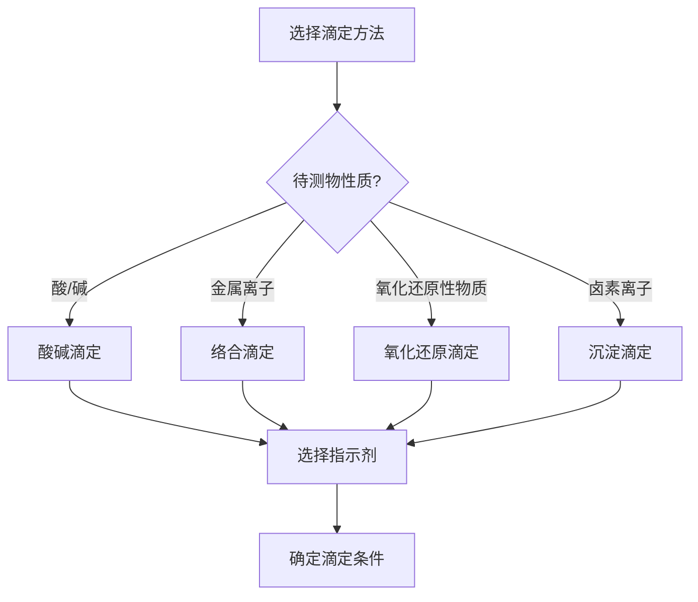
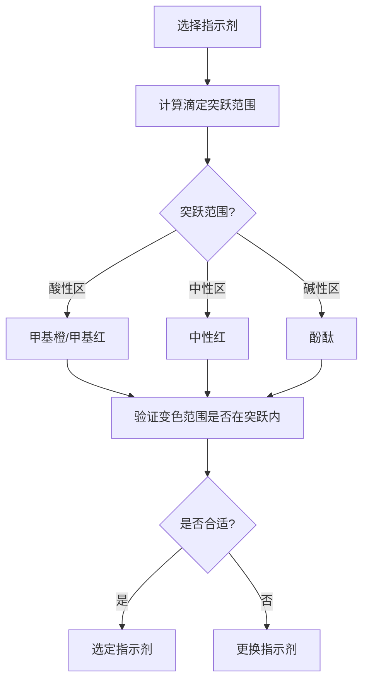

# 滴定分析方法

> **定位**：滴定分析是分析化学的核心方法，涵盖酸碱、络合、氧化还原、沉淀四大滴定。本专题为"讲义抽料台"，可直接复制各板块到学生讲义。

---

## 一、核心结论

### 1.1 四大滴定方法概述（来源：滴定分析(核心结论)§二）

| 方法 | 反应类型 | 常用标准溶液 | 典型指示剂 |
|:---|:---|:---|:---|
| 酸碱滴定 | H⁺ + OH⁻ → H₂O | HCl, NaOH | 酚酞, 甲基橙 |
| 络合滴定 | M + EDTA → M-EDTA | EDTA | 金属指示剂 |
| 氧化还原滴定 | 电子转移 | KMnO₄, K₂Cr₂O₇ | 自身/外指示剂 |
| 沉淀滴定 | 生成沉淀 | AgNO₃ | 吸附指示剂 |

### 1.2 指示剂选择原则（来源：酸碱滴定详解KP §三）

- 指示剂变色范围必须**全部落在**滴定突跃范围内
- 滴定突跃范围由滴定剂和被滴定物的浓度及强度决定

### 1.3 EDTA络合滴定（来源：络合滴定与EDTAKP §二）

**EDTA特性**：
- 六齿配体，与金属离子形成1:1配合物
- 形成常数K_f很大，络合反应完全
- **酸效应**：pH影响EDTA的存在形式，进而影响络合能力

### 1.4 氧化还原滴定（来源：氧化还原滴定详解KP §二）

**指示剂类型**：
- 自身指示剂：KMnO₄（紫色→无色）
- 氧化还原指示剂：二苯胺磺酸钠
- 外指示剂：淀粉-KI（碘量法）

---

## 二、决策路径

### 滴定方法选择



### 指示剂选择流程



---

## 三、对比表格

### 表1：酸碱滴定曲线特征

| 滴定类型 | 半当量点pH | 当量点pH | 突跃范围 | 指示剂 |
|:---|:---:|:---:|:---:|:---|
| 强酸+强碱 | 7.00 | 7.00 | 4~10 | 酚酞/甲基橙 |
| 弱酸+强碱 | pKa | >7（碱性） | 7~10 | 酚酞 |
| 强酸+弱碱 | - | <7（酸性） | 4~7 | 甲基橙 |
| 多元酸+强碱 | pKa₁, pKa₂ | 多个突跃 | 取决于Ka差 | 分步选择 |

### 表2：EDTA络合滴定条件

| 条件 | 要求 | 原因 |
|:---|:---|:---|
| pH | 根据金属离子选择 | 酸效应影响络合能力 |
| 缓冲溶液 | 必须使用 | 维持pH稳定 |
| 指示剂 | 金属指示剂 | 与金属离子显色 |
| 温度 | 室温 | 影响形成常数 |

### 表3：氧化还原滴定方法

| 方法 | 标准溶液 | 应用 | 条件 |
|:---|:---|:---|:---|
| 高锰酸钾法 | KMnO₄ | 还原性物质 | 酸性条件 |
| 重铬酸钾法 | K₂Cr₂O₇ | 铁矿石 | 酸性条件 |
| 碘量法 | Na₂S₂O₃ | 氧化性物质 | 中性/弱酸性 |
| 铈量法 | Ce(SO₄)₂ | 还原性物质 | 酸性条件 |

### 表4：滴定误差来源

| 误差来源 | 影响 | 消除方法 |
|:---|:---|:---|
| 终点与当量点不重合 | 滴定误差 | 选择合适指示剂 |
| 标准溶液浓度不准 | 系统误差 | 标定标准溶液 |
| 滴定管读数误差 | 随机误差 | 多次读数取平均 |
| 指示剂变色滞后 | 系统误差 | 做空白实验 |

---

## 四、典型例题

### 例1：酸碱滴定计算（来源：酸碱滴定详解KP §五 典型例题1）

用0.1000 mol/L NaOH滴定20.00 mL 0.1000 mol/L HAc，计算当量点的pH。

**解答**：
- 当量点时HAc全部转化为NaAc，[Ac⁻] = 0.050 mol/L
- Ac⁻水解：pOH = ½(pKb - lg c) = ½(9.26 + 1.30) = 5.28
- pH = 14 - 5.28 = **8.72**
- 指示剂选择：酚酞（变色范围8.0~10.0）

### 例2：EDTA络合滴定（来源：题库 无对应题库）

用0.01000 mol/L EDTA滴定20.00 mL 0.01000 mol/L Ca²⁺，计算化学计量点时的pM。

**解答**：
- 当量点时Ca²⁺与EDTA按1:1反应
- [Ca²⁺] ≈ 0（完全络合）
- pM = -lg[Ca²⁺] → 很大值
- 实际计算需考虑Ca-EDTA的形成常数和酸效应

### 例3：氧化还原滴定（来源：题库 无对应题库）

用0.02000 mol/L KMnO₄滴定20.00 mL 0.1000 mol/L Fe²⁺，计算消耗KMnO₄的体积。

**解答**：
- 反应：MnO₄⁻ + 5Fe²⁺ + 8H⁺ → Mn²⁺ + 5Fe³⁺ + 4H₂O
- n(Fe²⁺) = 0.1000 × 20.00 × 10⁻³ = 2.000 × 10⁻³ mol
- n(KMnO₄) = n(Fe²⁺)/5 = 4.000 × 10⁻⁴ mol
- V(KMnO₄) = 4.000 × 10⁻⁴ / 0.02000 = 20.00 mL

### 例4：沉淀滴定（来源：题库 无对应题库）

用0.1000 mol/L AgNO₃滴定20.00 mL 0.1000 mol/L NaCl，计算当量点时的pAg。

**解答**：
- 当量点时Ag⁺与Cl⁻按1:1反应
- AgCl的Ksp = 1.8 × 10⁻¹⁰
- [Ag⁺] = √Ksp = √(1.8 × 10⁻¹⁰) = 1.34 × 10⁻⁵ mol/L
- pAg = -lg(1.34 × 10⁻⁵) = **4.87**

---

## 五、易错点预警

### 易错1：指示剂选择原则（来源：酸碱滴定详解KP §四）

- 指示剂变色范围必须**全部落在**滴定突跃范围内
- 不能因为指示剂在变色范围内就认为合适
- **陷阱**：甲基橙变色范围3.1~4.4，不适合弱酸强碱滴定（突跃在碱性区）

### 易错2：EDTA的酸效应（来源：络合滴定与EDTAKP §四）

- pH越低，EDTA的酸效应越大，络合能力越弱
- 不同金属离子需要不同的pH条件
- **陷阱**：不能在任意pH下进行EDTA滴定

### 易错3：KMnO₄滴定的自催化（来源：氧化还原滴定详解KP §三）

- KMnO₄与Mn²⁺的反应是自催化反应
- 开始时反应慢，随着Mn²⁺生成反应加速
- **陷阱**：滴定开始时需要缓慢滴加

### 易错4：碘量法的误差来源

- I₂易挥发，需要在碘量瓶中进行
- I⁻易被空气氧化，需要避光
- **陷阱**：碘量法的主要误差来源是I₂挥发和I⁻氧化

### 易错5：滴定终点的判断

- 终点≠当量点（终点是指示剂变色点）
- 滴定误差 = (V终 - V当量)/V当量 × 100%
- **陷阱**：不能假设终点与当量点完全重合

### 易错6：标准溶液的标定

- 直接配制的标准溶液需要高纯度试剂
- 间接配制需要标定（如NaOH溶液需要用邻苯二甲酸氢钾标定）
- **陷阱**：不能直接用分析纯试剂配制标准溶液

### 易错7：缓冲溶液在络合滴定中的作用

- 络合滴定必须使用缓冲溶液维持pH稳定
- EDTA络合释放H⁺，会降低pH
- **陷阱**：不使用缓冲溶液会导致pH变化，影响滴定结果

---

## 六、竞赛深化

### 6.1 返滴定法（来源：络合滴定与EDTAKP §六）

- 加入过量EDTA，用标准Zn²⁺溶液返滴定剩余EDTA
- **应用**：测定与EDTA反应慢的金属离子（如Cr³⁺、Al³⁺）

### 6.2 置换滴定法

- 用EDTA置换出金属离子，再用标准溶液滴定
- **应用**：测定铜合金中的铜

### 6.3 非水滴定

- 在非水溶剂中进行的酸碱滴定
- 扩大了酸碱滴定的应用范围
- **应用**：测定极弱酸或极弱碱

---

## 七、知识链接

**前置知识**
- [[定量分析基础]] → 误差与数据处理
- [[化学平衡]] → 平衡常数

**后续知识**
- [[络合滴定]] → EDTA滴定详解
- [[氧化还原滴定]] → 氧化还原滴定详解

**相关专题**
- [[专题-容量分析基础与酸碱滴定]]（酸碱滴定详解）
- [[专题-络合滴定与重量分析]]（络合滴定详解）
- [[专题-氧化还原滴定与沉淀滴定]]（氧化还原滴定详解）

---

## 八、题库索引

```dataview
TABLE difficulty AS "难度", tags AS "标签"
FROM "04-题库/分析化学"
WHERE contains(file.name, "滴定") OR contains(file.name, "容量")
SORT file.name ASC
```
