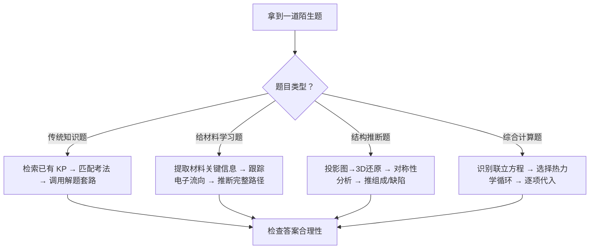

# 专题：真题模拟拆解

> 本专题对应：第四轮冲刺体系 4-8
> 核心能力：限时全真模拟 + 命题思路反向拆解 + 「给材料学习」题型方法论
> 关联专题：[[专题-高等有机机理与立体化学]]、[[专题-晶体与配合物深化]]、[[专题-物化综合计算]]、[[专题-元素化学深度与结构推断综合]]

---

## 零点五、进阶导航 {#advance-navigation}

- 上游冲刺页：[[专题-高等有机机理与立体化学]]、[[专题-人名反应系统归类]]、[[专题-晶体与配合物深化]]、[[专题-物化综合计算]]、[[专题-元素化学深度与结构推断综合]]
- 本页定位：第四轮收口/整卷训练页
- 回流用途：把整卷暴露出的卡点回补到对应第三/第四轮专题页

## 零点六、课堂投影速查卡 {#classroom-quick-card}

**本页课堂入口：** 这节课先统一整卷策略（见 [[#exam-decision-flow|§一点六 考场决策七步法]]），再进入单题讲评；不要按题号从头讲到尾。

**先问四个问题：**

1. 这套卷最该练的是时间分配、陌生题拆解，还是压轴题止损？
2. 哪几题最能代表今年新信号，值得讲成“可迁移方法”而不是“本题答案”？
3. 哪些题需要完整走一遍，哪些题只讲切入口和回流去向？
4. 讲完这套卷之后，学生该回补到哪几张上游专题页？

**一屏判断卡：**

- 先讲“整卷决策错在哪”，再讲“单题知识缺在哪”。
- 讲评顺序按迁移价值排，不按题号排。
- 压轴题重点是局部得分拆法，不是一次讲完全部细节。
- 每套卷都要留下“新信号清单 + 回流专题页清单”。

## 零点七、第二张教学图：整卷讲评映射板 {#second-teaching-figure}

**建议用途：** 这张图专门服务第四轮讲评课。第一张速查卡解决“做卷时怎么决策”，第二张图解决“讲卷时怎么串起来”。

| 题目类型 | 先讲什么 | 迁移到哪张专题页 | 讲评目标 |
|:---|:---|:---|:---|
| 给材料学习 | 信息提取顺序 | [[专题-高等有机机理与立体化学]] / [[专题-人名反应系统归类]] | 建立“先框架后细节” |
| 结构推断 | 图像或结构入口 | [[专题-晶体与配合物深化]] / [[专题-元素化学深度与结构推断综合]] | 建立“结构 → 性质 → 结论” |
| 综合计算 | 先拆桥梁 | [[专题-物化综合计算]] | 建立“公式链而不是算式堆” |
| 整卷决策失误 | 时间分配与跳题 | 本页 | 建立“做卷策略可迁移” |

**讲评顺序模板：**
- 先讲 1 题“最能代表整卷决策失误”的题。
- 再讲 1 题“方法可迁移到别卷”的题。
- 最后讲压轴题，但只讲拆题框架和关键得分点，不把整题讲成单次表演。

---

## 一、核心结论汇总 {#core-conclusions}

> 本专题不是"讲新知识"，而是"训练解题元能力"——学生在考场上面对陌生题时，如何调用已知的化学原理去推断未知的反应/结构。

**必须记住的 5 条冲刺原则：**

1. **先通览，后动手**：拿到试卷先花 3-5 分钟通览全卷，标记"确定会做 / 需要思考 / 可能放弃"三级，按拿分效率排序做题
2. **时间 = 分数**：一道 10 分题卡 15 分钟以上 = 净亏损。设定每题的"止损线"（分值 × 1.5 min），超时果断跳题
3. **"给材料学习"题不是考知识储备**：考察的是从陌生文献信息中现场学习机理逻辑的能力。核心武器是**跟踪电子流向 + 识别中间体稳定性 + 应用 Baldwin/电性匹配规则**
4. **晶体题已转向定性推理**：不再死算密度/堆积效率，核心是"投影图→三维结构还原 + 对称性分析 + 缺陷位置判断"
5. **每套真题做完 ≠ 结束**：必须做"命题思路反向拆解"——出题人为什么给这个条件？这个条件暗示了什么？明年可能怎么变？

## 一点五、竞赛加厚：整卷讲评最值钱的 4 个回流动作

| 回流动作 | 讲评时怎么做 | 要回到哪里 | 真正价值 |
|:---|:---|:---|:---|
| **题型回流** | 把本题先判成“机理 / 结构 / 计算 / 材料学习”中的哪一类 | 对应上游专题页 | 学生下次先认题，不先慌 |
| **失误回流** | 讲清是知识缺、顺序错、还是时间管理崩 | 本页 + 上游专题页 | 让错题不只留下答案，而留下错误类型 |
| **信号回流** | 提炼今年卷面新增的材料、结构、数据风格 | 本页“新信号清单” | 形成下一套卷的预警能力 |
| **止损回流** | 明确如果考场再遇到同类压轴题，最低分怎么拿 | 本页策略区 | 把“不会全做”转成“会局部拿分” |

**最高频决策路径：**



---

## 一点六、考场决策七步法 {#exam-decision-flow}

> **为什么需要七步法？** 第四轮学生常见的问题是"知识会了，但上了考场不知道该先做什么"——不是能力不够，是决策顺序没练过。这七步把"打开试卷的第一分钟到交卷前最后一分钟"变成可执行的序列。

### 七步全览

| 步 | 动作 | 时限 | 核心问题 | 做完的标志 |
|:---:|:---|:---:|:---|:---|
| 1 | **通览分层** | 3 min | 哪些题我能稳拿？哪些需要思考？哪些可能放弃？ | 每道题旁边标了 ✓ / ? / ✗ |
| 2 | **题型认领** | 2 min | 每道 ? 题是"给材料学习 / 结构推断 / 综合计算 / 元素推断"中的哪一类？ | 每道 ? 题旁边标了题型标签 |
| 3 | **排兵布阵** | 1 min | 按"稳拿分 → 可攻题 → 压轴止损"排做题顺序 | 草稿纸上写了做题序号顺序 |
| 4 | **入场做题** | 按止损表 | 当前题卡住了怎么办？ | 每道题不超止损线 |
| 5 | **即时止损** | 10 秒/决策 | 超止损线 → 跳题，还是再给 3 min？ | 跳题位置留了"已做到X步"标记 |
| 6 | **回补扫荡** | 最后 20 min | 跳过的题哪道最容易捡回分？ | 按"捡分容易度"排序回补 |
| 7 | **交卷前检查** | 最后 5 min | 有没有空白题？计算题符号/单位对不对？ | 每道题至少写了思路痕迹 |

---

### 第一步：通览分层（3 min）

**操作：** 打开试卷 → 从第 1 题翻到最后一题（只看题干和问题，不读细节）→ 每道题标三级：

| 标记 | 含义 | 判据 |
|:---:|:---|:---|
| **✓** | 稳拿 | 扫一眼就知道考点、有现成解题套路、之前练过同类题 |
| **?** | 可攻 | 考点认识但不熟、需要推导时间、或题型陌生但逻辑可循 |
| **✗** | 暂放 | 完全陌生的材料、或已知的弱项考点、或一看就需要 30+ min 的压轴题 |

**常见错误：**
- ❌ 在第 1 题就开始仔细读材料 → 3 min 不够用
- ❌ 把"看起来长"的题标成 ✗ → 长的给材料学习题往往反而是最好拿分的（信息都在材料里）
- ❌ 把所有 ? 都标成 ✓ → 过度乐观，导致中间卡住崩节奏

**课堂训练方式：** 投影一套真题 → 3 min 限时 → 只写题号 + ✓/?/✗ → 同桌互相对比标记差异 → 讨论"为什么你标 ✓ 而我标 ?" → 教师揭示最常见的误判模式。

---

### 第二步：题型认领（2 min）

**操作：** 只看标记为 ? 的题 → 每道题判断它属于以下哪类题型：

| 题型 | 一眼识别特征 | 对应的"拆题入口" |
|:---|:---|:---|
| **给材料学习** | 给出文献反应式 + 催化剂结构 + "据此推测" | 先不看全材料 → 先找到第一步反应式 → 从第一步反应式开始推 |
| **结构推断** | 有晶体投影图 / 晶胞图 / "判断X的位置" | 先不看数据 → 先找对称性最高的视角 → 确定不对称单元 |
| **综合计算** | 多个数据联立 + 热力学/电化学/动力学公式 | 先不看数字 → 先画热力学循环或列联立方程框架 |
| **元素推断** | 化学史背景 + 多步反应现象描述 + "判断A~F" | 先不看历史 → 先圈出第一组能确定元素的反应条件 |

**核心原则：** 题型认领不是背分类——是提前决定"这道题的切入口在哪"。不要读完全题再想切入口——先定切入口，再按切入口去读题。

---

### 第三步：排兵布阵（1 min）

**做题顺序 ≠ 题号顺序。** 按以下优先级重排：

| 优先级 | 题类 | 策略 | 理由 |
|:---:|:---|:---|:---|
| **第 1 批** | ✓ 题 | 按题号顺序，每题不超止损线 | 先拿确定分，建立节奏和信心 |
| **第 2 批** | ? 题中"材料学习"和"元素推断" | 按分值从高到低 | 这两类题信息在卷面上，不需要回忆——大脑最清醒时做 |
| **第 3 批** | ? 题中"结构推断"和"综合计算" | 按自己强项优先 | 这两类需要推导链——大脑已热身 |
| **第 4 批** | ✗ 题 | 只做"局部得分"，不追求做全 | 压轴题通常第一问/第二问是最简单的——后面的才是坑 |

**写在草稿纸上的格式：**
```
做题顺序：3→5→1→2→7→8→4→6→9→10(只做1-2问)
✓: 1, 2, 4, 6
?: 3(材料), 5(推断), 7(计算), 8(材料)
✗: 9(只看第1问), 10(只看第1问)
```

---

### 第四步：入场做题（按止损表执行）

**止损表（初赛 / 决赛通用，按个人调整）：**

| 题目位置 | 典型分值 | 止损时间 | 超时后动作 |
|:---|:---:|:---:|:---|
| 元素/情境题（第 1-3 题） | 12-18 分 | 35 min | 做完当前小问 → 跳 |
| 物化/分析/晶体（第 4-6 题） | 15-20 分 | 50 min | 如果有计算未完成 → 留公式和中间数据 → 跳 |
| 有机/机理（第 7-8 题） | 18-22 分 | 50 min | 如果机理推到一半卡住 → 把已推的步骤写下来 → 跳 |
| 给材料/综合（第 9-10 题） | 20-30 分 | 40 min | 至少拿到第 1 问 → 再跳 |

**卡住时的判断口诀：** "3 分钟没进展 → 写下手头已有的 → 跳。回头时有痕迹就不需要重新读题。"

---

### 第五步：即时止损（10 秒决策）

**止损不是放弃——止损是把时间投资到更可能拿分的题上。**

止损时执行三个动作（10 秒内完成）：
1. **留痕迹**：在题号旁写"已做到：___步"，在答题区写下手头已有的中间结果
2. **判原因**：在草稿纸上标记卡住原因——K（知识盲区）/ M（方法不对）/ T（时间不够）
3. **选去向**：跳到下一道同批次的题，而非跳到 ✗ 题（先把手头这一批做完）

**课堂训练方式：** 给一套真题 → 正常做题 → 教师每隔 35 min 喊一次"检查止损线，超了的立刻跳" → 模拟真实考场的止损训练。

---

### 第六步：回补扫荡（最后 20 min）

**不是按题号顺序回补——按"捡分容易度"排序：**

| 回补优先级 | 题型特征 | 为什么容易捡分 |
|:---:|:---|:---|
| **第 1 回** | 计算题只差最后一步代入 | 中间公式→代入→答案，2 min 就能拿满 |
| **第 2 回** | 给材料学习前 1-2 问 | 通常只需要提取信息，不需要全推完 |
| **第 3 回** | 结构推断的前几问（组成/晶系） | 组成判断不需要完全还原三维结构 |
| **最后回** | 机理推断的完整路径 | 需要从头推——如果时间不够，至少写出"已知第 1 步 → 推测中间体 → 可能下一步"的思路框架 |

**"空着"和"写思路但不全"的区别：** 竞赛阅卷中，写了正确思路框架但没推完的，可能拿到 30-50% 的分；完全空着 = 0 分。

---

### 第七步：交卷前检查（最后 5 min）

**不检查"对不对"——检查"有没有漏"：**

| 检查项 | 具体操作 | 时间 |
|:---|:---|:---:|
| 空白题 | 逐题扫一眼 → 有没有完全空着没写的题 → 至少写"已知条件：___，推测：___" | 1 min |
| 计算题 | 只看单位/符号/数量级 → 不管数字对不对 | 2 min |
| 有机题 | 只看箭头方向/电荷/八隅体 → 不管选择性对不对 | 1 min |
| 结构题 | 只看坐标/原子数/对称性标记 → 不管具体数值 | 1 min |

**铁律：** 最后 5 分钟不改答案——除非你发现了一个明确的笔误（如 34 写成了 43）。你的第一推理通常比紧张时做出的修改更可靠。

---

### 七步法课堂训练模板

**第一节课（认知建立）：**
1. 投影七步法全图（5 min 讲解）
2. 给一套学生没做过的真题 → 只做第 1-3 步（通览+认领+排阵）（8 min 限时）
3. 互相对比标记 → 讨论差异（5 min）
4. 教师揭示"最常见的 3 种误判"（5 min）

**第二节课（实战压测）：**
1. 完整限时模拟（按考试时间）
2. 讲评时不只讲答案 → 先复盘"七步法中哪一步执行出了问题"
3. 统计全班最常见的止损失败模式（哪些题该跳没跳）

---

## 二、对比表格：题型策略速查 {#comparison-table}

| 触发条件（题目特征） | 题型 | 核心策略 | 典型时间 | 常见陷阱 | 对应真题 |
|:---|:---|:---|:---:|:---|:---|
| 给出文献反应体系 + 催化剂结构 | **给材料学习** | 跟踪电子流向→识别中间体→推催化循环 | 15-20 min | 试图回忆"学过没"而非现场推理 | 39届初赛第10题 |
| 给出晶体投影图（非标准晶胞图） | **结构推断** | 投影图→3D还原→推组成/晶系/缺陷 | 10-15 min | 只看俯视忽略侧视，漏掉层间信息 | 38届初赛第5题 |
| 多步热力学/电化学数据联立 | **综合计算** | 画热力学循环→逐项列方程→检查单位 | 10-15 min | 单位不统一（kJ vs eV），漏掉符号 | 38届初赛第3题 |
| 给出新试剂体系 + 多步产物推断 | **机理推断** | 逐步推：进攻位点→形成键→断裂键→中间体稳定性 | 12-18 min | 跳步推断，忽略中间体的共振稳定化 | 39届决赛第10题 |
| 化学史情境 + 陌生物质 | **元素推断** | 从已知反应条件反推元素→验证化学合理性 | 8-12 min | 被"历史背景"干扰，忽略化学核心逻辑 | 39届初赛第1-3题 |

---

## 三、解题套路：给材料学习题型（核心方法论） {#problem-solving-routine}

> 「给材料学习」是近五年最显著的新题型——2025 年初赛第 10 题（NHC-硼自由基催化，~20 分）和 2025 年决赛第 10 题（卡宾/乃春化学，33 分）均为此类。学生不可能提前学过，考察的是**现场学习 + 机理推理**的元能力。

### Step 1：提取材料关键信息
- **操作**：圈出材料中的关键条件——催化剂结构、试剂、温度、溶剂极性、产物的特征官能团变化
- **依据 KP**：[[有机反应机理基础]]
- **检查点**：☐ 催化剂金属中心及其配位环境 ☐ 关键试剂的电子性质（亲核/亲电/自由基） ☐ 反应条件暗示的中间体类型

### Step 2：确定反应类型框架
- **操作**：根据给出的第一步反应，判断属于哪种机理族——极性反应（亲核/亲电）、自由基反应、周环反应、金属催化循环
- **依据 KP**：[[有机反应类型总览]]、[[自由基反应基础]]
- **检查点**：☐ 是否有单电子转移（SET）迹象？ ☐ 是否有环状过渡态特征？ ☐ 金属中心氧化态是否变化？

### Step 3：跟踪电子流向，逐步推断
- **操作**：从已知起始物出发，用弯箭头跟踪每一对电子的移动。每步问三个问题：
  - 谁是亲核位点（孤对电子/π键/负电荷）？
  - 谁是亲电位点（空轨道/正电荷/极性键的正端）？
  - 这一步形成的中间体是否稳定（共振/诱导/共轭）？
- **依据 KP**：[[电子效应]]、[[共振论]]、[[活性中间体]]
- **检查点**：☐ 每步箭头从富电子→缺电子 ☐ 八隅体规则 ☐ 电荷守恒

### Step 4：识别催化循环的闭环
- **操作**：催化循环的最后一步必须再生初始催化剂。检查：催化剂在最后一步是否恢复原始氧化态和配位环境？
- **依据 KP**：[[催化循环]]、[[金属有机化学基础]]
- **检查点**：☐ 催化剂氧化态回到初始值 ☐ 总反应 = 各基元步骤之和 ☐ 副产物与题目条件吻合

### Step 5：验证选择性与副反应
- **操作**：用 Baldwin 规则验证环化选择性（5-exo vs 6-endo）；用电性匹配验证区域选择性；检查是否有合理的副反应路径
- **依据 KP**：[[Baldwin规则]]、[[区域选择性]]、[[化学选择性]]
- **检查点**：☐ Baldwin 规则（exo/endo, trig/dig/tet） ☐ 位阻最小的进攻方向 ☐ 副产物是否合理

| 步骤 | 核心操作 | 依据 KP | 检查清单 |
|:---|:---|:---|:---|
| 1 | 提取材料关键信息 | [[有机反应机理基础]] | ☐ 催化剂/试剂/条件 |
| 2 | 确定反应类型框架 | [[有机反应类型总览]] | ☐ 极性/自由基/周环/金属催化 |
| 3 | 跟踪电子流向逐步推断 | [[电子效应]] [[共振论]] | ☐ 富→缺 ☐ 八隅体 ☐ 电荷守恒 |
| 4 | 识别催化循环闭环 | [[催化循环]] | ☐ 催化剂再生 ☐ 总反应吻合 |
| 5 | 验证选择性与副反应 | [[Baldwin规则]] | ☐ Baldwin ☐ 位阻 ☐ 副反应合理性 |

---

## 四、限时模拟执行规范 {#timed-practice-protocol}

### 4.1 模拟前准备

| 准备项 | 要求 |
|:---|:---|
| 试卷 | 完整初赛/决赛真题（不做任何预览） |
| 时间 | 严格按考试时间（初赛 3h，决赛第一场 4h，第二场 4h） |
| 环境 | 无干扰、无参考资料、仅允许考试允许的工具 |
| 心态 | 当作真实考试——不会的题也要写思路，空着 = 0 分 |

### 4.2 时间分配铁律

| 题号（以初赛为例） | 建议用时 | 止损线 | 策略 |
|:---|:---:|:---:|:---|
| 第 1-3 题（元素/情境） | 25-30 min | 35 min | 情境题读题耗时，但推断逻辑通常不深 |
| 第 4-6 题（物化/分析/晶体） | 40-50 min | 55 min | 计算量大，注意单位；晶体优先定性推理 |
| 第 7-8 题（有机/物理有机） | 40-50 min | 55 min | 有机分值高且可拿满，优先保证 |
| 第 9-10 题（综合/给材料学习） | 30-40 min | 45 min | 给材料学习题留足推理时间 |
| **检查** | 15-20 min | — | 优先检查计算题的单位和符号 |

### 4.3 模拟后拆解流程

```
做完一套真题 → 不要立刻对答案 → 先做 3 件事：

1. 标记"卡住的地方"
   → 在哪一步卡住了？（读题/识别反应/推断中间体/计算）
   → 是知识盲区还是思路盲区？

2. 逐题写"出题人意图"
   → 这道题考什么能力？（知识记忆 / 现场推理 / 空间想象 / 计算熟练度）
   → 哪个条件是最关键的提示？

3. 对照答案后的"差距分析"
   → 答案和我写的哪里不同？
   → 那个关键条件我为什么没用到？
   → 下次遇到类似条件我该想到什么？
```

---

## 五、典型例题串讲 {#typical-examples}

### 例题 1：给材料学习——NHC-硼自由基催化（2025 初赛第 10 题）

**题目特征**：给出 NHC-BH₃ 催化剂体系 + 反应条件 → 要求推断完整催化循环

**分析方法**：
1. 提取：NHC-硼烷是自由基前体（B-H 键均裂能低），光照或引发剂触发
2. 判断类型：自由基链式反应（引发→攫氢→加成→HAT→环化→β-消除）
3. 跟踪：B 中心自由基攫取底物 C-H → 碳自由基 → 分子内环化（5-exo-trig, Baldwin 允许）→ HAT 回到 B 中心 → β-消除释放产物 + 再生催化剂
4. 闭环：催化剂 NHC-BH₃ 在 β-消除后恢复，进入下一循环

**学生常见卡点**：
- 不熟悉硼自由基的攫氢选择性（优先攫取最弱的 C-H）
- 忽略了 Baldwin 规则对环化路径的限制
- 把 HAT（氢原子转移）和 PT（质子转移）混淆

**反思**：给材料学习题的核心不是"知道硼化学"，而是"能从给出的反应条件中推断自由基链式机理"。

---

### 例题 2：结构推断——晶体投影图分析（2024 初赛第 5 题）

**题目特征**：给出 FeCr 合金晶胞 + SrSb + KGe + WSe₂ + CeO₂ 五种结构（含 [112] 投影图）→ 推断组成/对称性/氧空位位置

**分析方法**：
1. 先看完整的晶胞图，再看投影图——投影图丢失了一个维度的信息，需要从对称性补充
2. CeO₂ 氧空位：从 [112] 投影中识别缺失的氧位置 → 用对称性验证（空位必须满足晶体对称性约束）
3. WSe₂ 层间距：从 c 轴长度和层数计算

**学生常见卡点**：
- 不会从投影图还原三维——只看到投影面上的排列，忽略了垂直于投影面的键连接
- 氧空位判断时只考虑最近邻配位，忽略了对称性约束（空位必须出现在所有对称等价位置）
- WSe₂ 的层内共价键 vs 层间范德华力的区分

**反思**：晶体题已从"计算"全面转为"推理"，空间想象力 + 对称性分析是核心。

---

### 例题 3：综合计算——热力学循环联立（2024 决赛第 4 题）

**题目特征**：从 E° + pKa → 计算 N-H 键解离自由能（BDE）

**分析方法**：
1. 画出热力学循环：NH₃ → NH₂• + H• （均裂，BDE）；H• → H⁺ + e⁻ （电离）；H⁺ 水合
2. 利用已知的 E°（氧化还原电势）和 pKa（酸解离常数）联立
3. ΔG°(BDE) = ΔG°(氧化) + ΔG°(去质子化) + 常数项
4. 注意单位统一：E° → ΔG° = -nFE°；pKa → ΔG° = 2.303RT·pKa

**学生常见卡点**：
- 不会设计热力学循环（不知道哪些已知量可以"搭桥"）
- 符号错误（氧化电势的正负号与 ΔG 的关系）
- 单位混乱（eV vs kJ/mol，F = 96.485 kJ/(mol·V) = 23.06 kcal/(mol·V)）

**反思**：BDE 循环是近年决赛的计算新热点，本质是 Born-Haber 型循环在分子热力学中的推广。

---

## 六、关联知识点 {#related-kp}

### 给材料学习相关
- [[有机反应机理基础]]
- [[电子效应]]
- [[共振论]]
- [[活性中间体]]
- [[Baldwin规则]]
- [[自由基反应基础]]
- [[催化循环]]
- [[金属有机化学基础]]

### 晶体结构推断相关
- [[晶体结构基本概念]]
- [[常见晶体结构类型]]
- [[X射线衍射基础]]
- [[缺陷化学]]

### 综合计算相关
- [[热力学基础]]
- [[电化学基础]]
- [[化学动力学基础]]
- [[Born-Haber循环]]

---

## 七、关联题型 {#related-problem-types}

- [[题型-给材料学习]]
- [[题型-结构推断]]
- [[题型-综合计算]]
- [[题型-元素推断]]

---

## 七点五、讲评顺序与整卷真题链 {#exam-sequence}

- `第 1 段`：先讲时间分配和止损最典型的一题，目的是统一整卷策略，而不是急着对答案。
- `第 2 段`：再讲最能迁移的方法题，通常按 `给材料学习 / 结构推断 / 综合计算 / 元素推断` 四类各挑一题。
- `第 3 段`：最后才讲压轴难题，重点不是讲全细节，而是示范“卡住时如何拆成局部得分”。
- 推荐讲评顺序：`整卷决策题 → 可迁移方法题 → 压轴题拆分`，不要按原卷题号顺序平铺。
- 推荐真题链：先回看 [[专题-高等有机机理与立体化学]]、[[专题-人名反应系统归类]]、[[专题-晶体与配合物深化]]、[[专题-物化综合计算]]、[[专题-元素化学深度与结构推断综合]] 对应专题的精选题，再回到整卷做二次模拟。

### 图后立刻练 / 讲后 1 题 / 课后 2 题

- 图后立刻练：给一张题单缩略版，让学生先做“3 分钟通览 + 题型分层”。
- 讲后 1 题：选一题最能迁移的方法题，完整示范“切入口 → 止损线 → 回收分”。
- 课后 2 题：一题压轴长题做“拆分得分版”，一题整卷复盘表做“命题信号总结版”。

## 八、相关真题 {#related-exam-questions}

### 给材料学习类
- 39 届初赛第 10 题：NHC-硼自由基催化环化（~20 分）
- 39 届决赛第 10 题：卡宾/乃春化学 + PIFA 氧化氨化（33 分）
- 37 届初赛第 10 题：ARC 多组分反应 + Brook 重排
- 35 届初赛有机题：Dyotropic 重排（给定义→应用）

### 结构推断类
- 38 届初赛第 5 题：FeCr/SrSb/KGe/WSe₂/CeO₂ 五种结构（18 分）
- 39 届初赛晶体题：XeFₓ + FeO₂ + ReNₓ
- 37 届初赛第 6 题：MAX 相 + MXene

### 综合计算类
- 38 届决赛第 4 题：N-H BDE 计算
- 39 届初赛第 6 题：普鲁士蓝电极 + 比容量
- 38 届初赛第 3 题：DNA 荧光力学 + RNA 折叠热力学

---

*本专题依据 [[模板-专题]] v1.7 生成，定位为第四轮冲刺的策略/方法论专题。*
*2026-06-18 复核说明：原先存在“专题页已在，但指向的课堂执行页文件名漂移且 `新授课` 层缺失”的断点；现统一以 `真题模拟拆解-冲刺班` 作为备课大纲 / 新授课对应口径。*
*2026-06-19 复核说明：专题页、备课大纲、课堂执行页、教学洞察四层链路现已全部实存且口径一致，状态由 `可用` 统一升为 `已审校`。*

> 📎 相关提炼：[[07-资料提炼/提炼-第39届初赛试题解析]] · [[07-资料提炼/提炼-第38届初赛试题解析]] · [[07-资料提炼/提炼-第37届初赛试题解析]]
