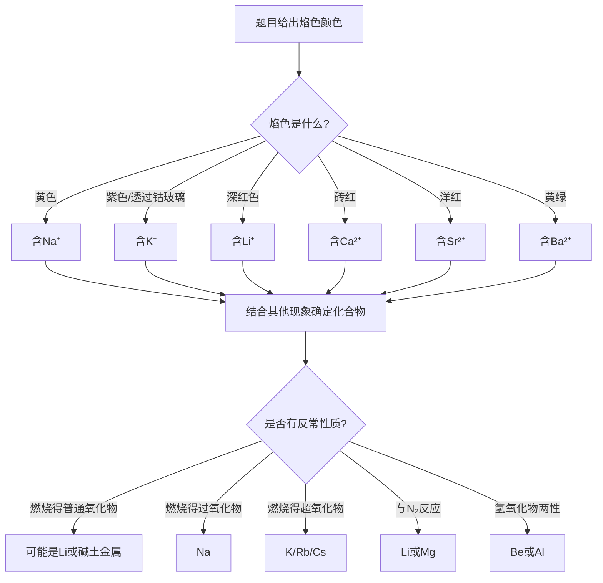

# 专题：碱金属碱土金属与稀有气体

> 本专题对应考纲条目：[[13]]
> 核心知识点：[[碱金属]]、[[碱土金属]]、[[稀有气体]]、[[对角线规则]]、[[超氧化物与臭氧化物]]

---

## 零点五、进阶导航 {#advance-navigation}

- 前置页：[[专题-原子结构与元素周期律]]、[[专题-分子结构基础]]
- 同组第二轮元素化学执行页：[[专题-氢与卤素]]、[[专题-氧族与氮族元素]]、[[专题-碳族与硼族元素]]
- 下游深化/收口页：[[专题-元素化学深度与结构推断综合]]、[[专题-真题模拟拆解]]

## 零点六、课堂投影速查卡 {#classroom-quick-card}

**本页课堂入口：** 先抓“Li/Be 反常、含氧化物递变、Xe 构型”三条主线，不要把 s 区和稀有气体混成一堆碎规律。

**先问四个问题：**

1. 题目是在考 IA/IIA 递变，还是 `Li-Mg / Be-Al` 对角线反常？
2. 重点是碳酸盐/氢氧化物溶解度，还是过氧化物/超氧化物判别？
3. 这是焰色与实验现象推断题，还是结构构型题（XeF2/XeF4/XeF6）？
4. 当前更值得先判“普通氧化物 / 过氧化物 / 超氧化物”，还是先判“酸碱性 / 两性”？

**一屏判断卡：**

- 看见 Li、Be 先预警“反常”，优先调对角线规则。
- s 区排序题先分维度：活泼性、溶解度、热稳定性不能混用同一条趋势。
- `Na2O2 / KO2` 题先算氧化态和磁性，再谈供氧效率。
- Xe 结构题先数电子对，再套 VSEPR，别直接背形状。

## 一、核心结论汇总 {#core-conclusions}

**必须记住：**

1. **s区单质制备与反应递变**：碱金属（IA）最活泼，碱土金属（IIA）次之；同族从上到下金属性增强。Li/Be因半径极小、电荷密度极高，表现出显著反常性（Li-Mg、Be-Al对角线相似）。

2. **氢氧化物碱性判据——离子势 φ**：$\phi = Z/r$，$\sqrt{\phi} < 0.22$ 碱性，$0.22-0.32$ 两性，$>0.32$ 酸性。Be(OH)₂为两性，其余碱土金属氢氧化物为碱性；碱金属氢氧化物均为强碱（LiOH中强）。

3. **盐类溶解性规律**：碱金属盐绝大多数易溶（LiF、Li₂CO₃、Li₃PO₄例外）；碱土金属盐许多难溶（硫酸盐MSO₄溶解度同族↓，氢氧化物M(OH)₂溶解度同族↑）。

4. **含氧化合物递变**：碱金属与氧反应产物随原子半径增大而含氧增多——Li→Li₂O（普通氧化物），Na→Na₂O₂（过氧化物），K/Rb/Cs→MO₂（超氧化物）。O₂⁻键级1.5、顺磁性；O₂²⁻键级1、反磁性。

5. **稀有气体化合物**：Xe化合物最丰富（电离能最低），XeF₂直线形、XeF₄平面正方形、XeF₆变形八面体；XeO₃三角锥（爆炸性）、XeO₄正四面体（+8价唯一稳定实例）。Kr仅KrF₂，He/Ne/Ar至今无稳定化合物。

**最高频决策路径：**

```mermaid
flowchart TD
  A[题目条件] --> B{涉及哪类元素?}
  B -->|IA族 Li~Cs| C[查碱金属性质 + 注意Li反常]
  B -->|IIA族 Be~Ba| D[查碱土金属性质 + 注意Be-Al对角线]
  B -->|稀有气体 Xe/Kr| E[查Xe氟化物/氧化物结构 + VSEPR]
  C --> F{是否有反常性质?}
  F -->|碳酸盐分解/与N₂反应/氢氧化物微溶| G[对角线规则: Li≈Mg]
  D --> H{是否两性?}
  H -->|BeO/Be(OH)₂溶于酸碱| I[对角线规则: Be≈Al]
  E --> J{判断结构?}
  J -->|VSEPR + 孤对电子| K[确定杂化与几何构型]
```

---

## 二、对比表格 {#comparison-table}

### 表1：碱金属 vs 碱土金属核心性质对比

| 触发条件（题目关键词） | 比较维度 | 碱金属（IA） | 碱土金属（IIA） | 常见陷阱 |
|:---|:---|:---|:---|:---|
| "最活泼金属"、"ns¹" | 价电子与氧化态 | ns¹，+1 | ns²，+2 | 误认为IIA比IA活泼 |
| "硬度小可切割"、"密度小于水" | 物理性质 | 软、轻、低熔点 | 较硬、较重、较高熔点 | IIA多一个价电子→金属键更强 |
| "与水剧烈反应放H₂" | 与水反应 | 2M + 2H₂O → 2MOH + H₂↑ | M + 2H₂O → M(OH)₂ + H₂↑ | Be不反应（氧化膜），Mg需热水 |
| "焰色反应颜色" | 焰色 | Li深红/Na黄/K紫/Rb紫红/Cs蓝 | Ca砖红/Sr洋红/Ba黄绿 | 混淆K的紫色与Rb的紫红色 |
| "氢氧化物碱性" | M(OH)ₙ酸碱性 | 均强碱（LiOH中强） | Be(OH)₂两性，其余碱性 | 误认为Mg(OH)₂两性 |
| "碳酸盐热稳定性" | MCO₃分解 | Li₂CO₃ 700°C分解，其余>1000°C稳定 | 同族↓稳定性↑：BeCO₃<MgCO₃<CaCO₃<BaCO₃ | 碱金属与碱土金属趋势方向不同 |
| "盐类溶解性" | 常见盐溶解度 | 绝大多数易溶（LiF/Li₂CO₃/Li₃PO₄例外） | 许多难溶：MSO₄↓、MCO₃↓、M(OH)₂部分难溶 | 硫酸盐与氢氧化物溶解度趋势相反 |

### 表2：Li/Na/K 化合物关键对比

| 触发条件 | 比较维度 | Li | Na | K | 常见陷阱 |
|:---|:---|:---|:---|:---|:---|
| "在空气中燃烧产物" | 氧化物类型 | Li₂O（普通氧化物） | Na₂O₂（过氧化物） | KO₂（超氧化物） | 误认为所有碱金属燃烧都得M₂O |
| "与CO₂反应供氧" | 载氧反应 | 无实际应用 | 2Na₂O₂ + 2CO₂ → 2Na₂CO₃ + O₂ | 4KO₂ + 2CO₂ → 2K₂CO₃ + 3O₂ | KO₂释氧效率是Na₂O₂的3倍 |
| "碳酸盐是否稳定" | MCO₃热稳定性 | Li₂CO₃ 700°C分解 | Na₂CO₃ >1000°C稳定 | K₂CO₃ >1000°C稳定 | Li因z/r大→极化能力强→碳酸盐不稳定 |
| "与N₂能否反应" | 氮化物生成 | 加热生成Li₃N | 不反应 | 不反应 | 只有Li和Mg能直接与N₂反应 |
| "氢氧化物溶解度" | MOH溶解度 | LiOH微溶（中强碱） | NaOH易溶（强碱） | KOH易溶（强碱） | LiOH溶解度小，溶液碱性弱于NaOH |
| "焰色反应" | 火焰颜色 | 深红色 | 黄色 | 紫色（透过钴玻璃） | Na的黄色焰色会掩盖K的紫色 |

### 表3：Be/Mg/Ca/Ba 对角线与递变

| 触发条件 | 比较维度 | Be | Mg | Ca | Ba | 常见陷阱 |
|:---|:---|:---|:---|:---|:---|:---|
| "两性氢氧化物" | M(OH)₂酸碱性 | 两性（√φ=0.27） | 碱性 | 强碱性 | 强碱性 | 只有Be(OH)₂是两性，Mg(OH)₂不是 |
| "与冷水反应" | 活泼性 | 不反应（氧化膜保护） | 与热水缓慢反应 | 与冷水反应 | 与冷水剧烈反应 | Be表面致密氧化膜使其稳定 |
| "氯化物结构" | MCl₂键型 | 共价链状聚合物 | 离子性为主 | 离子性 | 离子性 | BeCl₂因Be²⁺极化力强而共价 |
| "硫酸盐溶解度" | MSO₄溶解度 | 易溶 | 可溶 | 微溶 | 难溶 | 同族↓硫酸盐溶解度↓ |
| "碳酸盐分解温度" | MCO₃热稳定性 | 极不稳定 | 540°C | 900°C | 1360°C | 同族↓极化能力↓→碳酸盐稳定性↑ |
| "对角线规则" | 相似元素 | Be ≈ Al（两性、共价） | Mg ≈ Li（碳酸盐、氮化物） | — | — | Be-Al相似性比Mg-Li更常考 |

### 表4：对角线规则三对相似性汇总

| 触发条件（题目关键词） | 相似对 | 离子势 φ=z/r | 具体相似表现 | 常见陷阱 |
|:---|:---|:---|:---|:---|
| "Li₂CO₃难溶"、"与N₂反应" | Li ≈ Mg | Li⁺: 0.034 / Mg²⁺: 0.046 | 燃烧得普通氧化物；碳酸盐难溶；与N₂反应生成氮化物；氢氧化物微溶 | 只记现象不记离子势根源 |
| "Be(OH)₂两性"、"BeCl₂共价" | Be ≈ Al | Be²⁺: 0.044 / Al³⁺: 0.056 | 氧化物/氢氧化物两性；氯化物共价聚合；溶于强碱放H₂；浓HNO₃钝化 | 误认为Be-Al相似性比Li-Mg更弱 |
| "B/Si含氧酸弱酸性"、"玻璃态" | B ≈ Si | B³⁺: 0.12 / Si⁴⁺: 0.10 | 含氧酸均为弱酸；氧化物为玻璃态网络结构；与NaOH反应生成含氧酸盐 | 忽略B-Si这对对角线规则 |

### 表5：过氧化物/超氧化物/臭氧化物核心对比

| 触发条件（题目关键词） | 化合物 | O的氧化态 | 键级 | 磁性 | 与CO₂反应 | 与H₂O反应 | 常见陷阱 |
|:---|:---|:---:|:---:|:---:|:---|:---|:---|
| "黄色固体"、"呼吸面具" | Na₂O₂ | −1 | 1 | 反磁性 | 2Na₂O₂ + 2CO₂ → 2Na₂CO₃ + O₂ | Na₂O₂ + 2H₂O → H₂O₂ + 2NaOH | 与酸反应也生成H₂O₂，不是直接放O₂ |
| "淡黄色固体"、"供氧剂" | KO₂ | −1/2 | 1.5 | 顺磁性 | 4KO₂ + 2CO₂ → 2K₂CO₃ + 3O₂ | 2KO₂ + 2H₂O → H₂O₂ + 2KOH + O₂ | O₂⁻键级1.5，含未成对电子 |
| "橙红色"、"极不稳定" | KO₃ | −1/3 | — | — | — | 缓慢分解为KO₂ + O₂ | 臭氧化物比超氧化物更不稳定 |

> **记忆口诀**：Li→普通氧化物，Na→过氧化物，K/Rb/Cs→超氧化物；O₂²⁻键级1反磁，O₂⁻键级1.5顺磁。

---

## 二点五、信号-响应速查矩阵 {#signal-response-matrix}

> 元素化学专题的核心检索工具。以"实验现象"为入口，快速定位元素/化合物。

| 信号类型 | 具体现象 | 可能物种 | 验证操作 | 关联知识点 | 典型真题场景 |
|:---:|:---|:---|:---|:---|:---|
| 颜色 | 黄色粉末，与水反应放O₂ | Na₂O₂ | 焰色反应黄色；加酸放O₂ | [[碱金属]] | 推断题：空气中燃烧得黄色固体 |
| 颜色 | 淡黄色固体，与CO₂反应放O₂ | KO₂（超氧化钾） | 磁性测试：顺磁性（O₂⁻含未成对电子） | [[超氧化物与臭氧化物]] | 潜艇/矿井供氧剂 |
| 颜色 | 橙红色固体，极不稳定 | KO₃（臭氧化钾） | 缓慢分解为KO₂ + O₂ | [[超氧化物与臭氧化物]] | 臭氧通入KOH的制备 |
| 颜色 | 蓝色溶液，强还原性，导电 | 碱金属液氨溶液（e⁻(NH₃)ₙ） | 久置变无色（生成NaNH₂） | [[碱金属]] | 液氨中还原反应体系 |
| 气体 | 与H₂O反应放H₂，且金属浮于水面 | Na/K（密度<水） | 焰色反应区分：Na黄/K紫 | [[碱金属]] | 活泼金属与水反应比较 |
| 气体 | 与热水反应放H₂，金属不浮于水 | Mg/Ca | Mg与热水缓慢反应；Ca与冷水反应 | [[碱土金属]] | 金属活泼性排序 |
| 沉淀 | 加NaOH得白色沉淀，溶于过量NaOH | Be(OH)₂ / Al(OH)₃ | 加酸也溶→两性；Be焰色无/Al无焰色 | [[碱土金属]]、[[对角线规则]] | 鉴别Be²⁺与Mg²⁺ |
| 沉淀 | 加NaOH得白色沉淀，不溶于过量NaOH | Mg(OH)₂ / Ca(OH)₂ | Mg(OH)₂溶解度更小；焰色区分 | [[碱土金属]] | 鉴别Mg²⁺与Ca²⁺ |
| 沉淀 | 白色沉淀，不溶于酸 | BaSO₄ | 区别于BaCO₃（溶于酸） | [[碱土金属]] | 钡餐必须是BaSO₄而非BaCO₃ |
| 沉淀 | 白色沉淀，溶于酸放CO₂ | BaCO₃ / CaCO₃ / MgCO₃ | 热稳定性：MgCO₃<CaCO₃<BaCO₃ | [[碱土金属]] | 碳酸盐热分解温度解释 |
| 价态变化 | O的氧化态为−1/2 | 超氧化物（KO₂等） | 分子轨道：O₂⁻键级1.5，顺磁性 | [[超氧化物与臭氧化物]] | 氧化态计算与磁性判断 |
| 价态变化 | O的氧化态为−1 | 过氧化物（Na₂O₂等） | 与酸反应生成H₂O₂ | [[碱金属]] | 过氧化物与超氧化物区分 |
| 结构 | 直线形，中心原子+2价 | XeF₂ | VSEPR：5电子对，3孤对→直线 | [[稀有气体化合物]] | Xe氟化物结构判断 |
| 结构 | 平面正方形，中心原子+4价 | XeF₄ | VSEPR：6电子对，2孤对→平面正方 | [[稀有气体化合物]] | 39届初赛晶胞题 |
| 结构 | 变形八面体，中心原子+6价 | XeF₆ | VSEPR：7电子对，1孤对→变形八面体 | [[稀有气体化合物]] | 杂化与构型判断 |
| 结构 | 三角锥，爆炸性 | XeO₃ | sp³杂化，1孤对 | [[稀有气体化合物]] | Xe氧化物结构 |
| 焰色 | 深红色 | Li⁺ | — | [[碱金属]] | 焰色推断题 |
| 焰色 | 砖红/橙红 | Ca²⁺ | — | [[碱土金属]] | 焰色推断题 |
| 焰色 | 洋红 | Sr²⁺ | — | [[碱土金属]] | 焰色推断题 |
| 焰色 | 黄绿色 | Ba²⁺ | — | [[碱土金属]] | 焰色推断题 |

---

## 三、解题套路 / 决策流程 {#problem-solving-routine}

### 套路A：s区元素推断题（焰色+反应现象型）



### 套路B：性质比较/排序题

| 步骤 | 核心操作 | 依据知识点 | 检查清单 |
|:---|:---|:---|:---|
| 1 | 确定比较对象属于IA还是IIA | [[碱金属]]、[[碱土金属]] | ☐ 族别已确认 ☐ 周期位置已知 |
| 2 | 判断比较维度（碱性/溶解度/热稳定性/活泼性） | [[氢氧化物]]、[[氧化物]] | ☐ 比较维度明确 |
| 3 | 应用离子势φ=Z/r或晶格能解释 | [[对角线规则]] | ☐ z/r计算正确 ☐ 极化能力方向正确 |
| 4 | 注意Li/Be的反常性（对角线规则） | [[对角线规则]]、[[铍化学]] | ☐ 是否涉及第二周期s区元素 |
| 5 | 验证答案是否符合递变规律 | — | ☐ 同族趋势一致 ☐ 无逻辑矛盾 |

### 套路C：实验鉴别题（区分Na⁺/K⁺/Mg²⁺/Ca²⁺/Ba²⁺/Be²⁺）

| 待鉴别离子 | 首选试剂/方法 | 现象 | 排除干扰 |
|:---|:---|:---|:---|
| Na⁺ | 焰色反应 | 黄色火焰 | K⁺的紫色需钴玻璃观察 |
| K⁺ | 焰色反应（钴玻璃） | 紫色火焰 | Na⁺黄色会掩盖，必须透过钴玻璃 |
| Mg²⁺ | NaOH溶液 | 白色沉淀，不溶于过量NaOH | 与Be²⁺区分：Be(OH)₂溶于过量NaOH |
| Ca²⁺ | 焰色反应 / (NH₄)₂C₂O₄ | 砖红色火焰 / 白色CaC₂O₄沉淀 | — |
| Ba²⁺ | 稀H₂SO₄ | 白色BaSO₄沉淀，不溶于酸 | 区别于BaCO₃（溶于酸） |
| Be²⁺ | NaOH（逐滴→过量） | 白色沉淀，溶于过量NaOH（两性） | 与Al³⁺区分：Be无焰色，Al也无焰色需其他方法 |

---

## 四、典型例题串讲 {#typical-examples}

### 例题1：s区元素实验鉴别题 ⭐⭐

**题目：** 现有四瓶失去标签的无色溶液，已知分别含有Na⁺、K⁺、Mg²⁺、Ba²⁺。请设计最简实验方案鉴别它们，写出预期现象和结论。

**分析：**
本题考查s区常见阳离子的鉴别方法。核心思路：先用焰色反应区分Na⁺/K⁺（IA）与Mg²⁺/Ba²⁺（IIA无焰色），再用特征沉淀反应区分IIA离子。

**解答：**

**第一步：焰色反应**
- 用洁净铂丝蘸取各溶液，在无色火焰上灼烧：
  - **黄色火焰** → **Na⁺**
  - **紫色火焰（透过钴玻璃观察）** → **K⁺**
  - **无显著焰色** → Mg²⁺或Ba²⁺（进入第二步）

**第二步：沉淀反应（对无焰色的两瓶）**
- 分别取少量溶液，滴加稀H₂SO₄：
  - **产生白色沉淀，且不溶于稀酸** → **Ba²⁺**（BaSO₄，Ksp极小）
  - **无明显沉淀** → **Mg²⁺**（MgSO₄可溶）

**验证（可选）：**
- 对Mg²⁺溶液加NaOH溶液，产生白色Mg(OH)₂沉淀，不溶于过量NaOH（区别于Be²⁺/Al³⁺的两性氢氧化物）。

**反思：**
- 焰色反应是鉴别碱金属离子的首选方法，但Na⁺的黄色焰色强度大，会掩盖K⁺的紫色，因此观察K⁺焰色必须透过蓝色钴玻璃滤去黄光。
- Ba²⁺的鉴别利用了BaSO₄极难溶的特性，这是"钡餐"用BaSO₄而不用BaCO₃的根本原因（BaCO₃溶于胃酸产生有毒Ba²⁺）。

---

### 例题2：性质推断与对角线规则应用 ⭐⭐⭐

**题目：** 某金属M具有以下性质：
1. 其氢氧化物M(OH)₂为两性，既溶于酸又溶于强碱；
2. 其氯化物MCl₂在固态时为链状聚合物结构；
3. 该金属在冷水中不反应，表面有致密氧化膜保护；
4. M的氧化物MO具有高熔点，且为两性氧化物。

请推断M是什么元素，并写出M(OH)₂溶于NaOH的离子方程式。进一步说明M与周期表中哪个元素性质最相似，并解释原因。

**分析：**
本题综合考查IIA族元素的反常性。关键线索："氢氧化物两性"+"氯化物链状聚合物"+"冷水不反应"——这三条同时指向Be。需要进一步用对角线规则解释Be与Al的相似性。

**解答：**

**推断：** M为**铍（Be）**。

**依据：**
1. M(OH)₂两性：IIA族中只有Be(OH)₂为两性，其余Mg(OH)₂~Ba(OH)₂均为碱性。
2. MCl₂链状聚合物：Be²⁺半径极小（45 pm），电荷密度极高，极化能力强→Be-Cl键共价性强→固态形成含3c-4e键的链状聚合物。
3. 冷水不反应：Be表面形成致密BeO氧化膜，阻止进一步反应。
4. MO高熔点且两性：BeO与Al₂O₃类似，均为高熔点两性氧化物。

**离子方程式：**
$$\mathrm{Be(OH)_2 + 2OH^- \rightarrow [Be(OH)_4]^{2-}}$$
（四羟基合铍配离子，与Al(OH)₃溶于碱生成[Al(OH)₄]⁻类似）

**对角线相似性：**
Be与**Al**性质最相似（对角线规则）。

**原因：** Be²⁺与Al³⁺的电荷半径比（z/r）相近：
- Be²⁺：z/r = 2/45 ≈ 0.044 pm⁻¹
- Al³⁺：z/r = 3/54 ≈ 0.056 pm⁻¹

二者极化能力相近→化合物共价倾向相近→化学行为相似（两性氧化物/氢氧化物、共价氯化物、溶于强碱等）。

**反思：**
- 对角线规则只在前3周期主族元素中最显著（Li-Mg、Be-Al、B-Si），第4周期及以下因d区插入而弱化。
- 本题若误答为Mg，则忽略了Mg(OH)₂仅为碱性（不溶于过量NaOH）这一关键区分点。
- 离子势（z/r）是对角线规则的定量解释工具，竞赛中常要求用此参数解释反常相似性。

---

### 例题3：超氧化物载氧效率计算 ⭐⭐

**题目：** 超氧化钾KO₂常用于矿井急救器和潜艇中的化学氧源。写出KO₂与CO₂反应的化学方程式，并计算每吸收1 mol CO₂可释放多少mol O₂？与Na₂O₂相比，效率提高了多少倍？

**分析：**
本题考查超氧化物的实际应用和化学计量计算。需要准确写出KO₂与CO₂的反应方程式，注意配平。

**解答：**

**反应方程式：**
$$4\mathrm{KO_2} + 2\mathrm{CO_2} \rightarrow 2\mathrm{K_2CO_3} + 3\mathrm{O_2}$$

**计算：**
- 由方程式：2 mol CO₂吸收 → 3 mol O₂释放
- 每吸收1 mol CO₂释放O₂：$3/2 = \mathbf{1.5\ mol}$

**与Na₂O₂对比：**
$$2\mathrm{Na_2O_2} + 2\mathrm{CO_2} \rightarrow 2\mathrm{Na_2CO_3} + \mathrm{O_2}$$
- Na₂O₂：2 mol CO₂吸收 → 1 mol O₂释放
- 每吸收1 mol CO₂释放O₂：$1/2 = \mathbf{0.5\ mol}$

**效率比：**
$$\frac{1.5}{0.5} = \mathbf{3\ 倍}$$

KO₂的释氧效率是Na₂O₂的**3倍**。

**反思：**
- KO₂释氧效率更高的原因是超氧离子O₂⁻含氧比例更高（每个O平均氧化态−1/2，而过氧离子O₂²⁻中每个O为−1）。
- 实际应用中KO₂还需考虑与H₂O反应生成H₂O₂的问题：$2\mathrm{KO_2} + 2\mathrm{H_2O} \rightarrow \mathrm{H_2O_2} + 2\mathrm{KOH} + \mathrm{O_2}$，需控制湿度。
- 此类计算题在竞赛中常以"化学氧源"、"供氧剂"为背景出现。

---

## 四点五、真题链与讲评顺序 {#exam-sequence}

1. 先讲“焰色 + 与水反应 + 沉淀”快判题，建立 s 区识别入口。
2. 再讲“Li/Be 反常与对角线规则”题，把第二轮最常掉坑的例外压实。
3. 第三层讲“过氧化物 / 超氧化物 / 臭氧化物”题，处理氧化态、磁性和供氧反应。
4. 最后讲“Xe 氟化物与氧化物构型”题，把稀有气体化合物接到结构化学方法上。

### 图后立刻练 / 讲后 1 题 / 课后 2 题

- 图后立刻练：给 4 个现象，只要求学生先判属于 IA、IIA，还是 Xe 化合物线。
- 讲后 1 题：给一题 `Li/Na/K` 与氧反应产物比较，只要求先说出普通氧化物、过氧化物还是超氧化物。
- 课后 2 题：一题对角线规则与两性判断；一题 `XeF2/XeF4/XeF6` 构型与孤对电子综合。

## 五、关联知识点 {#related-kp}

- [[碱金属]]
- [[碱土金属]]
- [[稀有气体]]
- [[稀有气体化合物]]
- [[对角线规则]]
- [[超氧化物与臭氧化物]]
- [[氢化物]]
- [[氧化物]]
- [[氢氧化物]]
- [[铍化学]]
- [[主族元素化学]]
- [[单质制备方法]]
- [[焰色反应]]

---

## 六、关联题型 {#related-problem-types}

- [[题型-元素推断]]
- [[题型-反应方程式书写]]
- [[题型-性质比较]]
- [[题型-周期律推断]]
- [[题型-结构推断]]
- [[题型-实验鉴别]]

---

## 七、相关真题 {#related-exam-questions}

### 精选真题链使用建议

1. 先用“焰色 + 与水反应”快判题热启动，先把 IA/IIA 最基本识别层压实。
2. 第二题讲 `Li/Be` 反常与对角线规则，把第二轮最容易机械类推错的点卡住。
3. 第三题切到“过氧化物 / 超氧化物 / 臭氧化物”题，训练氧化态、磁性与供氧反应。
4. 最后一题上 `XeF2/XeF4/XeF6` 构型题，把 s 区末端过渡到结构化学方法。

### 真题链推荐顺序

- `A组`：焰色与基础鉴别题
- `B组`：对角线规则与反常性质题
- `C组`：含氧化物/供氧剂计算题
- `D组`：Xe 化合物结构题

```dataview
TABLE file.name AS "文件名", year AS "年份", type AS "题型", difficulty AS "难度"
FROM "05-真题库"
WHERE contains(knowledge_points, "碱金属") OR contains(knowledge_points, "碱土金属") OR contains(knowledge_points, "稀有气体") OR contains(knowledge_points, "稀有气体化合物") OR contains(knowledge_points, "对角线规则") OR contains(knowledge_points, "超氧化物与臭氧化物")
SORT year DESC, difficulty ASC
```

### 真题使用建议

- 先讲对角线规则题（Li-Mg、Be-Al），把 s 区最高频的"反常点"压实——碱金属/碱土金属题最常见的失分不是不会背递变，而是把第二周期当同族常态。
- 再讲含氧化物/供氧剂计算题（Na₂O₂ vs KO₂），训练氧化态标注、磁性和化学计量三重能力。
- 最后讲 Xe 化合物结构题（VSEPR + 孤对电子），完成"元素化学→结构化学"的末端衔接。
- 注意：碱金属/碱土金属真题很少单独成题，常嵌在焰色+沉淀推断或 Born-Haber 热力学计算中——课堂要刻意训练"把 s 区信号从综合题里拆出来"。

### 推荐真题

| 真题 | 核心考点 | 难度 |
|:---|:---|:---:|
| [[真题-无机-对角线规则-001]] | Li-Mg、Be-Al 对角线相似性与离子势解释 | ⭐⭐⭐ |

### 真题链与讲评顺序

- `第 1 题`：焰色 + 与水反应 + 沉淀快判题（IA/IIA 基础识别入口）。课堂用途：热启动，建立"看到焰色→锁定碱金属/碱土金属"的第一层反射。
- `第 2 题`：[[真题-无机-对角线规则-001]]——Li/Be 反常与对角线规则。课堂用途：主讲题，训练"离子势 φ=Z/r 解释反常性质"，打破"同族一定相似"的机械类推。
- `第 3 题`：过氧化物/超氧化物/臭氧化物综合题（氧化态、磁性、供氧效率计算）。课堂用途：收束题，把氧化态标注、磁性和化学计量整合到一个场景中。
- 课堂顺序建议：`焰色快判 → 对角线反常 → 含氧化物综合`，先建识别入口，再打反常补丁，最后用计算收口。

> 💡 **与备课大纲/速查卡的衔接**：这些真题已映射到对应备课大纲 §2.6 的认知台阶和速查卡 §十 的配套练习——教师可在三处交叉参考排题。

---

*本专题依据 [[模板-专题]] v1.7 生成，状态：精品。最后更新：2026-06-03。*

> 📎 相关提炼：[[07-资料提炼/书籍提炼/提炼-无机化学第6版-第11-18章-主族元素化学]] · [[07-资料提炼/提炼-无机化学第12章-碱金属和碱土金属]]
