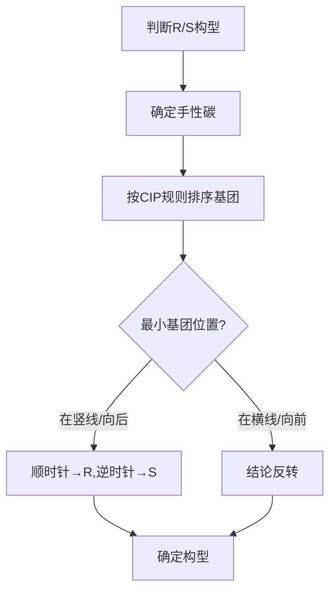
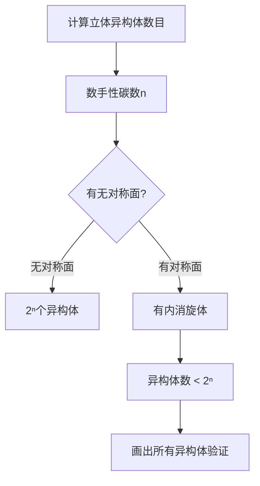

# 立体化学

> **定位**：立体化学研究分子三维空间排列，是有机化学的核心内容。本专题为"讲义抽料台"，可直接复制各板块到学生讲义。

---

## 一、核心结论

### 1.1 手性与对映体（来源：对映异构与手性KP §二）

**手性判断**：
- 不能与其镜像重合的分子具有手性
- 最常见手性中心：连接四个不同基团的sp³碳（C*）
- 对称面、对称中心 → 非手性

**对映体性质**：
- 物理性质（mp、bp、溶解度）完全相同
- 旋光方向相反
- 与手性试剂反应性不同

### 1.2 R/S构型标记（来源：立体化学(核心结论)§二）

**Cahn-Ingold-Prelog规则**：
1. 按原子序数对手性碳上四个基团排序（同位素按质量数）
2. 最小基团朝向远离观察者方向
3. 其余三个基团按优先级递减方向排列：顺时针→R，逆时针→S

### 1.3 E/Z构型（来源：E-Z异构与环状立体化学KP §二）

**双键顺反异构**：
- Z（zusammen）：同侧优先基团
- E（entgegen）：异侧优先基团
- E/Z适用于双键两端有相同基团的情况

### 1.4 Fischer投影规则（来源：立体化学(解题策略)§三）

- 竖线表示向后伸展的键
- 横线表示向前伸展的键
- 纸面内旋转180°不改变构型
- 翻转（90°旋转）改变构型

---

## 二、决策路径

### R/S构型判断流程



### 立体异构体数目计算



---

## 三、对比表格

### 表1：手性判断方法

| 方法 | 判断标准 | 示例 |
|:---|:---|:---|
| 手性碳 | 连接4个不同基团 | 2-丁醇 |
| 手性轴 | 联苯阻旋 | 6,6'-二硝基联苯-2,2'-二甲酸 |
| 手性面 | 平面不对称 | [2.2]对环芳烷 |
| 手性螺环 | 螺原子连接不同基团 | 螺[4.4]壬烷 |

### 表2：R/S判断示例

| 化合物 | 手性碳基团排序 | 构型 |
|:---|:---|:---:|
| L-乳酸 | OH(1)>COOH(2)>CH₃(3)>H(4) | S |
| D-甘油醛 | OH(1)>CHO(2)>CH₂OH(3)>H(4) | R |
| (R)-2-丁醇 | OH(1)>C₂H₅(2)>CH₃(3)>H(4) | R |

### 表3：E/Z判断示例

| 化合物 | 双键两端基团 | 构型 |
|:---|:---|:---:|
| Z-2-丁烯 | 两个CH₃在同侧 | Z |
| E-2-丁烯 | 两个CH₃在异侧 | E |
| Z-1-氯-2-溴丙烯 | Cl(1)和Br(1)在同侧 | Z |

### 表4：立体异构体数目

| 化合物 | 手性碳数 | 理论最大值 | 实际数目 | 原因 |
|:---|:---:|:---:|:---:|:---|
| 2-丁醇 | 1 | 2 | 2 | 无对称面 |
| 酒石酸 | 2 | 4 | 3 | 有内消旋体 |
| 葡萄糖 | 4 | 16 | 16 | 无对称面 |
| 丁烷-2,3-二醇 | 2 | 4 | 3 | 有内消旋体 |

---

## 四、典型例题

### 例1：R/S构型判断（来源：立体化学KP §五 典型例题1）

判断L-乳酸的R/S构型（Fischer投影：COOH在上，OH在右，CH₃在下，H在左）。

**解答**：
- 手性碳上四个基团优先级：-OH(1) > -COOH(2) > -CH₃(3) > -H(4)
- H在横线上（最小基团在横线），其余三基团1→2→3排列方向为顺时针
- 最小基团在横线上→结论反转→实际为**S构型**

### 例2：立体异构体计数（来源：题库 无对应题库）

CH₃CH=CHCH₃ 有几种立体异构体？画出所有异构体。

**解答**：
- 该分子含一个C=C双键，可存在E/Z异构
- **Z-2-丁烯**（顺式）：两个CH₃在双键同侧
- **E-2-丁烯**（反式）：两个CH₃在双键异侧
- 共**2种**立体异构体
- 注意：它们不是对映体（无手性碳），而是非对映体

### 例3：内消旋体判断（来源：题库 无对应题库）

判断酒石酸有几种立体异构体。

**解答**：
- 酒石酸有两个手性碳，理论最大值2²=4
- 但存在对称面：(2R,3S)与(2S,3R)是同一分子（内消旋体）
- 实际立体异构体：(2R,3R)、(2S,3S)、(2R,3S)=内消旋体
- **共3种**：一对对映体 + 一个内消旋体

### 例4：Fischer投影转换（来源：题库 无对应题库）

将以下Fischer投影旋转180°，判断是否改变构型：
CHO在上，H在左，OH在右，CH₃在下

**解答**：
- Fischer投影在纸面内旋转180°**不改变构型**
- 旋转后：CH₃在上，OH在左，H在右，CHO在下
- 验证：最小基团H仍在竖线，优先级排序OH(1)>CHO(2)>CH₃(3)>H(4)
- 顺时针排列→R构型（与旋转前相同）

---

## 五、易错点预警

### 易错1：Fischer投影翻转与旋转搞混（来源：立体化学(解题策略)§三）

- 纸面内旋转180°不改变构型
- 翻转（90°旋转）改变构型
- **陷阱**：判断R/S时必须确保最小基团在竖线位置

### 易错2：混淆E/Z与cis/trans（来源：E-Z异构与环状立体化学KP §三）

- cis/trans仅适用于双键两端有相同基团的情况
- 当双键两端四个基团各不相同时，必须用E/Z标记
- **陷阱**：2-氯-2-丁烯不能用cis/trans描述

### 易错3：对映体数目计算错误（来源：立体化学KP §四）

- 2ⁿ规则仅给出上限
- 当分子存在内消旋体时，实际立体异构体数目少于2ⁿ
- **陷阱**：酒石酸有两个手性碳，但只有3种异构体（不是4种）

### 易错4：手性碳判断的常见错误

- 连接两个相同基团的碳不是手性碳
- sp²杂化的碳（如C=C中的碳）不是手性中心
- **陷阱**：不能仅凭"连了4个基团"就认为是手性碳

### 易错5：旋光度与构型的关系

- 旋光度（+）/（-）与R/S构型**没有直接对应关系**
- 不能说R构型一定是右旋
- **陷阱**：R/S是构型标记，（+）/（-）是旋光方向

### 易错6：非对映体的性质

- 非对映体物理性质**不同**（mp、bp、溶解度）
- 对映体物理性质**相同**
- **陷阱**：不能用"物理性质相同"判断非对映体

### 易错7：环状化合物的顺反异构

- 环状化合物的顺反异构取决于取代基在环平面的同侧还是异侧
- 小环（三元环、四元环）顺反异构受限
- **陷阱**：环己烷的椅式构象中，平伏键和直立键的关系

---

## 六、竞赛深化

### 6.1 手性拆分方法（来源：立体化学KP §六）

- **化学拆分**：与手性试剂形成非对映体，利用溶解度差异分离
- **酶拆分**：利用酶的手性选择性
- **手性色谱**：用手性固定相的HPLC/GC

### 6.2 构象分析与立体化学

- **Newman投影**：沿C-C键观察构象
- **椅式构象**：环己烷的优势构象
- **A值**：取代基平伏键与直立键的自由能差

### 6.3 不对称合成

- **手性催化剂**：如Sharpless环氧化
- **手性辅基**：如Evans噁唑烷酮
- **对映体过量**：ee = ([R]-[S])/([R]+[S]) × 100%

---

## 七、知识链接

**前置知识**
- [[原子结构]] → 手性碳的sp³杂化
- [[化学键]] → 共价键的方向性

**后续知识**
- [[有机反应机理]] → 反应的立体化学结果
- [[有机合成]] → 不对称合成

**相关专题**
- [[专题-有机反应机理总览]]（SN2构型翻转）
- [[专题-高等有机机理与立体化学]]（立体化学深化）
- [[专题-分子结构与杂化]]（sp³杂化与四面体构型）

---

## 八、题库索引

```dataview
TABLE difficulty AS "难度", tags AS "标签"
FROM "04-题库/有机化学"
WHERE contains(file.name, "立体") OR contains(file.name, "手性") OR contains(file.name, "对映")
SORT file.name ASC
```
