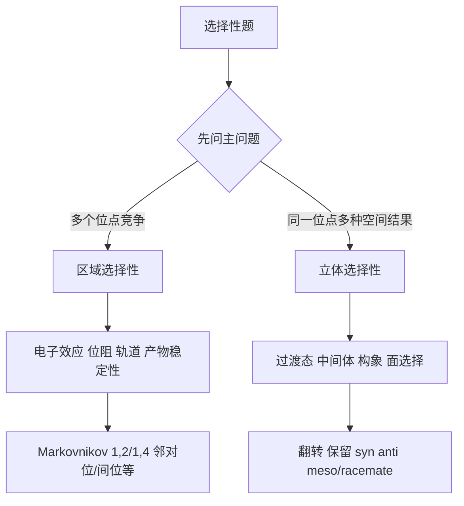

# 专题：立体化学与区域选择性

> 本专题对应考纲条目：[[24-对映异构和非对映异构]]、[[37-加成反应]]、[[41-芳香化合物]]、[[43-不饱和化合物]]
> 核心知识点：[[立体化学]]、[[区域选择性]]、[[反式共平面]]、[[SN2反应]]、[[直接加成与共轭加成]]

---

## 零点五、网课桥梁回流接口 {#source-bridge}

- 默认调用顺序：
  1. [[07-资料提炼/教学逻辑提炼/学而思 有机化学基础/教学逻辑提炼-学而思有机化学基础-批次A-第三轮起步]]
  2. [[07-资料提炼/教学逻辑提炼/Zchem 有机反应合成与机理/教学逻辑提炼-Zchem-选择性与全合成-第三四轮]]
  3. [[07-资料提炼/教学逻辑提炼/Zchem 有机反应合成与机理/教学逻辑提炼-Zchem-波谱分析与结构表征-第三轮]]
- 系统挂接：
  - 总表真值源：[[备课思路/网课资料提炼总表]]
  - 第三轮调用框架：[[备课思路/第三轮总体备课框架#0.6 第三轮网课资源优先调用顺序（2026-06-21）]]
  - 现役备课大纲：[[04-课件/备课大纲/2026-06-04-立体化学与区域选择性-提高班]]
  - 真题收口页：[[专题-真题模拟拆解]]

## 一、核心结论汇总 {#core-conclusions}

**必须记住：**
- 第三轮不再把立体化学当命名练习，而是把它当作“**机理结果的空间证据**”。
- 区域选择性先问“**发生在哪一位**”，立体选择性再问“**从哪一面发生**”。
- 很多题两者同时存在，最常见于：
  - `SN2 / E2`
  - 卤鎓离子加成
  - 硼氢化
  - 共轭二烯和烯酮的 1,2 / 1,4 分流
  - 芳香与杂环位点选择
- 本专题与 [[专题-亲核取代与消除反应]]、[[专题-加成反应]]、[[专题-芳香反应]] 强联动：
  - 专题4提供反转与 anti 消除；
  - 专题5提供 syn / anti 与 1,2 / 1,4；
  - 专题8提供芳香定位作为“区域选择性”的另一种表达。

**第三轮看到选择性题先走这条分叉：**



## 一点五、课堂投影速查卡 {#classroom-quick-card}

**本页课堂入口：** 先让学生把“构型 / 构象 / 区域选择性”三件事分开，再进入具体判断。

**先问四个问题：**

1. 题目要判的是 `R/S / E/Z`、构象稳定性，还是加成/取代发生在哪个位置？
2. 分子有没有刚性骨架、手性中心、双键或环，信息是否足够确定空间关系？
3. 控制结果的主因是位阻、电子效应，还是协同/反式加成这类机理约束？
4. 最后给出的两个产物，差的是构造、非对映、对映，还是只是同一物不同画法？

**一屏判断卡：**

- 先判“题型语言”，不要一上来同时混判构型和区域选择性。
- 看到加成题先问进攻面和顺反来源，看到取代/消除题先问反应构象是否被锁定。
- 区域选择性优先看电子富集/缺失位置，再看位阻是否改写主产物。
- 立体化学题最后必须做一次“镜像/旋转/翻转是否重合”的收口检查。

**讲后立刻练：**

- 适合接一道 `anti/syn 加成 + meso/外消旋` 判断题。
- 再接一道 `共轭体系区域选择性` 题，把电子效应和位阻并排比较。

---

## 一点七、Zchem 二次抽料：选择性三层判据

| 判据层 | 课堂先问什么 | 常见触发场景 | 对应动作 |
|:---|:---|:---|:---|
| 化学选择性 | 先发生哪一类反应 | 同时可取代/加成/消除 | 先判机理赛道，再谈位点 |
| 区域选择性 | 发生在哪个位置 | 共轭体系、芳香定位、羰基加成 | 先比电子效应，再看位阻与可逆性 |
| 立体选择性 | 从哪一面、给什么构型 | `SN2`、卤鎓离子、协同加成 | 追构象、过渡态与进攻面 |
| 路线层 | 为什么这一路主导题面结果 | 多步题、合成题、条件切换题 | 把选择性放回整条路线的先后次序中 |

## 二、对比表格 {#comparison-table}

| 高频场景 | 主要考点 | 选择性来源 | 常见结果 | 第三轮常见坑 |
|:---|:---|:---|:---|:---|
| SN2 | 立体选择性 | 背面进攻 | Walden 翻转 | 只记“一级快”，忘记翻转 |
| E2 | 立体 + 区域 | anti-periplanar + 烯烃稳定性 | Zaitsev / Hofmann | 不做构象分析 |
| Br2 / 卤鎓离子加成 | 立体选择性 | 桥连中间体背面开环 | anti 加成 | 把它当普通碳正离子加成 |
| 硼氢化-氧化 | 区域 + 立体 | 协同过渡态 + 位阻 | 反马氏 + syn | 只记反马氏，忘记 syn |
| 共轭二烯 / 烯酮 | 区域选择性 | 动力学/热力学 + 硬软试剂 | 1,2 / 1,4 分流 | 把温度当唯一判据 |
| 芳香 / 杂环位点 | 区域选择性 | 中间体稳定性与芳香性代价 | 邻对位/间位/杂环特定位点 | 把所有定位都当同一张表 |

## 三、第三轮高频判断清单 {#decision-checklist}

### 3.1 一眼识别模板

- `手性中心发生取代`：优先想 [[SN2反应]] 是否翻转
- `消除生成烯烃`：优先查 [[反式共平面]]
- `Br2 / Cl2 / 卤鎓离子`：优先想 anti 加成
- `BH3/H2O2`：优先想 反马氏 + syn
- `共轭二烯 / α,β-不饱和羰基`：优先问 1,2 还是 1,4
- `芳香 / 杂环位点题`：优先问哪一位中间体最稳或最少破坏芳香性

### 3.2 环己烷构象与立体化学（Zchem）

> 来源：[[资料提炼-Zchem基础有机化学-批次Z-A到Z-E-结构与反应体系]] §8.2

| 构象 | 相对能量 | 特征 | 稳定性原因 |
|:---|:---:|:---|:---|
| 椅式（Chair） | 0 kJ/mol | 所有键交叉式，无扭转张力 | 最稳定构象 |
| 扭船式（Twist-boat） | ~23 kJ/mol | 部分缓解船头船尾斥力 | 亚稳态 |
| 船式（Boat） | ~30 kJ/mol | 船头船尾氢存在旗杆相互作用 | 过渡态 |
| 半椅式（Half-chair） | ~45 kJ/mol | 一个碳原子翘起 | 环翻转过渡态 |

**a键（axial）vs e键（equatorial）**：
- 大取代基优先占据e键，避免1,3-双直立相互作用
- 环翻转时a键↔e键互换
- E2消除要求离去基在a键，相邻a键上的H可被消除

### 3.3 四句口令

1. **先分位置和面，不把两类选择性混说。**
2. **先找过渡态/中间体，再谈结果。**
3. **先有一级决定因素，再加位阻修正。**
4. **先解释为什么会这样，再命名产物。**

## 四、解题套路 / 决策流程 {#problem-solving-routine}

### Step 1：先判断题目在考“位置”还是“面”
- **操作**：若多个连接位点竞争，多半是区域；若同位点有顺反或 R/S 差异，多半是立体。
- **检查点**：☐ 主问题明确 ☐ 没把区域和立体混成一句空话

### Step 2：找到决定选择性的中间体或过渡态
- **操作**：
  - SN2 看背面进攻；
  - E2 看 anti 构象；
  - 卤鎓离子看桥连开环；
  - 硼氢化看协同过渡态；
  - 芳香题看 σ 络合物或 Meisenheimer。
- **检查点**：☐ 决定性结构已找到

### Step 3：再用电子效应、位阻和热力学修正
- **操作**：对区域选择性再补电子效应、位阻、产物稳定性、动力学/热力学控制。
- **检查点**：☐ 一级规则明确 ☐ 二级修正已补上

### Step 4：最后再输出产物的空间结果
- **操作**：明确写出翻转/保留、syn/anti、meso/外消旋或主区域异构体。
- **检查点**：☐ 结果表达完整 ☐ 不只写“主产物”三个字

## 五、机理分析抓手 {#mechanism-analysis}

### 5.1 立体选择性：真正决定的是“从哪一面走”

- SN2：背面进攻 → 翻转
- 卤鎓离子：桥连开环 → anti
- 硼氢化：协同加成 → syn
- E2：anti-periplanar → 构象锁定

### 5.2 区域选择性：真正决定的是“哪一位路径更便宜”

- Markovnikov：更稳碳正离子或等效过渡态
- 1,2 / 1,4：动力学与热力学分流
- 芳香定位：中间体稳定性
- 杂环位点：芳香性损失与电荷分散

### 5.3 第三轮最该建立的连接意识

- 立体选择性不是独立章节，而是每类机理的自然结果。
- 区域选择性不是单独口诀，而是每类反应竞争中的主分叉。

## 六、典型例题串讲 {#typical-examples}

### 例题 1：顺-2-丁烯与 Br2 反应后产物立体关系如何
**分析**：经桥连卤鎓离子，只能背面开环。  
**解答**：anti 加成，得到一对对映体。  
**反思**：反式加成来自机理，而不是独立背诵项。

### 例题 2：2-溴丁烷 E2 时为什么不能不看构象
**分析**：若几何不满足 anti-periplanar，再稳定的烯烃也出不来。  
**解答**：必须先找能消除的构象，再比较产物。  
**反思**：E2 题的第一步是构象，不是 Zaitsev。

### 例题 3：BH3/H2O2 为什么同时给反马氏和 syn
**分析**：区域和立体都由同一个协同过渡态决定。  
**解答**：区域上 OH 落在位阻更小端，立体上 H/B 同面加成。  
**反思**：同一个过渡态往往同时决定两类选择性。

### 例题 4：共轭二烯加成为什么低温高温产物不同
**分析**：这是区域选择性里的动力学/热力学分流，不是单独温度口号。  
**解答**：低温更偏 1,2，高温更偏 1,4。  
**反思**：温度只是表象，真正底层是两条路径的能量图差异。

## 七、课堂组织建议 {#teaching-organization}

- **第一层**：先把“区域 vs 立体”这两个问题彻底拆开。
- **第二层**：再用取代、消除、加成、芳香四类反应做交叉练习。
- **第三层**：最后建立“一个过渡态可同时决定区域与立体”的整体感。
- **第三轮可直接展开的内容**：
  - SN2 / E2 / 卤鎓离子 / 硼氢化的典型立体结果；
  - 1,2 / 1,4、Markovnikov、芳香定位等区域分流；
  - 区域与立体的同题联动判断。

## 八、关联知识点 {#related-kp}

- [[立体化学]]
- [[区域选择性]]
- [[反式共平面]]
- [[SN2反应]]
- [[直接加成与共轭加成]]
- [[SEAr定位规则]]

## 九、关联题型 {#related-problem-types}

- [[题型-立体化学推断]]
- [[题型-区域选择性判断]]
- [[题型-加成产物预测]]
- [[题型-SN1/SN2/E1/E2竞争判断]]

## 十、相关真题 {#related-exam-questions}

```dataview
TABLE file.name AS "文件名", year AS "年份", type AS "题型", difficulty AS "难度"
FROM "05-真题库"
WHERE contains(knowledge_points, "立体化学")
   OR contains(knowledge_points, "区域选择性")
SORT year DESC, difficulty ASC
```

### 真题使用建议 {#exam-usage-tips}

- 立体化学与区域选择性不是独立考题——它总是"寄生"在取代、消除、加成、芳香反应中。训练时要刻意把"这道题的立体结果是什么"作为每道机理题的必答项，培养"不报立体不交卷"的习惯。
- 先专项练"从机理推立体"（SN2→翻转、E2→反式消除、Br₂→anti、BH₃→syn），再练"从立体反推机理"（给定产物构型→反推反应路径与条件）。
- 区域选择性题的核心是"先找电子效应主导方向，再用位阻修正"——不要把温度和位阻当成第一判据。动力学/热力学控制的区分（1,2 vs 1,4）是竞赛高频区分点。

### 推荐真题 {#recommended-exam-questions}

| 真题 | 核心考点 | 难度 |
|:---|:---|:---:|
| [[真题-有机-SN2立体化学-001]] | SN2 反应的 Walden 翻转：手性中心构型反转与背面进攻机理 | ⭐⭐⭐ |
| [[真题-有机-硼氢化-001]] | 硼氢化-氧化的双重选择性：反马氏区域选择性 + syn 立体选择性同源控制 | ⭐⭐⭐ |
| [[真题-有机-E2消除-001]] | E2 消除的反式共平面要求：构象锁定决定区域与立体双重结果 | ⭐⭐⭐ |

### 真题链与讲评顺序 {#exam-sequence}

- `第 1 题`：[[真题-有机-SN2立体化学-001]]（SN2 翻转）。课堂用途：warm-up，从最干净的"一步协同→背面进攻→构型翻转"建立"机理→立体"的确定性映射。
- `第 2 题`：[[真题-有机-硼氢化-001]]（区域+立体双控）。课堂用途：main，训练"一个协同过渡态同时决定区域选择性和立体选择性"的联动思维——这是选择性教学的核心进阶点。
- `第 3 题`：[[真题-有机-E2消除-001]]（构象控制的立体选择性）。课堂用途：synthesis，把构象分析嵌入立体判断——E2 产物预测必须经过"椅式翻转→找 a,a-双直立→判消除方向"的完整流程。
- 课堂顺序建议：`纯立体（SN2翻转）→ 区域+立体联动（硼氢化）→ 构象→立体（E2）`。先建立"机理输出立体"的直觉，再逐步增加控制维度。

*本专题依据 [[模板-专题]] v1.7 生成。*
*第三轮定位：作为“机理结果解释层”，供取代、加成、芳香、周环专题反复回引。*

> 📎 相关提炼：[[07-资料提炼/书籍提炼/提炼-Clayden-第33章-非对映选择性]] · [[07-资料提炼/书籍提炼/提炼-Clayden-第32章-环状分子中的立体选择性]] · [[07-资料提炼/书籍提炼/提炼-Clayden-第24章-区域选择性]]
