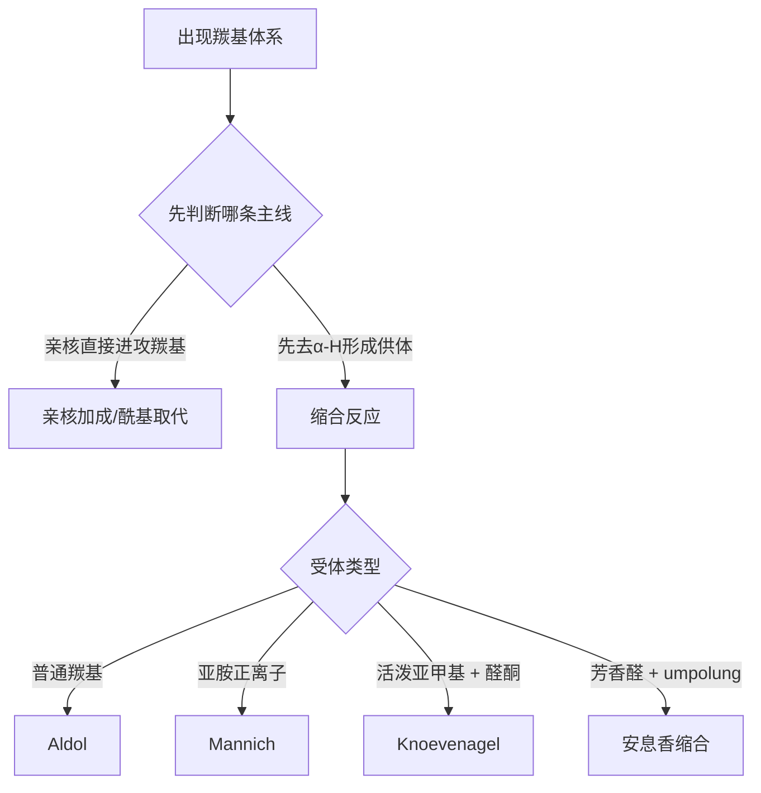

# 专题：羰基化学与缩合反应

> 2026-06-19 复核说明：本专题对应的大纲、新授课、教学洞察、工具卡与题单主链均已实存；当前待补主要是更完整的真题挂接，不再属于主干缺件，现统一升为 `已审校`。

> 本专题对应考纲条目：[[45-亲核加成反应]]、[[46-羰基α位反应]]、[[47-羧酸及羧酸衍生物]]
> 核心知识点：[[羰基亲核加成]]、[[羧酸衍生物]]、[[Aldol缩合]]、[[Mannich反应]]、[[Knoevenagel缩合]]、[[安息香缩合]]、[[Claisen缩合]]

---

## 一、核心结论汇总 {#core-conclusions}

**必须记住：**
- 第三轮羰基主干要统一成两条大线：**羰基亲核加成/酰基亲核取代** 与 **α-位活化后的缩合构碳**。
- 交叉 Aldol、Mannich、Knoevenagel、安息香缩合不是四个分散反应，而是“谁做供体、谁做受体、是否发生极性翻转”的不同版本。
- 羧酸衍生物部分要与合成接口连起来，尤其是“羧酸不能直接高效酰胺化，往往要先活化”。

**最高频决策路径：**



## 一点五、课堂投影速查卡 {#classroom-quick-card}

**本页课堂入口：** 先问“这题是在考羰基碳，还是在考 α 位”，这一步分对了，后面就顺很多。

**先问四个问题：**

1. 反应物是醛酮本体、羧酸衍生物，还是带活泼 α-H 的羰基化合物？
2. 试剂是亲核体、碱、酸，还是胺/醇这类先成中间体再转化的试剂？
3. 题目核心是亲核加成、加成消除，还是烯醇/烯醇负离子参与的成键？
4. 最终要求是判单步产物，还是追踪“加成 → 消除/脱水 → 缩合”的连续过程？

**一屏判断卡：**

- 醛酮题先看羰基碳；缩合题先看 α 位能否被活化。
- 羧酸衍生物反应通常要补一问“离去基能不能走”，不要只看进攻。
- 缩合反应先写成键步，再决定是否脱水、是否形成共轭稳定产物。
- 同类题常错在“把羰基化学只看成官能团转化，没有看到建碳骨架”。

**讲后立刻练：**

- 先做一道醛酮与胺/醇/格氏试剂的赛道分流题。
- 再做一道 Aldol / Claisen / Michael 选择题，把 α 位语言真正建立起来。

---

## 二、对比表格 {#comparison-table}

| 触发条件（题目关键词） | 比较维度 | A | B | 常见陷阱 |
|----------------------|---------|---|---|---------|
| `α-H`、`碱` | 供体资格 | 可形成烯醇负离子 | 仅做受体 | 忘记先判断有没有 α-H |
| `交叉缩合` | 成功条件 | 受体无 α-H | 供体更易去质子化 | 只说“可能混合物” |
| `甲醛 + 胺` | 亲电体 | 亚胺正离子 | 非直接羰基 | 把 Mannich 当普通 Aldol |
| `CN-催化`、`芳香醛` | 反应本质 | 极性翻转 | 非普通羰基亲电性 | 忘记安息香缩合价值在 umpolung |
| `酰氯/酸酐/酯/酰胺` | 反应活性 | 酰氯 > 酸酐 > 酯 > 酰胺 | 离去基稳定性递减 | 死记顺序，不会解释 |
| `羧酸 + 胺` | 实际先发生什么 | 先成盐 | 非高效直接成酰胺 | 看到两种官能团就默认能偶联 |
| `β-二羰基`、`活泼亚甲基` | 缩合能力 | 更容易作供体 | 普通酮作供体更难控 | 忘记酸性差异决定可控性 |

### 2.1 羰基主线速查图

| 主线 | 先判断什么 | 典型专题动作 | 代表知识点 |
|:---|:---|:---|:---|
| 亲核加成 | 羰基是否足够亲电 | Nu 直接进攻羰基碳 | [[羰基亲核加成]] |
| 酰基取代 | 是否存在可离去基 | 加成后再消除 | [[羧酸衍生物]]、[[酰基亲核取代]] |
| α-位活化 | 是否有 α-H / 活泼亚甲基 | 先生成供体再构建 C-C 键 | [[Aldol缩合]]、[[Claisen缩合]] |
| 极性翻转 | 体系能否把羰基“翻成供体” | 芳香醛偶联或合成接口转向 | [[安息香缩合]]、[[极性反转]] |

## 三、解题套路 / 决策流程 {#problem-solving-routine}

### Step 1：先分“加成/取代”还是“缩合”
- **操作**：先看是否涉及 α-H 活化与供体-受体分工。
- **依据 KP**：[[羰基亲核加成]]、[[酰基亲核取代]]、[[Aldol缩合]]
- **检查点**：☐ 已识别是否先成烯醇负离子 ☐ 没把两条主线混掉

### Step 2：缩合题先判断供体与受体
- **操作**：先找无 α-H 受体，或更酸性的供体。
- **依据 KP**：[[Aldol缩合]]、[[Mannich反应]]、[[Knoevenagel缩合]]
- **检查点**：☐ 谁做供体已定 ☐ 谁做受体已定

### Step 3：羧酸衍生物题画活性阶梯
- **操作**：把底物放到酰氯 > 酸酐 > 酯 > 酰胺活性轴上。
- **依据 KP**：[[羧酸衍生物]]
- **检查点**：☐ 低活性到高活性是否需要活化 ☐ 是否先成盐而非直接成酰胺

### Step 3.5：缩合反应统一对比（Zchem）

> 来源：[[资料提炼-Zchem基础有机化学-批次Z-A到Z-E-结构与反应体系]] §8.5

| 缩合类型 | 底物 | 产物 | 驱动力 |
|:---|:---|:---|:---|
| Aldol | 醛/酮 | β-羟基羰基 | 亲核加成 |
| 脱水Aldol | 醛/酮 | α,β-不饱和羰基 | 共轭稳定化 |
| Claisen | 酯 | β-酮酯 | 稳定烯醇负离子 |
| 交叉Claisen | 两种酯（其一无α-H） | β-酮酯 | 避免自缩合 |
| Dieckmann | 二元酯 | 环状β-酮酯 | 环化熵驱动 |
| Mannich | 醛 + 胺 + 含α-H羰基 | β-氨基羰基 | 亚胺正离子亲电性 |
| Knoevenagel | 活泼亚甲基 + 醛/酮 | α,β-不饱和羰基 | 烯醇负离子供体 |
| 安息香 | 芳香醛 + CN⁻ | α-羟基酮 | 极性翻转（umpolung） |

**烯醇/烯醇负离子统一框架**：
- **酸性条件**：质子化羰基氧 → 增强α-H酸性 → 脱质子形成烯醇；取代度更高的烯醇更稳定（热力学控制）
- **碱性条件**：强碱夺取α-H → 形成烯醇负离子；位阻小的α-H更易被夺取（动力学控制）；大位阻强碱（LDA）在低温下 → 动力学产物

### Step 4：最后判断后处理会不会改变主产物
- **操作**：检查是否有脱水、皂化、水解、消除或再缩合。
- **依据 KP**：[[Aldol缩合]]、[[酯水解]]、[[Mannich反应]]
- **检查点**：☐ 题目终点是中间体还是最终稳定产物 ☐ 有没有一锅串联

## 四、反应机理拆解（含检查表）（可选，机理类专题启用） {#mechanism-analysis}

#### 步骤 1：确定亲核体来源
- **攻击位点**：羰基碳或共振形式中的 β 位
- **形成键**：C-C 或 C-N 新键
- **断裂键**：取决于是否发生消除与离去
- **学生任务（接力点）**：下一位同学需要判断的是供体-受体分工还是后续脱水/消除
- **检查表**：
  - ☐ 已判断是否有 α-H
  - ☐ 已判断是四面体中间体还是烯醇负离子进攻
  - ☐ 已判断是否有极性翻转

#### 步骤 2：判断是“停在加成”还是“继续消除/脱水”
- **攻击位点**：四面体中间体中心或 β-羟基后续消除位点
- **形成键**：C=C、C=O 重建或新酰基取代键型稳定
- **断裂键**：C-O、C-N 或离去基键
- **学生任务（接力点）**：下一位同学需要判断的是产物是否还会继续进入串联反应
- **速控/非速控**：缩合题常由前面成供体那一步决定是否发生，后续脱水多为顺势推进
- **检查表**：
  - ☐ 是否存在更稳定共轭产物
  - ☐ 离去基是否足够好
  - ☐ 条件是否支持酸/碱催化后续步骤

### 4.1 第三轮高频判断清单

- 看到交叉缩合，先问：谁没有 α-H？
- 看到 β-二羰基，先问：它是不是更适合当供体？
- 看到甲醛 + 胺 + 羰基，先问：是不是 Mannich 而非直接羟醛？
- 看到羧酸 + 胺，先问：是不是应该先活化羧酸？
- 看到芳香醛 + CN⁻，先问：这里是不是在考极性翻转？

## 五、典型例题串讲 {#typical-examples}

### 例题 1
**题目：** 为什么交叉 Aldol 常优先选苯甲醛作受体？  
**分析：** 苯甲醛无 α-H，只做亲电体，不自发生成竞争性供体。  
**解答：** 因此有利于降低混合物复杂度，提高交叉缩合可控性。  
**反思：** 第三轮羰基题最重要的是“先判断供受体角色”。  

### 例题 2
**题目：** 为什么“羧酸 + 胺”通常不能直接作为高效酰胺化路线写进合成题？  
**分析：** 先发生酸碱中和，胺亲核性下降；羧酸本身的 `-OH` 还是差离去基。  
**解答：** 所以通常需要先活化成酰氯、酸酐或借助缩合剂，再进行酰胺化。  
**反思：** 第三轮合成设计题里，最怕把“官能团共存”误判成“已经具备直接转化条件”。  

### 例题 3
**题目：** 甲基乙基酮、甲醛和二甲胺在酸催化下反应，最值得优先联想到哪类缩合？  
**分析：** 题眼是“甲醛 + 胺”先形成亚胺正离子，再由羰基供体进攻。  
**解答：** 优先联想到 Mannich 反应，产物是 β-氨基羰基化合物。  
**反思：** 第三轮题目中的关键词识别，往往比机械默写方程式更重要。  

### 例题 4
**题目：** 为什么安息香缩合在第三轮里常被单独强调？  
**分析：** 它不仅是芳香醛偶联，更体现羰基的极性翻转。  
**解答：** 在 CN⁻ 或 NHC 催化下，醛可表现为“酰基负离子当量”，从而完成通常难以发生的偶联。  
**反思：** 学会把人名反应上升成“结构化方法语言”，才是第三轮真正的增量。  

## 六、关联知识点 {#related-kp}

- [[羰基亲核加成]]
- [[羧酸衍生物]]
- [[Aldol缩合]]
- [[Mannich反应]]
- [[Knoevenagel缩合]]
- [[安息香缩合]]

## 七、关联题型 {#related-problem-types}

- [[题型-缩合反应产物预测]]
- [[题型-供体受体判断]]
- [[题型-羧酸衍生物转化路线]]
- [[题型-极性翻转判断]]

## 八、相关真题 {#related-exam-questions}

```dataview
TABLE file.name AS "文件名", year AS "年份", type AS "题型", difficulty AS "难度"
FROM "05-真题库"
WHERE contains(knowledge_points, "Aldol缩合")
   OR contains(knowledge_points, "Mannich反应")
   OR contains(knowledge_points, "羧酸衍生物")
SORT year DESC, difficulty ASC
```

### 真题使用建议

- 缩合类真题应成组讲：Aldol（有α-H醛酮）→ Claisen（酯缩合）→ Cannizzaro（无α-H歧化），用"有没有α-H"作为分组线
- 烯醇烷基化真题作为缩合反应的前置技能先讲，学生先学会"怎样生成特定烯醇负离子"再进缩合
- 缩醛保护真题串联到合成路线题里讲"为什么要在缩合前先保护"，而非孤立讲保护基

### 推荐真题

| 真题 | 核心考点 | 难度 |
|:---|:---|:---:|
| [[真题-有机-Aldol缩合-001]] | 乙醛碱催化缩合——供体/受体识别与脱水条件判断 | ⭐⭐⭐ |
| [[真题-有机-Claisen缩合-001]] | 酯缩合到β-酮酯——交叉缩合的"谁有α-H谁做供体"前提 | ⭐⭐⭐⭐ |
| [[真题-有机-Cannizzaro-001]] | 苯甲醛无α-H歧化——条件识别切换到非缩合机理赛道 | ⭐⭐⭐ |
| [[真题-有机-烯醇烷基化-001]] | LDA/CH₃I的动力学烷基化——α-位活化与区域选择性 | ⭐⭐⭐⭐ |
| [[真题-有机-缩醛保护-001]] | 环己酮缩酮化——多步路线中的保护基意识与管理 | ⭐⭐ |

### 真题链与讲评顺序

- `第 1 题`：[[真题-有机-烯醇烷基化-001]]，先建立"α-位如何被活化成亲核供体"的前置语言。课堂用途：warm-up
- `第 2 题`：[[真题-有机-Aldol缩合-001]]，用最简单的醛缩合建立供体-受体分工与脱水判断。课堂用途：main
- `第 3 题`：[[真题-有机-Cannizzaro-001]]，用"无α-H"的反例强调缩合前提条件，形成对比记忆。课堂用途：main
- `第 4 题`：[[真题-有机-Claisen缩合-001]]，从醛缩合升级到酯缩合，引入离去基和活性阶梯语言。课堂用途：main
- `第 5 题`：[[真题-有机-缩醛保护-001]]，将羰基化学与合成路线管理串联。课堂用途：synthesis
- 课堂顺序建议：烯醇烷基化(warm-up) → Aldol(main) → Cannizzaro(main) → Claisen(main) → 缩醛保护(synthesis)

> 💡 **与备课大纲/速查卡的衔接**：这些真题已映射到对应备课大纲 §2.6 的认知台阶和速查卡 §十 的配套练习——教师可在三处交叉参考排题。

*本专题依据 [[模板-专题]] v1.7 生成。*
*第三轮定位：有机主干的核心专题之一，后续优先进入备课大纲与新授课层。*

> 可用性说明：本页已满足第三轮备课入口要求，后续优先补“高频真题策展 + 机理图示化”。

> 📎 相关提炼：[[07-资料提炼/书籍提炼/提炼-ABOC-第6章-缩合反应]]
