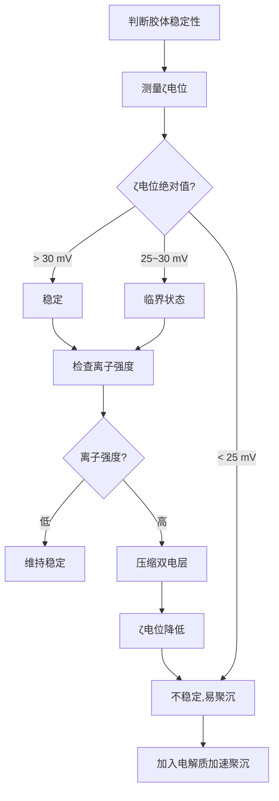

# 胶体与表面化学

> **定位**：胶体与表面化学研究分散体系和界面现象，是物理化学的重要分支。本专题为"讲义抽料台"，可直接复制各板块到学生讲义。

---

## 一、核心结论

### 1.1 胶体分散系定义（来源：胶体分散系KP §一）

| 分散系类型 | 粒子大小 | 特征 | 示例 |
|:---:|:---:|:---|:---|
| 溶液 | < 1 nm | 透明，稳定，无丁达尔效应 | NaCl水溶液 |
| 胶体 | 1~100 nm | 透明或半透明，亚稳定 | Fe(OH)₃溶胶 |
| 浊液 | > 100 nm | 不透明，不稳定 | 泥浆水 |

### 1.2 胶体三大特性（来源：胶体分散系KP §二）

| 特性 | 定义 | 应用 |
|:---|:---|:---|
| 丁达尔效应 | 胶体对光的散射 | 鉴别胶体与溶液 |
| 布朗运动 | 分散相粒子的无规则运动 | 解释胶体动力稳定性 |
| 电泳/电渗 | 胶体粒子在电场中定向移动 | 证明胶体带电 |

### 1.3 DLVO理论（来源：胶体稳定性与DLVO理论KP §二）

$$V_T = V_A + V_R$$

- **V_A**（van der Waals引力）：与距离的−2次方成正比，始终存在
- **V_R**（双电层排斥力）：取决于ζ电位和离子强度
- **稳定条件**：V_R > |V_A|，存在势垒阻止聚沉

### 1.4 Schulze-Hardy规则（来源：胶体稳定性与DLVO理论KP §四）

**临界聚沉浓度（CCC）与反离子价数的关系**：

| 反离子价数 | 相对聚沉能力 | CCC比值 |
|:---:|:---:|:---:|
| 1 | 1 | 1 |
| 2 | 约60~100 | 1/64~1/100 |
| 3 | 约700~1000 | 1/729~1/1000 |

---

## 二、决策路径

### 胶体稳定性判断



### 吸附等温线选择

```mermaid
graph TD
    A[选择吸附等温线] --> B{吸附层数?}
    B -->|单层| C{表面均匀?}
    B -->|多层| D[BET方程]
    C -->|是| E[Langmuir等温式]
    C -->|否| F[Freundlich等温式]
    E --> G[线性化: P/V = 1/(Vm·K) + P/Vm]
    F --> H[线性化: lg q = lg k + (1/n)lg C]
    D --> I[测定比表面积]
```

---

## 三、对比表格

### 表1：表面活性剂分类（来源：表面活性剂与乳化KP §三）

| 类型 | HLB值 | 亲水性 | 应用 | 示例 |
|:---:|:---:|:---:|:---|:---|
| W/O乳化剂 | 3~6 | 亲油 | 油包水乳状液 | 硬脂酸钙 |
| 润湿剂 | 7~9 | 中等 | 润湿作用 | 十二烷基硫酸钠 |
| O/W乳化剂 | 8~18 | 亲水 | 水包油乳状液 | 吐温系列 |
| 洗涤剂 | 13~15 | 亲水 | 去污洗涤 | 十二烷基苯磺酸钠 |
| 增溶剂 | 15~18 | 强亲水 | 增溶难溶物 | 聚氧乙烯醚 |

### 表2：吸附等温线对比（来源：吸附等温线KP §二）

| 等温线 | 公式 | 适用条件 | 特点 |
|:---|:---|:---|:---|
| Langmuir | θ = KP/(1+KP) | 单层吸附，均匀表面 | 有饱和值 |
| Freundlich | q = kC^(1/n) | 多层吸附，非均匀表面 | 经验公式 |
| BET | 多层吸附模型 | 多层吸附 | 测定比表面积 |

### 表3：胶体聚沉方法

| 方法 | 原理 | 示例 |
|:---|:---|:---|
| 加入电解质 | 压缩双电层 | 加入NaCl使Fe(OH)₃溶胶聚沉 |
| 加入相反电荷胶体 | 电荷中和 | 加入带正电胶体使带负电胶体聚沉 |
| 加热 | 增加碰撞频率 | 加热使胶体聚沉 |
| 加入表面活性剂 | 破坏双电层 | 加入洗涤剂破乳 |

### 表4：乳状液类型对比

| 类型 | 分散相 | 分散介质 | 乳化剂 | 稳定性 |
|:---|:---|:---|:---|:---|
| O/W | 油 | 水 | HLB 8~18 | 较稳定 |
| W/O | 水 | 油 | HLB 3~6 | 较稳定 |

---

## 四、典型例题

### 例1：ζ电位与稳定性（来源：胶体稳定性与DLVO理论KP §五 典型例题）

某胶体的ζ电位为+35 mV，加入NaCl后ζ电位降至+15 mV，胶体开始聚沉。解释该现象。

**解答**：
- **ζ电位含义**：ζ是滑动面处的电位，反映双电层厚度和胶体稳定性
- **加入NaCl的影响**：Na⁺作为反离子压缩双电层，Debye长度κ⁻¹减小，V_R降低
- **临界ζ电位**：一般认为|ζ| < 25~30 mV时胶体不稳定，本例中|ζ| = 15 mV已低于临界值，故发生聚沉

### 例2：Schulze-Hardy规则应用（来源：题库 无对应题库）

比较NaCl、CaCl₂、AlCl₃对Fe(OH)₃正溶胶的聚沉能力。

**解答**：
- Fe(OH)₃溶胶带正电，需要阴离子（反离子）聚沉
- 反离子价数：Cl⁻(1) < SO₄²⁻(2) < PO₄³⁻(3)
- 根据Schulze-Hardy规则，聚沉能力：AlCl₃ > CaCl₂ > NaCl
- 比值约为 1 : 64 : 729

### 例3：Langmuir等温式应用（来源：吸附等温线KP §三）

某气体在固体表面的吸附数据：P/kPa: 10, 20, 40, 80, 160；V/cm³: 10.2, 15.3, 22.5, 30.4, 36.0。用Langmuir等温式求Vm和K。

**解答**：
- Langmuir线性形式：P/V = 1/(Vm·K) + P/Vm
- 以P/V对P作图，斜率 = 1/Vm，截距 = 1/(Vm·K)
- 由数据计算：P/V值分别为0.98, 1.31, 1.78, 2.63, 4.44
- 线性回归得：斜率 ≈ 0.024，截距 ≈ 0.75
- Vm = 1/0.024 ≈ **41.7 cm³**，K = 1/(41.7×0.75) ≈ **0.032 kPa⁻¹**

### 例4：丁达尔效应（来源：题库 无对应题库）

为什么晴朗的天空呈蓝色，而夕阳呈红色？

**解答**：
- 大气中的微小颗粒（气溶胶）对阳光产生散射
- Rayleigh散射：散射强度 ∝ 1/λ⁴
- 蓝光波长短（~450nm），散射强 → 天空呈蓝色
- 夕阳时光程长，蓝光被散射殆尽，剩余红光（~700nm）→ 夕阳呈红色

---

## 五、易错点预警

### 易错1：ζ电位的概念（来源：胶体稳定性与DLVO理论KP §三）

- ζ电位是**滑动面处的电位**，不是表面电位
- 表面电位 > ζ电位（因为滑动面在双电层内部）
- **陷阱**：不能将ζ电位等同于表面电位

### 易错2：DLVO理论的局限性

- DLVO理论只考虑van der Waals力和双电层排斥力
- **不考虑空间位阻效应**（需用空间稳定理论补充）
- 对于高分子稳定的胶体，DLVO理论不适用

### 易错3：Langmuir等温式的假设

- 假设**单层吸附**且**吸附位等价**
- 实际体系常偏离（多层吸附、非均匀表面）
- **陷阱**：不要将Langmuir公式用于多层吸附体系

### 易错4：CMC的意义

- CMC是表面活性剂形成胶束的最低浓度
- 低于CMC时，表面活性剂主要吸附在界面
- 高于CMC时，形成胶束，界面吸附饱和
- **陷阱**：CMC不是溶解度极限

### 易错5：乳状液类型判断

- O/W型：水为连续相，油为分散相（如牛奶）
- W/O型：油为连续相，水为分散相（如黄油）
- **判断方法**：稀释法（加水稀释，能分散为O/W型）

### 易错6：BET方程的适用范围

- BET方程适用于**多层吸附**，常用于测定固体比表面积
- P/P₀范围：0.05~0.35（相对压力）
- **陷阱**：P/P₀太大或太小都会偏离线性

### 易错7：胶体的聚沉与絮凝

- 聚沉：胶体粒子聚集成大颗粒而沉降
- 絮凝：加入絮凝剂使胶体粒子形成疏松絮状物
- **区别**：聚沉不可逆，絮凝可逆（搅拌可分散）

---

## 六、竞赛深化

### 6.1 胶体的流变性质（来源：胶体分散系KP §五）

- **牛顿流体**：剪切应力与剪切速率成正比（如水）
- **非牛顿流体**：剪切变稀（如油漆）、剪切增稠（如淀粉糊）
- **触变性**：静置变稠，搅拌变稀（如凝胶）

### 6.2 微乳液

- 热力学稳定的透明分散体系
- 粒径 < 100 nm（比普通乳状液小）
- 需要大量表面活性剂和助表面活性剂
- 应用：三次采油、药物传递

### 6.3 气凝胶与干凝胶

- **气凝胶**：超临界干燥制备，密度极低（~1 mg/cm³）
- **干凝胶**：普通干燥制备，有收缩
- 应用：隔热材料、催化剂载体、吸附剂

---

## 七、知识链接

**前置知识**
- [[化学热力学]] → 表面张力与Gibbs自由能
- [[分子间力]] → van der Waals力基础

**后续知识**
- [[相图与相平衡]] → 乳状液相行为
- [[高分子化学]] → 高分子溶液与胶体

**相关专题**
- [[专题-溶液与相图]]（分散体系热力学）
- [[专题-物化综合计算]]（胶体与表面化学计算）

---

## 八、题库索引

```dataview
TABLE difficulty AS "难度", tags AS "标签"
FROM "04-题库/物理化学"
WHERE contains(file.name, "胶体") OR contains(file.name, "表面")
SORT file.name ASC
```
