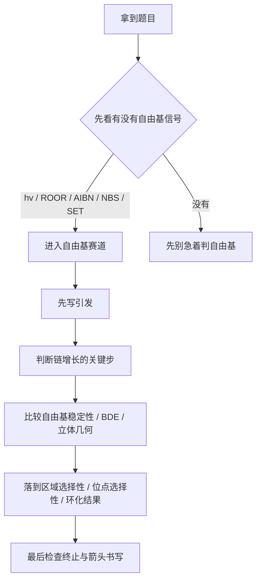

# 专题：自由基反应

> 2026-06-19 复核说明：本专题对应的专题页、备课大纲、课堂执行页、教学洞察均已成套落地，原状态属于系统回写滞后，现统一升为 `已审校`。

> 本专题对应考纲条目：[[31-自由基反应]]、[[34-有机反应机理]]、[[40-加聚与自由基聚合]]
> 核心知识点：[[自由基]]、[[自由基取代]]、[[过氧化物效应]]、[[专题-自由基反应]]、[[Barton反应]]、[[光氧化还原催化]]

---

## 零点五、网课桥梁回流接口 {#source-bridge}

- 默认调用顺序：
  1. [[07-资料提炼/教学逻辑提炼/Zchem 有机反应合成与机理/教学逻辑提炼-Zchem-周环反应与活性中间体-第三轮]]
  2. [[07-资料提炼/教学逻辑提炼/Zchem 有机反应合成与机理/教学逻辑提炼-Zchem-物理有机与机理判断-第四轮]]
  3. [[07-资料提炼/书籍提炼/提炼-Clayden-第37章-自由基反应]]

## 一、专题定位：第三轮“链式单电子机理”总入口 {#positioning}

- 如果说 [[专题-周环反应]] 讲的是“没有中间体的协同机理”，那本专题讲的就是“**有中间体，而且以链式单电子过程持续推进**”。
- 自由基反应的关键不是简单背“`hv` 就是自由基”，而是建立一套 `引发 → 链增长 → 终止` 的过程语言。
- 对照 [[第三轮总体备课框架]]，这是有机主干里和周环并列的重要后段主线，也是从传统机理过渡到现代单电子有机化学的入口。

**第三轮总判断句：**

```text
先认自由基信号，
再分引发/增长/终止，
再看自由基稳定性与选择性，
最后落到产物和机理书写。
```

**与前后专题的衔接：**

| 关联专题 | 本专题提供什么补充语言 |
|:---|:---|
| [[专题-活性中间体与反应机理基础]] | 把“自由基作为中间体”推进成完整链式反应系统 |
| [[专题-加成反应]] | 用 HBr/ROOR 解释为什么区域选择性会被机理赛道改写 |
| [[专题-周环反应]] | 对比“协同机理”与“链式机理”两条不同思维路径 |
| [[专题-有机合成与金属有机]] | 作为后续现代有机合成中单电子策略的前置层 |

---

## 二、核心结论汇总 {#core-conclusions}

**必须记住：**

1. 自由基题的第一步不是直接报产物，而是先判断有没有自由基引发条件。
2. 自由基反应最稳定的课堂入口，是 `烷烃卤代选择性 → HBr/ROOR 反马氏 → 烯丙位溴代 → 自由基环化` 这条主线。
3. 自由基稳定性与碳正离子有相似顺序，但判断语言不能完全照搬。
4. 自由基机理必须用鱼钩箭头，不能混成双电子过程。
5. `Br2` 的高选择性、过氧化物效应、5-exo-trig 优先、Barton 远程官能团化，都是“自由基稳定性 + 过渡态特征 + 链增长可持续性”的不同表现。

---

## 二点五、课堂投影速查卡 {#classroom-quick-card}

**本页课堂入口：** 先问“题里有没有单电子信号”，一旦认出来，整套判断语言就要切换。

**先问四个问题：**

1. 有没有 `hv / ROOR / AIBN / NBS / SET` 这类自由基触发条件？
2. 当前更像取代、加成、环化，还是远程官能团化？
3. 链增长哪一步最关键，哪个自由基更稳定、也更容易继续传递链？
4. 题目是在考主产物，还是在考为什么这一位点/这一闭环优先？

**一屏判断卡：**

- 认出自由基赛道后，第一笔先写引发，不要直接写最终产物。
- 区域与位点选择性常由“更稳定自由基 + 更快链增长”共同控制。
- 环化题优先检查 `5-exo-trig`、`6-endo-trig` 这类经验倾向。
- 板书必须坚持鱼钩箭头，否则学生很容易又滑回双电子机理。

**讲后立刻练：**

- 先做一道 `HBr/ROOR` 反马氏加成题。
- 再做一道自由基环化或烯丙位溴代题，把链式语言用熟。

---

## 二点七、Zchem 二次抽料：链式机理题四步筛法

| 步骤 | 先问什么 | 高频信号 | 对应动作 |
|:---|:---|:---|:---|
| 第一步 | 有没有单电子触发条件 | `hv`、`ROOR`、`AIBN`、`SET` | 先切赛道，避免混成双电子机理 |
| 第二步 | 链增长哪一步决定主产物 | 抽氢、加成、环化、卤转移 | 追踪最可持续的链传播 |
| 第三步 | 哪个自由基更稳、也更容易继续反应 | 烯丙/苄位、三级中心、5-exo-trig | 比稳定性，也比几何可达性 |
| 第四步 | 题目要你回答产物、位点还是证据 | 抑制剂、副产物、立体信息 | 补上机理证据，不只报答案 |

## 三、第三轮总流程 {#overall-route}



### 3.2 自由基稳定性与卤代选择性（Zchem）

> 来源：[[资料提炼-Zchem基础有机化学-批次Z-A到Z-E-结构与反应体系]] §8.1

**BDE（键解离能）数据**：

| 键类型 | BDE (kJ/mol) | 对应自由基稳定性 |
|:---|:---:|:---|
| CH₃–H | 439 | 甲基自由基（最不稳定） |
| 1° C–H | 422 | 一级自由基 |
| 2° C–H | 410 | 二级自由基 |
| 3° C–H | 397 | 三级自由基（最稳定） |

**选择性规律**：
- **溴化**：活化能高 → 速率慢 → **选择性好**（主要取代三级氢）
- **氯化**：活化能低 → 速率快 → **选择性差**（产物比例接近统计值）
- 氟化：过于剧烈，不可控
- 碘化：热力学不利（可逆）

**课堂速记**：Br₂ 看选择性，Cl₂ 看统计；三级氢在溴化中占绝对优势。

### 3.3 四句口令

1. 有没有自由基引发信号？
2. 链增长的核心步是哪一步？
3. 哪个自由基更稳、哪个过渡态更晚？
4. 最终决定的是位点、区域还是环化方式？

---

## 四、主线顺序：网课顺序 + 教材顺序合并版 {#teaching-sequence}

### 4.1 低门槛入口：烷烃自由基卤代

- 对应学而思批次 A 的切入口。
- 先讲不同 C-H 反应活性，再讲 `Cl2` 和 `Br2` 选择性差异。
- 这一步最适合学生第一次把“自由基稳定性”与“产物比例”挂钩。

### 4.2 区域选择性翻转：HBr/ROOR 反马氏加成

- 对应学而思批次 B 的高价值接口。
- 把专题 5 中的普通亲电加成和自由基链式加成并列对比。
- 这一步最好用来强调：**同一个底物，机理赛道改变就会改写区域选择性**。

### 4.3 体系化：链式反应三阶段

- 对应 ABOC 第 10 章的系统整理。
- 统一讲 `引发 / 链增长 / 终止`，并补 `AIBN`、过氧化物、光照等常见信号。
- 这是第三轮真正把自由基从“零散例外”变成“可迁移规则”的关键。

### 4.4 选择性深化：烯丙位 / 苄位与自由基环化

- 烯丙基自由基共振解释位点选择性。
- `5-exo-trig` 作为自由基环化主模板，和周环的协同关环形成对照。

### 4.5 合成应用：Barton 与现代单电子化学

- Barton 反应最适合讲“远程官能团化”。
- 现代部分只保留课堂可用口径：`photoredox / NHC-硼自由基 / SET` 是近年竞赛新增方向，但不在本课开成独立理论大章。

---

## 五、核心对比表 {#comparison-table}

| 场景 | 识别信号 | 核心判断 | 高频考法 | 常见误判 |
|:---|:---|:---|:---|:---|
| 烷烃卤代 | `Br2/hv`、`Cl2/hv` | 抽哪个 H 更有利 | 位点选择性 | 只背三级优先，不解释 |
| 过氧化物效应 | `HBr/ROOR` | 为什么反马氏 | 区域选择性翻转 | 把所有 HX 都当成可反马氏 |
| 烯丙位溴代 | `NBS`、光照 | 共振稳定自由基在哪 | 位点选择性 | 和 `Br2` 加成混淆 |
| 自由基环化 | 自由基前体 + 双键 | `5-exo-trig` 还是 `6-endo-trig` | 成环选择性 | 不会比较 Baldwin 规则 |
| Barton / 现代 SET | 光/催化/远程官能团化 | 单电子迁移如何开新路径 | 机理推断 | 一见光照就乱写 |

### 5.1 `Cl2` vs `Br2` 的课堂对比

| 项目 | `Cl2` 自由基取代 | `Br2` 自由基取代 |
|:---|:---|:---|
| 反应性 | 高 | 较低 |
| 选择性 | 差 | 高 |
| 常用解释 | 过渡态早 | 过渡态晚，更像产物自由基 |
| 第三轮口径 | 容易多位点混合 | 更适合讲选择性来源 |

---

## 六、第三轮解题套路 / 决策流程 {#problem-solving-routine}

### Step 1：先识别自由基信号

- `hv`、`ROOR`、`AIBN`、`NBS`、某些 SET 催化条件，优先联想到自由基。
- 但要提醒学生：不是所有光照题都自动等于自由基题。

### Step 2：写出引发与关键链增长

- 引发负责“把赛道打开”。
- 真正决定区域或位点结果的，往往是链增长中的抽氢或加成步骤。

### Step 3：比较自由基稳定性与过渡态特征

- 比较哪一个自由基更稳定。
- 比较哪个抽氢或加成步骤更有利。
- 在 `Br2` 选择性题里，尤其要结合晚过渡态语言。

### Step 4：最后落到产物与规范书写

- 位点题：落到抽哪个 H 或在哪个位点成自由基。
- 区域题：落到自由基先加到双键哪一端。
- 环化题：落到 `5-exo` 还是 `6-endo`。
- 书写题：统一检查鱼钩箭头、电荷守恒、链是否闭合。

**第三轮快筛清单：**

| 题目关键词 | 第一反应 | 第二反应 |
|:---|:---|:---|
| `Br2/hv` | 先想自由基卤代 | 再比不同 C-H |
| `HBr/ROOR` | 先想反马氏自由基加成 | 再写链增长 |
| `NBS` | 先想烯丙位 / 苄位自由基 | 再看共振位点 |
| `AIBN`、`SET` | 先想单电子赛道 | 再判断加成/环化 |
| `5-exo`、`6-endo` | 先想自由基环化 | 再比 Baldwin 规则 |

---

## 七、主干内容：第三轮最常考的五条线 {#main-branches}

### 7.1 自由基稳定性与选择性入口

- 烯丙基/苄基优先于单纯三级，是第三轮里最值得反复强调的点。
- 不同于碳正离子，自由基题里离域常常更有决定性。

### 7.2 烷烃卤代：最适合建立选择性直觉

- 用异丁烷、丙烷等简单例子讲“抽哪个 H”。
- `Cl2` 与 `Br2` 要成对讲，才能把 Hammond 语言真正落地。

### 7.3 过氧化物效应：最经典的区域翻转模板

- 用来和普通 HBr 加成做最直接对比。
- 这是自由基机理最适合作为“为什么机理赛道决定结果”的展示案例。

### 7.4 烯丙位溴代与环化：位点与成环选择性

- `NBS` 最适合作为“低浓度 `Br2` 维持器”来讲。
- `5-exo-trig` 是第三轮里自由基环化最核心的判断模板。

### 7.5 Barton 与现代自由基：作为课尾拓展

- Barton 用来讲远程氢攫取与远程官能团化。
- 现代 `photoredox / NHC-硼` 作为竞赛更新方向点到为止，重在让学生认得“这是单电子化学的新包装”。

---

## 八、机制视角：自由基反应和前面专题有什么不同 {#mechanism-analysis}

| 问题 | 离子型机理口径 | 自由基专题口径 |
|:---|:---|:---|
| 电子数 | 双电子推动 | 单电子推动 |
| 过程组织 | 一步一步基元反应 | 引发-增长-终止链式组织 |
| 结果来源 | 中间体稳定性 + 亲核/亲电匹配 | 自由基稳定性 + 抽氢/加成步过渡态 |
| 典型错误 | 选错 SN/E/Add 赛道 | 用双钩箭头写自由基链 |

**一句话概括：**

```text
自由基题最常见的失误，
不是不知道有自由基，
而是不知道“链式反应”到底是谁在持续复制自己。
```

---

## 九、典型例题串讲 {#typical-examples}

### 例题 1：异丁烷与 `Br2/hv`

**题目：** 写出主要产物并解释选择性。  
**思路：** 先写自由基抽氢，再比较一级与三级自由基稳定性。  
**结论：** 三级位卤代优先。  
**教学抓手：** 作为第三轮自由基最稳入口。

### 例题 2：`HBr/ROOR` 对丙烯加成

**题目：** 为什么给反马氏产物？  
**思路：** 关键在链增长中先形成更稳定的二级自由基。  
**结论：** 自由基机理改写了区域选择性。  
**教学抓手：** 和专题 5 的普通 HBr 加成并排讲。

### 例题 3：NBS 烯丙位溴代

**题目：** 为什么主要发生烯丙位取代而不是直接双键加成？  
**思路：** 低浓度 `Br2` 维持 + 烯丙基自由基共振稳定。  
**结论：** 主要走烯丙位溴代。  
**教学抓手：** 讲清“条件设计如何偏向一条机理”。

### 例题 4：自由基环化

**题目：** 预测某烯基自由基更倾向 `5-exo` 还是 `6-endo`。  
**思路：** 先识别自由基环化，再用 Baldwin 规则和过渡态几何判断。  
**结论：** 常见 `5-exo-trig` 优先。  
**教学抓手：** 和周环/离子环化的思维边界拉开。

---

## 十、常见误区与纠偏 {#pitfalls}

1. 看到 `hv` 就不加判断地乱写自由基。
2. 把自由基机理画成双钩箭头。
3. 记住 `3° > 2° > 1°`，却不会用来解释真实题目选择性。
4. 以为所有 HX 都有过氧化物效应。
5. 把 NBS 当成“普通的 `Br2` 加成试剂”。

---

## 十一、与第三轮备课框架的直接对应 {#framework-link}

| [[第三轮总体备课框架]] 提示项 | 本专题落实方式 |
|:---|:---|
| 自由基基础 | 先讲稳定性、自旋与结构特征 |
| 链式反应三阶段 | 作为全专题的总骨架 |
| HBr 过氧化物效应 | 作为区域翻转模板 |
| 自由基取代 | 用 `Cl2 / Br2` 选择性建立直觉 |
| 自由基环化 / Barton | 作为后半段的选择性与合成应用 |
| 现代自由基化学 | 只保留竞赛更新方向的识别口径 |

---

## 十二、关联知识点 {#related-kp}

- [[自由基]]
- [[自由基取代]]
- [[过氧化物效应]]
- [[专题-自由基反应]]
- [[Barton反应]]
- [[光氧化还原催化]]

## 十三、关联题型 {#related-problem-types}

- [[题型-自由基稳定性比较]]
- [[题型-机理推断]]
- [[题型-区域选择性判断]]
- [[题型-位点选择性判断]]

## 十四、相关真题 {#related-exam-questions}

```dataview
TABLE file.name AS "文件名", year AS "年份", type AS "题型", difficulty AS "难度"
FROM "05-真题库"
WHERE contains(knowledge_points, "自由基")
   OR contains(knowledge_points, "过氧化物效应")
   OR contains(knowledge_points, "自由基取代")
SORT year DESC, difficulty ASC
```

### 推荐真题

| 真题 | 核心考点 | 难度 |
|:---|:---|:---:|
| [[真题-自由基-链式反应机理-001]] | 自由基链式反应三步（引发→增长→终止）+ 保险粉化学 | ⭐⭐⭐ |
| [[真题-自由基-开环环化-001]] | 自由基开环/环化串联 + Baldwin 规则（5-exo-trig优先） | ⭐⭐⭐⭐⭐ |
| [[真题-自由基-KIE合成应用-001]] | NHC-硼自由基催化循环 + KIE 判断机理 | ⭐⭐⭐⭐ |

### 真题链与讲评顺序

- `第 1 题`：[[真题-自由基-链式反应机理-001]] —— 经典链式三步书写，建立"引发→增长→终止"的机理框架。课堂用途：warm-up
- `第 2 题`：[[真题-自由基-KIE合成应用-001]] —— 从简单链反应升级到催化循环 + 物理有机证据。课堂用途：main
- `第 3 题`：[[真题-自由基-开环环化-001]] —— 自由基串联反应 + 环化选择性，综合度最高。课堂用途：challenge
- 课堂顺序建议：`链式三步 → 催化循环+KIE → 串联环化`

*本专题依据 [[模板-专题]] v1.7 生成。*
*第三轮定位：链式单电子机理总入口，用来和周环的协同机理形成并列主线。*

> 📎 相关提炼：[[07-资料提炼/书籍提炼/提炼-ABOC-第10章-光谱与自由基]] · [[07-资料提炼/书籍提炼/提炼-Clayden-第37章-自由基反应]]
