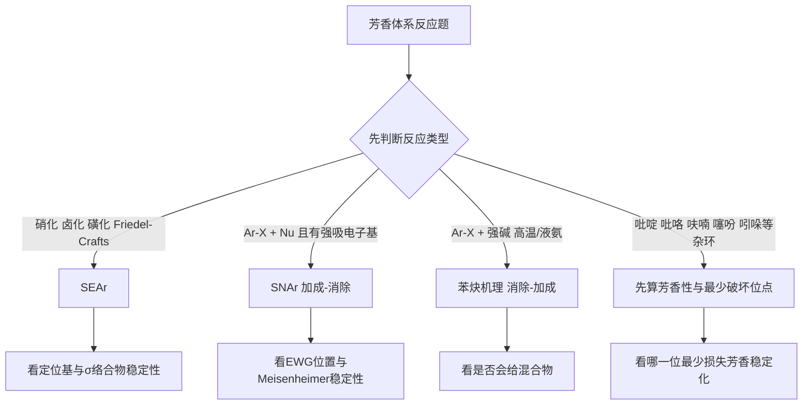

# 专题：芳香反应

> 2026-06-19 复核说明：本专题对应的专题页、备课大纲、课堂执行页、教学洞察均已成套落地，原状态属于系统回写滞后，现统一升为 `已审校`。

> 本专题对应考纲条目：[[41-芳香化合物]]、[[42-芳香杂环化合物]]
> 核心知识点：[[芳香亲电取代反应]]、[[SNAr]]、[[SEAr定位规则]]、[[Meisenheimer复合物]]、[[苯炔]]、[[芳香性]]

---

## 一、核心结论汇总 {#core-conclusions}

**必须记住：**
- 第三轮芳香反应最重要的不是“会写硝化溴化”，而是把 **SEAr / SNAr / 苯炔机理 / 杂环位点选择** 压成统一判断体系。
- 芳香题最常见的错误不是算错产物，而是**先把反应类型分错**。
- 定位效应要回到中间体稳定性：
  - SEAr 看 **σ 络合物（Wheland 中间体）**；
  - SNAr 看 **Meisenheimer 复合物**；
  - 苯炔看 **消除-加成与区域混杂**。
- 本专题和 [[专题-有机结构基础与电子效应]]、[[专题-加成反应]]、[[周环反应]] 有明显接口：
  - 专题1提供诱导/共轭/芳香性底层语言；
  - 专题5帮助区分“烯烃亲电加成”和“芳环亲电取代”；
  - 专题9则承接苯炔捕获和芳香过渡态的更高阶视角。

**第三轮看到芳香题先走这条分叉：**



## 一点五、课堂投影速查卡 {#classroom-quick-card}

**本页课堂入口：** 先把问题改写成“体系想保住芳香性，还是愿意暂时打破它换更大利益”。

**先问四个问题：**

1. 反应中心在芳环上、苄位上，还是杂环异原子附近？
2. 条件更像亲电芳取代、亲核芳取代，还是苄位侧链反应？
3. 取代基是给电子还是吸电子，对定位和速率分别怎么改写？
4. 题目更偏“定向预测”，还是在考为什么这一环能反应而另一环不行？

**一屏判断卡：**

- 苯环题先判赛道，再判定位；不要把“邻对位/间位”当成全部内容。
- 给电子基一般活化并导向邻对位，吸电子基一般钝化并导向间位，但卤素要单独提醒。
- 看到强吸电子基 + 离去基 + 邻/对位活化位，优先考虑亲核芳取代。
- 苄位反应常是“芳香体系在帮侧链稳定中间体”，不是环本身直接出手。

**讲后立刻练：**

- 先做一道多取代苯定位优先级题。
- 再做一道苄位卤代/氧化与环上取代对照题，拆清反应中心。

---

## 二、对比表格 {#comparison-table}

| 家族 | 题目触发关键词 | 核心中间体/特征 | 判断重点 | 常见产物/结果 | 第三轮常见坑 |
|:---|:---|:---|:---|:---|:---|
| SEAr | 硝化、卤化、磺化、F-C | σ 络合物、恢复芳香性 | 邻对位/间位、活化/钝化 | 芳香亲电取代产物 | 只背定位表，不回到中间体 |
| SNAr | 芳卤、Nu-、NO2/CN/CF3 邻对位 | Meisenheimer 复合物 | 是否有足够缺电子活化 | ipso 取代 | 忘记 EWG 必须在邻/对位 |
| 苯炔机理 | NaNH2、液氨、强碱、高温 | 苯炔中间体 | 是否无 EWG、是否会混合 | 消除-加成产物 | 与 SNAr 混淆，误写单一产物 |
| 杂环 SEAr / SNAr | 吡啶、吡咯、呋喃、噻吩、吲哚 | 芳香性保留/牺牲 | 哪个位点最容易进攻 | α/β 位差异、杂环特征产物 | 把苯环定位规则直接硬套 |
| F-C 特例 | RCl/酰氯 + AlCl3 | 碳正离子/酰鎓离子 | 是否重排、多取代、能否进行 | 烷基化/酰基化产物 | 不区分烷基化可重排、酰基化不重排 |

## 三、第三轮高频判断清单 {#decision-checklist}

### 3.1 一眼识别模板

- `HNO3/H2SO4`、`Br2/FeBr3`、`SO3/H2SO4`、`RCl/AlCl3`：优先想 [[芳香亲电取代反应]]
- `Ar-X + RO- / NH2-` 且芳环有 `NO2/CN/COR/CF3` 邻对位：优先想 [[SNAr]]
- `Ar-X + NaNH2(l)` 或高温强碱，且无显著活化基：优先想 [[苯炔]]
- `吡啶/吡咯/呋喃/噻吩/吲哚`：优先先问“**哪一步最少破坏芳香性**”

### 3.2 共振结构稳定性排序规则（Zchem）

> 来源：[[资料提炼-Zchem基础有机化学-批次Z-A到Z-E-结构与反应体系]] §8.4

在判断共振式贡献大小时，按以下优先级：

| 稳定性级别 | 判断标准 | 典型示例 |
|:---|:---|:---|
| **最稳定** | 所有原子满足八隅体 | 羧酸根负离子（负电荷在两个氧上离域） |
| **次稳定** | 大多数原子满足八隅体，少量电荷分离 | 烯醇负离子（负电荷在氧上比碳上更稳定） |
| **较不稳定** | 存在不完整八隅体 | 烷基碳正离子 |
| **最不稳定** | 电荷分离大且不满足八隅体 | 同号电荷相邻的结构（贡献可忽略） |

**关键原则**：
1. 满足八隅体的共振式更稳定
2. 负电荷在电负性大的原子上更稳定
3. 正电荷在电负性小的原子上更稳定
4. 同号电荷相邻的结构极不稳定

### 3.3 多取代苯合成策略库（Zchem）

> 来源：[[资料提炼-Zchem基础有机化学-批次Z-A到Z-E-结构与反应体系]] §8.4

**策略一：利用定位效应的先后顺序**
- 先引入邻对位定位基 → 再引入新基团到邻/对位
- 先引入间位定位基 → 再引入新基团到间位

**策略二：占位基（Blocking Group）**
- 引入 -SO₃H 占据某个位置 → 反应后水解去除
- 引入叔丁基（-C(CH₃)₃）作为大位阻占位基

**策略三：保护基**
- -NH₂ 易被氧化，可先乙酰化保护为 -NHCOCH₃（仍为邻对位定位）
- 反应后再水解恢复

**策略四：氧化/还原切换**
- 烷基可氧化为羧基（间位定位），改变后续反应方向

### 3.4 四句口令

1. **先分反应类型，不先背定位。**
2. **先看中间体，不先套口诀。**
3. **先问芳香性保不保，再问谁更快。**
4. **先防机理混淆，再写产物。**

### 3.5 竞赛加厚：第三轮往竞赛深度升级时最该补的 5 个挂点

| 挂点 | 为什么是竞赛点 | 本页课堂口径 | 建议上游/下游 |
|:---|:---|:---|:---|
| 多取代苯的**定位冲突** | 不再是单个定位基，而是速率、位阻、先后顺序同时存在 | 先判“谁主导新一步”，再看能否用占位基/保护基改路线 | [[专题-有机合成与金属有机]] |
| **萘/稠环** 的 α/β 位差异 | 需要比较中间体保留的芳香性，不是背“1位更活泼” | 萘的 SEAr 常先从 α 位起手，但题目若给位阻/热力学条件必须再复核 | [[芳香性]]、[[专题-重排反应]] |
| **重氮盐** 作为芳香合成跳板 | 竞赛更爱考“先胺化再转化”，不是只考现成卤代芳烃 | `Ar-NH2` 先转成 `Ar-N2+`，再分流到 `Cl/Br/CN/F/OH/偶联` | [[重氮盐]]、[[专题-人名反应系统归类]] |
| **SNAr 反应性反常顺序** | `F > Cl > Br > I` 与常规亲核取代完全相反，最容易被误判 | 速控步是加成不是离去；先问 Meisenheimer 能不能稳住 | [[专题-亲核取代与消除反应]] |
| **苯炔证据链** | 决赛/材料题常考“为什么相信有苯炔” | 混合产物、同位素标记、分子内捕获是三类高价值证据 | [[专题-高等有机机理与立体化学]] |

### 3.6 真题链与讲评顺序

| 课堂位置 | 推荐题 | 使用方式 | 主要目的 |
|:---|:---|:---|:---|
| 图后立刻练 | [[题-有机-芳香-多取代苯SEAr定位判断]] | 只要求先判主导定位基，不急着报最终产物 | 稳住“先判赛道再判定位” |
| 讲后 1 题 | [[题-037-8-6-芳香亲核取代反应速率|题-037-8-6]] | 只抓 `EWG` 邻/对位与 `F > Cl > Br > I` 两个关键信号 | 把 SNAr 从“少见特例”拉成独立赛道 |
| 讲后 1 题 | [[题-038-9-5-1-Friedel-Crafts酰基化|题-038-9-5-1]] | 重点讲萘环 α/β 位选择和酰基化不重排 | 把稠环芳香题接到竞赛深度 |
| 课后 2 题 | [[题-有机-芳香-多取代苯合成路线设计]] + [[题-038-9-2-1-三乙基苯产率变化|题-038-9-2-1]] | 前者练路线，后者练 F-C 可逆性与热力学修正 | 从“定位题”升级到“合成题” |

## 四、解题套路 / 决策流程 {#problem-solving-routine}

### Step 1：先判断芳环在“被谁进攻”
- **操作**：是亲电体进攻芳环，还是亲核体进攻缺电子芳环，还是强碱先造苯炔。
- **依据 KP**：[[芳香亲电取代反应]]、[[SNAr]]、[[苯炔]]
- **检查点**：☐ 反应大类分清 ☐ 没把所有芳香题都看成 EAS

### Step 2：定位题先回到中间体稳定性
- **操作**：
  - SEAr 画 σ 络合物；
  - SNAr 画 Meisenheimer 复合物；
  - 苯炔则看是否可能出现双位点进攻。
- **依据 KP**：[[SEAr定位规则]]、[[Meisenheimer复合物]]
- **检查点**：☐ 稳定化来源明确 ☐ 诱导/共轭效应已考虑

### Step 3：杂环题先算“芳香性代价”
- **操作**：看进攻哪个位点对芳香离域破坏最小，或哪个中间体能最好分散电荷。
- **检查点**：☐ 没把苯的规律直接平移到杂环 ☐ 位点选择有电子结构依据

### Step 4：最后核对是否有特殊副规则
- **操作**：
  - F-C 烷基化是否会重排、多取代；
  - SNAr 是否真的满足 EWG 邻对位；
  - 苯炔是否应给混合物；
  - 杂环是否过度活泼导致温和条件就反应。
- **检查点**：☐ 产物数目合理 ☐ 特殊条件已反映

## 五、机理分析抓手 {#mechanism-analysis}

### 5.1 SEAr：为什么芳环宁愿取代，不愿加成

- 芳环的本能是**恢复芳香性**，所以亲电进攻后会迅速失去 H+ 回到芳香体系。
- 定位效应本质是：**哪个 σ 络合物更稳定，哪条路径更快**。
- 卤素是第三轮必须单独强调的例外：
  - 整体钝化；
  - 但仍邻对位定位。

### 5.2 SNAr：为什么缺电子芳环反而怕亲核体

- 当芳环被强吸电子基拉空后，亲核体可以进攻 ipso 位形成 **Meisenheimer 复合物**。
- 关键不是离去基本身，而是**负电荷能否被邻/对位 EWG 吃住**。
- 第三轮高频口径：
  - `F > Cl > Br > I` 的活性顺序要和普通 SN2 区分开。

### 5.3 苯炔：为什么没有活化基也能“取代”

- 强碱先消除出苯炔，再由亲核体加成，这不是加成-消除，而是**消除-加成**。
- 因为中间体是苯炔，不对称底物经常会有**区域混合物**。
- 所以“有无强吸电子基”是区分 SNAr 与苯炔机理的第一刀。

### 5.4 杂环：为什么不能把苯的定位规则直接平移

- 吡啶、吡咯、呋喃、噻吩、吲哚的活性差异，核心来自：
  - 杂原子是否把孤对电子贡献进芳香六元电子体系；
  - 进攻后哪种中间体最不破坏芳香性；
  - 正负电荷是否落在电负性不利的位置。
- 第三轮先建立稳定口径：
  - 吡啶做 SEAr 较难，常偏 `3` 位；
  - 五元富电子杂环做 SEAr 较易，常偏 `α` 位；
  - 吲哚常偏 `3` 位。

### 5.5 芳香题里的“合成按钮”为什么必须单独讲

- 竞赛里的芳香题常常不是“给条件猜产物”，而是“给目标倒推底物”。
- 此时最值钱的几个按钮不是单步机理，而是：
  - `占位基/保护基` 能不能临时改定位；
  - `重氮盐` 能不能把难装的 `F/CN/OH` 转进去；
  - `F-C 烷基化` 会不会重排、多取代，是否该改走酰基化再还原；
  - `SNAr / 苯炔` 能不能替代普通 SEAr 路线。
- 所以本专题真正要带走的不是“芳香取代大全”，而是 **芳香骨架合成中的分流能力**。

## 六、典型例题串讲 {#typical-examples}

### 例题 1：甲苯硝化为什么给邻对位为主
**分析**：题型属于 SEAr；甲基通过超共轭稳定邻对位 σ 络合物。  
**解答**：邻、对硝基甲苯为主产物。  
**反思**：定位不只是口诀，而是中间体稳定性比较。

### 例题 2：对硝基氯苯和氯苯谁更易与甲氧基反应
**分析**：题型属于 SNAr；对硝基氯苯能形成被 NO2 稳定的 Meisenheimer 复合物。  
**解答**：对硝基氯苯明显更易发生取代。  
**反思**：先看是否缺电子，再谈离去基。

### 例题 3：氯苯在 NaNH2/液氨中为何还能发生取代
**分析**：无 EWG，排除普通 SNAr；强碱条件提示苯炔机理。  
**解答**：先消除生成苯炔，再被 NH2- 加成。  
**反思**：芳香亲核取代有两套机理，不能只会一套。

### 例题 4：吡咯为什么常在 α 位做亲电取代
**分析**：比较 α、β 进攻后中间体的离域与芳香性损失，α 位更有利。  
**解答**：α 位优先。  
**反思**：杂环位点题的本质是“谁最少破坏芳香稳定化”。

## 七、课堂组织建议 {#teaching-organization}

- **第一层**：先把芳香题压成三大主机理加一类杂环位点题。
- **第二层**：重点做 `SEAr vs SNAr vs 苯炔` 三分辨析。
- **第三层**：再讲 F-C 特殊规则和杂环位点，避免一开始信息过载。
- **第三轮可直接展开的内容**：
  - SEAr 定位与 F-C 基础判断；
  - SNAr 与 Meisenheimer 复合物；
  - 苯炔机理与混合物判断；
  - 富电子/缺电子杂环的基础位点选择。

## 八、关联知识点 {#related-kp}

- [[芳香亲电取代反应]]
- [[SNAr]]
- [[SEAr定位规则]]
- [[Meisenheimer复合物]]
- [[苯炔]]
- [[芳香性]]
- [[Friedel-Crafts反应]]

## 九、关联题型 {#related-problem-types}

- [[题型-芳香取代定位]]
- [[题型-芳香亲核取代判断]]
- [[题型-苯炔机理判断]]
- [[题型-杂环位点选择]]

## 十、相关真题 {#related-exam-questions}

```dataview
TABLE file.name AS "文件名", year AS "年份", type AS "题型", difficulty AS "难度"
FROM "05-真题库"
WHERE contains(knowledge_points, "芳香亲电取代反应")
   OR contains(knowledge_points, "SNAr")
   OR contains(knowledge_points, "苯炔")
SORT year DESC, difficulty ASC
```

### 真题使用建议 {#exam-usage-tips}

- 芳香题的第一道分水岭不是"邻对位还是间位"，而是"这是 SEAr、SNAr 还是苯炔"。先让学生从条件关键词（HNO₃/H₂SO₄ vs NaNH₂/液氨 vs Ar-X+Nu⁻+EWG）判断反应类型，再进入定位分析。
- 定位效应题从"单一取代苯→多取代苯定位冲突"递进：前者建立σ络合物中间体稳定性直觉，后者训练"占位基/保护基/引入顺序"的合成思维。
- Friedel-Crafts 烷基化必讲重排，酰基化必讲不重排——这是竞赛区分度最高的 SEAr 细节，也是"条件切换产物"的经典考点。

### 推荐真题 {#recommended-exam-questions}

| 真题 | 核心考点 | 难度 |
|:---|:---|:---:|
| [[真题-有机-芳香取代-001]] | SEAr 定位效应：甲苯硝化的邻对位选择性与σ络合物稳定性 | ⭐⭐ |
| [[真题-有机-FriedelCrafts-001]] | F-C 烷基化：碳正离子重排与"酰基化→还原"策略规避 | ⭐⭐⭐ |

### 真题链与讲评顺序 {#exam-sequence}

- `第 1 题`：[[真题-有机-芳香取代-001]]（甲苯硝化定位）。课堂用途：warm-up，确认 SEAr 基本定位规则和σ络合物中间体思维，建立"给电子基→邻对位、吸电子基→间位"的直觉。
- `第 2 题`：[[真题-有机-FriedelCrafts-001]]（F-C 烷基化+重排）。课堂用途：main，把"定位"升级为"路线"——F-C 烷基化的重排陷阱如何通过改走酰基化+还原（Clemmensen/Wolff-Kishner）来规避。
- `第 3 题`：SNAr/苯炔机理辨析（从现有条件中拆出独立训练）。课堂用途：synthesis，训练"先分反应类型再判产物"的芳香题根本思路——缺电子+EWG邻对位→SNAr，无EWG+强碱→苯炔。
- 课堂顺序建议：`SEAr 定位基础 → F-C 策略（烷基化 vs 酰基化）→ SNAr/苯炔三分辨析`。

*本专题依据 [[模板-专题]] v1.7 生成。*
*第三轮定位：作为“芳香体系统一判断层”，后续可继续分化为芳香性深化、杂环深化和芳香合成应用。*

> 📎 相关提炼：[[07-资料提炼/书籍提炼/提炼-ABOC-第5章-芳香与胺]]
