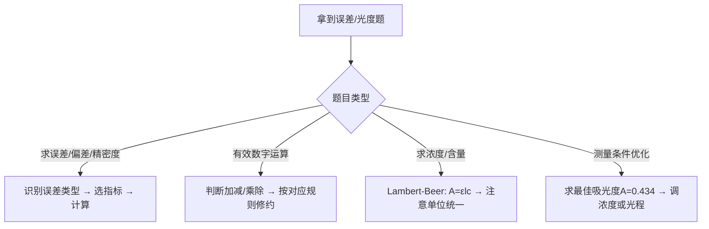

# 专题：误差处理与分光光度法

> 本专题对应考纲条目：[[19]]、[[20]]
> 核心知识点：[[ ]]、[[ ]]

---

## 零点五、进阶导航 {#advance-navigation}

- 前置页：[[专题-定量化学分析]]
- 同组分析化学执行页：[[专题-容量分析基础与酸碱滴定]]、[[专题-氧化还原滴定与沉淀滴定]]、[[专题-络合滴定与重量分析]]
- 下游收口：[[专题-真题模拟拆解]]

## 零点六、课堂投影速查卡 {#classroom-quick-card}

**本页课堂入口：** 先分清“这是数据处理题还是光度定量题”，不要把误差概念和光谱公式混成一坨。

**先问四个问题：**

1. 题目是在问准确度/精密度，还是在问 `A-T-c` 之间的换算？
2. 这道题需要选统计指标、修约规则，还是需要用 `A = εlc`？
3. 当前吸光度是否落在线性和低误差区间，需不需要稀释或换光程？
4. 误差来自系统偏差、随机波动，还是标准曲线/参比选择不当？

**一屏判断卡：**

- 先分误差类型，再决定用偏差、标准差还是 `RSD`。
- 光度题先检查定律适用条件，再代 `A = εlc`。
- 看见“最佳测量条件”就优先想到 `A≈0.434`。
- 题做完后检查“单位 / 有效数字 / 稀释倍数 / 参比选择”。

## 一、核心结论汇总 {#core-conclusions}

> 用 1-3 句话概括本专题的"最大公约数"。
> 再加 1 条「最高频决策路径」。

**必须记住：**
误差分析的核心是区分系统误差（单向、可校正）与随机误差（统计分布、不可校正但可减小），精密度指标中标准差（S）比平均偏差更能反映数据离散程度。分光光度法的核心定量工具是Lambert-Beer定律 $A=\varepsilon lc$，吸光度测量存在最佳点 $A=0.434$（$T=36.8\%$）时相对误差最小，这是2016年决赛考点。

**最高频决策路径：**



## 二、对比表格

> 专题页的灵魂。把分散在多个知识点中的信息横向对比。
> 新增「触发条件」列：告诉学生"题目出现什么关键词时"来查这一行。

| 触发条件（题目关键词） | 比较维度 | A | B | 常见陷阱 |
|:---|:---|:---|:---|:---|
| "系统误差""随机误差""过失误差" | 误差分类 | 系统误差：单向性、可重复、可校正（方法/仪器/试剂/操作误差） | 随机误差：服从统计分布、不可校正但可减小（增加测量次数） | 个人操作习惯引起的误差属于系统误差而非随机误差；过失误差必须剔除 |
| "准确度""精密度""偏差""标准差" | 准确度 vs 精密度评价指标 | 准确度：绝对误差、相对误差（与真值比较） | 精密度：平均偏差d̄、标准差S、相对标准差RSD（多次测量间比较） | RSD = S/x̄ × 100%，无量纲，便于不同水平数据比较；标准差S比方差更直观 |
| "有效数字""修约""四舍六入" | 加减法 vs 乘除法修约规则 | 加减法：以小数点后位数最少者为准（绝对误差传递） | 乘除法：以有效数字位数最少者为准（相对误差传递） | 禁止连续修约；首位为9的数可多计1位有效数字；对数运算中小数部分为有效数字位数 |
| "吸光度""透射比""浓度" | 吸光度A vs 透射比T | A = -lgT，与浓度成正比（Lambert-Beer定律） | T = I/I₀，与浓度呈指数关系 | T与c非线性；A>1.0时读数误差放大，不宜直接测量 |
| "最佳测量条件""最小误差""A=0.434" | 吸光度测量误差分析 | A≈0.434（T≈36.8%）时相对浓度误差最小 | A<0.2或A>0.8时误差显著增大 | 最佳点推导：dE_r/dT = 0 → T = e⁻¹；竞赛常直接考结论 |
| "显色反应""标准曲线""参比溶液" | 分光光度法实验设计 | 显色剂选择：灵敏度高、选择性好、稳定、组成恒定 | 参比溶液：消除溶剂/试剂吸收；标准曲线法需5-7个点 | 显色剂过量可能引起副反应；标准曲线需定期校正；空白参比与样品参比选择不同 |

### 表2：三类误差对比

| 触发条件（题目关键词） | 误差类型 | 本质特征 | 来源举例 | 处理方法 | 竞赛考点 |
|:---|:---|:---|:---|:---|:---|
| "系统误差""可校正""单向性" | 系统误差 | 单向性、可重复、可校正；服从确定性规律 | 方法误差（反应不完全）、仪器误差（砝码磨损）、试剂误差（含杂质）、操作误差（个人习惯） | 对照试验、空白试验、校准仪器、改进方法 | 判断给定情境的误差类型；计算校正后的结果 |
| "随机误差""偶然误差""统计分布" | 随机误差 | 随机性、不可校正但可减小；服从正态分布 | 环境温度/湿度微小波动、读数估读不确定性、仪器噪声 | 增加平行测定次数，取平均值；用统计方法估计 | 标准差、相对标准差RSD计算；置信区间概念 |
| "过失误差""错误""异常值""剔除" | 过失误差 | 明显错误、非统计规律；由操作失误引起 | 读错刻度、记录错误、溶液溅出、仪器故障 | 发现后必须剔除该数据；加强操作规范 | Q检验/Dixon检验判断异常值（第二轮点到为止）；4d̄法粗略判断 |

> **核心区分**：系统误差影响准确度（偏离真值），随机误差影响精密度（数据分散），过失误差必须剔除。

### 表3：准确度 vs 精密度 靶心图文字版

| 触发条件（题目关键词） | 准确度 | 精密度 | 典型情境描述 | 误差主导类型 | 改进方向 |
|:---|:---:|:---:|:---|:---|:---|
| "高准确度高精密度" | 高 | 高 | 数据点密集集中在靶心（真值附近） | 理想状态，系统误差和随机误差均小 | 保持现状，作为分析方法验证标准 |
| "低准确度高精密度" | 低 | 高 | 数据点密集但偏离靶心（存在固定偏差） | **系统误差主导** | 找原因：校准仪器、空白试验、对照试验 |
| "高准确度低精密度" | 高 | 低 | 数据点分散但平均值接近靶心（正负误差抵消） | 随机误差大但系统误差小 | 增加测定次数；检查操作稳定性 |
| "低准确度低精密度" | 低 | 低 | 数据点既分散又偏离靶心 | 系统误差+随机误差均大 | 全面检查：方法、仪器、操作、环境 |

> **记忆口诀**：精密看密集，准确看靶心；高精低准系统误，低精高准随机因。
> **竞赛常考**：给出数据分布图或描述，判断属于哪种情况，并指出改进方法。

### 表4：有效数字运算规则速查

| 触发条件（题目关键词） | 运算类型 | 规则 | 示例 | 常见陷阱 |
|:---|:---|:---|:---|:---|
| "加减法""小数位对齐" | 加减法 | 以小数点后位数最少者为准（绝对误差最大原则） | 23.45 + 1.2 + 0.678 = 25.3（1.2小数位最少，结果保留1位小数） | 不能先修约再计算；应计算完再修约；禁止连续修约 |
| "乘除法""有效数字位数" | 乘除法 | 以有效数字位数最少者为准（相对误差最大原则） | 0.1023 × 2.5 = 0.26（2.5只有2位有效数字） | 注意首位为9的数可多计1位（如9.87算4位）；pH/pKa小数部分为有效数字位数 |
| "对数运算""pH""pKa" | 对数/指数 | 对数：小数部分为有效数字位数；指数：结果有效数字位数与指数小数位相同 | pH = 4.75 → [H⁺] = 1.8 × 10⁻⁵（2位有效数字）；Ka = 1.8×10⁻⁵ → pKa = 4.74 | pH=4.7只有1位有效数字；pH=4.75有2位；常见错误认为pH整数部分也算有效数字 |
| "混合运算""多步计算" | 混合运算 | 中间步骤多保留1位，最后结果按规则修约 | 先算(12.34+0.5)=12.8，再算12.8×2.5=32 | 中间步骤过早修约会引入额外误差；建议保留1-2位 guard digit |

### 表5：Lambert-Beer 定律适用条件

| 触发条件（题目关键词） | 适用条件 | 具体要求 | 偏离原因 | 竞赛处理 |
|:---|:---|:---|:---|:---|
| "单色光""波长选择" | 单色光 | 使用λ_max处测定（灵敏度最高）；单色光带宽越窄越好 | 非单色光使ε随波长变化，A-c关系偏离线性 | 竞赛默认单色光条件；知道偏离原因之一是"非单色光"即可 |
| "稀溶液""浓度范围" | 稀溶液 | 通常c < 10⁻² mol/L；A在0.2~0.8范围内 | 高浓度时分子间相互作用（解离/缔合/配合），有效浓度≠实际浓度 | 记住"稀溶液假设"；高浓度时标准曲线向下弯曲 |
| "无散射""澄清溶液" | 无散射 | 溶液澄清透明，无悬浮颗粒 | 散射光使I₀测量值偏小，A偏大 | 过滤或离心除去悬浮物 |
| "无荧光""化学发光" | 无荧光/化学发光 | 被测物在测定波长下无发射光 | 荧光发射使检测器接收额外光，T偏大，A偏小 | 换测定波长或消除荧光干扰 |
| "平行光""垂直入射" | 平行光垂直入射 | 使用准直光路，光程一致 | 斜入射使实际光程l增大，A偏大 | 仪器设计保证，竞赛不涉及 |

### 表6：标准曲线法操作步骤 checklist

| 步骤 | 操作内容 | 检查点 | 常见错误 |
|:---|:---|:---|:---|
| 1 | 配制标准溶液系列（通常5-7个点） | ☐ 浓度范围覆盖样品预期浓度；☐ 包含空白（c=0） | 标准点太少（<5个）导致线性不可靠；浓度范围过窄 |
| 2 | 选择测定波长（λ_max） | ☐ 在λ_max处测定（灵敏度最高）；☐ 此处干扰最小 | 未扫描吸收光谱，直接选文献值；λ_max处有干扰 |
| 3 | 选择参比溶液 | ☐ 空白参比：溶剂+试剂（不含被测物）；☐ 样品参比：含背景但不含被测物 | 参比选择不当，基线不为零；未考虑试剂吸收 |
| 4 | 测定各标准溶液吸光度 | ☐ 比色皿配对（光程一致）；☐ 润洗2-3次；☐ 气泡排除 | 比色皿未润洗导致浓度稀释；气泡影响光程 |
| 5 | 绘制A-c标准曲线并线性回归 | ☐ 相关系数r ≥ 0.999；☐ 截距接近零；☐ 斜率=εl | 强制过原点回归；r<0.999仍使用；未剔除异常点 |
| 6 | 测定样品吸光度并查得浓度 | ☐ 样品A落在标准曲线线性范围内；☐ 稀释倍数记录 | 样品A超出线性范围（A>1.0或A<0.1）；未记录稀释倍数 |
| 7 | 计算最终结果并报告 | ☐ 单位统一；☐ 有效数字正确；☐ 考虑稀释倍数 | 忘记稀释倍数；有效数字过多或过少 |

> **标准曲线法核心公式**：由A = εlc，标准曲线斜率k = εl，样品浓度c_样 = A_样 / k × 稀释倍数。

---

## 二点五、信号-响应速查矩阵（元素化学/推断类专题专用，可选）

> 元素化学专题的灵魂。把"实验现象"作为检索入口，替代"元素性质罗列"。
> 非元素化学专题可直接删除本段。

> 本专题为分析化学定量计算专题，不涉及元素推断，此段不适用。

---

## 三、解题套路 / 决策流程

> 给出可执行的解题步骤或判断流程图。每一步必须链接到具体 KP，方便学生点击深入。
> 解题不是罗列公式，而是「条件判断 → 选择路径 → 执行操作 → 检查验证」的闭环。

### Step 1：识别误差类型与选择评价指标
- **操作**：
  - 读题判断误差性质：单向可重复→系统误差；随机波动→随机误差；明显错误→过失误差
  - 选择精密度指标：常规计算用标准差S；需要跨组比较用RSD；快速估算用平均偏差
  - 有效数字运算：先判断是加减还是乘除，再按对应规则修约
- **依据 KP**：[[03-知识点/分析化学/误差]]、[[03-知识点/分析化学/偏差]]、[[03-知识点/分析化学/精密度]]、[[03-知识点/分析化学/数据处理]]
- **检查点**：☐ 误差类型已识别 ☐ 指标选择合理 ☐ 有效数字修约正确

### Step 2：建立Lambert-Beer定量关系
- **操作**：
  - 确认定律适用条件：单色光、稀溶液（通常c < 10⁻² mol/L）、无散射、无荧光
  - 统一单位：ε单位为L·mol⁻¹·cm⁻¹，l单位为cm，c单位为mol/L
  - 若已知A求c：$c = A/(\varepsilon l)$；若求最佳测量浓度：令A≈0.434反推c
- **依据 KP**：[[03-知识点/分析化学/Lambert-Beer定律]]、[[03-知识点/分析化学/吸光度]]
- **检查点**：☐ 单色光条件确认 ☐ 单位已统一 ☐ 浓度在稀溶液范围

### Step 3：优化测量条件或分析误差来源
- **操作**：
  - 最佳吸光度：调节浓度或光程使A落在0.2~0.8范围内，最优为0.434
  - 误差传递：若已知透射比读数误差ΔT，相对浓度误差 $E_r = \Delta T/(T \ln T)$
  - 标准曲线：测定系列标准溶液，线性回归求斜率（即εl），再代入样品A求c
- **依据 KP**：[[03-知识点/分析化学/分光光度法]]、[[03-知识点/分析化学/吸光度]]
- **检查点**：☐ A在合理范围 ☐ 标准曲线线性良好 ☐ 参比溶液选择正确

| 步骤 | 核心操作 | 依据 KP | 检查清单 |
|:---|:---|:---|:---|
| 1 | 识别误差类型与选择指标 | [[03-知识点/分析化学/误差]]、[[03-知识点/分析化学/数据处理]] | ☐ 误差类型 ☐ 指标选择 ☐ 修约规则 |
| 2 | 建立Lambert-Beer关系 | [[03-知识点/分析化学/Lambert-Beer定律]] | ☐ 单色光 ☐ 单位统一 ☐ 稀溶液 |
| 3 | 优化条件或分析误差 | [[03-知识点/分析化学/分光光度法]] | ☐ A合理 ☐ 线性良好 ☐ 参比正确 |

---

## 四、反应机理拆解（含检查表）（可选，机理类专题启用）

> 适用于有机反应、氧化还原电子转移、配合物晶体场等需要"箭头推动"或"分步推导"的专题。
> 非机理类专题可直接删除本段。

> 本专题为分析化学定量计算专题，不涉及反应机理推导，此段不适用。

---

## 五、典型例题串讲

> 每道例题必须覆盖一个"跨知识点的综合场景"。

### 例题 1：测铁数据的精密度评价
**题目：**
测定铁矿石中铁含量，五次测量结果为：37.45%、37.20%、37.50%、37.30%、37.25%。计算平均值、平均偏差、标准差和相对标准差（RSD）。[数值据网课记录]

**分析：**
1. 先计算平均值 x̄
2. 计算各次测量的绝对偏差 dᵢ = xᵢ - x̄
3. 平均偏差 d̄ = Σ|dᵢ|/n
4. 标准差 S = √[Σdᵢ²/(n-1)]（样本标准差，分母为n-1）
5. RSD = S/x̄ × 100%

**解答：**
平均值：x̄ = (37.45 + 37.20 + 37.50 + 37.30 + 37.25)/5 = 37.34%

各次偏差：
- d₁ = 37.45 - 37.34 = +0.11%
- d₂ = 37.20 - 37.34 = -0.14%
- d₃ = 37.50 - 37.34 = +0.16%
- d₄ = 37.30 - 37.34 = -0.04%
- d₅ = 37.25 - 37.34 = -0.09%

平均偏差：d̄ = (0.11 + 0.14 + 0.16 + 0.04 + 0.09)/5 = 0.11%

标准差：S = √[(0.11² + 0.14² + 0.16² + 0.04² + 0.09²)/(5-1)] = √(0.0634/4) = 0.13%

相对标准差：RSD = 0.13/37.34 × 100% = 0.35%

**反思：**
- 网课中以此例训练精密度指标计算，数据与教材图3-1对应。
- 注意标准差分母是n-1（样本标准差），不是n。竞赛中如无特别说明，均用样本标准差。
- RSD无量纲，便于不同含量水平的样品比较精密度。
- 若题目要求"相对平均偏差"，则为 d̄/x̄ × 100% = 0.29%。

### 例题 2：吸光度最佳测量点与误差分析
**题目：**
某显色反应在525 nm处的摩尔吸光系数 ε = 1.2 × 10⁴ L·mol⁻¹·cm⁻¹，使用1.0 cm比色皿。
(1) 为使测量相对误差最小，应控制被测物浓度约为多少？
(2) 若透射比读数误差 ΔT = ±0.01，计算A = 0.434时的相对浓度误差。[数值据教材补全]

**分析：**
1. 最佳测量条件：A = 0.434时相对误差最小
2. 由A = εlc反推最佳浓度
3. 误差传递公式：E_r = ΔT/(T·lnT)，在最佳点T = e⁻¹ ≈ 0.368

**解答：**
(1) 最佳吸光度 A = 0.434
$$c = \frac{A}{\varepsilon l} = \frac{0.434}{1.2 \times 10^4 \times 1.0} = 3.62 \times 10^{-5} \text{ mol/L}$$

(2) 当A = 0.434时，T = 10⁻⁰·⁴³⁴ = 0.368 = e⁻¹
$$E_r = \frac{\Delta T}{T \ln T} = \frac{0.01}{0.368 \times (-1)} = \frac{0.01}{0.368} = 0.0272 = 2.72\%$$

注意取绝对值，相对浓度误差约为2.7%。

**反思：**
- 本题是2016年决赛类似考点的变体，核心结论"A=0.434时误差最小"必须记住。
- 最佳点推导：由c ∝ -lnT，dc/dT = -1/(T·lnT)，相对误差E_r = ΔT/(T·lnT)，求导得极小值在T = e⁻¹处。
- 常见错误：直接用A的误差代替T的误差；忽略lnT为负值导致符号错误。
- 实际测量中，A在0.2~0.8范围内均可接受，但0.434是最优点。

---

### 例题 4：有效数字修约——四舍六入五成双（周坤，⭐⭐）

**题目：**
将下列数据修约到两位小数：
(1) 0.5749
(2) 0.5751
(3) 0.5750
(4) 0.5850

某学生先将 0.5749 修约到三位小数得 0.575，再修约到两位小数得 0.58。这种做法是否正确？为什么？

**分析：**
- "四舍六入五成双"规则：尾数 ≤ 4 舍去；≥ 6 进位；= 5 时看前一位，奇进偶舍。
- 禁止分次修约：必须一次修约到目标位数，中间步骤多保留一位即可。

**解答：**
(1) 0.5749 → **0.57**（尾数 49 < 50，舍去）
(2) 0.5751 → **0.58**（尾数 51 > 50，进位）
(3) 0.5750 → **0.58**（尾数恰为 50，前位 7 为奇数，进位）
(4) 0.5850 → **0.58**（尾数恰为 50，前位 8 为偶数，舍去）

- **学生做法错误**：0.5749 一次修约到两位小数应为 0.57，而不是 0.58。分次修约引入了系统性偏差。
- **正确做法**：计算过程中可多保留一位有效数字，但最终结果必须一次修约到位。

**反思：**
- "四舍六入五成双"（又称 "四舍六入五留双"）是分析化学国家标准（GB/T 8170），与高中常用的"四舍五入"不同。
- 规则设计目的：避免传统"四舍五入"导致的数据系统性偏高（5 总是进位）。
- 竞赛中有效数字修约是隐蔽失分点，必须严格按规则执行。
- 记忆口诀：**四舍六入五考虑，五后非零则进一，五后皆零看奇偶，五前为偶应舍去，五前为奇则进一**。

---

## 五点五、真题链与讲评顺序 {#exam-sequence}

1. 先讲“误差分类 + 准确度/精密度判断”题，让学生把系统误差和随机误差彻底分开。
2. 再讲“标准差 / RSD / 有效数字”题，压实第二轮数据处理基本功。
3. 第三层讲“Lambert-Beer 直接计算”题，训练 `A-T-c` 换算和单位统一。
4. 最后讲“最佳吸光度 / 标准曲线 / 实验条件设计”题，把公式理解推到实验执行层。

### 图后立刻练 / 讲后 1 题 / 课后 2 题

- 图后立刻练：给 4 个误差情景，只要求学生先判“系统 / 随机 / 过失”。
- 讲后 1 题：给一组吸光度、光程和摩尔吸光系数，只要求先算浓度并判断数据是否在线性范围。
- 课后 2 题：一题标准差与 `RSD` 计算；一题最佳吸光度与标准曲线设计综合。

## 六、关联知识点

- [[03-知识点/分析化学/误差]]
- [[03-知识点/分析化学/偏差]]
- [[03-知识点/分析化学/准确度]]
- [[03-知识点/分析化学/精密度]]
- [[03-知识点/分析化学/数据处理]]
- [[03-知识点/分析化学/Lambert-Beer定律]]
- [[03-知识点/分析化学/吸光度]]
- [[03-知识点/分析化学/分光光度法]]
- [[03-知识点/分析化学/比色分析]]

## 七、关联题型

- [[题型-误差分析]]
- [[题型-分光光度法计算]]

---

## 八、相关真题 {#related-exam-questions}

```dataview
TABLE file.name AS "文件名", year AS "年份", type AS "题型", difficulty AS "难度"
FROM "05-真题库"
WHERE contains(knowledge_points, "误差") OR contains(knowledge_points, "精密度") OR contains(knowledge_points, "Lambert-Beer定律") OR contains(knowledge_points, "分光光度法")
SORT year DESC, difficulty ASC
```

---

*本专题依据 [[模板-专题]] v1.7 生成，状态：精品。*

---

## 九、相关课件与讲义

- [[07-资料提炼/教学逻辑提炼/分析化学/教学逻辑提炼-分析化学网课-容量分析概论与酸碱滴定]]（误差分析部分内容来源）
- [[07-资料提炼/教学逻辑提炼/分析化学/教学逻辑提炼-分析化学网课-配位氧化还原重量与光度法]]（分光光度法部分内容来源）

> 📎 相关提炼：[[07-资料提炼/书籍提炼/提炼-分析化学第六版-第3章-误差与数据处理]] · [[07-资料提炼/书籍提炼/提炼-分析化学第六版-第7-10章-氧化还原沉淀重量与光度法]]
