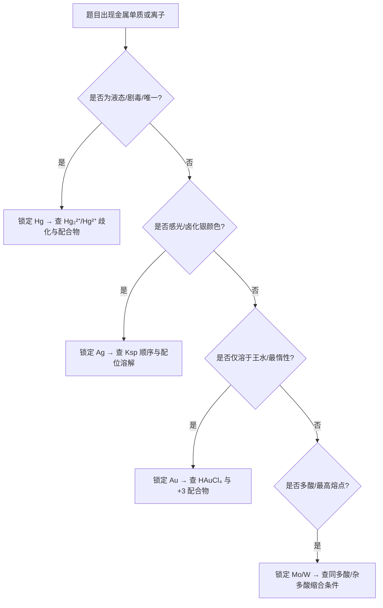

# 专题：过渡金属（三）银金汞钼钨

> 本专题对应考纲条目：[[13-元素化学]]
> 核心知识点：[[银]]、[[金]]、[[汞]]、[[钼]]、[[钨]]、[[铜]]、[[锌]]、[[过渡金属通性]]

---

## 零点五、进阶导航 {#advance-navigation}

- 前置页：[[专题-原子结构与元素周期律]]、[[专题-分子结构基础]]
- 同组第二轮过渡金属执行页：[[专题-过渡金属（一）钛钒铬锰]]、[[专题-过渡金属（二）铁钴镍铜锌]]
- 下游深化/收口页：[[专题-元素化学深度与结构推断综合]]、[[专题-真题模拟拆解]]

## 零点六、课堂投影速查卡 {#classroom-quick-card}

**本页课堂入口：** 先分“Ag/Au/Hg 贵金属线”和“Mo/W 多酸线”，不要把 ds 区后半段当成一锅现象汤。

**先问四个问题：**

1. 题目是在考 Ag/Hg 沉淀鉴别、Au 的惰性与王水，还是 Mo/W 多酸缩合？
2. 当前更像配合物结构题、沉淀-配位转化题，还是氧化-配位协同题？
3. 这里最关键的信号是 `AgCl/Hg2Cl2` 区分、`HgI2` 溶解，还是 `[AuCl4]-` 与多酸缩合？
4. 题目需要先从“颜色/沉淀”入口，还是先从“结构/电势/配位稳定化”入口？

**一屏判断卡：**

- `AgCl` 和 `Hg2Cl2` 都白，但加氨水后的命运完全不同。
- 王水溶金题一定同时写“氧化 + 配位”两股驱动力。
- `Hg2^2+` 先记作带 Hg-Hg 键的双核离子，不要机械拆成两个单核。
- `Mo/W` 题先看 pH 与缩合度，再谈多酸结构名词。

## 一、核心结论汇总 {#core-conclusions}

**必须记住：**

1. **Hg 是唯一的室温液态金属**，蒸气压大、剧毒；Hg₂²⁺ 含 Hg—Hg 键（形式 +1），与 Hg²⁺ 的歧化平衡可被沉淀/络合拉动。
2. **Ag⁺ 以 +1 为主**，卤化银感光性是摄影化学核心；Ag⁺ 形成直线形 sp 配合物（[Ag(NH₃)₂]⁺、[Ag(S₂O₃)₂]³⁻），氧化性较强（E° = +0.799 V）。
3. **Au 化学惰性最强**，仅溶于王水（氧化 + 络合协同）；常见 +3 氧化态，Au(III) 配合物为平面正方形（dsp²）。
4. **Mo/W 为多酸化学核心元素**，同多酸/杂多酸缩合与 pH、浓度密切相关；W 是熔点最高的金属（3422°C）。
5. **ds 区（IB/IIB）与主族的根本差异**：d¹⁰ 次外层导致化合物偏共价、易成配合物；同族从上到下活泼性递减，但 Au 因相对论效应 6s 收缩而极度惰性。
6. **贵金属惰性（Ag/Au）的本质**：Au 的 6s 电子因相对论效应显著收缩，电离能和电极电势极高（E°(Au³⁺/Au) ≈ +1.50 V），常规氧化剂无法氧化；王水溶解 Au 是 HNO₃ 氧化与 Cl⁻ 配位降低电势的协同效应——Cl⁻ 与 Au³⁺ 形成稳定的 [AuCl₄]⁻，使 Au³⁺/Au 电势大幅下降，HNO₃ 的氧化能力足以驱动反应。
7. **钼钨多酸的核心规律**：酸性条件下 MO₄²⁻（M = Mo/W）质子化后脱水缩合，聚合度随酸度增大而增加；碱性条件下解聚为单酸根。杂多酸（如 Keggin 型 H₃[PW₁₂O₄₀]）含中心杂原子（P/Si），同多酸（如 [Mo₇O₂₄]⁶⁻）仅含一种金属。

**最高频决策路径：**



---

## 二、对比表格 {#comparison-table}

### 表 2-1：Ag / Au / Hg 化学性质对比

| 触发条件（题目关键词） | 比较维度 | Ag | Au | Hg | 常见陷阱 |
|:---|:---|:---|:---|:---|:---|
| "感光变黑"、"摄影"、"定影" | 特征反应 | AgX 感光分解：2AgBr → 2Ag + Br₂ | 无感光性 | Hg₂Cl₂ 感光变黑（分解为 Hg + HgCl₂） | 不要把 Hg₂Cl₂ 与 AgCl 混淆；Hg₂Cl₂ 遇 NH₃ 生成灰黑沉淀 |
| "唯一液态金属"、"水银"、"剧毒" | 物理特性 | 固态，熔点 961°C | 固态，熔点 1064°C | **唯一室温液态金属**，蒸气压大，需水封 | Hg 蒸气剧毒，泼洒用硫粉覆盖 |
| "溶于王水"、"最惰性" | 与酸反应 | 溶于 HNO₃（氧化性酸） | **仅溶于王水**：Au + 4HCl + HNO₃ → HAuCl₄ + NO + 2H₂O | 仅溶于 HNO₃（氧化性酸） | 王水溶解 Au 是氧化+络合协同，非单纯氧化 |
| "卤化银颜色"、"氨水溶解" | 卤化物 | AgCl（白）、AgBr（浅黄）、AgI（黄）；AgCl 溶于 NH₃ | AuCl₃（红/褐），易潮解 | Hg₂Cl₂（白，甘汞）、HgCl₂（白，升汞，可溶） | AgBr 微溶于 NH₃，AgI 不溶；定影用 S₂O₃²⁻ |
| "直线形配合物"、"sp 杂化" | 典型配合物 | [Ag(NH₃)₂]⁺（直线形，sp） | [AuCl₄]⁻（平面正方形，dsp²） | [HgI₄]²⁻（四面体）、[Hg(CN)₄]²⁻ | Au(III) 是 d⁸ 平面正方形，不是四面体 |
| "氧化性"、"E° 比较" | 标准电极电势 | E°(Ag⁺/Ag) = +0.799 V | E°(Au³⁺/Au) ≈ +1.50 V | E°(Hg²⁺/Hg) = +0.851 V | Au 电极电势很高，化学惰性最强 |

### 表 2-2：Hg₂²⁺ vs Hg²⁺ 稳定性对比

| 触发条件（题目关键词） | 比较维度 | Hg₂²⁺（亚汞） | Hg²⁺（汞） | 常见陷阱 |
|:---|:---|:---|:---|:---|
| "甘汞"、"白色沉淀"、"感光" | 代表化合物 | Hg₂Cl₂（甘汞，白色） | HgCl₂（升汞，可溶，剧毒） | 甘汞与升汞毒性差异极大 |
| "歧化"、"加入沉淀剂" | 稳定性 | 可歧化：Hg₂²⁺ ⇌ Hg + Hg²⁺（K 适中） | 稳定 | 加入 Cl⁻、S²⁻、OH⁻ 等可拉动歧化 |
| "Hg—Hg 键"、"双核离子" | 结构特征 | **含 Hg—Hg 键**，双核离子 | 单核 Hg²⁺ | Hg₂²⁺ 不是两个 Hg⁺ 简单结合 |
| "与 NH₃ 反应"、"灰色沉淀" | 与氨水反应 | Hg₂Cl₂ + 2NH₃ → Hg(NH₂)Cl↓（白）+ Hg↓（黑）→ 灰黑色 | HgCl₂ + 2NH₃ → Hg(NH₂)Cl↓（白）+ NH₄Cl | 灰黑色是 Hg 单质分散所致，用于区分 AgCl |
| "Nessler 试剂"、"NH₄⁺ 鉴定" | 配合物应用 | — | [HgI₄]²⁻ 碱性溶液 = Nessler 试剂，遇 NH₄⁺ 生成红棕色沉淀 | Nessler 试剂是 K₂[HgI₄] 的碱性溶液 |

### 表 2-3：Ag⁺/Au³⁺/Hg²⁺/Hg₂²⁺ 沉淀与配合物速查表

| 触发条件（题目关键词） | 离子 | 沉淀剂/配体 | 产物 | 颜色 | 溶解性/稳定性 | 竞赛高频考点 |
|:---|:---|:---|:---|:---|:---|:---|
| "白色沉淀，见光变黑"、"摄影" | Ag⁺ | Cl⁻ | AgCl | 白 | 溶于 NH₃（[Ag(NH₃)₂]⁺）；溶于 S₂O₃²⁻（[Ag(S₂O₃)₂]³⁻） | 与 Hg₂Cl₂ 区分：后者加 NH₃ 变灰黑 |
| "浅黄沉淀，不溶于氨水" | Ag⁺ | Br⁻ | AgBr | 浅黄 | 微溶于浓 NH₃；溶于 S₂O₃²⁻ | 定影原理：S₂O₃²⁻ 配位溶解 |
| "黄色沉淀，不溶于氨水和硫代硫酸钠" | Ag⁺ | I⁻ | AgI | 黄 | 不溶于 NH₃；不溶于稀 S₂O₃²⁻（需浓） | 用于人工降雨（晶核） |
| "黑色沉淀，仅溶于王水" | Ag⁺ | S²⁻ | Ag₂S | 黑 | Ksp 极小；仅溶于热浓 HNO₃ 或氰化物 | 硫化物分组分离 |
| "王水溶解产物"、"平面正方形" | Au³⁺ | Cl⁻（王水） | [AuCl₄]⁻ | 黄/橙黄溶液 | 稳定，dsp² 平面正方形 | 王水溶金：HNO₃ 氧化 + Cl⁻ 配位协同 |
| "金氰化提金" | Au³⁺ | CN⁻ | [Au(CN)₄]⁻ | 无色 | 极稳定，用于氰化法提金 | 注意：剧毒，环境危害 |
| "红色沉淀，过量 I⁻ 溶解" | Hg²⁺ | I⁻（适量） | HgI₂ | 红/黄（变体） | 过量 I⁻ → [HgI₄]²⁻（无色） | 碘量法终点指示 |
| "Nessler 试剂"、"NH₄⁺ 鉴定" | Hg²⁺ | I⁻（过量）+ OH⁻ | [HgI₄]²⁻（Nessler 试剂核心） | 无色溶液 | 遇 NH₄⁺ 生成红棕色 [Hg₂NI·H₂O]↓ | 微量 NH₄⁺ 鉴定 |
| "黑色沉淀，仅溶于王水" | Hg²⁺ | S²⁻ | HgS（朱砂/黑辰砂） | 红/黑 | Ksp 极小；仅溶于王水 | 硫化物中最难溶之一 |
| "甘汞"、"白色沉淀"、"参比电极" | Hg₂²⁺ | Cl⁻ | Hg₂Cl₂（甘汞） | 白 | 微溶；感光变黑；遇 NH₃ 歧化 | 甘汞电极：E° 稳定，常用参比 |
| "与氨水反应变灰黑" | Hg₂²⁺ | NH₃ | Hg(NH₂)Cl↓（白）+ Hg↓（黑） | 灰黑色 | 歧化产物：Hg₂²⁺ → Hg + Hg²⁺ | 鉴别 Hg₂Cl₂ 与 AgCl 的关键反应 |

### 表 2-4：Mo / W 同多酸与杂多酸对比

| 触发条件（题目关键词） | 比较维度 | Mo | W | 常见陷阱 |
|:---|:---|:---|:---|:---|
| "多酸"、"缩合"、"pH 影响" | 同多酸代表 | [Mo₇O₂₄]⁶⁻（仲钼酸根，七钼酸） | [W₁₂O₄₀(OH)₂]¹⁰⁻（十二钨酸） | 缩合程度与 pH、浓度、温度密切相关 |
| "Keggin 结构"、"磷钨酸" | 杂多酸代表 | H₃PMo₁₂O₄₀（十二钼磷杂多酸） | **H₃[PW₁₂O₄₀]**（磷钨酸，Keggin 型经典结构） | Keggin 型：中心原子（P/Si）被 12 个 MO₆ 八面体包围 |
| "最高熔点"、"灯丝" | 物理特性 | 熔点 2623°C | **熔点 3422°C（金属之最）** | W 的超高熔点与镧系收缩 + 相对论效应有关 |
| "层状结构"、"润滑剂" | 硫化物 | MoS₂（类石墨，固体润滑剂） | WS₂（类似） | MoS₂ 高温/真空润滑性优于石墨 |
| "非化学计量"、"青铜" | 特殊化合物 | — | MₓWO₃（钨青铜，金属光泽，导电） | 钨青铜颜色随 x 变化（金→蓝→红紫） |

---

## 二点五、信号-响应速查矩阵 {#sec-2-5}

> 元素化学专题的灵魂。把"实验现象"作为检索入口，替代"元素性质罗列"。

| 信号类型 | 具体现象 | 可能物种 | 验证操作 | 关联 KP | 典型真题场景 |
|:---:|:---|:---|:---|:---|:---|
| 颜色 | 白色沉淀，见光变黑 | AgCl、Hg₂Cl₂ | 加 NH₃：AgCl 溶；Hg₂Cl₂ 变灰黑 | [[银]]、[[汞]] | 卤化银感光 vs 甘汞感光 |
| 颜色 | 红色沉淀 | HgI₂、HgS（朱砂） | 加过量 I⁻：HgI₂ 溶 → [HgI₄]²⁻（无色） | [[汞]] | Nessler 试剂制备 |
| 颜色 | 黄色沉淀/固体 | AgI、HgO、WO₃ | 加酸/碱测试两性；HgO 加热分解出 Hg | [[银]]、[[汞]]、[[钨]] | 汞盐与碱反应 |
| 颜色 | 红棕色沉淀（碱性条件下） | [Hg₂NI·H₂O]（Nessler 反应产物） | 原体系含 NH₄⁺ + [HgI₄]²⁻ 碱性液 | [[汞]] | NH₄⁺ 微量鉴定 |
| 颜色 | 无色→遇 NH₃ 深蓝 | [Cu(NH₃)₄]²⁺ | 先排除 Ag⁺（加 Cl⁻ 无白沉） | [[铜]] | ds 区离子鉴别 |
| 沉淀 | 白色沉淀，不溶于 HNO₃ | AgCl、Hg₂Cl₂ | 加 NH₃ 区分；或加 S₂O₃²⁻ 溶解 AgCl | [[银]]、[[汞]] | 阴离子鉴别流程 |
| 沉淀 | 黑色沉淀（H₂S 中） | Ag₂S、HgS、CuS | Ksp 极小；HgS 仅溶于王水 | [[银]]、[[汞]]、[[铜]] | 硫化物分组 |
| 配合物 | 直线形二配位 | [Ag(NH₃)₂]⁺、[Ag(CN)₂]⁻、[Ag(S₂O₃)₂]³⁻ | sp 杂化，180° 键角 | [[银]] | 银镜反应、定影、电镀 |
| 配合物 | 平面正方形四配位 | [AuCl₄]⁻、[Au(CN)₄]⁻ | dsp² 杂化，d⁸ 构型 | [[金]] | 王水溶解产物 |
| 配合物 | 四面体四配位 | [HgI₄]²⁻、[Zn(NH₃)₄]²⁺ | sp³ 杂化，d¹⁰ 构型 | [[汞]]、[[锌]] | 配合物结构推断 |
| 毒性 | 剧毒、神经毒素 | Hg²⁺、CH₃Hg⁺（甲基汞） | 生物累积；泼洒用硫粉覆盖 | [[汞]] | 实验室安全/环境化学 |
| 价态变化 | +1 价态歧化 | Cu⁺、Hg₂²⁺ | Cu⁺ 水溶液歧化完全；Hg₂²⁺ 可被拉动 | [[铜]]、[[汞]] | 氧化态稳定性判断 |
| 价态变化 | 最高氧化态 +6 稳定 | MoO₄²⁻、WO₄²⁻ | 酸性条件下缩合为多酸 | [[钼]]、[[钨]] | 多酸化学/结构推断 |
| 多酸 | 酸性条件下缩合，pH 敏感 | [Mo₇O₂₄]⁶⁻、[W₁₂O₄₀(OH)₂]¹⁰⁻ | 加碱解聚为单酸根 | [[钼]]、[[钨]] | 多酸结构/条件判断 |

---

## 三、解题套路 / 决策流程 {#problem-solving-routine}

### 套路 A：ds 区元素推断流程

```mermaid
flowchart TD
  A[题目给出金属离子或化合物现象] --> B{颜色判断}
  B -->|蓝色| C[Cu²⁺ → [Cu(NH₃)₄]²⁺ 深蓝确认]
  B -->|无色，加 NH₃ 仍无色| D[可能 Ag⁺/Zn²⁺/Hg²⁺]
  B -->|黄色溶液/晶体| E[Au(III) 或 HgO 或 WO₃]
  D --> F{加 Cl⁻}
  F -->|白色沉淀| G[Ag⁺ 或 Hg₂²⁺]
  F -->|无沉淀| H[Zn²⁺ 或 Hg²⁺]
  G --> I{加 NH₃}
  I -->|溶解| J[Ag⁺ → [Ag(NH₃)₂]⁺]
  I -->|灰黑色| K[Hg₂²⁺ → Hg + Hg(NH₂)Cl]
  H --> L{加 OH⁻}
  L -->|白色沉淀溶于过量 OH⁻| M[Zn²⁺ → [Zn(OH)₄]²⁻]
  L -->|黄色沉淀| N[Hg²⁺ → HgO]
```

### 套路 B：配合物结构判断流程

| 步骤 | 核心操作 | 依据 KP | 检查清单 |
|:---|:---|:---|:---|
| 1 | 确定中心金属氧化态和 d 电子数 | [[过渡金属通性]] | ☐ d 电子数已数清 ☐ 氧化态与配体电荷平衡 |
| 2 | 判断配位数（2/4/6） | [[银]]、[[金]]、[[汞]] | ☐ 配体齿数已考虑 ☐ 空间位阻已评估 |
| 3 | 2 配位 → 直线形 sp（Ag⁺、Au⁺） | [[银]] | ☐ d¹⁰ 构型确认 |
| 4 | 4 配位 + d⁸ → 平面正方形 dsp²（Au³⁺） | [[金]] | ☐ 区分 d⁸ 与 d¹⁰ |
| 5 | 4 配位 + d¹⁰ → 四面体 sp³（Hg²⁺、Zn²⁺） | [[汞]]、[[锌]] | ☐ Jahn-Teller 不适用（d¹⁰ 全满） |
| 6 | 用磁性验证：d⁸ 平面正方形 → 反磁性；d⁹ 变形八面体 → 顺磁性 | [[过渡金属通性]] | ☐ 实验磁矩数据与理论一致 |

### 套路 C：方程式书写检查表

- ☐ 氧化态变化正确（Hg₂²⁺ 中每个 Hg 为 +1，不是 +2）
- ☐ 配平：原子守恒 + 电荷守恒
- ☐ 介质条件标注（酸性/碱性/加热）
- ☐ 沉淀/气体符号（↓、↑）
- ☐ 配合物稳定性：王水溶 Au 必须写出 Cl⁻ 配位产物 [AuCl₄]⁻
- ☐ Hg₂²⁺ 歧化反应中，加入沉淀剂/络合剂对平衡的影响方向正确

---

## 四、反应机理拆解（含检查表）{#mechanism-analysis}

> 以下以 **王水溶解金的氧化-配位协同机理** 为例，演示 ds 区贵金属溶解中"氧化电势 + 配位稳定化"的双因素耦合分析。

#### 步骤 1：分析单独氧化或单独配位均无法溶解 Au
- **操作**：查标准电极电势 E°(Au³⁺/Au) ≈ +1.50 V，远强于常见氧化剂
- **检查表**：
  - ☐ 浓 HNO₃ 的 E°(NO₃⁻/NO) = +0.96 V < 1.50 V，单独无法氧化 Au
  - ☐ 单独 Cl⁻ 无氧化能力，无法与 Au 反应

#### 步骤 2：引入配位效应，降低 Au³⁺/Au 电对电势
- **操作**：Cl⁻ 与 Au³⁺ 形成稳定 [AuCl₄]⁻（β₄ 极大），使游离 Au³⁺ 浓度极低
  - Nernst 方程：E = E° + (0.059/3)lg[Au³⁺]
  - 配位平衡：Au³⁺ + 4Cl⁻ ⇌ [AuCl₄]⁻，β₄ = [AuCl₄⁻]/([Au³⁺][Cl⁻]⁴)
  - 若 [Cl⁻] = 1 M，[AuCl₄⁻] = 1 M，则 [Au³⁺] = 1/β₄，E 大幅下降
- **检查表**：
  - ☐ 配位效应使 Au³⁺ 游离浓度降低多个数量级
  - ☐ 有效电极电势降至 HNO₃ 可驱动的范围（< +0.96 V）

#### 步骤 3：氧化与配位的协同驱动
- **操作**：HNO₃ 氧化 Au → Au³⁺，Cl⁻ 立即捕获 Au³⁺ → [AuCl₄]⁻，两步耦合使总反应自发
  - 总反应：Au + 4HCl + HNO₃ → HAuCl₄ + NO↑ + 2H₂O
- **检查表**：
  - ☐ 氧化剂（HNO₃）提供电子转移驱动力
  - ☐ 配位剂（Cl⁻）提供产物稳定化驱动力
  - ☐ 二者缺一不可：无 HNO₃ 不氧化；无 HCl 不配位，氧化产物 Au³⁺ 无法稳定

> **类比迁移**：Au 的氰化提金（O₂ 氧化 + CN⁻ 配位 → [Au(CN)₂]⁻）遵循完全相同的双因素协同逻辑。这是理解贵金属提取化学的核心范式。

---

## 五、典型例题串讲 {#typical-examples}

### 例题 1：Ag⁺ 的感光性与配合物推断

**题目：**
某无色溶液 A 中加入稀盐酸，产生白色沉淀 B。B 见光逐渐变黑色。将 B 溶于氨水得到无色溶液 C，C 中加入葡萄糖并加热，产生银镜。另取溶液 A，加入 NaBr 溶液产生浅黄色沉淀 D，D 不溶于氨水但溶于 Na₂S₂O₃ 溶液。
（1）写出 A、B、C、D 的化学式。
（2）写出 B 见光变黑的反应方程式。
（3）解释为什么 D 不溶于氨水但溶于 Na₂S₂O₃。

**分析：**
- 信号链：无色溶液 + Cl⁻ → 白色沉淀 → 见光变黑 → 溶于 NH₃ → 银镜反应
- 这是 Ag⁺ 的经典鉴定路线，白色沉淀为 AgCl，浅黄色沉淀为 AgBr
- 关键对比：AgCl 溶于 NH₃（Ksp 较大，[Ag(NH₃)₂]⁺ 稳定常数足够）；AgBr 微溶于 NH₃，不溶于稀氨水；AgI 不溶于 NH₃
- 定影原理：S₂O₃²⁻ 与 Ag⁺ 形成更稳定的 [Ag(S₂O₃)₂]³⁻，可溶解 AgBr

**解答：**
（1）A：AgNO₃；B：AgCl；C：[Ag(NH₃)₂]Cl；D：AgBr

（2）2AgCl \xrightarrow{h\nu} 2Ag + Cl₂↑（或 2AgCl → 2Ag + Cl₂，光照分解）

（3）AgBr 的 Ksp = 5.0×10⁻¹³ 远小于 AgCl 的 Ksp = 1.8×10⁻¹⁰，[Ag(NH₃)₂]⁺ 的稳定常数不足以溶解 AgBr；而 S₂O₃²⁻ 与 Ag⁺ 形成的 [Ag(S₂O₃)₂]³⁻ 稳定常数更大，配合效应足以克服 AgBr 的沉淀溶解平衡，因此 AgBr 可溶于 Na₂S₂O₃。反应：
$$\mathrm{AgBr} + 2\mathrm{S_2O_3^{2-}} \longrightarrow [\mathrm{Ag(S_2O_3)_2}]^{3-} + \mathrm{Br^-}$$

**反思：**
- 卤化银的 Ksp 顺序（AgCl > AgBr > AgI）决定了它们在不同配位剂中的溶解行为
- 竞赛中常考"选择何种配位剂溶解特定卤化银"，本质是 Ksp 与 K稳 的竞争
- Ag⁺ 的直线形配合物结构（sp 杂化）是推断配位数和几何构型的关键

---

### 例题 2：Hg²⁺ 与 Hg₂²⁺ 的鉴别与歧化

**题目：**
有两种白色氯化物沉淀，分别为 X 和 Y。X 见光变黑，加氨水后变灰黑色；Y 见光也变黑，但加氨水后溶解得到无色溶液。
（1）判断 X 和 Y 分别是什么物质。
（2）写出 X 与氨水反应的方程式，解释灰黑色产生的原因。
（3）若向含 Hg₂²⁺ 的溶液中加入过量 KI，会发生什么变化？写出相关反应。

**分析：**
- 信号：两种白色氯化物 + 见光变黑 + 氨水反应差异 → 区分 AgCl 与 Hg₂Cl₂
- AgCl 遇 NH₃ 溶解：[Ag(NH₃)₂]⁺ 无色
- Hg₂Cl₂ 遇 NH₃ 发生歧化：Hg₂Cl₂ → Hg + Hg(NH₂)Cl，灰黑色是单质 Hg 分散所致
- Hg₂²⁺ 的歧化平衡可被 I⁻ 拉动（Hg²⁺ 与 I⁻ 形成更稳定的 [HgI₄]²⁻）

**解答：**
（1）X：Hg₂Cl₂（甘汞）；Y：AgCl

（2）Hg₂Cl₂ + 2NH₃ → Hg(NH₂)Cl↓（白色）+ Hg↓（黑色）+ NH₄Cl
灰黑色是生成的单质汞（黑色）分散在白色 Hg(NH₂)Cl 中形成的混合色。该反应实质是 Hg₂²⁺ 在 NH₃ 作用下的歧化：Hg₂²⁺ → Hg + Hg²⁺，Hg²⁺ 随即与 NH₃ 反应生成 Hg(NH₂)Cl。

（3）加入 KI 时，首先生成 Hg₂I₂（黄绿色）沉淀；过量 KI 会拉动歧化平衡：
$$\mathrm{Hg_2^{2+}} + 4\mathrm{I^-} \longrightarrow [\mathrm{HgI_4}]^{2-} + \mathrm{Hg}\downarrow$$
因为 Hg²⁺ 与 I⁻ 形成极稳定的 [HgI₄]²⁻，使 Hg₂²⁺ ⇌ Hg + Hg²⁺ 平衡向右移动，最终 Hg₂²⁺ 歧化为 Hg²⁺（进入配合物）和 Hg（单质沉淀）。

**反思：**
- Hg₂²⁺ 与 Ag⁺ 的鉴别是竞赛经典：两者都形成白色氯化物沉淀，但遇氨水行为完全不同
- 理解"歧化平衡被拉动"的本质是掌握 Hg 化学的关键：加入能与 Hg²⁺ 形成沉淀/配合物的试剂，都会使 Hg₂²⁺ 歧化
- [HgI₄]²⁻ 是 Nessler 试剂的核心组分，用于鉴定 NH₄⁺，这一关联常出现在综合推断题中

---

### 例题 3：Mo/W 多酸结构与缩合条件

**题目：**
钼酸铵溶液在酸性条件下加热，可析出黄色晶体，经分析其化学式为 (NH₄)₆Mo₇O₂₄·4H₂O。
（1）写出该化合物中钼酸根的化学式，判断其属于同多酸还是杂多酸。
（2）若将钼酸铵溶液的 pH 调至更酸，缩合程度会如何变化？解释原因。
（3）钨的多酸化学与钼类似，但磷钨酸 H₃[PW₁₂O₄₀] 是经典的 Keggin 型结构。简述 Keggin 型结构的特点，并说明其与同多酸的根本区别。

**分析：**
- 多酸化学的核心是"缩合"：酸度越高，MO₄²⁻ 越易脱去 H₂O 缩合
- 同多酸：仅含一种酸酐（如 MoO₃）；杂多酸：含中心杂原子（如 P、Si）
- Keggin 型是竞赛中最常考的杂多酸结构类型

**解答：**
（1）钼酸根为 [Mo₇O₂₄]⁶⁻（七钼酸根，仲钼酸根）。该化合物仅含 Mo 和 O 形成的酸根，属于**同多酸**。

（2）pH 更酸时，缩合程度**增大**。原因：MoO₄²⁻（正钼酸根）在酸性条件下质子化后，两个 MO₄ 单元之间可脱去一分子 H₂O 形成 M—O—M 桥氧键。酸度越高，质子化程度越大，越有利于脱水缩合，形成聚合度更高的多酸根（如七钼酸根、八钼酸根等）。

（3）Keggin 型结构特点：
- 中心有一个杂原子（如 P、Si），被 4 个氧原子以四面体配位包围
- 外围有 12 个 MO₆ 八面体（M = Mo、W），每个八面体通过共边/共角连接
- 整体呈球形，具有高度对称性

与同多酸的根本区别：杂多酸含有**两种不同的中心原子**（杂原子 + 配位原子），而同多酸只含一种金属元素形成的酸根。

**反思：**
- 多酸缩合与 pH 的关系是竞赛高频考点："酸性条件下缩合，碱性条件下解聚"
- 同多酸 vs 杂多酸的区分关键在于是否含有异种中心原子
- Mo/W 的多酸化学在催化、材料领域有重要应用，近年竞赛题中常结合结构化学考查

---

## 五点五、真题链与讲评顺序 {#exam-sequence}

1. 先讲“AgCl / Hg2Cl2 / HgI2”这类沉淀与配位鉴别题，建立后半过渡金属的实验入口。
2. 再讲“Ag/Au/Hg 配合物结构与稳定性”题，把直线形、平面正方形、四面体三类构型压实。
3. 第三层讲“王水溶金 / 价态歧化”题，训练氧化-配位协同与平衡拉动思维。
4. 最后讲“Mo/W 多酸缩合”题，完成 ds 区尾部与结构无机的衔接。

### 图后立刻练 / 讲后 1 题 / 课后 2 题

- 图后立刻练：给 4 个沉淀或配位现象，只要求学生先判更像 Ag、Au、Hg，还是 Mo/W 线。
- 讲后 1 题：给一题 `AgCl / Hg2Cl2` 区分题，只要求先写加氨水后的判别现象。
- 课后 2 题：一题王水溶金机理解释；一题 Mo/W 多酸在不同 pH 下的缩合-解聚判断。

## 六、关联知识点 {#related-kp}

- [[银]]
- [[金]]
- [[汞]]
- [[钼]]
- [[钨]]
- [[铜]]
- [[锌]]
- [[过渡金属通性]]
- [[王水]]
- [[多酸]]（如存在）

## 七、关联题型 {#related-problem-types}

- [[题型-元素推断]]
- [[题型-配合物结构推断]]
- [[题型-颜色与磁性判断]]
- [[题型-方程式书写]]
- [[题型-铜化学推断]]

---

## 八、相关真题 {#related-exam-questions}

### 精选真题链使用建议

1. 先用 `AgCl / Hg2Cl2 / HgI2` 这类沉淀区分题做入口，把后半过渡金属的实验信号压实。
2. 第二题切到 `Ag/Au/Hg` 配合物结构与稳定性题，统一直线形、平面正方形、四面体三种高频构型。
3. 第三题再讲“王水溶金 / Hg2^2+ 歧化”题，把氧化-配位协同和平衡拉动讲透。
4. 最后一题上 `Mo/W` 多酸缩合题，用 pH-缩合度关系完成整页收口。

### 真题链推荐顺序

- `A组`：Ag/Hg 沉淀与鉴别题
- `B组`：Ag/Au/Hg 配合物结构题
- `C组`：王水溶金与歧化题
- `D组`：Mo/W 多酸条件综合题

```dataview
TABLE file.name AS "文件名", year AS "年份", type AS "题型", difficulty AS "难度"
FROM "05-真题库"
WHERE contains(knowledge_points, "银") OR contains(knowledge_points, "金") OR contains(knowledge_points, "汞") OR contains(knowledge_points, "钼") OR contains(knowledge_points, "钨")
SORT year DESC, difficulty ASC
```

> ⚠️ 当前题库暂无直接匹配的真题（`knowledge_points` 字段尚未收录 "银""金""汞""钼""钨" 等关键词）。推荐讲评方向：(1) AgCl/Hg₂Cl₂ 沉淀鉴别题可用本页 §五 例题 1 和例题 2 替代，先用"加氨水后的命运"建立 ds 区实验信号入口；(2) 王水溶金的氧化-配位协同机理可与 [[真题-无机-反位效应-001]] 联动，训练"热力学电势 + 配位稳定化"双因素耦合分析；(3) Mo/W 多酸缩合题目前需从本页例题 3 和对比表格中自行构建，重点关注 pH-缩合度关系和 Keggin 型结构识别。

---

*本专题依据 [[模板-专题]] v1.7 生成，状态：精品。最后更新：2026-06-03。*

> 📎 相关提炼：[[07-资料提炼/书籍提炼/提炼-无机化学第6版-第22章-d区金属有机化学]] · [[07-资料提炼/书籍提炼/提炼-无机化学第6版-第19章-d区金属]]
